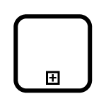

# BPMN activity in Blazor Diagram Component

The `Activity` is the task that is performed in a business process. It is represented by a rounded rectangle.

There are two types of activities. They are listed as follows:

* Task: Occurs within a process and it is not broken down to a finer level of detail.
* Subprocess: Occurs within a process and it is broken down to a finer level of detail.

```cshtml
@using Syncfusion.Blazor.Diagram

@* Initialize Diagram *@
<SfDiagramComponent Height="600px" Nodes="@nodes" />

@code
{
    // Initialize the node collection with node.
    DiagramObjectCollection<Node> nodes;

    protected override void OnInitialized()
    {
        nodes = new DiagramObjectCollection<Node>();
        Node node = new Node()
        {
            // Position of the node.
            OffsetX = 100,
            OffsetY = 100,
            // Size of the node.
            Width = 100,
            Height = 100,
            // Unique Id of the node.
            ID = "node1",
            // Sets the shape to activity.
            Shape = new BpmnActivity() 
            { 
                ActivityType = BpmnActivityType.Task 
            },
        };
        nodes.Add(node);
    }
}
```

## BPMN activity task

The `TaskType` property of the node allows you to define the type of task such as sending, receiving, user-based task, etc. By default, the `TaskType` property of task is set to **None**. This is shown by a small event symbol in the top of the corner. The following code explains how to create different types of BPMN tasks.

```cshtml
@using Syncfusion.Blazor.Diagram

@* Initialize Diagram *@
<SfDiagramComponent Height="600px" Nodes="@nodes"/>

@code
{
    // Initialize the node collection with node.
    DiagramObjectCollection<Node> nodes;

    protected override void OnInitialized()
    {
        nodes = new DiagramObjectCollection<Node>();
        Node node = new Node()
        {
            // Position of the node.
            OffsetX = 100,
            OffsetY = 100,
            // Size of the node.
            Width = 100,
            Height = 100,
            // Unique Id of the node.
            ID = "node1",
            // Sets shape to BpmnActivity.
            Shape = BpmnActivity() 
            { 
                ActivityType = BpmnActivityType.Task,
                // Sets the type of the task to Send.
                TaskType = BpmnTaskType.Send
            },
        };
        nodes.Add(node);
    }   
}
```

The various types of BPMN tasks are tabulated as follows.

| Shape | Image |
| -------- | -------- |
| Service |  |
| Send |  |
| Receive |  |
| Instantiating Receive |  |
| Manual | |
| Business Rule |  |
| User |  |
| Script |  |

## BPMN activity collapsed sub-process

A `Collapsed Sub-process` is a group of tasks that is used to hide or reveal details of additional levels. The following code explains how to create a `Collapsed Sub-Process`.

```cshtml
@using Syncfusion.Blazor.Diagram

@* Initialize Diagram *@
<SfDiagramComponent Height="600px" Nodes="@nodes"/>

@code
{
    // Initialize the node collection with node.
    DiagramObjectCollection<Node> nodes;

    protected override void OnInitialized()
    {
        nodes = new DiagramObjectCollection<Node>();
        Node node = new Node()
        {
            // Position of the node.
            OffsetX = 100,
            OffsetY = 100,
            // Size of the node.
            Width = 100,
            Height = 100,
            // Unique Id of the node.
            ID = "node1",
            // Sets the shape to activity.
            Shape =  BpmnActivity()
            {
                // Sets activity type to subprocess.
                ActivityType = BpmnActivityType.CollapsedSubProcess,
            },
        };
        nodes.Add(node);
    }
}
```

### Loop

`LoopActivity` is a task that is internally being looped. The `LoopActivity` property of `BpmnActivity` allows you to define the type of loop. The default value for `LoopActivity` is **None**. You can define the LoopActivity property in BPMN Activity as shown in the following code.

```cshtml
@using Syncfusion.Blazor.Diagram

@* Initialize Diagram *@
<SfDiagramComponent Height="600px" Nodes="@nodes"/>

@code
{       
    // Initialize the node collection with node.
    DiagramObjectCollection<Node> nodes;

    protected override void OnInitialized()
    {
        nodes = new DiagramObjectCollection<Node>();
        Node node = new Node()
        {
            // Position of the node.
            OffsetX = 100,
            OffsetY = 100,
            // Size of the node.
            Width = 100,
            Height = 100,
            // Unique Id of the node.
            ID = "node1",
            // Defines the shape to activity.
            Shape = new BpmnActivity()
            {
                ActivityType = BpmnActivityType.CollapsedSubProcess,
                LoopActivity = BpmnLoopCharacteristic.Standard,
            }
        };
        nodes.Add(node);
    }
}
```

The following table contains various types of BPMN loops.

| LoopActivity | Task | Subprocess |
| -------- | -------- | --------|
| None |   |  |
| Standard |   |  |
| SequenceMultiInstance |  |  |
| ParallelMultiInstance |  |  |

### Compensation

`IsCompensationActivity` is triggered when the operation is partially failed and enabled it with the    `IsCompensationActivity` property of the Activity.By default the `IsCompensationActivity` is set to false.

```cshtml
@using Syncfusion.Blazor.Diagram

@* Initialize Diagram *@
<SfDiagramComponent Height="600px" Nodes="@nodes" />

@code
{
    // Initialize the node collection with node.
    DiagramObjectCollection<Node> nodes;

    protected override void OnInitialized()
    {
        nodes = new DiagramObjectCollection<Node>();
        Node node1 = new Node()
        {
            // Position of the node.
            OffsetX = 100,
            OffsetY = 100,
            // Size of the node.
            Width = 100,
            Height = 100,
            // Unique id of the node.
            ID = "node1",
            // Defines the shape to activity.
            Shape = BpmnActivity()
            {
                ActivityType = BpmnActivityType.Task,
                // Set compensation to true.
                IsCompensationActivity = true,
            }
        };
        nodes.Add(node1);
    }
}
```
 | Task | Subprocess |
| -------- | -------- |
 ||

### Call

A `Call` activity is a global sub-process that is reused at various points of the business flow and set it with the `IsCallActivity` property of the task.

```cshtml
@using Syncfusion.Blazor.Diagram

@* Initialize Diagram *@
<SfDiagramComponent Height="600px" Nodes="@nodes"/>

@code
{
    // Initialize the node collection with node.
    DiagramObjectCollection<Node> nodes;

    protected override void OnInitialized()
    {
        nodes = new DiagramObjectCollection<Node>();
        Node node = new Node()
        {
            // Position of the node.
            OffsetX = 100,
            OffsetY = 100,
            // Size of the node.
            Width = 100,
            Height = 100,
            // Unique Id of the node.
            ID = "node1",         
            // Defines the shape to activity.
            Shape = new BpmnActivity()
            {
                ActivityType = BpmnActivityType.Task,
                // Sets call to true.
                IsCallActivity = true,
            }
        };
        nodes.Add(node);
    }
}
```


### Ad-Hoc

An ad-hoc subprocess is a group of tasks that are executed in any order or skipped in order to fulfill the end condition and set it with the `IsAdhocActivity` property of subprocess.

```cshtml
@using Syncfusion.Blazor.Diagram

@* Initialize Diagram *@
<SfDiagramComponent Height="600px" Nodes="@nodes" />

@code
{
    // Initialize the node collection with node.
    DiagramObjectCollection<Node> nodes;

    protected override void OnInitialized()
    {
        nodes = new DiagramObjectCollection<Node>();
        Node node = new Node()
        {
            // Position of the node.
            OffsetX = 100,
            OffsetY = 100,
            // Size of the node.
            Width = 100,
            Height = 100,
            // Unique id of the node.
            ID = "node1",
            // Defines shape to activity
            Shape = new BpmnActivity()
            { 
                ActivityType = BpmnActivityType.Subprocess, 
                IsCompensation = true, 
                SubProcessType = BpmnSubProcessType.Transaction,
                IsAdhoc = true
            }
        };
        nodes.Add(node);
    }
}
```


### SubProcessType

SubProcessType represents the type of task that is being processed. The `SubProcessType` property of subprocess allows you to define the type of SubProcessType. By default, it is set to **Default**.

```cshtml
@using Syncfusion.Blazor.Diagram

@* Initialize Diagram *@
<SfDiagramComponent Height="600px" Nodes="@nodes" />

@code
{
    // Initialize the node collection with node.
    DiagramObjectCollection<Node> nodes;

    protected override void OnInitialized()
    {
        nodes = new DiagramObjectCollection<Node>();
        Node node = new Node()
        {
            // Position of the node.
            OffsetX = 100,
            OffsetY = 100,
            // Size of the node.
            Width = 100,
            Height = 100,
            // Unique Id of the node.
            ID = "node1",
            // Sets shape to Activity.
            Shape = new BpmnActivity() 
            { 
                ActivityType = BpmnActivityType.Subprocess, 
                IsCompensation = true, 
                SubProcessType = BpmnSubProcessType.Transaction,
            }
        };
        nodes.Add(node);
    }
}
```

The following table contains various types of BPMN boundaries.

| SubProcessType | Image |
| -------- | -------- |
| Call |  |
| Event |  |
| Transaction |  |
| Default |  |
