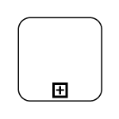

# BPMN Activity in Diagram Component

The [Activity](https://help.syncfusion.com/cr/blazor/Syncfusion.Blazor.Diagram.BpmnActivity.html) is the task that is performed in a business process. It is represented by a rounded rectangle.

There are two types of activities. They are listed as follows:

* [Task](https://help.syncfusion.com/cr/blazor/Syncfusion.Blazor.Diagram.BpmnActivityType.html#Syncfusion_Blazor_Diagram_BpmnActivityType_Task): It occurs within a process and is not broken down to a finer level of detail.
* [CollapsedSubProcess](https://help.syncfusion.com/cr/blazor/Syncfusion.Blazor.Diagram.BpmnActivityType.html#Syncfusion_Blazor_Diagram_BpmnActivityType_CollapsedSubProcess): It occurs within a process and is broken down to a finer level of detail.

You can specify the any one of the above activity type using the [ActivityType](https://help.syncfusion.com/cr/blazor/Syncfusion.Blazor.Diagram.BpmnActivity.html#Syncfusion_Blazor_Diagram_BpmnActivity_ActivityType) property of [Bpmn Activity](https://help.syncfusion.com/cr/blazor/Syncfusion.Blazor.Diagram.BpmnActivity.html).

```cshtml
@using Syncfusion.Blazor.Diagram

@* Initialize Diagram *@
<SfDiagramComponent Height="600px" Nodes="@nodes" />

@code
{
    // Initialize the diagram's nodes collection.
    DiagramObjectCollection<Node> nodes;

    protected override void OnInitialized()
    {
        nodes = new DiagramObjectCollection<Node>();
        Node node = new Node()
        {
            // Position of the node.
            OffsetX = 100,
            OffsetY = 100,
            // Size of the node.
            Width = 100,
            Height = 100,
            // Unique Id of the node.
            ID = "node1",
            // Sets the shape to activity.
            Shape = new BpmnActivity() 
            { 
                ActivityType = BpmnActivityType.Task 
            },
        };
        nodes.Add(node);
    }
}
```
You can download a complete working sample from [GitHub](https://github.com/SyncfusionExamples/Blazor-Diagram-Examples/tree/master/UG-Samples/BpmnEditor/BpmnActivity/BpmnActivity)

  

## How to Create a BPMN Activity Task

The [TaskType](https://help.syncfusion.com/cr/blazor/Syncfusion.Blazor.Diagram.BpmnActivity.html#Syncfusion_Blazor_Diagram_BpmnActivity_TaskType) property of the  [Bpmn Activity](https://help.syncfusion.com/cr/blazor/Syncfusion.Blazor.Diagram.BpmnActivity.html) allows you to define the type of task such as sending, receiving, user-based task, etc. By default, the value of [TaskType](https://help.syncfusion.com/cr/blazor/Syncfusion.Blazor.Diagram.BpmnActivity.html#Syncfusion_Blazor_Diagram_BpmnActivity_TaskType) property is set to **None.** This is shown by a small event symbol in the top of the corner. The following code explains how to create different types of BPMN tasks.

```cshtml
@using Syncfusion.Blazor.Diagram

@* Initialize Diagram *@
<SfDiagramComponent Height="600px" Nodes="@nodes"/>

@code
{
    // Initialize the node collection with node.
    DiagramObjectCollection<Node> nodes;

    protected override void OnInitialized()
    {
        nodes = new DiagramObjectCollection<Node>();
        {
            // Position of the node.
            OffsetX = 100,
            OffsetY = 100,
            // Size of the node.
            Width = 100,
            Height = 100,
            // Unique Id of the node.
            ID = "node1",
            // Sets the shape to activity.
            Shape = new BpmnActivity()
            {
                ActivityType = BpmnActivityType.Task,
                // Sets the type of the task to Send.
                TaskType = BpmnTaskType.Send
            },
        };
        nodes.Add(node);
    }   
}
```
You can download a complete working sample from [GitHub](https://github.com/SyncfusionExamples/Blazor-Diagram-Examples/tree/master/UG-Samples/BpmnEditor/BpmnActivity/BpmnActivityTask)


  

The various types of BPMN tasks are tabulated as follows.

| Shape | Image | Description|
| -------- | -------- | -------- |
| [Service](https://help.syncfusion.com/cr/blazor/Syncfusion.Blazor.Diagram.BpmnTaskType.html#Syncfusion_Blazor_Diagram_BpmnTaskType_Service) |  |A Service task is a task that uses a web service, an automated application, or other kinds of service in completing the task.|
| [Send](https://help.syncfusion.com/cr/blazor/Syncfusion.Blazor.Diagram.BpmnTaskType.html#Syncfusion_Blazor_Diagram_BpmnTaskType_Send) |  |A Send task represents a task that sends a message from one to another. The task is completed once the message has been sent.|
| [Receive](https://help.syncfusion.com/cr/blazor/Syncfusion.Blazor.Diagram.BpmnTaskType.html#Syncfusion_Blazor_Diagram_BpmnTaskType_Receive) |  |A Receive task indicates the wait for the arrival of a certain message. The task is completed once the message has been received.|
| [Instantiating Receive](https://help.syncfusion.com/cr/blazor/Syncfusion.Blazor.Diagram.BpmnTaskType.html#Syncfusion_Blazor_Diagram_BpmnTaskType_InstantiatingReceive) |  |A receive task is used to instantiate a process that is the receive task replace the message start event.|
| [Manual](https://help.syncfusion.com/cr/blazor/Syncfusion.Blazor.Diagram.BpmnTaskType.html#Syncfusion_Blazor_Diagram_BpmnTaskType_Manual) | |A Manual task is a task that is performed without the aid of any business process execution engine or any application.|
| [Business Rule](https://help.syncfusion.com/cr/blazor/Syncfusion.Blazor.Diagram.BpmnTaskType.html#Syncfusion_Blazor_Diagram_BpmnTaskType_BusinessRule[) |  |A Business Rule task is used to synchronously execute one or more rules.|
| [User](https://help.syncfusion.com/cr/blazor/Syncfusion.Blazor.Diagram.BpmnTaskType.html#Syncfusion_Blazor_Diagram_BpmnTaskType_User) |  |A User task represents that a human performer performs the task with the use of a software application.|
| [Script](https://help.syncfusion.com/cr/blazor/Syncfusion.Blazor.Diagram.BpmnTaskType.html#Syncfusion_Blazor_Diagram_BpmnTaskType_Script) |  |A Script task is an automated activity when a process execution arrives at the Script task, the corresponding script is executed.|

## How to Create a BPMN Activity Collapsed Sub-Process

A [CollapsedSubProcess](https://help.syncfusion.com/cr/blazor/Syncfusion.Blazor.Diagram.BpmnActivityType.html#Syncfusion_Blazor_Diagram_BpmnActivityType_CollapsedSubProcess) is a group of tasks that is used to hide or reveal details of additional levels. The following code explains how to create a [CollapsedSubProcess](https://help.syncfusion.com/cr/blazor/Syncfusion.Blazor.Diagram.BpmnActivityType.html#Syncfusion_Blazor_Diagram_BpmnActivityType_CollapsedSubProcess).

```cshtml
@using Syncfusion.Blazor.Diagram

@* Initialize Diagram *@
<SfDiagramComponent Height="600px" Nodes="@nodes"/>

@code
{
    // Initialize the node collection with node.
    DiagramObjectCollection<Node> nodes;

    protected override void OnInitialized()
    {
        nodes = new DiagramObjectCollection<Node>();
        Node node = new Node()
        {
            // Position of the node.
            OffsetX = 100,
            OffsetY = 100,
            // Size of the node.
            Width = 100,
            Height = 100,
            // Unique Id of the node.
            ID = "node1",
            // Sets the shape to activity.
            Shape = new BpmnActivity()
            {
                // Sets activity type to CollapsedSubProcess.
                ActivityType = BpmnActivityType.CollapsedSubProcess
            },
        };
        nodes.Add(node);
    }
}
```
You can download a complete working sample from [GitHub](https://github.com/SyncfusionExamples/Blazor-Diagram-Examples/tree/master/UG-Samples/BpmnEditor/BpmnActivity/BpmnActivityCollapsedSubProcess)


 

### How to Set Loop Type

[Loop](https://help.syncfusion.com/cr/blazor/Syncfusion.Blazor.Diagram.BpmnActivity.html#Syncfusion_Blazor_Diagram_BpmnActivity_Loop) is a task that is internally being looped. The [Loop](https://help.syncfusion.com/cr/blazor/Syncfusion.Blazor.Diagram.BpmnActivity.html#Syncfusion_Blazor_Diagram_BpmnActivity_Loop) property of [Bpmn Activity](https://help.syncfusion.com/cr/blazor/Syncfusion.Blazor.Diagram.BpmnActivity.html) allows you to define the type of loop. The default value for [Loop](https://help.syncfusion.com/cr/blazor/Syncfusion.Blazor.Diagram.BpmnActivity.html#Syncfusion_Blazor_Diagram_BpmnActivity_Loop) is **None**. 

You can define the `Loop` property in BPMN Activity, as shown in the following code.

```cshtml
@using Syncfusion.Blazor.Diagram

@* Initialize Diagram *@
<SfDiagramComponent Height="600px" Nodes="@nodes"/>

@code
{       
    // Initialize the node collection with node.
    DiagramObjectCollection<Node> nodes;

    protected override void OnInitialized()
    {
        nodes = new DiagramObjectCollection<Node>();
        Node node = new Node()
        {
            // Position of the node.
            OffsetX = 100,
            OffsetY = 100,
            // Size of the node.
            Width = 100,
            Height = 100,
            // Unique Id of the node.
            ID = "node1",
            // Defines the shape to activity.
            Shape = new BpmnActivity()
            {
                ActivityType = BpmnActivityType.Task,
                Loop = BpmnLoopCharacteristic.Standard,
            }
        };
        nodes.Add(node);
    }
}
```
You can download a complete working sample from [GitHub](https://github.com/SyncfusionExamples/Blazor-Diagram-Examples/tree/master/UG-Samples/BpmnEditor/BpmnActivity/Loop)


  

The following table contains various types of BPMN loops.

| LoopActivity | Task | Subprocess | Description|
| -------- | -------- | --------| --------|
| [None](https://help.syncfusion.com/cr/blazor/Syncfusion.Blazor.Diagram.BpmnLoopCharacteristic.html#Syncfusion_Blazor_Diagram_BpmnLoopCharacteristic_None) |   |  |None of the shape shows in the sub-process.|
| [Standard](https://help.syncfusion.com/cr/blazor/Syncfusion.Blazor.Diagram.BpmnLoopCharacteristic.html#Syncfusion_Blazor_Diagram_BpmnLoopCharacteristic_Standard) |   |  |Loop marker indicates that the sub-process repeats itself in the sequence.|
| [SequenceMultiInstance](https://help.syncfusion.com/cr/blazor/Syncfusion.Blazor.Diagram.BpmnLoopCharacteristic.html#Syncfusion_Blazor_Diagram_BpmnLoopCharacteristic_SequenceMultiInstance) |  |  |Multi-Instance marker indicates that the sub-process can run with other identical sub-processes simultaneously. The three horizontal lines indicate the sequential execution.|
| [ParallelMultiInstance](https://help.syncfusion.com/cr/blazor/Syncfusion.Blazor.Diagram.BpmnLoopCharacteristic.html#Syncfusion_Blazor_Diagram_BpmnLoopCharacteristic_ParallelMultiInstance) |  |  |Multi-Instance marker indicates that the sub-process can run with other identical sub-processes simultaneously. The three vertical lines indicate that the instances will be executed in parallel.|

### How to Enable Compensation

[IsCompensation](https://help.syncfusion.com/cr/blazor/Syncfusion.Blazor.Diagram.BpmnActivity.html#Syncfusion_Blazor_Diagram_BpmnActivity_IsCompensation) is triggered when the operation is partially failed and enabled it with the [IsCompensation](https://help.syncfusion.com/cr/blazor/Syncfusion.Blazor.Diagram.BpmnActivity.html#Syncfusion_Blazor_Diagram_BpmnActivity_IsCompensation) property of the [Bpmn Activity](https://help.syncfusion.com/cr/blazor/Syncfusion.Blazor.Diagram.BpmnActivity.html). By default, the [IsCompensation](https://help.syncfusion.com/cr/blazor/Syncfusion.Blazor.Diagram.BpmnActivity.html#Syncfusion_Blazor_Diagram_BpmnActivity_IsCompensation) property is set to false.

```cshtml
@using Syncfusion.Blazor.Diagram

@* Initialize Diagram *@
<SfDiagramComponent Height="600px" Nodes="@nodes" />

@code
{
    // Initialize the node collection with node.
    DiagramObjectCollection<Node> nodes;

    protected override void OnInitialized()
    {
        nodes = new DiagramObjectCollection<Node>();
        Node node = new Node()
        {
            // Position of the node.
            OffsetX = 100,
            OffsetY = 100,
            // Size of the node.
            Width = 100,
            Height = 100,
            // Unique Id of the node.
            ID = "node1",
            // Defines the shape to activity.
            Shape = new BpmnActivity()
            {
                ActivityType = BpmnActivityType.Task,
                // Set compensation to true.
                IsCompensation = true,
            }
        };
        nodes.Add(node1);
    }
}
```
You can download a complete working sample from [GitHub](https://github.com/SyncfusionExamples/Blazor-Diagram-Examples/tree/master/UG-Samples/BpmnEditor/BpmnActivity/Compensation)


 

### How to Enable Call

A Call activity is a global sub-process that is reused at various points of the business flow. To create a call activity, enable the [IsCall](https://help.syncfusion.com/cr/blazor/Syncfusion.Blazor.Diagram.BpmnActivity.html#Syncfusion_Blazor_Diagram_BpmnActivity_IsCall) property of the [Bpmn Activity](https://help.syncfusion.com/cr/blazor/Syncfusion.Blazor.Diagram.BpmnActivity.html).

N>* By default, the [IsCall](https://help.syncfusion.com/cr/blazor/Syncfusion.Blazor.Diagram.BpmnActivity.html#Syncfusion_Blazor_Diagram_BpmnActivity_IsCall) property is false.
<br/>* This Property is only applicable for [Task](https://help.syncfusion.com/cr/blazor/Syncfusion.Blazor.Diagram.BpmnActivityType.html#Syncfusion_Blazor_Diagram_BpmnActivityType_Task) Type Activity.

```cshtml
@using Syncfusion.Blazor.Diagram

@* Initialize Diagram *@
<SfDiagramComponent Height="600px" Nodes="@nodes"/>

@code
{
    // Initialize the node collection with node.
    DiagramObjectCollection<Node> nodes;

    protected override void OnInitialized()
    {
        nodes = new DiagramObjectCollection<Node>();
        Node node = new Node()
        {
            // Position of the node.
            OffsetX = 100,
            OffsetY = 100,
            // Size of the node.
            Width = 100,
            Height = 100,
            // Unique Id of the node.
            ID = "node1",         
            // Defines the shape to activity.
            Shape = new BpmnActivity()
            {
                ActivityType = BpmnActivityType.Task,
                // Sets call to true.
                IsCall = true,
            }
        };
        nodes.Add(node);
    }
}
```
You can download a complete working sample from [GitHub](https://github.com/SyncfusionExamples/Blazor-Diagram-Examples/tree/master/UG-Samples/BpmnEditor/BpmnActivity/Call)


### How to Enable Ad-Hoc

An Ad-Hoc sub-process is a group of tasks that are executed in any order or skipped in order to fulfill the end condition and set it with the [IsAdhoc](https://help.syncfusion.com/cr/blazor/Syncfusion.Blazor.Diagram.BpmnActivity.html#Syncfusion_Blazor_Diagram_BpmnActivity_IsAdhoc) property of [Bpmn Activity](https://help.syncfusion.com/cr/blazor/Syncfusion.Blazor.Diagram.BpmnActivity.html).

N>* By default, the [IsAdhoc](https://help.syncfusion.com/cr/blazor/Syncfusion.Blazor.Diagram.BpmnActivity.html#Syncfusion_Blazor_Diagram_BpmnActivity_IsAdhoc) property is false.
<br/>* This Property is only applicable for [Collapsed Sub-Process](https://help.syncfusion.com/cr/blazor/Syncfusion.Blazor.Diagram.BpmnActivityType.html#Syncfusion_Blazor_Diagram_BpmnActivityType_CollapsedSubProcess) Type Activity.

```cshtml
@using Syncfusion.Blazor.Diagram

@* Initialize Diagram *@
<SfDiagramComponent Height="600px" Nodes="@nodes" />

@code
{
    // Initialize the node collection with node.
    DiagramObjectCollection<Node> nodes;

    protected override void OnInitialized()
    {
        nodes = new DiagramObjectCollection<Node>();
        Node node = new Node()
        {
            // Position of the node.
            OffsetX = 100,
            OffsetY = 100,
            // Size of the node.
            Width = 100,
            Height = 100,
            // Unique id of the node.
            ID = "node1",
            // Defines shape to activity
            Shape = new BpmnActivity()
            { 
                ActivityType = BpmnActivityType.CollapsedSubProcess, 
                IsAdhoc = true
            }
        };
        nodes.Add(node);
    }
}
```
You can download a complete working sample from [GitHub](https://github.com/SyncfusionExamples/Blazor-Diagram-Examples/tree/master/UG-Samples/BpmnEditor/BpmnActivity/Adhoc)


### How to Set Sub-Process Type

SubProcessType represents the type of task that is being processed. The [SubProcessType](https://help.syncfusion.com/cr/blazor/Syncfusion.Blazor.Diagram.BpmnActivity.html#Syncfusion_Blazor_Diagram_BpmnActivity_SubProcessType) property of subprocess allows you to define the type of SubProcessType. By default, it is set to [Default](https://help.syncfusion.com/cr/blazor/Syncfusion.Blazor.Diagram.BpmnSubProcessType.html#Syncfusion_Blazor_Diagram_BpmnSubProcessType_Default).

```cshtml
@using Syncfusion.Blazor.Diagram

@* Initialize Diagram *@
<SfDiagramComponent Height="600px" Nodes="@nodes" />

@code
{
    // Initialize the node collection with node.
    DiagramObjectCollection<Node> nodes;

    protected override void OnInitialized()
    {
        nodes = new DiagramObjectCollection<Node>();
        Node node = new Node()
        {
            // Position of the node.
            OffsetX = 100,
            OffsetY = 100,
            // Size of the node.
            Width = 100,
            Height = 100,
            // Unique Id of the node.
            ID = "node1",
            // Sets shape to Activity.
            Shape = new BpmnActivity() 
            { 
                ActivityType = BpmnActivityType.CollapsedSubProcess, 
                SubProcessType = BpmnSubProcessType.Event,
            }
        };
        nodes.Add(node);
    }
}
```
You can download a complete working sample from [GitHub](https://github.com/SyncfusionExamples/Blazor-Diagram-Examples/tree/master/UG-Samples/BpmnEditor/BpmnActivity/SubProcessType)

 

The following table contains various types of BPMN boundaries.

| SubProcessType | Image | Description|
| -------- | -------- | -------- |
| [Call](https://help.syncfusion.com/cr/blazor/Syncfusion.Blazor.Diagram.BpmnSubProcessType.html#Syncfusion_Blazor_Diagram_BpmnSubProcessType_Call) |  |It is a global sub-process that is reused at various points in the business flow.|
| [Event](https://help.syncfusion.com/cr/blazor/Syncfusion.Blazor.Diagram.BpmnSubProcessType.html#Syncfusion_Blazor_Diagram_BpmnSubProcessType_Event) |  |The event sub-process is a sub-process that is triggered by an event. An event sub-process can be added at the process level or at any sub-process level.|
| [Transaction](https://help.syncfusion.com/cr/blazor/Syncfusion.Blazor.Diagram.BpmnSubProcessType.html#Syncfusion_Blazor_Diagram_BpmnSubProcessType_Transaction) |  |It is a specialized sub-process that involves payment.|
|[Default](https://help.syncfusion.com/cr/blazor/Syncfusion.Blazor.Diagram.BpmnSubProcessType.html#Syncfusion_Blazor_Diagram_BpmnSubProcessType_Default) |  |The task that is performed in a business process. It is represented by a rounded rectangle.|
