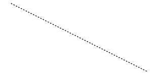
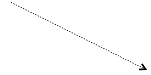
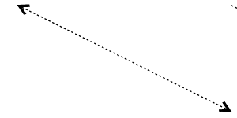
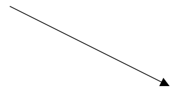
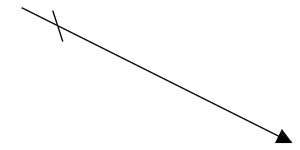
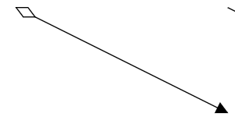
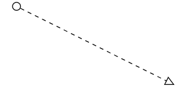
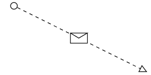
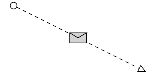

# BPMN Connectors in Diagram Component

The `BPMN Connectors` are lines that connect BPMN flow objects.

They are primarily classified into three categories:
* Association
* Sequence
* Message

## How to Create an Association

An BPMN `AssociationFlow` is used to link flow objects with their corresponding text or artifact. It is represented as a dotted graphical line with an opened arrow. 
To create an association, set the [Flow](https://help.syncfusion.com/cr/blazor/Syncfusion.Blazor.Diagram.BpmnFlow.html#Syncfusion_Blazor_Diagram_BpmnFlow_Flow) property of the [BpmnFlowShape](https://help.syncfusion.com/cr/blazor/Syncfusion.Blazor.Diagram.BpmnFlow.html) should be set to one of the association types.

The available association types are:

* **DirectionalAssociationFlow**: A dotted graphical line with one side arrow.
* **BiDirectionalAssociationFlow**: A dotted graphical line with double side arrow.
* **AssociationFlow**: A dotted graphical line with an opened arrow.

The following code example explains how to create an association.

```cshtml
@using Syncfusion.Blazor.Diagram

@* Initialize Diagram *@
<SfDiagramComponent Height="600px" Connectors="@connectors"/>

@code
{
    // Create connector and store it in the connector collection.
    DiagramObjectCollection<Connector> connectors;

    protected override void OnInitialized()
    {
        connectors = new DiagramObjectCollection<Connector>();
        Connector connector = new Connector()
        {
            // Unique Id of the connector.
            ID = "connector1",
            // Start and end point of the connector
            SourcePoint = new DiagramPoint () { X = 100, Y = 200 },
            TargetPoint = new DiagramPoint () { X = 300, Y = 300 },
            // Sets the type to Bpmn, flow to AssociationFlow.
            Shape = new BpmnFlow()
            {
                Flow = BpmnFlowType.AssociationFlow,
            }
        };
        connectors.Add(connector);
    }
}
```


A complete working sample can be downloaded from [GitHub](https://github.com/SyncfusionExamples/Blazor-Diagram-Examples/tree/master/UG-Samples/BpmnEditor/BpmnConnectors/Association)



The following table shows the visual representation of association flows.

| Association | Image |
| -------- | -------- |
| [AssociationFlow](https://help.syncfusion.com/cr/blazor/Syncfusion.Blazor.Diagram.BpmnFlowType.html#Syncfusion_Blazor_Diagram_BpmnFlowType_AssociationFlow) |  |
| [DirectionalAssociationFlow](https://help.syncfusion.com/cr/blazor/Syncfusion.Blazor.Diagram.BpmnFlowType.html#Syncfusion_Blazor_Diagram_BpmnFlowType_DirectionalAssociationFlow) |  |
| [BiDirectionalAssociationFlow](https://help.syncfusion.com/cr/blazor/Syncfusion.Blazor.Diagram.BpmnFlowType.html#Syncfusion_Blazor_Diagram_BpmnFlowType_BiDirectionalAssociationFlow) |  |

## How to Create a Sequence

A `Sequence` flow shows the order that the activities are performed in a BPMN process and is represented by a solid graphical line. To create a SequenceFlow,set the  `Flow` property of the `BpmnFlowShape` shape to one of the sequence types.

The available sequence types are:

* **SequenceFlow**: Sequence flows represent the typical path between the two flow objects.
* **ConditionalSequenceFlow**: Conditional sequence flows are used to control the flow of a process based on certain conditions.
* **DefaultSequenceFlow**: Default sequence flows are represented by an arrow with a tic mark on one end.

The following code example explains how to create a sequence flow.

```cshtml
@using Syncfusion.Blazor.Diagram

@* Initialize Diagram *@
<SfDiagramComponent Height="600px" Connectors="@connectors"/>

@code
{
    // Create connector and store it in the connector collection.
    DiagramObjectCollection<Connector> connectors;

    protected override void OnInitialized()
    {
        connectors = new DiagramObjectCollection<Connector>();
        Connector connector = new Connector()
        {
            // Unique Id of the connector.
            ID = "connector1",
            // Start and end point of the connector.
            SourcePoint = new DiagramPoint() { X = 100, Y = 200 },
            TargetPoint = new DiagramPoint() { X = 300, Y = 300 },
            // Sets the flow to SequenceFlow.
            Shape = new BpmnFlow()
            {
                Flow = BpmnFlowType.SequenceFlow,
            }
        };
        connectors.Add(connector);
    }
}
```


A complete working sample can be downloaded from [GitHub](https://github.com/SyncfusionExamples/Blazor-Diagram-Examples/tree/master/UG-Samples/BpmnEditor/BpmnConnectors/Sequence)

 

The following table shows the different representations of sequence flows.

| Sequence | Image |
| -------- | -------- |
| [DefaultSequenceFlow](https://help.syncfusion.com/cr/blazor/Syncfusion.Blazor.Diagram.BpmnFlowType.html#Syncfusion_Blazor_Diagram_BpmnFlowType_DefaultSequenceFlow) |  |
| [ConditionalSequenceFlow](https://help.syncfusion.com/cr/blazor/Syncfusion.Blazor.Diagram.BpmnFlowType.html#Syncfusion_Blazor_Diagram_BpmnFlowType_ConditionalSequenceFlow) |  |
| [SequenceFlow](https://help.syncfusion.com/cr/blazor/Syncfusion.Blazor.Diagram.BpmnFlowType.html#Syncfusion_Blazor_Diagram_BpmnFlowType_SequenceFlow) |  |

N> The default value for the property `Sequence` is **Normal.**

## How to Create a Message

A `Message` flows are used when two separately controlled processes communicate and collaborate with one another. An activity or event in one pool can initiate a message to the another pool. Message Flows are depicted as lines with an empty circle indicating where the message originates and an empty arrowhead where the message terminates. To create a MessageFlow, the `Flow` property of the `BpmnFlowShape` should be set to one of the message types.

The available message flow types are:

* **InitiatingMessageFlow**: An activity or event in one pool can initiate a message to another pool.
* **NonInitiatingMessageFlow**: An activity or event in one pool cannot initiate a message to another pool.
* **MessageFlow**: A MessageFlow shows the flow of messages between two participants and is represented by line.

The following code example explains how to define a message flow.

```cshtml
@using Syncfusion.Blazor.Diagram

@* Initialize Diagram *@
<SfDiagramComponent Height="600px" Connectors="@connectors"/>

@code
{
    // Create connector and store it in the connector collection.
    DiagramObjectCollection<Connector> connectors;

    protected override void OnInitialized()
    {
        connectors = new DiagramObjectCollection<Connector>();
        Connector connector = new Connector()
        {
            // Unique Id of the connector.
            ID = "connector1",
            // Start and end point of the connector.
            SourcePoint = new DiagramPoint() { X = 100, Y = 200 },
            TargetPoint = new DiagramPoint() { X = 300, Y = 300 },
            // Sets the flow to MessageFlow.
            Shape = new BpmnFlow()
            {
                Flow = BpmnFlowType.MessageFlow,
            }
        };
        connectors.Add(connector);
    }
}
```


A complete working sample can be downloaded from [GitHub](https://github.com/SyncfusionExamples/Blazor-Diagram-Examples/tree/master/UG-Samples/BpmnEditor/BpmnConnectors/Message)

 

The following table shows the different representations of message flows.

| Message | Image |
| -------- | -------- |
| [MessageFlow](https://help.syncfusion.com/cr/blazor/Syncfusion.Blazor.Diagram.BpmnFlowType.html#Syncfusion_Blazor_Diagram_BpmnFlowType_MessageFlow) |  |
| [InitiatingMessageFlow](https://help.syncfusion.com/cr/blazor/Syncfusion.Blazor.Diagram.BpmnFlowType.html#Syncfusion_Blazor_Diagram_BpmnFlowType_InitiatingMessageFlow) |  |
| [NonInitiatingMessageFlow](https://help.syncfusion.com/cr/blazor/Syncfusion.Blazor.Diagram.BpmnFlowType.html#Syncfusion_Blazor_Diagram_BpmnFlowType_NonInitiatingMessageFlow) |  |

N> The default value for the property `Flow` property of a `BpmnFlow` shape is **SequenceFlow.**
