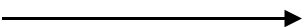

# BPMN Connectors

The `BPMN Connectors` are lines that used to connection between BPMN flow objects.

They are represent in the following types.
* Association
* Sequence
* Message

## Association

The [`BPMN Association`](https://help.syncfusion.com/cr/blazor/Syncfusion.Blazor.Diagrams.BpmnAssociationFlows.html) flow is used to link flow objects with its corresponding text or artifact. An association is represented as a dotted graphical line with an opened arrow. The types of association are as follows:

* Directional
* BiDirectional
* Default

The association property allows you to define the type of association. The following code example explains how to create an association.

```csharp
@using Syncfusion.Blazor.Diagrams
@using System.Collections.ObjectModel

@* Initialize Diagram *@
<SfDiagram Height="600px" Connectors="@ConnectorCollection">
</SfDiagram>

@code{
    //Create connector and stored it to the connector collection
    ObservableCollection<DiagramConnector> ConnectorCollection = new ObservableCollection<DiagramConnector>()
    {
        new DiagramConnector()
        {
            //Unique Id of the connector
            Id="connector1",
            // Start and end point of the connector
            SourcePoint=new ConnectorSourcePoint(){X=100,Y=200},
            TargetPoint=new ConnectorTargetPoint(){X=300,Y=200},
            //Sets the type to Bpmn, flow to Association and association to bidirectional
            Shape=new DiagramConnectorShape()
            {
                Type=ConnectionShapes.Bpmn,
                BpmnFlow=BpmnFlows.Association,
                Association=BpmnAssociationFlows.BiDirectional
            }
        }
    };
}
```

The following table shows the visual representation of association flows.

| Association | Image |
| -------- | -------- |
| Default |  |
| Directional |  |
| BiDirectional |  |

>Note : The default value for the property `Association` is **Default**.

## Sequence

A [`Sequence`](https://help.syncfusion.com/cr/blazor/Syncfusion.Blazor.Diagrams.BpmnSequenceFlows.html) flow shows the order that the activities are performed in a BPMN process and is represented by a solid graphical line. The types of sequence are as follows:

* Normal
* Conditional
* Default

The sequence property allows you to define the type of sequence. The following code example explains how to create a sequence flow.

```csharp
@using Syncfusion.Blazor.Diagrams
@using System.Collections.ObjectModel

@* Initialize Diagram *@
<SfDiagram Height="600px" Connectors="@ConnectorCollection">
</SfDiagram>

@code{
    //Create connector and stored it to the connector collection
    ObservableCollection<DiagramConnector> ConnectorCollection = new ObservableCollection<DiagramConnector>()
    {
        new DiagramConnector()
        {
            //Unique Id of the connector
            Id="connector1",
            // Start and end point of the connector
            SourcePoint=new ConnectorSourcePoint(){X=100,Y=200},
            TargetPoint=new ConnectorTargetPoint(){X=300,Y=200},
            //Sets type to Bpmn, flow to Sequence, and sequence to Conditional
            Shape=new DiagramConnectorShape()
            {
                Type=ConnectionShapes.Bpmn,
                BpmnFlow=BpmnFlows.Sequence,
                Sequence=BpmnSequenceFlows.Conditional
            }
        }
    };
}
```

The following table contains various representation of sequence flows.

| Sequence | Image |
| -------- | -------- |
| Default |  |
| Conditional |  |
| Normal |  |

> Note: The default value for the property `Sequence` is **Normal**.

## Message

A [`Message`](https://help.syncfusion.com/cr/blazor/Syncfusion.Blazor.Diagrams.BpmnMessageFlows.html) flow shows the flow of messages between two participants and is represented by dashed line. The types of message are as follows:

* InitiatingMessage
* NonInitiatingMessage
* Default

The message property allows you to define the type of message. The following code example explains how to define a message flow.

```csharp
@using Syncfusion.Blazor.Diagrams
@using System.Collections.ObjectModel

@* Initialize Diagram *@
<SfDiagram Height="600px" Connectors="@ConnectorCollection">
</SfDiagram>

@code{
    //Create connector and stored it to the connector collection
    ObservableCollection<DiagramConnector> ConnectorCollection = new ObservableCollection<DiagramConnector>()
    {
        new DiagramConnector()
        {
            //Unique Id of the connector
            Id="connector1",
            // Start and end point of the connector
            SourcePoint=new ConnectorSourcePoint(){X=100,Y=200},
            TargetPoint=new ConnectorTargetPoint(){X=300,Y=200},
            //Sets type to Bpmn, flow to Message, and message to InitiatingMessage
            Shape=new DiagramConnectorShape()
            {
                Type=ConnectionShapes.Bpmn,
                BpmnFlow=BpmnFlows.Message,
                Message=BpmnMessageFlows.InitiatingMessage
            }
        }
    };
}
```

The following table contains various representation of message flows.

| Message | Image |
| -------- | -------- |
| Default |  |
| InitiatingMessage |  |
| NonInitiatingMessage |  |

>Note: The default value for the property `Message` is **Default**.
