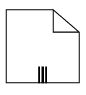
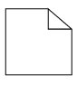
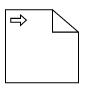
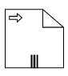
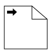

# BPMN Data Object in Blazor Diagram Component

A data object represents information flowing through the process, such as data placed into the process, data resulting from the process, data that needs to be collected, or data that must be stored. To define a [BpmnDataObject](https://help.syncfusion.com/cr/blazor/Syncfusion.Blazor.Diagram.BpmnDataObject.html), the node property [Shape](https://help.syncfusion.com/cr/blazor/Syncfusion.Blazor.Diagram.Shape.html) should be set as [BpmnDataObject](https://help.syncfusion.com/cr/blazor/Syncfusion.Blazor.Diagram.BpmnDataObject.html), and the [DataObjectType](https://help.syncfusion.com/cr/blazor/Syncfusion.Blazor.Diagram.BpmnDataObject.html#Syncfusion_Blazor_Diagram_BpmnDataObject_DataObjectType) property defines whether data is an input or output. You can indicate the collection of data object by setting the [IsCollectiveData](https://help.syncfusion.com/cr/blazor/Syncfusion.Blazor.Diagram.BpmnDataObject.html#Syncfusion_Blazor_Diagram_BpmnDataObject_IsCollectiveData) property of [BpmnDataObject](https://help.syncfusion.com/cr/blazor/Syncfusion.Blazor.Diagram.BpmnDataObject.html) as **True.**

```cshtml
@using Syncfusion.Blazor.Diagram

@* Initialize the Diagram*@
<SfDiagramComponent Height="600px" Nodes="@nodes" />

@code
{
    // Initialize the node collection with node.
    DiagramObjectCollection<Node> nodes;

    protected override void OnInitialized()
    {
        nodes = new DiagramObjectCollection<Node>();
        Node node = new Node()
        {
            // Position of the node.
            OffsetX = 100,
            OffsetY = 100,
            // Size of the node.
            Width = 100,
            Height = 100,
            // Unique Id of the node.
            ID = "node1",
            // Sets shape to DataObject.
            Shape = new BpmnDataObject()
            {
                IsCollectiveData = true,
                DataObjectType = BpmnDataObjectType.None
            }
        };
        nodes.Add(node);
    }
}
```
You can download a complete working sample from [GitHub](https://github.com/SyncfusionExamples/Blazor-Diagram-Examples/tree/master/UG-Samples/BpmnEditor/BpmnDataObject/BpmnDataObject)



The following table contains various representation of the BPMN data object.

| DataObjectType | Symbol |IsCollectiveData| Description|
| -------- | -------- |-------- | -------- |
| [None](https://help.syncfusion.com/cr/blazor/Syncfusion.Blazor.Diagram.BpmnDataObjectType.html#Syncfusion_Blazor_Diagram_BpmnDataObjectType_None) |  | |None of the business processes with the signified information collected within a DataObject|
| [Data Input](https://help.syncfusion.com/cr/blazor/Syncfusion.Blazor.Diagram.BpmnDataObjectType.html#Syncfusion_Blazor_Diagram_BpmnDataObjectType_Input) |  | |Represents the data requirements on which the tasks in the business process depend on with the signified information collected within a DataObject|
| [Data Output](https://help.syncfusion.com/cr/blazor/Syncfusion.Blazor.Diagram.BpmnDataObjectType.html#Syncfusion_Blazor_Diagram_BpmnDataObjectType_Output) |  | |Demonstrates information produced as the result of a business process with the signified information collected within a DataObject|
