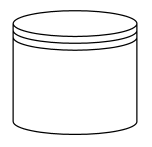

# BPMN Data Store in Blazor Diagram Component

A data store is used to store or access data associated with a business process. To create a data store shape, the node property [Shape](https://help.syncfusion.com/cr/blazor/Syncfusion.Blazor.Diagram.Shape.html) should be set to **BpmnDataStore**. The following code example explains how to create a data store.

```cshtml
@using Syncfusion.Blazor.Diagram

@* Initialize Diagram *@
<SfDiagramComponent Height="600px" Nodes="@nodes"/>

@code
{
    // Initialize the node collection with node.
    DiagramObjectCollection<Node> nodes;

    protected override void OnInitialized()
    {
        nodes = new DiagramObjectCollection<Node>();
        Node node = new Node()
        {
            // Position of the node.
            OffsetX = 100,
            OffsetY = 100,
            // Size of the node.
            Width = 100,
            Height = 100,
            // Unique Id of the node.
            ID = "node1",
            // Sets shape to DataStore.
            Shape = new BpmnDataStore()
        };
        nodes.Add(node);
    }
}
```


A complete working sample can be downloaded from [GitHub](https://github.com/SyncfusionExamples/Blazor-Diagram-Examples/tree/master/UG-Samples/BpmnEditor/BpmnDataStore/BpmnDataStore)


