# BPMN Event in Diagram Component

An [Event](https://help.syncfusion.com/cr/blazor/Syncfusion.Blazor.Diagram.BpmnEvent.html) is a common BPMN process model element that represents something that happens during a business process and is notated with a circle. The type of events are as follows:

* **Start** - Indicates the beginning of the process and every business process start with an event.
* **Intermediate** - Indicates the middle of the process.
* **End** - Indicates the end of the process, and every business process ends with an event.

The [EventType](https://help.syncfusion.com/cr/blazor/Syncfusion.Blazor.Diagram.BpmnEvent.html#Syncfusion_Blazor_Diagram_BpmnEvent_EventType) property of the node allows you to define the type of the event. The default value of the event is [Start](https://help.syncfusion.com/cr/blazor/Syncfusion.Blazor.Diagram.BpmnEventType.html#Syncfusion_Blazor_Diagram_BpmnEventType_Start). The following code example explains how to create a BPMN event.

```cshtml
@using Syncfusion.Blazor.Diagram

@* Initialize Diagram *@
<SfDiagramComponent Height="600px" Nodes="@_nodes" />

@code
{
    // Initialize node collection with Node.
    DiagramObjectCollection<Node> _nodes;

    protected override void OnInitialized()
    {
        _nodes = new DiagramObjectCollection<Node>();
        Node node = new Node()
        {
            // Position of the node.
            OffsetX = 100,
            OffsetY = 100,
            // Size of the node.
            Width = 100,
            Height = 100,
            // Unique Id of the node.
            ID = "node1",
            //Sets shape as BpmnEvent.
            Shape = new BpmnEvent()
            {
                // Set the event type as End.
                EventType = BpmnEventType.End,
            }
        };
        _nodes.Add(node);
    }
}
```


A complete working sample can be downloaded from [GitHub](https://github.com/SyncfusionExamples/Blazor-UG-Examples/blob/master/Diagram/Server/Pages/BpmnEditor/BpmnEvent/BpmnEventTypeSample.razor)

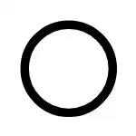

## How to Create a BPMN Event Trigger

Event triggers are notated as icons inside the circle and they represent the specific details of the process. The [Trigger](https://help.syncfusion.com/cr/blazor/Syncfusion.Blazor.Diagram.BpmnEvent.html#Syncfusion_Blazor_Diagram_BpmnEvent_Trigger) property of the node allows you to set the type of trigger and by default, it is set to [None](https://help.syncfusion.com/cr/blazor/Syncfusion.Blazor.Diagram.BpmnEventTrigger.html#Syncfusion_Blazor_Diagram_BpmnEventTrigger_None). The following code example explains how to create a BPMN trigger.

```cshtml

@using Syncfusion.Blazor.Diagram

@* Initialize Diagram *@
<SfDiagramComponent Height="600px" Nodes="@_nodes" />

@code
{
    // Initialize node collection with Node.
    DiagramObjectCollection<Node> _nodes;

    protected override void OnInitialized()
    {
        _nodes = new DiagramObjectCollection<Node>();
        Node node = new Node()
        {
            // Position of the node.
            OffsetX = 100,
            OffsetY = 100,
            // Size of the node.
            Width = 100,
            Height = 100,
            // Unique Id of the node.
            ID = "node1",
            //Sets type as Bpmn and shape as Event
            Shape = new BpmnEvent()
            {
                // Set the event type to NonInterruptingIntermediate and set the trigger as message.
                EventType = BpmnEventType.Start,
                Trigger = BpmnEventTrigger.Message
            }
        };
        _nodes.Add(node);
    }
}
```


A complete working sample can be downloaded from [GitHub](https://github.com/SyncfusionExamples/Blazor-UG-Examples/blob/master/Diagram/Server/Pages/BpmnEditor/BpmnEvent/BpmnEventTriggerSample.razor)


The following table illustrates the type of event triggers.

| Triggers | Start | Non-Interrupting Start | Intermediate | Non-Interrupting Intermediate | Throwing Intermediate | End |
| -------- | -------- | -------- | -------- | -------- | -------- | -------- |
| None | 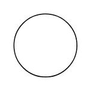  | 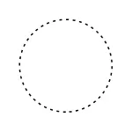 | 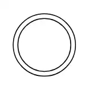 | 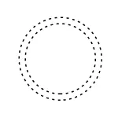 |  |  |

| Message |  |  |  |  | |  |

| Timer | 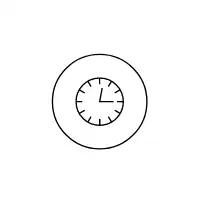 | 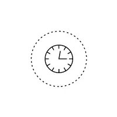 | 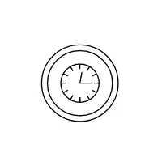|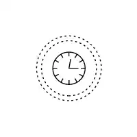 |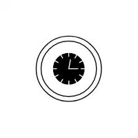|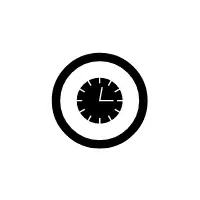

| Conditional |  |  |  | |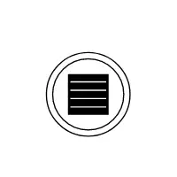||

| Link |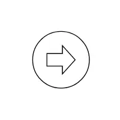  |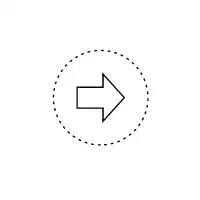  |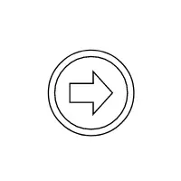 | 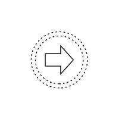| 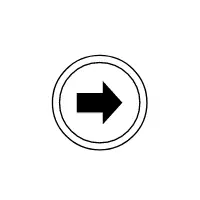 | 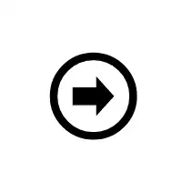|

| Signal |  | 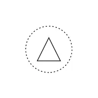 |  |  | 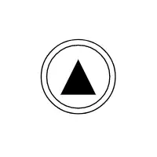 |  |

| Error |  |   |  | |  | |

| Escalation |  |  |  | |  | |

| Terminate  |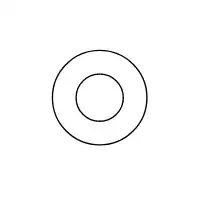 | 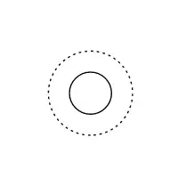|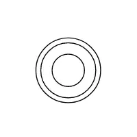 | 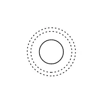 |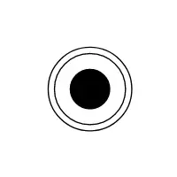 | |

| Compensation || |  | |  | |

| Cancel | | |  | | |  |

| Multiple | 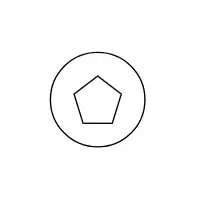 | 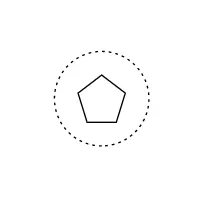  | 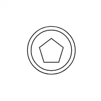 | 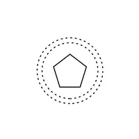 |   |  |

| Parallel |  |  |  |  |  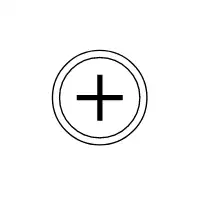  |  |
                   