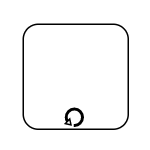

# BPMN Expanded Sub-Process in Blazor Diagram Component

An `BpmnExpandedSubProcess` is used to frame a part of the diagram, shows that elements included in it logically belong together, and has no other semantics other than organizing elements. It is represented by a rounded rectangle.

## How to Create an Expanded Sub-Process
To create an Expanded Sub-Process, define the `Shape` property of the node as [BpmnExpandedSubProcess](https://help.syncfusion.com/cr/blazor/Syncfusion.Blazor.Diagram.BpmnExpandedSubProcess.html) and enable `AllowDrop` constraint of the node.

The following code example explains how to create a BPMN Expanded Sub-Process.

```cshtml
@using Syncfusion.Blazor.Diagram

@* Initialize Diagram *@
<SfDiagramComponent Height="600px" Nodes="@nodes" />

@code
{
    // Initialize node collection with Node.
    DiagramObjectCollection<Node> nodes;

    protected override void OnInitialized()
    {
        nodes = new DiagramObjectCollection<Node>();
        Node node = new Node()
        {
            // Position of the node.
            OffsetX = 500,
            OffsetY = 350,
            // Size of the node.
            Width = 300,
            Height = 300,
            // Unique Id of the node.
            ID = "node1",
            // Sets the shape to activity.
            Shape = new BpmnExpandedSubProcess()
        };
        nodes.Add(node);
    }
}
```


A complete working sample can be downloaded from [GitHub](https://github.com/SyncfusionExamples/Blazor-Diagram-Examples/tree/master/UG-Samples/BpmnEditor/BpmnExpandedSubProcess/BpmnExpandedSubProcess)


## How to Add BPMN Nodes into a BPMN Expanded Sub-Process

To add a BPMN node into [BpmnExpandedSubProcess](https://help.syncfusion.com/cr/blazor/Syncfusion.Blazor.Diagram.BpmnExpandedSubProcess.html), define the BpmnNodeViewModel object and add it to the [Children](https://help.syncfusion.com/cr/blazor/Syncfusion.Blazor.Diagram.BpmnExpandedSubProcess.html#Syncfusion_Blazor_Diagram_BpmnExpandedSubProcess_Children) collection of the `BpmnExpandedSubProcess`.

The following code example explains how to add a BPMN node to an BPMN Expanded Sub-Process using the `Children` property.

```cshtml
@using Syncfusion.Blazor.Diagram

@* Initialize Diagram *@
<SfDiagramComponent Height="600px" Nodes="@nodes" />

@code
{
    // Initialize node collection with Node.
    DiagramObjectCollection<Node> nodes;

    protected override void OnInitialized()
    {
        nodes = new DiagramObjectCollection<Node>();
        Node node1 = new Node()
            {
                ID = "node1",
                OffsetX = 300,
                OffsetY = 300,
                Width = 70,
                Height = 70,
                Shape = new BpmnActivity() { ActivityType = BpmnActivityType.Task }
            };
        nodes.Add(node1);
        Node node2 = new Node()
            {
                ID = "node2",
                Width = 300,
                OffsetX = 500,
                OffsetY = 300,
                Height = 300,
                Constraints = NodeConstraints.Default | NodeConstraints.AllowDrop,
                Shape = new BpmnExpandedSubProcess()
                {
                    Children = new DiagramObjectCollection<string>() { "node1" }
                }
            };
        nodes.Add(node2);
    }
}
```


A complete working sample can be downloaded from [GitHub](https://github.com/SyncfusionExamples/Blazor-Diagram-Examples/tree/master/UG-Samples/BpmnEditor/BpmnExpandedSubProcess/AddChildren)


## How to Add BPMN Nodes into BPMN Expanded Sub-Process at Runtime

* Drag and drop the BPMN nodes to the BPMN ExpandedSubProcess.

While resizing or dragging the child element, if the child element bounds are within the ExpandedSubProcess bounds, the ExpandedSubProcess size will be updated along with that.

The following image shows how to add BPMN node into the BPMN ExpandedSubProcess at runtime.


### How to Set Loop Type

 The [Loop](https://help.syncfusion.com/cr/blazor/Syncfusion.Blazor.Diagram.BpmnExpandedSubProcess.html#Syncfusion_Blazor_Diagram_BpmnExpandedSubProcess_Loop) property in the `BpmnExpandedSubProcess` component defines the type of loop behavior for a task that is internally repeated. By default, the Loop property is set to [None](https://help.syncfusion.com/cr/blazor/Syncfusion.Blazor.Diagram.BpmnLoopCharacteristic.html#Syncfusion_Blazor_Diagram_BpmnLoopCharacteristic_None).
 The Loop property can be configured within the `BpmnExpandedSubProcess` component, as demonstrated in the following example.

```cshtml
@using Syncfusion.Blazor.Diagram

@* Initialize Diagram *@
<SfDiagramComponent Height="600px" Nodes="@nodes"/>

@code
{       
    // Initialize the node collection with node.
    DiagramObjectCollection<Node> nodes;

    protected override void OnInitialized()
    {
        nodes = new DiagramObjectCollection<Node>();
        Node node = new Node()
        {
            // Position of the node.
            OffsetX = 100,
            OffsetY = 100,
            // Size of the node.
            Width = 100,
            Height = 100,
            // Unique Id of the node.
            ID = "node1",
            // Defines the shape to Bpmn ExpandedSubProcess.
            Shape = new BpmnExpandedSubProcess()
            {
                Loop = BpmnLoopCharacteristic.Standard,
            }
        };
        nodes.Add(node);
    }
}
```


A complete working sample can be downloaded from [GitHub](https://github.com/SyncfusionExamples/Blazor-Diagram-Examples/tree/master/UG-Samples/BpmnEditor/BpmnExpandedSubProcess/ExpandedSubProcessLoop)

  

The following table describes the available loop types for an Expanded Sub-Process.


| LoopActivity | Task | Description|
| -------- | -------- | --------|
| [None](https://help.syncfusion.com/cr/blazor/Syncfusion.Blazor.Diagram.BpmnLoopCharacteristic.html#Syncfusion_Blazor_Diagram_BpmnLoopCharacteristic_None) |  |None of the shape shows in the sub-process.|
| [Standard](https://help.syncfusion.com/cr/blazor/Syncfusion.Blazor.Diagram.BpmnLoopCharacteristic.html#Syncfusion_Blazor_Diagram_BpmnLoopCharacteristic_Standard) |  |Loop marker indicates that the sub-process repeats itself in the sequence.|
| [SequenceMultiInstance](https://help.syncfusion.com/cr/blazor/Syncfusion.Blazor.Diagram.BpmnLoopCharacteristic.html#Syncfusion_Blazor_Diagram_BpmnLoopCharacteristic_SequenceMultiInstance) |  | Multi-Instance marker indicates that the sub-process can run with other identical sub-processes simultaneously. The three horizontal lines indicate the sequential execution.|
| [ParallelMultiInstance](https://help.syncfusion.com/cr/blazor/Syncfusion.Blazor.Diagram.BpmnLoopCharacteristic.html#Syncfusion_Blazor_Diagram_BpmnLoopCharacteristic_ParallelMultiInstance) |  | Multi-Instance marker indicates that the sub-process can run with other identical sub-processes simultaneously. The three vertical lines indicate that the instances will be executed in parallel.|

### How to Enable Compensation

[IsCompensation](https://help.syncfusion.com/cr/blazor/Syncfusion.Blazor.Diagram.BpmnExpandedSubProcess.html#Syncfusion_Blazor_Diagram_BpmnExpandedSubProcess_IsCompensation) is triggered when the operation is partially failed and can be enabled with the `IsCompensation` property of the `BpmnExpandedSubProcess`. By default, the `IsCompensation` is set to **false**.

```cshtml
@using Syncfusion.Blazor.Diagram

@* Initialize Diagram *@
<SfDiagramComponent Height="600px" Nodes="@nodes" />

@code
{
    // Initialize the node collection with node.
    DiagramObjectCollection<Node> nodes;

    protected override void OnInitialized()
    {
        nodes = new DiagramObjectCollection<Node>();
        Node node = new Node()
        {
            // Position of the node.
            OffsetX = 100,
            OffsetY = 100,
            // Size of the node.
            Width = 100,
            Height = 100,
            // Unique id of the node.
            ID = "node1",
            // Defines the shape to Bpmn ExpandedSubProcess.
            Shape = new BpmnExpandedSubProcess()
            {
                IsCompensation = true,
            }
        };
        nodes.Add(node);
    }
}
```


A complete working sample can be downloaded from [GitHub](https://github.com/SyncfusionExamples/Blazor-Diagram-Examples/tree/master/UG-Samples/BpmnEditor/BpmnExpandedSubProcess/ExpandedSubProcessCompensation)


 
 
### How to Enable Ad-Hoc

An `Ad-Hoc` Expanded Sub-Process is a group of tasks that are executed in any order or skipped in order to fulfill the end condition and can be set with the [IsAdhoc](https://help.syncfusion.com/cr/blazor/Syncfusion.Blazor.Diagram.BpmnExpandedSubProcess.html#Syncfusion_Blazor_Diagram_BpmnExpandedSubProcess_IsAdhoc) property of `BpmnExpandedSubProcess`.

```cshtml
@using Syncfusion.Blazor.Diagram

@* Initialize Diagram *@
<SfDiagramComponent Height="600px" Nodes="@nodes" />

@code
{
    // Initialize the node collection with node.
    DiagramObjectCollection<Node> nodes;

    protected override void OnInitialized()
    {
        nodes = new DiagramObjectCollection<Node>();
        Node node = new Node()
        {
            // Position of the node.
            OffsetX = 100,
            OffsetY = 100,
            // Size of the node.
            Width = 100,
            Height = 100,
            // Unique id of the node.
            ID = "node1",
            // Defines shape to Bpmn ExpandedSubProcess
            Shape = new BpmnExpandedSubProcess()
            {
                IsAdhoc = true,
            }
        };
        nodes.Add(node);
    }
}
```


A complete working sample can be downloaded from [GitHub](https://github.com/SyncfusionExamples/Blazor-Diagram-Examples/tree/master/UG-Samples/BpmnEditor/BpmnExpandedSubProcess/ExpandedSubProcessAdhoc)


### How to Set Sub-Process Type

The [SubProcessType](https://help.syncfusion.com/cr/blazor/Syncfusion.Blazor.Diagram.BpmnExpandedSubProcess.html#Syncfusion_Blazor_Diagram_BpmnExpandedSubProcess_SubProcessType) represents the type of task being processed within a BPMN expanded subprocess. The `SubProcessType` property of the `BpmnExpandedSubProcess` component allows specification of the subprocess type. By default, it is set to **Default**.

```cshtml
@using Syncfusion.Blazor.Diagram

@* Initialize Diagram *@
<SfDiagramComponent Height="600px" Nodes="@nodes" />

@code
{
    // Initialize the node collection with node.
    DiagramObjectCollection<Node> nodes;

    protected override void OnInitialized()
    {
        nodes = new DiagramObjectCollection<Node>();
        Node node = new Node()
        {
            // Position of the node.
            OffsetX = 100,
            OffsetY = 100,
            // Size of the node.
            Width = 100,
            Height = 100,
            // Unique Id of the node.
            ID = "node1",
            // Sets shape to Bpmn ExpandedSubProcess.
            Shape = new BpmnExpandedSubProcess()
            {
                SubProcessType = BpmnSubProcessType.Event
            }
        };
        nodes.Add(node);
    }
}
```


A complete working sample can be downloaded from [GitHub](https://github.com/SyncfusionExamples/Blazor-Diagram-Examples/tree/master/UG-Samples/BpmnEditor/BpmnExpandedSubProcess/ExpandedSubProcessType)


The following table describes the available sub-process types.

| SubProcessType | Image | Description|
| -------- | -------- | -------- |
| [Call](https://help.syncfusion.com/cr/blazor/Syncfusion.Blazor.Diagram.BpmnSubProcessType.html#Syncfusion_Blazor_Diagram_BpmnSubProcessType_Call) |  |It is a global sub-process that is reused at various points in the business flow.|
| [Event](https://help.syncfusion.com/cr/blazor/Syncfusion.Blazor.Diagram.BpmnSubProcessType.html#Syncfusion_Blazor_Diagram_BpmnSubProcessType_Event) |  |The event sub-process is a sub-process that is triggered by an event. An event sub-process can be added at the process level or at any sub-process level.|
| [Transaction](https://help.syncfusion.com/cr/blazor/Syncfusion.Blazor.Diagram.BpmnSubProcessType.html#Syncfusion_Blazor_Diagram_BpmnSubProcessType_Transaction) |  |It is a specialized sub-process that involves payment.|
| [Default](https://help.syncfusion.com/cr/blazor/Syncfusion.Blazor.Diagram.BpmnSubProcessType.html#Syncfusion_Blazor_Diagram_BpmnSubProcessType_Default) |  |The task that is performed in a business process. It is represented by a rounded rectangle.|

