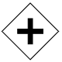
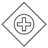

# BPMN Gateway in Blazor Diagram Component

A `BPMN Gateway` is used to control the flow of a process and it is represented in diamond shape. The [GatewayType](https://help.syncfusion.com/cr/blazor/Syncfusion.Blazor.Diagram.BpmnGateway.html#Syncfusion_Blazor_Diagram_BpmnGateway_GatewayType) property of the [BpmnGateway](https://help.syncfusion.com/cr/blazor/Syncfusion.Blazor.Diagram.BpmnGateway.html) can be set with any of the appropriate gateways. By default, the value of [GatewayType](https://help.syncfusion.com/cr/blazor/Syncfusion.Blazor.Diagram.BpmnGateway.html#Syncfusion_Blazor_Diagram_BpmnGateway_GatewayType) is [None](https://help.syncfusion.com/cr/blazor/Syncfusion.Blazor.Diagram.BpmnGatewayType.html#Syncfusion_Blazor_Diagram_BpmnGatewayType_None). The following code example explains how to create a BPMN Gateway.

```cshtml
@using Syncfusion.Blazor.Diagram

@* Initialize Diagram *@
<SfDiagramComponent Height="600px" Nodes="@nodes" />

@code
{
    // Initialize node collection with Node.
    DiagramObjectCollection<Node> nodes;

    protected override void OnInitialized()
    {
        nodes = new DiagramObjectCollection<Node>();
        Node node = new Node()
        {
            //Position of the node.
            OffsetX = 100,
            OffsetY = 100,
            //Size of the node.
            Width = 100,
            Height = 100,
            //Unique Id of the node.
            ID = "node1",
            Shape = new BpmnGateway()
            {
                //Sets gateway type to None.
                GatewayType = BpmnGatewayType.None 
            }
        };
        nodes.Add(node);
    }
}
```
A complete working sample can be downloaded from [GitHub](https://github.com/SyncfusionExamples/Blazor-Diagram-Examples/tree/master/UG-Samples/BpmnEditor/BpmnGateway/BpmnGateway)


N> By default, the `GatewayType` will be set to **None.**

The following table describes the available gateway types.

| Shape | Image | Description|
| -------- | -------- | -------- |
| [None](https://help.syncfusion.com/cr/blazor/Syncfusion.Blazor.Diagram.BpmnGatewayType.html#Syncfusion_Blazor_Diagram_BpmnGatewayType_None) |  |It is represented in diamond shape. None of the symbol shows inside this shape.|
| [Exclusive](https://help.syncfusion.com/cr/blazor/Syncfusion.Blazor.Diagram.BpmnGatewayType.html#Syncfusion_Blazor_Diagram_BpmnGatewayType_Exclusive) |  |It is a state of the business process and based on the condition, breaks the flow into one or more mutually exclusive paths.|
| [Parallel](https://help.syncfusion.com/cr/blazor/Syncfusion.Blazor.Diagram.BpmnGatewayType.html#Syncfusion_Blazor_Diagram_BpmnGatewayType_Parallel) |  |The parallel gateways are used to represent two concurrent tasks in a business flow.|
| [Inclusive](https://help.syncfusion.com/cr/blazor/Syncfusion.Blazor.Diagram.BpmnGatewayType.html#Syncfusion_Blazor_Diagram_BpmnGatewayType_Inclusive) |  |Breaks the process flow into one or more flows.|
| [Complex](https://help.syncfusion.com/cr/blazor/Syncfusion.Blazor.Diagram.BpmnGatewayType.html#Syncfusion_Blazor_Diagram_BpmnGatewayType_Complex) |  |These gateways are only used for the most complex flows in a business process.|
| [EventBased](https://help.syncfusion.com/cr/blazor/Syncfusion.Blazor.Diagram.BpmnGatewayType.html#Syncfusion_Blazor_Diagram_BpmnGatewayType_EventBased) |  |The event-based gateway allows you to make a decision based on events.|
| [ExclusiveEventBased](https://help.syncfusion.com/cr/blazor/Syncfusion.Blazor.Diagram.BpmnGatewayType.html#Syncfusion_Blazor_Diagram_BpmnGatewayType_ExclusiveEventBased) |  |Starts a new process instance with each occurrence of a subsequent event.|
| [ParallelEventBased](https://help.syncfusion.com/cr/blazor/Syncfusion.Blazor.Diagram.BpmnGatewayType.html#Syncfusion_Blazor_Diagram_BpmnGatewayType_ParallelEventBased) |  |This gateway is similar to a parallel gateway. It allows for multiple processes to happen at the same time but unlike the parallel gateway, the processes are event-dependent.|
