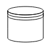

# BPMN Shapes in Blazor Diagram Component

BPMN(Business Process Model and Notation) shapes are used to represent the internal business procedure in a graphical notation and enable you to communicate the procedures in a standard manner. To create a BPMN shape, in the node property shape, type should be set to “Bpmn” and its shape should be set as any one of the built-in shapes.

The following code example explains how to create a simple business process.

```cshtml
@using Syncfusion.Blazor.Diagrams
@using System.Collections.ObjectModel

@* Initialize Diagram *@
<SfDiagram Height="600px" Nodes="@NodeCollection">
</SfDiagram>

@code{

    // To hide gridlines of the diagram

    //Initialize the node collection with Node
    ObservableCollection<DiagramNode> NodeCollection = new ObservableCollection<DiagramNode>()
    {
        new DiagramNode()
        {
            // Position of the node
            OffsetX = 100, OffsetY = 100,
            // Size of the node
            Width = 100, Height = 100,
            // Unique Id of the node
            Id = "node1",
            Shape = new DiagramShape()
            {
                //Sets type to Bpmn
                Type = Shapes.Bpmn
            }
        }
    };
}
```

>Note : The default value for the property [`Shape`](https://help.syncfusion.com/cr/blazor/Syncfusion.Blazor.Diagrams.DiagramNode.html#Syncfusion_Blazor_Diagrams_DiagramNode_Shape) is “event”.

The list of BPMN shapes are as follows:

| Shape | Image |
| -------- | -------- |
| Event |  |
| Gateway |  |
| Task |  |
| Message |  |
| DataSource |  |
| DataObject |  |
| Group |  |