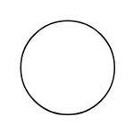
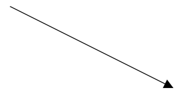
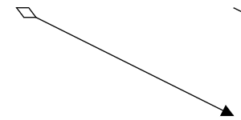
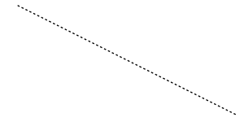
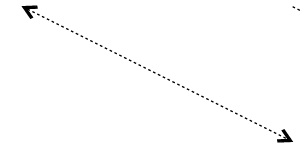
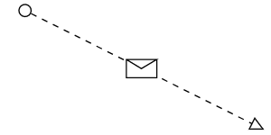

# Controlling BPMN Shapes in Blazor Diagram Component

BPMN (Business Process Model and Notation) shapes are used to represent the internal business procedure in a graphical notation and enable you to communicate the procedures in a standard manner. To create a BPMN shape, the node property [Shape](https://help.syncfusion.com/cr/blazor/Syncfusion.Blazor.Diagram.Shape.html) should be set as any one of the built-in shapes.

The following code example explains how to create a simple business process.

```cshtml
@using Syncfusion.Blazor.Diagram

@* Initialize Diagram *@
<SfDiagramComponent Height="600px" Nodes="@nodes" />

@code
{
    // Initialize node collection with Node.
    DiagramObjectCollection<Node> nodes;

    protected override void OnInitialized()
    {
        nodes = new DiagramObjectCollection<Node>();
        Node node = new Node()
        {
            // Position of the node.
            OffsetX = 100,
            OffsetY = 100,
            // Size of the node.
            Width = 100,
            Height = 100,
            // Unique Id of the node.
            ID = "node1",
            // Sets the shape to activity.
            Shape = new BpmnActivity() 
            { 
                ActivityType = BpmnActivityType.Task 
            },
        };
        nodes.Add(node);
    }
}
```
You can download a complete working sample from [GitHub](https://github.com/SyncfusionExamples/Blazor-Diagram-Examples/tree/master/UG-Samples/BpmnEditor/BpmnShape/BpmnShape)


>**Note:** Node's Id should not start with numbers or special characters and should not contain special characters such as underscore(_) or space.

 

The list of supported BPMN shapes are as follows:

| Shape | Image | Description|
| -------- | -------- | -------- |
| Event |  |Event shape represents something happens during a business process.|
| Gateway |  |Gateway is used to control the flow of a process.|
| Activity |  |Activities describe the kind of work being done in a particular process instance.|
| Message |  |The message is just the content of the communication.|
| DataStore |  |DataStore is used to store or access data associated with a business process.|
| DataObject |  |A DataObject represents information flowing using the process, such as data placed into the process, data resulting from the process, data that needs to be collected, or data that must be stored.|
| TextAnnotation |  |A TextAnnotation points at or references another BPMN shape, which we call as the TextAnnotationTarget of the TextAnnotation.|
| Expanded Sub-Process |  |Organize tasks or processes that have significance in the overall process.|
| Sequence Flow |  |Sequence flows represent the typical path between two flow objects.|
| DefaultSequenceFlow |  |Default sequence flows are represented by an arrow with a tic mark on the one end.|
| ConditionalSequenceFlow |  |Conditional sequence flows are used to control the flow of a process based on the certain conditions.|
| Association |  |An association is represented as a dotted graphical line with an opened arrow.|
| DirectionalAssociationFlow |  |DirectionalAssociation is represented as a dotted graphical line with one side arrow.|
| BiDirectionalAssociationFlow |  |BiDirectionalAssociation is represented as a dotted graphical line with the double side arrow.|
| Message Flow |  |A MessageFlow flow shows the flow of messages between two participants and is represented by line.|
| InitiatingMessageFlow |  |An activity or event in one pool can initiate a message to another pool.|
| NonInitiatingMessageFlow |  |An activity or event in one pool cannot initiate a message to another pool.|
