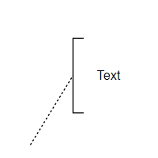
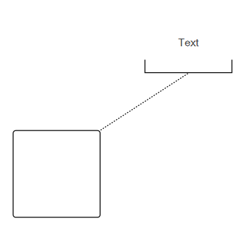
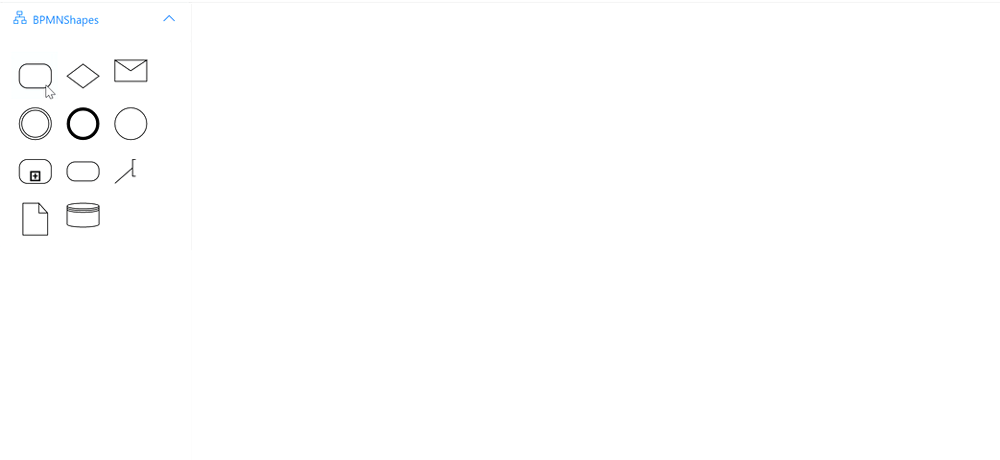
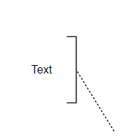
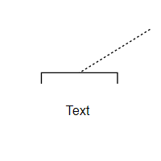
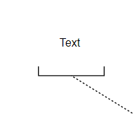

# BPMN Text Annotation in Diagram Component

* A BPMN object can be associated with a text annotation that does not affect the flow but provides information about objects within a flow. 

* A TextAnnotation points to or references another BPMN shape, which we call the [TextAnnotationTarget](https://help.syncfusion.com/cr/blazor/Syncfusion.Blazor.Diagram.BpmnTextAnnotation.html#Syncfusion_Blazor_Diagram_BpmnTextAnnotation_TextAnnotationTarget) of the TextAnnotation. When a target shape is moved, copied, or deleted, any TextAnnotations attached to the shape will be moved, copied, or deleted too. Thus, the TextAnnotations remain with their target shapes though you can reposition the TextAnnotation to any offset from its target. The [TextAnnotationTarget](https://help.syncfusion.com/cr/blazor/Syncfusion.Blazor.Diagram.BpmnTextAnnotation.html#Syncfusion_Blazor_Diagram_BpmnTextAnnotation_TextAnnotationTarget) property of the [BpmnTextAnnotation](https://help.syncfusion.com/cr/blazor/Syncfusion.Blazor.Diagram.BpmnTextAnnotation.html) is used to connect an annotation element to the BPMN Node.

* The annotation element can be switched from a BPMN node to another BPMN node simply by dragging the source end of the annotation connector into the other BPMN node.

* By default, the `TextAnnotation` shape has a connection.

* The [TextAnnotationDirection](https://help.syncfusion.com/cr/blazor/Syncfusion.Blazor.Diagram.BpmnTextAnnotation.html#Syncfusion_Blazor_Diagram_BpmnTextAnnotation_TextAnnotationDirection) property is used to set the shape direction of the text annotation.

* By default, the [TextAnnotationDirection](https://help.syncfusion.com/cr/blazor/Syncfusion.Blazor.Diagram.BpmnTextAnnotation.html#Syncfusion_Blazor_Diagram_BpmnTextAnnotation_TextAnnotationDirection) is set to a [Left](https://help.syncfusion.com/cr/blazor/Syncfusion.Blazor.Diagram.TextAnnotationDirection.html#Syncfusion_Blazor_Diagram_TextAnnotationDirection_Left).

* To set the size for text annotation, use the [Width](https://help.syncfusion.com/cr/blazor/Syncfusion.Blazor.Diagram.Node.html#Syncfusion_Blazor_Diagram_Node_Width) and [Height](https://help.syncfusion.com/cr/blazor/Syncfusion.Blazor.Diagram.Node.html#Syncfusion_Blazor_Diagram_Node_Height) properties of the node.

* The [OffsetX](https://help.syncfusion.com/cr/blazor/Syncfusion.Blazor.Diagram.Node.html#Syncfusion_Blazor_Diagram_Node_OffsetX) and [OffsetY](https://help.syncfusion.com/cr/blazor/Syncfusion.Blazor.Diagram.Node.html#Syncfusion_Blazor_Diagram_Node_OffsetY) properties are used to set the distance between the BPMN node and the TextAnnotation.

* The TextAnnotation element can be moved (if their have connected with any BPMN Node) while dragging the BPMN node.

```cshtml
@using Syncfusion.Blazor.Diagram

@* Initialize Diagram *@
<SfDiagramComponent Height="600px" Nodes="@nodes" />

@code
{
    // Initialize node collection with Node.
    DiagramObjectCollection<Node> nodes;

    protected override void OnInitialized()
    {
        nodes = new DiagramObjectCollection<Node>();
        Node node = new Node()
        {
            // Position of the node.
            OffsetX = 100,
            OffsetY = 100,
            // Size of the node.
            Width = 100,
            Height = 100,
            // Unique Id of the node.
            ID = "node1",
            // Sets type as Bpmn and shape as DataObject
            Shape = new BpmnTextAnnotation()
            {
                TextAnnotationDirection = TextAnnotationDirection.Auto,
            },
            Annotations = new DiagramObjectCollection<ShapeAnnotation>()
            {
                new ShapeAnnotation()
                {
                    Content = "Text",
                },
            }
        };
        nodes.Add(node);
    }
}
```
A complete working sample can be downloaded from [GitHub](https://github.com/SyncfusionExamples/Blazor-Diagram-Examples/tree/master/UG-Samples/BpmnEditor/BpmnTextAnnotation/BpmnTextAnnotation)



The following code example represents how to create a TextAnnotation and connect the Activity and TextAnnotation shape.

```cshtml
@using Syncfusion.Blazor.Diagram

@* Initialize Diagram *@
<SfDiagramComponent Height="600px" Nodes="@nodes" />

@code
{
    // Initialize node collection with Node.
    DiagramObjectCollection<Node> nodes;

    protected override void OnInitialized()
    {
        nodes = new DiagramObjectCollection<Node>();
        Node node1 = new Node()
        {
            // Position of the node.
            OffsetX = 500,
            OffsetY = 500,
            // Size of the node.
            Width = 100,
            Height = 100,
            // Unique Id of the node.
            ID = "node1",
            // Sets the type of shape to Bpmn and shape to activity.
            Shape = new BpmnActivity() 
            { 
                ActivityType = BpmnActivityType.Task 
            },
        };
        nodes.Add(node1);
        Node node2 = new Node()
        {
            // Position of the node.
            OffsetX = 600,
            OffsetY = 350,
            // Size of the node.
            Width = 100,
            Height = 100,
            // Unique Id of the node.
            ID = "node2",
            // Sets type as Bpmn and shape as DataObject
            Shape = new BpmnTextAnnotation()
            {
                TextAnnotationDirection = TextAnnotationDirection.Bottom,
                TextAnnotationTarget = "node1"
            },
            Annotations = new DiagramObjectCollection<ShapeAnnotation>()
            {
                new ShapeAnnotation()
                {
                    Content = "Text",
                },
            }
        };
        nodes.Add(node2);
    }
}

```
You can download a complete working sample from [GitHub](https://github.com/SyncfusionExamples/Blazor-Diagram-Examples/tree/master/UG-Samples/BpmnEditor/BpmnTextAnnotation/TextAnnotationTarget)

 

## How to Connect a Text Annotation to a BPMN Node

Drag and drop any bpmn shapes from the palette to the diagram and connect the BPMN Node and TextAnnotation.

The following image shows how to drag a symbol from the palette and connect the TextAnnotation to the BPMNNode with interaction.



The following table describes the available Text annotation directions

| Direction | Image |
| -------- | -------- |
| [Auto](https://help.syncfusion.com/cr/blazor/Syncfusion.Blazor.Diagram.TextAnnotationDirection.html#Syncfusion_Blazor_Diagram_TextAnnotationDirection_Auto) | |
| [Left](https://help.syncfusion.com/cr/blazor/Syncfusion.Blazor.Diagram.TextAnnotationDirection.html#Syncfusion_Blazor_Diagram_TextAnnotationDirection_Left) | |
| [Right](https://help.syncfusion.com/cr/blazor/Syncfusion.Blazor.Diagram.TextAnnotationDirection.html#Syncfusion_Blazor_Diagram_TextAnnotationDirection_Right) | |
| [Top](https://help.syncfusion.com/cr/blazor/Syncfusion.Blazor.Diagram.TextAnnotationDirection.html#Syncfusion_Blazor_Diagram_TextAnnotationDirection_Top) | |
| [Bottom](https://help.syncfusion.com/cr/blazor/Syncfusion.Blazor.Diagram.TextAnnotationDirection.html#Syncfusion_Blazor_Diagram_TextAnnotationDirection_Bottom) | |
