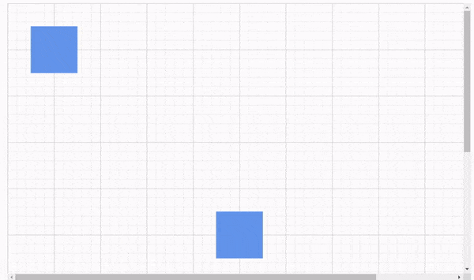
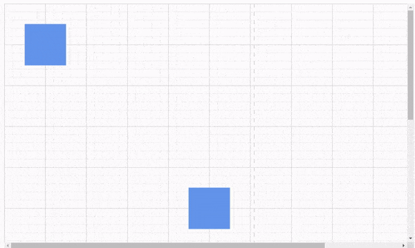
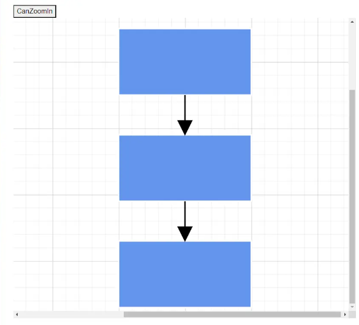

# Commands in Diagram Component

There are several commands available in the diagram as follows.

* Alignment commands
* Distribute commands
* Sizing commands
* Clipboard commands
* Grouping commands
* Z-Order commands
* Zoom commands
* Undo/Redo commands

## Alignment Commands

Alignment commands align selected or defined objects, such as nodes and connectors with respect to the selection boundary. The [SetAlign](https://help.syncfusion.com/cr/blazor/Syncfusion.Blazor.Diagram.SfDiagramComponent.html#Syncfusion_Blazor_Diagram_SfDiagramComponent_SetAlign_Syncfusion_Blazor_Diagram_AlignmentOptions_Syncfusion_Blazor_Diagram_DiagramObjectCollection_Syncfusion_Blazor_Diagram_NodeBase__Syncfusion_Blazor_Diagram_AlignmentMode_) method accepts an [AlignmentOptions](https://help.syncfusion.com/cr/blazor/Syncfusion.Blazor.Diagram.AlignmentOptions.html) value to specify the desired alignment.

### How to Align the Selected Objects to the Left

The following example shows how to align selected objects.

```cshtml
@using Syncfusion.Blazor.Diagram
@using Syncfusion.Blazor.Buttons


<SfButton Content="Left" OnClick="@OnAlignLeft" />

<SfDiagramComponent @ref="diagram" Width="1000px" Height="500px" Nodes="@nodes"  />

@code
{
    //Reference the diagram
    SfDiagramComponent diagram;
    // Initialize diagram's node collection
    DiagramObjectCollection<Node> nodes = new DiagramObjectCollection<Node>();

    protected override void OnInitialized()
    {
        Node node1 = new Node()
            {
                ID = "node1",
                Width = 50,
                Height = 30,
                OffsetX = 500,
                OffsetY = 100,
                Shape = new BasicShape() { Type = NodeShapes.Basic, Shape = NodeBasicShapes.Rectangle }
            };
        nodes.Add(node1);
        Node node2 = new Node()
            {
                ID = "node2",
                Width = 60,
                Height = 40,
                OffsetX = 500,
                OffsetY = 300,
                Shape = new BasicShape() { Type = NodeShapes.Basic, Shape = NodeBasicShapes.Rectangle }
            };
        nodes.Add(node2);
        Node node3 = new Node()
            {
                ID = "node3",
                Width = 70,
                Height = 50,
                OffsetX = 500,
                OffsetY = 500,
                Shape = new BasicShape() { Type = NodeShapes.Basic, Shape = NodeBasicShapes.Rectangle }
            };
        nodes.Add(node3);
    }
    //Method to align selected objects at left of the selection boundary.
    private void OnAlignLeft()
    {
        diagram.SetAlign(AlignmentOptions.Left);
    }
}
```


A complete working sample can be downloaded from [GitHub](https://github.com/SyncfusionExamples/Blazor-UG-Examples/blob/master/Diagram/Server/Pages/Commands/AlignLeft.razor)
### How to Align the Selected Objects to the Right

The following code example illustrates how to align all the selected objects at the right side of the selection boundary.

```cshtml
@using Syncfusion.Blazor.Diagram
@using Syncfusion.Blazor.Buttons


<SfButton Content="Right" OnClick="@OnAlignRight" />

<SfDiagramComponent @ref="diagram" Width="1000px" Height="500px" Nodes="@nodes" Connectors="@Connectors"/>

@code
{
    SfDiagramComponent diagram;
    DiagramObjectCollection<Node> nodes = new DiagramObjectCollection<Node>();
    DiagramObjectCollection<Connector> Connectors = new DiagramObjectCollection<Connector>();

   protected override void OnInitialized()
    {
        Node node1 = new Node()
        {
            ID = "node1",
            Width = 50,
            Height = 30,
            OffsetX = 500,
            OffsetY = 100,
            Shape = new BasicShape() { Type = NodeShapes.Basic, Shape = NodeBasicShapes.Rectangle }
        };
        nodes.Add(node1);
        Node node2 = new Node()
        {
            ID = "node2",
            Width = 60,
            Height = 40,
            OffsetX = 500,
            OffsetY = 300,
            Shape = new BasicShape() { Type = NodeShapes.Basic, Shape = NodeBasicShapes.Rectangle }
        };
        nodes.Add(node2);
        Node node3 = new Node()
        {
            ID = "node3",
            Width = 70,
            Height = 50,
            OffsetX = 500,
            OffsetY = 500,
            Shape = new BasicShape() { Type = NodeShapes.Basic, Shape = NodeBasicShapes.Rectangle }
        };
        nodes.Add(node3);
    }

    private void OnAlignRight()
    {
        //Aligns the selected objects to the right side of the selection boundary.
        diagram.SetAlign(AlignmentOptions.Right);
    }     
}
```


A complete working sample can be downloaded from [GitHub](https://github.com/SyncfusionExamples/Blazor-UG-Examples/blob/master/Diagram/Server/Pages/Commands/AlignRight.razor)
### How to Align the Selected Objects to the Top

The following code example illustrates how to align all the selected objects at the top of the selection boundary.

```cshtml
@using Syncfusion.Blazor.Diagram
@using Syncfusion.Blazor.Buttons


<SfButton Content="Top" OnClick="@OnAlignTop" />

<SfDiagramComponent @ref="diagram" Width="1000px" Height="500px" Nodes="@nodes" Connectors="@Connectors"/>

@code
{
    SfDiagramComponent diagram;
    DiagramObjectCollection<Node> nodes = new DiagramObjectCollection<Node>();
    DiagramObjectCollection<Connector> Connectors = new DiagramObjectCollection<Connector>();

    protected override void OnInitialized()
    {
        Node node1 = new Node()
        {
            ID = "node1",
            Width = 50,
            Height = 30,
            OffsetX = 500,
            OffsetY = 100,
            Shape = new BasicShape() { Type = NodeShapes.Basic, Shape = NodeBasicShapes.Rectangle }
        };
        nodes.Add(node1);
        Node node2 = new Node()
        {
            ID = "node2",
            Width = 60,
            Height = 40,
            OffsetX = 500,
            OffsetY = 300,
            Shape = new BasicShape() { Type = NodeShapes.Basic, Shape = NodeBasicShapes.Rectangle }
        };
        nodes.Add(node2);
        Node node3 = new Node()
        {
            ID = "node3",
            Width = 70,
            Height = 50,
            OffsetX = 500,
            OffsetY = 500,
            Shape = new BasicShape() { Type = NodeShapes.Basic, Shape = NodeBasicShapes.Rectangle }
        };
        nodes.Add(node3);
    }

    private void OnAlignTop()
    {
        //Aligns the selected objects at the top of the selection boundary.
        diagram.SetAlign(AlignmentOptions.Top);
    }       
}
```


A complete working sample can be downloaded from [GitHub](https://github.com/SyncfusionExamples/Blazor-UG-Examples/blob/master/Diagram/Server/Pages/Commands/AlignTop.razor)
### How to Align the Selected Objects to the Bottom

The following code example illustrates how to align all the selected objects at the bottom of the selection boundary.

```cshtml
@using Syncfusion.Blazor.Diagram
@using Syncfusion.Blazor.Buttons


<SfButton Content="Bottom" OnClick="@OnAlignBottom" />

<SfDiagramComponent @ref="diagram" Width="1000px" Height="500px" Nodes="@nodes" Connectors="@Connectors"/>

@code
{
    SfDiagramComponent diagram;
    DiagramObjectCollection<Node> nodes = new DiagramObjectCollection<Node>();
    DiagramObjectCollection<Connector> Connectors = new DiagramObjectCollection<Connector>();

   protected override void OnInitialized()
    {
        Node node1 = new Node()
        {
            ID = "node1",
            Width = 50,
            Height = 30,
            OffsetX = 500,
            OffsetY = 100,
            Shape = new BasicShape() { Type = NodeShapes.Basic, Shape = NodeBasicShapes.Rectangle }
        };
        nodes.Add(node1);
        Node node2 = new Node()
        {
            ID = "node2",
            Width = 60,
            Height = 40,
            OffsetX = 500,
            OffsetY = 300,
            Shape = new BasicShape() { Type = NodeShapes.Basic, Shape = NodeBasicShapes.Rectangle }
        };
        nodes.Add(node2);
        Node node3 = new Node()
        {
            ID = "node3",
            Width = 70,
            Height = 50,
            OffsetX = 500,
            OffsetY = 500,
            Shape = new BasicShape() { Type = NodeShapes.Basic, Shape = NodeBasicShapes.Rectangle }
        };
        nodes.Add(node3);
    }

    private void OnAlignBottom()
    {
        //Aligns the selected objects at the bottom of the selection boundary.
        diagram.SetAlign(AlignmentOptions.Bottom);
    }     
}
```


A complete working sample can be downloaded from [GitHub](https://github.com/SyncfusionExamples/Blazor-UG-Examples/blob/master/Diagram/Server/Pages/Commands/AlignBottom.razor)
### How to Align the Selected Objects to the Middle

The following code example illustrates how to align all the selected objects at the middle of the selection boundary.

```cshtml
@using Syncfusion.Blazor.Diagram
@using Syncfusion.Blazor.Buttons


<SfButton Content="Middle" OnClick="@OnAlignMiddle" />

<SfDiagramComponent @ref="diagram" Width="1000px" Height="500px" Nodes="@nodes" Connectors="@Connectors"/>

@code
{
    SfDiagramComponent diagram;
    DiagramObjectCollection<Node> nodes = new DiagramObjectCollection<Node>();
    DiagramObjectCollection<Connector> Connectors = new DiagramObjectCollection<Connector>();

    protected override void OnInitialized()
    {
        Node node1 = new Node()
        {
            ID = "node1",
            Width = 50,
            Height = 30,
            OffsetX = 500,
            OffsetY = 100,
            Shape = new BasicShape() { Type = NodeShapes.Basic, Shape = NodeBasicShapes.Rectangle }
        };
        nodes.Add(node1);
        Node node2 = new Node()
        {
            ID = "node2",
            Width = 60,
            Height = 40,
            OffsetX = 500,
            OffsetY = 300,
            Shape = new BasicShape() { Type = NodeShapes.Basic, Shape = NodeBasicShapes.Rectangle }
        };
        nodes.Add(node2);
        Node node3 = new Node()
        {
            ID = "node3",
            Width = 70,
            Height = 50,
            OffsetX = 500,
            OffsetY = 500,
            Shape = new BasicShape() { Type = NodeShapes.Basic, Shape = NodeBasicShapes.Rectangle }
        };
        nodes.Add(node3);
    }

    private void OnAlignMiddle()
    {
        //Aligns the selected objects at the middle of the selection boundary
        diagram.SetAlign(AlignmentOptions.Middle);
    }         
}
```


A complete working sample can be downloaded from [GitHub](https://github.com/SyncfusionExamples/Blazor-UG-Examples/blob/master/Diagram/Server/Pages/Commands/AlignMiddle.razor)
### How to Align the Selected Objects to the Center

The following code example illustrates how to align all the selected objects at the center of the selection boundary.

```cshtml
@using Syncfusion.Blazor.Diagram
@using Syncfusion.Blazor.Buttons


<SfButton Content="Center" OnClick="@OnAlignCenter" />

<SfDiagramComponent @ref="diagram" Width="1000px" Height="500px" Nodes="@nodes" Connectors="@Connectors"/>

@code
{
    SfDiagramComponent diagram;
    DiagramObjectCollection<Node> nodes = new DiagramObjectCollection<Node>();
    DiagramObjectCollection<Connector> Connectors = new DiagramObjectCollection<Connector>();

    protected override void OnInitialized()
    {
        Node node1 = new Node()
        {
            ID = "node1",
            Width = 50,
            Height = 30,
            OffsetX = 230,
            OffsetY = 180,
            Shape = new BasicShape() { Type = NodeShapes.Basic, Shape = NodeBasicShapes.Rectangle }
        };
        nodes.Add(node1);
        Node node2 = new Node()
        {
            ID = "node2",
            Width = 60,
            Height = 40,
            OffsetX = 500,
            OffsetY = 300,
            Shape = new BasicShape() { Type = NodeShapes.Basic, Shape = NodeBasicShapes.Rectangle }
        };
        nodes.Add(node2);
        Node node3 = new Node()
        {
            ID = "node3",
            Width = 70,
            Height = 50,
            OffsetX = 235,
            OffsetY = 425,
            Shape = new BasicShape() { Type = NodeShapes.Basic, Shape = NodeBasicShapes.Rectangle }
        };
        nodes.Add(node3);
    }

    private void OnAlignCenter()
    {
        //Aligns the selected objects at the center of the selection boundary.
        diagram.SetAlign(AlignmentOptions.Center);
    }        
}
```


A complete working sample can be downloaded from [GitHub](https://github.com/SyncfusionExamples/Blazor-UG-Examples/blob/master/Diagram/Server/Pages/Commands/AlignCenter.razor)
## How to Distribute Diagram Elements

The [SetDistribute](https://help.syncfusion.com/cr/blazor/Syncfusion.Blazor.Diagram.SfDiagramComponent.html#Syncfusion_Blazor_Diagram_SfDiagramComponent_SetDistribute_Syncfusion_Blazor_Diagram_DistributeOptions_Syncfusion_Blazor_Diagram_DiagramObjectCollection_Syncfusion_Blazor_Diagram_NodeBase__) commands enable place the selected objects on the page at equal intervals from each other. The selected objects are equally spaced within the selection boundary.

The factors to distribute the shapes using [DistributeOptions](https://help.syncfusion.com/cr/blazor/Syncfusion.Blazor.Diagram.DistributeOptions.html) are listed as follows:

* [RightToLeft](https://help.syncfusion.com/cr/blazor/Syncfusion.Blazor.Diagram.DistributeOptions.html#Syncfusion_Blazor_Diagram_DistributeOptions_RightToLeft): Distributes the objects based on the distance between the right and left sides of the adjacent objects.
* [Left](https://help.syncfusion.com/cr/blazor/Syncfusion.Blazor.Diagram.DistributeOptions.html#Syncfusion_Blazor_Diagram_DistributeOptions_Left): Distributes the objects based on the distance between the left sides of the adjacent objects.
* [Right](https://help.syncfusion.com/cr/blazor/Syncfusion.Blazor.Diagram.DistributeOptions.html#Syncfusion_Blazor_Diagram_DistributeOptions_Right): Distributes the objects based on the distance between the right sides of the adjacent objects.
* [Center](https://help.syncfusion.com/cr/blazor/Syncfusion.Blazor.Diagram.DistributeOptions.html#Syncfusion_Blazor_Diagram_DistributeOptions_Center): Distributes the objects based on the distance between the center of the adjacent objects.
* [BottomToTop](https://help.syncfusion.com/cr/blazor/Syncfusion.Blazor.Diagram.DistributeOptions.html#Syncfusion_Blazor_Diagram_DistributeOptions_BottomToTop): Distributes the objects based on the distance between the bottom and top sides of the adjacent objects.
* [Top](https://help.syncfusion.com/cr/blazor/Syncfusion.Blazor.Diagram.DistributeOptions.html#Syncfusion_Blazor_Diagram_DistributeOptions_Top): Distributes the objects based on the distance between the top sides of the adjacent objects.
* [Bottom](https://help.syncfusion.com/cr/blazor/Syncfusion.Blazor.Diagram.DistributeOptions.html#Syncfusion_Blazor_Diagram_DistributeOptions_Bottom): Distributes the objects based on the distance between the bottom sides of the adjacent objects.
* [Middle](https://help.syncfusion.com/cr/blazor/Syncfusion.Blazor.Diagram.DistributeOptions.html#Syncfusion_Blazor_Diagram_DistributeOptions_Middle): Distributes the objects based on the distance between the vertical center of the adjacent objects.

The following code example illustrates how to execute the space commands.

```cshtml
@using Syncfusion.Blazor.Diagram
@using Syncfusion.Blazor.Buttons

<SfButton Content="DistributeLeft" OnClick="@OnDistributeLeft" />
<SfButton Content="DistributeRight" OnClick="@OnDistributeRight" />
<SfButton Content="DistributeTop" OnClick="@OnDistributeTop" />
<SfButton Content="DistributeBottom" OnClick="@OnDistributeBottom" />
<SfButton Content="DistributeCenter" OnClick="@OnDistributeCenter" />
<SfButton Content="DistributeMiddle" OnClick="@OnDistributeMiddle" />
<SfButton Content="DistributeBottomToTop" OnClick="@OnDistributeBottomToTop" />
<SfButton Content="DistributeRightToLeft" OnClick="@OnDistributeRightToLeft" />

<SfDiagramComponent @ref="diagram" Width="1000px" Height="500px" Nodes="@nodes" Connectors="@Connectors" />

@code
{
    SfDiagramComponent diagram;
    DiagramObjectCollection<Node> nodes = new DiagramObjectCollection<Node>();
    DiagramObjectCollection<Connector> Connectors = new DiagramObjectCollection<Connector>();

    protected override void OnInitialized()
    {
        Node node1 = new Node()
            {
                ID = "node1",
                Width = 50,
                Height = 30,
                OffsetX = 500,
                OffsetY = 100,
                Shape = new BasicShape() { Type = NodeShapes.Basic, Shape = NodeBasicShapes.Rectangle }
            };
        nodes.Add(node1);
        Node node2 = new Node()
            {
                ID = "node2",
                Width = 60,
                Height = 40,
                OffsetX = 400,
                OffsetY = 200,
                Shape = new BasicShape() { Type = NodeShapes.Basic, Shape = NodeBasicShapes.Rectangle }
            };
        nodes.Add(node2);
        Node node3 = new Node()
            {
                ID = "node3",
                Width = 70,
                Height = 50,
                OffsetX = 500,
                OffsetY = 300,
                Shape = new BasicShape() { Type = NodeShapes.Basic, Shape = NodeBasicShapes.Rectangle }
            };
        nodes.Add(node3);
    }

    private void OnDistributeLeft()
    {
        //Distributes the objects based on the distance between the left sides of the adjacent objects.
        diagram.SetDistribute(DistributeOptions.Left);
    }

    private void OnDistributeRight()
    {
        //Distributes the objects based on the distance between the right sides of the adjacent objects.
        diagram.SetDistribute(DistributeOptions.Right);
    }

    private void OnDistributeTop()
    {
        //Distributes the objects based on the distance between the top sides of the adjacent objects.
        diagram.SetDistribute(DistributeOptions.Top);
    }

    private void OnDistributeBottom()
    {
        //Distributes the objects based on the distance between the bottom sides of the adjacent objects.
        diagram.SetDistribute(DistributeOptions.Bottom);
    }

    private void OnDistributeMiddle()
    {
        //Distributes the objects based on the distance between vertical centers of the adjacent objects.
        diagram.SetDistribute(DistributeOptions.Middle);
    }

    private void OnDistributeCenter()
    {
        //Distributes the objects based on the distance between the centers of the adjacent objects.
        diagram.SetDistribute(DistributeOptions.Center);
    }

    private void OnDistributeBottomToTop()
    {
        //Distributes the objects based on the distance between bottom and top sides of adjacent objects.
        diagram.SetDistribute(DistributeOptions.BottomToTop);
    }

    private void OnDistributeRightToLeft()
    {
        //Distributes the objects based on the distance between right and left sides of adjacent objects.
        diagram.SetDistribute(DistributeOptions.RightToLeft);
    }
}
```


A complete working sample can be downloaded from [GitHub](https://github.com/SyncfusionExamples/Blazor-UG-Examples/blob/master/Diagram/Server/Pages/Commands/SetDistributeCommands.razor)
## How to Use Sizing Commands

Sizing [SetSameSize](https://help.syncfusion.com/cr/blazor/Syncfusion.Blazor.Diagram.SfDiagramComponent.html#Syncfusion_Blazor_Diagram_SfDiagramComponent_SetSameSize_Syncfusion_Blazor_Diagram_SizingMode_Syncfusion_Blazor_Diagram_DiagramObjectCollection_Syncfusion_Blazor_Diagram_NodeBase__) commands are used to resize all selected object based on the width, height, and size of the reference object (FirstSelectedItem).

[SizingMode](https://help.syncfusion.com/cr/blazor/Syncfusion.Blazor.Diagram.SizingMode.html) are as follows:

* [Width](https://help.syncfusion.com/cr/blazor/Syncfusion.Blazor.Diagram.SizingMode.html#Syncfusion_Blazor_Diagram_SizingMode_Width) : Scales the width of the selected objects.
* [Height](https://help.syncfusion.com/cr/blazor/Syncfusion.Blazor.Diagram.SizingMode.html#Syncfusion_Blazor_Diagram_SizingMode_Height) : Scales the height of the selected objects.
* [Both](https://help.syncfusion.com/cr/blazor/Syncfusion.Blazor.Diagram.SizingMode.html#Syncfusion_Blazor_Diagram_SizingMode_Both) : Scales the selected objects both vertically and horizontally.

The following code example illustrates how to execute the size commands.

```cshtml
@using Syncfusion.Blazor.Diagram
@using Syncfusion.Blazor.Buttons

<SfButton Content="SameSize" OnClick="@OnSameSize" />
<SfButton Content="SameWidth" OnClick="@OnSameWidth" />
<SfButton Content="SameHeight" OnClick="@OnSameHeight" />

<SfDiagramComponent @ref="@diagram" Height="600px" Nodes="@nodes" Connectors="@connectors" />

@code
{
    //Reference to diagram.
    SfDiagramComponent diagram;
    DiagramObjectCollection<Node> nodes = new DiagramObjectCollection<Node>();
    DiagramObjectCollection<Connector> connectors = new DiagramObjectCollection<Connector>();

    protected override void OnInitialized()
    {
        Node node1 = new Node()
        {
            ID = "node1",
            Width = 50,
            Height = 30,
            OffsetX = 500,
            OffsetY = 100,
            Shape = new BasicShape() { Type = NodeShapes.Basic, Shape = NodeBasicShapes.Rectangle },
            Style = new ShapeStyle() { Fill = "#6495ED", StrokeColor = "#6495ED" }
        };
        nodes.Add(node1);
        Node node2 = new Node()
        {
            ID = "node2",
            Width = 60,
            Height = 40,
            OffsetX = 400,
            OffsetY = 200,
            Shape = new BasicShape() { Type = NodeShapes.Basic, Shape = NodeBasicShapes.Rectangle },
            Style = new ShapeStyle() { Fill = "#6495ED", StrokeColor = "#6495ED" }
        };
        nodes.Add(node2);
        Node node3 = new Node()
        {
            ID = "node3",
            Width = 70,
            Height = 50,
            OffsetX = 500,
            OffsetY = 300,
            Shape = new BasicShape() { Type = NodeShapes.Basic, Shape = NodeBasicShapes.Rectangle },
            Style = new ShapeStyle() { Fill = "#6495ED", StrokeColor = "#6495ED" }
        };
        nodes.Add(node3);
    }

    private void OnSameSize()
    {
        //Scales the selected objects both vertically and horizontally.
        diagram.SetSameSize(SizingMode.Both);
    }

    private void OnSameWidth()
    {
        //Scales the width of the selected objects.
        diagram.SetSameSize(SizingMode.Width);
    }

    private void OnSameHeight()
    {
        //Scales the height of the selected objects.
        diagram.SetSameSize(SizingMode.Height);
    }
}
```


A complete working sample can be downloaded from [GitHub](https://github.com/SyncfusionExamples/Blazor-UG-Examples/blob/master/Diagram/Server/Pages/Commands/SizingCommands.razor)
## How to Use Clipboard Commands

Clipboard commands are used to cut, copy, or paste selected elements.

* Cuts the selected elements from the diagram to the diagram’s clipboard using the [Cut](https://help.syncfusion.com/cr/blazor/Syncfusion.Blazor.Diagram.SfDiagramComponent.html#Syncfusion_Blazor_Diagram_SfDiagramComponent_Cut) command.

* Copies the selected elements from the diagram to the diagram’s clipboard using the [Copy](https://help.syncfusion.com/cr/blazor/Syncfusion.Blazor.Diagram.SfDiagramComponent.html#Syncfusion_Blazor_Diagram_SfDiagramComponent_Copy) command.

* Pastes the diagram’s clipboard data (nodes/connectors) into the diagram. Also, when a collection of diagram elements is passed, the passed items will be pasted into the diagram. Otherwise, the cloned copy of elements from the internal clipboard is pasted using the [Paste](https://help.syncfusion.com/cr/blazor/Syncfusion.Blazor.Diagram.SfDiagramComponent.html#Syncfusion_Blazor_Diagram_SfDiagramComponent_Paste_Syncfusion_Blazor_Diagram_DiagramObjectCollection_Syncfusion_Blazor_Diagram_NodeBase__) command.

The following code illustrates the clipboard commands.

```cshtml
@using Syncfusion.Blazor.Diagram
@using Syncfusion.Blazor.Buttons


<SfButton Content="Cut" OnClick="@OnCut" />
<SfButton Content="Copy" OnClick="@OnCopy" />
<SfButton Content="Paste" OnClick="@OnPaste" />
<SfButton Content="PasteWithArgument" OnClick="@PasteWithArgument"/>

<SfDiagramComponent @ref="@diagram" Height="600px" Nodes="@nodes" Connectors="@Connectors"/>

@code
{
    //Reference to diagram.
    SfDiagramComponent diagram;
    DiagramObjectCollection<Node> nodes = new DiagramObjectCollection<Node>();
    DiagramObjectCollection<Connector> Connectors = new DiagramObjectCollection<Connector>();

    protected override void OnInitialized()
    {
        Node node1 = new Node()
        {
            ID = "node1",
            Width = 50,
            Height = 30,
            OffsetX = 500,
            OffsetY = 100,
            Shape = new BasicShape() { Type = NodeShapes.Basic, Shape = NodeBasicShapes.Rectangle },
            Style = new ShapeStyle() { Fill = "#6495ED", StrokeColor = "#6495ED" }
        };
        nodes.Add(node1);
        Node node2 = new Node()
        {
            ID = "node2",
            Width = 60,
            Height = 40,
            OffsetX = 400,
            OffsetY = 200,
            Shape = new BasicShape() { Type = NodeShapes.Basic, Shape = NodeBasicShapes.Rectangle },
            Style = new ShapeStyle() { Fill = "#6495ED", StrokeColor = "#6495ED" }
        };
        nodes.Add(node2);
    }

    private void OnCut()
    {
        //Removes the selected object.
        diagram.Cut();
    }

    private void OnCopy()
    {
        //Copies the selected object.
        diagram.Copy();
    }

    private void OnPaste()
    {
        //Pastes the copied object.
        diagram.Paste();
    }

    private void PasteWithArgument()
    {
        DiagramObjectCollection<NodeBase> nodeBase = new DiagramObjectCollection<NodeBase>();
        Node clonedNode = diagram.Nodes[0].Clone() as Node;
        nodeBase.Add(clonedNode);
        clonedNode.OffsetX += 10;
        clonedNode.OffsetY += 10;
        //pastes an object as a parameter.
        diagram.Paste(nodeBase);
    }
}
```


A complete working sample can be downloaded from [GitHub](https://github.com/SyncfusionExamples/Blazor-UG-Examples/blob/master/Diagram/Server/Pages/Commands/ClipboardCommands.razor)
## How to Use Grouping commands

**Grouping commands** are used to group or ungroup the selected elements on the diagram. To group the elements, select the elements using the select all command and group the selected elements using the group command.

[Group](https://help.syncfusion.com/cr/blazor/Syncfusion.Blazor.Diagram.SfDiagramComponent.html#Syncfusion_Blazor_Diagram_SfDiagramComponent_Group) command is used to group the selected nodes and connectors in the diagram.

[Ungroup](https://help.syncfusion.com/cr/blazor/Syncfusion.Blazor.Diagram.SfDiagramComponent.html#Syncfusion_Blazor_Diagram_SfDiagramComponent_Ungroup) command is used to ungroup the selected nodes and connectors in the diagram.

The following example demonstrates the grouping commands.

```cshtml
@using Syncfusion.Blazor.Diagram
@using Syncfusion.Blazor.Buttons

<SfButton Content="Group" OnClick="@OnGroup" />
<SfButton Content="Ungroup" OnClick="@OnUngroup" />
<SfButton Content="SelectAll" OnClick="@OnSelectAll" />

<SfDiagramComponent @ref="@diagram" Height="600px" Nodes="@nodes" Connectors="@Connectors" />

@code
{
    //Reference to diagram.
    SfDiagramComponent diagram;
    DiagramObjectCollection<Node> nodes = new DiagramObjectCollection<Node>();
    DiagramObjectCollection<Connector> Connectors = new DiagramObjectCollection<Connector>();

    protected override void OnInitialized()
    {
        Node node1 = new Node()
        {
            ID = "node1",
            Width = 50,
            Height = 30,
            OffsetX = 500,
            OffsetY = 100,
            Shape = new BasicShape() { Type = NodeShapes.Basic, Shape = NodeBasicShapes.Rectangle },
            Style = new ShapeStyle() { Fill = "#6495ED", StrokeColor = "#6495ED" }
        };
        nodes.Add(node1);
        Node node2 = new Node()
        {
            ID = "node2",
            Width = 60,
            Height = 40,
            OffsetX = 400,
            OffsetY = 200,
            Shape = new BasicShape() { Type = NodeShapes.Basic, Shape = NodeBasicShapes.Rectangle },
            Style = new ShapeStyle() { Fill = "#6495ED", StrokeColor = "#6495ED" }
        };
        nodes.Add(node2);
    }

    private void OnGroup()
    {
        //Group the selected items in the diagram.
        diagram.Group();
    }

    private void OnUngroup()
    {
        //Ungroup the selected items in the diagram.
        diagram.Ungroup();
    }

    private void OnSelectAll()
    {
        //Select all the items in the diagram.
        diagram.SelectAll();
    }
}
```


A complete working sample can be downloaded from [GitHub](https://github.com/SyncfusionExamples/Blazor-UG-Examples/blob/master/Diagram/Server/Pages/Commands/GroupingCommands.razor)
## How to Arrange Diagram Elements Using Z-Order Commands

Z-Order commands are used to control the stacking order (Z-Order) of the diagram elements such as nodes, connectors, and groups. Also, arrange the selected objects on the diagram page with their Z-order values by using the Bring to front, Bring forward, Send to back, and Send backward features.

### How to Use the Bring To Front Commands

The [BringToFront](https://help.syncfusion.com/cr/blazor/Syncfusion.Blazor.Diagram.SfDiagramComponent.html#Syncfusion_Blazor_Diagram_SfDiagramComponent_BringToFront) command is used to visually brings the selected element to the front over all other overlapped elements.

The following code illustrates how to execute the BringToFront command.

```cshtml
@using Syncfusion.Blazor.Diagram
@using System.Collections.ObjectModel
@using Syncfusion.Blazor.Buttons

<SfButton Content="bringToFront" OnClick="@bringToFront" />
<SfDiagramComponent @ref="diagram"  Width="1000px" Height="500px" @bind-Nodes="@nodes">
</SfDiagramComponent>
@code{
    SfDiagramComponent diagram;
    DiagramObjectCollection<Node> nodes = new DiagramObjectCollection<Node>(); 
    protected override void OnInitialized() 
    {   
        Node node1 = new Node()
        {
            ID = "node1",
            Width = 90,
            Height = 80,
            OffsetX = 100,
            OffsetY = 100,
            Shape = new BasicShape() { Type = NodeShapes.Basic, Shape = NodeBasicShapes.Rectangle },
            Style = new ShapeStyle() { Fill = "#6BA5D7", StrokeColor = "#ffff"},
        };
        nodes.Add(node1);
        Node node2 = new Node()
        {
            ID = "node2",
            Width = 90,
            Height = 80,
            OffsetX = 240,
            OffsetY = 100,
            Shape = new BasicShape() { Type = NodeShapes.Basic, Shape = NodeBasicShapes.Cylinder },
            Style = new ShapeStyle() { Fill = "#6BA5D7", StrokeColor = "#ffff"},
        };
        nodes.Add(node2);
        Node node3 = new Node()
        {
            ID = "node3",
            Width = 120,
            Height = 80,
            OffsetX = 170,
            OffsetY = 60,
            Shape = new BasicShape() { Type = NodeShapes.Basic, Shape = NodeBasicShapes.Ellipse },
            Style = new ShapeStyle() { Fill = "#6BA5D7", StrokeColor = "#ffff"},
        };
        nodes.Add(node3);            
    }
    private void bringToFront() 
    {   
        diagram.Select(new ObservableCollection<IDiagramObject>() { diagram.Nodes[0] });
        diagram.BringToFront(); 
    } 
}
```


A complete working sample can be downloaded from [GitHub](https://github.com/SyncfusionExamples/Blazor-UG-Examples/blob/master/Diagram/Server/Pages/Commands/BringToFront.razor)


### How to Use the Send To Back Commands

The [SendToBack](https://help.syncfusion.com/cr/blazor/Syncfusion.Blazor.Diagram.SfDiagramComponent.html#Syncfusion_Blazor_Diagram_SfDiagramComponent_SendToBack) command visually moves the selected elements behind all other overlapped elements.

The following code illustrates how to execute the SendToBack command.

```cshtml
@using Syncfusion.Blazor.Diagram
@using System.Collections.ObjectModel
@using Syncfusion.Blazor.Buttons

<SfButton Content="sendToBack" OnClick="@sendToBack" />
<SfDiagramComponent @ref="diagram"  Width="1000px" Height="500px" @bind-Nodes="@nodes">
</SfDiagramComponent>
@code{
    SfDiagramComponent diagram;
    DiagramObjectCollection<Node> nodes = new DiagramObjectCollection<Node>(); 
    protected override void OnInitialized() 
    {   
        Node node1 = new Node()
        {
            ID = "node1",
            Width = 90,
            Height = 80,
            OffsetX = 100,
            OffsetY = 100,
            Shape = new BasicShape() { Type = NodeShapes.Basic, Shape = NodeBasicShapes.Rectangle },
            Style = new ShapeStyle() { Fill = "#6BA5D7", StrokeColor = "#ffff"},
        };
        nodes.Add(node1);
        Node node2 = new Node()
        {
            ID = "node2",
            Width = 90,
            Height = 80,
            OffsetX = 240,
            OffsetY = 100,
            Shape = new BasicShape() { Type = NodeShapes.Basic, Shape = NodeBasicShapes.Cylinder },
            Style = new ShapeStyle() { Fill = "#6BA5D7", StrokeColor = "#ffff"},
        };
        nodes.Add(node2);
        Node node3 = new Node()
        {
            ID = "node3",
            Width = 120,
            Height = 80,
            OffsetX = 170,
            OffsetY = 60,
            Shape = new BasicShape() { Type = NodeShapes.Basic, Shape = NodeBasicShapes.Ellipse },
            Style = new ShapeStyle() { Fill = "#6BA5D7", StrokeColor = "#ffff"},
        };
        nodes.Add(node3);            
    }
    private void sendToBack() 
    {   
        diagram.Select(new ObservableCollection<IDiagramObject>() { diagram.Nodes[2] });
        diagram.SendToBack(); 
    } 
}
```


A complete working sample can be downloaded from [GitHub](https://github.com/SyncfusionExamples/Blazor-UG-Examples/blob/master/Diagram/Server/Pages/Commands/SendToBack.razor)

### How to Use the Bring Forward Commands

The [BringForward](https://help.syncfusion.com/cr/blazor/Syncfusion.Blazor.Diagram.SfDiagramComponent.html#Syncfusion_Blazor_Diagram_SfDiagramComponent_BringForward) command visually moves the selected element over the nearest overlapping element.

The following code illustrates how to execute the BringForward command.

```cshtml
@using Syncfusion.Blazor.Diagram
@using System.Collections.ObjectModel
@using Syncfusion.Blazor.Buttons

<SfButton Content="bringForward" OnClick="@bringForward" />
<SfDiagramComponent @ref="diagram"  Width="1000px" Height="500px" @bind-Nodes="@nodes">
</SfDiagramComponent>
@code{
    SfDiagramComponent diagram;
    DiagramObjectCollection<Node> nodes = new DiagramObjectCollection<Node>(); 
    protected override void OnInitialized() 
    {   
        Node node1 = new Node()
        {
            ID = "node1",
            Width = 90,
            Height = 80,
            OffsetX = 100,
            OffsetY = 100,
            Shape = new BasicShape() { Type = NodeShapes.Basic, Shape = NodeBasicShapes.Rectangle },
            Style = new ShapeStyle() { Fill = "#6BA5D7", StrokeColor = "#ffff"},
        };
        nodes.Add(node1);
        Node node2 = new Node()
        {
            ID = "node2",
            Width = 90,
            Height = 80,
            OffsetX = 240,
            OffsetY = 100,
            Shape = new BasicShape() { Type = NodeShapes.Basic, Shape = NodeBasicShapes.Cylinder },
            Style = new ShapeStyle() { Fill = "#6BA5D7", StrokeColor = "#ffff"},
        };
        nodes.Add(node2);
        Node node3 = new Node()
        {
            ID = "node3",
            Width = 120,
            Height = 80,
            OffsetX = 170,
            OffsetY = 60,
            Shape = new BasicShape() { Type = NodeShapes.Basic, Shape = NodeBasicShapes.Ellipse },
            Style = new ShapeStyle() { Fill = "#6BA5D7", StrokeColor = "#ffff"},
        };
        nodes.Add(node3);            
    }
    private void bringForward() 
    {   
        diagram.Select(new ObservableCollection<IDiagramObject>() { diagram.Nodes[1] });
        diagram.BringForward(); 
    } 
}
```


A complete working sample can be downloaded from [GitHub](https://github.com/SyncfusionExamples/Blazor-UG-Examples/blob/master/Diagram/Server/Pages/Commands/BringForward.razor)

### How to Use the Send Backward Commands

The [SendBackward](https://help.syncfusion.com/cr/blazor/Syncfusion.Blazor.Diagram.SfDiagramComponent.html#Syncfusion_Blazor_Diagram_SfDiagramComponent_SendBackward) command visually moves the selected elements behind the nearest underlying element.

The following code illustrates how to execute the SendBackward command.

```cshtml
@using Syncfusion.Blazor.Diagram
@using System.Collections.ObjectModel
@using Syncfusion.Blazor.Buttons

<SfButton Content="sendBackward" OnClick="@sendBackward" />
<SfDiagramComponent @ref="diagram"  Width="1000px" Height="500px" @bind-Nodes="@nodes">
</SfDiagramComponent>
@code{
    SfDiagramComponent diagram;
    DiagramObjectCollection<Node> nodes = new DiagramObjectCollection<Node>(); 
    protected override void OnInitialized() 
    {   
        Node node1 = new Node()
        {
            ID = "node1",
            Width = 90,
            Height = 80,
            OffsetX = 100,
            OffsetY = 100,
            Shape = new BasicShape() { Type = NodeShapes.Basic, Shape = NodeBasicShapes.Rectangle },
            Style = new ShapeStyle() { Fill = "#6BA5D7", StrokeColor = "#ffff"},
        };
        nodes.Add(node1);
        Node node2 = new Node()
        {
            ID = "node2",
            Width = 90,
            Height = 80,
            OffsetX = 240,
            OffsetY = 100,
            Shape = new BasicShape() { Type = NodeShapes.Basic, Shape = NodeBasicShapes.Cylinder },
            Style = new ShapeStyle() { Fill = "#6BA5D7", StrokeColor = "#ffff"},
        };
        nodes.Add(node2);
        Node node3 = new Node()
        {
            ID = "node3",
            Width = 120,
            Height = 80,
            OffsetX = 170,
            OffsetY = 60,
            Shape = new BasicShape() { Type = NodeShapes.Basic, Shape = NodeBasicShapes.Ellipse },
            Style = new ShapeStyle() { Fill = "#6BA5D7", StrokeColor = "#ffff"},
        };
        nodes.Add(node3);            
    }
    private void sendBackward() 
    {   
        diagram.Select(new ObservableCollection<IDiagramObject>() { diagram.Nodes[2] });
        diagram.SendBackward(); 
    } 
}
```


A complete working sample can be downloaded from [GitHub](https://github.com/SyncfusionExamples/Blazor-UG-Examples/blob/master/Diagram/Server/Pages/Commands/SendBackward.razor)

The following gif illustrates how to perform z-order commands.


## How to Use the Zoom command

The [Zoom](https://help.syncfusion.com/cr/blazor/Syncfusion.Blazor.Diagram.SfDiagramComponent.html#Syncfusion_Blazor_Diagram_SfDiagramComponent_Zoom_System_Double_Syncfusion_Blazor_Diagram_DiagramPoint_) command changes the magnification of the diagram. When a focus point is provided, zooming is performed relative to that point; otherwise, it is relative to the center of the current view.

The following code illustrates how to zoom-in/zoom out the diagram.

```cshtml
@using Syncfusion.Blazor.Diagram
@using Syncfusion.Blazor.Buttons

<SfButton Content="Zoom" OnClick="@OnZoom" />

<SfDiagramComponent @ref="@diagram" Height="600px" Nodes="@nodes" Connectors="@Connectors"/>

@code
{
    //Reference to diagram.
    SfDiagramComponent diagram;
    DiagramObjectCollection<Node> nodes = new DiagramObjectCollection<Node>();
    DiagramObjectCollection<Connector> Connectors = new DiagramObjectCollection<Connector>();

    protected override void OnInitialized()
    {
        Node node1 = new Node()
        {
            ID = "node1",
            Width = 50,
            Height = 30,
            OffsetX = 500,
            OffsetY = 100,
            Shape = new BasicShape() { Type = NodeShapes.Basic, Shape = NodeBasicShapes.Rectangle },
            Style = new ShapeStyle() { Fill = "#6495ED", StrokeColor = "#6495ED" }
        };
        nodes.Add(node1);
    }

    private void OnZoom()
    {
        // Sets the ZoomFactor.
        // Defines the FocusPoint to zoom the Diagram with respect to any point.
        // When you do not set focus point, zooming is performed with reference to the center of current Diagram view.
        diagram.Zoom(1.2, new DiagramPoint() { X = 100, Y = 100 });
    }
}
```


A complete working sample can be downloaded from [GitHub](https://github.com/SyncfusionExamples/Blazor-UG-Examples/blob/master/Diagram/Server/Pages/Commands/ZoomingCommands.razor)

## How to Use the Nudge command

The [Nudge](https://help.syncfusion.com/cr/blazor/Syncfusion.Blazor.Diagram.SfDiagramComponent.html#Syncfusion_Blazor_Diagram_SfDiagramComponent_Nudge_Syncfusion_Blazor_Diagram_Direction_System_Nullable_System_Int32__) commands repositions selected objects by a specified delta in the given direction.

[Direction](https://help.syncfusion.com/cr/blazor/Syncfusion.Blazor.Diagram.Direction.html) nudge command moves the selected elements towards the specified direction by 1 pixel, by default.

The accepted values of the argument direction are as follows:

* [Up](https://help.syncfusion.com/cr/blazor/Syncfusion.Blazor.Diagram.Direction.html#Syncfusion_Blazor_Diagram_Direction_Top): Moves the selected elements towards up by the specified delta value.
* [Down](https://help.syncfusion.com/cr/blazor/Syncfusion.Blazor.Diagram.Direction.html#Syncfusion_Blazor_Diagram_Direction_Bottom): Moves the selected elements towards down by the specified delta value.
* [Left](https://help.syncfusion.com/cr/blazor/Syncfusion.Blazor.Diagram.Direction.html#Syncfusion_Blazor_Diagram_Direction_Left): Moves the selected elements towards left by the specified delta value.
* [Right](https://help.syncfusion.com/cr/blazor/Syncfusion.Blazor.Diagram.Direction.html#Syncfusion_Blazor_Diagram_Direction_Right): Moves the selected elements towards right by the specified delta value.

The following code illustrates how to execute nudge command.

```cshtml
@using Syncfusion.Blazor.Diagram
@using Syncfusion.Blazor.Buttons

<SfButton Content="NudgeLeft" OnClick="@NudgeLeft" />
<SfDiagramComponent @ref="diagram" Height="600px" />

@code
{
    SfDiagramComponent diagram;

    private void NudgeLeft()
    {
        //Repositions the selected objects by 50 towards left direction.
        diagram.Nudge(Direction.Left, 50);
    }
}
```


A complete working sample can be downloaded from [GitHub](https://github.com/SyncfusionExamples/Blazor-UG-Examples/blob/master/Diagram/Server/Pages/Commands/NudgeCommand.razor)

## How to Nudge Elements with Arrow keys

The corresponding arrow keys are used to move the selected elements towards the up, down, left, or right direction by 1 pixel.


Nudge commands are particularly useful for accurate placement of elements.

## How to Enable Undo and Redo Functionality

The [Undo](https://help.syncfusion.com/cr/blazor/Syncfusion.Blazor.Diagram.SfDiagramComponent.html#Syncfusion_Blazor_Diagram_SfDiagramComponent_Undo) and [Redo](https://help.syncfusion.com/cr/blazor/Syncfusion.Blazor.Diagram.SfDiagramComponent.html#Syncfusion_Blazor_Diagram_SfDiagramComponent_Redo) commands provide powerful functionality for managing changes in your diagram:

**Undo**: Reverts the most recent action, stepping backwards through your editing history.
**Redo**: Re-applies the most recently undone action, moving forward through your editing history.

These commands enhance user experience by offering flexibility in diagram editing, allowing for quick error correction and easy exploration of different design options. They are essential tools for efficient diagram creation and modification in Blazor applications.

```cshtml
@using Syncfusion.Blazor.Diagram
@using Syncfusion.Blazor.Buttons

<SfButton Content="Undo" OnClick="@Undo" />
<SfButton Content="Redo" OnClick="@Redo" />
<SfDiagramComponent @ref="@diagram" Height="600px">
</SfDiagramComponent>

@code
{
    //Reference to diagram.
    SfDiagramComponent diagram;

    private void Undo()
    {
        //Revert the changes.
        diagram.Undo();
    }

    private void Redo()
    {
        //Restore the changes.
        diagram.Redo();
    }
}
```


A complete working sample can be downloaded from [GitHub](https://github.com/SyncfusionExamples/Blazor-UG-Examples/blob/master/Diagram/Server/Pages/Commands/UndoRedoCommands.razor)


## How to Bring the Specific Element into the Viewport of the Diagram

The [BringIntoView](https://help.syncfusion.com/cr/blazor/Syncfusion.Blazor.Diagram.SfDiagramComponent.html#Syncfusion_Blazor_Diagram_SfDiagramComponent_BringIntoView_Syncfusion_Blazor_Diagram_DiagramRect_) command is a powerful feature that allows navigate and focus on a specific area of your diagram. It automatically adjusts the viewport to display a specified rectangular region, ensuring that the area of interest is visible to the user.

```cshtml
@using Syncfusion.Blazor.Diagram
@using Syncfusion.Blazor.Buttons

<SfButton Content="BringIntoView" OnClick="@BringIntoView" />
<SfDiagramComponent @ref="diagram" Width="1000px" Height="500px" @bind-Nodes="@nodes">
</SfDiagramComponent>
@code
{
SfDiagramComponent diagram;
DiagramObjectCollection<Node> nodes;     
DiagramObjectCollection<Connector> connectors;
protected override void OnInitialized()
    {
        nodes = new DiagramObjectCollection<Node>()
        {
        new Node { ID = "node1", Width = 150, Height = 100, OffsetX = 1100, OffsetY = 900, 
        Annotations = new DiagramObjectCollection<ShapeAnnotation>()
        { 
            new ShapeAnnotation() { Content = "Node1" } } },
        };
    }
    //Brings the specified bounds into the view port of the diagram
    private void BringIntoView()
    {
    DiagramRect bound = new DiagramRect(950,650,500,500);
    diagram.BringIntoView(bound);
    }
}
```


A complete working sample can be downloaded from [GitHub](https://github.com/SyncfusionExamples/Blazor-UG-Examples/blob/master/Diagram/Server/Pages/Commands/BringIntoView.razor)

## How to Bring the Specific Element into the Center of the Viewport of the Diagram

The [BringIntoCenter](https://help.syncfusion.com/cr/blazor/Syncfusion.Blazor.Diagram.SfDiagramComponent.html#Syncfusion_Blazor_Diagram_SfDiagramComponent_BringIntoCenter_Syncfusion_Blazor_Diagram_DiagramRect_) command brings a specific rectangular region into the center of the diagram's viewport. This command is particularly useful for focusing on a particular area of interest within your diagram.

```cshtml
@using Syncfusion.Blazor.Diagram
@using Syncfusion.Blazor.Buttons

<SfButton Content="BringIntoCenter" OnClick="@BringIntoCenter" />
<SfDiagramComponent @ref="diagram" Width="1000px" Height="500px" @bind-Nodes="@nodes">
</SfDiagramComponent>
@code
{
SfDiagramComponent diagram;
DiagramObjectCollection<Node> nodes;     
DiagramObjectCollection<Connector> connectors;
protected override void OnInitialized()
    {
        nodes = new DiagramObjectCollection<Node>()
        {
        new Node { ID = "node1", Width = 150, Height = 100, OffsetX = 1100, OffsetY = 900, 
        Annotations = new DiagramObjectCollection<ShapeAnnotation>() 
        { 
            new ShapeAnnotation() { Content = "Node1" } } },
        };
    }
    //Brings the specified bounds into the center of the view port of the diagram
    private void BringIntoCenter()
    {
    DiagramRect bound = new DiagramRect(950,650,500,500);
    diagram.BringIntoCenter(bound);
    }
}
```


A complete working sample can be downloaded from [GitHub](https://github.com/SyncfusionExamples/Blazor-UG-Examples/blob/master/Diagram/Server/Pages/Commands/BringintoCenter)

## How to Bring the Entire Diagram into the Current Viewport Using Fit to Page Command

The [FitToPage](https://help.syncfusion.com/cr/blazor/Syncfusion.Blazor.Diagram.FitMode.html) command is used to bring the entire diagram (including large diagrams) into view. Customize the behavior of the `FitToPage` command by passing a [FitOptions](https://help.syncfusion.com/cr/blazor/Syncfusion.Blazor.Diagram.FitOptions.html) object as a parameter. If no parameter is provided, the entire diagram is fit into the view using default settings.

The following code illustrates how to execute the FitToPage method.

```cshtml
@using Syncfusion.Blazor.Diagram
@using Node = Syncfusion.Blazor.Diagram.Node
@using Syncfusion.Blazor.Buttons

<SfButton Content="FitToPage" OnClick="@FitToPage" />
<SfDiagramComponent @ref="diagram" Width="1000px" Height="600px" Nodes="nodes" Connectors="connectors">
</SfDiagramComponent>
@code {
        //Initialize of all the variables, methods and classes.
        public SfDiagramComponent diagram;
        FitOptions options = new FitOptions() {Mode = FitMode.Both, Region = DiagramRegion.Content };
        DiagramObjectCollection<Node> nodes = new DiagramObjectCollection<Node>();
        DiagramObjectCollection<Connector> connectors = new DiagramObjectCollection<Connector>();
        string selectedMode;
        string selectedRegion;
     
      protected override void OnInitialized()
        {
            Node node1 = new Node()
            {
                ID = "node1",
                OffsetX = 100,
                OffsetY = 100,
                Width = 100,
                Height = 100,
                Style = new ShapeStyle() { Fill = "#6495ED", StrokeColor = "#6495ED" },
            };
            Node node2 = new Node()
            {
                ID = "node2",
                OffsetX = 500,
                OffsetY = 700,
                Width = 100,
                Height = 100,
                Style = new ShapeStyle() { Fill = "#6495ED", StrokeColor = "#6495ED" },
            };
            Node node3 = new Node()
            {
                ID = "node3",
                OffsetX = 500,
                OffsetY = 500,
                Width = 100,
                Height = 100,
                Style = new ShapeStyle() { Fill = "#6495ED", StrokeColor = "#6495ED" },
            };
            Node node4 = new Node()
            {
                ID = "node4",
                OffsetX = 1000,
                OffsetY = 700,
                Width = 100,
                Height = 100,
                Style = new ShapeStyle() { Fill = "#6495ED", StrokeColor = "#6495ED" },
            };
            Node node5 = new Node()
            {
                ID = "node5",
                OffsetX = 1150,
                OffsetY = 400,
                Width = 100,
                Height = 100,
                Style = new ShapeStyle() { Fill = "#6495ED", StrokeColor = "#6495ED" },
        };
        Node node6 = new Node()
        {
            ID = "node6",
            OffsetX = 500,
            OffsetY = 1000,
            Width = 100,
            Height = 100,
            Style = new ShapeStyle() { Fill = "#6495ED", StrokeColor = "#6495ED" },
        };
        nodes.Add(node1);
        nodes.Add(node2);
        nodes.Add(node3);
        nodes.Add(node4);
        nodes.Add(node5);
        nodes.Add(node6);
    }
      private void Mode(ChangeEventArgs e)
    {
        if (e.Value != null)
        {
            selectedMode = (string)e.Value;
            switch (selectedMode)
            {
                case "Both":
                    options = new FitOptions();
                    options.Mode = FitMode.Both;
                    break;
                case "Width":
                    options = new FitOptions();
                    options.Mode = FitMode.Width;
                    break;
                case "Height":
                    options = new FitOptions();
                    options.Mode = FitMode.Height;
                    break;
            }
        }
    }


    private void RegionChange(ChangeEventArgs e)
    {
        if (e.Value != null)
        {
            selectedRegion = (string)e.Value;
            switch (selectedRegion)
            {
                case "PageSettings":
                    options = new FitOptions();
                    options.Region = DiagramRegion.PageSettings;
                    break;
                case "Content":
                    options = new FitOptions();
                    options.Region = DiagramRegion.Content;
                    break;
            }
        }
    }

    //fit the diagram to the page with respect to mode and region.
        private void FitToPage()
        {
         diagram.FitToPage(options);
        }
}
```


A complete working sample can be downloaded from [GitHub](https://github.com/SyncfusionExamples/Blazor-UG-Examples/blob/master/Diagram/Server/Pages/Commands/FitToPage.razor)

#### FitToPage Parameters

The [FitOptions](https://help.syncfusion.com/cr/blazor/Syncfusion.Blazor.Diagram.FitOptions.html) parameter allows you to customize the behavior of the `FitToPage` command. By configuring various properties of the `FitOptions` object, Control how the diagram is adjusted within the view. 

#### FitToPage

The [FitToPage](https://help.syncfusion.com/cr/blazor/Syncfusion.Blazor.Diagram.FitMode.html) property is used to control the fit-to-page behavior of the diagram. It allows you to adjust the diagram's content to fit within the page boundaries, either by width, height, or both. This feature helps optimize the diagram's layout and visibility, ensuring that all elements are properly displayed within the specified page dimensions.

|Values  | Description     |
|---------|----------------|
|FitToWidth | It is used to enable the fit to page behavior only with respect to width.         |
|FitToHeight | It is used to enable the fit to page behavior only with respect to height.       |
|Both  | It is used to enable the fit to page behavior with respect to both the height and width of the diagram. |



#### Region

The [Region](https://help.syncfusion.com/cr/blazor/Syncfusion.Blazor.Diagram.DiagramRegion.html) property determines the specific area of the diagram where the "Fit to Page" command should be applied. This allows for more precise control over which elements are adjusted when fitting the diagram to the page. 

|Values    | Description     |
|------------|------------------|
|[PageSettings](https://help.syncfusion.com/cr/blazor/Syncfusion.Blazor.Diagram.DiagramRegion.html#Syncfusion_Blazor_Diagram_DiagramRegion_PageSettings)   | Fits the diagram based on the page settings' width and height. |
|[Content](https://help.syncfusion.com/cr/blazor/Syncfusion.Blazor.Diagram.DiagramRegion.html#Syncfusion_Blazor_Diagram_DiagramRegion_Content)   | Fits the diagram based on its content area only. |



## How to Enable Zoom in Behavior

The [CanZoomIn](https://help.syncfusion.com/cr/blazor/Syncfusion.Blazor.Diagram.FitOptions.html#Syncfusion_Blazor_Diagram_FitOptions_CanZoomIn) property controls whether the diagram can zoom in to fit smaller content into a larger viewport. When set to `true`, it allows zooming in, while `false` disables this feature. This is particularly useful for maintaining a minimum zoom level or preventing excessive magnification of small diagrams.

The following code illustrates how to execute the CanZoomIn command.

```cshtml
@using Syncfusion.Blazor.Diagram

@using Syncfusion.Blazor.Buttons

<SfButton Content="CanZoomIn" @onclick="CanZoom" />

<div class="col-lg-9 control-section" style="border-right: 1px solid #D7D7D7">
    <SfDiagramComponent @ref="@diagram" Height="700px" Width="800px"
                        Nodes="@nodes"
                        Connectors="@connectors">

    </SfDiagramComponent>
</div>

@code
{

    public SfDiagramComponent diagram;

    DiagramObjectCollection<Node> nodes = new DiagramObjectCollection<Node>();

    DiagramObjectCollection<Connector> connectors = new DiagramObjectCollection<Connector>();

    FitOptions Options = new FitOptions()

        {

            Mode = FitMode.Height,

            Region = DiagramRegion.Content,

            CanZoomIn = true

        };

    protected override void OnInitialized()

    {

        Node node1 = new Node()
            {
                ID = "node1",
                OffsetX = 250,
                OffsetY = 100,
                Width = 100,
                Height = 50,
                Style = new ShapeStyle()
                {
                    Fill = "#6495ED",
                    StrokeColor = "white"
                }
            };

        nodes.Add(node1);

        Node node2 = new Node()
            {
                ID = "node2",
                OffsetX = 250,
                OffsetY = 180,
                Width = 100,
                Height = 50,
                Style = new ShapeStyle()
                {
                    Fill = "#6495ED",
                    StrokeColor = "white"
                }
            };

        nodes.Add(node2);

        Node node3 = new Node()

            {
                ID = "node3",
                OffsetX = 250,
                OffsetY = 260,
                Width = 100,
                Height=50,
                Style = new ShapeStyle() 
                {
                    Fill = "#6495ED",
                    StrokeColor = "white"
                }
            };
        nodes.Add(node3);

        Connector connector1 = new Connector()
            {
                ID = "connector1",
                SourceID = "node1",
                TargetID = "node2",
                Type = ConnectorSegmentType.Straight
            };
        connectors.Add(connector1);

        Connector connector2 = new Connector()
            {
                ID = "connector2",
                SourceID = "node2",
                TargetID = "node3",
                Type = ConnectorSegmentType.Straight
            };
        connectors.Add(connector2);

    }
    public void CanZoom()
    {
        diagram.FitToPage(Options);
    }

}
```


A complete working sample can be downloaded from [GitHub](https://github.com/SyncfusionExamples/Blazor-UG-Examples/blob/master/Diagram/Server/Pages/Commands/CanZoomIn.razor)



## Command Manager

Diagram provides support to map or bind command execution with desired combinations of key gestures. It includes a set of built-in commands for common operations.

The [CommandManager](https://help.syncfusion.com/cr/blazor/Syncfusion.Blazor.Diagram.CommandManager.html) allows you to define custom commands in addition to the built-in ones. These custom commands are executed when their specified key gestures are recognized, enabling tailored interactions within your Blazor application.

### How to Handle Command Execution

The [Execute](https://help.syncfusion.com/cr/blazor/Syncfusion.Blazor.Diagram.CommandManager.html#Syncfusion_Blazor_Diagram_CommandManager_Execute) event callback method is triggered when a custom command is executed in the diagram. This allows defining specific actions to be performed when the command is invoked.

The [CanExecute](https://help.syncfusion.com/cr/blazor/Syncfusion.Blazor.Diagram.CommandManager.html#Syncfusion_Blazor_Diagram_CommandManager_CanExecute) event evaluates whether the command can be executed in its current state. This event enabling you to conditionally enable or disable commands.

### How to Create Custom Command

A custom command, specify the following properties:
* [Gesture](https://help.syncfusion.com/cr/blazor/Syncfusion.Blazor.Diagram.KeyboardCommand.html#Syncfusion_Blazor_Diagram_KeyboardCommand_Gesture): A combination of [Key](https://help.syncfusion.com/cr/blazor/Syncfusion.Blazor.Diagram.KeyGesture.html#Syncfusion_Blazor_Diagram_KeyGesture_Key) and [Modifiers](https://help.syncfusion.com/cr/blazor/Syncfusion.Blazor.Diagram.KeyGesture.html#Syncfusion_Blazor_Diagram_KeyGesture_Modifiers). This defines the keyboard shortcut for the command.
* [Name](https://help.syncfusion.com/cr/blazor/Syncfusion.Blazor.Diagram.KeyboardCommand.html#Syncfusion_Blazor_Diagram_KeyboardCommand_Name): A unique identifier for the command. Choose a descriptive name that clearly indicates the command's purpose.

To explore the properties of custom commands, refer to the [Commands](https://help.syncfusion.com/cr/blazor/Syncfusion.Blazor.Diagram.CommandManager.html#Syncfusion_Blazor_Diagram_CommandManager_Commands).

The following code example shows how to define a custom command.

```cshtml
@using Syncfusion.Blazor.Diagram

<SfDiagramComponent @ref="@diagram" Height="600px" Nodes="@nodes">
    @* Initializing the custom commands *@
    <CommandManager>
        <CommandManager Commands="@command" Execute="@CommandExecute" CanExecute="@CanExe">
        </CommandManager>
    </CommandManager>
</SfDiagramComponent>

@code
{
    // Reference to diagram.
    SfDiagramComponent diagram;
    DiagramObjectCollection<KeyboardCommand> command = new DiagramObjectCollection<KeyboardCommand>()
    {
        new KeyboardCommand()
        {
            Name = "CustomGroup",
            Gesture = new KeyGesture() { Key = DiagramKeys.G, Modifiers = ModifierKeys.Control }
        },
        new KeyboardCommand()
        {
            Name = "CustomUngroup",
            Gesture = new KeyGesture() { Key = DiagramKeys.U, Modifiers = ModifierKeys.Control }
        },
     };
    // Defines diagram's nodes collection.
    DiagramObjectCollection<Node> nodes = new DiagramObjectCollection<Node>();

    protected override void OnInitialized()
    {
        Node node1 = new Node()
        {
            ID = "node1",
            OffsetX = 100,
            OffsetY = 100,
            Width = 100,
            Height = 100,
            Style = new ShapeStyle() { Fill = "#6495ED", StrokeColor = "#6495ED" },
            Annotations = new DiagramObjectCollection<ShapeAnnotation>()
            {
                new ShapeAnnotation() { Content = "Node" }
            }
        };
        nodes.Add(node1);
        Node node2 = new Node()
        {
            ID = "node2",
            OffsetX = 300,
            OffsetY = 100,
            Width = 100,
            Height = 100,
            Style = new ShapeStyle() { Fill = "#6495ED", StrokeColor = "#6495ED" },
            Annotations = new DiagramObjectCollection<ShapeAnnotation>()
            {
                new ShapeAnnotation() { Content = "Node1" }
            }
        };
        nodes.Add(node2);
    }

    public void CanExe(CommandKeyArgs args)
    {
        args.CanExecute = true;
    }

    /// <summary>
    /// Custom command execution.
    /// </summary>
    public void CommandExecute(CommandKeyArgs args)
    {
        if (args.Gesture.Modifiers == ModifierKeys.Control && args.Gesture.Key == DiagramKeys.G)
        {
            //Custom command to group the selected nodes.
            diagram.Group();
        }
        if (args.Gesture.Modifiers == ModifierKeys.Control && args.Gesture.Key == DiagramKeys.U)
        {
            DiagramSelectionSettings selector = diagram.SelectionSettings;
            //Custom command to ungroup the selected items.
            if (selector.Nodes.Count > 0 && selector.Nodes[0] is NodeGroup)
            {
                if ((selector.Nodes[0] as NodeGroup).Children.Length > 0)
                {
                    diagram.Ungroup();
                }
            }
        }
    }
}
```


A complete working sample can be downloaded from [GitHub](https://github.com/SyncfusionExamples/Blazor-UG-Examples/blob/master/Diagram/Server/Pages/Commands/CustomCommands.razor)

### How to Modify the Existing Command

When certain default commands are not required for your application, they can be selectively disabled. Additionally, if you need to alter the behavior of a specific command, you have the flexibility to completely customize its functionality. This approach allows you to tailor the command set to your specific needs, enhancing user experience and streamlining the interface.

The following code example shows how to disable a command and how to modify the built-in commands.

```cshtml
@using Syncfusion.Blazor.Diagram

<SfDiagramComponent @ref="@diagram" Height="600px" Nodes="@nodes">
    @* Initializing the custom commands *@
    <CommandManager>
        <CommandManager Commands="@commands" Execute="@CommandExecute" CanExecute="@CanExe">
        </CommandManager>
    </CommandManager>
</SfDiagramComponent>

@code
{
    // Reference to diagram.
    SfDiagramComponent diagram;
    // Defines diagram's nodes collection.
    DiagramObjectCollection<Node> nodes = new DiagramObjectCollection<Node>();
    DiagramObjectCollection<KeyboardCommand> commands = new DiagramObjectCollection<KeyboardCommand>()
    {
        new KeyboardCommand()
        {
            Name = "SelectAll",
            Gesture = new KeyGesture() { Key = DiagramKeys.A, Modifiers = ModifierKeys.Control }
        },
        new KeyboardCommand()
        {
            Name = "Copy",
            Gesture = new KeyGesture() { Key = DiagramKeys.C, Modifiers = ModifierKeys.Control }
        }
    };

    protected override void OnInitialized()
    {
        Node node1 = new Node()
        {
            ID = "node1",
            OffsetX = 100,
            OffsetY = 100,
            Width = 100,
            Height = 100,
            Style = new ShapeStyle() { Fill = "#6495ED", StrokeColor = "#6495ED" },
            Annotations = new DiagramObjectCollection<ShapeAnnotation>()
            {
                new ShapeAnnotation() { Content = "Node" }
            }
        };
        nodes.Add(node1);
        Node node2 = new Node()
        {
            ID = "node2",
            OffsetX = 300,
            OffsetY = 100,
            Width = 100,
            Height = 100,
            Style = new ShapeStyle() { Fill = "#6495ED", StrokeColor = "#6495ED" },
            Annotations = new DiagramObjectCollection<ShapeAnnotation>()
            {
                new ShapeAnnotation() { Content = "Node1" }
            }
        };
        nodes.Add(node2);
    }

    public void CanExe(CommandKeyArgs args)
    {
        args.CanExecute = true;
    }

    /// <summary>
    /// Custom command execution event.
    /// </summary>
    public void CommandExecute(CommandKeyArgs args)
    {
        if (args.Gesture.Modifiers == ModifierKeys.Control && args.Gesture.Key == DiagramKeys.A)
        {
            //to disable a built-in command and none of action execute
        }
        if (args.Gesture.Modifiers == ModifierKeys.Control && args.Gesture.Key == DiagramKeys.C)
        {
            //Modify the existing copy command to cut command.
            diagram.Cut();
        }
    }
}
```


A complete working sample can be downloaded from [GitHub](https://github.com/SyncfusionExamples/Blazor-UG-Examples/blob/master/Diagram/Server/Pages/Commands/ModifyExistingCommands.razor)