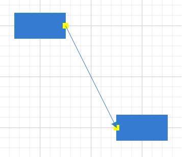

# Actions of Connectors in Blazor Diagram Component

Connectors are objects used to create link between two points, nodes or ports to represent the relationships between them.

> A new blazor diagram component which provides better performance than this diagram control in Blazor WebAssembly App. It is available in preview mode. Refer the [Link](https://blazor.syncfusion.com/documentation/diagram/getting-started)


## Create connector

Connector can be created by defining the source and target point of the connector. The path to be drawn can be defined with a collection of segments. To explore the properties of a [Connector](https://help.syncfusion.com/cr/blazor/Syncfusion.Blazor.Diagrams.DiagramConnector.html), refer to [Connector Properties](https://help.syncfusion.com/cr/blazor/Syncfusion.Blazor.Diagrams.DiagramConnector.html).

## Add connectors through connectors collection

The [SourcePoint](https://help.syncfusion.com/cr/blazor/Syncfusion.Blazor.Diagrams.DiagramConnector.html#Syncfusion_Blazor_Diagrams_DiagramConnector_SourcePoint) and [TargetPoint](https://help.syncfusion.com/cr/blazor/Syncfusion.Blazor.Diagrams.DiagramConnector.html#Syncfusion_Blazor_Diagrams_DiagramConnector_TargetPoint) properties of connector allow you to define the end points of a connector.

The following code example illustrates how to add a connector through connector collection,

```cshtml
@using Syncfusion.Blazor.Diagrams
@using System.Collections.ObjectModel

<SfDiagram Height="600px" Connectors="@ConnectorCollection">
</SfDiagram>

@code
{
    //Defines diagram's connector collection
    public ObservableCollection<DiagramConnector> ConnectorCollection = new ObservableCollection<DiagramConnector>();

    protected override void OnInitialized()
    {
        DiagramConnector diagramConnector = new DiagramConnector()
        {
            // Set the source and target point of the connector
            SourcePoint = new ConnectorSourcePoint() { X = 100, Y = 100 },
            TargetPoint = new ConnectorTargetPoint() { X = 200, Y = 200 },
            // Type of the connector segemnts
            Type = Segments.Straight,
        };
        //Add the connector into connectors's collection.
        ConnectorCollection.Add(diagramConnector);
    }
}
```


## Add connectors at runtime

You can add a connector at runtime by using the server-side method `AddConnector` in the Diagram component.  The following code explains how to add connectors at runtime.

```cshtml
@using Syncfusion.Blazor.Diagrams
@using System.Collections.ObjectModel

<input type="button" value="Add Connector" @onclick="@AddConnector">
<SfDiagram @ref="@Diagram" Height="600px">
</SfDiagram>

@code
{
    SfDiagram Diagram;
    //Defines diagram's connector collection
    public ObservableCollection<DiagramConnector> ConnectorCollection = new ObservableCollection<DiagramConnector>();

    public void AddConnector()
    {
        DiagramConnector diagramConnector = new DiagramConnector()
        {
            Id = "Connector1",
            SourcePoint = new ConnectorSourcePoint() { X = 100, Y = 100 },
            TargetPoint = new ConnectorTargetPoint() { X = 200, Y = 200 },
            TargetDecorator = new ConnectorTargetDecorator()
            {
                Shape = DecoratorShapes.Arrow,
                Style = new DecoratorShapeStyle()
                {
                    Fill = "#6f409f",
                    StrokeColor = "#6f409f",
                    StrokeWidth = 1
                }
            },
            Style = new ConnectorShapeStyle()
            {
                StrokeColor = "#6f409f",
                StrokeWidth = 1
            },
            Type = Segments.Straight,
        };
        //Add the connector at the run time.
        Diagram.AddConnector(diagramConnector);
    }
}

```

Also, the connector can be added at runtime by using the `Add` method.

```csharp
// Add connector at runtime
public void AddConnector()
{
    DiagramConnector Connector2 = new DiagramConnector()
    {
        Id = "Connector2",
        // Set the source and target point of the connector
        SourcePoint = new ConnectorSourcePoint() { X = 200, Y = 100 },
        TargetPoint = new ConnectorTargetPoint() { X = 300, Y = 200 },
    };
    ConnectorCollection.Add(Connector2);
}
```

## Connectors from the palette

Connectors can be predefined and added to the symbol palette. You can drop those connectors into the diagram when required.

For more information about adding connectors from symbol palette, refer to the [Symbol Palette](https://help.syncfusion.com/cr/aspnetcore-blazor/Syncfusion.Blazor.Diagrams.SymbolPalettePalette.html).

```cshtml
@using Syncfusion.Blazor.Diagrams
@using System.Collections.ObjectModel

@* Initializes the symbol palette *@
<div style="width: 200px; float: left">
    <SfSymbolPalette Height="600px" @ref="@SymbolPalette" Palettes="@Palettes">
    </SfSymbolPalette>
</div>

<SfDiagram ID="diagram" @ref="@diagram" Width="500px" Height="600px">
</SfDiagram>

@code{
    SfDiagram diagram;
    SfSymbolPalette SymbolPalette;
    public ObservableCollection<Object> Connectors { get; set; }
    public ObservableCollection<SymbolPalettePalette> Palettes;

    protected override void OnInitialized()
    {
        Palettes = new ObservableCollection<SymbolPalettePalette>();
        //Initializes connector symbols for the symbol palette
        Connectors = new ObservableCollection<Object>()
        {
            new DiagramConnector()
            {
                Id = "Link1",
                // Sets the preview size
                PreviewSize = new SymbolSizeModel() { Width = 100, Height = 100 },
                // Type of the connector segemnts
                Type = Segments.Straight,
                // Set the source and target point of the connector
                SourcePoint = new ConnectorSourcePoint() { X = 0, Y = 0 },
                TargetPoint = new ConnectorTargetPoint() { X = 60, Y = 60 }
            },
            new DiagramConnector()
            {
                Id = "Link2",
                // Sets the preview size
                PreviewSize = new SymbolSizeModel() { Width = 100, Height = 100 },
                // Type of the connector segemnts
                Type = Segments.Orthogonal,
                // Set the source and target point of the connector
                SourcePoint = new ConnectorSourcePoint() { X = 0, Y = 0 },
                TargetPoint = new ConnectorTargetPoint() { X = 60, Y = 60 },
                Style = new ConnectorShapeStyle() { StrokeWidth = 1 },
                // Sets the shape for target decorator
                TargetDecorator = new ConnectorTargetDecorator() { Shape = DecoratorShapes.OpenArrow }
            },
            new DiagramConnector()
            {
                Id = "Link3",
                // Sets the preview size
                PreviewSize = new SymbolSizeModel() { Width = 100, Height = 100 },
                // Type of the connector segemnts
                Type = Segments.Bezier,
                // Set the source and target point of the connector
                SourcePoint = new ConnectorSourcePoint() { X = 0, Y = 0 },
                TargetPoint = new ConnectorTargetPoint() { X = 60, Y = 60 },
                // Sets the shape for target decorator
                TargetDecorator = new ConnectorTargetDecorator() { Shape = DecoratorShapes.None }
            }
        };
        Palettes.Add(new SymbolPalettePalette() { Id = "Connectors", Expanded = true, Symbols = Connectors, Title = "Connectors" });
    }
}
```


## Draw connectors using drawing object

Connectors can be interactively drawn by clicking and dragging on the diagram surface by using [DrawingObject](https://help.syncfusion.com/cr/blazor/Syncfusion.Blazor.Diagrams.SfDiagram.html#Syncfusion_Blazor_Diagrams_SfDiagram_DrawingObject).

For more information about drawing connectors, refer to [Draw Connectors](https://help.syncfusion.com/cr/blazor/Syncfusion.Blazor.Diagrams.DiagramTools.html).


## Remove connectors at runtime

A connector can be removed from the diagram at runtime by using the [Remove](https://help.syncfusion.com/cr/blazor/Syncfusion.Blazor.Diagrams.SfDiagram.html#Syncfusion_Blazor_Diagrams_SfDiagram_Remove_System_Object_) method.

The following code shows how to remove a connector at runtime.

```cshtml
@using Syncfusion.Blazor.Diagrams
@using System.Collections.ObjectModel

<input type="button" value="Remove Connector" @onclick="@RemoveConnector" />
<SfDiagram @ref="@Diagram" Height="600px" Connectors="@ConnectorCollection">
</SfDiagram>

@code{
    // Reference of the diagram
    SfDiagram Diagram;
    //Defines diagram's connector collection
    public ObservableCollection<DiagramConnector> ConnectorCollection = new ObservableCollection<DiagramConnector>();

    protected override void OnInitialized()
    {
        DiagramConnector diagramConnector = new DiagramConnector()
        {
            Id = "Connector1",
            // Set the source and target point of the connector
            SourcePoint = new ConnectorSourcePoint() { X = 100, Y = 100 },
            TargetPoint = new ConnectorTargetPoint() { X = 200, Y = 200 },
            TargetDecorator = new ConnectorTargetDecorator()
            {
                Shape = DecoratorShapes.Arrow,
                Style = new DecoratorShapeStyle()
                {
                    Fill = "#6f409f",
                    StrokeColor = "#6f409f",
                    StrokeWidth = 1
                }
            },
            // Style of the connector segment
            Style = new ConnectorShapeStyle()
            {
                StrokeColor = "#6f409f",
                StrokeWidth = 1
            },
            // Type of the connector
            Type = Segments.Straight,
        };
        //Add the connector at the run time.
        ConnectorCollection.Add(diagramConnector);
    }

    // Remove Node at runtime
    public void RemoveConnector()
    {
        Diagram.Remove(ConnectorCollection[0]);
    }
}
```

A connector can be removed from the diagram by using the native `RemoveAt` method. Refer to the following example that shows how to remove the connector at runtime.

```csharp

public void RemoveConnector()
{
    ConnectorCollection.RemoveAt(0);
}

```

## Update connectors at runtime

You can change any connector's properties at runtime.

The following code example explains how to change the connector properties.

```cshtml
@using Syncfusion.Blazor.Diagrams
@using System.Collections.ObjectModel

<SfDiagram Height="600px" @ref="@Diagram" Connectors="@ConnectorCollection">
</SfDiagram>

@code
{
    SfDiagram Diagram;
    //Defines diagram's connector collection
    public ObservableCollection<DiagramConnector> ConnectorCollection = new ObservableCollection<DiagramConnector>();

    protected override void OnInitialized()
    {
        DiagramConnector diagramConnector = new DiagramConnector()
        {
            SourcePoint = new ConnectorSourcePoint() { X = 100, Y = 100 },
            TargetPoint = new ConnectorTargetPoint() { X = 200, Y = 200 },
            TargetDecorator = new ConnectorTargetDecorator()
            {
                Shape = DecoratorShapes.Arrow,
                Style = new DecoratorShapeStyle()
                {
                    Fill = "#6f409f",
                    StrokeColor = "#6f409f",
                    StrokeWidth = 1
                }
            },
            Style = new ConnectorShapeStyle()
            {
                StrokeColor = "#6f409f",
                StrokeWidth = 1
            },
            Type = Segments.Straight,
        };
        //Add the connector into connectors's collection.
        ConnectorCollection.Add(diagramConnector);
    }

    public void AddConnector()
    {
        Diagram.BeginUpdate();
        Diagram.Connectors[0].SourcePoint.X = 50;
        Diagram.Connectors[0].SourcePoint.Y = 50;
        Diagram.EndUpdate();
    }
}
```

## Connections

The connectors are used to create a link between two points, nodes or ports to represent the relationships between them.

### Connections with nodes

The [SourceID](https://help.syncfusion.com/cr/blazor/Syncfusion.Blazor.Diagrams.DiagramConnector.html#Syncfusion_Blazor_Diagrams_DiagramConnector_SourceID) and [TargetID](https://help.syncfusion.com/cr/blazor/Syncfusion.Blazor.Diagrams.DiagramConnector.html#Syncfusion_Blazor_Diagrams_DiagramConnector_TargetID) properties allow to define the nodes to be connected.

The following code example illustrates how to connect two nodes.

```cshtml
@using Syncfusion.Blazor.Diagrams
@using System.Collections.ObjectModel

<SfDiagram Height="600px" Nodes="@NodeCollection" Connectors="@ConnectorCollection">
</SfDiagram>

@code
{
    //Defines diagram's nodes collection
    public ObservableCollection<DiagramNode> NodeCollection = new ObservableCollection<DiagramNode>();

    //Defines diagram's connector collection
    public ObservableCollection<DiagramConnector> ConnectorCollection = new ObservableCollection<DiagramConnector>();

    public DiagramConstraints diagramConstraints = DiagramConstraints.Default;

    protected override void OnInitialized()
    {
        //Creates source node
        DiagramNode node1 = new DiagramNode()
        {
            OffsetX = 100,
            OffsetY = 100,
            Height = 50,
            Width = 100,
            Id = "node1",
            Shape = new DiagramShape()
            {
                Type = Syncfusion.Blazor.Diagrams.Shapes.Basic,
                BasicShape = BasicShapes.Rectangle
            },
            Style = new NodeShapeStyle()
            {
                Fill = "#37909A",
                StrokeColor = "#37909A",
            },
        };
        //Add node into node's collection
        NodeCollection.Add(node1);

        //Create a target node
        DiagramNode node2 = new DiagramNode()
        {
            OffsetX = 300,
            OffsetY = 300,
            Height = 50,
            Width = 100,
            Id = "node2",
            Shape = new DiagramShape()
            {
                Type = Syncfusion.Blazor.Diagrams.Shapes.Basic,
                BasicShape = BasicShapes.Rectangle
            },
            Style = new NodeShapeStyle()
            {
                Fill = "#37909A",
                StrokeColor = "#37909A",
            },
        };
        //Add node into node's collection
        NodeCollection.Add(node2);

        //create the connector with source node and target node id.
        DiagramConnector diagramConnector = new DiagramConnector()
        {
            //Source node id of the connector.
            SourceID = "node1",
            //Target node id of the connector.
            TargetID = "node2",
            TargetDecorator = new ConnectorTargetDecorator()
            {
                Shape = DecoratorShapes.Arrow,
                Style = new DecoratorShapeStyle()
                {
                    Fill = "#37909A",
                    StrokeColor = "#37909A",
                    StrokeWidth = 1
                }
            },
            Style = new ConnectorShapeStyle()
            {
                StrokeColor = "#37909A",
                StrokeWidth = 1
            },
            Type = Segments.Straight,
        };
        //Adding conector into connector's collection
        ConnectorCollection.Add(diagramConnector);
    }
}
```


When you remove [NodeConstraints.InConnect](https://help.syncfusion.com/cr/blazor/Syncfusion.Blazor.Diagrams.NodeConstraints.html) from Default, the node accepts only an outgoing connection to dock in it. Similarly, when you remove [NodeConstraints.OutConnect](https://help.syncfusion.com/cr/blazor/Syncfusion.Blazor.Diagrams.NodeConstraints.html) from Default, the node accepts only an incoming connection to dock in it.

When you remove both InConnect and OutConnect [NodeConstraints](https://help.syncfusion.com/cr/blazor/Syncfusion.Blazor.Diagrams.NodeConstraints.html) from `Default`, the node restricts connector to establish connection in it. The following code illustrates how to disable InConnect constraints.

```cshtml

@using Syncfusion.Blazor.Diagrams
@using System.Collections.ObjectModel

<SfDiagram Height="600px" Nodes="@NodeCollection">
</SfDiagram>

@code
{
    //Defines diagram's nodes collection
    public ObservableCollection<DiagramNode> NodeCollection = new ObservableCollection<DiagramNode>();

    protected override void OnInitialized()
    {
        //Creates source node
        DiagramNode node1 = new DiagramNode()
        {
            OffsetX = 100,
            OffsetY = 100,
            Height = 50,
            Width = 100,
            Shape = new DiagramShape()
            {
                Type = Syncfusion.Blazor.Diagrams.Shapes.Basic,
                BasicShape = BasicShapes.Ellipse
            },
            Style = new NodeShapeStyle()
            {
                Fill = "#37909A",
                StrokeColor = "#37909A",
            },
        };
        //Add node into node's collection
        NodeCollection.Add(node1);
        //To disbale the inconnect constraints to node.
        node1.Constraints = NodeConstraints.Default & ~NodeConstraints.InConnect;
    }
}
```

### Connections with ports

The [SourcePortID](https://help.syncfusion.com/cr/blazor/Syncfusion.Blazor.Diagrams.DiagramConnector.html#Syncfusion_Blazor_Diagrams_DiagramConnector_SourcePortID) and [TargetPortID](https://help.syncfusion.com/cr/blazor/Syncfusion.Blazor.Diagrams.DiagramConnector.html#Syncfusion_Blazor_Diagrams_DiagramConnector_TargetPortID) properties allow to create connections between some specific points of source/target nodes.

The following code example illustrates how to create port to port connections.

```cshtml
@using Syncfusion.Blazor.Diagrams
@using System.Collections.ObjectModel

<SfDiagram @ref="@diagram" Height="600px" Nodes="@NodeCollection" Connectors="@ConnectorCollection">
</SfDiagram>

@code
{
    //Defines diagram's nodes collection
    public ObservableCollection<DiagramNode> NodeCollection = new ObservableCollection<DiagramNode>();
    public SfDiagram diagram;
    //Defines diagram's connector collection
    public ObservableCollection<DiagramConnector> ConnectorCollection = new ObservableCollection<DiagramConnector>();

    public DiagramConstraints diagramConstraints = DiagramConstraints.Default;

    protected override void OnInitialized()
    {
        //Create a source node
        DiagramNode node1 = new DiagramNode()
        {
            OffsetX = 100,
            OffsetY = 100,
            Height = 50,
            Width = 100,
            Id = "node1",
            Shape = new DiagramShape()
            {
                Type = Syncfusion.Blazor.Diagrams.Shapes.Basic,
                BasicShape = BasicShapes.Rectangle
            },
            Style = new NodeShapeStyle()
            {
                Fill = "#37909A",
                StrokeColor = "#37909A",
            },
            //Create the port for source node
            Ports = new ObservableCollection<DiagramPort>()
            {
                new DiagramPort()
                {
                    Id = "port1",
                    Offset = new Syncfusion.Blazor.Diagrams.NodePortOffset() { X = 1, Y = 0.5 },
                    Height = 10,
                    Width = 10,
                    Visibility = PortVisibility.Visible,
                    Style = new PortShapeStyle()
                    {
                            Fill = "yellow",
                            StrokeColor = "yellow"
                    }
                },
            },
        };
        //Add node into node's collection
        NodeCollection.Add(node1);
        //Create a target node
        DiagramNode node2 = new DiagramNode()
        {
            OffsetX = 300,
            OffsetY = 300,
            Height = 50,
            Width = 100,
            Id = "node2",
            Shape = new DiagramShape()
            {
                Type = Syncfusion.Blazor.Diagrams.Shapes.Basic,
                BasicShape = BasicShapes.Rectangle
            },
            Style = new NodeShapeStyle()
            {
                Fill = "#37909A",
                StrokeColor = "#37909A",
            },
            //Create the port for target node.
            Ports = new ObservableCollection<DiagramPort>()
            {
                new DiagramPort()
                {
                    Id = "port2",
                    Offset = new Syncfusion.Blazor.Diagrams.NodePortOffset() { X = 0, Y = 0.5 },
                    Height = 10,
                    Width = 10,
                    Visibility = PortVisibility.Visible,
                    Style = new PortShapeStyle()
                    {
                        Fill = "yellow",
                        StrokeColor = "yellow"
                    }
                },
            },
        };
        //Add node into node's collection
        NodeCollection.Add(node2);
        //create the connector from port to port
        DiagramConnector diagramConnector = new DiagramConnector()
        {
            SourceID = "node1",
            TargetID = "node2",
            //source node port id.
            SourcePortID = "port1",
            //Target node port id.
            TargetPortID = "port2",
            TargetDecorator = new ConnectorTargetDecorator()
            {
                Shape = DecoratorShapes.Arrow,
                Style = new DecoratorShapeStyle()
                {
                    Fill = "#37909A",
                    StrokeColor = "#37909A",
                    StrokeWidth = 1
                }
            },
            Style = new ConnectorShapeStyle()
            {
                StrokeColor = "#37909A",
                StrokeWidth = 1
            },
            Type = Segments.Straight,
        };
        ConnectorCollection.Add(diagramConnector);
    }
}
```



When you set [PortConstraints](https://help.syncfusion.com/cr/blazor/Syncfusion.Blazor.Diagrams.PortConstraints.html) to `InConnect`, the port accepts only an incoming connection to dock in it. Similarly, when you set [PortConstraints](https://help.syncfusion.com/cr/blazor/Syncfusion.Blazor.Diagrams.PortConstraints.html) to `OutConnect`, the port accepts only an outgoing connection to dock in it. When you set [PortConstraints](https://help.syncfusion.com/cr/blazor/Syncfusion.Blazor.Diagrams.PortConstraints.html) to `None`, the port restricts connector to establish connection in it.

```cshtml
@using Syncfusion.Blazor.Diagrams
@using System.Collections.ObjectModel

<SfDiagram Height="600px" Nodes="@NodeCollection">
</SfDiagram>

@code
{
    //Defines diagram's nodes collection
    public ObservableCollection<DiagramNode>
    NodeCollection = new ObservableCollection<DiagramNode>();

    protected override void OnInitialized()
    {
        //Creates source node
        DiagramNode node1 = new DiagramNode()
        {
            OffsetX = 100,
            OffsetY = 100,
            Height = 50,
            Width = 100,
            Shape = new DiagramShape()
            {
                Type = Syncfusion.Blazor.Diagrams.Shapes.Basic,
                BasicShape = BasicShapes.Ellipse
            },
            Style = new NodeShapeStyle()
            {
                Fill = "#37909A",
                StrokeColor = "#37909A",
            },
        };
        //Add node into node's collection
        NodeCollection.Add(node1);
        //To disbale the inconnect constraints to node.
        node1.Constraints = NodeConstraints.Default & ~NodeConstraints.InConnect;
        DiagramPort Port = new DiagramPort()
        {
            Offset = new Syncfusion.Blazor.Diagrams.NodePortOffset() { X = 0, Y = 0.5 },
            Height = 10,
            Width = 10,
            Visibility = PortVisibility.Visible,
            Style = new PortShapeStyle()
            {
                Fill = "yellow",
                StrokeColor = "yellow"
            }
        };
        //Port constraints to allow in connectors.
        Port.Constraints = PortConstraints.InConnect;
        NodeCollection[0].Ports.Add(Port);
    }
}
```

## See also

* [How to customize the connector properties](./customization)

* [How to interact the connector](./interactions)

* [How to change the segments](./segments)

* [How to get the connector events](./events)

* [How to add annotations to the connectors](../annotations/labels)