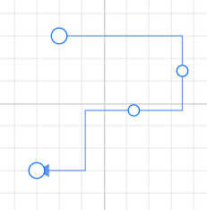

# Connector Customization in Blazor Diagram Component

## How to Customize Connector Decorators

Diagram allows you to customize the connector appearances. The following topics shows how to customize several properties of the connectors.

* Starting and ending points of a connector can be decorated with some customizable shapes like arrows, circles, diamonds, or paths. The connection end points can be decorated with the [SourceDecorator](https://help.syncfusion.com/cr/blazor/Syncfusion.Blazor.Diagram.Connector.html#Syncfusion_Blazor_Diagram_Connector_SourceDecorator) and [TargetDecorator](https://help.syncfusion.com/cr/blazor/Syncfusion.Blazor.Diagram.Connector.html#Syncfusion_Blazor_Diagram_Connector_TargetDecorator) properties of the connector.

* The [Shape](https://help.syncfusion.com/cr/blazor/Syncfusion.Blazor.Diagram.DecoratorSettings.html#Syncfusion_Blazor_Diagram_DecoratorSettings_Shape) property of SourceDecorator allows you to define the shape of the source decorator. Similarly, the Shape property of TargetDecorator allows to define the shape of the target decorator.

* To create custom shape for source decorator, use the [PathData](https://help.syncfusion.com/cr/blazor/Syncfusion.Blazor.Diagram.DecoratorSettings.html#Syncfusion_Blazor_Diagram_DecoratorSettings_PathData) property. Similarly, to create custom shape for the target decorator, use the PathData property.

To learn more about customization of connectors, refer to the below video link.



* The following code example illustrates how to create decorators of various shapes.

```cshtml
@using Syncfusion.Blazor.Diagram

<SfDiagramComponent Width="1000px" Height="500px" Connectors="@connectors">
</SfDiagramComponent>

@code
{
    //Defines diagram's connector collection.
    DiagramObjectCollection<Connector> connectors = new DiagramObjectCollection<Connector>();

    protected override void OnInitialized()
    {
        Connector Connector = new Connector()
        {
            ID = "connector1",
            SourcePoint = new DiagramPoint()
            {
                X = 100,
                Y = 100
            },
            TargetPoint = new DiagramPoint() { X = 200, Y = 200 },
            Style = new ShapeStyle() { StrokeColor = "#6f409f", StrokeWidth = 1 },
            Type = ConnectorSegmentType.Orthogonal,
            SourceDecorator = new DecoratorSettings()
            {
                Shape = DecoratorShape.Circle,
                Style = new ShapeStyle() { StrokeColor = "#37909A", Fill = "#37909A", StrokeWidth = 1 }
            },
            TargetDecorator = new DecoratorSettings()
            {
                Shape = DecoratorShape.Custom,
                PathData = "M80.5,12.5 C80.5,19.127417 62.59139,24.5 40.5,24.5 C18.40861,24.5 0.5,19.127417 0.5,12.5 C0.5,5.872583 18.40861,0.5 40.5,0.5 C62.59139,0.5 80.5,5.872583 80.5,12.5 z",
                Style = new ShapeStyle()
                {
                    StrokeColor = "#37909A",
                    Fill = "#37909A",
                    StrokeWidth = 1,
                }
            }
        };
        connectors.Add(Connector);
    }
}
```
You can download a complete working sample from [GitHub](https://github.com/SyncfusionExamples/Blazor-Diagram-Examples/tree/master/UG-Samples/Connectors/Customization/Decorator)

### How to Customize Connector Decorator Appearance

* The source decorator’s [StrokeColor](https://help.syncfusion.com/cr/blazor/Syncfusion.Blazor.Diagram.ShapeStyle.html#Syncfusion_Blazor_Diagram_ShapeStyle_StrokeColor), [StrokeWidth](https://help.syncfusion.com/cr/blazor/Syncfusion.Blazor.Diagram.ShapeStyle.html#Syncfusion_Blazor_Diagram_ShapeStyle_StrokeWidth), and [StrokeDashArray](https://help.syncfusion.com/cr/blazor/Syncfusion.Blazor.Diagram.ShapeStyle.html#Syncfusion_Blazor_Diagram_ShapeStyle_StrokeDashArray) properties are used to customize the color, width, and appearance of the decorator.

* To set the border stroke color, stroke width, and stroke dash array for the target decorator, use StrokeColor, StrokeWidth, and StrokeDashArray.

* To set the size for source and target decorator, use [Width](https://help.syncfusion.com/cr/blazor/Syncfusion.Blazor.Diagram.DecoratorSettings.html#Syncfusion_Blazor_Diagram_DecoratorSettings_Width) and [Height](https://help.syncfusion.com/cr/blazor/Syncfusion.Blazor.Diagram.DecoratorSettings.html#Syncfusion_Blazor_Diagram_DecoratorSettings_Height) properties.

The following code example illustrates how to customize the appearance of the decorator.

```cshtml
@using Syncfusion.Blazor.Diagram

<SfDiagramComponent Width="1000px" Height="500px" Connectors="@connectors">
</SfDiagramComponent>

@code
{
    DiagramObjectCollection<Connector> connectors = new DiagramObjectCollection<Connector>();

    protected override void OnInitialized()
    {
        Connector Connector = new Connector()
        {
            ID = "connector1",
            Style = new ShapeStyle()
            {
                Fill = "#6495ED",
                StrokeColor = "#6495ED",
                StrokeWidth = 1
            },
            SourcePoint = new DiagramPoint()
            {
                X = 100,
                Y = 100
            },
            TargetPoint = new DiagramPoint()
            {
                X = 200,
                Y = 200
            },
            Type = ConnectorSegmentType.Orthogonal,
            SourceDecorator = new DecoratorSettings()
            {
                Shape = DecoratorShape.Arrow,
                Height = 15,
                Width = 15,
                Style = new ShapeStyle() { StrokeColor = "blue", Fill = "yellow", StrokeWidth = 3 }
            },
            TargetDecorator = new DecoratorSettings()
            {
                Shape = DecoratorShape.Arrow,
                Height = 15,
                Width = 15,
                Style = new ShapeStyle()
                {
                    StrokeColor = "red",
                    Fill = "yellow",
                    StrokeWidth = 3
                }
            }

        };
        connectors.Add(Connector);
    }
}
```
You can download a complete working sample from [GitHub](https://github.com/SyncfusionExamples/Blazor-Diagram-Examples/tree/master/UG-Samples/Connectors/Customization/DecoratorAppearance)


## How to Set Padding for Connector

Padding is used to leave the space between the Connector's end point and the object to where it is connected.

* The [SourcePadding](https://help.syncfusion.com/cr/blazor/Syncfusion.Blazor.Diagram.Connector.html#Syncfusion_Blazor_Diagram_Connector_SourcePadding) property of connector defines space between the source point and the source node of the connector.

* The [TargetPadding](https://help.syncfusion.com/cr/blazor/Syncfusion.Blazor.Diagram.Connector.html#Syncfusion_Blazor_Diagram_Connector_TargetPadding) property of connector defines space between the end point and the target node of the connector.

* The following code example illustrates how to leave space between the connection end points and source, target nodes.

```cshtml
@using Syncfusion.Blazor.Diagram

<SfDiagramComponent Width="1000px" Height="500px" Connectors="@connectors" Nodes="@nodes">
</SfDiagramComponent>

@code
{
    //Defines diagram's nodes collection.
    DiagramObjectCollection<Node> nodes = new DiagramObjectCollection<Node>();
    //Defines diagram's connector collection.
    DiagramObjectCollection<Connector> connectors = new DiagramObjectCollection<Connector>();

    protected override void OnInitialized()
    {
        nodes = new DiagramObjectCollection<Node>() 
        {
          new Node() 
          {
                OffsetX = 100,
                OffsetY = 100,
                Height = 50,
                Width = 100,
                ID = "node1",
                Style = new ShapeStyle() { Fill = "#6BA5D7", StrokeColor = "#6BA5D7" },
                Shape = new BasicShape() { Type = NodeShapes.Basic, Shape = NodeBasicShapes.Rectangle }
          },
          new Node() 
          {   
                OffsetX = 300,
                OffsetY = 300,
                Height = 50,
                Width = 100,
                ID = "node2",
                Style = new ShapeStyle(){ Fill = "#6BA5D7", StrokeColor = "#6BA5D7" },
                Shape = new BasicShape() { Type = NodeShapes.Basic, Shape = NodeBasicShapes.Rectangle }
          }
        };
        Connector Connector = new Connector()
        {
            ID = "connector1",
            SourceID = "node1",
            TargetID = "node2",
            //Specifies the source and target padding values.
            SourcePadding = 20,
            TargetPadding = 20,
            TargetDecorator = new DecoratorSettings()
            {
                Shape = DecoratorShape.Arrow,
                Style = new ShapeStyle() { Fill = "#6BA5D7", StrokeColor = "#6BA5D7", StrokeWidth = 1 }
            },
            Style = new ShapeStyle()
            {
                StrokeColor = "#6BA5D7",
                StrokeWidth = 1
            },
            Type = ConnectorSegmentType.Orthogonal
        };
        connectors.Add(Connector);
    }
}
```
You can download a complete working sample from [GitHub](https://github.com/SyncfusionExamples/Blazor-Diagram-Examples/tree/master/UG-Samples/Connectors/Customization/Padding)


## How to Enable Bridging

Line bridging creates a bridge for lines to smartly cross over other lines, at points of intersection. By default, [BridgeDirection](https://help.syncfusion.com/cr/blazor/Syncfusion.Blazor.Diagram.SfDiagramComponent.html#Syncfusion_Blazor_Diagram_SfDiagramComponent_BridgeDirection) is set to [Top](https://help.syncfusion.com/cr/blazor/Syncfusion.Blazor.Diagram.Direction.html#Syncfusion_Blazor_Diagram_Direction_Top). Depending upon the direction given bridging direction appears. Bridging can be enabled/disabled either with the [Connector.Constraints](https://help.syncfusion.com/cr/blazor/Syncfusion.Blazor.Diagram.ConnectorConstraints.html) or [Diagram.Constraints](https://help.syncfusion.com/cr/blazor/Syncfusion.Blazor.Diagram.DiagramConstraints.html). 

To learn more about connector bridging, refer to the below video link,



The following code example illustrates how to enable line bridging.

```cshtml
@using Syncfusion.Blazor.Diagram

<SfDiagramComponent Width="1000px"@bind-Constraints="@diagramConstraints" Height="500px" Connectors="@connectors">
</SfDiagramComponent>

@code
{
    DiagramConstraints diagramConstraints = DiagramConstraints.Default | DiagramConstraints.Bridging;
    DiagramObjectCollection<Connector> connectors = new DiagramObjectCollection<Connector>();

    protected override void OnInitialized()
    {
        Connector Connector1 = new Connector()
        {
            ID = "connector1",
            // Bridge space value has been defined.
            BridgeSpace = 20,
            Style = new ShapeStyle()
            {
                Fill = "#6495ED",
                StrokeColor = "#6495ED",
                StrokeWidth = 1
            },
            SourcePoint = new DiagramPoint()
            {
                X = 200 , Y = 200
            },
            TargetPoint = new DiagramPoint()
            {
                X = 400,
                Y = 200
            },
            Type = ConnectorSegmentType.Orthogonal,
            TargetDecorator = new DecoratorSettings()
            {
                Shape = DecoratorShape.Arrow ,
                Style = new ShapeStyle()
                {
                    Fill = "#6495ED",
                    StrokeColor = "#6495ED",
                    StrokeWidth = 1
                }
            }
        };
        connectors.Add(Connector1);
        Connector Connector2 = new Connector()
        {
            ID = "connector2",
            Style = new ShapeStyle()
            {
                Fill = "#6495ED",
                StrokeColor = "#6495ED",
                StrokeWidth = 1
            },
            SourcePoint = new DiagramPoint()
            {
                X = 300,
                Y = 100
            },
            TargetPoint = new DiagramPoint()
            {
                X = 300,
                Y = 300
            },
            Type = ConnectorSegmentType.Orthogonal,
            TargetDecorator = new DecoratorSettings()
            {
                Shape = DecoratorShape.Arrow,
                Style = new ShapeStyle()
                {
                    Fill = "#6495ED",
                    StrokeColor = "#6495ED",
                    StrokeWidth = 1
                }
            }
        };
        connectors.Add(Connector2);
    }
}
```
You can download a complete working sample from [GitHub](https://github.com/SyncfusionExamples/Blazor-Diagram-Examples/tree/master/UG-Samples/Connectors/Customization/Bridging)

The [BridgeSpace](https://help.syncfusion.com/cr/blazor/Syncfusion.Blazor.Diagram.Connector.html#Syncfusion_Blazor_Diagram_Connector_BridgeSpace) property of connectors can be used to define the width for line bridging. By default, the BridgeSpace value is 10px.

Limitation: [BezierSegment](https://help.syncfusion.com/cr/blazor/Syncfusion.Blazor.Diagram.BezierSegment.html) do not support bridging.


## How to Update Corner Radius for Connector

Corner radius allows you to create connectors with rounded corners. The radius of the rounded corner is set with the [CornerRadius](https://help.syncfusion.com/cr/blazor/Syncfusion.Blazor.Diagram.Connector.html#Syncfusion_Blazor_Diagram_Connector_CornerRadius) property.

```cshtml
@using Syncfusion.Blazor.Diagram

<SfDiagramComponent Width="1000px"  Height="500px" Connectors="@connectors">
</SfDiagramComponent>

@code
{
    DiagramObjectCollection<Connector> connectors = new DiagramObjectCollection<Connector>();

    protected override void OnInitialized()
    {
        Connector Connector = new Connector()
        {
            ID = "connector1",
            Style = new ShapeStyle()
            {
                Fill = "#6495ED",
                StrokeColor = "#6495ED",
                StrokeWidth = 1
            },
            SourcePoint = new DiagramPoint()
            {
                X = 100,
                Y = 100
            },
            TargetPoint = new DiagramPoint()
            {
                X = 200,
                Y = 200
            },
            //Specify the corner radius value.
            CornerRadius = 10,
            Type = ConnectorSegmentType.Orthogonal,
            TargetDecorator = new DecoratorSettings()
            {
                Shape = DecoratorShape.Arrow,
                Style = new ShapeStyle()
                {
                    Fill = "#6495ED",
                    StrokeColor = "#6495ED",
                    StrokeWidth = 1
                }
            }
        };
        connectors.Add(Connector);
    }
}
```
You can download a complete working sample from [GitHub](https://github.com/SyncfusionExamples/Blazor-Diagram-Examples/tree/master/UG-Samples/Connectors/Customization/CornerRadius)


## How to Customize Connector Appearance

* The connector’s [StrokeWidth](https://help.syncfusion.com/cr/blazor/Syncfusion.Blazor.Diagram.ShapeStyle.html#Syncfusion_Blazor_Diagram_ShapeStyle_StrokeWidth), [StrokeColor](https://help.syncfusion.com/cr/blazor/Syncfusion.Blazor.Diagram.ShapeStyle.html#Syncfusion_Blazor_Diagram_ShapeStyle_StrokeColor), [StrokeDashArray](https://help.syncfusion.com/cr/blazor/Syncfusion.Blazor.Diagram.ShapeStyle.html#Syncfusion_Blazor_Diagram_ShapeStyle_StrokeDashArray), and [Opacity](https://help.syncfusion.com/cr/blazor/Syncfusion.Blazor.Diagram.ShapeStyle.html#Syncfusion_Blazor_Diagram_ShapeStyle_Opacity) properties are used to customize the appearance of the connector segments.

* The [IsVisible](https://help.syncfusion.com/cr/blazor/Syncfusion.Blazor.Diagram.NodeBase.html#Syncfusion_Blazor_Diagram_NodeBase_IsVisible) property of the connector indicates whether the connector is visible in the user interface or not.

* Default values for all the [Connectors](https://help.syncfusion.com/cr/blazor/Syncfusion.Blazor.Diagram.Connector.html) can be set by using the [ConnectorCreating](https://help.syncfusion.com/cr/blazor/Syncfusion.Blazor.Diagram.SfDiagramComponent.html#Syncfusion_Blazor_Diagram_SfDiagramComponent_ConnectorCreating) event callback method. For example, if all connectors have the same type or property, then such properties can be moved into ConnectorCreating.

### How to Customize Connector Segment Appearance

The following code example illustrates how to customize the segment appearance.

```cshtml
@using Syncfusion.Blazor.Diagram

<SfDiagramComponent Width="1000px" Height="500px" Connectors="@connectors">
</SfDiagramComponent>

@code
{
    DiagramObjectCollection<Connector> connectors = new DiagramObjectCollection<Connector>();

    protected override void OnInitialized()
    {
        Connector Connector1 = new Connector()
        {
            ID = "connector1",
            SourcePoint = new DiagramPoint()
            {
                X = 100,
                Y = 100
            },
            TargetPoint = new DiagramPoint()
            {
                X = 200,
                Y = 200
            },
            Style = new ShapeStyle()
            {
                StrokeColor = "red",
                StrokeWidth = 2,
                StrokeDashArray = "2,2"
            },
            Type = ConnectorSegmentType.Orthogonal,
            TargetDecorator = new DecoratorSettings()
            {
                Shape = DecoratorShape.Arrow,
                Style = new ShapeStyle()
                {
                    Fill = "#6f409f",
                    StrokeColor = "#6f409f",
                    StrokeWidth = 1
                }
            }
        };
        connectors.Add(Connector1);
    }
}
```
You can download a complete working sample from [GitHub](https://github.com/SyncfusionExamples/Blazor-Diagram-Examples/tree/master/UG-Samples/Connectors/Customization/SegmentAppearance)

## How to Enable or Disable Connector Behavior

* The [Constraints](https://help.syncfusion.com/cr/blazor/Syncfusion.Blazor.Diagram.ConnectorConstraints.html) property of a connector allows you to enable/disable certain features of connectors.

* To enable or disable the constraints, refer [Connector Constraints](../constraints).

The following code illustrates how to disable selection.

```cshtml
@using Syncfusion.Blazor.Diagram

<SfDiagramComponent Width="1000px" Height="500px" Connectors="@connectors">
</SfDiagramComponent>

@code
{
    DiagramObjectCollection<Connector> connectors = new DiagramObjectCollection<Connector>();

    protected override void OnInitialized()
    {
        Connector Connector = new Connector()
        {
            ID = "connector1",
            SourcePoint = new DiagramPoint()
            {
                X = 100,
                Y = 100
            },
            TargetPoint = new DiagramPoint()
            {
                X = 200,
                Y = 200
            },
            Type = ConnectorSegmentType.Orthogonal,
            TargetDecorator = new DecoratorSettings()
            {
                Shape = DecoratorShape.Arrow,
                Style = new ShapeStyle()
                {
                    Fill = "black",
                    StrokeColor = "black",
                    StrokeWidth = 1
                }
            },
            Style = new ShapeStyle()
            {
                StrokeColor = "black",
                StrokeWidth = 1
            },
            //Disable the select constraint.
            Constraints = ConnectorConstraints.Default & ~ConnectorConstraints.Select,
        };
        connectors.Add(Connector);
    }
}
```
You can download a complete working sample from [GitHub](https://github.com/SyncfusionExamples/Blazor-Diagram-Examples/tree/master/UG-Samples/Connectors/Customization/Constraints)

## How to Add Additional Information for Connector

* The [AdditionalInfo](https://help.syncfusion.com/cr/blazor/Syncfusion.Blazor.Diagram.NodeBase.html#Syncfusion_Blazor_Diagram_NodeBase_AdditionalInfo) property of a connector allows you to maintain additional information for the connectors.

```cshtml
@using Syncfusion.Blazor.Diagram

<SfDiagramComponent Width="1000px" Height="500px" Connectors="@connectors">
</SfDiagramComponent>

@code
{
    DiagramObjectCollection<Connector> connectors = new DiagramObjectCollection<Connector>();

    protected override void OnInitialized()
    {
        Dictionary<string, object> ConnectorInfo = new Dictionary<string, object>();
        ConnectorInfo.Add("connectorInfo", "Central Connector");
        Connector Connector = new Connector()
        {
            ID = "connector1",
            SourcePoint = new DiagramPoint()
            {
                X = 100,
                Y = 100
            },
            TargetPoint = new DiagramPoint()
            {
                X = 200,
                Y = 200
            },
            Type = ConnectorSegmentType.Orthogonal,
            TargetDecorator = new DecoratorSettings()
            {
                Shape = DecoratorShape.Arrow,
                Style = new ShapeStyle()
                {
                    Fill = "black",
                    StrokeColor = "black",
                    StrokeWidth = 1
                }
            },
            Style = new ShapeStyle()
            {
                StrokeColor = "black",
                StrokeWidth = 1
            },
            //Define the add info value.
            AdditionalInfo = ConnectorInfo
        };
        connectors.Add(Connector);
    }
}
```
You can download a complete working sample from [GitHub](https://github.com/SyncfusionExamples/Blazor-Diagram-Examples/tree/master/UG-Samples/Connectors/Customization/CustomProperty)

## How to Set Connector Z-Index 

* The connector's  [ZIndex](https://help.syncfusion.com/cr/blazor/Syncfusion.Blazor.Diagram.NodeBase.html#Syncfusion_Blazor_Diagram_NodeBase_ZIndex) property specifies the stack order of the connector. A connector with a greater stack order is always in front of a connector with a lower stack order. By default, the value is -1.


The following code illustrates how to render connector based on the stack order.

```cshtml
@using Syncfusion.Blazor.Diagram
@using System.Collections.ObjectModel

<SfDiagramComponent Width="1000px" Height="500px" Connectors="@connectors">
    <SnapSettings Constraints="@snapConstraints"></SnapSettings>
</SfDiagramComponent>

@code
{
    SnapConstraints snapConstraints = SnapConstraints.None;
    //Define the diagram's connector collection.
    DiagramObjectCollection<Connector> connectors = new DiagramObjectCollection<Connector>();

    protected override void OnInitialized()
    {
        Connector Connector = new Connector()
        {
            ID = "connector1",
            // Set the source and target point of the connector.
            SourcePoint = new DiagramPoint() { X = 100, Y = 100 },
            TargetPoint = new DiagramPoint() { X = 200, Y = 200 },
            // Type of the connector segments.
            Type = ConnectorSegmentType.Straight,
            //Define the ZIndex property.
            ZIndex = -2,
        };
        connectors.Add(Connector);
    }
}
```
You can download a complete working sample from [GitHub](https://github.com/SyncfusionExamples/Blazor-Diagram-Examples/tree/master/UG-Samples/Connectors/Customization/ZIndexProperty)

## How to Set Hit Padding for Connector

* The [HitPadding](https://help.syncfusion.com/cr/blazor/Syncfusion.Blazor.Diagram.Connector.html#Syncfusion_Blazor_Diagram_Connector_HitPadding) refers to the space around the connector's edges. To make it easy to select, selecting when the mouse comes near its vicinity area should be possible. The HitPadding property allows you to customize the vicinity area while selecting. The default value is 10px. Within the hit padding region, the connector can be selected and deselected.

To learn more about connector HitPadding, refer to the below video link,



The following code illustrates how to set the HitPadding for the connector.

```cshtml
@using Syncfusion.Blazor.Diagram
@using System.Collections.ObjectModel

<SfDiagramComponent Width="1000px" Height="500px" Connectors="@connectors">
    <SnapSettings Constraints="@snapConstraints"></SnapSettings>
</SfDiagramComponent>

@code
{
    SnapConstraints snapConstraints = SnapConstraints.None;
    //Define the diagram's connector collection.
    DiagramObjectCollection<Connector> connectors = new DiagramObjectCollection<Connector>();

    protected override void OnInitialized()
    {
        Connector Connector = new Connector()
        {
            ID = "connector1",
            // Set the source and target point of the connector.
            SourcePoint = new DiagramPoint() { X = 100, Y = 100 },
            TargetPoint = new DiagramPoint() { X = 200, Y = 200 },
            // Type of the connector segments.
            Type = ConnectorSegmentType.Straight,
            //Define the HitPadding property.
            HitPadding = 20,
        };
        connectors.Add(Connector);
    }
}
```

## How to Set Source Padding and Target Padding for Connector

* The [SourcePadding](https://help.syncfusion.com/cr/blazor/Syncfusion.Blazor.Diagram.Connector.html#Syncfusion_Blazor_Diagram_Connector_SourcePadding) property of a connector defines space between the source point and the source node of the connector.

* The [TargetPadding](https://help.syncfusion.com/cr/blazor/Syncfusion.Blazor.Diagram.Connector.html#Syncfusion_Blazor_Diagram_Connector_TargetPadding) property of a connector defines space between the endpoint and the target node of the connector.

The following code example illustrates how to leave space between the connection endpoints and source and target nodes.

```cshtml
@using Syncfusion.Blazor.Diagram

<SfDiagramComponent Height="600px" Nodes="@nodes" Connectors="@connectors" />

@code
{
     DiagramObjectCollection<Node> nodes= new DiagramObjectCollection<Node>();
    DiagramObjectCollection<Connector> connectors= new DiagramObjectCollection<Connector>();

    protected override void OnInitialized()
    {
        Node node1 = new Node()
        {
            ID = "node1",
            Width = 100,
            Height = 100,
            OffsetX = 300,
            OffsetY = 300,
            
        };
        nodes.Add(node1);
        Node node2 = new Node()
        {
            ID = "node2",
            Width = 100,
            Height = 100,
            OffsetX = 300,
            OffsetY = 500,
        };
        nodes.Add(node2);
        Connector connector1 = new Connector()
        {
            ID = "connector1",
            SourceID = "node1",
            TargetID = "node2",
            TargetPadding = 10,
             SourcePadding = 10,
        };
        connectors.Add(connector1);
    }
}
```
You can download a complete working sample from [GitHub](https://github.com/SyncfusionExamples/Blazor-Diagram-Examples/tree/master/UG-Samples/Connectors/Customization/SourcePaddingAndTargetPadding)

## How to Set Connection Padding for Connector

* The [ConnectionPadding](https://help.syncfusion.com/cr/blazor/Syncfusion.Blazor.Diagram.Connector.html#Syncfusion_Blazor_Diagram_Connector_ConnectionPadding) property of a connector defines the connection padding value of the connector.

The following code example illustrates how to set the connection padding value for the connector.

```cshtml
@using Syncfusion.Blazor.Diagram

<SfDiagramComponent Height="600px" Nodes="@nodes" Connectors="@connectors" />

@code
{
     DiagramObjectCollection<Node> nodes= new DiagramObjectCollection<Node>();
    DiagramObjectCollection<Connector> connectors= new DiagramObjectCollection<Connector>();

    protected override void OnInitialized()
    {
        Node node1 = new Node()
        {
            ID = "node1",
            Width = 100,
            Height = 100,
            OffsetX = 300,
            OffsetY = 300,
            
        };
        nodes.Add(node1);
        Node node2 = new Node()
        {
            ID = "node2",
            Width = 100,
            Height = 100,
            OffsetX = 300,
            OffsetY = 500,
        };
        nodes.Add(node2);
        Connector connector1 = new Connector()
        {
            ID = "connector1",
            SourceID = "node1",
            TargetID = "node2",
           ConnectionPadding = 50,
        };
        connectors.Add(connector1);
    }
}
```
You can download a complete working sample from [GitHub](https://github.com/SyncfusionExamples/Blazor-Diagram-Examples/tree/master/UG-Samples/Connectors/Customization/ConnectionPadding)

## How to enable Connector Split

Connectors are used to create links between two points, ports, or nodes to represent the relationships between them. By enabling the [EnableConnectorSplitting](https://help.syncfusion.com/cr/blazor/Syncfusion.Blazor.Diagram.SfDiagramComponent.html#Syncfusion_Blazor_Diagram_SfDiagramComponent_EnableConnectorSplitting) property, you can split a connector between two nodes when a new node is dropped onto the existing connector. This action creates a connection between the new node and the existing nodes.
When a node is dropped on a point-to-point connection, it connects as the source for the target connector. Dropping another node on the target connector with only a source connection will connect the dropped node as its target, creating a complete connection. If a node is dropped on an existing node-to-node connection, the connector between the two nodes splits, creating a connection between the new node and the existing nodes.
By default, [EnableConnectorSplitting](https://help.syncfusion.com/cr/blazor/Syncfusion.Blazor.Diagram.SfDiagramComponent.html#Syncfusion_Blazor_Diagram_SfDiagramComponent_EnableConnectorSplitting) is set to false.

The following code illustrates how to enable connector splitting and create connections with a new node.
```cshtml
@using Syncfusion.Blazor.Diagram
<SfDiagramComponent @ref="Diagram" Width="1000px" Height="500px" Nodes="@nodes" Connectors="@connectors" EnableConnectorSplitting="true">

</SfDiagramComponent>
@code {
    //Reference the diagram
    SfDiagramComponent Diagram;
    // Initialize diagram's connector collection
    DiagramObjectCollection<Connector> connectors = new DiagramObjectCollection<Connector>();
    // Initialize diagram's node collection
    DiagramObjectCollection<Node> nodes = new DiagramObjectCollection<Node>();
    protected override void OnInitialized()
    {
        nodes = new DiagramObjectCollection<Node>() {
          new Node() {  OffsetX = 100,
            OffsetY = 100,
            Height = 50,
            Width = 100,
            ID = "node1",
            Style = new ShapeStyle(){ Fill = "#6495ED",
                StrokeColor = "#6495ED",},
            Shape = new BasicShape() { Type = NodeShapes.Basic, Shape = NodeBasicShapes.Rectangle }
          },
          new Node() {  OffsetX = 300,
            OffsetY = 300,
            Height = 50,
            Width = 100,
            ID = "node2",
            Style = new ShapeStyle(){ Fill = "#6495ED",
                StrokeColor = "#6495ED",},
           Shape = new BasicShape() { Type = NodeShapes.Basic, Shape = NodeBasicShapes.Rectangle }
          },
          new Node() {  OffsetX = 300,
            OffsetY = 100,
            Height = 50,
            Width = 100,
            ID = "node3",
            Style = new ShapeStyle(){ Fill = "#6495ED",
                StrokeColor = "#6495ED",},
           Shape = new BasicShape() { Type = NodeShapes.Basic, Shape = NodeBasicShapes.Rectangle }
          }
        };
        Connector Connector = new Connector()
            {
                ID = "connector1",
                //Source node id of the connector.
                SourceID = "node1",
                TargetDecorator = new DecoratorSettings()
                {
                    Style = new ShapeStyle()
                    {
                        Fill = "#6495ED",
                        StrokeColor = "#6495ED",
                    }
                },
                //Target node id of the connector.
                TargetID = "node2",
                Style = new ShapeStyle()
                {
                    Fill = "#6495ED",
                    StrokeColor = "#6495ED",
                },
                // Type of the connector
                Type = ConnectorSegmentType.Straight,
                Constraints = ConnectorConstraints.Default | ConnectorConstraints.AllowDrop,
            };
        connectors.Add(Connector);
    }
}
```


You can download a complete working sample from [GitHub](https://github.com/SyncfusionExamples/Blazor-Diagram-Examples/tree/master/UG-Samples/Interaction)

>**Note:** The [AllowDrop](https://help.syncfusion.com/cr/blazor/Syncfusion.Blazor.Diagram.ConnectorConstraints.html#Syncfusion_Blazor_Diagram_ConnectorConstraints_AllowDrop) constraints must be enabled for the connector to allow dropping a node.


## How to Set MaxSegmentThumbs for Connector
 The [MaxSegmentThumbs](https://help.syncfusion.com/cr/blazor/Syncfusion.Blazor.Diagram.Connector.html#Syncfusion_Blazor_Diagram_Connector_MaxSegmentThumbs) pproperty of the Connector in Syncfusion Blazor Diagram is used to limit the number of segment thumbs displayed on a connector. 
 Segment thumbs are interactive handles that allow users to modify the connector's path. 
 By setting this property, you can control how many of these handles appear, helping to simplify the user interface.

```razor
 @using Syncfusion.Blazor.Diagram 
<SfDiagramComponent @ref="Diagram"   id="diagram" Width="1400px" Height="600px"  @bind-Connectors="@connectors"> 
</SfDiagramComponent> 
   
@code {
    SfDiagramComponent Diagram; 
    // Initialize the diagram's connectors collection 
    DiagramObjectCollection<Connector> connectors = new DiagramObjectCollection<Connector>(); 
  
     protected override void OnInitialized() 
     { 
        
         Connector orthogonalconnector = new Connector() 
         { 
             ID = "orthogonal", 
             SourcePoint = new DiagramPoint() { X = 550, Y = 200 }, 
             TargetPoint = new DiagramPoint() { X = 650, Y = 300 }, 
             Style = new ShapeStyle() { StrokeColor = "#6495ED" }, 
             Constraints = ConnectorConstraints.Default | ConnectorConstraints.DragSegmentThumb, 
             TargetDecorator = new DecoratorSettings() 
             { 
                 Shape = DecoratorShape.Arrow, 
                 Style = new ShapeStyle() { StrokeColor = "#6495ED", Fill = "#6495ED" } 
             }, 
             Type = ConnectorSegmentType.Orthogonal, 
                 Segments = new DiagramObjectCollection<ConnectorSegment>() 
             { 
                 new OrthogonalSegment 
                 { 
                     Length = 60, 
                     Type = ConnectorSegmentType.Orthogonal, 
                     Direction = Direction.Right 
                 }, 
                 new OrthogonalSegment 
                 { 
                     Length = 60, 
                     Type = ConnectorSegmentType.Orthogonal, 
                     Direction = Direction.Bottom, 
                 }, 
                
             }, 
             MaxSegmentThumbs = 2, 
         }; 
         connectors.Add(orthogonalconnector); 
     } 
 }  
```
You can download a complete working sample from [GitHub](https://github.com/SyncfusionExamples/Blazor-Diagram-Examples/tree/master/UG-Samples/Connectors/Customization/MaxSegmentThumb)



You can also update the `MaxSegmentThumbs` value dynamically at runtime. 

The example below demonstrates how to set `MaxSegmentThumbs` for a selected connector.

```razor
 private void UpdateMaxSegmentThumb(){
    for(int i = 0; Diagram.SelectionSettings.Connectors.Count > i ;i++ )
    {
        Diagram.SelectionSettings.Connectors[i].MaxSegmentThumbs = 5;
    }
 }
```

The example below shows how to update the `MaxSegmentThumbs` property for all connectors in the diagram.

```razor
  private void UpdateMaxSegmentThumb(){
    for(int i = 0; Diagram.Connectors.Count > i ; i++)
    {
       Diagram.Connectors[i].MaxSegmentThumbs = 6;
    }
  }
```


 >**Note:** The MaxSegmentThumbs property is applicable only when the connector type is set to  [Orthogonal](https://help.syncfusion.com/cr/blazor/Syncfusion.Blazor.Diagram.ConnectorSegmentType.html#Syncfusion_Blazor_Diagram_ConnectorSegmentType_Orthogonal) 

## See also

* [How to interact with the connector](./interactions)

* [How to change the segments](./segments)

* [How to get the connector events](./events)

* [How to Customize Connector Styles in a Hierarchical Layout in Blazor Diagram](https://support.syncfusion.com/kb/article/16310/how-to-customize-connector-styles-in-a-hierarchical-layout-in-blazor-diagram)  

* [How to Dynamically Create and Connect Diagram Nodes with Annotations via Ports in Syncfusion Blazor Diagram](https://support.syncfusion.com/kb/article/19001/how-to-dynamically-create-and-connect-diagram-nodes-with-annotations-via-ports-in-syncfusion-blazor-diagram)  

* [How to Select and Highlight Ports and Connect Selected Elements in Syncfusion Blazor Diagram](https://support.syncfusion.com/kb/article/18997/how-to-select-and-highlight-ports-and-connect-selected-elements-in-syncfusion-blazor-diagram)