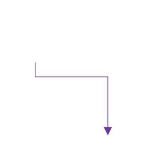
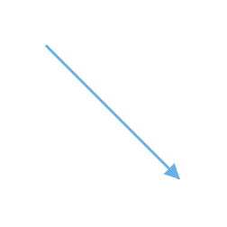

# Interaction in Blazor Diagram Component

Connectors can be selected, dragged, and routed over the diagram page.

## Select

A connector can be selected at runtime by using the [Select](https://help.syncfusion.com/cr/blazor/Syncfusion.Blazor.Diagrams.SfDiagram.html#Syncfusion_Blazor_Diagrams_SfDiagram_Select_System_Object_System_Nullable_System_Boolean__) method and clear the selection in the diagram using the [ClearSelection](https://help.syncfusion.com/cr/blazor/Syncfusion.Blazor.Diagrams.SfDiagram.html#Syncfusion_Blazor_Diagrams_SfDiagram_ClearSelection). The following code explains how to select and clear selection in the diagram.

```cshtml
@using Syncfusion.Blazor.Diagrams
@using System.Collections.ObjectModel

<input type="button" value="Select" @onclick="OnSelect">
<input type="button" value="UnSelect" @onclick="@UnSelect" />
<SfDiagram @ref="@Diagram" Height="600px" Connectors="@ConnectorCollection">
</SfDiagram>

@code {
    // reference of the diagram
    SfDiagram Diagram;
    //Defines diagram's connector collection
    public ObservableCollection<DiagramConnector> ConnectorCollection = new ObservableCollection<DiagramConnector>();

    protected override void OnInitialized()
    {
        DiagramConnector diagramConnector = new DiagramConnector()
        {
            Id = "Connector1",
            SourcePoint = new ConnectorSourcePoint() { X = 100, Y = 100 },
            TargetPoint = new ConnectorTargetPoint() { X = 200, Y = 200 },
            TargetDecorator = new ConnectorTargetDecorator()
            {
                Shape = DecoratorShapes.Arrow,
                Style = new DecoratorShapeStyle()
                {
                    Fill = "#6f409f",
                    StrokeColor = "#6f409f",
                    StrokeWidth = 1
                }
            },
            Style = new ConnectorShapeStyle()
            {
                StrokeColor = "#6f409f",
                StrokeWidth = 1
            },
            Type = Segments.Orthogonal
        };
        ConnectorCollection.Add(diagramConnector);
    }
    public void OnSelect()
    {
        // Select the Connector
        Diagram.Select(new ObservableCollection<DiagramConnector>() { Diagram.Connectors[0] }, null);
    }
    public void UnSelect()
    {
        // clear selection in the diagram
        Diagram.ClearSelection();
    }
}
```

And also the selection can be enabled during the interaction.

* An element can be selected by clicking that element.
* When you select the elements in the diagram, the [SelectionChanged](https://help.syncfusion.com/cr/blazor/Syncfusion.Blazor.Diagrams.DiagramEvents.html#Syncfusion_Blazor_Diagrams_DiagramEvents_SelectionChanged) event gets triggered and do customization in this event.



## Drag

A connector can be dragged at runtime by using the [Drag](https://help.syncfusion.com/cr/blazor/Syncfusion.Blazor.Diagrams.SfDiagram.html#Syncfusion_Blazor_Diagrams_SfDiagram_Drag_System_Object_System_Double_System_Double_) method. The following code explains how to drag the connector by using the drag method.

```cshtml
@using Syncfusion.Blazor.Diagrams
@using System.Collections.ObjectModel

<input type="button" value="Drag" @onclick="OnDrag">

<SfDiagram @ref="@Diagram" Height="600px" Connectors="@ConnectorCollection">
</SfDiagram>

@code {
    // reference of the diagram
    SfDiagram Diagram;
    //Defines diagram's connector collection
    public ObservableCollection<DiagramConnector> ConnectorCollection = new ObservableCollection<DiagramConnector>();

    protected override void OnInitialized()
    {
        DiagramConnector diagramConnector = new DiagramConnector()
        {
            Id = "Connector1",
            SourcePoint = new ConnectorSourcePoint() { X = 100, Y = 100 },
            TargetPoint = new ConnectorTargetPoint() { X = 200, Y = 200 },
            TargetDecorator = new ConnectorTargetDecorator()
            {
                Shape = DecoratorShapes.Arrow,
                Style = new DecoratorShapeStyle()
                {
                    Fill = "#6f409f",
                    StrokeColor = "#6f409f",
                    StrokeWidth = 1
                }
            },
            Style = new ConnectorShapeStyle()
            {
                StrokeColor = "#6f409f",
                StrokeWidth = 1
            },
            Type = Segments.Orthogonal
        };
        ConnectorCollection.Add(diagramConnector);
    }
    public void OnDrag()
    {
        // Drag the connector
        Diagram.Drag(Diagram.Connectors[0], 10, 10);
    }
}
```

And also drag the connector during the interaction.

* An object can be dragged by clicking and dragging it. When multiple elements are selected, dragging any one of the selected elements move all the selected elements.
* When you drag the elements in the diagram, the [OnPositionChange](https://help.syncfusion.com/cr/blazor/Syncfusion.Blazor.Diagrams.DiagramEvents.html#Syncfusion_Blazor_Diagrams_DiagramEvents_OnPositionChange) event gets triggered and to do customization in this event.


## End Point Dragging

The connector can be selected by clicking it. When the connector is selected, circles will be added on the starting and ending of the connector that is represented by Thumbs. Clicking and dragging those handles helps you to adjust the source and target points.

```cshtml

@using Syncfusion.Blazor.Diagrams
@using System.Collections.ObjectModel

<SfDiagram Height="600px" Connectors="@ConnectorCollection">
</SfDiagram>

@code
{
    //Defines diagram's connector collection
    public ObservableCollection<DiagramConnector> ConnectorCollection = new ObservableCollection<DiagramConnector>();

    protected override void OnInitialized()
    {
        DiagramConnector diagramConnector = new DiagramConnector()
        {
            SourcePoint = new ConnectorSourcePoint() { X = 100, Y = 100 },
            TargetPoint = new ConnectorTargetPoint() { X = 200, Y = 200 },
            TargetDecorator = new ConnectorTargetDecorator()
            {
                Shape = DecoratorShapes.Arrow,
                Style = new DecoratorShapeStyle()
                {
                    Fill = "#6f409f",
                    StrokeColor = "#6f409f",
                    StrokeWidth = 1
                }
            },
            Style = new ConnectorShapeStyle()
            {
                StrokeColor = "#6f409f",
                StrokeWidth = 1
            },
            Type = Segments.Straight,
        };
        //Add the connector into connectors's collection.
        ConnectorCollection.Add(diagramConnector);
    }
}
```


## How to Route Connectors

The connectors in the diagram can be overlapped with any neighboring nodes when the node is placed in contact with the connector. This will make less clarity about the connector path flow. This can be avoided using the Routing process. The routing is the process of updating the connector’s geometry to avoid the overlapping with any neighboring nodes in their path.

This behavior can be enabled by adding the `DiagramConstraints.LineRouting` enum value to the Constraints property of the diagram.

```cshtml

@using Syncfusion.Blazor.Diagrams
@using System.Collections.ObjectModel

<SfDiagram Height="600px" Constraints="@Constraints" Nodes="@NodeCollection" Connectors="@ConnectorCollection">
</SfDiagram>

@code
{
    //Defines diagram's nodes collection
    public ObservableCollection<DiagramNode> NodeCollection = new ObservableCollection<DiagramNode>();

    //Defines diagram's connector collection
    public ObservableCollection<DiagramConnector> ConnectorCollection = new ObservableCollection<DiagramConnector>();

    public DiagramConstraints Constraints { get; set; }

    protected override void OnInitialized()
    {
        Constraints = DiagramConstraints.Default | DiagramConstraints.LineRouting | DiagramConstraints.Bridging;
        //Creates source node
        DiagramNode node1 = new DiagramNode()
        {
            OffsetX = 100,
            OffsetY = 100,
            Height = 50,
            Width = 100,
            Id = "node1",
            Shape = new DiagramShape()
            {
                Type = Syncfusion.Blazor.Diagrams.Shapes.Basic,
                BasicShape = BasicShapes.Rectangle
            },
            Style = new NodeShapeStyle()
            {
                Fill = "#37909A",
                StrokeColor = "#37909A",
            },
        };
        //Add node into node's collection
        NodeCollection.Add(node1);

        //Create a target node
        DiagramNode node2 = new DiagramNode()
        {
            OffsetX = 100,
            OffsetY = 300,
            Height = 50,
            Width = 100,
            Id = "node2",
            Shape = new DiagramShape()
            {
                Type = Syncfusion.Blazor.Diagrams.Shapes.Basic,
                BasicShape = BasicShapes.Rectangle
            },
            Style = new NodeShapeStyle()
            {
                Fill = "#37909A",
                StrokeColor = "#37909A",
            },
        };
        //Add node into node's collection
        NodeCollection.Add(node2);
        //Create a target node
        DiagramNode node3 = new DiagramNode()
        {
            OffsetX = 500,
            OffsetY = 300,
            Height = 50,
            Width = 100,
            Id = "node3",
            Shape = new DiagramShape()
            {
                Type = Syncfusion.Blazor.Diagrams.Shapes.Basic,
                BasicShape = BasicShapes.Rectangle
            },
            Style = new NodeShapeStyle()
            {
                Fill = "#37909A",
                StrokeColor = "#37909A",
            },
        };
        //Add node into node's collection
        NodeCollection.Add(node3);

        //create the connector with source node and target node id.
        DiagramConnector diagramConnector = new DiagramConnector()
        {
            //Source node id of the connector.
            SourceID = "node1",
            //Target node id of the connector.
            TargetID = "node2",
            TargetDecorator = new ConnectorTargetDecorator()
            {
                Shape = DecoratorShapes.Arrow,
                Style = new DecoratorShapeStyle()
                {
                    Fill = "#37909A",
                    StrokeColor = "#37909A",
                    StrokeWidth = 1
                }
            },
            Style = new ConnectorShapeStyle()
            {
                StrokeColor = "#37909A",
                StrokeWidth = 1
            },
            Type = Segments.Orthogonal,
        };
        //Adding conector into connector's collection
        ConnectorCollection.Add(diagramConnector);
    }
}
```


## Segment Editing

### Straight segment editing

* End point of each straight segment is represented by a thumb that enables to edit the segment.
* Any number of new segments can be inserted into a straight line by clicking, when Shift and Ctrl keys are pressed (Ctrl+Shift+Click).



* Straight segments can be removed by clicking the segment end point, when Ctrl and Shift keys are pressed (Ctrl+Shift+Click).


### Orthogonal Segment Editing

* Orthogonal thumbs allow you to adjust the length of adjacent segments by clicking and dragging it.
* When necessary, some segments are added or removed automatically, when dragging the segment. This is to maintain proper routing of orthogonality between segments.


### Bezier Segment Editing

* A segment control point of the Bezier connector is used to change the bezier vectors, points of the connector.

## See also

* [How to customize the connector properties](./customization)

* [How to change the segments](./segments)

* [How to get the connector events](./events)