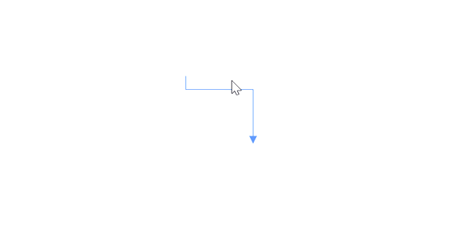
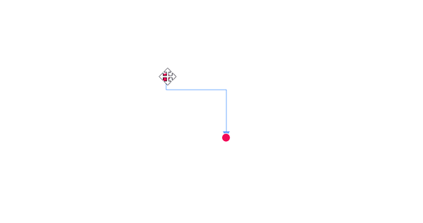
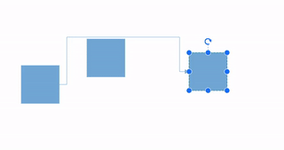
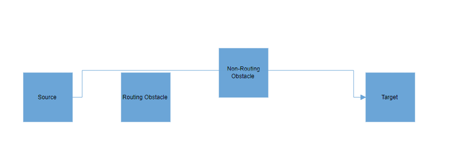
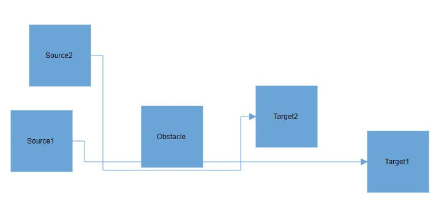
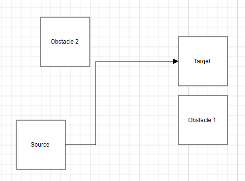
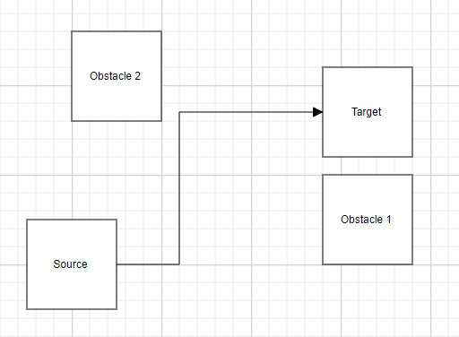
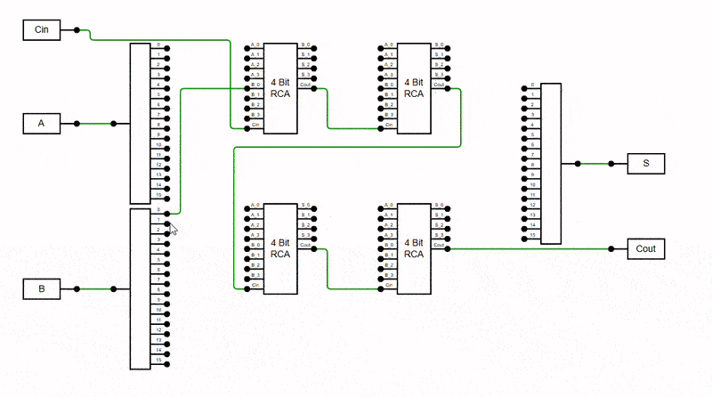

# Interaction in Diagram Component

Connectors can be selected, dragged, and routed over the diagram page.

## How to Select and Deselect Connectors

A connector can be selected at runtime by using the [Select](https://help.syncfusion.com/cr/blazor/Syncfusion.Blazor.Diagram.SfDiagramComponent.html#Syncfusion_Blazor_Diagram_SfDiagramComponent_Select_System_Collections_ObjectModel_ObservableCollection_Syncfusion_Blazor_Diagram_IDiagramObject__System_Nullable_System_Boolean__) method and clear the selection in the diagram using the [ClearSelection](https://help.syncfusion.com/cr/blazor/Syncfusion.Blazor.Diagram.SfDiagramComponent.html#Syncfusion_Blazor_Diagram_SfDiagramComponent_ClearSelection). The following code explains how to select and clear selection in the diagram.

```cshtml
@using Syncfusion.Blazor.Diagram
@using System.Collections.ObjectModel
@using Syncfusion.Blazor.Buttons

<SfButton Content="Select" OnClick="@OnSelect" />
<SfButton Content="UnSelect" OnClick="@UnSelect" />
<SfDiagramComponent @ref="Diagram" Width="1000px" Height="500px" Connectors="@connectors">
</SfDiagramComponent>

@code
{
    SfDiagramComponent Diagram;
    DiagramObjectCollection<Connector> connectors = new DiagramObjectCollection<Connector>();

    protected override void OnInitialized()
    {
        Dictionary<string, object> ConnectorInfo = new Dictionary<string, object>();
        ConnectorInfo.Add("connectorInfo", "Central Connector");
        Connector Connector = new Connector()
        {
            ID = "connector1",
            SourcePoint = new DiagramPoint()
            {
                X = 100,
                Y = 100
            },
            TargetPoint = new DiagramPoint()
            {
                X = 200,
                Y = 200
            },
            Type = ConnectorSegmentType.Orthogonal,
            TargetDecorator = new DecoratorSettings()
            {
                Shape = DecoratorShape.Arrow,
                Style = new ShapeStyle()
                {
                    Fill = "#6495ED",
                    StrokeColor = "#6495ED",
                    StrokeWidth = 1
                }
            },
            Style = new ShapeStyle()
            {
                StrokeColor = "#6495ED",
                StrokeWidth = 1
            },
            AdditionalInfo = ConnectorInfo
        };
        connectors.Add(Connector);
    }

    public void OnSelect()
    {
        // Select the Connector.
        Diagram.Select(new ObservableCollection<IDiagramObject> { Diagram.GetObject(Diagram.Connectors[0].ID) as IDiagramObject });
    }

    public void UnSelect()
    {
        // Clear selection in the diagram.
        Diagram.ClearSelection();
    }
}
```
You can download a complete working sample from [GitHub](https://github.com/SyncfusionExamples/Blazor-Diagram-Examples/tree/master/UG-Samples/Connectors/Interaction/Select)

And also the selection can be enabled during the interaction.

* An element can be selected by clicking that element.
* When you select the elements in the diagram, the [SelectionChanging](https://help.syncfusion.com/cr/blazor/Syncfusion.Blazor.Diagram.SfDiagramComponent.html#Syncfusion_Blazor_Diagram_SfDiagramComponent_SelectionChanging) and  [SelectionChanged](https://help.syncfusion.com/cr/blazor/Syncfusion.Blazor.Diagram.SfDiagramComponent.html#Syncfusion_Blazor_Diagram_SfDiagramComponent_SelectionChanged) events get triggered and allow customization in these events.

## How to Drag a Connector

A connector can be dragged at runtime by using the [Drag](https://help.syncfusion.com/cr/blazor/Syncfusion.Blazor.Diagram.SfDiagramComponent.html#Syncfusion_Blazor_Diagram_SfDiagramComponent_Drag_Syncfusion_Blazor_Diagram_IDiagramObject_System_Double_System_Double_) method. The following code explains how to drag the connector by using the drag method.

```cshtml
@using Syncfusion.Blazor.Diagram
@using Syncfusion.Blazor.Buttons

<SfButton Content="Drag" OnClick="@OnDrag" />
<SfDiagramComponent @ref="Diagram" Width="1000px" Height="500px" Connectors="@connectors">
</SfDiagramComponent>

@code
{
    SfDiagramComponent Diagram;
    DiagramObjectCollection<Connector> connectors = new DiagramObjectCollection<Connector>();

    protected override void OnInitialized()
    {
        Dictionary<string, object> ConnectorInfo = new Dictionary<string, object>();
        ConnectorInfo.Add("connectorInfo", "Central Connector");
        Connector Connector = new Connector()
        {
            ID = "connector1",
            SourcePoint = new DiagramPoint()
            {
                X = 100,
                Y = 100
            },
            TargetPoint = new DiagramPoint()
            {
                X = 200,
                Y = 200
            },
            Type = ConnectorSegmentType.Orthogonal,
            TargetDecorator = new DecoratorSettings()
            {
                Shape = DecoratorShape.Arrow,
                Style = new ShapeStyle()
                {
                    Fill = "black",
                    StrokeColor = "black",
                    StrokeWidth = 1
                }
            },
            Style = new ShapeStyle()
            {
                StrokeColor = "black",
                StrokeWidth = 1
            },
            AdditionalInfo = ConnectorInfo
        };
        connectors.Add(Connector);
    }

    public void OnDrag()
    {
        // Drag the connector.
        Diagram.Drag(Diagram.Connectors[0], 10, 10);
    }
}
```
You can download a complete working sample from [GitHub](https://github.com/SyncfusionExamples/Blazor-Diagram-Examples/tree/master/UG-Samples/Connectors/Interaction/Drag)

And also drag the connector during the interaction.

* An object can be dragged by clicking and dragging it. When multiple elements are selected, dragging any one of the selected elements move all the selected elements.
* When you drag the elements in the diagram, the [PositionChanging](https://help.syncfusion.com/cr/blazor/Syncfusion.Blazor.Diagram.SfDiagramComponent.html#Syncfusion_Blazor_Diagram_SfDiagramComponent_PositionChanging) and [PositionChanged](https://help.syncfusion.com/cr/blazor/Syncfusion.Blazor.Diagram.SfDiagramComponent.html#Syncfusion_Blazor_Diagram_SfDiagramComponent_PositionChanged) events get triggered and allow customization in these events.



## How to Drag Connector Endpoints

The connector can be selected by clicking it. When the connector is selected, circles will be added on the starting and ending of the connector that is represented by Thumbs. Clicking and dragging those handles helps you to adjust the source and target points.

```cshtml
@using Syncfusion.Blazor.Diagram

<SfDiagramComponent @ref="Diagram" Width="1000px" Height="500px" Connectors="@connectors">
</SfDiagramComponent>

@code
{
    SfDiagramComponent Diagram;
    DiagramObjectCollection<Connector> connectors = new DiagramObjectCollection<Connector>();

    protected override void OnInitialized()
    {
        Dictionary<string, object> ConnectorInfo = new Dictionary<string, object>();
        ConnectorInfo.Add("connectorInfo", "Central Connector");
        Connector Connector = new Connector()
        {
            ID = "connector1",
            SourcePoint = new DiagramPoint()
            {
                X = 100,
                Y = 100
            },
            TargetPoint = new DiagramPoint()
            {
                X = 200,
                Y = 200
            },
            Type = ConnectorSegmentType.Orthogonal,
            TargetDecorator = new DecoratorSettings()
            {
                Shape = DecoratorShape.Arrow,
                Style = new ShapeStyle()
                {
                    Fill = "black",
                    StrokeColor = "black",
                    StrokeWidth = 1
                }
            },
            Style = new ShapeStyle()
            {
                StrokeColor = "black",
                StrokeWidth = 1
            },
            AdditionalInfo = ConnectorInfo
        };
        connectors.Add(Connector);
    }
}
```
You can download a complete working sample from [GitHub](https://github.com/SyncfusionExamples/Blazor-Diagram-Examples/tree/master/UG-Samples/Connectors/Interaction/EndPointDragging)



## How to Route the Connectors

The connectors may overlap with adjacent nodes when a node is positioned so that it encounters the connector. This overlap can reduce the clarity of the connector's path. To prevent this, the Routing process can be utilized.

Routing is the process of adjusting the geometry of connectors to prevent them from overlapping with any nearby nodes in their path. This feature can be activated by adding the [Routing](https://help.syncfusion.com/cr/blazor/Syncfusion.Blazor.Diagram.DiagramConstraints.html#Syncfusion_Blazor_Diagram_DiagramConstraints_Routing) enum value to the [Constraints](https://help.syncfusion.com/cr/blazor/Syncfusion.Blazor.Diagram.SfDiagramComponent.html#Syncfusion_Blazor_Diagram_SfDiagramComponent_Constraints) property of diagram.

```cshtml
@using Syncfusion.Blazor.Diagram

<SfDiagramComponent Width="1000px" Height="500px" Connectors="@connectors" Nodes="@nodes" Constraints="@diagramConstraints">
</SfDiagramComponent>
@code 
{    
    // Enable routing constraints for diagram.
    DiagramConstraints diagramConstraints = DiagramConstraints.Default | DiagramConstraints.Routing;
    // Intialize the node collection.
    DiagramObjectCollection<Node> nodes = new DiagramObjectCollection<Node>();
    // Intialize the connector collection.
    DiagramObjectCollection<Connector> connectors = new DiagramObjectCollection<Connector>();
    
    protected override void OnInitialized()
    {
        nodes = new DiagramObjectCollection<Node>()
        {
            new Node() { ID = "node1", OffsetX = 100, OffsetY = 300, Width = 100, Height =100 },
            new Node() { ID = "node2", OffsetX = 600, OffsetY = 100, Width = 100, Height = 100 },
            new Node() { ID = "node3", OffsetX = 400, OffsetY = 250, Width = 100, Height = 100 }
        };
        connectors = new DiagramObjectCollection<Connector>(){
            new Connector()
            {
                ID = "connector1",
                SourceID = "node1", TargetID = "node2",
                Type = ConnectorSegmentType.Orthogonal
            }
        };
    }
}
```


You can download a complete working sample from [GitHub](https://github.com/SyncfusionExamples/Blazor-Diagram-Examples/tree/master/UG-Samples/Connectors/Interaction/DefaultRouting).

**Note:** Routing is applicable only for orthogonal connectors.

### Routing Types

Determines the routing strategy used for connectors in the diagram. It can be set to either [Classic](https://help.syncfusion.com/cr/blazor/Syncfusion.Blazor.Diagram.RoutingTypes.html#Syncfusion_Blazor_Diagram_RoutingTypes_Classic) for faster routing or [Advanced](https://help.syncfusion.com/cr/blazor/Syncfusion.Blazor.Diagram.RoutingTypes.html#Syncfusion_Blazor_Diagram_RoutingTypes_Advanced) for more accurate routing with better obstacle avoidance. The routing algorithm can be specified by using [RoutingType](https://help.syncfusion.com/cr/blazor/Syncfusion.Blazor.Diagram.LineRoutingSettings.html#Syncfusion_Blazor_Diagram_LineRoutingSettings_RoutingType) property of [LineRoutingSettings](https://help.syncfusion.com/cr/blazor/Syncfusion.Blazor.Diagram.LineRoutingSettings.html) class.

#### Classic Routing

The [Classic](https://help.syncfusion.com/cr/blazor/Syncfusion.Blazor.Diagram.RoutingTypes.html#Syncfusion_Blazor_Diagram_RoutingTypes_Classic) routing algorithm adds additional segments based on the position and dimensions of the obstacles in the path. This routing method prioritizes reducing the impact of obstacles over minimizing the geometry length and the number of bends. Use Classic routing when it's crucial to navigate around obstacles efficiently, even if it means having a longer path or more bends.


```cshtml
@using Syncfusion.Blazor.Diagram

<SfDiagramComponent Width="1000px" Height="500px" Connectors="@connectors" Nodes="@nodes" Constraints="@diagramConstraints">
    <LineRoutingSettings RoutingType ="@routingTypes"></LineRoutingSettings>
</SfDiagramComponent>
@code 
{
    // Set the type of the routing
    RoutingTypes routingTypes = RoutingTypes.Classic;
    // Enable routing constraints for diagram.
    DiagramConstraints diagramConstraints = DiagramConstraints.Default | DiagramConstraints.Routing;
    // Intialize the node collection.
    DiagramObjectCollection<Node> nodes = new DiagramObjectCollection<Node>();
    // Intialize the connector collection.
    DiagramObjectCollection<Connector> connectors = new DiagramObjectCollection<Connector>();
    
    protected override void OnInitialized()
    {
        nodes = new DiagramObjectCollection<Node>()
        {
            new Node() { ID = "node1", OffsetX = 100, OffsetY = 300, Width = 100, Height =100 },
            new Node() { ID = "node2", OffsetX = 600, OffsetY = 100, Width = 100, Height = 100 },
            new Node() { ID = "node3", OffsetX = 400, OffsetY = 250, Width = 100, Height = 100 }
        };
        connectors = new DiagramObjectCollection<Connector>(){
            new Connector()
            {
                ID = "connector1",
                SourceID = "node1", TargetID = "node2",
                Type = ConnectorSegmentType.Orthogonal
            }
        };
    }
}
```
You can download a complete working sample from [GitHub](https://github.com/SyncfusionExamples/Blazor-Diagram-Examples/tree/master/UG-Samples/Connectors/Interaction/ClassicLineRouting)

#### Advanced Routing

The [Advanced](https://help.syncfusion.com/cr/blazor/Syncfusion.Blazor.Diagram.RoutingTypes.html#Syncfusion_Blazor_Diagram_RoutingTypes_Advanced) routing algorithm evaluates all possible geometrical paths for a connector, aiming to find the one with the minimal bends and the shortest length. Use Advanced routing when you need a more optimized path with the fewest bends and the shortest possible length, even if it means the path might get closer to obstacles.

```cshtml
@using Syncfusion.Blazor.Diagram

<SfDiagramComponent Width="1000px" Height="500px" Connectors="@connectors" Nodes="@nodes" Constraints="@diagramConstraints">
    <LineRoutingSettings RoutingType ="@routingTypes" ObstaclePadding="@padding"></LineRoutingSettings>
</SfDiagramComponent>
@code 
{
    // Set the type of the routing
    RoutingTypes routingTypes = RoutingTypes.Advanced;
    // Set the padding for the obstable
    double padding = 20;
    // Enable routing constraints for diagram.
    DiagramConstraints diagramConstraints = DiagramConstraints.Default | DiagramConstraints.Routing;
    // Intialize the node collection.
    DiagramObjectCollection<Node> nodes = new DiagramObjectCollection<Node>();
    // Intialize the connector collection.
    DiagramObjectCollection<Connector> connectors = new DiagramObjectCollection<Connector>();
    
    protected override void OnInitialized()
    {
        nodes = new DiagramObjectCollection<Node>()
        {
            new Node() { ID = "node1", OffsetX = 100, OffsetY = 300, Width = 100, Height =100 },
            new Node() { ID = "node2", OffsetX = 600, OffsetY = 100, Width = 100, Height = 100 },
            new Node() { ID = "node3", OffsetX = 400, OffsetY = 250, Width = 100, Height = 100 }
        };
        connectors = new DiagramObjectCollection<Connector>(){
            new Connector()
            {
                ID = "connector1",
                SourceID = "node1", TargetID = "node2",
                Type = ConnectorSegmentType.Orthogonal
            }
        };
    }
}
```

You can download a complete working sample from [GitHub](https://github.com/SyncfusionExamples/Blazor-Diagram-Examples/tree/master/UG-Samples/Connectors/Interaction/LineRoutingSettings)

**Note:** Default value of [RoutingType](https://help.syncfusion.com/cr/blazor/Syncfusion.Blazor.Diagram.LineRoutingSettings.html#Syncfusion_Blazor_Diagram_LineRoutingSettings_RoutingType) is [Classic](https://help.syncfusion.com/cr/blazor/Syncfusion.Blazor.Diagram.RoutingTypes.html#Syncfusion_Blazor_Diagram_RoutingTypes_Classic).

### How to Enable or Disable Node Routing

By default, connectors treat all nodes as obstacles, causing connections to navigate around the node boundaries. However, you can disable this behavior and allow connectors to ignore the node as an obstacle by removing the [RoutingObstacle](https://help.syncfusion.com/cr/blazor/Syncfusion.Blazor.Diagram.NodeConstraints.html#Syncfusion_Blazor_Diagram_NodeConstraints_RoutingObstacle) from the node's [Constraints](https://help.syncfusion.com/cr/blazor/Syncfusion.Blazor.Diagram.Node.html#Syncfusion_Blazor_Diagram_Node_Constraints) property.

```cshtml
@using Syncfusion.Blazor.Diagram

<SfDiagramComponent Width="1000px" Height="500px" NodeCreating="@OnNodeCreating" ConnectorCreating="@OnConnectorCreating" Connectors="@connectors" Nodes="@nodes" Constraints="@diagramConstraints">
    <SnapSettings Constraints="SnapConstraints.None"></SnapSettings>
</SfDiagramComponent>
@code
{
    // Enable routing constraints for the diagram.
    DiagramConstraints diagramConstraints = DiagramConstraints.Default | DiagramConstraints.Routing;
    // Intialize the node collection.
    DiagramObjectCollection<Node> nodes = new DiagramObjectCollection<Node>();
    // Intialize the connector collection.
    DiagramObjectCollection<Connector> connectors = new DiagramObjectCollection<Connector>();
    protected override void OnInitialized()
    {
        nodes = new DiagramObjectCollection<Node>()
        {
            new Node() { ID = "Source", OffsetX = 100, OffsetY = 300, Width = 100, Height =100, Annotations= new DiagramObjectCollection<ShapeAnnotation>(){ new ShapeAnnotation() { Content="Source" } }, Ports=new DiagramObjectCollection<PointPort>(){ new PointPort(){ ID="port1", Offset=new DiagramPoint() { X = 1, Y = 0.5 } } } },
            new Node() { ID = "Target", OffsetX = 800, OffsetY = 300, Width = 100, Height = 100, Annotations= new DiagramObjectCollection<ShapeAnnotation>(){ new ShapeAnnotation() { Content="Target" } }, Ports=new DiagramObjectCollection<PointPort>(){ new PointPort(){ ID="port1", Offset=new DiagramPoint() { X = 0, Y = 0.5 } } } },
            new Node() { ID = "RoutingObstacle", OffsetX = 300, OffsetY = 300, Width = 100, Height = 100,  Annotations= new DiagramObjectCollection<ShapeAnnotation>(){ new ShapeAnnotation() { Content="Routing Obstacle" } }, },
            new Node() { ID = "NonRoutingObstacle", OffsetX = 500, OffsetY = 250, Width = 100, Height = 100,  Annotations= new DiagramObjectCollection<ShapeAnnotation>(){ new ShapeAnnotation() { Content="Non-Routing Obstacle" } }, Constraints = NodeConstraints.Default & ~NodeConstraints.RoutingObstacle }
        };
        connectors = new DiagramObjectCollection<Connector>(){
            new Connector()
            {
                ID = "connector1",
                SourceID = "Source", TargetID = "Target", SourcePortID="port1", TargetPortID="port1",
                Type = ConnectorSegmentType.Orthogonal
            }
        };
    }
    private void OnNodeCreating(IDiagramObject obj)
    {
        if (obj is Node node)
        {
            node.Style = new ShapeStyle() { Fill = "#6BA5D7", StrokeColor = "#6BA5D7" };
        }
    }
    private void OnConnectorCreating(IDiagramObject obj)
    {
        if (obj is Connector connector)
        {
            connector.Style = new ShapeStyle() { StrokeColor = "#6BA5D7", StrokeWidth = 1 };
            connector.TargetDecorator = new DecoratorSettings()
                {
                    Shape = DecoratorShape.Arrow,
                    Style = new ShapeStyle() { Fill = "#6BA5D7", StrokeColor = "#6BA5D7", StrokeWidth = 1 }
                };
        }
    }
}
```


You can download a complete working sample from [GitHub](https://github.com/SyncfusionExamples/Blazor-Diagram-Examples/tree/master/UG-Samples/Connectors/Interaction/NodeRoutingObstable).

### How to Enable or Disable Connector Routing

By default, each connector's routing process is inherited based on the value of the diagram's [Constraints](https://help.syncfusion.com/cr/blazor/Syncfusion.Blazor.Diagram.SfDiagramComponent.html#Syncfusion_Blazor_Diagram_SfDiagramComponent_Constraints) property. If you wish to independently control the routing of a specific connector regardless of the diagram settings, you can achieve this by removing the [InheritRouting](https://help.syncfusion.com/cr/blazor/Syncfusion.Blazor.Diagram.ConnectorConstraints.html#Syncfusion_Blazor_Diagram_ConnectorConstraints_InheritRouting) enum value from the connector's [Constraints](https://help.syncfusion.com/cr/blazor/Syncfusion.Blazor.Diagram.Connector.html#Syncfusion_Blazor_Diagram_Connector_Constraints) property. Then, add the [Routing](https://help.syncfusion.com/cr/blazor/Syncfusion.Blazor.Diagram.ConnectorConstraints.html#Syncfusion_Blazor_Diagram_ConnectorConstraints_Routing) enum value to enable routing or remove it to disable routing altogether.

```cshtml
@using Syncfusion.Blazor.Diagram

<SfDiagramComponent Width="1000px" Height="500px" NodeCreating="@OnNodeCreating" ConnectorCreating="@OnConnectorCreating" Connectors="@connectors" Nodes="@nodes" Constraints="@diagramConstraints">
    <SnapSettings Constraints="SnapConstraints.None"></SnapSettings>
</SfDiagramComponent>
@code
{
    // Enable routing constraints for the diagram.
    DiagramConstraints diagramConstraints = DiagramConstraints.Default | DiagramConstraints.Routing;
    //Intialize the node collection
    DiagramObjectCollection<Node> nodes = new DiagramObjectCollection<Node>();
    //Intialize the connector collection
    DiagramObjectCollection<Connector> connectors = new DiagramObjectCollection<Connector>();
    protected override void OnInitialized()
    {
        nodes = new DiagramObjectCollection<Node>()
        {
            new Node() { ID = "Source", OffsetX = 90, OffsetY = 290, Width = 100, Height =100, Annotations= new DiagramObjectCollection<ShapeAnnotation>(){ new ShapeAnnotation() { Content="Source1" } }, Ports=new DiagramObjectCollection<PointPort>(){ new PointPort(){ ID="port1", Offset=new DiagramPoint() { X = 1, Y = 0.5 } } } },
            new Node() { ID = "Target", OffsetX = 700, OffsetY = 304, Width = 100, Height = 100, Annotations= new DiagramObjectCollection<ShapeAnnotation>(){ new ShapeAnnotation() { Content="Target1" } }, Ports=new DiagramObjectCollection<PointPort>(){ new PointPort(){ ID="port1", Offset=new DiagramPoint() { X = 0, Y = 0.5 } } } },
            new Node() { ID = "Source2", OffsetX = 120, OffsetY = 150, Width = 100, Height = 100,  Annotations= new DiagramObjectCollection<ShapeAnnotation>(){ new ShapeAnnotation() { Content="Source2" } }, },
            new Node() { ID = "Target2", OffsetX = 490, OffsetY = 250, Width = 100, Height = 100,  Annotations= new DiagramObjectCollection<ShapeAnnotation>(){ new ShapeAnnotation() { Content="Target2" } } },
            new Node() { ID = "Obstacle", OffsetX = 291, OffsetY = 300, Width = 100, Height = 100,  Annotations= new DiagramObjectCollection<ShapeAnnotation>(){ new ShapeAnnotation() { Content="Obstacle" } }, },
        };
        connectors = new DiagramObjectCollection<Connector>(){
            new Connector()
            {
                ID = "connector1",
                SourceID = "Source", TargetID = "Target",
                Type = ConnectorSegmentType.Orthogonal,
                // Disable the inherit routing for the connector
                Constraints = ConnectorConstraints.Default & ~ConnectorConstraints.InheritRouting,
                Annotations = new DiagramObjectCollection<PathAnnotation>(){ new PathAnnotation(){ Content = "Without Routing" } }
            },
            new Connector()
            {
                ID = "connector2",
                SourceID = "Source2", TargetID = "Target2",
                Type = ConnectorSegmentType.Orthogonal,
                // Enable the routing for the connector
                Constraints = (ConnectorConstraints.Default & ~ConnectorConstraints.InheritRouting) | ConnectorConstraints.Routing,
                Annotations = new DiagramObjectCollection<PathAnnotation>(){ new PathAnnotation(){ Content = "With Routing" } }
            }
        };
    }
    private void OnNodeCreating(IDiagramObject obj)
    {
        if (obj is Node node)
        {
            node.Style = new ShapeStyle() { Fill = "#6BA5D7", StrokeColor = "#6BA5D7" };
        }
    }
    private void OnConnectorCreating(IDiagramObject obj)
    {
        if (obj is Connector connector)
        {
            connector.Style = new ShapeStyle() { StrokeColor = "#6BA5D7", StrokeWidth = 1 };
            connector.TargetDecorator = new DecoratorSettings()
                {
                    Shape = DecoratorShape.Arrow,
                    Style = new ShapeStyle() { Fill = "#6BA5D7", StrokeColor = "#6BA5D7", StrokeWidth = 1 }
                };
        }
    }
}
```


You can download a complete working sample from [GitHub](https://github.com/SyncfusionExamples/Blazor-Diagram-Examples/tree/master/UG-Samples/Connectors/Interaction/RoutingConstraints).

### How to Define Distance Between Nodes and Connectors

The [ObstaclePadding](https://help.syncfusion.com/cr/blazor/Syncfusion.Blazor.Diagram.LineRoutingSettings.html#Syncfusion_Blazor_Diagram_LineRoutingSettings_ObstaclePadding) defines the minimum distance between the connectors and obstacles when the advanced routing is enabled. This ensures connectors are routed with clear spacing around obstacles, improving diagram readability.

```cshtml
@using Syncfusion.Blazor.Diagram

<SfDiagramComponent Width="1000px" Height="500px" Connectors="@connectors" Nodes="@nodes" Constraints="@diagramConstraints">
    <LineRoutingSettings RoutingType ="@routingTypes" ObstaclePadding="@padding"></LineRoutingSettings>
</SfDiagramComponent>
@code 
{
    // Set the type of the routing
    RoutingTypes routingTypes = RoutingTypes.Advanced;
    // Set the padding for the obstable
    double padding = 20;
    // Enable routing constraints for diagram.
    DiagramConstraints diagramConstraints = DiagramConstraints.Default | DiagramConstraints.Routing;
    // Intialize the node collection.
    DiagramObjectCollection<Node> nodes = new DiagramObjectCollection<Node>();
    // Intialize the connector collection.
    DiagramObjectCollection<Connector> connectors = new DiagramObjectCollection<Connector>();
    
    protected override void OnInitialized()
    {
        nodes = new DiagramObjectCollection<Node>()
        {
             new Node() { ID = "node1", OffsetX = 100, OffsetY = 300, Width = 100, Height =100, Annotations= new DiagramObjectCollection<ShapeAnnotation>(){ new ShapeAnnotation() { Content="Source" } } },
             new Node() { ID = "node2", OffsetX = 430, OffsetY = 130, Width = 100, Height = 100, Annotations= new DiagramObjectCollection<ShapeAnnotation>(){ new ShapeAnnotation() { Content="Target" } } },
             new Node() { ID = "node3", OffsetX = 430, OffsetY = 250, Width = 100, Height = 100, Annotations= new DiagramObjectCollection<ShapeAnnotation>(){ new ShapeAnnotation() { Content="Obstacle 1" } } },
             new Node() { ID = "node4", OffsetX = 150, OffsetY = 90, Width = 100, Height = 100, Annotations= new DiagramObjectCollection<ShapeAnnotation>(){ new ShapeAnnotation() { Content="Obstacle 2" } } }
      
        };
        connectors = new DiagramObjectCollection<Connector>(){
            new Connector()
            {
                ID = "connector1",
                SourceID = "node1", TargetID = "node2",
                Type = ConnectorSegmentType.Orthogonal
            }
        };
    }
}
```

You can download a complete working sample from [GitHub](https://github.com/SyncfusionExamples/Blazor-Diagram-Examples/tree/master/UG-Samples/Connectors/Interaction/ObstaclePadding)

The following table shows the various obstacle padding.

| ObstaclePadding values | Output |
|---|---|
| 12 |  |
| 20 |  |

**Note:** [ObstaclePadding](https://help.syncfusion.com/cr/blazor/Syncfusion.Blazor.Diagram.LineRoutingSettings.html#Syncfusion_Blazor_Diagram_LineRoutingSettings_ObstaclePadding) property is only applicable when the [RoutingType](https://help.syncfusion.com/cr/blazor/Syncfusion.Blazor.Diagram.LineRoutingSettings.html#Syncfusion_Blazor_Diagram_LineRoutingSettings_RoutingType) property is set to [RoutingTypes.Advanced]. Default value of [ObstaclePadding](https://help.syncfusion.com/cr/blazor/Syncfusion.Blazor.Diagram.LineRoutingSettings.html#Syncfusion_Blazor_Diagram_LineRoutingSettings_ObstaclePadding) is 12.

## How to Avoid Line Overlapping
The diagram provides flexibility to prevent connectors from overlapping, enhance clarity and readability. This feature intelligently adjusts connector paths to minimise stacking orthogonal connectors on top of each other, reducing visual clutter and enhancing diagram structure. It is especially useful in complex diagrams with multiple orthogonal connectors, where overlapping lines can make interpretation difficult.

This feature can be activated by adding the [AvoidLineOverlapping](https://help.syncfusion.com/cr/blazor/Syncfusion.Blazor.Diagram.DiagramConstraints.html#Syncfusion_Blazor_Diagram_DiagramConstraints_AvoidLineOverlapping) enum value to the [Constraints](https://help.syncfusion.com/cr/blazor/Syncfusion.Blazor.Diagram.SfDiagramComponent.html#Syncfusion_Blazor_Diagram_SfDiagramComponent_Constraints) property of the diagram.


```cshtml
@using Syncfusion.Blazor
@using Syncfusion.Blazor.Diagram
<SfDiagramComponent @ref="diagram" Height="700px" Width="100%" @bind-Nodes="@nodes" LineRoutingSettings="@LineRoutingSettings" @bind-Connectors="@connectors" Constraints="@diagramConstraints">
</SfDiagramComponent>

@code {
    SfDiagramComponent diagram;
    DiagramObjectCollection<Node> nodes = new DiagramObjectCollection<Node>();
    DiagramObjectCollection<Connector> connectors = new DiagramObjectCollection<Connector>();
    SnapConstraints snapConstraints = SnapConstraints.All;
    DiagramInteractions DiagramInteractions = DiagramInteractions.ZoomPan;
    DiagramConstraints diagramConstraints = DiagramConstraints.Default | DiagramConstraints.Routing | DiagramConstraints.AvoidLineOverlapping;
    LineRoutingSettings LineRoutingSettings = new LineRoutingSettings()
    {
        RoutingType = RoutingTypes.Classic
    };
}
```



The Avoid Connector Overlapping feature ensures that connectors do not visually overlap within the viewport. This behavior enhances diagram readability and minimizes visual clutter.

**Viewport-Based Resolution:** Overlaps are resolved only for connectors currently visible in the viewport. As you scroll through the diagram, additional connectors will automatically adjust and avoid overlapping once they come into view.

**Overview Behavior:** In the Overview panel, connectors that lie outside the current viewport may initially appear overlapped. These will also be resolved dynamically as the corresponding area comes into focus in the main diagram view.

The following example demonstrates how to enable the AvoidLineOverlapping feature in the diagram.


```cshtml

@using Syncfusion.Blazor
@using Syncfusion.Blazor.Diagram
<SfDiagramComponent @ref="diagram" Height="700px" Width="100%" @bind-Nodes="@nodes" LineRoutingSettings="@LineRoutingSettings" @bind-Connectors="@connectors" Constraints="@diagramConstraints">

</SfDiagramComponent>

@code {
    SfDiagramComponent diagram;
    DiagramObjectCollection<Node> nodes = new DiagramObjectCollection<Node>();
    DiagramObjectCollection<Connector> connectors = new DiagramObjectCollection<Connector>();
    DiagramConstraints diagramConstraints = DiagramConstraints.Default | DiagramConstraints.Routing | DiagramConstraints.AvoidLineOverlapping;
    LineRoutingSettings LineRoutingSettings = new LineRoutingSettings()
    {
        RoutingType = RoutingTypes.Classic
    };
    protected override void OnInitialized()
    {
        InitDiagramModel();
    }

    private void InitDiagramModel()
    {
        Create1to16Node("node1", 205, 180, 80, 240);
        Create1to16Node("node2", 205, 427.5, 80, 240);
        Create9to5Node("node3", 415, 127.5, 100, 135);
        Create9to5Node("node4", 415, 367.5, 100, 135);
        Create9to5Node("node5", 615, 127.5, 100, 135);
        Create9to5Node("node6", 615, 367.5, 100, 135);
        Create16to1Node("node7", 820, 240, 80, 240);
        CreateInputNode("node8", 70, 40, 80, 30, "Cin");
        CreateInputNode("node9", 70, 180, 80, 30, "A");
        CreateInputNode("node10", 70, 427.5, 80, 30, "B");
        CreateOutputNode("node11", 950, 240, 80, 30, "S");
        CreateOutputNode("node12", 950, 367.5, 80, 30, "Cout");
        CreateConnector("connector01", "node8", "node3", 0, 8, "lightGreen");
        CreateConnector("connector02", "node9", "node1", 0, 0, "orange");
        CreateConnector("connector03", "node10", "node2", 0, 0, "orange");
        CreateConnector("connector04", "node7", "node11", 0, 0, "orange");
        CreateConnector("connector05", "node6", "node12", 4, 0);
        CreateConnector("connector06", "node3", "node5", 4, 8);
        CreateConnector("connector07", "node5", "node4", 4, 8, "lightGreen");
        CreateConnector("connector08", "node4", "node6", 4, 8);

        CreateConnector("connector1", "node1", "node3", 0, 0);
        CreateConnector("connector2", "node1", "node3", 1, 1);
        CreateConnector("connector3", "node1", "node3", 2, 2);
        CreateConnector("connector4", "node1", "node3", 3, 3);
        CreateConnector("connector5", "node1", "node5", 4, 0, "lightGreen");

        CreateConnector("connector6", "node1", "node5", 5, 1);
        CreateConnector("connector7", "node1", "node5", 6, 2);
        CreateConnector("connector8", "node1", "node5", 7, 3, "lightGreen");
        CreateConnector("connector9", "node1", "node4", 8, 0, "lightGreen");
        CreateConnector("connector10", "node1", "node4", 9, 1, "lightGreen");
        CreateConnector("connector11", "node1", "node4", 10, 2);
        CreateConnector("connector12", "node1", "node4", 11, 3, "lightGreen");

        CreateConnector("connector13", "node1", "node6", 12, 0);
        CreateConnector("connector14", "node1", "node6", 13, 1, "lightGreen");
        CreateConnector("connector15", "node1", "node6", 14, 2, "lightGreen");
        CreateConnector("connector16", "node1", "node6", 15, 3);
        CreateConnector("connector17", "node2", "node3", 0, 4, "lightGreen");
        CreateConnector("connector18", "node2", "node3", 1, 5, "lightGreen");
        CreateConnector("connector19", "node2", "node3", 2, 6);
        CreateConnector("connector20", "node2", "node3", 3, 7);
        CreateConnector("connector25", "node2", "node4", 8, 4);
        CreateConnector("connector26", "node2", "node4", 9, 5, "lightGreen");
        CreateConnector("connector27", "node2", "node4", 10, 6);
        CreateConnector("connector28", "node2", "node4", 11, 7);
        CreateConnector("connector24", "node2", "node5", 7, 7, "lightGreen");
        CreateConnector("connector23", "node2", "node5", 6, 6, "lightGreen");
        CreateConnector("connector22", "node2", "node5", 5, 5, "lightGreen");
        CreateConnector("connector21", "node2", "node5", 4, 4, "lightGreen");
        CreateConnector("connector29", "node2", "node6", 12, 4, "lightGreen");
        CreateConnector("connector30", "node2", "node6", 13, 5);
        CreateConnector("connector31", "node2", "node6", 14, 6);
        CreateConnector("connector32", "node2", "node6", 15, 7);
        CreateConnector("connector33", "node3", "node7", 0, 0);
        CreateConnector("connector34", "node3", "node7", 1, 1);
        CreateConnector("connector35", "node3", "node7", 2, 2, "lightGreen");
        CreateConnector("connector36", "node3", "node7", 3, 3);
        CreateConnector("connector37", "node5", "node7", 0, 4);
        CreateConnector("connector38", "node5", "node7", 1, 5);
        CreateConnector("connector39", "node5", "node7", 2, 6);
        CreateConnector("connector40", "node5", "node7", 3, 7, "lightGreen");
        CreateConnector("connector41", "node4", "node7", 0, 8);
        CreateConnector("connector42", "node4", "node7", 1, 9);
        CreateConnector("connector43", "node4", "node7", 2, 10, "lightGreen");
        CreateConnector("connector44", "node4", "node7", 3, 11);
        CreateConnector("connector45", "node6", "node7", 0, 12);
        CreateConnector("connector46", "node6", "node7", 1, 13);
        CreateConnector("connector47", "node6", "node7", 2, 14);
        CreateConnector("connector48", "node6", "node7", 3, 15, "lightGreen");
    }

    public void Create1to16Node(string id, double x, double y, double width, double height)
    {
        Node node = CreateNode(id, x, y, width, height);
        AddShape(node, 1, 16);
        var inPorts = AddPorts(node, 1, "in");
        var outPorts = AddPorts(node, 16, "out");
        AddPortsLabels(node, 16, "out");
    }

    public void Create16to1Node(string id, double x, double y, double width, double height)
    {
        Node node = CreateNode(id, x, y, width, height);
        AddShape(node, 16, 1);

        var inPorts = AddPorts(node, 16, "in");
        var outPorts = AddPorts(node, 1, "out");

        AddPortsLabels(node, 16, "in");
    }

    public void Create9to5Node(string id, double x, double y, double width, double height)
    {
        List<string> leftLabels = new List<string> { "A_0", "A_1", "A_2", "A_3", "B_0", "B_1", "B_2", "B_3", "Cin" };
        List<string> rightLabels = new List<string> { "S_0", "S_1", "S_2", "S_3", "Cout" };

        Node node = CreateNode(id, x, y, width, height, "4 Bit\nRCA");
        AddShape(node, 9, 5);

        var inPorts = AddPorts(node, 9, "in");
        var outPorts = AddPorts(node, 5, "out", 9);


        AddPortsLabels(node, 9, "in", leftLabels);
        AddPortsLabels(node, 5, "out", rightLabels, 9);
    }

    public void CreateInputNode(string id, double x, double y, double width, double height, string label)
    {
        Node node = CreateNode(id, x, y, width, height, label);
        AddShape(node, 0, 1);

        var outPorts = AddPorts(node, 1, "out");

        if (node.Annotations.Count > 0)
        {
            var annotation = node.Annotations[0];
            annotation.Offset = new DiagramPoint
            {
                X = (width - 25) / (2 * width),
                Y = 0.5
            };
        }
    }

    public void CreateOutputNode(string id, double x, double y, double width, double height, string label)
    {
        Node node = CreateNode(id, x, y, width, height, label);
        AddShape(node, 1, 0);

        var inPorts = AddPorts(node, 1, "in");

        if (node.Annotations.Count > 0)
        {
            var annotation = node.Annotations[0];
            annotation.Offset = new DiagramPoint
            {
                X = 1 - ((width - 25) / (2 * width)),
                Y = 0.5
            };
        }
    }

    public void AddShape(Node node, int inCount, int outCount)
    {
        int maxCount = Math.Max(inCount, outCount);
        double? rightX = outCount == 0 ? node.Width : node.Width - 25;
        string pathData = $"M {rightX} 0 ";

        if (outCount > 1)
        {
            for (int i = 1; i <= outCount; i++)
            {
                double? portY = ((i / (double)maxCount) - (1 / (2.0 * maxCount))) * node.Height;
                pathData += $"L {rightX} {portY} L {node.Width} {portY} L {rightX} {portY} ";
            }
        }
        else if (outCount == 1)
        {
            pathData += $"L {rightX} {node.Height * 0.5} L {node.Width} {node.Height * 0.5} L {rightX} {node.Height * 0.5} ";
        }

        double leftX = inCount == 0 ? 0 : 25;
        pathData += $"L {rightX} {node.Height} L {leftX} {node.Height} ";

        if (inCount > 1)
        {
            for (int i = inCount; i >= 1; i--)
            {
                double? portY = ((i / (double)maxCount) - (1 / (2.0 * maxCount))) * node.Height;
                pathData += $"L {leftX} {portY} L 0 {portY} L {leftX} {portY} ";
            }
        }
        else if (inCount == 1)
        {
            pathData += $"L {leftX} {node.Height * 0.5} L 0 {node.Height * 0.5} L {leftX} {node.Height * 0.5} ";
        }

        pathData += $"L {leftX} 0 Z";
        node.Shape = new PathShape { Type = NodeShapes.Path, Data = pathData };

    }

    public DiagramObjectCollection<PointPort> AddPorts(Node node, int count, string side, double factor = 0)
    {

        if (factor == 0)
        {
            factor = count;
        }
        DiagramObjectCollection<PointPort> Ports = new DiagramObjectCollection<PointPort>();


        if (count > 1)
        {
            for (int i = 1; i <= count; i++)
            {
                var port = new PointPort
                {
                    ID = $"{node.ID}{side}{i - 1}",
                    Offset = new DiagramPoint
                    {
                        X = side == "out" ? 1 : 0,
                        Y = (i / (double)factor) - (1 / (2.0 * factor))
                    },
                    Visibility = PortVisibility.Visible,
                    Shape = PortShapes.Circle,
                    Style = new ShapeStyle { Fill = "black" },
                    Width = 8,
                    Height = 8
                };
                node.Ports.Add(port);
            }
        }
        else
        {
            var port = new PointPort
            {
                ID = $"{node.ID}{side}0",
                Offset = new DiagramPoint
                {
                    X = side == "out" ? 1 : 0,
                    Y = 0.5
                },
                Visibility = PortVisibility.Visible,
                Shape = PortShapes.Circle,
                Style = new ShapeStyle { Fill = "black" },
                Width = 8,
                Height = 8,

            };
            node.Ports.Add(port);
        }

        return Ports;
    }

    public void AddPortsLabels(Node node, int count, string side, List<string> labels = null, double factor = 0)
    {
        if (factor == 0)
        {
            factor = count;
        }
        DiagramObjectCollection<ShapeAnnotation> Annotations = new DiagramObjectCollection<ShapeAnnotation>();

        double width = node.Width ?? 0.0; // Provide a default value to avoid null
        double x = side == "out" ? (width - 25 * 0.5) / width : (25 * 0.5) / width;

        for (int i = 1; i <= count; i++)
        {
            var label = new  ShapeAnnotation
            {
                Content = labels != null ? labels[i - 1] : $"{i - 1}",
                Offset = new DiagramPoint
                {
                    X = x,
                    Y = (i / (double)factor) - (1 / (2.0 * factor))
                },
                Style = new TextStyle { FontSize = 7 },
                VerticalAlignment = VerticalAlignment.Bottom,
                Margin = new DiagramThickness  { Bottom = 2 }
            };
            node.Annotations.Add(label);
        }
    }

    public Node CreateNode(string id, double x, double y, double width, double height, string label = null)
    {
        var shapeStyle = new ShapeStyle { StrokeColor = "black", StrokeWidth = 2 };

        var diagramNode = new Node
        {
            ID = id,
            OffsetX = x,
            OffsetY = y,
            Width = width,
            Height = height,
            Style = shapeStyle,
            Shape = new BasicShape { Type = NodeShapes.Basic },
        };

        if (!string.IsNullOrEmpty(label))
        {
            var annotation = new ShapeAnnotation
            {
                Content = label,
                Style = new TextStyle { FontSize = 14 }
            };
            diagramNode.Annotations.Add(annotation);
        }

        nodes.Add(diagramNode);
        return diagramNode;
    }

    public void CreateConnector(string id, string sourceId, string targetId, int sourcePortIndex, int targetPortIndex, string strokeColor = null)
    {
        string color = !string.IsNullOrEmpty(strokeColor) ? strokeColor : "green";
        if (color == "lightGreen")
        {
            color = "#1AD81A";
        }
        else if (color == "green")
        {
            color = "#005100";
        }

        var diagramConnector = new Connector
        {
            ID = id,
            CornerRadius = 5,
            SourceID = sourceId,
            TargetID = targetId,
            SourcePortID = sourceId + "out" + sourcePortIndex,
            TargetPortID = targetId + "in" + targetPortIndex,
            Type = ConnectorSegmentType.Orthogonal,
            Style = new ShapeStyle { StrokeColor = color, StrokeWidth = 2 },
            TargetDecorator = new DecoratorSettings { Shape = DecoratorShape.None }
        };
        connectors.Add(diagramConnector);
    }

}
```

You can download a complete working sample from [GitHub](https://github.com/SyncfusionExamples/Blazor-Diagram-Examples/tree/master/UG-Samples/Connectors/Interaction/AvoidLineOverlap).

**Note:** The overlap will get resolved only for the connectors visible in the viewport. The rest will be resolved as they are scrolled into view. The same applies to the overview, where connectors outside the viewport will appear overlapped and will resolve when focused within the viewport.

## How to Flip a Connector

The [Flip](https://help.syncfusion.com/cr/blazor/Syncfusion.Blazor.Diagram.NodeBase.html#Syncfusion_Blazor_Diagram_NodeBase_Flip) is performed to give the mirrored image of the original element.

For more information about the connector flip, refer to [Connector Flip](../flip#how-to-flip-the-connector).

## See also

* [How to customize the connector properties](./customization)

* [How to change the segments](./segments)

* [How to get the connector events](./events)

* [How to animate connectors using annotationtemplate in angular diagram](https://support.syncfusion.com/kb/article/20265/how-to-animate-connectors-using-annotationtemplate-in-angular-diagram )