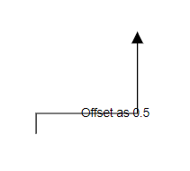
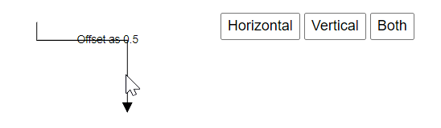

# Interaction in Blazor Diagram Component

Connectors can be selected, dragged, and routed over the diagram page.

## Select

A connector can be selected at runtime by using the [Select](https://help.syncfusion.com/cr/blazor/Syncfusion.Blazor.Diagram.SfDiagramComponent.html#Syncfusion_Blazor_Diagram_SfDiagramComponent_Select_System_Collections_ObjectModel_ObservableCollection_Syncfusion_Blazor_Diagram_IDiagramObject__System_Nullable_System_Boolean__) method and clear the selection in the diagram using the [ClearSelection](https://help.syncfusion.com/cr/blazor/Syncfusion.Blazor.Diagram.SfDiagramComponent.html#Syncfusion_Blazor_Diagram_SfDiagramComponent_ClearSelection). The following code explains how to select and clear selection in the diagram.

```cshtml
@using Syncfusion.Blazor.Diagram
@using System.Collections.ObjectModel

<input type="button" value="Select" @onclick="OnSelect">
<input type="button" value="UnSelect" @onclick="@UnSelect" />
<SfDiagramComponent @ref="Diagram" Width="1000px" Height="500px" Connectors="@connectors">
</SfDiagramComponent>

@code
{
    SfDiagramComponent Diagram;
    DiagramObjectCollection<Connector> connectors = new DiagramObjectCollection<Connector>();

    protected override void OnInitialized()
    {
        Dictionary<string, object> ConnectorInfo = new Dictionary<string, object>();
        ConnectorInfo.Add("connectorInfo", "Central Connector");
        Connector Connector = new Connector()
        {
            ID = "connector1",
            SourcePoint = new DiagramPoint()
            {
                X = 100,
                Y = 100
            },
            TargetPoint = new DiagramPoint()
            {
                X = 200,
                Y = 200
            },
            Type = ConnectorSegmentType.Orthogonal,
            TargetDecorator = new DecoratorSettings()
            {
                Shape = DecoratorShape.Arrow,
                Style = new ShapeStyle()
                {
                    Fill = "#6495ED",
                    StrokeColor = "#6495ED",
                    StrokeWidth = 1
                }
            },
            Style = new ShapeStyle()
            {
                StrokeColor = "#6495ED",
                StrokeWidth = 1
            },
            AdditionalInfo = ConnectorInfo
        };
        connectors.Add(Connector);
    }

    public void OnSelect()
    {
        // Select the Connector.
        Diagram.Select(new ObservableCollection<IDiagramObject> { Diagram.GetObject(Diagram.Connectors[0].ID) as IDiagramObject });
    }

    public void UnSelect()
    {
        // Clear selection in the diagram.
        Diagram.ClearSelection();
    }
}
```

And also the selection can be enabled during the interaction.

* An element can be selected by clicking that element.
* When you select the elements in the diagram, the [SelectionChanging](https://help.syncfusion.com/cr/blazor/Syncfusion.Blazor.Diagram.SfDiagramComponent.html#Syncfusion_Blazor_Diagram_SfDiagramComponent_SelectionChanging) and  [SelectionChanged](https://help.syncfusion.com/cr/blazor/Syncfusion.Blazor.Diagram.SfDiagramComponent.html#Syncfusion_Blazor_Diagram_SfDiagramComponent_SelectionChanged) events get triggered and do customization in this event.


## Drag

A connector can be dragged at runtime by using the [Drag](https://help.syncfusion.com/cr/blazor/Syncfusion.Blazor.Diagram.SfDiagramComponent.html#Syncfusion_Blazor_Diagram_SfDiagramComponent_Drag_Syncfusion_Blazor_Diagram_IDiagramObject_System_Double_System_Double_) method. The following code explains how to drag the connector by using the drag method.

```cshtml
@using Syncfusion.Blazor.Diagram

<input type="button" value="Drag" @onclick="OnDrag">
<SfDiagramComponent @ref="Diagram" Width="1000px" Height="500px" Connectors="@connectors">
</SfDiagramComponent>

@code
{
    SfDiagramComponent Diagram;
    DiagramObjectCollection<Connector> connectors = new DiagramObjectCollection<Connector>();

    protected override void OnInitialized()
    {
        Dictionary<string, object> ConnectorInfo = new Dictionary<string, object>();
        ConnectorInfo.Add("connectorInfo", "Central Connector");
        Connector Connector = new Connector()
        {
            ID = "connector1",
            SourcePoint = new DiagramPoint()
            {
                X = 100,
                Y = 100
            },
            TargetPoint = new DiagramPoint()
            {
                X = 200,
                Y = 200
            },
            Type = ConnectorSegmentType.Orthogonal,
            TargetDecorator = new DecoratorSettings()
            {
                Shape = DecoratorShape.Arrow,
                Style = new ShapeStyle()
                {
                    Fill = "black",
                    StrokeColor = "black",
                    StrokeWidth = 1
                }
            },
            Style = new ShapeStyle()
            {
                StrokeColor = "black",
                StrokeWidth = 1
            },
            AdditionalInfo = ConnectorInfo
        };
        connectors.Add(Connector);
    }

    public void OnDrag()
    {
        // Drag the connector.
        Diagram.Drag(Diagram.Connectors[0], 10, 10);
    }
}
```

And also drag the connector during the interaction.

* An object can be dragged by clicking and dragging it. When multiple elements are selected, dragging any one of the selected elements move all the selected elements.
* When you drag the elements in the diagram, the [PositionChanging](https://help.syncfusion.com/cr/blazor/Syncfusion.Blazor.Diagram.SfDiagramComponent.html#Syncfusion_Blazor_Diagram_SfDiagramComponent_PositionChanging) and [PositionChanged](https://help.syncfusion.com/cr/blazor/Syncfusion.Blazor.Diagram.SfDiagramComponent.html#Syncfusion_Blazor_Diagram_SfDiagramComponent_PositionChanged) events get triggered and do customization in this event.


## End point dragging

The connector can be selected by clicking it. When the connector is selected, circles will be added on the starting and ending of the connector that is represented by Thumbs. Clicking and dragging those handles helps you to adjust the source and target points.

```cshtml
@using Syncfusion.Blazor.Diagram

<SfDiagramComponent @ref="Diagram" Width="1000px" Height="500px" Connectors="@connectors">
</SfDiagramComponent>

@code
{
    SfDiagramComponent Diagram;
    DiagramObjectCollection<Connector> connectors = new DiagramObjectCollection<Connector>();

    protected override void OnInitialized()
    {
        Dictionary<string, object> ConnectorInfo = new Dictionary<string, object>();
        ConnectorInfo.Add("connectorInfo", "Central Connector");
        Connector Connector = new Connector()
        {
            ID = "connector1",
            SourcePoint = new DiagramPoint()
            {
                X = 100,
                Y = 100
            },
            TargetPoint = new DiagramPoint()
            {
                X = 200,
                Y = 200
            },
            Type = ConnectorSegmentType.Orthogonal,
            TargetDecorator = new DecoratorSettings()
            {
                Shape = DecoratorShape.Arrow,
                Style = new ShapeStyle()
                {
                    Fill = "black",
                    StrokeColor = "black",
                    StrokeWidth = 1
                }
            },
            Style = new ShapeStyle()
            {
                StrokeColor = "black",
                StrokeWidth = 1
            },
            AdditionalInfo = ConnectorInfo
        };
        connectors.Add(Connector);
    }
}
```


## How to flip the connector

The [Flip](https://help.syncfusion.com/cr/blazor/Syncfusion.Blazor.Diagram.NodeBase.html#Syncfusion_Blazor_Diagram_NodeBase_Flip) command is used to flip the chosen object is mirrored across in either the horizontal, vertical, or both directions on the diagram page.

### How to change the flip direction:

The [FlipDirection](https://help.syncfusion.com/cr/blazor/Syncfusion.Blazor.Diagram.FlipDirection.html) is used to flip the node or connector so that it is mirrored across in either the horizontal, vertical, or both directions.

| FlipDirection | Description | 
| -------- | -------- |
|Horizontal| It is used to flip the node or connector to be mirrored across the horizontal axis.|
|Vertical| It is used to flip the node or connector to be mirrored across the vertical axis.|
|Both| It is used to flip the node or connector to be mirrored across the horizontal and vertical axes.|
|None| It is used to disable all the flip behavior. |

**Note:** [FlipMode](https://help.syncfusion.com/cr/blazor/Syncfusion.Blazor.Diagram.DiagramFlipMode.html) is applicable only for Nodes not for Connectors.

The following code example shows how to change the FlipDirection.

```cshtml
@using Syncfusion.Blazor.Diagram
@using ChangeEventArgs = Microsoft.AspNetCore.Components.ChangeEventArgs
<style>    
    #diagram {
        width: 70%;
        float: left;
    }
    #properties {
        width: 15%;
        float: right;
        margin-right:300px;
    }
</style>
<div id="properties">
    <input type="button" value="Horizontal" @onclick="@Horizontal" />
    <input type="button" value="Vertical" @onclick="@Vertical" />
    <input type="button" value="Both" @onclick="@Both" /> 
 </div>
<div id="#diagram">
    <SfDiagramComponent @ref="diagram" Width="1000px" Height="1000px"  Nodes="@NodeCollection" Connectors="@connectors">
        <SnapSettings Constraints="@SnapConstraints.None"></SnapSettings>
    </SfDiagramComponent>
    </div>
@code
{
    DiagramObjectCollection<Connector> connectors = new DiagramObjectCollection<Connector>();
    public SfDiagramComponent diagram;
    DiagramObjectCollection<Node> NodeCollection;
    protected override void OnInitialized()
    {     
        Connector Connector = new Connector()
        {
            ID = "connector2",
            Annotations = new DiagramObjectCollection<PathAnnotation>()
            {
                new PathAnnotation 
                { 
                    Content = "Offset as 0.5",
                    Offset = 0.5 
                },
            },         
            SourcePoint = new DiagramPoint() { X = 100, Y = 100 },
            TargetPoint = new DiagramPoint() { X = 200, Y = 200 },            
            Type = ConnectorSegmentType.Straight
        };
        connectors.Add(Connector);     
    }
    public void Horizontal()
    {     
        if (diagram.SelectionSettings.Connectors.Count > 0)
        {
            for(int i = 0; i < diagram.SelectionSettings.Connectors.Count; i++)
            {
                diagram.SelectionSettings.Connectors[i].Flip = FlipDirection.Horizontal;
            }
        }       
    }
    public void Vertical()
    {
        if (diagram.SelectionSettings.Connectors.Count > 0)
        {
            for(int i = 0; i < diagram.SelectionSettings.Connectors.Count; i++)
            {
                diagram.SelectionSettings.Connectors[i].Flip = FlipDirection.Vertical;
            }
        }
    }
    public void Both()
    {     
        if (diagram.SelectionSettings.Connectors.Count > 0)
        {
            for(int i = 0; i < diagram.SelectionSettings.Connectors.Count; i++)
            {
               diagram.SelectionSettings.Connectors[i].Flip = FlipDirection.Both;
            }
        }
    }
}
```
Initial rendering:


| FlipDirection | Output|
| -------- | -------- |
|Horizontal||
|Vertical||
|Both||


## See also

* [How to customize the connector properties](./customization)

* [How to change the segments](./segments)

* [How to get the connector events](./events)
