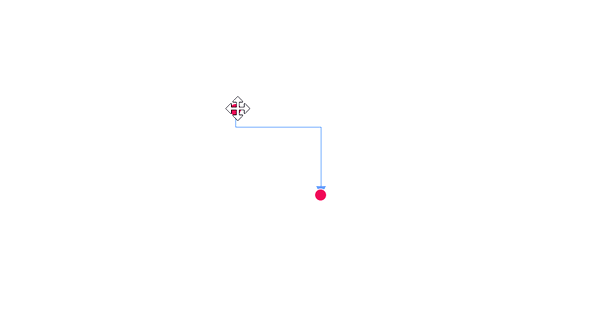

# How to interact with cubic bezier segments efficiently

While interacting with multiple cubic bezier segments, you can maintain their control points in same distance and angle by using [BezierSmoothness] property of `CubicCurveSegment` class.

| BezierSmoothness value| Description  | Output |
|---|---|---|
| SymmetricDistance| Both segments intersecting control points will be in same distance when any one them is editing |  |
| SymmetricAngle |Both segments intersecting control points will be in same angle when any one them is editing|  | 
| Symmetric | Both segments intersecting control points will be in same angle and same distance when any one them is editing| |
| None | Segemnts control points are independent to each other |  |
| None | Segemnts control points are independent to each other |  |
| None | Segemnts control points are independent to each other |  |
