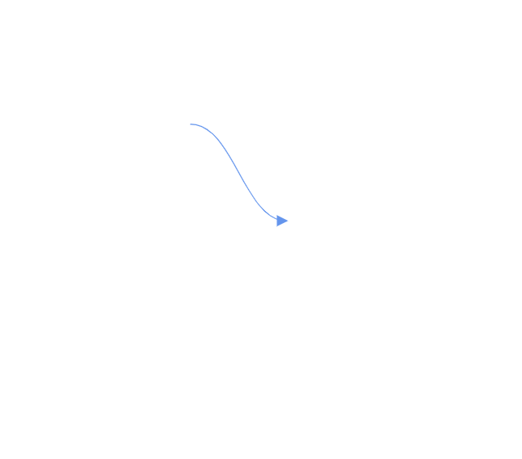
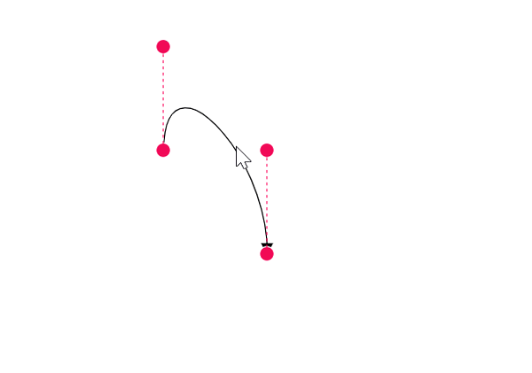
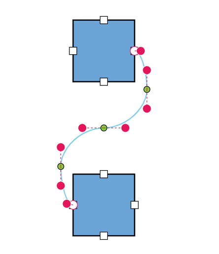
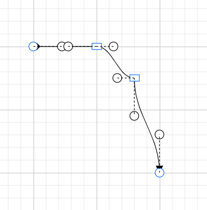
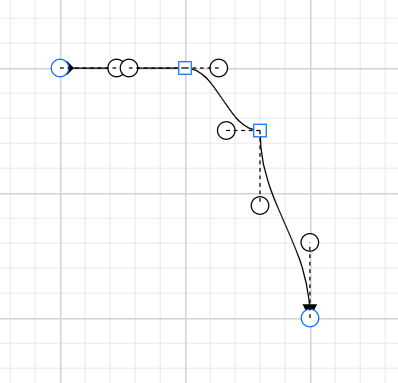

# Bezier Segments in Blazor Diagram Component

## How to Create a Bezier Segment

Bezier segments are used to create curved connectors. The curve can be configured using control points or vectors. To create a Bezier segment, set the connector Type to [Bezier](https://help.syncfusion.com/cr/blazor/Syncfusion.Blazor.Diagram.ConnectorSegmentType.html#Syncfusion_Blazor_Diagram_ConnectorSegmentType_Bezier) and specify the type for the connector. The following code example illustrates how to create a default Bezier segment.

```cshtml
@using Syncfusion.Blazor.Diagram

<SfDiagramComponent Width="1000px" Height="500px" Connectors="@connectors">
</SfDiagramComponent>

@code
{
     //Defines diagram's connector collection.
    DiagramObjectCollection<Connector> connectors = new DiagramObjectCollection<Connector>();

    protected override void OnInitialized()
    {
        Connector Connector = new Connector()
        {
            ID = "connector1",
            SourcePoint = new DiagramPoint()
            {
                X = 100,
                Y = 100
            },
            Style = new ShapeStyle() { StrokeColor = "#6f409f", StrokeWidth = 1 },
            TargetPoint = new DiagramPoint() { X = 200, Y = 200 },
            Type = ConnectorSegmentType.Bezier,
            TargetDecorator = new DecoratorSettings()
            {
                Shape = DecoratorShape.Arrow,
                Style = new ShapeStyle()
                {
                    Fill = "#6f409f",
                    StrokeColor = "#6f409f",
                    StrokeWidth = 1
                }
            }
        };
        //Add the connector into connectors's collection.
        connectors.Add(Connector);
    }
}
```


A complete working sample can be downloaded from [GitHub](https://github.com/SyncfusionExamples/Blazor-Diagram-Examples/tree/master/UG-Samples/Connectors/Segments/Bezier).



 [Point1](https://help.syncfusion.com/cr/blazor/Syncfusion.Blazor.Diagram.BezierSegment.html#Syncfusion_Blazor_Diagram_BezierSegment_Point1) and [Point2](https://help.syncfusion.com/cr/blazor/Syncfusion.Blazor.Diagram.BezierSegment.html#Syncfusion_Blazor_Diagram_BezierSegment_Point2) configure the control points of the Bezier connector.
 The [vector1](https://help.syncfusion.com/cr/blazor/Syncfusion.Blazor.Diagram.BezierSegment.html#Syncfusion_Blazor_Diagram_BezierSegment_Vector1) and [Vector2](https://help.syncfusion.com/cr/blazor/Syncfusion.Blazor.Diagram.BezierSegment.html#Syncfusion_Blazor_Diagram_BezierSegment_Vector2) properties define the length and angle between the source point and target point, respectively. The following code example illustrates how to use these properties.

```cshtml
@using Syncfusion.Blazor.Diagram

<SfDiagramComponent Width="1000px" Height="500px" Connectors="@connectors">
</SfDiagramComponent>

@code
{
     //Defines diagram's connector collection.
    DiagramObjectCollection<Connector> connectors = new DiagramObjectCollection<Connector>();

    protected override void OnInitialized()
    {
       Connector Connector1 = new Connector()
        {
            ID = "Connector1",
            Type = ConnectorSegmentType.Bezier,
            SourcePoint = new DiagramPoint { X = 500, Y = 200 },
            TargetPoint = new DiagramPoint { X = 600, Y = 300 },
            Segments = new DiagramObjectCollection<ConnectorSegment>
            {
                new BezierSegment() 
                {
                    Type = ConnectorSegmentType.Bezier,
                    //Defines the point1 and point2 for the bezier connector.
                    Point1 = new DiagramPoint { X = 500, Y = 100 },
                    Point2 = new DiagramPoint { X = 600, Y = 200 }
                }
            }
        };
        //Add the connector into connectors's collection.
        connectors.Add(Connector1);
         Connector Connector2 = new Connector()
         {
            ID = "Connector2",
            Type = ConnectorSegmentType.Bezier,
            SourcePoint = new DiagramPoint { X = 200, Y = 100 },
            TargetPoint = new DiagramPoint { X = 300, Y = 200 },
            Segments = new DiagramObjectCollection<ConnectorSegment>
            {
                new BezierSegment()
                {
                    Type = ConnectorSegmentType.Bezier,
                    //Defines the Vector1 and Vector2 for the bezier connector.
                    Vector1 = new Vector(){Distance = 100 ,Angle = 90 },
                    Vector2 = new Vector(){Distance = 45 ,Angle = 45 }
                }
            }
        };
        //Add the connector into connectors's collection.
        connectors.Add(Connector2);
    }
}
```


A complete working sample can be downloaded from [GitHub](https://github.com/SyncfusionExamples/Blazor-Diagram-Examples/tree/master/UG-Samples/Connectors/Segments)


### How to Edit Bezier Segments

* A segment control point of the Bezier connector is used to change the bezier vectors and points of the connector.



## How to Avoid Overlapping with Bezier

By default, when there are no segments defined for a bezier connector, the bezier segments will be created automatically and routed in such a way that avoids overlapping with the source and target nodes.

```cshtml
@using Syncfusion.Blazor.Diagram

<SfDiagramComponent Width="1000px" Height="500px" Nodes="@nodes" Connectors="@connectors"></SfDiagramComponent>

@code {
    //Define the diagram's connector collection.
    DiagramObjectCollection<Connector> connectors = new DiagramObjectCollection<Connector>();
    //Define the diagram's node collection.
    DiagramObjectCollection<Node> nodes = new DiagramObjectCollection<Node>();

    protected override void OnInitialized()
    {
        nodes.Add(
            new Node()
                {
                    ID = "node1",
                    OffsetX = 300,
                    OffsetY = 100,
                    Width = 100,
                    Height = 100,
                    Ports = new DiagramObjectCollection<PointPort>()
                    {
                    new PointPort()
                    {
                        ID="Port1",
                        Visibility = PortVisibility.Visible,
                        Offset = new DiagramPoint() { X = 1, Y = 0.5 },
                    },
                    }
                });
        nodes.Add(new Node()
            {
                ID = "node2",
                OffsetX = 300,
                OffsetY = 350,
                Width = 100,
                Height = 100,
                Ports = new DiagramObjectCollection<PointPort>()
                {
                    new PointPort()
                    {
                        ID="Port1",
                        Visibility = PortVisibility.Visible,
                        Offset = new DiagramPoint() { X = 0, Y = 0.5 },
                    },
                }
            });
        Connector connector1 = new Connector()
            {
                ID = "connector1",
                SourceID = "node1",
                TargetID = "node2",
                SourcePortID = "Port1",
                TargetPortID = "Port1",
                Type = ConnectorSegmentType.Bezier,
                Constraints = ConnectorConstraints.Default | ConnectorConstraints.DragSegmentThumb
            };
        connectors.Add(connector1);
    }
}
```


A complete working sample can be downloaded from [GitHub](https://github.com/SyncfusionExamples/Blazor-Diagram-Examples/tree/master/UG-Samples/Connectors/Segments).

Also, if you provide segments during the initial rendering, the segment collection will be updated dynamically when you move the connector ends. If you do not want the segments to be updated dynamically when you move the connector end, you need to set [BezierConnectorSettings.AllowSegmentsReset](https://help.syncfusion.com/cr/blazor/Syncfusion.Blazor.Diagram.BezierConnectorSettings.html#Syncfusion_Blazor_Diagram_BezierConnectorSettings_AllowSegmentsReset) as **False**.


```cshtml
@using Syncfusion.Blazor.Diagram

<SfDiagramComponent Width="1000px" Height="500px" Nodes="@nodes" Connectors="@connectors"></SfDiagramComponent>

@code {
    //Define the diagram's connector collection.
    DiagramObjectCollection<Connector> connectors = new DiagramObjectCollection<Connector>();
    //Define the diagram's node collection.
    DiagramObjectCollection<Node> nodes = new DiagramObjectCollection<Node>();

    protected override void OnInitialized()
    {
        nodes.Add(
            new Node()
                {
                    ID = "node1",
                    OffsetX = 300,
                    OffsetY = 100,
                    Width = 100,
                    Height = 100,
                    Ports = new DiagramObjectCollection<PointPort>()
                    {
                    new PointPort()
                    {
                        ID="Port1",
                        Visibility = PortVisibility.Visible,
                        Offset = new DiagramPoint() { X = 1, Y = 0.5 },
                    },
                    }
                });
        nodes.Add(new Node()
            {
                ID = "node2",
                OffsetX = 300,
                OffsetY = 350,
                Width = 100,
                Height = 100,
                Ports = new DiagramObjectCollection<PointPort>()
                {
                    new PointPort()
                    {
                        ID="Port1",
                        Visibility = PortVisibility.Visible,
                        Offset = new DiagramPoint() { X = 0, Y = 0.5 },
                    },
                }
            });
        Connector connector1 = new Connector()
            {
                ID = "connector1",
                SourceID = "node1",
                TargetID = "node2",
                SourcePortID = "Port1",
                TargetPortID = "Port1",
                Type = ConnectorSegmentType.Bezier,
                Segments = new DiagramObjectCollection<ConnectorSegment>(){new BezierSegment(){Type = ConnectorSegmentType.Bezier}},
                //Define whether to reset the current segments collection in response to change in the connector ends.
                BezierConnectorSettings = new BezierConnectorSettings() { AllowSegmentsReset = false },
                Constraints = ConnectorConstraints.Default | ConnectorConstraints.DragSegmentThumb
            };
        connectors.Add(connector1);
    }
}
```


A complete working sample can be downloaded from [GitHub](https://github.com/SyncfusionExamples/Blazor-Diagram-Examples/tree/master/UG-Samples/Connectors/Segments).



## How to Customize Bezier Segment Thumb Shape 

The Bezier connector can have multiple segments between the source and target points. By default, these segments are rendered as **circles**, but this can be customized either globally or for individual connectors using the [SegmentThumbSettings](https://help.syncfusion.com/cr/blazor/Syncfusion.Blazor.Diagram.SegmentThumbSettings.html) class.

To change the segment thumb shape for all Bezier connectors, configure the `SegmentThumbSettings` property of the `SfDiagramComponent` class and set the [Shape](https://help.syncfusion.com/cr/blazor/Syncfusion.Blazor.Diagram.SegmentThumbSettings.html#Syncfusion_Blazor_Diagram_SegmentThumbSettings_Shape) property to the desired shape.

To customize the segment thumb shape for a specific connector, first disable the [InheritSegmentThumbShape](https://help.syncfusion.com/cr/blazor/Syncfusion.Blazor.Diagram.ConnectorConstraints.html#Syncfusion_Blazor_Diagram_ConnectorConstraints_InheritSegmentThumbShape) constraint. Then, configure the `SegmentThumbSettings` property of the Connector class, specifying the desired shape using the `Shape` property of the `SegmentThumbSettings` class. 

The following predefined shapes are provided:

| Shape name | Shape |
|-------- | -------- |
|[Rhombus](https://help.syncfusion.com/cr/blazor/Syncfusion.Blazor.Diagram.SegmentThumbShapes.html#Syncfusion_Blazor_Diagram_SegmentThumbShapes_Arrow)|  |
| [Square](https://help.syncfusion.com/cr/blazor/Syncfusion.Blazor.Diagram.SegmentThumbShapes.html#Syncfusion_Blazor_Diagram_SegmentThumbShapes_Arrow) |  |
| [Rectangle](https://help.syncfusion.com/cr/blazor/Syncfusion.Blazor.Diagram.SegmentThumbShapes.html#Syncfusion_Blazor_Diagram_SegmentThumbShapes_Arrow) |  |
| [Ellipse](https://help.syncfusion.com/cr/blazor/Syncfusion.Blazor.Diagram.SegmentThumbShapes.html#Syncfusion_Blazor_Diagram_SegmentThumbShapes_Arrow) | |
| [Circle](https://help.syncfusion.com/cr/blazor/Syncfusion.Blazor.Diagram.SegmentThumbShapes.html#Syncfusion_Blazor_Diagram_SegmentThumbShapes_Circle) | |
|[Arrow](https://help.syncfusion.com/cr/blazor/Syncfusion.Blazor.Diagram.SegmentThumbShapes.html#Syncfusion_Blazor_Diagram_SegmentThumbShapes_Arrow)|  |
| [OpenArrow](https://help.syncfusion.com/cr/blazor/Syncfusion.Blazor.Diagram.SegmentThumbShapes.html#Syncfusion_Blazor_Diagram_SegmentThumbShapes_OpenArrow) |  |
| [Fletch](https://help.syncfusion.com/cr/blazor/Syncfusion.Blazor.Diagram.SegmentThumbShapes.html#Syncfusion_Blazor_Diagram_SegmentThumbShapes_Fletch)| |
|[OpenFetch](https://help.syncfusion.com/cr/blazor/Syncfusion.Blazor.Diagram.SegmentThumbShapes.html#Syncfusion_Blazor_Diagram_SegmentThumbShapes_OpenFetch)|  |
| [IndentedArrow](https://help.syncfusion.com/cr/blazor/Syncfusion.Blazor.Diagram.SegmentThumbShapes.html#Syncfusion_Blazor_Diagram_SegmentThumbShapes_IndentedArrow) |  |
| [OutdentedArrow](https://help.syncfusion.com/cr/blazor/Syncfusion.Blazor.Diagram.SegmentThumbShapes.html#Syncfusion_Blazor_Diagram_SegmentThumbShapes_OutdentedArrow) |  |
| [DoubleArrow](https://help.syncfusion.com/cr/blazor/Syncfusion.Blazor.Diagram.SegmentThumbShapes.html#Syncfusion_Blazor_Diagram_SegmentThumbShapes_DoubleArrow) | |

The following code example illustrates how to create a customized bezier segment thumb shape using the `InheritSegmentThumbShape` constraints.

```cshtml
@using Syncfusion.Blazor.Diagram
@using Syncfusion.Blazor.Diagram.Internal
<SfDiagramComponent Width="1000px" Height="500px"  Connectors="@connectors" ConnectorSegmentThumb="@connectorSegmentThumb"></SfDiagramComponent>
@code {
    //Define the diagram's connector collection.
    DiagramObjectCollection<Connector> connectors = new DiagramObjectCollection<Connector>();
    //Define the segment shape 
    SegmentThumbSettings connectorSegmentThumb = new SegmentThumbSettings() { Shape = SegmentThumbShapes.Rectangle };
    protected override void OnInitialized()
    {
        Connector connector = new Connector()
            {
                ID = "connector",
                SourcePoint = new DiagramPoint() { X = 100, Y = 100 },
                TargetPoint = new DiagramPoint() { X = 300, Y =300 },
                SourceDecorator = new DecoratorSettings() { Shape = DecoratorShape.Diamond },
                Segments = new DiagramObjectCollection<ConnectorSegment>()
                {
                new BezierSegment(){Type = ConnectorSegmentType.Bezier, Point = new DiagramPoint(){X = 200, Y = 100}
                ,
                },
                new BezierSegment(){Type = ConnectorSegmentType.Bezier, Point = new DiagramPoint(){X = 260, Y = 150}}
                },
                Type = ConnectorSegmentType.Bezier,
                BezierConnectorSettings = new BezierConnectorSettings()
                {
                    ControlPointsVisibility = ControlPointsVisibility.All
                },
                Constraints = ConnectorConstraints.Default | ConnectorConstraints.DragSegmentThumb | ConnectorConstraints.InheritSegmentThumbShape,
                
            };
        connectors.Add(connector);
    }
}
```


A complete working sample can be downloaded from [GitHub](https://github.com/SyncfusionExamples/Blazor-Diagram-Examples/tree/master/UG-Samples/Connectors/Segments/Bezier/BezierSegmentShape).



The following code example illustrates how to create a customized bezier segment thumb shape without  using the `InheritSegmentThumbShape` constraints.

```cshtml
@using Syncfusion.Blazor.Diagram
@using Syncfusion.Blazor.Diagram.Internal
<SfDiagramComponent Width="1000px" Height="500px"  Connectors="@connectors" ></SfDiagramComponent>
@code {
    //Define the diagram's connector collection.
    DiagramObjectCollection<Connector> connectors = new DiagramObjectCollection<Connector>();
    protected override void OnInitialized()
    {
        Connector connector = new Connector()
            {
                ID = "connector",
                SourcePoint = new DiagramPoint() { X = 100, Y = 100 },
                TargetPoint = new DiagramPoint() { X = 300, Y =300 },
                SourceDecorator = new DecoratorSettings() { Shape = DecoratorShape.Diamond },
                Segments = new DiagramObjectCollection<ConnectorSegment>()
                {
                new BezierSegment(){Type = ConnectorSegmentType.Bezier, Point = new DiagramPoint(){X = 200, Y = 100}
                ,
                },
                new BezierSegment(){Type = ConnectorSegmentType.Bezier, Point = new DiagramPoint(){X = 260, Y = 150}}
                },
                Type = ConnectorSegmentType.Bezier,
                BezierConnectorSettings = new BezierConnectorSettings()
                {
                    ControlPointsVisibility = ControlPointsVisibility.All
                },
                Constraints = ConnectorConstraints.Default | ConnectorConstraints.DragSegmentThumb,
                SegmentThumbSettings = new SegmentThumbSettings() { Shape = SegmentThumbShapes.Square},
            };
        connectors.Add(connector);
    }
}
```


A complete working sample can be downloaded from [GitHub](https://github.com/SyncfusionExamples/Blazor-Diagram-Examples/tree/master/UG-Samples/Connectors/Segments/Bezier/SegmentShape).



>Note:  This feature ensures that the shape is updated regardless of whether the  [InheritSegmentThumbShape](https://help.syncfusion.com/cr/blazor/Syncfusion.Blazor.Diagram.ConnectorConstraints.html#Syncfusion_Blazor_Diagram_ConnectorConstraints_InheritSegmentThumbShape) enum value is added to the [Constraints](https://help.syncfusion.com/cr/blazor/Syncfusion.Blazor.Diagram.Connector.html#Syncfusion_Blazor_Diagram_Connector_Constraints) property of the diagram. If you apply the `InheritSegmentThumbShape` constraints, the shape will be updated at the diagram level. Without these constraints, the shape will be updated at the connector level. 
 To make the shapes visible, ensure that the [DragSegmentThumb](https://help.syncfusion.com/cr/blazor/Syncfusion.Blazor.Diagram.ConnectorConstraints.html#Syncfusion_Blazor_Diagram_ConnectorConstraints_DragSegmentThumb) enum is added to the connector's constraints.