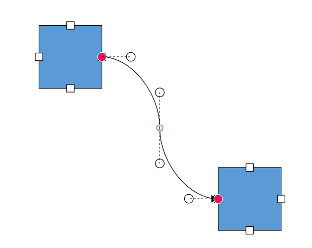

# Bezier Segments Interaction in Blazor Diagram

## How to Interact with the Bezier Segments Efficiently

When interacting with multiple Bezier segments, maintain their control points at the same distance and angle by using the [BezierConnectorSettings.Smoothness](https://help.syncfusion.com/cr/blazor/Syncfusion.Blazor.Diagram.BezierConnectorSettings.html#Syncfusion_Blazor_Diagram_BezierConnectorSettings_Smoothness) property.

| BezierSmoothness value | Description | Output |
|-------- | -------- | -------- |
| [SymmetricDistance](https://help.syncfusion.com/cr/blazor/Syncfusion.Blazor.Diagram.BezierSmoothness.html#Syncfusion_Blazor_Diagram_BezierSmoothness_SymmetricDistance)| keeps both control points of adjacent segments will be at the same distance when one of them is editing. |  |
| [SymmetricAngle](https://help.syncfusion.com/cr/blazor/Syncfusion.Blazor.Diagram.BezierSmoothness.html#Syncfusion_Blazor_Diagram_BezierSmoothness_Both) | keeps both control points of adjacent segments will be at the same angle when one of them is editing. |  |
| [SymmetricAngle](https://help.syncfusion.com/cr/blazor/Syncfusion.Blazor.Diagram.BezierSmoothness.html#Syncfusion_Blazor_Diagram_BezierSmoothness_) | Both control points of adjacent segments will be at the same angle when one of them is editing. |  |
| [Both](https://help.syncfusion.com/cr/blazor/Syncfusion.Blazor.Diagram.BezierSmoothness.html#Syncfusion_Blazor_Diagram_BezierSmoothness_Both) | keeps both control points of adjacent segments will be at the same angle and same distance when one of them is editing. |  |
| [None](https://help.syncfusion.com/cr/blazor/Syncfusion.Blazor.Diagram.BezierSmoothness.html#Syncfusion_Blazor_Diagram_BezierSmoothness_None) | Segment’s control points interact independently from each other. | 


## How to Show or Hide Bezier Segment's Control Points

The visibility of the Bezier segment's control points can be enabled or disabled by setting the value of the [BezierConnectorSettings.ControlPointsVisibility](https://help.syncfusion.com/cr/blazor/Syncfusion.Blazor.Diagram.BezierConnectorSettings.html#Syncfusion_Blazor_Diagram_BezierConnectorSettings_ControlPointsVisibility) property.

| ControlPointsVisibility value | Description | Output |
|-------- | -------- | -------- |
| [None](https://help.syncfusion.com/cr/blazor/Syncfusion.Blazor.Diagram.ControlPointsVisibility.html#Syncfusion_Blazor_Diagram_ControlPointsVisibility_None) | Hides all control points of the Bezier connector. |  |
| [Source](https://help.syncfusion.com/cr/blazor/Syncfusion.Blazor.Diagram.ControlPointsVisibility.html#Syncfusion_Blazor_Diagram_ControlPointsVisibility_Source) | Shows control points of the source segment and hides all other control points in a Bezier connector. |  |
| [Target](https://help.syncfusion.com/cr/blazor/Syncfusion.Blazor.Diagram.ControlPointsVisibility.html#Syncfusion_Blazor_Diagram_ControlPointsVisibility_Target) | Shows control points of the target segment and hides all other control points in a Bezier connector. |  |
| [Intermediate ](https://help.syncfusion.com/cr/blazor/Syncfusion.Blazor.Diagram.ControlPointsVisibility.html#Syncfusion_Blazor_Diagram_ControlPointsVisibility_Intermediate)| Shows control points of the intermediate segments and hides all other control points in a Bezier connector. |  |
| [All](https://help.syncfusion.com/cr/blazor/Syncfusion.Blazor.Diagram.ControlPointsVisibility.html#Syncfusion_Blazor_Diagram_ControlPointsVisibility_All) | Shows all control points of the Bezier connector, including the source, target, and intermediate segments. |  |

```cshtml
@using Syncfusion.Blazor.Diagram
<SfDiagramComponent Width="1000px" Height="500px" Connectors="@_connectors"></SfDiagramComponent>
@code {
    //Define the diagram's connector collection.
    private DiagramObjectCollection<Connector> _connectors = new DiagramObjectCollection<Connector>();
    protected override void OnInitialized()
    {
        Connector connector1 = new Connector()
        {
            ID = "connector1",
            SourcePoint = new DiagramPoint() { X = 700, Y = 200 },
            TargetPoint = new DiagramPoint() { X = 1000, Y = 400 },
            Segments = new DiagramObjectCollection<ConnectorSegment>()
            {
                new BezierSegment(){Type = ConnectorSegmentType.Bezier, Point = new DiagramPoint(){X = 750, Y = 250}},
                new BezierSegment(){Type = ConnectorSegmentType.Bezier, Point = new DiagramPoint(){X = 900, Y = 350}}
            },
            Type = ConnectorSegmentType.Bezier,
            BezierConnectorSettings = new BezierConnectorSettings() 
            {
                //Define the visibility of the control points. 
                ControlPointsVisibility = ControlPointsVisibility.Intermediate 
            },
        };
        _connectors.Add(connector1);
    }
}
```


A complete working sample can be downloaded from [GitHub](https://github.com/SyncfusionExamples/Blazor-Diagram-Examples/tree/master/UG-Samples/Connectors/Segments/ControlPointsVisibilitySample.razor).
