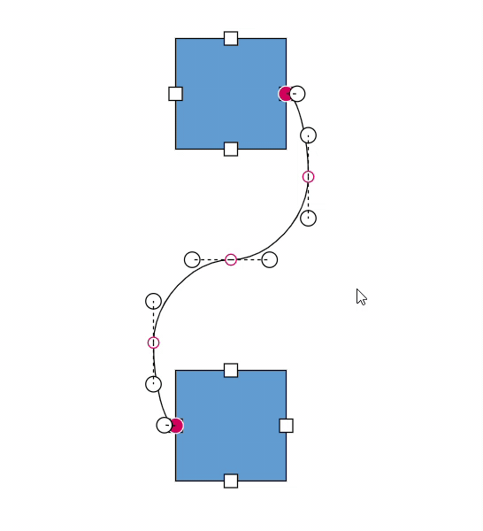

# Bezier Segments interaction in Blazor Diagram Component

## How to interact with the bezier segments efficiently

While interacting with multiple bezier segments, maintain their control points at the same distance and angle by using the [BezierConnectorSettings.Smoothness](https://help.syncfusion.com/cr/blazor/Syncfusion.Blazor.Diagram.BezierConnectorSettings.html#Syncfusion_Blazor_Diagram_BezierConnectorSettings_Smoothness) property of the Connector class.

| BezierSmoothness value | Description | Output |
|-------- | -------- | -------- |
| SymmetricDistance| Both control points of adjacent segments will be at the same distance when one of them is editing. |  |
| SymmetricAngle | Both control points of adjacent segments will be at the same angle when one of them is editing. |  |
| Both | Both control points of adjacent segments will be at the same angle and same distance when one of them is editing. |  |
| None | Segment’s control points interact independently from each other. | 


## How to show or hide the bezier segment's control points

By using the [BezierConnectorSettings.ControlPointsVisibility](https://help.syncfusion.com/cr/blazor/Syncfusion.Blazor.Diagram.BezierConnectorSettings.html#Syncfusion_Blazor_Diagram_BezierConnectorSettings_ControlPointsVisibility) property of the Connector class, you can enable or disable the visibility of the bezier segment's control points.

| ControlPointsVisibility value | Description | Output |
|-------- | -------- | -------- |
| None | It allows you to hide all control points of the bezier connector. |  |
| Source | It allows you to show control points of the source segment and hides all other control points in a bezier connector. |  |
| Target | It allows you to show control points of the target segment and hides all other control points in a bezier connector. |  |
| Intermediate | It allows you to show control points of the intermediate segments and hides all other control points in a bezier connector. |  |
| All | It allows you to show all the control points of the bezier connector, including the source, target, and intermediate segments' control points.|  |

```cshtml
@using Syncfusion.Blazor.Diagram
<SfDiagramComponent Width="1000px" Height="500px" Connectors="@connectors"></SfDiagramComponent>
@code {
    //Define the diagram's connector collection.
    DiagramObjectCollection<Connector> connectors = new DiagramObjectCollection<Connector>();
    protected override void OnInitialized()
    {
        Connector connector1 = new Connector()
        {
            ID = "connector1",
            SourcePoint = new DiagramPoint() { X = 700, Y = 200 },
            TargetPoint = new DiagramPoint() { X = 1000, Y = 400 },
            Segments = new DiagramObjectCollection<ConnectorSegment>()
            {
                new BezierSegment(){Type = ConnectorSegmentType.Bezier, Point = new DiagramPoint(){X = 750, Y = 250}},
                new BezierSegment(){Type = ConnectorSegmentType.Bezier, Point = new DiagramPoint(){X = 900, Y = 350}}
            },
            Type = ConnectorSegmentType.Bezier,
            BezierConnectorSettings = new BezierConnectorSettings() 
            {
                //Define the visibility of the control points. 
                ControlPointsVisibility = ControlPointsVisibility.Intermediate 
            },
        };
        connectors.Add(connector1);
    }
}
```
You can download a complete working sample from [GitHub](https://github.com/SyncfusionExamples/Blazor-Diagram-Examples/tree/master/UG-Samples/Connectors/Segments).
