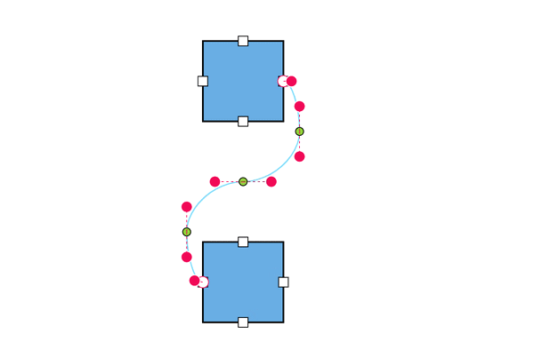

# Bezier Segments in Blazor Diagram Component

## How to Edit Bezier Segments Using Bezier Connector Settings

The intermediate points between adjacent Bezier segments can be edited interactively by using the [BezierConnectorSettings.SegmentEditOrientation](https://help.syncfusion.com/cr/blazor/Syncfusion.Blazor.Diagram.BezierConnectorSettings.html#Syncfusion_Blazor_Diagram_BezierConnectorSettings_SegmentEditOrientation) property of the Connector class.

| SegmentEditOrientation value | Description | Output |
|-------- | -------- | -------- |
| [Bidirectional](https://help.syncfusion.com/cr/blazor/Syncfusion.Blazor.Diagram.BezierSegmentEditOrientation.html#Syncfusion_Blazor_Diagram_BezierSegmentEditOrientation_Bidirectional) | Allows intermediate points to be dragged in either the vertical or horizontal direction. |  |
| [Freeform](https://help.syncfusion.com/cr/blazor/Syncfusion.Blazor.Diagram.BezierSegmentEditOrientation.html#Syncfusion_Blazor_Diagram_BezierSegmentEditOrientation_FreeForm) | Allows intermediate points to be dragged freely in any direction. |  |

The following code illustrates how to interact with Bezier efficiently by using the [BezierConnectorSettings.Smoothness](https://help.syncfusion.com/cr/blazor/Syncfusion.Blazor.Diagram.BezierConnectorSettings.html#Syncfusion_Blazor_Diagram_BezierConnectorSettings_Smoothness) and [BezierConnectorSettings.SegmentEditOrientation](https://help.syncfusion.com/cr/blazor/Syncfusion.Blazor.Diagram.BezierConnectorSettings.html#Syncfusion_Blazor_Diagram_BezierConnectorSettings_SegmentEditOrientation) properties.

```cshtml
@using Syncfusion.Blazor.Diagram

<SfDiagramComponent Width="1000px" Height="500px" Nodes="@_nodes" Connectors="@_connectors"></SfDiagramComponent>

@code {
    //Define the diagram's connector collection.
    private DiagramObjectCollection<Connector> _connectors = new DiagramObjectCollection<Connector>();
    //Define the diagram's node collection.
    private DiagramObjectCollection<Node> _nodes = new DiagramObjectCollection<Node>();

    protected override void OnInitialized()
    {
        _nodes.Add(
            new Node()
                {
                    ID = "node1",
                    OffsetX = 300,
                    OffsetY = 100,
                    Width = 100,
                    Height = 100,
                    Ports = new DiagramObjectCollection<PointPort>()
                    {
                    new PointPort()
                    {
                        ID="Port1",
                        Visibility = PortVisibility.Visible,
                        Offset = new DiagramPoint() { X = 1, Y = 0.5 },
                    },
                    }
                });
        _nodes.Add(new Node()
            {
                ID = "node2",
                OffsetX = 300,
                OffsetY = 350,
                Width = 100,
                Height = 100,
                Ports = new DiagramObjectCollection<PointPort>()
                {
                    new PointPort()
                    {
                        ID="Port1",
                        Visibility = PortVisibility.Visible,
                        Offset = new DiagramPoint() { X = 0, Y = 0.5 },
                    },
                }
            });
        Connector connector1 = new Connector()
            {
                ID = "connector1",
                SourceID = "node1",
                TargetID = "node2",
                SourcePortID = "Port1",
                TargetPortID = "Port1",
                Type = ConnectorSegmentType.Bezier,
                BezierConnectorSettings = new BezierConnectorSettings() 
                { 
                    //Define the smoothness for a bezier connector.
                    Smoothness = BezierSmoothness.SymmetricAngle,
                    //Define the orientation of the segment editing controls.
                    SegmentEditOrientation = BezierSegmentEditOrientation.FreeForm
                },
                Constraints = ConnectorConstraints.Default | ConnectorConstraints.DragSegmentThumb
            };
        _connectors.Add(connector1);
    }
}
```


A complete working sample can be downloaded from [GitHub](https://github.com/SyncfusionExamples/Blazor-Diagram-Examples/tree/master/UG-Samples/Connectors/Segments/BezierSegmentEditOrientation.razor).
