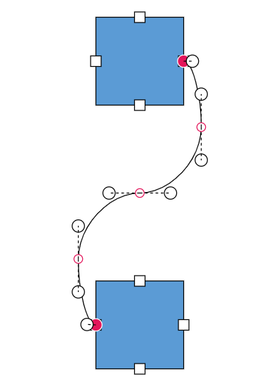
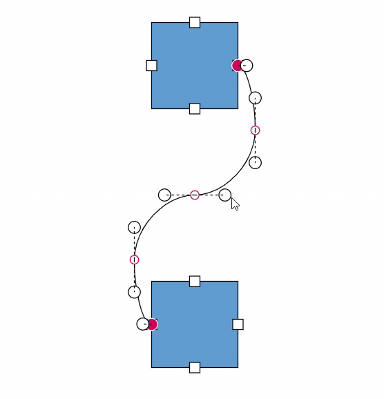
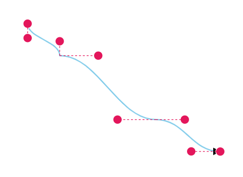

# Segments interaction in Blazor Diagram Component

## Avoid overlapping with bezier

By default, when there are no segments defined for a bezier connector, the bezier segments will be created automatically and routed in such a way that avoids overlapping with the source and target nodes.

```cshtml
@using Syncfusion.Blazor.Diagram

<SfDiagramComponent Width="1000px" Height="500px" Nodes="@nodes" Connectors="@connectors"></SfDiagramComponent>

@code {
    //Define the diagram's connector collection.
    DiagramObjectCollection<Connector> connectors = new DiagramObjectCollection<Connector>();
    //Define the diagram's node collection.
    DiagramObjectCollection<Node> nodes = new DiagramObjectCollection<Node>();

    protected override void OnInitialized()
    {
        nodes.Add(
            new Node()
                {
                    ID = "node1",
                    OffsetX = 300,
                    OffsetY = 100,
                    Width = 100,
                    Height = 100,
                    Ports = new DiagramObjectCollection<PointPort>()
                    {
                    new PointPort()
                    {
                        ID="Port1",
                        Visibility = PortVisibility.Visible,
                        Offset = new DiagramPoint() { X = 1, Y = 0.5 },
                    },
                    }
                });
        nodes.Add(new Node()
            {
                ID = "node2",
                OffsetX = 300,
                OffsetY = 350,
                Width = 100,
                Height = 100,
                Ports = new DiagramObjectCollection<PointPort>()
                {
                    new PointPort()
                    {
                        ID="Port1",
                        Visibility = PortVisibility.Visible,
                        Offset = new DiagramPoint() { X = 0, Y = 0.5 },
                    },
                }
            });
        Connector connector1 = new Connector()
            {
                ID = "connector1",
                SourceID = "node1",
                TargetID = "node2",
                SourcePortID = "Port1",
                TargetPortID = "Port1",
                Type = ConnectorSegmentType.Bezier,
                Constraints = ConnectorConstraints.Default | ConnectorConstraints.DragSegmentThumb
            };
        connectors.Add(connector1);
    }
}
```
You can download a complete working sample from [GitHub](https://github.com/SyncfusionExamples/Blazor-Diagram-Examples/tree/master/UG-Samples/Connectors/Segments).

Also, if you provide segments on initial rendering, the segments collection will be updated dynamically when you move the connector ends. For static segments collection, the [BezierConnectorSettings.AllowSegmentsReset](https://help.syncfusion.com/cr/blazor/Syncfusion.Blazor.Diagram.BezierConnectorSettings.html#Syncfusion_Blazor_Diagram_BezierConnectorSettings_AllowSegmentsReset) property of the Connector class should be set to false.

```cshtml
@using Syncfusion.Blazor.Diagram

<SfDiagramComponent Width="1000px" Height="500px" Nodes="@nodes" Connectors="@connectors"></SfDiagramComponent>

@code {
    //Define the diagram's connector collection.
    DiagramObjectCollection<Connector> connectors = new DiagramObjectCollection<Connector>();
    //Define the diagram's node collection.
    DiagramObjectCollection<Node> nodes = new DiagramObjectCollection<Node>();

    protected override void OnInitialized()
    {
        nodes.Add(
            new Node()
                {
                    ID = "node1",
                    OffsetX = 300,
                    OffsetY = 100,
                    Width = 100,
                    Height = 100,
                    Ports = new DiagramObjectCollection<PointPort>()
                    {
                    new PointPort()
                    {
                        ID="Port1",
                        Visibility = PortVisibility.Visible,
                        Offset = new DiagramPoint() { X = 1, Y = 0.5 },
                    },
                    }
                });
        nodes.Add(new Node()
            {
                ID = "node2",
                OffsetX = 300,
                OffsetY = 350,
                Width = 100,
                Height = 100,
                Ports = new DiagramObjectCollection<PointPort>()
                {
                    new PointPort()
                    {
                        ID="Port1",
                        Visibility = PortVisibility.Visible,
                        Offset = new DiagramPoint() { X = 0, Y = 0.5 },
                    },
                }
            });
        Connector connector1 = new Connector()
            {
                ID = "connector1",
                SourceID = "node1",
                TargetID = "node2",
                SourcePortID = "Port1",
                TargetPortID = "Port1",
                Type = ConnectorSegmentType.Bezier,
                Segments = new DiagramObjectCollection<ConnectorSegment>(){new BezierSegment(){Type = ConnectorSegmentType.Bezier}},
                //Define whether to reset the current segments collection in response to change in the connector ends.
                BezierConnectorSettings = new BezierConnectorSettings() { AllowSegmentsReset = false },
                Constraints = ConnectorConstraints.Default | ConnectorConstraints.DragSegmentThumb
            };
        connectors.Add(connector1);
    }
}
```
You can download a complete working sample from [GitHub](https://github.com/SyncfusionExamples/Blazor-Diagram-Examples/tree/master/UG-Samples/Connectors/Segments).




## How to interact with the bezier segments efficiently

While interacting with multiple bezier segments, maintain their control points at the same distance and angle by using the [BezierConnectorSettings.Smoothness](https://help.syncfusion.com/cr/blazor/Syncfusion.Blazor.Diagram.BezierConnectorSettings.html#Syncfusion_Blazor_Diagram_BezierConnectorSettings_Smoothness) property of the Connector class.

| BezierSmoothness value | Description | Output |
|-------- | -------- | -------- |
| SymmetricDistance| Both control points of adjacent segments will be at the same distance when one of them is editing. |  |
| SymmetricAngle | Both control points of adjacent segments will be at the same angle when one of them is editing. |  |
| Both | Both control points of adjacent segments will be at the same angle and same distance when one of them is editing. |  |
| None | Segment’s control points interact independently from each other. | 

Also, the intermediate point of two adjacent bezier segments can be edited interactively based on the [BezierConnectorSettings.SegmentEditOrientation](https://help.syncfusion.com/cr/blazor/Syncfusion.Blazor.Diagram.BezierConnectorSettings.html#Syncfusion_Blazor_Diagram_BezierConnectorSettings_SegmentEditOrientation) property of the Connector class.

| SegmentEditOrientation value | Description | Output |
|-------- | -------- | -------- |
| Bidirectional | It allows the intermediate points to be dragged in either vertical or horizontal directions.  |  |
| Freeform | It allows the intermediate points to be dragged in any direction. |  |

The following code illustrates how to interact with bezier efficiently by using [BezierConnectorSettings.Smoothness](https://help.syncfusion.com/cr/blazor/Syncfusion.Blazor.Diagram.BezierConnectorSettings.html#Syncfusion_Blazor_Diagram_BezierConnectorSettings_Smoothness) and [BezierConnectorSettings.SegmentEditOrientation](https://help.syncfusion.com/cr/blazor/Syncfusion.Blazor.Diagram.BezierConnectorSettings.html#Syncfusion_Blazor_Diagram_BezierConnectorSettings_SegmentEditOrientation) property of the Connector class.

```cshtml
@using Syncfusion.Blazor.Diagram

<SfDiagramComponent Width="1000px" Height="500px" Nodes="@nodes" Connectors="@connectors"></SfDiagramComponent>

@code {
    //Define the diagram's connector collection.
    DiagramObjectCollection<Connector> connectors = new DiagramObjectCollection<Connector>();
    //Define the diagram's node collection.
    DiagramObjectCollection<Node> nodes = new DiagramObjectCollection<Node>();

    protected override void OnInitialized()
    {
        nodes.Add(
            new Node()
                {
                    ID = "node1",
                    OffsetX = 300,
                    OffsetY = 100,
                    Width = 100,
                    Height = 100,
                    Ports = new DiagramObjectCollection<PointPort>()
                    {
                    new PointPort()
                    {
                        ID="Port1",
                        Visibility = PortVisibility.Visible,
                        Offset = new DiagramPoint() { X = 1, Y = 0.5 },
                    },
                    }
                });
        nodes.Add(new Node()
            {
                ID = "node2",
                OffsetX = 300,
                OffsetY = 350,
                Width = 100,
                Height = 100,
                Ports = new DiagramObjectCollection<PointPort>()
                {
                    new PointPort()
                    {
                        ID="Port1",
                        Visibility = PortVisibility.Visible,
                        Offset = new DiagramPoint() { X = 0, Y = 0.5 },
                    },
                }
            });
        Connector connector1 = new Connector()
            {
                ID = "connector1",
                SourceID = "node1",
                TargetID = "node2",
                SourcePortID = "Port1",
                TargetPortID = "Port1",
                Type = ConnectorSegmentType.Bezier,
                BezierConnectorSettings = new BezierConnectorSettings() 
                { 
                    //Define the smoothness for a bezier connector.
                    Smoothness = BezierSmoothness.SymmetricAngle,
                    //Define the orientation of the segment editing controls.
                    SegmentEditOrientation = BezierSegmentEditOrientation.Freeform
                },
                Constraints = ConnectorConstraints.Default | ConnectorConstraints.DragSegmentThumb
            };
        connectors.Add(connector1);
    }
}
```
You can download a complete working sample from [GitHub](https://github.com/SyncfusionExamples/Blazor-Diagram-Examples/tree/master/UG-Samples/Connectors/Segments).

## How to show or hide the bezier segment's control points

By using the [BezierConnectorSettings.ControlPointsVisibility](https://help.syncfusion.com/cr/blazor/Syncfusion.Blazor.Diagram.BezierConnectorSettings.html#Syncfusion_Blazor_Diagram_BezierConnectorSettings_ControlPointsVisibility) property of the Connector class, you can enable or disable the visibility of the bezier segment's control points.

| ControlPointsVisibility value | Description | Output |
|-------- | -------- | -------- |
| None | It allows you to hide all control points of the bezier connector. |  |
| Source | It allows you to show control points of the source segment and hides all other control points in a bezier connector. |  |
| Target | It allows you to show control points of the target segment and hides all other control points in a bezier connector. |  |
| Intermediate | It allows you to show control points of the intermediate segments and hides all other control points in a bezier connector. |  |
| All | It allows you to show all the control points of the bezier connector, including the source, target, and intermediate segments' control points.|  |

```cshtml
@using Syncfusion.Blazor.Diagram
<SfDiagramComponent Width="1000px" Height="500px" Connectors="@connectors"></SfDiagramComponent>
@code {
    //Define the diagram's connector collection.
    DiagramObjectCollection<Connector> connectors = new DiagramObjectCollection<Connector>();
    protected override void OnInitialized()
    {
        Connector connector1 = new Connector()
        {
            ID = "connector1",
            SourcePoint = new DiagramPoint() { X = 700, Y = 200 },
            TargetPoint = new DiagramPoint() { X = 1000, Y = 400 },
            Segments = new DiagramObjectCollection<ConnectorSegment>()
            {
                new BezierSegment(){Type = ConnectorSegmentType.Bezier, Point = new DiagramPoint(){X = 750, Y = 250}},
                new BezierSegment(){Type = ConnectorSegmentType.Bezier, Point = new DiagramPoint(){X = 900, Y = 350}}
            },
            Type = ConnectorSegmentType.Bezier,
            BezierConnectorSettings = new BezierConnectorSettings() 
            {
                //Define the visibility of the control points. 
                ControlPointsVisibility = ControlPointsVisibility.Intermediate 
            },
        };
        connectors.Add(connector1);
    }
}
```
You can download a complete working sample from [GitHub](https://github.com/SyncfusionExamples/Blazor-Diagram-Examples/tree/master/UG-Samples/Connectors/Segments).
