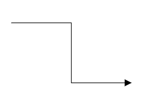

# Multiple Segments in Blazor Diagram Component

## How to Create Connectors with Multiple Segments

Connectors can include a sequence of segment objects. To create a connector with multiple segments, define and add the segments to the [connector.Segments](https://help.syncfusion.com/cr/blazor/Syncfusion.Blazor.Diagram.ConnectorSegment.html) collection. The following code example illustrates how to create a connector with multiple segments.

```cshtml
@using Syncfusion.Blazor.Diagram

<SfDiagramComponent Width="1000px" Height="500px" Connectors="@connectors">
    <SnapSettings Constraints="SnapConstraints.None"></SnapSettings>
</SfDiagramComponent>

@code
{
    //Defines diagram's connector collection.
    private DiagramObjectCollection<Connector> connectors = new DiagramObjectCollection<Connector>();

    protected override void OnInitialized()
    {
        Connector connector1 = new Connector()
        {
            ID = "Connector1",
            Type = ConnectorSegmentType.Orthogonal,
            SourcePoint = new DiagramPoint()
            {
                X = 100,
                Y = 100
            },
            TargetPoint = new DiagramPoint() { X = 300, Y = 200 },
            Segments = new DiagramObjectCollection<ConnectorSegment>()
            {
                new OrthogonalSegment
                {
                    Length = 100,
                    Type = ConnectorSegmentType.Orthogonal,
                    Direction = Direction.Right
                },
                new OrthogonalSegment
                {
                    Length = 100,
                    Type = ConnectorSegmentType.Orthogonal,
                    Direction = Direction.Bottom
                }
            },
        };
        //Add the connector into connectors' collection.
        connectors.Add(connector1);
    }
}
```


A complete working sample can be downloaded from [GitHub](https://github.com/SyncfusionExamples/Blazor-Diagram-Examples/tree/master/UG-Samples/Connectors/Segments/MultipleSegments)



* Similarly, you can create multiple segments for all the connector type.


## See also

* [How to customize the connector properties](https://blazor.syncfusion.com/documentation/diagram/connectors/customization)

* [How to interact with the connector](https://blazor.syncfusion.com/documentation/diagram/connectors/interactions)

* [How to get the connector events](https://blazor.syncfusion.com/documentation/diagram/connectors/events)
