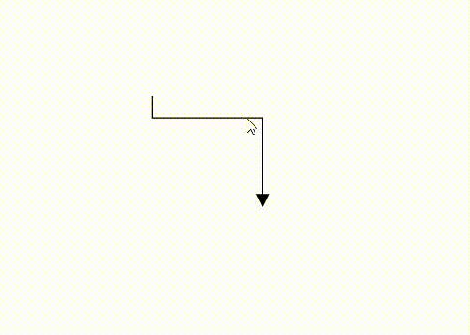

 
# Orthogonal Segments in Blazor Diagram Component

## How to create orthogonal segment

Orthogonal segments are used to create segments that are perpendicular to each other. Set the segment Type as [Orthogonal](https://help.syncfusion.com/cr/blazor/Syncfusion.Blazor.Diagram.ConnectorSegmentType.html#Syncfusion_Blazor_Diagram_ConnectorSegmentType_Orthogonal) to create a default orthogonal segment and need to specify Type. The following code example illustrates how to create a default orthogonal segment.

```cshtml
@using Syncfusion.Blazor.Diagram

<SfDiagramComponent Width="1000px" Height="500px" Connectors="@connectors">
</SfDiagramComponent>

@code
{
    //Defines diagram's connector collection.
    DiagramObjectCollection<Connector> connectors = new DiagramObjectCollection<Connector>();

    protected override void OnInitialized()
    {
        Connector Connector = new Connector()
        {
            ID = "connector1",
            SourcePoint = new DiagramPoint()
            {
                X = 100,
                Y = 100
            },
            Style = new ShapeStyle() { StrokeColor = "#6f409f", StrokeWidth = 1 },
            TargetPoint = new DiagramPoint() { X = 200, Y = 200 },
             //Specify the segments type as Orthogonal.
            Type = ConnectorSegmentType.Orthogonal,
            TargetDecorator = new DecoratorSettings()
            {
                Shape = DecoratorShape.Arrow,
                Style = new ShapeStyle()
                {
                    Fill = "#6f409f",
                    StrokeColor = "#6f409f",
                    StrokeWidth = 1
                }
            }
        };
        connectors.Add(Connector);
    }
}
```
You can download a complete working sample from [GitHub](https://github.com/SyncfusionExamples/Blazor-Diagram-Examples/tree/master/UG-Samples/Connectors/Segments/Orthogonal)

The [Length](https://help.syncfusion.com/cr/blazor/Syncfusion.Blazor.Diagram.OrthogonalSegment.html#Syncfusion_Blazor_Diagram_OrthogonalSegment_Length) and [Direction](https://help.syncfusion.com/cr/blazor/Syncfusion.Blazor.Diagram.OrthogonalSegment.html#Syncfusion_Blazor_Diagram_OrthogonalSegment_Direction) properties allow you to define the flow and length of the segment. The following code example illustrates how to create customized orthogonal segments.

```cshtml
@using Syncfusion.Blazor.Diagram

<SfDiagramComponent Width="1000px" Height="500px" Connectors="@connectors">
</SfDiagramComponent>

@code
{
    //Defines diagram's connector collection.
    DiagramObjectCollection<Connector> connectors = new DiagramObjectCollection<Connector>();

    protected override void OnInitialized()
    {
        Connector Connector = new Connector()
        {
            ID = "connector1",
            SourcePoint = new DiagramPoint()
            {
                X = 100,
                Y = 100
            },
            Style = new ShapeStyle() { StrokeColor = "#6f409f", StrokeWidth = 1 },
            TargetPoint = new DiagramPoint() { X = 200, Y = 200 },
            Type = ConnectorSegmentType.Orthogonal,
            //Create a new segment with length and direction.
            Segments = new DiagramObjectCollection<ConnectorSegment>()
            {
                new OrthogonalSegment 
                {
                    Length = 100,
                    Type = ConnectorSegmentType.Orthogonal,
                    Direction = Direction.Right
                },
                new OrthogonalSegment 
                {
                    Length = 100,
                    Type = ConnectorSegmentType.Orthogonal,
                    Direction = Direction.Bottom,
                } 
            },
            TargetDecorator = new DecoratorSettings()
            {
                Shape = DecoratorShape.Arrow,
                Style = new ShapeStyle()
                {
                    Fill = "#6f409f",
                    StrokeColor = "#6f409f",
                    StrokeWidth = 1
                }
            }
        };
        connectors.Add(Connector);
    }
}
```
You can download a complete working sample from [GitHub](https://github.com/SyncfusionExamples/Blazor-Diagram-Examples/tree/master/UG-Samples/Connectors/Segments/Orthogonal)


N> You need to mention the segment type as you mentioned in the connector type. There should be no contradiction between connector type and segment type.

### Orthogonal segment editing

* Orthogonal thumbs allow you to adjust the length of adjacent segments by clicking and dragging them.
* When necessary, some segments are added or removed automatically, when dragging the segment. This is to maintain proper routing of orthogonality between segments.

```cshtml
@using Syncfusion.Blazor.Diagram

<SfDiagramComponent @ref="Diagram" Width="1000px"  Height="500px" Connectors="@connectors">
</SfDiagramComponent>

@code
{
    //Reference the diagram
    SfDiagramComponent Diagram;
    //Initialize the diagram's node collection.
    DiagramObjectCollection<Connector> connectors = new DiagramObjectCollection<Connector>();

    protected override void OnInitialized()
    {
        Connector Connector = new Connector()
        // Enable the segment editing.
        {
            ID = "Connector2",
            Constraints = ConnectorConstraints.Default | ConnectorConstraints.DragSegmentThumb,
            Type = ConnectorSegmentType.Orthogonal,
            SourcePoint = new DiagramPoint { X = 400, Y = 100 },
            TargetPoint = new DiagramPoint { X = 500, Y = 200 }
        };
        connectors.Add(Connector);
    }
}
```
You can download a complete working sample from [GitHub](https://github.com/SyncfusionExamples/Blazor-Diagram-Examples/tree/master/UG-Samples/Connectors/Segments/OrthogonalSegmentEditing)


