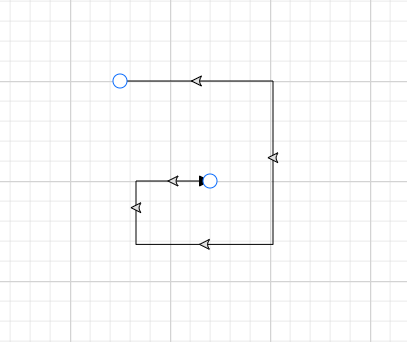

 
# Orthogonal Segments in Blazor Diagram Component

## How to Create Orthogonal Segments

[Orthogonal](https://help.syncfusion.com/cr/blazor/Syncfusion.Blazor.Diagram.ConnectorSegmentType.html#Syncfusion_Blazor_Diagram_ConnectorSegmentType_Orthogonal) segments create segments that are perpendicular to each other. To create an orthogonal connector, set the connector Type to **Orthogonal** to create a default orthogonal segment and need to specify Type. The following code example illustrates how to create a default orthogonal segment.

```cshtml
@using Syncfusion.Blazor.Diagram

<SfDiagramComponent Width="1000px" Height="500px" Connectors="@connectors">
</SfDiagramComponent>

@code
{
    //Defines diagram's connector collection.
    DiagramObjectCollection<Connector> connectors = new DiagramObjectCollection<Connector>();

    protected override void OnInitialized()
    {
        Connector Connector = new Connector()
        {
            ID = "connector1",
            SourcePoint = new DiagramPoint()
            {
                X = 100,
                Y = 100
            },
            Style = new ShapeStyle() { StrokeColor = "#6f409f", StrokeWidth = 1 },
            TargetPoint = new DiagramPoint() { X = 200, Y = 200 },
             //Specify the segments type as Orthogonal.
            Type = ConnectorSegmentType.Orthogonal,
            TargetDecorator = new DecoratorSettings()
            {
                Shape = DecoratorShape.Arrow,
                Style = new ShapeStyle()
                {
                    Fill = "#6f409f",
                    StrokeColor = "#6f409f",
                    StrokeWidth = 1
                }
            }
        };
        connectors.Add(Connector);
    }
}
```


A complete working sample can be downloaded from [GitHub](https://github.com/SyncfusionExamples/Blazor-Diagram-Examples/tree/master/UG-Samples/Connectors/Segments/Orthogonal)


The [Length](https://help.syncfusion.com/cr/blazor/Syncfusion.Blazor.Diagram.OrthogonalSegment.html#Syncfusion_Blazor_Diagram_OrthogonalSegment_Length) and [Direction](https://help.syncfusion.com/cr/blazor/Syncfusion.Blazor.Diagram.OrthogonalSegment.html#Syncfusion_Blazor_Diagram_OrthogonalSegment_Direction) properties allow you to define the flow and length of the segment. The following code example illustrates how to create customized orthogonal segments.

```cshtml
@using Syncfusion.Blazor.Diagram

<SfDiagramComponent Width="1000px" Height="500px" Connectors="@connectors">
</SfDiagramComponent>

@code
{
    //Defines diagram's connector collection.
    DiagramObjectCollection<Connector> connectors = new DiagramObjectCollection<Connector>();

    protected override void OnInitialized()
    {
        Connector Connector = new Connector()
        {
            ID = "connector1",
            SourcePoint = new DiagramPoint()
            {
                X = 100,
                Y = 100
            },
            Style = new ShapeStyle() { StrokeColor = "#6f409f", StrokeWidth = 1 },
            TargetPoint = new DiagramPoint() { X = 200, Y = 200 },
            Type = ConnectorSegmentType.Orthogonal,
            //Create a new segment with length and direction.
            Segments = new DiagramObjectCollection<ConnectorSegment>()
            {
                new OrthogonalSegment 
                {
                    Length = 100,
                    Type = ConnectorSegmentType.Orthogonal,
                    Direction = Direction.Right
                },
                new OrthogonalSegment 
                {
                    Length = 100,
                    Type = ConnectorSegmentType.Orthogonal,
                    Direction = Direction.Bottom,
                } 
            },
            TargetDecorator = new DecoratorSettings()
            {
                Shape = DecoratorShape.Arrow,
                Style = new ShapeStyle()
                {
                    Fill = "#6f409f",
                    StrokeColor = "#6f409f",
                    StrokeWidth = 1
                }
            }
        };
        connectors.Add(Connector);
    }
}
```


A complete working sample can be downloaded from [GitHub](https://github.com/SyncfusionExamples/Blazor-Diagram-Examples/tree/master/UG-Samples/Connectors/Segments/Orthogonal)

N> Ensure the connector Type and each segment Type are both set to **Orthogonal**. There should be no contradiction between connector type and segment type.

### How to Edit Orthogonal Segments

* Orthogonal thumbs allow adjusting the length of adjacent segments by clicking and dragging.
* Some segments may be added or removed automatically during dragging to preserve proper orthogonal routing between segments.

```cshtml
@using Syncfusion.Blazor.Diagram

<SfDiagramComponent @ref="Diagram" Width="1000px"  Height="500px" Connectors="@connectors">
</SfDiagramComponent>

@code
{
    //Reference the diagram
    SfDiagramComponent Diagram;
    //Initialize the diagram's node collection.
    DiagramObjectCollection<Connector> connectors = new DiagramObjectCollection<Connector>();

    protected override void OnInitialized()
    {
        Connector Connector = new Connector()
        // Enable the segment editing.
        {
            ID = "Connector2",
            Constraints = ConnectorConstraints.Default | ConnectorConstraints.DragSegmentThumb,
            Type = ConnectorSegmentType.Orthogonal,
            SourcePoint = new DiagramPoint { X = 400, Y = 100 },
            TargetPoint = new DiagramPoint { X = 500, Y = 200 }
        };
        connectors.Add(Connector);
    }
}
```



A complete working sample can be downloaded from [GitHub](https://github.com/SyncfusionExamples/Blazor-Diagram-Examples/tree/master/UG-Samples/Connectors/Segments/OrthogonalSegmentEditing)


## How to Customize Orthogonal Segment Thumb Shape

The Orthogonal connector can have multiple segments between the source and target points. By default, segment thumbs are rendered as **circles**. They can be customized globally or per connector using the [SegmentThumbSettings](https://help.syncfusion.com/cr/blazor/Syncfusion.Blazor.Diagram.SegmentThumbSettings.html) class.

To change the segment thumb shape for all Orthogonal connectors, configure the `SegmentThumbSettings` property of the SfDiagramComponent and set the [Shape](https://help.syncfusion.com/cr/blazor/Syncfusion.Blazor.Diagram.SegmentThumbSettings.html#Syncfusion_Blazor_Diagram_SegmentThumbSettings_Shape) property to the desired shape.

To customize the segment thumb shape for a specific connector, first disable the [InheritSegmentThumbShape](https://help.syncfusion.com/cr/blazor/Syncfusion.Blazor.Diagram.ConnectorConstraints.html#Syncfusion_Blazor_Diagram_ConnectorConstraints_InheritSegmentThumbShape) constraint. Then, configure the `SegmentThumbSettings` property of the Connector class, specifying the desired shape using the `Shape` property of the `SegmentThumbSettings` class.

The following predefined shapes are available for segment thumbs:

| Shape name | Shape |
|-------- | -------- |
|Rhombus|  |
| Square |  |
| Rectangle |  |
| [Ellipse](https://help.syncfusion.com/cr/blazor/Syncfusion.Blazor.Diagram.SegmentThumbShapes.html#Syncfusion_Blazor_Diagram_SegmentThumbShapes_Ellipse) | |
| [Circle](https://help.syncfusion.com/cr/blazor/Syncfusion.Blazor.Diagram.SegmentThumbShapes.html#Syncfusion_Blazor_Diagram_SegmentThumbShapes_Circle) | |
|[Arrow](https://help.syncfusion.com/cr/blazor/Syncfusion.Blazor.Diagram.SegmentThumbShapes.html#Syncfusion_Blazor_Diagram_SegmentThumbShapes_Arrow)|  |
| [OpenArrow](https://help.syncfusion.com/cr/blazor/Syncfusion.Blazor.Diagram.SegmentThumbShapes.html#Syncfusion_Blazor_Diagram_SegmentThumbShapes_OpenArrow) |  |
| [Fletch](https://help.syncfusion.com/cr/blazor/Syncfusion.Blazor.Diagram.SegmentThumbShapes.html#Syncfusion_Blazor_Diagram_SegmentThumbShapes_Fletch)| |
|[OpenFletch](https://help.syncfusion.com/cr/blazor/Syncfusion.Blazor.Diagram.SegmentThumbShapes.html#Syncfusion_Blazor_Diagram_SegmentThumbShapes_OpenFletch)|  |
| [IndentedArrow](https://help.syncfusion.com/cr/blazor/Syncfusion.Blazor.Diagram.SegmentThumbShapes.html#Syncfusion_Blazor_Diagram_SegmentThumbShapes_IndentedArrow) |  |
| [OutdentedArrow](https://help.syncfusion.com/cr/blazor/Syncfusion.Blazor.Diagram.SegmentThumbShapes.html#Syncfusion_Blazor_Diagram_SegmentThumbShapes_OutdentedArrow) |  |
| [DoubleArrow](https://help.syncfusion.com/cr/blazor/Syncfusion.Blazor.Diagram.SegmentThumbShapes.html#Syncfusion_Blazor_Diagram_SegmentThumbShapes_DoubleArrow) | |

The following code example illustrates how to customize the orthogonal segment thumb shape.

```cshtml
@using Syncfusion.Blazor.Diagram
<SfDiagramComponent @ref="Diagram" Width="1000px"  Height="500px" Connectors="@connectors">
</SfDiagramComponent>
@code
{
    SfDiagramComponent Diagram;
    DiagramObjectCollection<Connector> connectors = new DiagramObjectCollection<Connector>();
    protected override void OnInitialized()
    {
        Connector Connector = new Connector()
        {
            ID = "Connector2",
            Constraints = ConnectorConstraints.Default | ConnectorConstraints.DragSegmentThumb,
            Type = ConnectorSegmentType.Orthogonal,
            SourcePoint = new DiagramPoint { X = 400, Y = 100 },
            TargetPoint = new DiagramPoint { X = 500, Y = 200 },
            SegmentThumbSettings = new SegmentThumbSettings() {Shape = SegmentThumbShapes.IndentedArrow}
        };
        connectors.Add(Connector);
    }
}
```


A complete working sample can be downloaded from [GitHub](https://github.com/SyncfusionExamples/Blazor-Diagram-Examples/tree/master/UG-Samples/Connectors/Segments/OrthogonalThumbShape).



When the `InheritSegmentThumbShape` constraint is enabled in the connector, the shape specified at the diagram level will be applied to the connector's segment thumb. This allows for consistent segment thumb shapes across the diagram.

The following code example illustrates how to customize the orthogonal segment thumb shape using `InheritSegmentThumbShape` constraints.

```cshtml
@using Syncfusion.Blazor.Diagram
<SfDiagramComponent @ref="Diagram" Width="1000px"  Height="500px" Connectors="@connectors" ConnectorSegmentThumb="@segmentThumbSettings">
</SfDiagramComponent>
@code
{
    SfDiagramComponent Diagram;
    DiagramObjectCollection<Connector> connectors = new DiagramObjectCollection<Connector>();
    SegmentThumbSettings segmentThumbSettings = new SegmentThumbSettings(){Shape = SegmentThumbShapes.Fletch};
    protected override void OnInitialized()
    {
        Connector Connector = new Connector()
        {
            ID = "Connector2",
            Constraints = ConnectorConstraints.Default | ConnectorConstraints.DragSegmentThumb | ConnectorConstraints.InheritSegmentThumbShape,
            Type = ConnectorSegmentType.Orthogonal,
            SourcePoint = new DiagramPoint { X = 400, Y = 100 },
            TargetPoint = new DiagramPoint { X = 500, Y = 200 }
        };
        connectors.Add(Connector);
    }
}
```


A complete working sample can be downloaded from [GitHub](https://github.com/SyncfusionExamples/Blazor-Diagram-Examples/tree/master/UG-Samples/Connectors/Segments/OrthogonalThumbSetting)


>Note:  This feature ensures that the shape is updated regardless of whether the  [InheritSegmentThumbShape](https://help.syncfusion.com/cr/blazor/Syncfusion.Blazor.Diagram.ConnectorConstraints.html#Syncfusion_Blazor_Diagram_ConnectorConstraints_InheritSegmentThumbShape) enum value is added to the [Constraints](https://help.syncfusion.com/cr/blazor/Syncfusion.Blazor.Diagram.Connector.html#Syncfusion_Blazor_Diagram_Connector_Constraints) property of the diagram. If you apply the `InheritSegmentThumbShape` constraints, the shape will be updated at the diagram level. Without these constraints, the shape will be updated at the connector level. 
 To make the shapes visible, ensure that the [DragSegmentThumb](https://help.syncfusion.com/cr/blazor/Syncfusion.Blazor.Diagram.ConnectorConstraints.html#Syncfusion_Blazor_Diagram_ConnectorConstraints_DragSegmentThumb) enum is added to the connector's constraints.
