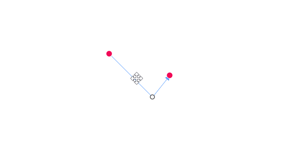
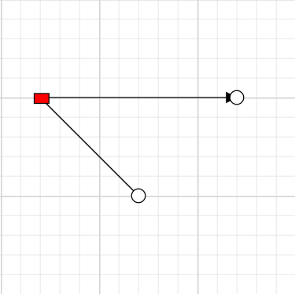

# Straight Segments in Blazor Diagram Component

## How to create straight segment

To create a straight line, specify the [Type](https://help.syncfusion.com/cr/blazor/Syncfusion.Blazor.Diagram.Connector.html#Syncfusion_Blazor_Diagram_Connector_Type) of the segment as [Straight](https://help.syncfusion.com/cr/blazor/Syncfusion.Blazor.Diagram.ConnectorSegmentType.html#Syncfusion_Blazor_Diagram_ConnectorSegmentType_Straight) nd add a straight segment to the  [Segments](https://help.syncfusion.com/cr/blazor/Syncfusion.Blazor.Diagram.Connector.html#Syncfusion_Blazor_Diagram_Connector_Segments) collection and need to specify Type for the connector. The following code example illustrates how to create a default straight segment.

```cshtml
@using Syncfusion.Blazor.Diagram

<SfDiagramComponent Width="1000px" Height="500px" Connectors="@connectors">
</SfDiagramComponent>

@code
{
    //Defines diagram's connector collection.
    DiagramObjectCollection<Connector> connectors = new DiagramObjectCollection<Connector>();

    protected override void OnInitialized()
    {
        Connector Connector = new Connector()
        {
            ID = "connector1",
            SourcePoint = new DiagramPoint()
            {
                X = 100,
                Y = 100
            },
            Style = new ShapeStyle() { StrokeColor = "#6f409f", StrokeWidth = 1 },
            TargetPoint = new DiagramPoint() { X = 200, Y = 200 },
             //Specify the segment type as straight.
            Type = ConnectorSegmentType.Straight,
            TargetDecorator = new DecoratorSettings()
            {
                Shape = DecoratorShape.Arrow,
                Style = new ShapeStyle()
                {
                    Fill = "#6f409f",
                    StrokeColor = "#6f409f",
                    StrokeWidth = 1
                }
            }
        };
        connectors.Add(Connector);
    }
}
```
You can download a complete working sample from [GitHub](https://github.com/SyncfusionExamples/Blazor-Diagram-Examples/tree/master/UG-Samples/Connectors/Segments/Straight)

### Straight segment editing

* End point of each straight segment is represented by a thumb that enables to edit the segment.
* Any number of new segments can be inserted into a straight line by clicking when Shift and Ctrl keys are pressed (Ctrl+Shift+Click).
* Straight segments can be removed by clicking the segment end point when Ctrl and Shift keys are pressed (Ctrl+Shift+Click).

```cshtml
@using Syncfusion.Blazor.Diagram

<SfDiagramComponent @ref="Diagram" Width="1000px" Height="500px" Connectors="@connectors">
</SfDiagramComponent>

@code
{
    //Reference the diagram.
    SfDiagramComponent Diagram;
    //Initialize the diagram's nodes collection
    DiagramObjectCollection<Connector> connectors = new DiagramObjectCollection<Connector>();

    protected override void OnInitialized()
    {
        Connector Connector = new Connector()
        { 
            ID = "Connector1",
            Constraints = ConnectorConstraints.Default | ConnectorConstraints.DragSegmentThumb,
            SourcePoint = new DiagramPoint { X = 200, Y = 100 },
            TargetPoint = new DiagramPoint { X = 340, Y = 150 },
            // Enable the segment editing.
            Segments = new DiagramObjectCollection<ConnectorSegment>
            {
                new StraightSegment()
                {
                    Type = ConnectorSegmentType.Straight,
                    Point = new DiagramPoint { X = 300, Y = 200 }
                }
            }
        };
        connectors.Add(Connector);
    }
}
```
You can download a complete working sample from [GitHub](https://github.com/SyncfusionExamples/Blazor-Diagram-Examples/tree/master/UG-Samples/Connectors/Segments/StraightSegmentEditing)



### How to customize Straight Segment Thumb Shape and Style

The straight connector can have any number of segments in between the source and the target point. By default, these segments are rendered as circles in grey color.   The Shape and Style property of `SegmentThumbSettings` allows to define the shape and style of the segment thumb. This feature can be enabled by adding the `InheritSegmentThumbShape` enum value to the Constraints property of diagram. You have the option to customize the color, width, and appearance of these segment thumbs.You can choose the shape by any one of the following shapes.

* `Circle`
* `Square`
* `Rectangle`
* `Ellipse`
* `Arrow`
* `Diamond`
* `OpenArrow`
* `Rhombus`
* `OpenFetch`
* `Fletch`
* `IndentedArrow`
* `OutdentedArrow`
* `DoubleArrow`

The following code example illustrates how to create a customized bezier segment thumb.

```cshtml
@using Syncfusion.Blazor.Diagram
@using Syncfusion.Blazor.Diagram.Internal

<SfDiagramComponent Width="1000px" Height="500px"  Connectors="@connectors" ConnectorSegmentThumb="@connectorSegmentThumb"></SfDiagramComponent>

@code {
    
    //Define the diagram's connector collection.
    DiagramObjectCollection<Connector> connectors = new DiagramObjectCollection<Connector>();
    //Define the segment shape and style
    SegmentThumbSettings connectorSegmentThumb = new SegmentThumbSettings() { Shape = SegmentThumbShapes.Rectangle, Style = new ShapeStyle() {Fill = "red" , StrokeColor = "black"} };

    protected override void OnInitialized()
    {
        Connector Connector = new Connector()
            {
                ID = "Connector",
                Constraints = ConnectorConstraints.Default | ConnectorConstraints.DragSegmentThumb | ConnectorConstraints.InheritSegmentThumbShape,
                SourcePoint = new DiagramPoint { X = 100, Y = 100 },
                TargetPoint = new DiagramPoint { X = 250, Y = 250 },
                  
                Segments = new DiagramObjectCollection<ConnectorSegment>
                {
                   new StraightSegment()
                   {
                       Type = ConnectorSegmentType.Straight,
                       Point = new DiagramPoint { X = 180, Y = 180 }
                   }
                },
           
            };
        connectors.Add(Connector);
    }
}
```
You can download a complete working sample from [GitHub](https://github.com/SyncfusionExamples/Blazor-Diagram-Examples/tree/master/UG-Samples/Connectors/Segments/StraightSegmentShape)

