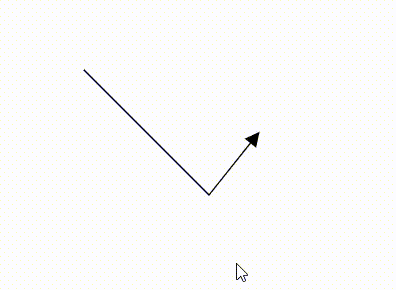
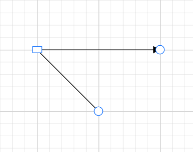
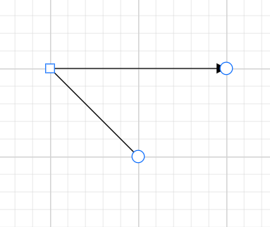

# Straight Segments in Blazor Diagram Component

## How to create straight segment

To create a straight line, specify the [Type](https://help.syncfusion.com/cr/blazor/Syncfusion.Blazor.Diagram.Connector.html#Syncfusion_Blazor_Diagram_Connector_Type) of the segment as [Straight](https://help.syncfusion.com/cr/blazor/Syncfusion.Blazor.Diagram.ConnectorSegmentType.html#Syncfusion_Blazor_Diagram_ConnectorSegmentType_Straight) and add a straight segment to the  [Segments](https://help.syncfusion.com/cr/blazor/Syncfusion.Blazor.Diagram.Connector.html#Syncfusion_Blazor_Diagram_Connector_Segments) collection and need to specify Type for the connector. The following code example illustrates how to create a default straight segment.

```cshtml
@using Syncfusion.Blazor.Diagram

<SfDiagramComponent Width="1000px" Height="500px" Connectors="@connectors">
</SfDiagramComponent>

@code
{
    //Defines diagram's connector collection.
    DiagramObjectCollection<Connector> connectors = new DiagramObjectCollection<Connector>();

    protected override void OnInitialized()
    {
        Connector Connector = new Connector()
        {
            ID = "connector1",
            SourcePoint = new DiagramPoint()
            {
                X = 100,
                Y = 100
            },
            Style = new ShapeStyle() { StrokeColor = "#6f409f", StrokeWidth = 1 },
            TargetPoint = new DiagramPoint() { X = 200, Y = 200 },
             //Specify the segment type as straight.
            Type = ConnectorSegmentType.Straight,
            TargetDecorator = new DecoratorSettings()
            {
                Shape = DecoratorShape.Arrow,
                Style = new ShapeStyle()
                {
                    Fill = "#6f409f",
                    StrokeColor = "#6f409f",
                    StrokeWidth = 1
                }
            }
        };
        connectors.Add(Connector);
    }
}
```
You can download a complete working sample from [GitHub](https://github.com/SyncfusionExamples/Blazor-Diagram-Examples/tree/master/UG-Samples/Connectors/Segments/Straight)

### Straight segment editing

* End point of each straight segment is represented by a thumb that enables to edit the segment.
* Any number of new segments can be inserted into a straight line by clicking when Shift and Ctrl keys are pressed (Ctrl+Shift+Click).
* Straight segments can be removed by clicking the segment end point when Ctrl and Shift keys are pressed (Ctrl+Shift+Click).

```cshtml
@using Syncfusion.Blazor.Diagram

<SfDiagramComponent @ref="Diagram" Width="1000px" Height="500px" Connectors="@connectors">
</SfDiagramComponent>

@code
{
    //Reference the diagram.
    SfDiagramComponent Diagram;
    //Initialize the diagram's nodes collection
    DiagramObjectCollection<Connector> connectors = new DiagramObjectCollection<Connector>();

    protected override void OnInitialized()
    {
        Connector Connector = new Connector()
        { 
            ID = "Connector1",
            Constraints = ConnectorConstraints.Default | ConnectorConstraints.DragSegmentThumb,
            SourcePoint = new DiagramPoint { X = 200, Y = 100 },
            TargetPoint = new DiagramPoint { X = 340, Y = 150 },
            // Enable the segment editing.
            Segments = new DiagramObjectCollection<ConnectorSegment>
            {
                new StraightSegment()
                {
                    Type = ConnectorSegmentType.Straight,
                    Point = new DiagramPoint { X = 300, Y = 200 }
                }
            }
        };
        connectors.Add(Connector);
    }
}
```
You can download a complete working sample from [GitHub](https://github.com/SyncfusionExamples/Blazor-Diagram-Examples/tree/master/UG-Samples/Connectors/Segments/StraightSegmentEditing)



### How to customize Straight Segment Thumb Shape 

The straight connector does not have segments by default, featuring only the source and target thumbs. However, you can create multiple segments between the source and target points by using the `Segments` property. By default, these segments are rendered as circles.

You can customize the shape of these segment thumbs using the `Shape` property of the `SegmentThumbSettings` class.

This customization is effective whether or not the `InheritSegmentThumbShape` enum value is included in the `Constraints` property of the diagram. If you apply the `InheritSegmentThumbShape` constraint, the shape specified at the diagram level will be applied to all segment thumbs within the diagram. Without this constraint, the shape will be applied at the individual connector level.

To ensure that the customized shapes are visible, you must include the `DragSegmentThumb` enum in the connector's constraints.

The following predefined shapes are available for segment thumbs:

| Shape name | Shape |
|-------- | -------- |
|Rhombus|  |
| Square |  |
| Rectangle |  |
| Ellipse | |
| Circle | |
|Arrow|  |
| OpenArrow |  |
| Fletch| |
|OpenFetch|  |
| IndentedArrow |  |
| OutdentedArrow |  |
| DoubleArrow | |


The following code example illustrates how to create a customized bezier segment thumb shape using the `InheritSegmentThumbShape` constraints.

```cshtml
@using Syncfusion.Blazor.Diagram
@using Syncfusion.Blazor.Diagram.Internal
<SfDiagramComponent Width="1000px" Height="500px"  Connectors="@connectors" ConnectorSegmentThumb="@connectorSegmentThumb"></SfDiagramComponent>
@code {
    
    //Define the diagram's connector collection.
    DiagramObjectCollection<Connector> connectors = new DiagramObjectCollection<Connector>();
    //Define the segment shape
    SegmentThumbSettings connectorSegmentThumb = new SegmentThumbSettings() { Shape = SegmentThumbShapes.Rectangle };
    protected override void OnInitialized()
    {
        Connector Connector = new Connector()
            {
                ID = "Connector",
                Constraints = ConnectorConstraints.Default | ConnectorConstraints.DragSegmentThumb | ConnectorConstraints.InheritSegmentThumbShape,
                SourcePoint = new DiagramPoint { X = 100, Y = 100 },
                TargetPoint = new DiagramPoint { X = 250, Y = 250 },
                  
                Segments = new DiagramObjectCollection<ConnectorSegment>
                {
                   new StraightSegment()
                   {
                       Type = ConnectorSegmentType.Straight,
                       Point = new DiagramPoint { X = 180, Y = 180 }
                   }
                },
            };
        connectors.Add(Connector);
    }
}
```
You can download a complete working sample from [GitHub](https://github.com/SyncfusionExamples/Blazor-Diagram-Examples/tree/master/UG-Samples/Connectors/Segments/StraightSegmentShape)



The following code example illustrates how to create a customized bezier segment thumb shape without  using the `InheritSegmentThumbShape` constraints.

```cshtml
@using Syncfusion.Blazor.Diagram
@using Syncfusion.Blazor.Diagram.Internal
<SfDiagramComponent Width="1000px" Height="500px"  Connectors="@connectors" ></SfDiagramComponent>
@code {
    
    //Define the diagram's connector collection.
    DiagramObjectCollection<Connector> connectors = new DiagramObjectCollection<Connector>();
   
    protected override void OnInitialized()
    {
        Connector Connector = new Connector()
            {
                ID = "Connector",
                Constraints = ConnectorConstraints.Default | ConnectorConstraints.DragSegmentThumb,
                SourcePoint = new DiagramPoint { X = 100, Y = 100 },
                TargetPoint = new DiagramPoint { X = 250, Y = 250 },
                  
                Segments = new DiagramObjectCollection<ConnectorSegment>
                {
                   new StraightSegment()
                   {
                       Type = ConnectorSegmentType.Straight,
                       Point = new DiagramPoint { X = 180, Y = 180 }
                   }
                },
                  SegmentThumbSettings = new SegmentThumbSettings() { Shape = SegmentThumbShapes.Square },
           
            };
        connectors.Add(Connector);
    }
}
```
You can download a complete working sample from [GitHub](https://github.com/SyncfusionExamples/Blazor-Diagram-Examples/tree/master/UG-Samples/Connectors/Segments/SegmentShape)


