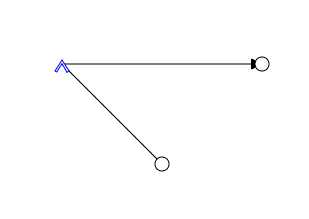

# Straight Segments in Blazor Diagram Component

## How to Create Straight Segments

To create a straight line, set the connector [Type](https://help.syncfusion.com/cr/blazor/Syncfusion.Blazor.Diagram.Connector.html#Syncfusion_Blazor_Diagram_Connector_Type) of the segment to [Straight](https://help.syncfusion.com/cr/blazor/Syncfusion.Blazor.Diagram.ConnectorSegmentType.html#Syncfusion_Blazor_Diagram_ConnectorSegmentType_Straight). Then add one or more straight segments to the [Segments](https://help.syncfusion.com/cr/blazor/Syncfusion.Blazor.Diagram.Connector.html#Syncfusion_Blazor_Diagram_Connector_Segments) collection and need to specify Type for the connector. The following code example illustrates how to create a default straight segment.

```cshtml
@using Syncfusion.Blazor.Diagram

<SfDiagramComponent Width="1000px" Height="500px" Connectors="@_connectors" />

@code
{
    //Defines diagram's connector collection.
    private DiagramObjectCollection<Connector> _connectors = new DiagramObjectCollection<Connector>();

    protected override void OnInitialized()
    {
        Connector connector = new Connector()
        {
            ID = "connector1",
            SourcePoint = new DiagramPoint()
            {
                X = 100,
                Y = 100
            },
            Style = new ShapeStyle() { StrokeColor = "#6f409f", StrokeWidth = 1 },
            TargetPoint = new DiagramPoint() { X = 200, Y = 200 },
            //Specify the segment type as straight.
            Type = ConnectorSegmentType.Straight,
            TargetDecorator = new DecoratorSettings()
            {
                Shape = DecoratorShape.Arrow,
                Style = new ShapeStyle()
                {
                    Fill = "#6f409f",
                    StrokeColor = "#6f409f",
                    StrokeWidth = 1
                }
            }
        };
        _connectors.Add(connector);
    }
}
```


A complete working sample can be downloaded from [GitHub](https://github.com/SyncfusionExamples/Blazor-UG-Examples/blob/master/Diagram/Server/Pages/Connectors/Segments/Straight.razor)

### How to Edit Straight Segments

* The end point of each straight segment is represented by a thumb that enables editing the segment.
* Insert a new segment into a straight line by pressing Ctrl+Shift and clicking (Ctrl+Shift+Click).
* Remove a straight segment by pressing Ctrl+Shift and clicking the segment end point (Ctrl+Shift+Click).

```cshtml
@using Syncfusion.Blazor.Diagram

<SfDiagramComponent @ref="_diagram" Width="1000px" Height="500px" Connectors="@_connectors" />

@code
{
    //Reference the diagram
    private SfDiagramComponent _diagram;
    // Initialize diagram's connector collection
    private DiagramObjectCollection<Connector> _connectors = new DiagramObjectCollection<Connector>();

    protected override void OnInitialized()
    {
        Connector Connector = new Connector()
        {
            ID = "Connector1",
            Constraints = ConnectorConstraints.Default | ConnectorConstraints.DragSegmentThumb,
            SourcePoint = new DiagramPoint { X = 200, Y = 100 },
            TargetPoint = new DiagramPoint { X = 340, Y = 150 },
            // Enable the segment editing.
            Segments = new DiagramObjectCollection<ConnectorSegment>
            {
                new StraightSegment()
                {
                    Type = ConnectorSegmentType.Straight,
                    Point = new DiagramPoint { X = 300, Y = 200 }
                }
            }
        };
        _connectors.Add(Connector);
    }
}
```
A complete working sample can be downloaded from [GitHub](https://github.com/SyncfusionExamples/Blazor-UG-Examples/blob/master/Diagram/Server/Pages/Connectors/Segments/StraightSegmentEditing.razor)



## How to Customize Straight Segment Thumb Shape 

The straight connector can have multiple segments between the source and target points. By default, segment thumbs are rendered as **circles**. They can be customized globally or per connector using the [SegmentThumbSettings](https://help.syncfusion.com/cr/blazor/Syncfusion.Blazor.Diagram.SegmentThumbSettings.html) class.

To change the segment thumb shape for all Straight connectors, configure the [ConnectorSegmentThumb](https://help.syncfusion.com/cr/blazor/Syncfusion.Blazor.Diagram.SfDiagramComponent.html#Syncfusion_Blazor_Diagram_SfDiagramComponent_ConnectorSegmentThumb) property of the SfDiagramComponent class and set the [Shape](https://help.syncfusion.com/cr/blazor/Syncfusion.Blazor.Diagram.SegmentThumbSettings.html#Syncfusion_Blazor_Diagram_SegmentThumbSettings_Shape) property to the desired shape.

To customize the segment thumb shape for a specific connector, first disable the [InheritSegmentThumbShape](https://help.syncfusion.com/cr/blazor/Syncfusion.Blazor.Diagram.ConnectorConstraints.html#Syncfusion_Blazor_Diagram_ConnectorConstraints_InheritSegmentThumbShape) constraint. Then set the shape on the connector’s  `SegmentThumbSettings` property of the Connector class, specifying the desired shape using the `Shape` property of the `SegmentThumbSettings` class. 

The following predefined shapes are available for segment thumbs:

| Shape name | Shape |
|-------- | -------- |
|Rhombus|  |
| Square |  |
| Rectangle |  |
| Ellipse | |
| Circle | |
|Arrow|  |
| OpenArrow |  |
| Fletch| |
|OpenFetch|  |
| IndentedArrow |  |
| OutdentedArrow |  |
| DoubleArrow | |


The following code example illustrates how to create a customized straight segment thumb shape using the `InheritSegmentThumbShape` constraints.

```cshtml
@using Syncfusion.Blazor.Diagram
@using Syncfusion.Blazor.Diagram.Internal

<SfDiagramComponent Width="1000px" Height="500px" Connectors="@_connectors" ConnectorSegmentThumb="@_connectorSegmentThumb" />

@code
{
    //Define the diagram's connector collection.
    private DiagramObjectCollection<Connector> _connectors = new DiagramObjectCollection<Connector>();
    //Define the segment shape
    private SegmentThumbSettings _connectorSegmentThumb = new SegmentThumbSettings() { Shape = SegmentThumbShapes.Rectangle };

    protected override void OnInitialized()
    {
        Connector connector = new Connector()
        {
            ID = "Connector",
            Constraints = ConnectorConstraints.Default | ConnectorConstraints.DragSegmentThumb | ConnectorConstraints.InheritSegmentThumbShape,
            SourcePoint = new DiagramPoint { X = 100, Y = 100 },
            TargetPoint = new DiagramPoint { X = 250, Y = 250 },
            Segments = new DiagramObjectCollection<ConnectorSegment>
            {
                new StraightSegment()
                {
                    Type = ConnectorSegmentType.Straight,
                    Point = new DiagramPoint { X = 180, Y = 180 }
                }
            },
        };
        _connectors.Add(connector);
    }
}
```
A complete working sample can be downloaded from [GitHub](https://github.com/SyncfusionExamples/Blazor-UG-Examples/blob/master/Diagram/Server/Pages/Connectors/Segments/Straight/StraightSegmentShape.razor)



The following code example illustrates how to create a customized straight segment thumb shape without using the `InheritSegmentThumbShape` constraints.

```cshtml
@using Syncfusion.Blazor.Diagram
@using Syncfusion.Blazor.Diagram.Internal

<SfDiagramComponent Width="1000px" Height="500px" Connectors="@_connectors"></SfDiagramComponent>

@code
{
    //Define the diagram's connector collection.
    private DiagramObjectCollection<Connector> _connectors = new DiagramObjectCollection<Connector>();

    protected override void OnInitialized()
    {
        Connector connector = new Connector()
        {
            ID = "Connector",
            Constraints = ConnectorConstraints.Default | ConnectorConstraints.DragSegmentThumb,
            SourcePoint = new DiagramPoint { X = 100, Y = 100 },
            TargetPoint = new DiagramPoint { X = 250, Y = 250 },
            Segments = new DiagramObjectCollection<ConnectorSegment>
            {
                new StraightSegment()
                {
                    Type = ConnectorSegmentType.Straight,
                    Point = new DiagramPoint { X = 180, Y = 180 }
                }
            },
            SegmentThumbSettings = new SegmentThumbSettings() { Shape = SegmentThumbShapes.Square },
        };
        _connectors.Add(connector);
    }
}
```
A complete working sample can be downloaded from [GitHub](https://github.com/SyncfusionExamples/Blazor-UG-Examples/blob/master/Diagram/Server/Pages/Connectors/Segments/Straight/SegmentShape.razor)



>Note:  This feature ensures that the shape is updated regardless of whether the  [InheritSegmentThumbShape](https://help.syncfusion.com/cr/blazor/Syncfusion.Blazor.Diagram.ConnectorConstraints.html#Syncfusion_Blazor_Diagram_ConnectorConstraints_InheritSegmentThumbShape) enum value is added to the [Constraints](https://help.syncfusion.com/cr/blazor/Syncfusion.Blazor.Diagram.Connector.html#Syncfusion_Blazor_Diagram_Connector_Constraints) property of the diagram. If you apply the `InheritSegmentThumbShape` constraints, the shape will be updated at the diagram level. Without these constraints, the shape will be updated at the connector level. 
 To make the shapes visible, ensure that the [DragSegmentThumb](https://help.syncfusion.com/cr/blazor/Syncfusion.Blazor.Diagram.ConnectorConstraints.html#Syncfusion_Blazor_Diagram_ConnectorConstraints_DragSegmentThumb) enum is added to the connector's constraints.
