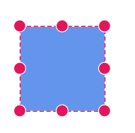
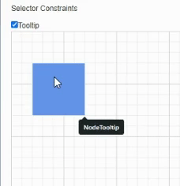

# Constraints in Diagram Component

Constraints are used to enable or disable specific behaviors of the diagram, nodes, and connectors. Constraints are provided as flagged enumerations, so multiple behaviors can be enabled or disabled using bitwise operators `(&, |, ~, <<, etc.)`.

To learn more about bitwise operators, refer to [Bitwise Operations](constraints#bitwise-operations).

## How to Enable or Disable Diagram Constraints

[DiagramConstraints](https://help.syncfusion.com/cr/blazor/Syncfusion.Blazor.Diagram.DiagramConstraints.html#Syncfusion_Blazor_Diagram_DiagramConstraints) allow enabling or disabling the following behaviors:

* PageEditable
* Bridging
* Zoom
* UndoRedo
* UserInteraction
* Tooltip

| Constraints | Description |
| -------- | -------- |
|[None](https://help.syncfusion.com/cr/blazor/Syncfusion.Blazor.Diagram.DiagramConstraints.html#Syncfusion_Blazor_Diagram_DiagramConstraints_None)|Disable all diagram functionalities.|
|[Bridging](https://help.syncfusion.com/cr/blazor/Syncfusion.Blazor.Diagram.DiagramConstraints.html#Syncfusion_Blazor_Diagram_DiagramConstraints_Bridging)|Enables or disables Bridging support for connector in diagram.|
|[UndoRedo](https://help.syncfusion.com/cr/blazor/Syncfusion.Blazor.Diagram.DiagramConstraints.html#Syncfusion_Blazor_Diagram_DiagramConstraints_UndoRedo)|Enables or disables the Undo/Redo support for the diagram.|
|[UserInteraction](https://help.syncfusion.com/cr/blazor/Syncfusion.Blazor.Diagram.DiagramConstraints.html#Syncfusion_Blazor_Diagram_DiagramConstraints_UserInteraction)|Enables or disables user interaction support for the diagram.|
|[ApiUpdate](https://help.syncfusion.com/cr/blazor/Syncfusion.Blazor.Diagram.DiagramConstraints.html#Syncfusion_Blazor_Diagram_DiagramConstraints_ApiUpdate)|Enables or disables update API support for the diagram.|
|[PageEditable](https://help.syncfusion.com/cr/blazor/Syncfusion.Blazor.Diagram.DiagramConstraints.html#Syncfusion_Blazor_Diagram_DiagramConstraints_PageEditable)|Enables or disables Page Editable support for the diagram.|
|[Zoom](https://help.syncfusion.com/cr/blazor/Syncfusion.Blazor.Diagram.DiagramConstraints.html#Syncfusion_Blazor_Diagram_DiagramConstraints_Zoom)|Enables or disables Zoom support for the diagram.|
|[PanX](https://help.syncfusion.com/cr/blazor/Syncfusion.Blazor.Diagram.DiagramConstraints.html#Syncfusion_Blazor_Diagram_DiagramConstraints_PanX)|Enables or disables Panning X coordinate support for the diagram.|
|[PanY](https://help.syncfusion.com/cr/blazor/Syncfusion.Blazor.Diagram.DiagramConstraints.html#Syncfusion_Blazor_Diagram_DiagramConstraints_PanY)|Enables or disables Panning Y coordinate support for the diagram.|
|[Pan](https://help.syncfusion.com/cr/blazor/Syncfusion.Blazor.Diagram.DiagramConstraints.html#Syncfusion_Blazor_Diagram_DiagramConstraints_Pan)|Enables or disables panning both X and Y coordinates support for the diagram.|
|[ZoomTextEdit](https://help.syncfusion.com/cr/blazor/Syncfusion.Blazor.Diagram.DiagramConstraints.html#Syncfusion_Blazor_Diagram_DiagramConstraints_ZoomTextEdit)|Enables or disables zooming the text box while editing the text.|
|[Tooltip](https://help.syncfusion.com/cr/blazor/Syncfusion.Blazor.Diagram.DiagramConstraints.html#Syncfusion_Blazor_Diagram_DiagramConstraints_Tooltip)|Enables or disables the tooltip for the diagram elements(Nodes and connectors).|
|[Routing](https://help.syncfusion.com/cr/blazor/Syncfusion.Blazor.Diagram.DiagramConstraints.html#Syncfusion_Blazor_Diagram_DiagramConstraints_Routing)|Determines if automatic line routing is enabled or disabled for connectors. When enabled, lines are automatically routed to avoid overlapping with nodes and other obstacles.|
|[Default](https://help.syncfusion.com/cr/blazor/Syncfusion.Blazor.Diagram.DiagramConstraints.html#Syncfusion_Blazor_Diagram_DiagramConstraints_Default)|Enables or disables all constraints in diagram.|

The following example shows how to disable the `PageEditable` constraint from the default diagram constraints.

```cshtml
@using Syncfusion.Blazor.Diagram

@* Initialize the diagram with constraints *@
<SfDiagramComponent Height="600px" Nodes="@nodes" 
Constraints="@DiagramConstraints" />

@code
{
    //Sets the Diagram constraints.
    DiagramConstraints DiagramConstraints = DiagramConstraints.Default & ~DiagramConstraints.PageEditable;
    //Initialize the Nodes Collection.
    DiagramObjectCollection<Node> nodes;

    protected override void OnInitialized()
    {
        nodes = new DiagramObjectCollection<Node>();
        Node node = new Node()
        {
            ID = "node1",
            Height = 100,
            Width = 100,
            OffsetX = 100,
            OffsetY = 100,
        };
        nodes.Add(node);
    }
}
```


The following example shows how to add the Bridging constraint to the default constraints of the diagram.

```csharp
DiagramConstraints DiagramConstraints = DiagramConstraints.Default | DiagramConstraints.Bridging;
```

Diagram constraints are flagged enumerations, so multiple behaviors can be added or removed from the default constraints using [Bitwise Operations](constraints#bitwise-operations) in the diagram.

```csharp
//Removing multiple constraints from default.
DiagramConstraints DiagramConstraints = DiagramConstraints.Default & ~(DiagramConstraints.PageEditable|DiagramConstraints.Zoom);
```

For more information about diagram constraints, refer to [Diagram constraints](https://help.syncfusion.com/cr/blazor/Syncfusion.Blazor.Diagram.DiagramConstraints.html).

N> By default, the following constraints are enabled in the diagram,
<br/>* ApiUpdate
<br/>* PanX
<br/>* PanY
<br/>* Pan
<br/>* ZoomTextEdit
<br/>* Default
<br/>* None
<br/>* Tooltip

## How to Enable or Disable Node Constraints

The [Constraints](https://help.syncfusion.com/cr/blazor/Syncfusion.Blazor.Diagram.Node.html#Syncfusion_Blazor_Diagram_Node_Constraints) property of the node enables or disables the following behaviors: 

* Select
* Drag
* Resize
* Rotate
* Delete
* InConnect
* OutConnect
* Tooltip

| Constraints | Description |
| -------- | -------- |
|[None](https://help.syncfusion.com/cr/blazor/Syncfusion.Blazor.Diagram.NodeConstraints.html#Syncfusion_Blazor_Diagram_NodeConstraints_None)|Disable all node Constraints|
|[Select](https://help.syncfusion.com/cr/blazor/Syncfusion.Blazor.Diagram.NodeConstraints.html#Syncfusion_Blazor_Diagram_NodeConstraints_Select)|Enables or disables the node to be selected.|
|[Drag](https://help.syncfusion.com/cr/blazor/Syncfusion.Blazor.Diagram.NodeConstraints.html#Syncfusion_Blazor_Diagram_NodeConstraints_Drag)|Enables or disables the node to be dragged.|
|[Rotate](https://help.syncfusion.com/cr/blazor/Syncfusion.Blazor.Diagram.NodeConstraints.html#Syncfusion_Blazor_Diagram_NodeConstraints_Rotate)|Enables or disables the node to be rotated.|
|[Shadow](https://help.syncfusion.com/cr/blazor/Syncfusion.Blazor.Diagram.NodeConstraints.html#Syncfusion_Blazor_Diagram_NodeConstraints_Shadow)|Enables or disables the node to display shadow.|
|[PointerEvents](https://help.syncfusion.com/cr/blazor/Syncfusion.Blazor.Diagram.NodeConstraints.html#Syncfusion_Blazor_Diagram_NodeConstraints_PointerEvents)|Enables or disables the node to provide pointer option.|
|[Delete](https://help.syncfusion.com/cr/blazor/Syncfusion.Blazor.Diagram.NodeConstraints.html#Syncfusion_Blazor_Diagram_NodeConstraints_Delete)|Enables or disables node to be deleted.|
|[InConnect](https://help.syncfusion.com/cr/blazor/Syncfusion.Blazor.Diagram.NodeConstraints.html#Syncfusion_Blazor_Diagram_NodeConstraints_InConnect)|Enables or disables node to provide in connect option.|
|[OutConnect](https://help.syncfusion.com/cr/blazor/Syncfusion.Blazor.Diagram.NodeConstraints.html#Syncfusion_Blazor_Diagram_NodeConstraints_OutConnect)|Enables or disables node to provide out connect option.|
|[AllowDrop](https://help.syncfusion.com/cr/blazor/Syncfusion.Blazor.Diagram.NodeConstraints.html#Syncfusion_Blazor_Diagram_NodeConstraints_AllowDrop)|Enables node to provide allow to drop option.|
|[ResizeNorthEast](https://help.syncfusion.com/cr/blazor/Syncfusion.Blazor.Diagram.NodeConstraints.html#Syncfusion_Blazor_Diagram_NodeConstraints_ResizeNorthEast)|Enable or disable to resize NorthEast side of the node.|
|[ResizeEast](https://help.syncfusion.com/cr/blazor/Syncfusion.Blazor.Diagram.NodeConstraints.html#Syncfusion_Blazor_Diagram_NodeConstraints_ResizeEast)|Enable or disable to resize East side of the node.|
|[ResizeSouthEast](https://help.syncfusion.com/cr/blazor/Syncfusion.Blazor.Diagram.NodeConstraints.html#Syncfusion_Blazor_Diagram_NodeConstraints_ResizeSouthEast)|Enable or disable to resize SouthEast side of the node.|
|[ResizeSouth](https://help.syncfusion.com/cr/blazor/Syncfusion.Blazor.Diagram.NodeConstraints.html#Syncfusion_Blazor_Diagram_NodeConstraints_ResizeSouth)|Enable or disable to resize South side of the node.|
|[ResizeSouthWest](https://help.syncfusion.com/cr/blazor/Syncfusion.Blazor.Diagram.NodeConstraints.html#Syncfusion_Blazor_Diagram_NodeConstraints_ResizeSouthWast)|Enable or disable to resize SouthWest side of the node.|
|[ResizeWest](https://help.syncfusion.com/cr/blazor/Syncfusion.Blazor.Diagram.NodeConstraints.html#Syncfusion_Blazor_Diagram_NodeConstraints_ResizeWest)|Enable or disable to resize West side of the node.|
|[ResizeNorthWest](https://help.syncfusion.com/cr/blazor/Syncfusion.Blazor.Diagram.NodeConstraints.html#Syncfusion_Blazor_Diagram_NodeConstraints_ResizeNorthWest)|Enable or disable to resize NorthWest side of the node.|
|[ResizeNorth](https://help.syncfusion.com/cr/blazor/Syncfusion.Blazor.Diagram.NodeConstraints.html#Syncfusion_Blazor_Diagram_NodeConstraints_ResizeNorth)|Enable or disable to resize North side of the node.|
|[AspectRatio](https://help.syncfusion.com/cr/blazor/Syncfusion.Blazor.Diagram.NodeConstraints.html#Syncfusion_Blazor_Diagram_NodeConstraints_AspectRatio)|Enables the Aspect ratio of the node.|
|[ReadOnly](https://help.syncfusion.com/cr/blazor/Syncfusion.Blazor.Diagram.NodeConstraints.html#Syncfusion_Blazor_Diagram_NodeConstraints_ReadOnly)|Enables the ReadOnly support for annotation in the node.|
|[HideThumbs](https://help.syncfusion.com/cr/blazor/Syncfusion.Blazor.Diagram.NodeConstraints.html#Syncfusion_Blazor_Diagram_NodeConstraints_HideThumbs)|Enable to hide all resize thumbs for the node.|
|[Tooltip](https://help.syncfusion.com/cr/blazor/Syncfusion.Blazor.Diagram.NodeConstraints.html#Syncfusion_Blazor_Diagram_NodeConstraints_Tooltip)|Enables or disables tooltip for the Nodes.|
|[InheritTooltip](https://help.syncfusion.com/cr/blazor/Syncfusion.Blazor.Diagram.NodeConstraints.html#Syncfusion_Blazor_Diagram_NodeConstraints_InheritTooltip)|Enables or disables inherit tooltip option from the parent object.|
|[Resize](https://help.syncfusion.com/cr/blazor/Syncfusion.Blazor.Diagram.NodeConstraints.html#Syncfusion_Blazor_Diagram_NodeConstraints_Resize)|Enables or Disables the expansion or compression of a node.|
|[Inherit](https://help.syncfusion.com/cr/blazor/Syncfusion.Blazor.Diagram.NodeConstraints.html#Syncfusion_Blazor_Diagram_NodeConstraints_Inherit)|Enables the node to inherit the interaction option from the parent object.|
|[RoutingObstacle](https://help.syncfusion.com/cr/blazor/Syncfusion.Blazor.Diagram.NodeConstraints.html#Syncfusion_Blazor_Diagram_NodeConstraints_RoutingObstacle)|Enables or disables the node to be treated as obstacle while in routing.|
|[AllowDragWithinSwimlane](https://help.syncfusion.com/cr/blazor/Syncfusion.Blazor.Diagram.NodeConstraints.html#Syncfusion_Blazor_Diagram_NodeConstraints_AllowDragWithinSwimlane)|Restricts a node’s movement strictly within the swimlane boundaries.|
|[Default](https://help.syncfusion.com/cr/blazor/Syncfusion.Blazor.Diagram.NodeConstraints.html#Syncfusion_Blazor_Diagram_NodeConstraints_Default)|Enables all default constraints for the node.|

The following example shows how to disable the `Rotate` constraint from the default node constraints.

```cshtml
@using Syncfusion.Blazor.Diagram

@* Initialize the diagram with NodeCollection *@
<SfDiagramComponent Height="600px" Nodes="@nodes" />

@code
{
    DiagramObjectCollection<Node> nodes;

    protected override void OnInitialized()
    {
        nodes = new DiagramObjectCollection<Node>();
        Node node = new Node()
        {
            ID = "node1",
            Height = 100,
            Width = 100,
            OffsetX = 100,
            OffsetY = 100,
            Style = new ShapeStyle() { Fill = "#6495ED", StrokeColor = "White" },
            //Sets the NodeConstraints constraints.
            Constraints = NodeConstraints.Default & ~NodeConstraints.Rotate
        };
        nodes.Add(node);
    }
}
```


A complete working sample can be downloaded from [GitHub](https://github.com/SyncfusionExamples/Blazor-Diagram-Examples/tree/master/UG-Samples/Constraints/NodeConstraints)



The following example shows how to add the `Shadow` constraint to the default constraints of a node.

```csharp
NodeConstraints NodeConstraints = NodeConstraints.Default | NodeConstraints.Shadow;
```

Node constraints are flagged enumerations, so multiple behaviors can be added or removed from the default constraints using [Bitwise Operations](constraints#bitwise-operations).

```csharp
 //Removing multiple constraints from default.
NodeConstraints NodeConstraints = NodeConstraints.Default & ~ (NodeConstraints.Select | NodeConstraints.Drag);
```
The following code example shows how to enable the tooltip for a node.

```csharp
//Enabled the tooltip constraints for the node.
node.Constraints = NodeConstraints.Default | NodeConstraints.Tooltip;
```

For more information about node constraints, refer to [NodeConstraints](https://help.syncfusion.com/cr/blazor/Syncfusion.Blazor.Diagram.NodeConstraints.html).

N>By default, the following constraints are enabled for the node,
<br/>* Shadow
<br/>* PointerEvents
<br/>* AllowDrop
<br/>* ResizeNorthEast
<br/>* ResizeEast
<br/>* ResizeSouthEast
<br/>* ResizeSouth
<br/>* ResizeSouthWest
<br/>* ResizeWest
<br/>* ResizeNorthWest
<br/>* ResizeNorth
<br/>* AspectRatio
<br/>* ReadOnly
<br/>* HideThumbs
<br/>* Inherit
<br/>* Default

## How to Enable or Disable Connector Constraints

The [Constraints](https://help.syncfusion.com/cr/blazor/Syncfusion.Blazor.Diagram.Connector.html#Syncfusion_Blazor_Diagram_Connector_Constraints) property of the connector enables or disables the following behaviors: 

* Select
* Drag
* DragSourceEnd
* DragTargetEnd
* Delete
* InheritBridging
* PointerEvents
* Tooltip

| Constraints | Description |
| -------- | -------- |
|[None](https://help.syncfusion.com/cr/blazor/Syncfusion.Blazor.Diagram.ConnectorConstraints.html#Syncfusion_Blazor_Diagram_ConnectorConstraints_None)|Disables all connector constraints.|
|[Select](https://help.syncfusion.com/cr/blazor/Syncfusion.Blazor.Diagram.ConnectorConstraints.html#Syncfusion_Blazor_Diagram_ConnectorConstraints_Select)|Enables or disables connector to be selected.|
|[Delete](https://help.syncfusion.com/cr/blazor/Syncfusion.Blazor.Diagram.ConnectorConstraints.html#Syncfusion_Blazor_Diagram_ConnectorConstraints_Delete)|Enables or disables connector to be deleted.|
|[Drag](https://help.syncfusion.com/cr/blazor/Syncfusion.Blazor.Diagram.ConnectorConstraints.html#Syncfusion_Blazor_Diagram_ConnectorConstraints_Drag)|Enables or disables connector to be dragged.|
|[DragSourceEnd](https://help.syncfusion.com/cr/blazor/Syncfusion.Blazor.Diagram.ConnectorConstraints.html#Syncfusion_Blazor_Diagram_ConnectorConstraints_DragSourceEnd)|Enables connectors source end to be selected.|
|[DragTargetEnd](https://help.syncfusion.com/cr/blazor/Syncfusion.Blazor.Diagram.ConnectorConstraints.html#Syncfusion_Blazor_Diagram_ConnectorConstraints_DragTargetEnd)|Enables connectors target end to be selected.|
|[DragSegmentThumb](https://help.syncfusion.com/cr/blazor/Syncfusion.Blazor.Diagram.ConnectorConstraints.html#Syncfusion_Blazor_Diagram_ConnectorConstraints_DragSegmentThumb)|Enables control point and end point of every segment in a connector for editing.|
|[Interaction](https://help.syncfusion.com/cr/blazor/Syncfusion.Blazor.Diagram.ConnectorConstraints.html#Syncfusion_Blazor_Diagram_ConnectorConstraints_Interaction)|Enables or disables Interaction for the connector.|
|[AllowDrop](https://help.syncfusion.com/cr/blazor/Syncfusion.Blazor.Diagram.ConnectorConstraints.html#Syncfusion_Blazor_Diagram_ConnectorConstraints_AllowDrop)|Enables allow drop support to the connector.|
|[Bridging](https://help.syncfusion.com/cr/blazor/Syncfusion.Blazor.Diagram.ConnectorConstraints.html#Syncfusion_Blazor_Diagram_ConnectorConstraints_Bridging)|Enables bridging to the connector.|
|[InheritBridging](https://help.syncfusion.com/cr/blazor/Syncfusion.Blazor.Diagram.ConnectorConstraints.html#Syncfusion_Blazor_Diagram_ConnectorConstraints_InheritBridging)|Enables to inherit bridging option from the parent object.|
|[PointerEvents](https://help.syncfusion.com/cr/blazor/Syncfusion.Blazor.Diagram.ConnectorConstraints.html#Syncfusion_Blazor_Diagram_ConnectorConstraints_PointerEvents)|Enables to set the pointer events.|
|[ConnectToNearByNode](https://help.syncfusion.com/cr/blazor/Syncfusion.Blazor.Diagram.ConnectorConstraints.html#Syncfusion_Blazor_Diagram_ConnectorConstraints_ConnectToNearByNode)|Enables to connect to the nearest node.|
|[ConnectToNearByPort](https://help.syncfusion.com/cr/blazor/Syncfusion.Blazor.Diagram.ConnectorConstraints.html#Syncfusion_Blazor_Diagram_ConnectorConstraints_ConnectToNearByPort)|Enables to connect to the nearest port.|
|[Tooltip](https://help.syncfusion.com/cr/blazor/Syncfusion.Blazor.Diagram.ConnectorConstraints.html#Syncfusion_Blazor_Diagram_ConnectorConstraints_Tooltip)|Enables or disables tooltip for the connectors.|
|[InheritTooltip](https://help.syncfusion.com/cr/blazor/Syncfusion.Blazor.Diagram.ConnectorConstraints.html#Syncfusion_Blazor_Diagram_ConnectorConstraints_InheritTooltip)|Enables or disables inherit tooltip option from the parent object
|[ConnectToNearByElement](https://help.syncfusion.com/cr/blazor/Syncfusion.Blazor.Diagram.ConnectorConstraints.html#Syncfusion_Blazor_Diagram_ConnectorConstraints_ConnectToNearByElement)|Enables to connect to the nearest elements.|
|[Routing](https://help.syncfusion.com/cr/blazor/Syncfusion.Blazor.Diagram.ConnectorConstraints.html#Syncfusion_Blazor_Diagram_ConnectorConstraints_Routing)|Determines if routing is enabled or disabled for the connector.|
|[InheritRouting](https://help.syncfusion.com/cr/blazor/Syncfusion.Blazor.Diagram.ConnectorConstraints.html#Syncfusion_Blazor_Diagram_ConnectorConstraints_InheritRouting)|Specifies whether the connector should inherit the routing value from the parent object.|
|[InheritSegmentThumbShape](https://help.syncfusion.com/cr/blazor/Syncfusion.Blazor.Diagram.ConnectorConstraints.html#Syncfusion_Blazor_Diagram_ConnectorConstraints_InheritSegmentThumbShape)|Indicates if the connector should inherit the segment thumb shape from the parent object.|
|[ReadOnly](https://help.syncfusion.com/cr/blazor/Syncfusion.Blazor.Diagram.ConnectorConstraints.html#Syncfusion_Blazor_Diagram_ConnectorConstraints_ReadOnly)|Enables or disables readonly for the connector.|
|[Default](https://help.syncfusion.com/cr/blazor/Syncfusion.Blazor.Diagram.ConnectorConstraints.html#Syncfusion_Blazor_Diagram_ConnectorConstraints_Default)|Enables all constraints for the connector.|

The following code shows how to disable the `Select` constraint from the default connector constraints.

```cshtml
@using Syncfusion.Blazor.Diagram

@* Initialize the diagram with connectors *@
<SfDiagramComponent Height="600px" Connectors="@connectors" />

@code
{
    DiagramObjectCollection<Connector> connectors;

    protected override void OnInitialized()
    {
        connectors = new DiagramObjectCollection<Connector>();
        Connector connector = new Connector()
        {
            ID = "connector1",
            Type = ConnectorSegmentType.Straight,
            SourcePoint = new DiagramPoint() { X = 100, Y = 100 },
            TargetPoint = new DiagramPoint() { X = 200, Y = 200 },
            //Sets the ConnectorConstraints.
            Constraints = ConnectorConstraints.Default & ~ConnectorConstraints.Select
        };
        connectors.Add(connector);
    }
}
```


A complete working sample can be downloaded from [GitHub](https://github.com/SyncfusionExamples/Blazor-Diagram-Examples/tree/master/UG-Samples/Constraints/ConnectorConstraints)

The following example shows how to add the `Bridging` constraint to the default constraints of a connector.

```csharp
ConnectorConstraints ConnectorConstraints = ConnectorConstraints.Default | ConnectorConstraints.Bridging;
```

Connector constraints are flagged enumerations, so multiple behaviors can be added or removed from the default constraints using [Bitwise Operations](constraints#bitwise-operations).

```csharp
//Removing multiple constraints from default.
ConnectorConstraints ConnectorConstraints = ConnectorConstraints.Default & ~ (ConnectorConstraints.Select | ConnectorConstraints.Drag);
```

The following code example shows how to enable the tooltip for a connector.

```csharp
//Enabled the tooltip constraints for the connector.
connector.Constraints = ConnectorConstraints.Default | ConnectorConstraints.Tooltip;
```

For more information about connector constraints, refer to [ConnectorConstraints](https://help.syncfusion.com/cr/blazor/Syncfusion.Blazor.Diagram.ConnectorConstraints.html).

N>By default, the following constraints are enabled for the connector,
<br/>* DragSegmentThumb
<br/>* Interaction
<br/>* AllowDrop
<br/>* Bridging
<br/>* InheritBridging
<br/>* ConnectToNearByNode
<br/>* ConnectToNearByPort
<br/>* ConnectToNearByElement
<br/>* ReadOnly
<br/>* Default

## How to Enable or Disable Port Constraints

The [Constraints](https://help.syncfusion.com/cr/blazor/Syncfusion.Blazor.Diagram.Port.html#Syncfusion_Blazor_Diagram_Port_Constraints) property of a port enables or disables the following behaviors: 

* InConnect
* OutConnect

| Constraints | Description |
| -------- | -------- |
|[None](https://help.syncfusion.com/cr/blazor/Syncfusion.Blazor.Diagram.PortConstraints.html#Syncfusion_Blazor_Diagram_PortConstraints_None)|Disable all port Constraints.|
|[Draw](https://help.syncfusion.com/cr/blazor/Syncfusion.Blazor.Diagram.PortConstraints.html#Syncfusion_Blazor_Diagram_PortConstraints_Draw)|Enables to create the connection when mouse hover on the port.|
|[InConnect](https://help.syncfusion.com/cr/blazor/Syncfusion.Blazor.Diagram.PortConstraints.html#Syncfusion_Blazor_Diagram_PortConstraints_InConnect)|Enables or disables to connect only the target end of connector.|
|[OutConnect](https://help.syncfusion.com/cr/blazor/Syncfusion.Blazor.Diagram.PortConstraints.html#Syncfusion_Blazor_Diagram_PortConstraints_OutConnect)|Enables or disables to connect only the source end of connector.|
|[Default](https://help.syncfusion.com/cr/blazor/Syncfusion.Blazor.Diagram.PortConstraints.html#Syncfusion_Blazor_Diagram_PortConstraints_Default)|Enables all constraints for the port.|

The following code shows how to disable creating connections with a port.

```cshtml
@using Syncfusion.Blazor.Diagram

@* Initialize the diagram with NodeCollection *@
<SfDiagramComponent Height="600px" Nodes="@nodes" />

@code
{
    DiagramObjectCollection<Node> nodes;

    protected override void OnInitialized()
    {
        // Initialize the NodeCollection.
        nodes = new DiagramObjectCollection<Node>();
        Node node = new Node()
        {
            ID = "node1",
            Height = 100,
            Width = 100,
            OffsetX = 100,
            OffsetY = 100,
        };
        node.Ports = new DiagramObjectCollection<PointPort>()
        {
            new PointPort()
            {
                ID="port1",
                Offset=new DiagramPoint(){X=0,Y=0.5},
                Shape=PortShapes.Circle,
                Visibility=PortVisibility.Visible,
                // Sets the PortConstraints.
                Constraints=PortConstraints.None
            }
        };
        nodes.Add(node);
    }
}
```


A complete working sample can be downloaded from [GitHub](https://github.com/SyncfusionExamples/Blazor-Diagram-Examples/tree/master/UG-Samples/Constraints/PortConstraints)

The following code example shows how to modify the port constraints to accept only a target connection.

```csharp
//Enable to create target connection alone.
port.Constraints = PortConstraints.InConnect;
```

Port constraints are flagged enumerations, so multiple behaviors can be added or removed from the default constraints using [Bitwise Operations](constraints#bitwise-operations).

```csharp
//Enable to create target connection alone.
port.Constraints = PortConstraints.Default | PortConstraints.Draw;
```

For more information about port constraints, refer to [PortConstraints](https://help.syncfusion.com/cr/blazor/Syncfusion.Blazor.Diagram.PortConstraints.html).

N> By default, the following constraints are enabled for the port,
<br/>* Draw
<br/>* Default

## How to Enable or Disable Annotation Constraints

The [Constraints](https://help.syncfusion.com/cr/blazor/Syncfusion.Blazor.Diagram.Annotation.html#Syncfusion_Blazor_Diagram_Annotation_Constraints) property of annotations enables or disables read-only mode using annotation constraints.

| Constraints | Description |
| -------- | -------- |
|[ReadOnly](https://help.syncfusion.com/cr/blazor/Syncfusion.Blazor.Diagram.AnnotationConstraints.html#Syncfusion_Blazor_Diagram_AnnotationConstraints_ReadOnly)|Enables or disables the ReadOnly Constraints,|
|[InheritReadOnly](https://help.syncfusion.com/cr/blazor/Syncfusion.Blazor.Diagram.AnnotationConstraints.html#Syncfusion_Blazor_Diagram_AnnotationConstraints_InheritReadOnly)|Enables or disables to inherit the ReadOnly option from the parent object.|
|[None](https://help.syncfusion.com/cr/blazor/Syncfusion.Blazor.Diagram.AnnotationConstraints.html#Syncfusion_Blazor_Diagram_AnnotationConstraints_None)|Disables all constraints for the annotation.|

The following code shows how to enable read-only mode for annotations.

```cshtml
@using Syncfusion.Blazor.Diagram

@* Initialize the diagram with NodeCollection *@
<SfDiagramComponent Height="600px" Nodes="@nodes" />

@code
{
    DiagramObjectCollection<Node> nodes;

    protected override void OnInitialized()
    {
        //Initialize the NodeCollection.
        nodes = new DiagramObjectCollection<Node>();
        Node node = new Node()
        {
            ID = "node1",
            Height = 100,
            Width = 100,
            OffsetX = 100,
            OffsetY = 100,
        };
        node.Annotations = new DiagramObjectCollection<ShapeAnnotation>()
        {
            new ShapeAnnotation()
            {
                ID="annotation1",
                Content="Annotation Text Wrapping",
                // Sets the Constraints for Annotation.
                Constraints=AnnotationConstraints.ReadOnly,
                Style= new TextStyle()
                {
                    Color="#000000",
                    Fill="Transparent",
                    FontFamily="TimesNewRoman",
                    FontSize=12,
                    Bold=true,
                    Italic=true
                },
            }
        };
        nodes.Add(node);
    }
}
```


A complete working sample can be downloaded from [GitHub](https://github.com/SyncfusionExamples/Blazor-Diagram-Examples/tree/master/UG-Samples/Constraints/AnnotationConstraints)

For more details about annotation constraints, refer to [AnnotationConstraints](https://help.syncfusion.com/cr/blazor/Syncfusion.Blazor.Diagram.AnnotationConstraints.html).

## How to Enable or Disable Selector Constraints

Selector visually represents the selected elements with certain editable thumbs. The visibility of the thumbs can be controlled with selector [constraints](https://help.syncfusion.com/cr/blazor/Syncfusion.Blazor.Diagram.DiagramSelectionSettings.html#Syncfusion_Blazor_Diagram_DiagramSelectionSettings_Constraints). The parts of the selector are categorized as follows:

* ResizeAll
* UserHandle
* Rotate
* Tooltip

| Constraints | Description |
| -------- | -------- |
|[None](https://help.syncfusion.com/cr/blazor/Syncfusion.Blazor.Diagram.SelectorConstraints.html#Syncfusion_Blazor_Diagram_SelectorConstraints_None)|Hides all the selector elements.|
|[ConnectorSourceThumb](https://help.syncfusion.com/cr/blazor/Syncfusion.Blazor.Diagram.SelectorConstraints.html#Syncfusion_Blazor_Diagram_SelectorConstraints_ConnectorSourceThumb)|Shows or hides the source thumb of the connector.|
|[ConnectorTargetThumb](https://help.syncfusion.com/cr/blazor/Syncfusion.Blazor.Diagram.SelectorConstraints.html#Syncfusion_Blazor_Diagram_SelectorConstraints_ConnectorTargetThumb)|Shows or hides the target thumb of the connector.|
|[ResizeSouthEast](https://help.syncfusion.com/cr/blazor/Syncfusion.Blazor.Diagram.SelectorConstraints.html#Syncfusion_Blazor_Diagram_SelectorConstraints_ResizeSouthEast)|Shows or hides the bottom right resize handle of the selector.|
|[ResizeSouthWest](https://help.syncfusion.com/cr/blazor/Syncfusion.Blazor.Diagram.SelectorConstraints.html#Syncfusion_Blazor_Diagram_SelectorConstraints_ResizeSouthWest)|Shows or hides the bottom left resize handle of the selector.|
|[ResizeNorthEast](https://help.syncfusion.com/cr/blazor/Syncfusion.Blazor.Diagram.SelectorConstraints.html#Syncfusion_Blazor_Diagram_SelectorConstraints_ResizeNorthEast)|Shows or hides the top right resize handle of the selector.|
|[ResizeNorthWest](https://help.syncfusion.com/cr/blazor/Syncfusion.Blazor.Diagram.SelectorConstraints.html#Syncfusion_Blazor_Diagram_SelectorConstraints_ResizeNorthWest)|Shows or hides the top left resize handle of the selector.|
|[ResizeEast](https://help.syncfusion.com/cr/blazor/Syncfusion.Blazor.Diagram.SelectorConstraints.html#Syncfusion_Blazor_Diagram_SelectorConstraints_ResizeEast)|Shows or hides the middle right resize handle of the selector.|
|[ResizeWest](https://help.syncfusion.com/cr/blazor/Syncfusion.Blazor.Diagram.SelectorConstraints.html#Syncfusion_Blazor_Diagram_SelectorConstraints_ResizeWest)|Shows or hides the middle left resize handle of the selector.|
|[ResizeSouth](https://help.syncfusion.com/cr/blazor/Syncfusion.Blazor.Diagram.SelectorConstraints.html#Syncfusion_Blazor_Diagram_SelectorConstraints_ResizeSouth)|Shows or hides the bottom center resize handle of the selector.|
|[ResizeNorth](https://help.syncfusion.com/cr/blazor/Syncfusion.Blazor.Diagram.SelectorConstraints.html#Syncfusion_Blazor_Diagram_SelectorConstraints_ResizeNorth[)|Shows or hides the top center resize handle of the selector.|
|[Rotate](https://help.syncfusion.com/cr/blazor/Syncfusion.Blazor.Diagram.SelectorConstraints.html#Syncfusion_Blazor_Diagram_SelectorConstraints_Rotate)|Shows or hides the rotate handle of the selector.|
|[UserHandle](https://help.syncfusion.com/cr/blazor/Syncfusion.Blazor.Diagram.SelectorConstraints.html#Syncfusion_Blazor_Diagram_SelectorConstraints_UserHandle)|Shows or hides the user handles of the selector.|
|[Tooltip](https://help.syncfusion.com/cr/blazor/Syncfusion.Blazor.Diagram.SelectorConstraints.html#Syncfusion_Blazor_Diagram_SelectorConstraints_Tooltip)| Shows or hides the tooltip for the drag, resize, and rotate operation of nodes and connectors. |
|[ResizeAll](https://help.syncfusion.com/cr/blazor/Syncfusion.Blazor.Diagram.SelectorConstraints.html#Syncfusion_Blazor_Diagram_SelectorConstraints_ResizeAll)|Shows or hides all resize handles of the selector.|
|[All](https://help.syncfusion.com/cr/blazor/Syncfusion.Blazor.Diagram.SelectorConstraints.html#Syncfusion_Blazor_Diagram_SelectorConstraints_All)|Shows all handles of the selector.|

The following code shows how to hide the rotator.

```cshtml
@using Syncfusion.Blazor.Diagram

<SfDiagramComponent Height="600px" Nodes="@nodes" SelectionSettings="@selectionSettings"/>

@code
{
    DiagramObjectCollection<Node> nodes;
    public DiagramSelectionSettings selectionSettings = new DiagramSelectionSettings() 
    { 
        Constraints = SelectorConstraints.All & ~SelectorConstraints.Rotate 
    };

    protected override void OnInitialized()
    {
        //Initialize the NodeCollection.
        nodes = new DiagramObjectCollection<Node>();
        Node node = new Node()
        {
            ID = "node1",
            Height = 100,
            Width = 100,
            OffsetX = 100,
            OffsetY = 100,
        };
        nodes.Add(node);
    }
}
```


A complete working sample can be downloaded from [GitHub](https://github.com/SyncfusionExamples/Blazor-Diagram-Examples/tree/master/UG-Samples/Constraints/SelectorConstraints)


The following code illustrates how to show or hide the tooltip for drag, resize, and rotate operations on nodes.

```cshtml
@using Syncfusion.Blazor.Diagram
@using Syncfusion.Blazor.Popups
<p>Selector Constraints</p>
 <input type="checkbox" value="Tooltip" @onchange="@constraintschange" />Tooltip
<SfDiagramComponent Width="1000px" Height="500px" Nodes="@nodes" />
@code
{
    DiagramObjectCollection<Node> nodes;
    bool selector=true;
    public DiagramSelectionSettings selection = new DiagramSelectionSettings() 
    { 
        Constraints = SelectorConstraints.All 
    };
    protected override void OnInitialized()
    {
        nodes = new DiagramObjectCollection<Node>();
        Node node = new Node()
        {
            ID = "node1",
            OffsetX = 250,
            OffsetY = 250,
            Width = 100,
            Height = 100,
            Style = new ShapeStyle() 
            { 
                Fill = "#6495ED", 
                StrokeColor = "white" 
            },
            Tooltip = new DiagramTooltip(){Content="NodeTooltip"},
            Constraints = NodeConstraints.Default|NodeConstraints.Tooltip,
        };
        nodes.Add(node);
    }
     private void constraintschange(object value)
    {
        var obj = value as ChangeEventArgs;

        if ((bool)obj.Value)
        {
             selection.Constraints |= SelectorConstraints.Tooltip;
              selector = true;
        }
        else
        {
              selection.Constraints &= ~SelectorConstraints.Tooltip;
              selector = false;
        }

    }
}
```


A complete working sample can be downloaded from [GitHub](https://github.com/SyncfusionExamples/Blazor-Diagram-Examples/tree/master/UG-Samples/Constraints)

| | 

N> Element should be in a selected state, then only Rotator, UserHandle and Resizer thumbs will be visible.

The following code example shows how to disable the userhandle functionality for the selected item.

```csharp
//Enable userhandle constraint for the selected item.
selectedItems.Constraints = SelectorConstraints.All &~ SelectorConstraints.UserHandle;
```

For more information about selector constraints, refer to [SelectorConstraints](https://help.syncfusion.com/cr/blazor/Syncfusion.Blazor.Diagram.SelectorConstraints.html).

N> By default, the following constraints are enabled for the selected items,
<br/>* ConnectorSourceThumb
<br/>* ConnectorTargetThumb
<br/>* ResizeSouthEast
<br/>* ResizeSouthWest
<br/>* ResizeEast
<br/>* ResizeWest
<br/>* ResizeSouth
<br/>* ResizeNorth
<br/>* All
<br/>* Tooltip

## How to Enable or Disable Snap Constraints

The [Constraints](https://help.syncfusion.com/cr/blazor/Syncfusion.Blazor.Diagram.SnapSettings.html#Syncfusion_Blazor_Diagram_SnapSettings_Constraints) property of the `SnapConstraints` controls the visibility of gridlines and enables or disables snapping. Snap constraints allow the following behaviors.

* Show only horizontal or vertical gridlines.
* Show both horizontal and vertical gridlines.
* Snap to either horizontal or vertical gridlines.
* Snap to both horizontal and vertical gridlines.

The following snapping constraints enable or disable snapping features:

| Constraints | Description |
| -------- | -------- |
|[None](https://help.syncfusion.com/cr/blazor/Syncfusion.Blazor.Diagram.SnapConstraints.html#Syncfusion_Blazor_Diagram_SnapConstraints_None)|Disable snapping the nodes/connectors in diagram.|
|[ShowHorizontalLines](https://help.syncfusion.com/cr/blazor/Syncfusion.Blazor.Diagram.SnapConstraints.html#Syncfusion_Blazor_Diagram_SnapConstraints_ShowHorizontalLines)|Displays only the horizontal gridlines in diagram.|
|[ShowVerticalLines](https://help.syncfusion.com/cr/blazor/Syncfusion.Blazor.Diagram.SnapConstraints.html#Syncfusion_Blazor_Diagram_SnapConstraints_ShowVerticalLines)|Displays only the Vertical gridlines in diagram.|
|[ShowLines](https://help.syncfusion.com/cr/blazor/Syncfusion.Blazor.Diagram.SnapConstraints.html#Syncfusion_Blazor_Diagram_SnapConstraints_ShowLines)|Display both Horizontal and Vertical gridlines.|
|[SnapToHorizontalLines](https://help.syncfusion.com/cr/blazor/Syncfusion.Blazor.Diagram.SnapConstraints.html#Syncfusion_Blazor_Diagram_SnapConstraints_SnapToHorizontalLines)|Enables the object to snap only with horizontal gridlines.|
|[SnapToVerticalLines](https://help.syncfusion.com/cr/blazor/Syncfusion.Blazor.Diagram.SnapConstraints.html#Syncfusion_Blazor_Diagram_SnapConstraints_SnapToVerticalLines)|Enables the object to snap only with Vertical gridlines.|
|[SnapToLines](https://help.syncfusion.com/cr/blazor/Syncfusion.Blazor.Diagram.SnapConstraints.html#Syncfusion_Blazor_Diagram_SnapConstraints_SnapToLines)|Enables the object to snap with both horizontal and Vertical gridlines.|
|[SnapToObject](https://help.syncfusion.com/cr/blazor/Syncfusion.Blazor.Diagram.SnapConstraints.html#Syncfusion_Blazor_Diagram_SnapConstraints_SnapToObject)|Enables the object to snap with the other objects in the diagram.|
|[All](https://help.syncfusion.com/cr/blazor/Syncfusion.Blazor.Diagram.SnapConstraints.html#Syncfusion_Blazor_Diagram_SnapConstraints_All)|Shows gridlines and enables snapping.|

The following code shows how to display only horizontal gridlines.

```cshtml
@using Syncfusion.Blazor.Diagram

<SfDiagramComponent Height="600px" Nodes="@nodes">
    @* Initialize the snapsettings with constraints *@
    <SnapSettings Constraints="SnapConstraints.ShowHorizontalLines" />
</SfDiagramComponent>

@code
{
    DiagramObjectCollection<Node> nodes;

    protected override void OnInitialized()
    {
        //Initialize the NodeCollection.
        nodes = new DiagramObjectCollection<Node>();
        Node node = new Node()
        {
            ID = "node1",
            Height = 100,
            Width = 100,
            OffsetX = 100,
            OffsetY = 100,
        };
        nodes.Add(node);
    }
}
```


A complete working sample can be downloaded from [GitHub](https://github.com/SyncfusionExamples/Blazor-Diagram-Examples/tree/master/UG-Samples/Constraints/SnapConstraints)

Snap constraints are flagged enumerations, so multiple behaviors can be added or removed from the default constraints using [Bitwise Operations](constraints#bitwise-operations).

```csharp
snapconstraints = SnapConstraints.ShowHorizontalLines | SnapConstraints.ShowVerticalLines | SnapConstraints.ShowLines;
```

For more information about snap constraints, refer to [SnapConstraints](https://help.syncfusion.com/cr/blazor/Syncfusion.Blazor.Diagram.SnapConstraints.html).

N> By default, the following constraints are enabled for the snap functionality in the diagram,
<br/>* ShowLines
<br/>* ShowVerticalLines
<br/>* ShowHorizontalLines
<br/>* SnapToHorizontalLines
<br/>* SnapToObject
<br/>* All

## How to Use Boundary Constraints

[BoundaryConstraints](https://help.syncfusion.com/cr/blazor/Syncfusion.Blazor.Diagram.BoundaryConstraints.html) defines a boundary for the diagram inside that the interaction should be done. Boundary constraints allow the following behaviors:

* Infinity
* Diagram
* Page

The following constraints enable or disable certain boundary interaction features:

| Constraints | Description |
| -------- | -------- |
|[Infinity](https://help.syncfusion.com/cr/blazor/Syncfusion.Blazor.Diagram.BoundaryConstraints.html#Syncfusion_Blazor_Diagram_BoundaryConstraints_Infinity)|Allow the interactions to take place at the infinite height and width.|
|[Diagram](https://help.syncfusion.com/cr/blazor/Syncfusion.Blazor.Diagram.BoundaryConstraints.html#Syncfusion_Blazor_Diagram_BoundaryConstraints_Diagram)|Allow the interactions to take place around the diagram height and width.|
|[Page](https://help.syncfusion.com/cr/blazor/Syncfusion.Blazor.Diagram.BoundaryConstraints.html#Syncfusion_Blazor_Diagram_BoundaryConstraints_Page)|Allow the interactions to take place around the page height and width.|

The following code shows how to limit interaction within a page.

```cshtml
@using Syncfusion.Blazor.Diagram

<SfDiagramComponent Height="600px" Nodes="@nodes">
    @* Initialize the pagesettings with boundary constraints *@
    <PageSettings Width="600" Height="500" BoundaryConstraints="BoundaryConstraints.Page"/>
</SfDiagramComponent>

@code
{
    DiagramObjectCollection<Node> nodes;

    protected override void OnInitialized()
    {
        //Initialize the NodeCollection.
        nodes = new DiagramObjectCollection<Node>();
        Node node = new Node()
        {
            ID = "node1",
            Height = 100,
            Width = 100,
            OffsetX = 100,
            OffsetY = 100,
        };
        nodes.Add(node);
    }
}
```


A complete working sample can be downloaded from [GitHub](https://github.com/SyncfusionExamples/Blazor-Diagram-Examples/tree/master/UG-Samples/Constraints/BoundaryConstraints)

For more information about selector constraints, refer to the [BoundaryConstraints](https://help.syncfusion.com/cr/blazor/Syncfusion.Blazor.Diagram.BoundaryConstraints.html).

N> By default, the following boundary constraints are enabled for the snap functionality in the diagram,
<br/>* Diagram

## How to Inherit Behaviors

Some behaviors can be defined at both the specific object (node or connector) and diagram. When the behaviors are contradictorily defined through both, the actual behavior is set through inherit options.

The following code example shows how to inherit line bridging behavior from the diagram.

```cshtml
@using Syncfusion.Blazor.Diagram

@* Initialize the diagram with constraints *@
<SfDiagramComponent Height="600px"
                    Connectors="@connectors"
                    Constraints="@diagramConstraints">
</SfDiagramComponent>

@code
{
    //Sets the diagram constraints.
    DiagramConstraints diagramConstraints = DiagramConstraints.Default | DiagramConstraints.Bridging;
    DiagramObjectCollection<Connector> connectors;

    protected override void OnInitialized()
    {
        connectors = new DiagramObjectCollection<Connector>();
        Connector connector = new Connector()
        {
            ID = "connector1",
            SourcePoint = new DiagramPoint() { X = 100, Y = 100 },
            TargetPoint = new DiagramPoint() { X = 200, Y = 200 },
            //Sets the ConnectorConstraints.
            Constraints = ConnectorConstraints.Default | ConnectorConstraints.InheritBridging
        };
        Connector connector1 = new Connector()
        {
            ID = "connector2",
            SourcePoint = new DiagramPoint() { X = 200, Y = 100 },
            TargetPoint = new DiagramPoint() { X = 100, Y = 200 },
        };
        connectors.Add(connector);
        connectors.Add(connector1);
    }
}
```


A complete working sample can be downloaded from [GitHub](https://github.com/SyncfusionExamples/Blazor-Diagram-Examples/tree/master/UG-Samples/Constraints/InheritBehaviors)

## How to Use Bitwise Operations

Bitwise operations are used to manipulate flagged enumerations `enum`. In this section, Bitwise operations are shown by using the node constraints. The same is applicable when working with node constraints, connector constraints, or port constraints.

### How to Add Constraints Using Bitwise OR Operator

Add or enable multiple values at a time by using the Bitwise `|` (OR) operator.

The following code shows how to add bridging constraints into the default diagram constraints to enable bridging functionality in the diagram.

```cshtml
@using Syncfusion.Blazor.Diagram

<SfDiagramComponent Height="600px" Constraints="@diagramConstraint"/>

@code
{
    //To add line routing constraint with default contraints.
    DiagramConstraints diagramConstraint = DiagramConstraints.Default | DiagramConstraints.Bridging;
}
```

### How to Remove Constraints Using Bitwise AND NOT Operator

Remove or disable values by using the Bitwise ‘&~’ (XOR) operator.

The following code shows to remove zoom and pan constraints from the default constraints to disable zoom and panning functionality in the diagram.

```cshtml
@using Syncfusion.Blazor.Diagram

<SfDiagramComponent Height="600px" Constraints="@diagramConstraint"/>

@code
{
    //To remove zoom and panning constraints from the default constraints.
    //It has disabled zoom and panning functionality for the diagram.
    DiagramConstraints diagramConstraint = DiagramConstraints.Default &~ (DiagramConstraints.Zoom | DiagramConstraints.Pan);
}
```

### How to Check Constraint Values Using Bitwise AND

Check any value by using the Bitwise ‘&’ (AND) operator.

```csharp
if ((node.constraints & (NodeConstraints.Rotate)) == (NodeConstraints.Rotate));
```

In the previous example, check whether the rotate constraints are enabled in a node. When node constraints have rotated constraints, the expression returns a rotate constraint.

## See also

* [How to Disable Node Interaction While Maintaining Layout Updates in Syncfusion<sup style="font-size:70%">&reg;</sup> Blazor Diagram](https://support.syncfusion.com/kb/article/20189/how-to-disable-node-interaction-while-maintaining-layout-updates-in-syncfusion-blazor-diagram)

* [How to Zoom the Diagram Without Ctrl + Wheel and Enable Pan on Right-Click Instead of Left-Click in Blazor Diagram](https://support.syncfusion.com/kb/article/18992/how-to-zoom-the-diagram-without-ctrl--wheel-and-enable-pan-on-right-click-instead-of-left-click-in-blazor-diagram)

* [How to Make HTML Node Resizable but Not Draggable in Blazor Diagram](https://support.syncfusion.com/kb/article/18727/how-to-make-html-node-resizable-but-not-draggable-in-blazor-diagram)

* [How to Enable Panning Functionality Using Right-Click and Perform Panning in a Diagram](https://support.syncfusion.com/kb/article/18719/how-to-enable-panning-functionality-using-right-click-and-perform-panning-in-a-diagram)

