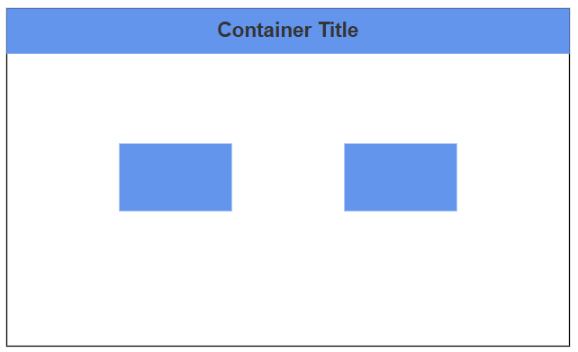
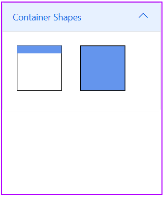
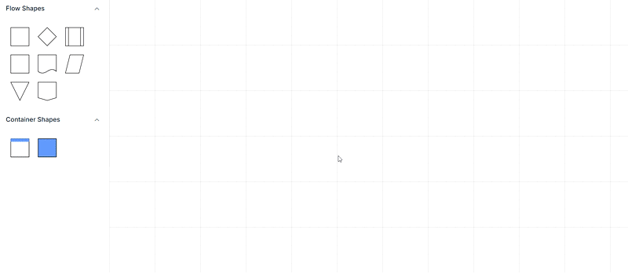
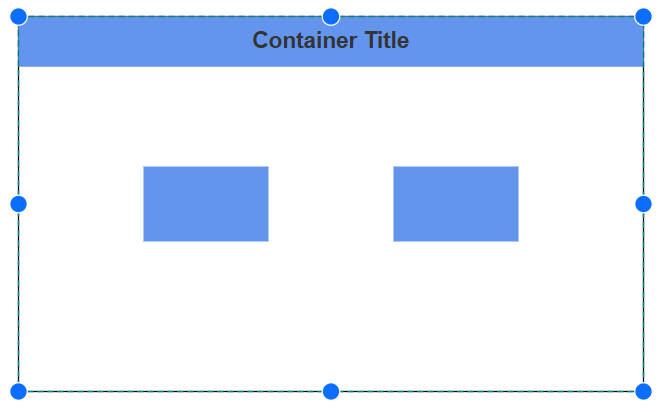
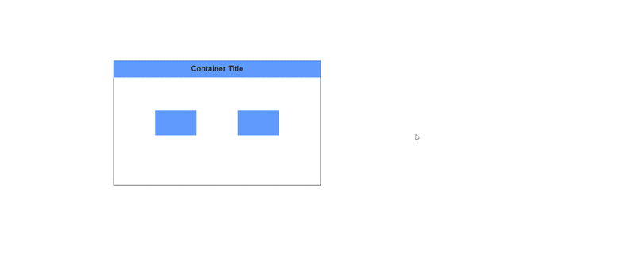

# Container in Blazor Diagram Component

Containers provide a powerful way to organize and manage collections of diagram elements. They act as logical groupings of shapes enclosed by a customizable border, allowing for intuitive drag-and-drop operations during runtime. Changes to the container, such as position, size, or style, do not affect its children. This enhances diagram clarity by maintaining organization while allowing individual elements to be edited separately.

## How to Create a Container
A container can be created and added to the diagram, either programmatically or interactively.

### How to Add a Container

To create a container, you have to define the [Container](https://help.syncfusion.com/cr/blazor/Syncfusion.Blazor.Diagram.Container.html) object and add it to the [Nodes](https://help.syncfusion.com/cr/blazor/Syncfusion.Blazor.Diagram.SfDiagramComponent.html#Syncfusion_Blazor_Diagram_SfDiagramComponent_Nodes) collection of the diagram. The following code illustrates how to create a Container Node.

```cshtml
@using Syncfusion.Blazor.Diagram

<SfDiagramComponent @ref="@diagram" Height="600px" Nodes="@nodes">
</SfDiagramComponent>

@code
{
    public SfDiagramComponent diagram;
    //Initialize the node collection
    DiagramObjectCollection<Node> nodes = new DiagramObjectCollection<Node>();

    protected override void OnInitialized()
    {
        // Create container
        Container container = new Container()
        {
            ID = "container",
            Height = 300, Width = 500, OffsetX = 500, OffsetY = 300,
        };
        nodes.Add(container);
    }
}
```
You can download a complete working sample from [GitHub](https://github.com/SyncfusionExamples/Blazor-Diagram-Examples/tree/master/UG-Samples/Container/ContainerNode).


>**Note:** Container's Id should not start with numbers or special characters and should not contain special characters such as underscore(_) or space.

### How to Add Elements to a Container

To add child elements to a container, define the child nodes and assign their IDs to the container’s [Children](https://help.syncfusion.com/cr/blazor/Syncfusion.Blazor.Diagram.NodeGroup.html#Syncfusion_Blazor_Diagram_NodeGroup_Children) property. When child nodes are added to a container, they become part of its structure while remaining individually editable. The following code illustrates how to create a container with children.

```cshtml
@using Syncfusion.Blazor.Diagram

<SfDiagramComponent @ref="@diagram" Height="600px" Nodes="@nodes">
</SfDiagramComponent>

@code
{
    public SfDiagramComponent diagram;
    //Initialize the node collection
    DiagramObjectCollection<Node> nodes = new DiagramObjectCollection<Node>();

    protected override void OnInitialized()
    {
        Node node1 = new Node()
            {
                ID = "node1",
                Height = 60,
                Width = 100,
                OffsetX = 400,
                OffsetY = 300,
                Annotations = new DiagramObjectCollection<ShapeAnnotation>()
                {
                    new ShapeAnnotation(){ Content = "Process"}
                }
            };
        Node node2 = new Node()
            {
                ID = "node2",
                Height = 60,
                Width = 100,
                OffsetX = 600,
                OffsetY = 300,
                Annotations = new DiagramObjectCollection<ShapeAnnotation>()
                {
                    new ShapeAnnotation(){ Content = "Process"}
                }
            };
        Container container = new Container()
        {
            ID = "container",
            Height = 300, Width = 500, OffsetX = 500, OffsetY = 300,
            Children = new string[] { "node1", "node2" }
        };
        nodes.Add(node1);
        nodes.Add(node2);
        nodes.Add(container);
    }
}
```

You can download a complete working sample from [GitHub](https://github.com/SyncfusionExamples/Blazor-Diagram-Examples/tree/master/UG-Samples/Container/ContainerSample).

### How to Customize Container Header

Containers can include descriptive text to identify their purpose or contents through the [Header](https://help.syncfusion.com/cr/blazor/Syncfusion.Blazor.Diagram.Container.html#Syncfusion_Blazor_Diagram_Container_Header) property. This feature enhances diagram readability by providing clear labels for grouped elements. The header's visual presentation is fully customizable using the [Style](https://help.syncfusion.com/cr/blazor/Syncfusion.Blazor.Diagram.ContainerHeader.html#Syncfusion_Blazor_Diagram_ContainerHeader_Style) property.  

The following code example explains how to define a container header and its customization:

```cshtml
@using Syncfusion.Blazor.Diagram

<SfDiagramComponent @ref="@diagram" Height="600px" Nodes="@nodes">
</SfDiagramComponent>

@code
{
    public SfDiagramComponent diagram;
    //Initialize the node collection
    DiagramObjectCollection<Node> nodes = new DiagramObjectCollection<Node>();

    protected override void OnInitialized()
    {
        Node node1 = new Node()
            {
                ID = "node1",
                Height = 60,
                Width = 100,
                OffsetX = 400,
                OffsetY = 300,
                Style = new ShapeStyle()
                {
                    Fill = "CornflowerBlue",
                }
            };
        Node node2 = new Node()
            {
                ID = "node2",
                Height = 60,
                Width = 100,
                OffsetX = 600,
                OffsetY = 300,
                Style = new ShapeStyle()
                {
                    Fill = "CornflowerBlue",
                }
            };
        Container container = new Container()
            {
                ID = "container",
                Header = new ContainerHeader()
                {
                    ID = "containerHeader",
                    Height = 40,
                    Annotation = new ShapeAnnotation()
                    {
                        Content = "Container Title",
                        Style = new TextStyle() { FontSize = 18, Bold = true, Color = "#343434" }
                    },
                    Style = new TextStyle()
                    {
                        Fill = "CornflowerBlue"
                    }
                },
                Height = 300,
                Width = 500,
                OffsetX = 500,
                OffsetY = 300,
                Children = new string[] { "node1", "node2" }
            };
        nodes.Add(node1);
        nodes.Add(node2);
        nodes.Add(container);
    }
} 
```

You can download a complete working sample from [GitHub](https://github.com/SyncfusionExamples/Blazor-Diagram-Examples/tree/master/UG-Samples/Container/ContainerHeaderSample).



>Note: You can edit the header by double-clicking the region of the container’s header, or by pressing F2.

### How to Add Containers to the Symbol Palette

Container nodes can be predefined and added to the symbol palette, allowing for quick and consistent reuse throughout your diagrams. When needed, you can simply drag these predefined containers from the palette and drop them directly into your diagram. 

The following code example explains how to define a container and add it to the symbol palette:

```cshtml
@using Syncfusion.Blazor.Diagram
@using Syncfusion.Blazor.Diagram.SymbolPalette

<div class="control-section">
    <div style="width:254px;">
        <div id="palette-space" class="sb-mobile-palette" style="border: 2px solid #b200ff">
            <SfSymbolPaletteComponent @ref="@symbolpalette" Height="300px" Width="250px"
                                      Palettes="@Palettes" SymbolHeight="100" SymbolWidth="100" SymbolMargin="@SymbolMargin">
            </SfSymbolPaletteComponent>
        </div>
    </div>
</div>

@code
{
    SfSymbolPaletteComponent symbolpalette;
    //Define symbol margin.
    SymbolMargin SymbolMargin = new SymbolMargin { Left = 15, Right = 15, Top = 15, Bottom = 15 };
    //Define palattes collection.
    DiagramObjectCollection<Palette> Palettes = new DiagramObjectCollection<Palette>();
    // Defines palette's container-shape collection.
    DiagramObjectCollection<NodeBase> ContainerNodes = new DiagramObjectCollection<NodeBase>();

    protected override void OnInitialized()
    {
        InitPaletteModel();
    }

    private void InitPaletteModel()
    {
        Palettes = new DiagramObjectCollection<Palette>();

        ContainerNodes = new DiagramObjectCollection<NodeBase>();

        // Create container with header
        Container container = new Container()
        {
            ID = "containerWithHeader",
            Header = new ContainerHeader()
            {
                ID = "containerHeader",
                Height = 50,
                Annotation = new ShapeAnnotation()
                {
                    Content = "Container Title"
                },
                Style = new TextStyle()
                {
                    Fill = "CornflowerBlue"
                }
            },
            Height = 300,
            Width = 300,
            OffsetX = 100,
            OffsetY = 100,
        };

        // Create container without header.
        Container containerWithoutHeader = new Container()
        {
            ID = "containerWithoutHeader",
            Height = 300,
            Width = 300,
            OffsetX = 100,
            OffsetY = 100,
            Style = new ShapeStyle() { Fill = "CornflowerBlue" }
        };

        ContainerNodes = new DiagramObjectCollection<NodeBase>()
        {
            container,
            containerWithoutHeader,
        };

        Palettes = new DiagramObjectCollection<Palette>()
        {
            new Palette(){Symbols = ContainerNodes, Title="Container Shapes", ID="ContainerShapes" },
        };
      }
}
```
You can download a complete working sample from [GitHub](https://github.com/SyncfusionExamples/Blazor-Diagram-Examples/tree/master/UG-Samples/Container/ContainerPalette).



## How to Interactively Add or Remove Diagram Elements into Container

Diagram elements can be added or removed from a container at runtime. When an element is dropped onto the container's edges, the container automatically adjusts its size to accommodate the new element.



## Interaction

Diagram provides support to select, drag or resize the container interactively. 

### How to Select a Container 
Container can be selected by clicking (tapping) on it. Also, it can be selected at runtime by using the [Select](https://help.syncfusion.com/cr/blazor/Syncfusion.Blazor.Diagram.SfDiagramComponent.html#Syncfusion_Blazor_Diagram_SfDiagramComponent_Select_System_Collections_ObjectModel_ObservableCollection_Syncfusion_Blazor_Diagram_IDiagramObject__System_Nullable_System_Boolean__) method and clear the selection in the diagram by using the [ClearSelection](https://help.syncfusion.com/cr/blazor/Syncfusion.Blazor.Diagram.SfDiagramComponent.html#Syncfusion_Blazor_Diagram_SfDiagramComponent_ClearSelection)



### How to Drag a Container 

* A container can be moved by clicking and dragging it within the diagram.

* When you drag the elements in the diagram, the [PositionChanging](https://help.syncfusion.com/cr/blazor/Syncfusion.Blazor.Diagram.SfDiagramComponent.html#Syncfusion_Blazor_Diagram_SfDiagramComponent_PositionChanging) and [PositionChanged](https://help.syncfusion.com/cr/blazor/Syncfusion.Blazor.Diagram.SfDiagramComponent.html#Syncfusion_Blazor_Diagram_SfDiagramComponent_PositionChanged) events get triggered and we can do customization on those events.


### How to Resize a Container

* A selected container is surrounded by eight resize thumbs. Dragging these thumbs adjusts the container’s size.
* When dragging one corner, the opposite corner remains fixed.
* To maintain the container's aspect ratio during resizing, enable the [AspectRatio](https://help.syncfusion.com/cr/blazor/Syncfusion.Blazor.Diagram.NodeConstraints.html#Syncfusion_Blazor_Diagram_NodeConstraints_AspectRatio) constraint in NodeConstraints.
* A container can be resized either by resizing the selector or the tight bounds of the child object. If the child node moves to the edge of the container, it will be automatically resized.


