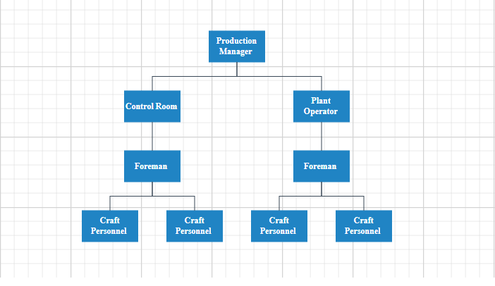

# Data Binding in Diagram Component

* The [Diagram](https://help.syncfusion.com/cr/blazor/Syncfusion.Blazor.Diagram.SfDiagramComponent.html) can be populated with [Nodes](https://help.syncfusion.com/cr/blazor/Syncfusion.Blazor.Diagram.SfDiagramComponent.html#Syncfusion_Blazor_Diagram_SfDiagramComponent_Nodes) and [Connectors](https://help.syncfusion.com/cr/blazor/Syncfusion.Blazor.Diagram.SfDiagramComponent.html#Syncfusion_Blazor_Diagram_SfDiagramComponent_Connectors) from an external data source.

* Diagram exposes data-related properties to specify the data source fields from where the node information has to be retrieved.

* The [DataSource](https://help.syncfusion.com/cr/blazor/Syncfusion.Blazor.Diagram.DataSourceSettings.html#Syncfusion_Blazor_Diagram_DataSourceSettings_DataSource) property specifies the data source either as a collection of objects or as an instance of `DataSource` to populate the diagram.

* The [ID](https://help.syncfusion.com/cr/blazor/Syncfusion.Blazor.Diagram.DataSourceSettings.html#Syncfusion_Blazor_Diagram_DataSourceSettings_ID) property defines the unique identifier field for each data item.

* The [ParentID](https://help.syncfusion.com/cr/blazor/Syncfusion.Blazor.Diagram.DataSourceSettings.html#Syncfusion_Blazor_Diagram_DataSourceSettings_ParentID) property defines the parent field which builds the relationship between ID and parent field.

* The [Root](https://help.syncfusion.com/cr/blazor/Syncfusion.Blazor.Diagram.DataSourceSettings.html#Syncfusion_Blazor_Diagram_DataSourceSettings_Root) property is used to define the root node for diagrams populated from a data source.

* To explore those properties, see [DataSourceSettings](https://help.syncfusion.com/cr/blazor/Syncfusion.Blazor.Diagram.DataSourceSettings.html).

* Diagram supports two types of data binding:

    1. Local data
    2. Remote data

## How to Specify Parent Child Relationship in Data Source

The [ID](https://help.syncfusion.com/cr/blazor/Syncfusion.Blazor.Diagram.DataSourceSettings.html#Syncfusion_Blazor_Diagram_DataSourceSettings_ID) and [ParentID](https://help.syncfusion.com/cr/blazor/Syncfusion.Blazor.Diagram.DataSourceSettings.html#Syncfusion_Blazor_Diagram_DataSourceSettings_ParentID) properties are string in `DataSourceSettings`. When creating a parent-child relationship, it's essential to ensure that at least one node has an empty `ParentID`. This node will act as the root or parent node, with other nodes linked as its children. For example, let's consider the data source settings. Within the `DataSource`, we have defined three specific details. The `DataModel` class has attributes such as `ID`, `ParentID`, and various other details. In this scenario, the initial dataset does not have a parent ID, which means we have set it as empty. This node acts as the parent or root node of the layout. Subsequent datasets, however, do contain a `ParentID`. Below is a code example illustrating this:

```csharp
@using Syncfusion.Blazor.Diagram

<SfDiagramComponent Height="600px" Nodes="@nodes" Connectors="@connectors" NodeCreating="@OnNodeCreating" ConnectorCreating="@OnConnectorCreating">
    <DataSourceSettings ID="Id" ParentID="ParentId" DataSource="DataSource"> </DataSourceSettings>
    <Layout Type="LayoutType.HierarchicalTree" HorizontalSpacing="@HorizontalSpacing" VerticalSpacing="@VerticalSpacing">
    </Layout>
    <SnapSettings>
        <HorizontalGridLines LineColor="white" LineDashArray="2,2">
        </HorizontalGridLines>
        <VerticalGridLines LineColor="white" LineDashArray="2,2">
        </VerticalGridLines>
    </SnapSettings>
</SfDiagramComponent>

@code
{
    private int left = 40;
    private int top = 50;
    private DiagramObjectCollection<Node> nodes = new DiagramObjectCollection<Node>();
    private DiagramObjectCollection<Connector> connectors = new DiagramObjectCollection<Connector>();
    private int HorizontalSpacing = 40;
    private int VerticalSpacing = 40;

    private void OnNodeCreating(IDiagramObject obj)
    {
        Node node = obj as Node;
        node.Height = 40;
        node.Width = 100;
        //Initializing the default node's shape style.
        node.Style = new ShapeStyle() { Fill = "darkcyan", StrokeWidth = 3, StrokeColor = "Black" };
    }

    private void OnConnectorCreating(IDiagramObject connector)
    {
        (connector as Connector).Type = ConnectorSegmentType.Orthogonal;
    }

    private class HierarchicalDetails
    {
        public string Id { get; set; }
        public string Role { get; set; }
        public string ParentId { get; set; }
        public string ChartType { get; set; }
        public string Color { get; set; }
    }

    private List<HierarchicalDetails> DataSource = new List<HierarchicalDetails>()
    {
        new HierarchicalDetails()   { Id= "parent", Role= "Board", Color= "#71AF17" },
        new HierarchicalDetails()   { Id= "1", Role= "General Manager", ParentId= "parent", ChartType= "right", Color= "#71AF17" },
        new HierarchicalDetails()   { Id= "11", Role= "Assistant Manager", ParentId= "1", Color= "#71AF17" },
    };
}
```


A complete working sample can be downloaded from [GitHub](https://github.com/SyncfusionExamples/Blazor-Diagram-Examples/tree/master/UG-Samples/DataBinding/Parent-Child%20Relationship)

## How to Bind Local Data to the Diagram

Diagram can be populated from user defined JSON data (local data) by mapping the relevant data source fields.

To map the user defined JSON data with diagram, configure the fields of `DataSourceSettings`. The following code example illustrates how to bind local data with the diagram.

```cshtml
@using Syncfusion.Blazor.Diagram

<SfDiagramComponent @ref="@Diagram"
                    Height="499px"
                    InteractionController="DiagramInteractions.ZoomPan"
                    ConnectorCreating="@ConnectorDefaults"
                    NodeCreating="@NodeDefaults">
    <DataSourceSettings ID="Name" ParentID="Category" DataSource="DataSource" />
    <Layout @bind-Type="type"
            @bind-HorizontalSpacing="@HorizontalSpacing"
            @bind-Orientation="@orientation"
            @bind-VerticalSpacing="@VerticalSpacing"
            @bind-HorizontalAlignment="@horizontalAlignment"
            @bind-VerticalAlignment="@verticalAlignment"
            GetLayoutInfo="GetLayoutInfo">
        <LayoutMargin Top="50" Bottom="50" Right="50" Left="50" />
    </Layout>
</SfDiagramComponent>

@code
{
    private SfDiagramComponent Diagram;
    // Specify the layout type.
    private LayoutType type = LayoutType.HierarchicalTree;
    // Specify the orientation of the layout.
    private LayoutOrientation orientation = LayoutOrientation.TopToBottom;
    private HorizontalAlignment horizontalAlignment = HorizontalAlignment.Auto;
    private VerticalAlignment verticalAlignment = VerticalAlignment.Auto;
    private int HorizontalSpacing = 30;
    private int VerticalSpacing = 30;

    // Defines the connector's default values.
    private void ConnectorDefaults(IDiagramObject connector)
    {
        (connector as Connector).Type = ConnectorSegmentType.Orthogonal;
        (connector as Connector).TargetDecorator.Shape = DecoratorShape.None;
        (connector as Connector).Style = new ShapeStyle() { StrokeColor = "#6d6d6d" };
        (connector as Connector).Constraints = 0;
        (connector as Connector).CornerRadius = 5;
    }

    // Create the layout info.
    private TreeInfo GetLayoutInfo(IDiagramObject obj, TreeInfo options)
    {
        // Enable the sub-tree.
        options.EnableSubTree = true;
        // Specify the subtree orientation.
        options.Orientation = Orientation.Horizontal;
        return options;
    }

    // Defines the node's default values.
    private void NodeDefaults(IDiagramObject obj)
    {
        Node node = obj as Node;
        if (node.Data is System.Text.Json.JsonElement)
        {
            node.Data = System.Text.Json.JsonSerializer.Deserialize<HierarchicalDetails>(node.Data.ToString());
        }
        HierarchicalDetails hierarchicalData = node.Data as HierarchicalDetails;
        node.Style = new ShapeStyle() { Fill = "#659be5", StrokeColor = "none", StrokeWidth = 2, };
        node.BackgroundColor = "#659be5";
        node.Width = 150;
        node.Height = 50;
        node.Annotations = new DiagramObjectCollection<ShapeAnnotation>()
        {
            new ShapeAnnotation()
            {
                Content = hierarchicalData.Name,
                Style =new TextStyle(){Color = "white"}
            }
        };
    }

    // Create the hierarchical details with needed properties.
    private class HierarchicalDetails
    {
        public string Name { get; set; }
        public string FillColor { get; set; }
        public string Category { get; set; }
    }

    // Create the data source with node name and fill color values.
    private List<HierarchicalDetails> DataSource = new List<HierarchicalDetails>()
    {
        new HierarchicalDetails(){ Name ="Diagram", Category="",FillColor="#659be5"},
        new HierarchicalDetails(){ Name ="Layout", Category="Diagram",FillColor="#659be5"},
        new HierarchicalDetails(){ Name ="Tree layout", Category="Layout",FillColor="#659be5"},
        new HierarchicalDetails(){ Name ="Organizational chart", Category="Layout",FillColor="#659be5"},
        new HierarchicalDetails(){ Name ="Hierarchical tree", Category="Tree layout",FillColor="#659be5"},
        new HierarchicalDetails(){ Name ="Radial tree", Category="Tree layout",FillColor="#659be5"},
        new HierarchicalDetails(){ Name ="Mind map", Category="Hierarchical tree",FillColor="#659be5"},
        new HierarchicalDetails(){ Name ="Family tree", Category="Hierarchical tree",FillColor="#659be5"},
        new HierarchicalDetails(){ Name ="Management", Category="Organizational chart",FillColor="#659be5"},
        new HierarchicalDetails(){ Name ="Human resources", Category="Management",FillColor="#659be5"},
        new HierarchicalDetails(){ Name ="University", Category="Management",FillColor="#659be5"},
        new HierarchicalDetails(){ Name ="Business", Category="#Management",FillColor="#659be5"}
    };
}
```


A complete working sample can be downloaded from [GitHub](https://github.com/SyncfusionExamples/Blazor-Diagram-Examples/tree/master/UG-Samples/DataBinding/LocalData)

## How to Bind ExpandoObject Data to the Diagram

Diagram is a generic component which is strongly bound to a model type. There are cases when the model type is unknown during compile time. In such circumstances data can be bound to the Diagram as a list of **ExpandoObjects**. 
Diagram can also perform all kind of supported Layout operations in ExpandoObjects such as,
* Hierarchical layout
* Organization chart
* Mind Map layout
* Complex Hierarchical Tree layout
* Radial Tree Layout

The **ExpandoObject** can be bound to Diagram by assigning to the [DataSource] property of the [DataSourceSettings](https://help.syncfusion.com/cr/blazor/Syncfusion.Blazor.Diagram.DataSourceSettings.html).
The following code example illustrates how to bind ExpandoObject data with the diagram.


```cshtml
@using Syncfusion.Blazor.Diagram

<SfDiagramComponent @ref="@Diagram" Height="499px" InteractionController="DiagramInteractions.ZoomPan"
                    ConnectorCreating="@ConnectorDefaults" NodeCreating="@NodeDefaults">
    <DataSourceSettings ID="Name" ParentID="Category" DataSource="DataSource" />
    <Layout @bind-Type="type" @bind-HorizontalSpacing="@HorizontalSpacing" @bind-Orientation="@orientation"
            @bind-VerticalSpacing="@VerticalSpacing" @bind-HorizontalAlignment="@horizontalAlignment"
            @bind-VerticalAlignment="@verticalAlignment" GetLayoutInfo="GetLayoutInfo">
        <LayoutMargin Top="50" Bottom="50" Right="50" Left="50" />
    </Layout>
</SfDiagramComponent>

@code
{
    private SfDiagramComponent Diagram;
    // Specify the layout type.
    private LayoutType type = LayoutType.HierarchicalTree;
    // Specify the orientation of the layout.
    private LayoutOrientation orientation = LayoutOrientation.TopToBottom;
    private HorizontalAlignment horizontalAlignment = HorizontalAlignment.Auto;
    private VerticalAlignment verticalAlignment = VerticalAlignment.Auto;
    private int HorizontalSpacing = 30;
    private int VerticalSpacing = 30;
    private List<ExpandoObject> DataSource { get; set; }
    private List<ExpandoObject> ExpandoData = new List<ExpandoObject>();

    public class ExpandoObject
    {
        public string Name { get; set; }
        public string Category { get; set; }
        public string FillColor { get; set; }
    }

    // Defines the connector's default values.
    private void ConnectorDefaults(IDiagramObject connector)
    {
        (connector as Connector).Type = ConnectorSegmentType.Orthogonal;
        (connector as Connector).TargetDecorator.Shape = DecoratorShape.None;
        (connector as Connector).Style = new ShapeStyle() { StrokeColor = "#6d6d6d" };
        (connector as Connector).Constraints = 0;
        (connector as Connector).CornerRadius = 5;
    }

    // Create the layout info.
    private TreeInfo GetLayoutInfo(IDiagramObject obj, TreeInfo options)
    {
        // Enable the sub-tree.
        options.EnableSubTree = true;
        // Specify the subtree orientation.
        options.Orientation = Orientation.Horizontal;
        return options;
    }

    // Defines the node's default values.
    private void NodeDefaults(IDiagramObject obj)
    {
        Node node = obj as Node;
        if (node.Data is System.Text.Json.JsonElement)
        {
            node.Data = System.Text.Json.JsonSerializer.Deserialize<ExpandoObject>(node.Data.ToString());
        }
        dynamic hierarchicalData = node.Data as ExpandoObject;
        node.Style = new ShapeStyle() { Fill = "#659be5", StrokeColor = "none", StrokeWidth = 2, };
        node.BackgroundColor = "#659be5";
        node.Width = 150;
        node.Height = 50;
        node.Annotations = new DiagramObjectCollection<ShapeAnnotation>()
        {
            new ShapeAnnotation()
            {
                Content = hierarchicalData.Name,
                Style =new TextStyle(){Color = "white"}
            }
        };
    }

    protected override void OnInitialized()
    {
        this.DataSource = GetData();
    }

    private List<ExpandoObject> GetData()
    {
        ExpandoData.Clear();
        dynamic Member1 = new ExpandoObject();

        Member1.Name = "Diagram";
        Member1.Category = "";
        Member1.FillColor = "#71AF17";
        ExpandoData.Add(Member1);

        dynamic Member2 = new ExpandoObject();

        Member2.Name = "Layout";
        Member2.Category = "Diagram";
        Member2.FillColor = "#659be5";
        ExpandoData.Add(Member2);

        dynamic Member3 = new ExpandoObject();

        Member3.Name = "Tree layout";
        Member3.Category = "Layout";
        Member3.FillColor = "#659be5";
        ExpandoData.Add(Member3);

        dynamic Member7 = new ExpandoObject();

        Member7.Name = "Organizational chart";
        Member7.Category = "Layout";
        Member7.FillColor = "#659be5";
        ExpandoData.Add(Member7);

        dynamic Member8 = new ExpandoObject();

        Member8.Name = "Hierarchical tree";
        Member8.Category = "Tree layout";
        Member8.FillColor = "#659be5";
        ExpandoData.Add(Member8);

        dynamic Member14 = new ExpandoObject();

        Member14.Name = "Radial tree";
        Member14.Category = "Tree layout";
        Member14.FillColor = "#659be5";
        ExpandoData.Add(Member14);

        dynamic Member9 = new ExpandoObject();

        Member9.Name = "Mind map";
        Member9.Category = "Hierarchical tree";
        Member9.FillColor = "#659be5";
        ExpandoData.Add(Member9);

        dynamic Member10 = new ExpandoObject();

        Member10.Name = "Family tree";
        Member10.Category = "Hierarchical tree";
        Member10.FillColor = "#659be5";
        ExpandoData.Add(Member10);

        dynamic Member4 = new ExpandoObject();

        Member4.Name = "Management";
        Member4.Category = "Organizational chart";
        Member4.FillColor = "#659be5";
        ExpandoData.Add(Member4);

        dynamic Member11 = new ExpandoObject();

        Member11.Name = "Human resources";
        Member11.Category = "Management";
        Member11.FillColor = "#659be5";
        ExpandoData.Add(Member11);

        dynamic Member12 = new ExpandoObject();

        Member12.Name = "University";
        Member12.Category = "Management";
        Member12.FillColor = "#659be5";
        ExpandoData.Add(Member12);

        return ExpandoData;
    }
}
```


A complete working sample can be downloaded from [GitHub](https://github.com/SyncfusionExamples/Blazor-Diagram-Examples/tree/master/UG-Samples/DataBinding/ExpandoObject)

##  How to Bind DynamicObject Data to the Diagram

Diagram is a generic component that is strongly bound to a model type. There are cases when the model type is unknown during compile time. In such circumstances data can be bound to the Diagram as a list of **DynamicObject**.
Diagram can also perform all kind of supported Layout operations in DynamicObject such as,
* Hierarchical layout
* Organization chart
* Mind Map layout
* Complex Hierarchical Tree layout
* Radial Tree layout

 The **DynamicObject** can be bound to the Diagram by assigning it to the [DataSource] property of the [DataSourceSettings](https://help.syncfusion.com/cr/blazor/Syncfusion.Blazor.Diagram.DataSourceSettings.html).
The following code example illustrates how to bind DynamicObject data with the diagram.

```cshtml
@using Syncfusion.Blazor.Diagram
@using System.Dynamic

<SfDiagramComponent @ref="@Diagram" Height="499px" InteractionController="DiagramInteractions.ZoomPan"
                    ConnectorCreating="@ConnectorDefaults" NodeCreating="@NodeDefaults">
    <DataSourceSettings ID="Name" ParentID="Category" DataSource="DataSource" />
    <Layout @bind-Type="type" @bind-HorizontalSpacing="@HorizontalSpacing" @bind-Orientation="@orientation"
            @bind-VerticalSpacing="@VerticalSpacing" @bind-HorizontalAlignment="@horizontalAlignment"
            @bind-VerticalAlignment="@verticalAlignment" GetLayoutInfo="GetLayoutInfo">
        <LayoutMargin Top="50" Bottom="50" Right="50" Left="50" />
    </Layout>
</SfDiagramComponent>

@code
{
    private SfDiagramComponent Diagram;
    // Specify the layout type.
    private LayoutType type = LayoutType.HierarchicalTree;
    // Specify the orientation of the layout.
    private LayoutOrientation orientation = LayoutOrientation.TopToBottom;
    private HorizontalAlignment horizontalAlignment = HorizontalAlignment.Auto;
    private VerticalAlignment verticalAlignment = VerticalAlignment.Auto;
    private int HorizontalSpacing = 30;
    private int VerticalSpacing = 30;
    private List<HierarchicalDetails> DataSource { get; set; }
    private List<HierarchicalDetails> ExpandoData = new List<HierarchicalDetails>();

    // Defines the connector's default values.
    private void ConnectorDefaults(IDiagramObject connector)
    {
        (connector as Connector).Type = ConnectorSegmentType.Orthogonal;
        (connector as Connector).TargetDecorator.Shape = DecoratorShape.None;
        (connector as Connector).Style = new ShapeStyle() { StrokeColor = "#6d6d6d" };
        (connector as Connector).Constraints = 0;
        (connector as Connector).CornerRadius = 5;
    }

    // Create the layout info.
    private TreeInfo GetLayoutInfo(IDiagramObject obj, TreeInfo options)
    {
        // Enable the sub-tree.
        options.EnableSubTree = true;
        // Specify the subtree orientation.
        options.Orientation = Orientation.Horizontal;
        return options;
    }

    // Defines the node's default values.
    private void NodeDefaults(IDiagramObject obj)
    {
        Node node = obj as Node;
        if (node.Data is System.Text.Json.JsonElement)
        {
            node.Data = System.Text.Json.JsonSerializer.Deserialize<HierarchicalDetails>(node.Data.ToString());
        }
        dynamic hierarchicalData = node.Data as HierarchicalDetails;
        node.Style = new ShapeStyle() { Fill = "#659be5", StrokeColor = "none", StrokeWidth = 2, };
        node.BackgroundColor = "#659be5";
        node.Width = 150;
        node.Height = 50;
        node.Annotations = new DiagramObjectCollection<ShapeAnnotation>()
        {
            new ShapeAnnotation()
            {
                Content = hierarchicalData.Name,
                Style =new TextStyle(){Color = "white"}
            }
        };
    }

    public class HierarchicalDetails : DynamicObject
    {
        Dictionary<string, object> dictionary = new Dictionary<string, object>();

        public override bool TryGetMember(GetMemberBinder binder, out object result)
        {
            string name = binder.Name;
            return dictionary.TryGetValue(name, out result);
        }

        public override bool TrySetMember(SetMemberBinder binder, object value)
        {
            dictionary[binder.Name] = value;
            return true;
        }

        public override System.Collections.Generic.IEnumerable<string> GetDynamicMemberNames()
        {
            return this.dictionary?.Keys;
        }
    }

    protected override void OnInitialized()
    {
        this.DataSource = GetData();
    }

    private List<HierarchicalDetails> GetData()
    {
        ExpandoData.Clear();

        dynamic Member1 = new HierarchicalDetails();
        Member1.Name = "Diagram";
        Member1.Category = "";
        Member1.FillColor = "#71AF17";
        ExpandoData.Add(Member1);

        dynamic Member2 = new HierarchicalDetails();
        Member2.Name = "Layout";
        Member2.Category = "Diagram";
        Member2.FillColor = "#659be5";
        ExpandoData.Add(Member2);

        dynamic Member3 = new HierarchicalDetails();
        Member3.Name = "Tree layout";
        Member3.Category = "Layout";
        Member3.FillColor = "#659be5";
        ExpandoData.Add(Member3);

        dynamic Member7 = new HierarchicalDetails();

        Member7.Name = "Organizational chart";
        Member7.Category = "Layout";
        Member7.FillColor = "#659be5";
        ExpandoData.Add(Member7);

        dynamic Member8 = new HierarchicalDetails();
        Member8.Name = "Hierarchical tree";
        Member8.Category = "Tree layout";
        Member8.FillColor = "#659be5";
        ExpandoData.Add(Member8);

        dynamic Member14 = new HierarchicalDetails();
        Member14.Name = "Radial tree";
        Member14.Category = "Tree layout";
        Member14.FillColor = "#659be5";
        ExpandoData.Add(Member14);

        dynamic Member9 = new HierarchicalDetails();
        Member9.Name = "Mind map";
        Member9.Category = "Hierarchical tree";
        Member9.FillColor = "#659be5";
        ExpandoData.Add(Member9);

        dynamic Member10 = new HierarchicalDetails();
        Member10.Name = "Family tree";
        Member10.Category = "Hierarchical tree";
        Member10.FillColor = "#659be5";
        ExpandoData.Add(Member10);

        dynamic Member4 = new HierarchicalDetails();
        Member4.Name = "Management";
        Member4.Category = "Organizational chart";
        Member4.FillColor = "#659be5";
        ExpandoData.Add(Member4);

        dynamic Member11 = new HierarchicalDetails();
        Member11.Name = "Human resources";
        Member11.Category = "Management";
        Member11.FillColor = "#659be5";
        ExpandoData.Add(Member11);

        dynamic Member12 = new HierarchicalDetails();
        Member12.Name = "University";
        Member12.Category = "Management";
        Member12.FillColor = "#659be5";
        ExpandoData.Add(Member12);

        return ExpandoData;
    }
}
```


A complete working sample can be downloaded from [GitHub](https://github.com/SyncfusionExamples/Blazor-Diagram-Examples/tree/master/UG-Samples/DataBinding/DynamicObj)

## How to Bind JSON Data to the Diagram

Local JSON data can be bound to the Diagram by assigning the array of objects to the Json property of the `SfDataManager` component.

The following sample code demonstrates binding local data through SfDataManager to the Diagram component,

```cshtml
@using Syncfusion.Blazor.Diagram
@using Syncfusion.Blazor.Data

<SfDiagramComponent @ref="Diagram" Width="1000px" Height="500px" NodeCreating="NodeDefaults" SetNodeTemplate="SetTemplate">
    <DataSourceSettings ID="Name" ParentID="Category">
        <SfDataManager Json="DataSource" Adaptor="Syncfusion.Blazor.Adaptors.JsonAdaptor"></SfDataManager>
    </DataSourceSettings>
    <Layout HorizontalSpacing="40" VerticalSpacing="40" Type="LayoutType.HierarchicalTree"></Layout>
</SfDiagramComponent>

@code
{
    private SfDiagramComponent Diagram;
    private float x = 100;
    private float y = 100;
    private Query Query = new Query().Select(new List<string>() { "EmployeeID", "ReportsTo", "FirstName" }).Take(9);

    // Create the hierarchical details with needed properties.
    private class HierarchicalDetails
    {
        public string Name { get; set; }
        public string FillColor { get; set; }
        public string Category { get; set; }
    }

    // Create the data source with node name and fill color values.
    private HierarchicalDetails[] DataSource = new HierarchicalDetails[]
    {
        new HierarchicalDetails(){ Name ="Diagram", Category="",FillColor="#659be5"},
        new HierarchicalDetails(){ Name ="Layout", Category="Diagram",FillColor="#659be5"},
        new HierarchicalDetails(){ Name ="Organizational chart", Category="Diagram",FillColor="#659be5"},
        new HierarchicalDetails(){ Name ="Tree layout", Category="Layout",FillColor="#659be5"},
        new HierarchicalDetails(){ Name ="Hierarchical tree", Category="Tree layout",FillColor="#659be5"},
    };

    // Defines the node's default values.
    private void NodeDefaults(IDiagramObject obj)
    {
        Node node = obj as Node;
        node.OffsetX = x;
        node.OffsetY = y;
        x += 100;
        HierarchicalDetails hierarchicalData = node.Data as HierarchicalDetails;
        node.Style.Fill = hierarchicalData.FillColor;
        node.Annotations = new DiagramObjectCollection<ShapeAnnotation>()
        {
            new ShapeAnnotation()
            {
                Content = hierarchicalData.Name
            }
        };
    }

    private CommonElement SetTemplate(IDiagramObject node)
    {
        return null;
    }
}
```


A complete working sample can be downloaded from [GitHub](https://github.com/SyncfusionExamples/Blazor-Diagram-Examples/tree/master/UG-Samples/DataBinding/JSONData)

## How to Bind Remote Data to the Diagram

To bind remote data to the [Diagram component](https://help.syncfusion.com/cr/blazor/Syncfusion.Blazor.Diagram.SfDiagramComponent.html), assign service data as an instance of [SfDataManager](https://help.syncfusion.com/cr/blazor/Syncfusion.Blazor.Data.SfDataManager.html) to the [DataSource](https://help.syncfusion.com/cr/blazor/Syncfusion.Blazor.Diagram.DataSourceSettings.html#Syncfusion_Blazor_Diagram_DataSourceSettings_DataSource) property or use the SfDataManager component. To interact with a remote data source, provide the endpoint Url.

When using `SfDataManager` for data binding, the TValue must be provided explicitly in the diagram component. By default, `SfDataManager` uses `ODataAdaptor` for remote data-binding.

### How to Bind OData Services

OData (Open Data Protocol) is a standardized protocol for building and consuming RESTful APIs. It enables the creation and consumption of queryable and interoperable REST APIs in a simple and standard way. OData services expose data as resources that are addressable by URLs and can be queried using standard HTTP methods (GET, POST, PUT, DELETE). For more details on OData services, refer to the [OData documentation](https://www.odata.org/documentation/odata-version-3-0/odata-version-3-0-core-protocol/). To bind an OData service, use the ODataAdaptor.

```cshtml
@using Syncfusion.Blazor.Diagram
@using Syncfusion.Blazor.Data
@inject HttpClient Http

<div id="diagram-space" class="content-wrapper">
    <SfDiagramComponent Height="400px" NodeCreating="OnNodeCreating" ConnectorCreating="OnConnectorCreating">
        <DataSourceSettings Id="EmployeeID" ParentId="ReportsTo">
            <SfDataManager Url="https://blazor.syncfusion.com/services/production/odata/DiagramOData" Adaptor="Syncfusion.Blazor.Adaptors.ODataV4Adaptor">
            </SfDataManager>
        </DataSourceSettings>
        <SnapSettings Constraints="SnapConstraints.None"></SnapSettings>
        <Layout HorizontalSpacing="100" VerticalSpacing="100" Type="LayoutType.HierarchicalTree"></Layout>
    </SfDiagramComponent>
</div>

@code
{
    private SfDiagramComponent Diagrams;
    private float x = 100;
    private float y = 100;

    private class Employee
    {
        public int? EmployeeID { get; set; }
        public string FirstName { get; set; }
        public int? ReportsTo { get; set; }
    }

    private Query Query = new Query().Select(new List<string>() { "EmployeeID", "ReportsTo", "FirstName" }).Take(9);

    private void OnNodeCreating(IDiagramObject obj)
    {
        Node node = obj as Node;
        node.OffsetX = x;
        node.OffsetY = y;
        node.Width = 80;
        node.Height = 40;
        node.Shape = new BasicShape() { Type = Syncfusion.Blazor.Diagram.NodeShapes.Basic, Shape = NodeBasicShapes.Rectangle, CornerRadius = 8 };
        node.Style = new ShapeStyle() { StrokeWidth = 0, Fill = "" };
        x += 100;
        Dictionary<string, object> data = node.Data as Dictionary<string, object>;
        node.Annotations = new DiagramObjectCollection<ShapeAnnotation>()
        {
            new ShapeAnnotation()
            {
                Content = data["FirstName"].ToString(),
                Style = new TextStyle() { Color = "white" }
            }
        };

        switch (data["FirstName"].ToString())
        {
            case "Andrew":
                node.Style.Fill = "#3A4857";
                break;
            case "Nancy":
                node.Style.Fill = "#2B8C68";
                break;
            case "Janet":
                node.Style.Fill = "#488CC1";
                break;
            case "Margaret":
                node.Style.Fill = "#4C888F";
                break;
            case "Steven":
                node.Style.Fill = "#8E4DB4";
                break;
            case "Laura":
                node.Style.Fill = "#CD6A32";
                break;
            default:
                node.Style.Fill = "#8E4DB4";
                break;
        }
    }

    private void OnConnectorCreating(IDiagramObject obj)
    {
        Connector connector = obj as Connector;
        connector.Style.StrokeColor = "#048785";
        connector.Type = ConnectorSegmentType.Orthogonal;
        connector.TargetDecorator.Shape = DecoratorShape.None;
        connector.SourceDecorator.Shape = DecoratorShape.None;
        connector.Style = new ShapeStyle() { StrokeColor = "#3A4857", Fill = "#3A4857", StrokeWidth = 1, StrokeDashArray = "3,3" };
    }
}
```


A complete working sample can be downloaded from [GitHub](https://github.com/SyncfusionExamples/Blazor-Diagram-Examples/tree/master/UG-Samples/DataBinding/RemoteData/ODataAdaptor)

### How to Bind OData V4 Services

OData V4 is an updated version of the OData protocols, and the `SfDataManager` can also retrieve and consume OData v4 services. For more details on OData v4 services, refer to the [OData documentation](http://docs.oasis-open.org/odata/odata/v4.0/errata03/os/complete/part1-protocol/odata-v4.0-errata03-os-part1-protocol-complete.html#_Toc453752197). To bind an OData v4 service, use the OData V4 adaptor.

```cshtml
@using Syncfusion.Blazor.Diagram
@using Syncfusion.Blazor.Data
@inject HttpClient Http

<div id="diagram-space" class="content-wrapper">
    <SfDiagramComponent Height="400px" NodeCreating="OnNodeCreating" ConnectorCreating="OnConnectorCreating">
        <DataSourceSettings Id="EmployeeID" ParentId="ReportsTo">
            <SfDataManager Url="https://blazor.syncfusion.com/services/production/odata/DiagramODataV4" Adaptor="Syncfusion.Blazor.Adaptors.ODataV4Adaptor">
            </SfDataManager>
        </DataSourceSettings>
        <SnapSettings Constraints="SnapConstraints.None"></SnapSettings>
        <Layout HorizontalSpacing="100" VerticalSpacing="100" Type="LayoutType.HierarchicalTree"></Layout>
    </SfDiagramComponent>
</div>

@code
{
    private SfDiagramComponent Diagrams;
    private float x = 100;
    private float y = 100;

    private class Employee
    {
        public int? EmployeeID { get; set; }
        public string FirstName { get; set; }
        public int? ReportsTo { get; set; }
    }

    private Query Query = new Query().Select(new List<string>() { "EmployeeID", "ReportsTo", "FirstName" }).Take(9);

    private void OnNodeCreating(IDiagramObject obj)
    {
        Node node = obj as Node;
        node.OffsetX = x;
        node.OffsetY = y;
        node.Width = 80;
        node.Height = 40;
        node.Shape = new BasicShape() { Type = Syncfusion.Blazor.Diagram.NodeShapes.Basic, Shape = NodeBasicShapes.Rectangle, CornerRadius = 8 };
        node.Style = new ShapeStyle() { StrokeWidth = 0, Fill = "" };
        x += 100;
        Dictionary<string, object> data = node.Data as Dictionary<string, object>;
        node.Annotations = new DiagramObjectCollection<ShapeAnnotation>()
        {
            new ShapeAnnotation() 
            {
                Content = data["FirstName"].ToString(),
                Style = new TextStyle() { Color = "white" }
            }
        };

        switch (data["FirstName"].ToString())
        {
            case "Andrew":
                node.Style.Fill = "#3A4857";
                break;
            case "Nancy":
                node.Style.Fill = "#2B8C68";
                break;
            case "Janet":
                node.Style.Fill = "#488CC1";
                break;
            case "Margaret":
                node.Style.Fill = "#4C888F";
                break;
            case "Steven":
                node.Style.Fill = "#8E4DB4";
                break;
            case "Laura":
                node.Style.Fill = "#CD6A32";
                break;
            default:
                node.Style.Fill = "#8E4DB4";
                break;
        }
    }

    private void OnConnectorCreating(IDiagramObject obj)
    {
        Connector connector = obj as Connector;
        connector.Style.StrokeColor = "#048785";
        connector.Type = ConnectorSegmentType.Orthogonal;
        connector.TargetDecorator.Shape = DecoratorShape.None;
        connector.SourceDecorator.Shape = DecoratorShape.None;
        connector.Style = new ShapeStyle() { StrokeColor = "#3A4857", Fill = "#3A4857", StrokeWidth = 1, StrokeDashArray = "3,3" };
    }
}
```


A complete working sample can be downloaded from [GitHub](https://github.com/SyncfusionExamples/Blazor-Diagram-Examples/tree/master/UG-Samples/DataBinding/RemoteData/ODataV4Adaptor)

### How to Bind Web API Services to the Diagram

Use the `WebApiAdaptor` to interact with Web APIs created with OData endpoints. The `WebApiAdaptor` is extended from the `ODataAdaptor`. Therefore, to use the `WebApiAdaptor`, the endpoint must understand the OData formatted queries sent with the request.

To enable OData query option for a Web API, refer to this [documentation](https://learn.microsoft.com/en-us/aspnet/web-api/overview/odata-support-in-aspnet-web-api/supporting-odata-query-options).

The following sample code demonstrates how to bind remote data to the Diagram component through the [SfDataManager](https://help.syncfusion.com/cr/blazor/Syncfusion.Blazor.Data.SfDataManager.html) using a Web API service,

```cshtml
@using Syncfusion.Blazor.Diagram
@using Syncfusion.Blazor.Data
@inject HttpClient Http

<div id="diagram-space" class="content-wrapper">
    <SfDiagramComponent Height="400px" NodeCreating="OnNodeCreating" ConnectorCreating="OnConnectorCreating">
        <DataSourceSettings Id="EmployeeID" ParentId="ReportsTo">
            <SfDataManager Url="https://blazor.syncfusion.com/services/production/api/EmployeeDetails" Adaptor="Syncfusion.Blazor.Adaptors.WebApiAdaptor">
            </SfDataManager>
        </DataSourceSettings>
        <SnapSettings Constraints="SnapConstraints.None"></SnapSettings>
        <Layout HorizontalSpacing="100" VerticalSpacing="100" Type="LayoutType.HierarchicalTree"></Layout>
    </SfDiagramComponent>
</div>

@code
{
    private SfDiagramComponent Diagrams;
    private float x = 100;
    private float y = 100;

    private class Employee
    {
        public int? EmployeeID { get; set; }
        public string FirstName { get; set; }
        public int? ReportsTo { get; set; }
    }

    private Query Query = new Query().Select(new List<string>() { "EmployeeID", "ReportsTo", "FirstName" }).Take(9);

    private void OnNodeCreating(IDiagramObject obj)
    {
        Node node = obj as Node;
        node.OffsetX = x;
        node.OffsetY = y;
        node.Width = 80;
        node.Height = 40;
        node.Shape = new BasicShape() { Type = Syncfusion.Blazor.Diagram.NodeShapes.Basic, Shape = NodeBasicShapes.Rectangle, CornerRadius = 8 };
        node.Style = new ShapeStyle() { StrokeWidth = 0, Fill = "" };
        x += 100;
        Dictionary<string, object> data = node.Data as Dictionary<string, object>;
        node.Annotations = new DiagramObjectCollection<ShapeAnnotation>()
        {
            new ShapeAnnotation()
            {
                Content = data["FirstName"].ToString(),
                Style = new TextStyle() { Color = "white" }
            }
        };

        switch (data["FirstName"].ToString())
        {
            case "Andrew":
                node.Style.Fill = "#3A4857";
                break;
            case "Nancy":
                node.Style.Fill = "#2B8C68";
                break;
            case "Janet":
                node.Style.Fill = "#488CC1";
                break;
            case "Margaret":
                node.Style.Fill = "#4C888F";
                break;
            case "Steven":
                node.Style.Fill = "#8E4DB4";
                break;
            case "Laura":
                node.Style.Fill = "#CD6A32";
                break;
            default:
                node.Style.Fill = "#8E4DB4";
                break;
        }
    }

    private void OnConnectorCreating(IDiagramObject obj)
    {
        Connector connector = obj as Connector;
        connector.Style.StrokeColor = "#048785";
        connector.Type = ConnectorSegmentType.Orthogonal;
        connector.TargetDecorator.Shape = DecoratorShape.None;
        connector.SourceDecorator.Shape = DecoratorShape.None;
        connector.Style = new ShapeStyle() { StrokeColor = "#3A4857", Fill = "#3A4857", StrokeWidth = 1, StrokeDashArray = "3,3" };
    }
}
```


A complete working sample can be downloaded from [GitHub](https://github.com/SyncfusionExamples/Blazor-Diagram-Examples/tree/master/UG-Samples/DataBinding/RemoteData/WebAPIAdaptor)

### How to Bind URL Services to the Diagram
A URL service is a web service accessible via a Uniform Resource Locator (URL). These services provide specific functionalities or data when a client sends an HTTP request to the given URL. URL services are a foundational aspect of web-based APIs (Application Programming Interfaces) and RESTful services. The [UrlAdaptor](../data/adaptors#url-adaptor) serves as the base adaptor for interacting with remote data services. Most built-in adaptors are derived from the `UrlAdaptor`.

The following sample code demonstrates how to bind data to the Diagram component through the [SfDataManager](https://help.syncfusion.com/cr/blazor/Syncfusion.Blazor.Data.SfDataManager.html) using the `UrlAdaptor`,

```cshtml
@using Syncfusion.Blazor.Diagram
@using Syncfusion.Blazor.Data
@inject HttpClient Http


<div id="diagram-space" class="content-wrapper">
    <SfDiagramComponent Height="400px" NodeCreating="OnNodeCreating" ConnectorCreating="OnConnectorCreating">
        <DataSourceSettings Id="EmployeeID" ParentId="ReportsTo">
            <SfDataManager Url="https://blazor.syncfusion.com/services/production/api/DiagramRemoteAPI" Adaptor="Syncfusion.Blazor.Adaptors.UrlAdaptor">
            </SfDataManager>
        </DataSourceSettings>
        <SnapSettings Constraints="SnapConstraints.None"></SnapSettings>
        <Layout HorizontalSpacing="100" VerticalSpacing="100" Type="LayoutType.HierarchicalTree"></Layout>
    </SfDiagramComponent>
</div>

@code
{
    private SfDiagramComponent Diagrams;
    private float x = 100;
    private float y = 100;

    private class Employee
    {
        public int? EmployeeID { get; set; }
        public string FirstName { get; set; }
        public int? ReportsTo { get; set; }
    }

    private Query Query = new Query().Select(new List<string>() { "EmployeeID", "ReportsTo", "FirstName" }).Take(9);

    private void OnNodeCreating(IDiagramObject obj)
    {
        Node node = obj as Node;
        node.OffsetX = x;
        node.OffsetY = y;
        node.Width = 80;
        node.Height = 40;
        node.Shape = new BasicShape() { Type = Syncfusion.Blazor.Diagram.NodeShapes.Basic, Shape = NodeBasicShapes.Rectangle, CornerRadius = 8 };
        node.Style = new ShapeStyle() { StrokeWidth = 0, Fill = "" };
        x += 100;
        Dictionary<string, object> data = node.Data as Dictionary<string, object>;
        node.Annotations = new DiagramObjectCollection<ShapeAnnotation>() {
            new ShapeAnnotation() {
                Content = data["FirstName"].ToString(),
                Style = new TextStyle() { Color = "white" }
            }
        };

        switch (data["FirstName"].ToString())
        {
            case "Andrew":
                node.Style.Fill = "#3A4857";
                break;
            case "Nancy":
                node.Style.Fill = "#2B8C68";
                break;
            case "Janet":
                node.Style.Fill = "#488CC1";
                break;
            case "Margaret":
                node.Style.Fill = "#4C888F";
                break;
            case "Steven":
                node.Style.Fill = "#8E4DB4";
                break;
            case "Laura":
                node.Style.Fill = "#CD6A32";
                break;
            default:
                node.Style.Fill = "#8E4DB4";
                break;
        }
    }

    private void OnConnectorCreating(IDiagramObject obj)
    {
        Connector connector = obj as Connector;
        connector.Style.StrokeColor = "#048785";
        connector.Type = ConnectorSegmentType.Orthogonal;
        connector.TargetDecorator.Shape = DecoratorShape.None;
        connector.SourceDecorator.Shape = DecoratorShape.None;
        connector.Style = new ShapeStyle() { StrokeColor = "#3A4857", Fill = "#3A4857", StrokeWidth = 1, StrokeDashArray = "3,3" };
    }
}
```


A complete working sample can be downloaded from [GitHub](https://github.com/SyncfusionExamples/Blazor-Diagram-Examples/tree/master/UG-Samples/DataBinding/RemoteData/URLAdaptor)

### How to Bind Custom Data
Custom data binding can be performed in the diagram component by providing a custom adaptor class and overriding the `Read` or `ReadAsync` method of the `DataAdaptor` abstract class.

The following sample code demonstrates implementing custom data binding using custom adaptor,

```cshtml
@using Syncfusion.Blazor
@using Syncfusion.Blazor.Diagram
@using Syncfusion.Blazor.Data

<div class="row" id="diagram">
    <div class="col-md-10">
        <div id="diagram-space" class="content-wrapper">
            <SfDiagramComponent ID="diagramControl" @ref="@diagram" Width="100%" Height="690px" ConnectorCreating="@ConnectorCreating" NodeCreating="@NodeCreating">
                <DataSourceSettings ID="EmployeeID" ParentID="ReportsTo">
                    <SfDataManager AdaptorInstance="@typeof(CustomAdaptor)" Adaptor="Adaptors.CustomAdaptor"></SfDataManager>
                </DataSourceSettings>
                <Layout Type="Syncfusion.Blazor.Diagram.LayoutType.HierarchicalTree" VerticalSpacing="75" HorizontalSpacing="75"></Layout>
            </SfDiagramComponent>
        </div>
    </div>
</div>

@functions
{
    private SfDiagramComponent? diagram;
    private static List<EmployeeDetails> employeeDetails { get; set; }
    private Layout LayoutValue = new Layout() { };

    private TreeInfo GetLayoutInfo(IDiagramObject obj, TreeInfo options)
    {
        options.EnableSubTree = true;
        options.Orientation = Orientation.Horizontal;
        return options;
    }

    private void NodeCreating(IDiagramObject obj)
    {
        Node? node = obj as Node;
        node!.Style = new ShapeStyle() { Fill = "#659be5", StrokeColor = "none", StrokeWidth = 2, };
        node.BackgroundColor = "#659be5";
        node.Width = 200;
        node.Height = 100;
        EmployeeDetails data = node.Data as EmployeeDetails;
        if (data != null)
        {
            //node.ID = data.FirstName + data.EmployeeID;
            node.Annotations = new DiagramObjectCollection<ShapeAnnotation>()
            {
                new ShapeAnnotation()
                {
                    ID = data.FirstName,
                    Content = $"Name:{data.FirstName}\nReportsTo:{data.ReportsTo}\nDesignation:{data.Designation}\nCountry:{data.Country}",
                    Style = new TextStyle(){FontSize = 15, Color = "white"}
                }
            };
            node.Style = new ShapeStyle() { Fill = data.Color, StrokeColor = "none", StrokeWidth = 2, };
        }
    }

    private void ConnectorCreating(IDiagramObject connector)
    {
        Connector? newConnector = connector as Connector;
        newConnector!.TargetDecorator = new DecoratorSettings() { Shape = DecoratorShape.None };
        newConnector.Type = ConnectorSegmentType.Orthogonal;
        newConnector.Style = new ShapeStyle() { StrokeColor = "#6d6d6d" };
        newConnector.Constraints = ConnectorConstraints.None;
        newConnector.CornerRadius = 5;
    }

    protected override void OnInitialized()
    {
        employeeDetails = new List<EmployeeDetails>();
        employeeDetails = new List<EmployeeDetails>() {
            new EmployeeDetails { EmployeeID = "1", FirstName = "Andrew", Designation = "CEO", Country = "England", ReportsTo = "", Color = "Red" },
            new EmployeeDetails { EmployeeID = "2", FirstName = "Nancy", Designation = "Product Manager", Country = "USA", ReportsTo = "1", Color = "Blue" },
            new EmployeeDetails { EmployeeID = "3", FirstName = "Janet", Designation = "Product Manager", Country = "USA", ReportsTo = "1", Color = "Blue" },
            new EmployeeDetails { EmployeeID = "4", FirstName = "Margaret", Designation = "Product Manager", Country = "USA", ReportsTo = "1", Color = "Blue" },
            new EmployeeDetails { EmployeeID = "5", FirstName = "Steven", Designation = "Product Manager", Country = "England", ReportsTo = "1", Color = "Blue" },
            new EmployeeDetails { EmployeeID = "7", FirstName = "Michael", Designation = "Team Lead", Country = "USA", ReportsTo = "5", Color = "Green" },
            new EmployeeDetails { EmployeeID = "8", FirstName = "Robert", Designation = "Developer", Country = "England", ReportsTo = "5", Color = "Gray" },
            new EmployeeDetails { EmployeeID = "9", FirstName = "Anne", Designation = "Developer", Country = "USA", ReportsTo = "5", Color = "Gray" },
            new EmployeeDetails { EmployeeID = "6", FirstName = "Laura", Designation = "HR", Country = "USA", ReportsTo = "1", Color = "Purple" },
        };
    }

    private class EmployeeDetails
    {
        public string EmployeeID { get; set; }
        public string ReportsTo { get; set; }
        public string FirstName { get; set; }
        public string Designation { get; set; }
        public string Country { get; set; }
        public string Color { get; set; }
    }

    // Implementing custom adaptor by extending the DataAdaptor class
    private class CustomAdaptor : DataAdaptor
    {
        // Performs data Read operation
        public override object Read(DataManagerRequest dm, string key = null)
        {
            IEnumerable<EmployeeDetails> DataSource = employeeDetails;
            if (dm.Search != null && dm.Search.Count > 0)
            {
                // Searching
                DataSource = DataOperations.PerformSearching(DataSource, dm.Search);
            }
            if (dm.Sorted != null && dm.Sorted.Count > 0)
            {
                // Sorting
                DataSource = DataOperations.PerformSorting(DataSource, dm.Sorted);
            }
            if (dm.Where != null && dm.Where.Count > 0)
            {
                // Filtering
                DataSource = DataOperations.PerformFiltering(DataSource, dm.Where, dm.Where[0].Operator);
            }
            int count = DataSource.Cast<EmployeeDetails>().Count();
            if (dm.Skip != 0)
            {
                //Paging
                DataSource = DataOperations.PerformSkip(DataSource, dm.Skip);
            }
            if (dm.Take != 0)
            {
                DataSource = DataOperations.PerformTake(DataSource, dm.Take);
            }
            return dm.RequiresCounts ? new DataResult() { Result = DataSource, Count = count } : (object)DataSource;
        }
    }
}
```


### How to Perform CRUD Operation

The CRUD operations for custom bounded data in the diagram component can be implemented by overriding the following CRUD methods of the **DataAdaptor** abstract class,

* **Insert/InsertAsync**
* **Remove/RemoveAsync**
* **Update/UpdateAsync**
* **Read/ReadAsync**

The following sample code demonstrates implementing CRUD operations for custom bounded data,
```cshtml
@using Syncfusion.Blazor
@using Syncfusion.Blazor.Diagram
@using Syncfusion.Blazor.Data

@*buttons to perform crud support*@
<div class="row" style="margin-bottom:20px">
    <div class="col-md-12">
        <div class="row">
            <div class="col-md-3">
                <button class="btn btn-primary" @onclick="Read">Read</button>
            </div>
            <div class="col-md-3">
                <button class="btn btn-primary" @onclick="Update">Update</button>
            </div>
            <div class="col-md-3">
                <button class="btn btn-primary" @onclick="Insert">Insert</button>
            </div>
            <div class="col-md-3">
                <button class="btn btn-primary" @onclick="Delete">Delete</button>
            </div>
        </div>
    </div>
</div>

<div class="row" id="diagram">
    <div class="col-md-10">
        <div id="diagram-space" class="content-wrapper">
            <SfDiagramComponent ID="diagramControl" @ref="@diagram" Width="100%" Height="690px" ConnectorCreating="@ConnectorCreating" NodeCreating="@NodeCreating">
                <DataSourceSettings ID="EmployeeID" ParentID="ReportsTo">
                    <SfDataManager AdaptorInstance="@typeof(CustomAdaptor)" Adaptor="Adaptors.CustomAdaptor"></SfDataManager>
                </DataSourceSettings>
                <Layout Type="Syncfusion.Blazor.Diagram.LayoutType.HierarchicalTree" VerticalSpacing="75" HorizontalSpacing="75"></Layout>
            </SfDiagramComponent>
        </div>
    </div>
</div>

@functions
{
    private SfDiagramComponent? diagram;
    private static List<EmployeeDetails> employeeDetails { get; set; }
    private static List<EmployeeDetails> Details { get; set; } = new List<EmployeeDetails>();
    private Layout LayoutValue = new Layout() { };

    private TreeInfo GetLayoutInfo(IDiagramObject obj, TreeInfo options)
    {
        options.EnableSubTree = true;
        options.Orientation = Orientation.Horizontal;
        return options;
    }

    private void NodeCreating(IDiagramObject obj)
    {
        Node? node = obj as Node;
        node!.Style = new ShapeStyle() { Fill = "#659be5", StrokeColor = "none", StrokeWidth = 2, };
        node.BackgroundColor = "#659be5";
        node.Width = 200;
        node.Height = 100;
        EmployeeDetails data = node.Data as EmployeeDetails;
        if (data != null)
        {
            //node.ID = data.FirstName + data.EmployeeID;
            node.Annotations = new DiagramObjectCollection<ShapeAnnotation>()
            {
                new ShapeAnnotation()
                {
                    ID = data.FirstName,
                    Content = $"Name:{data.FirstName}\nReportsTo:{data.ReportsTo}\nDesignation:{data.Designation}\nCountry:{data.Country}",
                    Style = new TextStyle(){FontSize = 15, Color = "white"}
                }
            };
            node.Style = new ShapeStyle() { Fill = data.Color, StrokeColor = "none", StrokeWidth = 2, };
        }
    }

    private void ConnectorCreating(IDiagramObject connector)
    {
        Connector? newConnector = connector as Connector;
        newConnector!.TargetDecorator = new DecoratorSettings() { Shape = DecoratorShape.None };
        newConnector.Type = ConnectorSegmentType.Orthogonal;
        newConnector.Style = new ShapeStyle() { StrokeColor = "#6d6d6d" };
        newConnector.Constraints = ConnectorConstraints.None;
        newConnector.CornerRadius = 5;
    }

    protected override void OnInitialized()
    {
        Details = new List<EmployeeDetails>();
        employeeDetails = new List<EmployeeDetails>() {
            new EmployeeDetails { EmployeeID = "1", FirstName = "Andrew", Designation = "CEO", Country = "England", ReportsTo = "", Color = "Red" },
            new EmployeeDetails { EmployeeID = "2", FirstName = "Nancy", Designation = "Product Manager", Country = "USA", ReportsTo = "1", Color = "Blue" },
            new EmployeeDetails { EmployeeID = "3", FirstName = "Janet", Designation = "Product Manager", Country = "USA", ReportsTo = "1", Color = "Blue" },
            new EmployeeDetails { EmployeeID = "4", FirstName = "Margaret", Designation = "Product Manager", Country = "USA", ReportsTo = "1", Color = "Blue" },
            new EmployeeDetails { EmployeeID = "5", FirstName = "Steven", Designation = "Product Manager", Country = "England", ReportsTo = "1", Color = "Blue" },
            new EmployeeDetails { EmployeeID = "7", FirstName = "Michael", Designation = "Team Lead", Country = "USA", ReportsTo = "5", Color = "Green" },
            new EmployeeDetails { EmployeeID = "8", FirstName = "Robert", Designation = "Developer", Country = "England", ReportsTo = "5", Color = "Gray" },
            new EmployeeDetails { EmployeeID = "9", FirstName = "Anne", Designation = "Developer", Country = "USA", ReportsTo = "5", Color = "Gray" },
            new EmployeeDetails { EmployeeID = "6", FirstName = "Laura", Designation = "HR", Country = "USA", ReportsTo = "1", Color = "Purple" },
        };
    }

    private class EmployeeDetails
    {
        public string EmployeeID { get; set; }
        public string ReportsTo { get; set; }
        public string FirstName { get; set; }
        public string Designation { get; set; }
        public string Country { get; set; }
        public string Color { get; set; }
    }

    // Implementing custom adaptor by extending the DataAdaptor class
    private class CustomAdaptor : DataAdaptor
    {
        // Performs data Read operation
        public override object Read(DataManagerRequest dm, string key = null)
        {
            IEnumerable<EmployeeDetails> DataSource = employeeDetails;
            if (dm.Search != null && dm.Search.Count > 0)
            {
                // Searching
                DataSource = DataOperations.PerformSearching(DataSource, dm.Search);
            }
            if (dm.Sorted != null && dm.Sorted.Count > 0)
            {
                // Sorting
                DataSource = DataOperations.PerformSorting(DataSource, dm.Sorted);
            }
            if (dm.Where != null && dm.Where.Count > 0)
            {
                // Filtering
                DataSource = DataOperations.PerformFiltering(DataSource, dm.Where, dm.Where[0].Operator);
            }
            int count = DataSource.Cast<EmployeeDetails>().Count();
            if (dm.Skip != 0)
            {
                //Paging
                DataSource = DataOperations.PerformSkip(DataSource, dm.Skip);
            }
            if (dm.Take != 0)
            {
                DataSource = DataOperations.PerformTake(DataSource, dm.Take);
            }
            return dm.RequiresCounts ? new DataResult() { Result = DataSource, Count = count } : (object)DataSource;
        }

        // Performs Insert operation
        public override object Insert(DataManager dm, object value, string key)
        {
            employeeDetails.Insert(employeeDetails.Count, value as EmployeeDetails);
            return value;
        }

        // Performs Remove operation
        public override object Remove(DataManager dm, object value, string keyField, string key)
        {
            employeeDetails.Remove(employeeDetails.Where(or => or.EmployeeID == value.ToString()).FirstOrDefault());
            return value;
        }

        // Performs Update operation
        public override object Update(DataManager dm, object value, string keyField, string key)
        {
            var data = employeeDetails.Where(or => or.EmployeeID == (value as EmployeeDetails).EmployeeID).FirstOrDefault();
            if (data != null)
            {
                data.EmployeeID = (value as EmployeeDetails).EmployeeID;
                data.ReportsTo = (value as EmployeeDetails).ReportsTo;
                data.FirstName = (value as EmployeeDetails).FirstName;
                data.Designation = (value as EmployeeDetails).Designation;
                data.Country = (value as EmployeeDetails).Country;
                data.Color = (value as EmployeeDetails).Color;
            }
            return value;
        }
    }

    private void Read()
    {
        Details = new List<EmployeeDetails>();
        Details = diagram.ReadDataAsync().Result as List<EmployeeDetails>;
    }

    private async void Update()
    {
        EmployeeDetails employeeDetails = new EmployeeDetails { EmployeeID = "1", FirstName = "AndrewSimonds", Designation = "CEO", Country = "Australia", ReportsTo = "", Color = "Red" };
        await diagram.UpdateDataAsync("EmployeeID", employeeDetails);
    }

    private async void Insert()
    {
        EmployeeDetails employeeDetails = new EmployeeDetails()
        {
            EmployeeID = "10",
            FirstName = "Alan",
            Designation = "HR assistant",
            Country = "USA",
            ReportsTo = "6",
            Color = "Purple"
        };
        await diagram.InsertDataAsync(employeeDetails);
    }

    private async void Delete()
    {
        await diagram.DeleteDataAsync("EmployeeID", "6");
    }
}
```


A complete working sample can be downloaded from [GitHub](https://github.com/SyncfusionExamples/Blazor-Diagram-Examples/tree/master/UG-Samples/DataBinding/DiagramWithCustomAdaptor)

### How to Bind GraphQL Service
GraphQL is a query language for APIs that allows you to can get exactly what you need and nothing more. The GraphQLAdaptor provides an option to retrieve data from a GraphQL server. For more details on GraphQL service, refer to the [GraphQL documentation](../data/adaptors#graphql-service-binding).

```cshtml
@using Syncfusion.Blazor.Diagram
@using Syncfusion.Blazor.Data
@using System.Collections.ObjectModel
@using Syncfusion.Blazor

<div class="content-wrapper" style="width:100%">
    <div>
        <SfDiagramComponent @ref="@diagram" Height="400px" InteractionController="@DiagramInteractions.ZoomPan"
                            NodeCreating="OnNodeCreating" ConnectorCreating="OnConnectorCreating">
            <DataSourceSettings Id="OrderID" ParentId="CustomerID">
                <SfDataManager Url="https://localhost:7131/graphql" GraphQLAdaptorOptions=@adaptorOptions 
                               Adaptor="Adaptors.GraphQLAdaptor"></SfDataManager>
            </DataSourceSettings>
            <SnapSettings Constraints="SnapConstraints.ShowLines"></SnapSettings>
            <Layout HorizontalSpacing="40" VerticalSpacing="40" Type="LayoutType.HierarchicalTree"></Layout>
        </SfDiagramComponent>
    </div>
</div>

@code
{
    private SfDiagramComponent diagram;
    private float x = 100;
    private float y = 100;
    private GraphQLAdaptorOptions adaptorOptions { get; set; } = new GraphQLAdaptorOptions
    {
        Query = @"
        query ordersData($dataManager: DataManagerRequestInput!){
            ordersData(dataManager: $dataManager) {
                count, result { OrderID, CustomerID, EmployeeID, } , aggregates
            }
        }",
        ResolverName = "OrdersData"
    };

    private class Order
    {
        public int? OrderID { get; set; }
        public string CustomerID { get; set; }
        public string EmployeeID { get; set; }
    }

    private void OnNodeCreating(IDiagramObject obj)
    {
        Node node = obj as Node;
        node.Width = 80;
        node.Height = 45;
        node.Shape = new BasicShape() { Type = Syncfusion.Blazor.Diagram.NodeShapes.Basic, Shape = NodeBasicShapes.Rectangle };
        node.Style = new ShapeStyle() { StrokeWidth = 0, Fill = "#2084c4" };
        Dictionary<string, object> data = node.Data as Dictionary<string, object>;
        string content = "";
        if (data != null)
        {
            foreach (var kvp in data)
            {
                if (kvp.Key == "EmployeeID")
                {
                    content = kvp.Value.ToString();
                }
            }
        }
        node.Annotations = new DiagramObjectCollection<ShapeAnnotation>()
        {
            // Annotation is created and stored in the Annotations collection of Node.
            new ShapeAnnotation
            {
                Content = content,
                Style = new TextStyle()
                {
                    Color = "White",
                    Bold = true,
                    FontSize = 12,
                    FontFamily = "TimesNewRoman"
                }
            }
        };
    }

    @*End:Hidden*@
    private void OnConnectorCreating(IDiagramObject obj)
    {
        Connector connector = obj as Connector;
        connector.Style.StrokeColor = "#048785";
        connector.Type = ConnectorSegmentType.Orthogonal;
        connector.TargetDecorator.Shape = DecoratorShape.None;
        connector.SourceDecorator.Shape = DecoratorShape.None;
        connector.Style = new ShapeStyle() { StrokeColor = "#3A4857", Fill = "#3A4857" };
    }
}
```

 

A complete working sample can be downloaded from [GitHub](https://github.com/SyncfusionExamples/Blazor-Diagram-Examples/tree/master/UG-Samples/DataBinding/GraphQLAdaptor)

### How to Perform CRUD Operations Using Mutations

CRUD operations can be performed by setting mutation queries in the [Mutation](https://help.syncfusion.com/cr/blazor/Syncfusion.Blazor.Data.GraphQLAdaptorOptions.html#Syncfusion_Blazor_Data_GraphQLAdaptorOptions_Mutation) property of [GraphQLAdaptorOptions](https://help.syncfusion.com/cr/blazor/Syncfusion.Blazor.Data.GraphQLAdaptorOptions.html).

The following sample code demonstrates performing CRUD operations. You have to set the Insert mutation query in [Insert](https://help.syncfusion.com/cr/blazor/Syncfusion.Blazor.Data.GraphQLMutation.html#Syncfusion_Blazor_Data_GraphQLMutation_Insert) property of Mutation in `GraphQLAdaptorOptions`. Similarly, you have to set the Update and Delete mutation queries in [Update](https://help.syncfusion.com/cr/blazor/Syncfusion.Blazor.Data.GraphQLMutation.html#Syncfusion_Blazor_Data_GraphQLMutation_Update) and [Delete](https://help.syncfusion.com/cr/blazor/Syncfusion.Blazor.Data.GraphQLMutation.html#Syncfusion_Blazor_Data_GraphQLMutation_Delete) properties of Mutation in `GraphQLAdaptorOptions` respectively.


The following variables are passed as a parameter to the mutation method written for **Insert** operation in server side.

| Properties | Description |
|--------|----------------|
| record | The new record which is need to be inserted. |
| index | Specifies the index at which the newly added record will be inserted.  |
| action | Indicates the type of operation being performed. When the same method is used for all CRUD actions, this argument serves to distinguish the action, such as **Add, Delete and Update**  |
| additionalParameters | An optional parameter that can be used to perform any operations.   |

The following variables are passed as a parameter to the mutation method written for **Update** operation in server side.

| Properties | Description |
|--------|----------------|
| record | The new record which is need to be updated. |
| action | Indicates the type of operation being performed. When the same method is used for all CRUD actions, this argument serves to distinguish the action, such as **Add, Delete and Update**  |
| primaryColumnName | Specifies the field name of the primary column. |
| primaryColumnValue | Specifies the primary column value which is needs to be updated in the collection.   |
| additionalParameters | An optional parameter that can be used to perform any operations.   |

The following variables are passed as a parameter to the mutation method written for **Delete** operation in server side.

| Properties | Description |
|--------|----------------|
| primaryColumnValue | Specifies the primary column value which is needs to be removed from the collection. |
| action | Indicates the type of operation being performed. When the same method is used for all CRUD actions, this argument serves to distinguish the action, such as **Add, Delete and Update**  |
| primaryColumnName | specifies the field name of the primary column.  |
| additionalParameters | An optional parameter that can be used to perform any operations.   |

```cshtml
@using Syncfusion.Blazor.Diagram
@using Syncfusion.Blazor.Data
@using System.Collections.ObjectModel
@using Syncfusion.Blazor

<div class="row">
    <div class="col-md-12">
        <div class="row">
            <div class="col-md-3">
                <button class="btn btn-primary" @onclick="Read">Read</button>
            </div>
            <div class="col-md-3">
                <button class="btn btn-primary" @onclick="Update">Update</button>
            </div>
            <div class="col-md-3">
                <button class="btn btn-primary" @onclick="Insert">Insert</button>
            </div>
            <div class="col-md-3">
                <button class="btn btn-primary" @onclick="Delete">Delete</button>
            </div>
        </div>
    </div>
</div>
<div class="content-wrapper" style="width:100%">
    <div>
        <SfDiagramComponent @ref="@diagram" Height="400px"
                            NodeCreating="OnNodeCreating" ConnectorCreating="OnConnectorCreating">
            <DataSourceSettings Id="OrderID" ParentId="CustomerID">
                <SfDataManager Url="https://localhost:7131/graphql" GraphQLAdaptorOptions=@adaptorOptions Adaptor="Adaptors.GraphQLAdaptor"></SfDataManager>
            </DataSourceSettings>
            <Layout HorizontalSpacing="40" VerticalSpacing="40" Type="LayoutType.HierarchicalTree"></Layout>
        </SfDiagramComponent>
    </div>
</div>

@code
{
    private SfDiagramComponent diagram;
    private float x = 100;
    private float y = 100;

    private GraphQLAdaptorOptions adaptorOptions { get; set; } = new GraphQLAdaptorOptions
        {
            Query = @"
            query ordersData($dataManager: DataManagerRequestInput!){
                ordersData(dataManager: $dataManager) {
                    count, result { OrderID, CustomerID, EmployeeID, } , aggregates
                }
            }",
            Mutation = new GraphQLMutation
            {
                Insert = @"
            mutation create($record: OrderInput!, $index: Int!, $action: String!, $additionalParameters: Any) {
              createOrder(order: $record, index: $index, action: $action, additionalParameters: $additionalParameters) {
                OrderID, CustomerID, EmployeeID
              }
            }",
                Update = @"
            mutation update($record: OrderInput!, $action: String!, $primaryColumnName: String! , $primaryColumnValue: Int!, $additionalParameters: Any) {
              updateOrder(order: $record, action: $action, primaryColumnName: $primaryColumnName, primaryColumnValue: $primaryColumnValue, additionalParameters: $additionalParameters) {
                OrderID, CustomerID, EmployeeID
              }
            }",
                Delete = @"
            mutation delete($primaryColumnValue: Int!, $action: String!, $primaryColumnName: String!, $additionalParameters: Any) {
              deleteOrder(primaryColumnValue: $primaryColumnValue, action: $action, primaryColumnName: $primaryColumnName, additionalParameters: $additionalParameters) {
                OrderID, CustomerID, EmployeeID
              }
            }"
            },
            ResolverName = "OrdersData"
        };

    public class Order
    {
        public int? OrderID { get; set; }
        public string CustomerID { get; set; }
        public string EmployeeID { get; set; }

    }

    private void OnNodeCreating(IDiagramObject obj)
    {
        Node node = obj as Node;
        node.Width = 80;
        node.Height = 45;
        node.Shape = new BasicShape() { Type = Syncfusion.Blazor.Diagram.NodeShapes.Basic, Shape = NodeBasicShapes.Rectangle };
        node.Style = new ShapeStyle() { StrokeWidth = 0, Fill = "#2084c4" };
        Dictionary<string, object> data = node.Data as Dictionary<string, object>;
        string content = "";
        if (data != null)
        {
            foreach (var kvp in data)
            {
                if (kvp.Key == "EmployeeID")
                {
                    content = kvp.Value.ToString();
                }
            }
        }
        node.Annotations = new DiagramObjectCollection<ShapeAnnotation>()
        {
                // Annotation is created and stored in Annotations collection of Node.
            new ShapeAnnotation
            {
                Content = content,
                Style = new TextStyle()
                {
                    Color = "White",
                    Bold = true,
                    FontSize = 12,
                    FontFamily = "TimesNewRoman"
                }
            }
        };
    }

    @*End:Hidden*@
    private void OnConnectorCreating(IDiagramObject obj)
    {
        Connector connector = obj as Connector;
        connector.Style.StrokeColor = "#048785";
        connector.Type = ConnectorSegmentType.Orthogonal;
        connector.TargetDecorator.Shape = DecoratorShape.None;
        connector.SourceDecorator.Shape = DecoratorShape.None;
        connector.Style = new ShapeStyle() { StrokeColor = "#3A4857", Fill = "#3A4857" };
    }

    //CRUD operations
    //To fetch data from the remote service
    private async void Read()
    {
        var data = await diagram.ReadDataAsync();
    }

    //To update data in the remote service
    private async void Update()
    {
        Order employeeDetails = new Order() { OrderID = 9, EmployeeID = "Craft updated", CustomerID = "5" };

        await diagram.UpdateDataAsync("OrderID", employeeDetails);
    }

    //To push data to the remote service
    private async void Insert()
    {
        Order employeeDetails = new Order() { OrderID = 10, EmployeeID = "Craft new ", CustomerID = "5" };
        await diagram.InsertDataAsync(employeeDetails);
    }

    //To delete data in the remote service
    private async void Delete()
    {
        await diagram.DeleteDataAsync("OrderID", 5);
    }
}
```

The following code demonstrates the mutation methods used in the GraphQL server for Normal editing.

```cshtml
using ASPNetCoreGraphQlServer.Models;

namespace ASPNetCoreGraphQlServer.GraphQl
{
    public class GraphQLMutation
    {
        public Order CreateOrder(Order order, int index, string action,
            [GraphQLType(typeof(AnyType))] IDictionary<string, object> additionalParameters)
        {
            GraphQLQuery.Orders.Insert(index, order);
            return order;
        }

        public Order UpdateOrder(Order order, string action, string primaryColumnName, int primaryColumnValue,
            [GraphQLType(typeof(AnyType))] IDictionary<string, object> additionalParameters)
        {
            Order updatedOrder = GraphQLQuery.Orders.Where(x => x.OrderID == primaryColumnValue).FirstOrDefault();
            updatedOrder.OrderID = order.OrderID;
            updatedOrder.EmployeeID = order.EmployeeID;
            updatedOrder.CustomerID = order.CustomerID;
            updatedOrder.Freight = order.Freight;
            updatedOrder.OrderDate = order.OrderDate;
            return updatedOrder;
        }

        public Order DeleteOrder(int primaryColumnValue, string action, string primaryColumnName,
            [GraphQLType(typeof(AnyType))] IDictionary<string, object> additionalParameters)
        {
            Order deletedOrder = GraphQLQuery.Orders.Where(x => x.OrderID == primaryColumnValue).FirstOrDefault();
            GraphQLQuery.Orders.Remove(deletedOrder);
            return deletedOrder;
        }

        public List<Order> BatchUpdate(List<Order>? changed, List<Order>? added,
            List<Order>? deleted, string action, String primaryColumnName,
            [GraphQLType(typeof(AnyType))] IDictionary<string, object> additionalParameters, int? dropIndex)
        {
            if (changed != null && changed.Count > 0)
            {
                foreach (var changedOrder in (IEnumerable<Order>)changed)
                {
                    Order order = GraphQLQuery.Orders.Where(e => e.OrderID == changedOrder.OrderID).FirstOrDefault();
                    order.OrderID = changedOrder.OrderID;
                    order.CustomerID = changedOrder.CustomerID;
                    order.OrderDate = changedOrder.OrderDate;
                    order.Freight = changedOrder.Freight;
                }
            }
            if (added != null && added.Count > 0)
            {
                if (dropIndex != null)
                {
                    GraphQLQuery.Orders.InsertRange((int)dropIndex, added);
                }
                else {
                    foreach (var newOrder in (IEnumerable<Order>)added)
                    {
                        GraphQLQuery.Orders.Add(newOrder);
                    }
                }                
            }
            if (deleted != null && deleted.Count > 0)
            {
                foreach (var deletedOrder in (IEnumerable<Order>)deleted)
                {
                    GraphQLQuery.Orders.Remove(GraphQLQuery.Orders.Where(e => e.OrderID == deletedOrder.OrderID).FirstOrDefault());
                }
            }
            return GraphQLQuery.Orders;
        }
    }
}
```
A complete working sample can be downloaded from [GitHub](https://github.com/SyncfusionExamples/Blazor-Diagram-Examples/tree/master/UG-Samples/DataBinding/GraphQLAdaptorCRUD)

## Entity Framework
Follow these steps to consume data from **Entity Framework** in the Diagram.

### How to Create DBContext Class

The first step is to create a DBContext class called **DataBaseContext** to connect to a Microsoft SQL Server database.

```csharp
using DiagramWithRemoteData.Models;
using Microsoft.EntityFrameworkCore;

namespace DiagramWithRemoteData.Data
{
    public class DataBaseContext : DbContext
    {
        public DataBaseContext(DbContextOptions<DataBaseContext> options) : base(options)
        {
        }

        private readonly string _connectionString;

        public DataBaseContext(string connectionString)
        {
            _connectionString = GetConnectionString(connectionString);
        }

        public string GetConnectionString(string connection)
        {
            string Path = Environment.CurrentDirectory;
            string[] appPath = Path.Split(new string[] { "bin" }, StringSplitOptions.None);
            Console.WriteLine(appPath);
            connection = connection.Replace("|DataDirectory|/", appPath[0]);
            return connection;
        }

        public DbSet<Models.Employee> Employees { get; set; }   
    }
}
```

### How to Create Web API Controller

 A Web API Controller has to be created which allows direct consumption of data from the Entity Framework.

```csharp
using Microsoft.AspNetCore.Mvc;
using Microsoft.EntityFrameworkCore;
using System.Threading.Tasks;
using System.Collections.Generic;
using DiagramWithRemoteData.Data;
using DiagramWithRemoteData.Models;

namespace DiagramWithRemoteData.Controllers
{
    [Route("api/[controller]")]
    [ApiController]
    public class DataController : ControllerBase
    {
        private readonly DataBaseContext _context;

        public DataController(DataBaseContext context)
        {
            _context = context;
        }

        // GET: api/Data
        [HttpGet]
        public async Task<ActionResult<IEnumerable<Employee>>> GetEmployees()
        {
            return await _context.Employees.ToListAsync();
        }

        // GET: api/Data/5
        [HttpGet("{id}")]
        public async Task<ActionResult<Employee>> GetEmployee(int id)
        {
            var employee = await _context.Employees.FindAsync(id);

            if (employee == null)
            {
                return NotFound();
            }

            return employee;
        }

        // PUT: api/Data/5
        [HttpPut("{tableName}")]
        public async Task<IActionResult> PutEmployee(string tableName, [FromBody] Employee employee)
        {


            _context.Entry(employee).State = EntityState.Modified;

            try
            {
                await _context.SaveChangesAsync();
            }
            catch (DbUpdateConcurrencyException)
            {
                if (!EmployeeExists(employee.EmployeeID))
                {
                    return NotFound();
                }
                else
                {
                    throw;
                }
            }

            return NoContent();
        }

        // POST: api/Data
        [HttpPost("{tableName}")]
        public async Task<IActionResult> PostEmployee(string tableName, [FromBody] Employee employee)
        {
            _context.Employees.Add(employee);
            await _context.SaveChangesAsync();

            return CreatedAtAction(nameof(GetEmployee), new { id = employee.EmployeeID }, employee);
        }

        // DELETE: api/Data/5
        [HttpDelete("{id}")]
        public async Task<IActionResult> DeleteEmployee(int id)
        {
            var employee = await _context.Employees.FindAsync(id);
            if (employee == null)
            {
                return NotFound();
            }

            _context.Employees.Remove(employee);
            await _context.SaveChangesAsync();

            return NoContent();
        }

        private bool EmployeeExists(int id)
        {
            return _context.Employees.Any(e => e.EmployeeID == id);
        }
    }
}

```

### How to Configure Diagram Component Using Web API Adaptor

Configure the Diagram using the 'SfDataManager' to interact with the created Web API and consume the data appropriately. To interact with the web api, use **WebApiAdaptor**.

```cshtml
@using Syncfusion.Blazor.Data
@using Syncfusion.Blazor
@using Syncfusion.Blazor.Diagram
@using DiagramWithRemoteData.Controllers

<div id="diagram-space" class="content-wrapper">
    <SfDiagramComponent @ref="@diagram" Width="100%" Height="690px" ConnectorCreating="@ConnectorCreating" NodeCreating="@NodeCreating">
        <DataSourceSettings ID="EmployeeID" ParentID="ReportsTo">
            <SfDataManager Url="api/Data" Adaptor="Syncfusion.Blazor.Adaptors.WebApiAdaptor"></SfDataManager>
        </DataSourceSettings>
        <Layout Type="Syncfusion.Blazor.Diagram.LayoutType.HierarchicalTree" VerticalSpacing="75" HorizontalSpacing="75" GetLayoutInfo="GetLayoutInfo"></Layout>
    </SfDiagramComponent>
</div>

@functions
{
    private SfDiagramComponent? diagram;
    private static List<EmployeeDetails> employeeDetails { get; set; }
    private Layout LayoutValue = new Layout() { };
    
    private TreeInfo GetLayoutInfo(IDiagramObject obj, TreeInfo options)
    {
        options.EnableSubTree = true;
        options.Orientation = Orientation.Horizontal;
        return options;
    }

    private void NodeCreating(IDiagramObject obj)
    {
        Node? node = obj as Node;
        node.Width = 200;
        node.Height = 100;
        Dictionary<string, object> data = node.Data as Dictionary<string, object>;
        if (data != null)
        {
            node.Annotations = new DiagramObjectCollection<ShapeAnnotation>()
            {
                new ShapeAnnotation()
                {
                    Content = $"Name:{data["Name"]}\nReportsTo:{data["ReportsTo"]}\nDesignation:{data["Designation"]}",
                }
            };
        }
    }

    private void ConnectorCreating(IDiagramObject connector)
    {
        Connector? newConnector = connector as Connector;
        newConnector!.TargetDecorator = new DecoratorSettings() { Shape = DecoratorShape.None };
        newConnector.Type = ConnectorSegmentType.Orthogonal;
        newConnector.Style = new ShapeStyle() { StrokeColor = "#6d6d6d" };
        newConnector.Constraints = ConnectorConstraints.None;
        newConnector.CornerRadius = 5;
    }

    public class EmployeeDetails
    {
        public int EmployeeID { get; set; }
        public string ReportsTo { get; set; }
        public string Name { get; set; }
        public string Designation { get; set; }
        public string Colour { get; set; }
    }
}
```

### How to Perform CRUD Operations
The SfDiagramComponent supports CRUD (Create, Read, Update, Delete) operations using SfDataManager for remote data management. By making API calls to update data, the diagram automatically re-renders, ensuring real-time synchronization between the front-end diagram and the back-end. This allows users to manage and manipulate diagram data from remote databases or APIs using methods like ReadData, UpdateData, InsertData, and DeleteData.

### How to Read Data Source
The SfDiagramComponent can fetch and display data from remote sources using the ReadDataAsync method. This method retrieves data from the server, which is then visualized as nodes and connectors in the diagram. This method is invoked when the user wants to load the raw data from the server.
```csharp
    //To fetch data from the remote service
    private async void Read()
    {
        var data = await diagram.ReadDataAsync();
    }
```

### How to Update Existing Data
The UpdateDataAsync method updates the data on the remote server through an API call. Once the data is updated, the diagram automatically refreshes and displays the latest data from the server.
```csharp
    //To update data in the remote service
    private async void Update()
    {
        EmployeeDetails employeeDetails = new EmployeeDetails()
        {
            EmployeeID = 6,
            Name = "Michael",
            Designation = "Product Manager",
            ReportsTo = "1",
            Colour = "Green"
        };
        await diagram.UpdateDataAsync("EmployeeID", employeeDetails);
    }
```

### How to Insert New Data
The InsertDataAsync method adds new data to the remote server via an API. Once the data is inserted, the diagram updates itself to include the new nodes and connectors.
```csharp
   //To push data to the remote service
    private async void Insert()
    {
        EmployeeDetails employeeDetails = new EmployeeDetails()
        {
            EmployeeID = 11,
            Name = "Alan",
            Designation = "HR assistant",
            ReportsTo = "9",
            Colour = "Gray"
        };
        await diagram.InsertDataAsync(employeeDetails);
    }
```

### How to Delete Data
The DeleteDataAsync method removes data from the remote server. Once the data is deleted, the diagram refreshes itself to reflect the removal of nodes and connectors.
```csharp
    //To delete data in the remote service
    private async void Delete()
    {
        await diagram.DeleteDataAsync("EmployeeID", 5);
    }
```

You can find the fully working sample [here](https://github.com/SyncfusionExamples/Blazor-Diagram-Examples/tree/master/UG-Samples/DataBinding/DiagramWithRemoteData).

## See Also

* [How to arrange the diagram nodes and connectors using varies layout](./layout/automatic-layout)

* [How to Specify Parent Child Relationship in Blazor Diagram Datasource](https://support.syncfusion.com/kb/article/16306/how-to-specify-parent-child-relationship-in-blazor-diagram-datasource)

* [Why is it Important to Set the ParentID to Empty for at Least One Node When Creating a Layout in Syncfusion<sup style="font-size:70%">&reg;</sup> Blazor Diagram](https://support.syncfusion.com/kb/article/18708/why-is-it-important-to-set-the-parentid-to-empty-for-at-least-one-node-when-creating-a-layout-in-syncfusion-blazor-diagram)

* [How to Create a Family Tree Structure in Blazor Diagram](https://support.syncfusion.com/kb/article/16300/how-to-create-a-family-tree-structure-in-blazor-diagram)

* [Create and Render the Organization Chart Diagram by Using SQL Database](https://support.syncfusion.com/kb/article/12329/create-and-render-the-organization-chart-diagram-by-using-sql-database)

* [How to Create the Org Chart Blazor Diagram by Using MDF Database](https://support.syncfusion.com/kb/article/12128/how-to-create-the-org-chart-blazor-diagram-by-using-mdf-database)

* [How to Import a GraphML File and Generate a Blazor Diagram Using Its Data](https://support.syncfusion.com/kb/article/17217/how-to-import-a-graphml-file-and-generate-a-blazor-diagram-using-its-data)