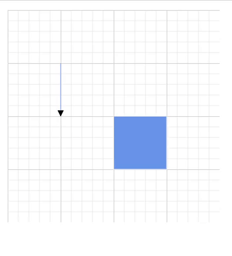

# Diagram Events in Blazor Diagram Component

## How to Use the Created Event

The [Created](https://help.syncfusion.com/cr/blazor/Syncfusion.Blazor.Diagram.SfDiagramComponent.html#Syncfusion_Blazor_Diagram_SfDiagramComponent_Created) event is raised after the Diagram component is fully rendered and initialized. This event provides an opportunity to execute custom logic or perform specific actions immediately after the diagram is created. For instance, use this event to programmatically select objects, modify diagram properties, or initialize additional components that depend on the diagram's existence.

```cshtml
@using Syncfusion.Blazor.Diagram
@using System.Collections.ObjectModel

<SfDiagramComponent @ref="@Diagram" Width="100%" Height="700px" Nodes="nodes" Created="OnCreated" />

@code
{
    private SfDiagramComponent Diagram;
    private DiagramObjectCollection<Node> nodes = new DiagramObjectCollection<Node>();

    protected override void OnInitialized()
    {
        Node node = new Node()
        {
            OffsetX = 250,
            OffsetY = 250,
            Width = 100,
            Height = 100
        };
        nodes.Add(node);
    }

    private void OnCreated(object args)
    {
        Diagram.Select(new ObservableCollection<IDiagramObject>() { Diagram.Nodes[0] });
    }
}
```


A complete working sample can be downloaded from [GitHub](https://github.com/SyncfusionExamples/Blazor-Diagram-Examples/tree/master/UG-Samples/Events/CreatedEvent)

## How to Handle Click Events

The [Click](https://help.syncfusion.com/cr/blazor/Syncfusion.Blazor.Diagram.SfDiagramComponent.html#Syncfusion_Blazor_Diagram_SfDiagramComponent_Click) event occurs when a user interacts with a node, connector, or the diagram canvas by clicking on it. This event provides valuable information about the clicked element and the click location. For detailed information about the event arguments, please refer to the [ClickEventArgs](https://help.syncfusion.com/cr/blazor/Syncfusion.Blazor.Diagram.ClickEventArgs.html).

```cshtml
@using Syncfusion.Blazor.Diagram
@using System.Collections.ObjectModel

<SfDiagramComponent @ref="@Diagram" Width="100%" Height="700px" Nodes="nodes" Click="OnClick" />

@code
{
    private SfDiagramComponent Diagram;
    private DiagramObjectCollection<Node> nodes = new DiagramObjectCollection<Node>();

    protected override void OnInitialized()
    {
        Node node = new Node()
        {
            OffsetX = 250,
            OffsetY = 250,
            Width = 100,
            Height = 100
        };
        nodes.Add(node);
    }

    private void OnClick(ClickEventArgs args)
    {
        // Actions to be performed
    }
}
```


A complete working sample can be downloaded from [GitHub](https://github.com/SyncfusionExamples/Blazor-Diagram-Examples/tree/master/UG-Samples/Events/ClickEvent)

## How to Handle the Key Down Event

The [KeyDown](https://help.syncfusion.com/cr/blazor/Syncfusion.Blazor.Diagram.SfDiagramComponent.html#Syncfusion_Blazor_Diagram_SfDiagramComponent_KeyDown) event is raised when a user presses any key on the keyboard while the diagram component has focus. This event provides a powerful way to capture and respond to keyboard interactions. For detailed information about the event arguments and properties available, please refer to the [KeyEventArgs](https://help.syncfusion.com/cr/blazor/Syncfusion.Blazor.Diagram.KeyEventArgs.html).


```cshtml
@using Syncfusion.Blazor.Diagram
@using System.Collections.ObjectModel

<SfDiagramComponent @ref="@Diagram" Width="100%" Height="700px" Nodes="nodes" KeyDown="@OnKeyDown" />

@code
{
    private SfDiagramComponent Diagram;
    private DiagramObjectCollection<Node> nodes = new DiagramObjectCollection<Node>();

    protected override void OnInitialized()
    {
        Node node = new Node()
        {
            OffsetX = 250,
            OffsetY = 250,
            Width = 100,
            Height = 100
        };
        nodes.Add(node);
    }

    private void OnKeyDown(KeyEventArgs args)
    {
        // Actions to be performed
    }
}
```


A complete working sample can be downloaded from [GitHub](https://github.com/SyncfusionExamples/Blazor-Diagram-Examples/tree/master/UG-Samples/Events/KeyDownEvent)

## How to Handle the Key Up Event

The [KeyUp](https://help.syncfusion.com/cr/blazor/Syncfusion.Blazor.Diagram.SfDiagramComponent.html#Syncfusion_Blazor_Diagram_SfDiagramComponent_KeyUp) event is raised when a user releases a key on the keyboard. This event provides valuable information about the released key and can be used to implement custom functionality or keyboard shortcuts in your Blazor diagram. For detailed information about the event arguments, refer to the [KeyEventArgs](https://help.syncfusion.com/cr/blazor/Syncfusion.Blazor.Diagram.KeyEventArgs.html), which outlines all the properties and methods available for handling this event effectively.

```cshtml
@using Syncfusion.Blazor.Diagram
@using System.Collections.ObjectModel

<SfDiagramComponent @ref="@Diagram" Width="100%" Height="700px" Nodes="nodes" KeyUp="@OnKeyUp" />

@code
{
    private SfDiagramComponent Diagram;
    private DiagramObjectCollection<Node> nodes = new DiagramObjectCollection<Node>();
    
    protected override void OnInitialized()
    {
        Node node = new Node()
        {
            OffsetX = 250,
            OffsetY = 250,
            Width = 100,
            Height = 100
        };
        nodes.Add(node);
    }

    private void OnKeyUp(KeyEventArgs args)
    {
        // Actions to be performed
    }
}
```


A complete working sample can be downloaded from [GitHub](https://github.com/SyncfusionExamples/Blazor-Diagram-Examples/tree/master/UG-Samples/Events/KeyUpEvent)

## How to Handle the Drag Start Event
* The [DragStart](https://help.syncfusion.com/cr/blazor/Syncfusion.Blazor.Diagram.SfDiagramComponent.html#Syncfusion_Blazor_Diagram_SfDiagramComponent_DragStart) event is raised when a user begins dragging a symbol from the symbol palette into the diagram canvas. This event provides valuable information about the drag operation initiation. For detailed information about the event arguments and properties available, refer to the [DragStartEventArgs](https://help.syncfusion.com/cr/blazor/Syncfusion.Blazor.Diagram.DragStartEventArgs.html).

```cshtml
@using Syncfusion.Blazor.Diagram
@using Syncfusion.Blazor.Diagram.SymbolPalette
@using System.Collections.ObjectModel

<SfSymbolPaletteComponent @ref="PaletteInstance" Palettes="@Palettes" SymbolHeight="40" GetSymbolInfo="GetSymbolInfo" SymbolWidth="40">
</SfSymbolPaletteComponent>
<SfDiagramComponent @ref="@Diagram" Width="100%" Height="700px" Nodes="nodes" DragStart="DragStart" />

@code
{
    private SfDiagramComponent Diagram;
    private SfSymbolPaletteComponent PaletteInstance;
    private DiagramObjectCollection<Palette> Palettes = new DiagramObjectCollection<Palette>();
    private DiagramObjectCollection<NodeBase> TNodes = new DiagramObjectCollection<NodeBase>();
    private DiagramObjectCollection<Node> nodes = new DiagramObjectCollection<Node>();
    
    private SymbolInfo GetSymbolInfo(IDiagramObject symbol)
    {
        SymbolInfo SymbolInfo = new SymbolInfo();
        SymbolInfo.Fit = true;
        return SymbolInfo;
    }
    
    protected override void OnInitialized()
    {
        TNodes = new DiagramObjectCollection<NodeBase>();
        Node TNode2 = new Node()
        {
            ID = "node1",
            Shape = new FlowShape() { Type = NodeShapes.Flow, Shape = NodeFlowShapes.Decision }
        };
        TNodes.Add(TNode2);
        Palettes = new DiagramObjectCollection<Palette>()
        {
            new Palette(){Symbols =TNodes,Title="Flow Shapes",ID="Flow Shapes" },
        };
    }

    protected override async Task OnAfterRenderAsync(bool firstRender)
    {
        PaletteInstance.Targets = new DiagramObjectCollection<SfDiagramComponent>() { };
        PaletteInstance.Targets.Add(Diagram);
    }

    //Notify the drag start event.
    private void DragStart(DragStartEventArgs args)
    {
        //Action to be performed.
    }
}
```


A complete working sample can be downloaded from [GitHub](https://github.com/SyncfusionExamples/Blazor-Diagram-Examples/tree/master/UG-Samples/Events/DragStartEvent)


## How to Handle the Dragging Event
* The [Dragging](https://help.syncfusion.com/cr/blazor/Syncfusion.Blazor.Diagram.SfDiagramComponent.html#Syncfusion_Blazor_Diagram_SfDiagramComponent_Dragging) event is raised when a diagram element is being dragged over another element in the diagram. This event provides real-time feedback during the dragging process. To explore the available arguments and properties associated with this event, refer to the [DraggingEventArgs](https://help.syncfusion.com/cr/blazor/Syncfusion.Blazor.Diagram.DraggingEventArgs.html).


```cshtml
@using Syncfusion.Blazor.Diagram
@using Syncfusion.Blazor.Diagram.SymbolPalette
@using System.Collections.ObjectModel

<SfSymbolPaletteComponent Palettes="@Palettes" SymbolHeight="40" GetSymbolInfo="GetSymbolInfo" SymbolWidth="40">
    <SfDiagramComponent @ref="@Diagram" Width="100%" Height="700px" Nodes="nodes" Dragging="Dragging" />
</SfSymbolPaletteComponent>

@code
{
    private SfDiagramComponent Diagram;
    private DiagramObjectCollection<Palette> Palettes = new DiagramObjectCollection<Palette>();
    private DiagramObjectCollection<NodeBase> TNodes = new DiagramObjectCollection<NodeBase>();
    private DiagramObjectCollection<Node> nodes = new DiagramObjectCollection<Node>();
    
    private SymbolInfo GetSymbolInfo(IDiagramObject symbol)
    {
        SymbolInfo SymbolInfo = new SymbolInfo();
        SymbolInfo.Fit = true;
        return SymbolInfo;
    }

    protected override void OnInitialized()
    {
        TNodes = new DiagramObjectCollection<NodeBase>();
        Node TNode2 = new Node()
        {
            ID = "node1",
            Shape = new FlowShape() { Type = NodeShapes.Flow, Shape = NodeFlowShapes.Decision }
        };
        TNodes.Add(TNode2);
        Palettes = new DiagramObjectCollection<Palette>()
        {
        new Palette(){Symbols =TNodes,Title="Flow Shapes",ID="Flow Shapes" },
        };
    }

    // Notify the dragging event.
    private void Dragging(DraggingEventArgs args)
    {
        //Action to be performed.
    }
}
```


A complete working sample can be downloaded from [GitHub](https://github.com/SyncfusionExamples/Blazor-Diagram-Examples/tree/master/UG-Samples/Events/DraggingEvent)

## How to Handle the DragLeave Event
* The [DragLeave](https://help.syncfusion.com/cr/blazor/Syncfusion.Blazor.Diagram.SfDiagramComponent.html#Syncfusion_Blazor_Diagram_SfDiagramComponent_DragLeave) event is raised when a dragged element exits the boundaries of another diagram element. For detailed information about the event arguments, refer to the [DragLeaveEventArgs](https://github.com/SyncfusionExamples/Blazor-Diagram-Examples/tree/master/UG-Samples/Events/DragLeaveEvent) documentation and sample code.


```cshtml
@using Syncfusion.Blazor.Diagram
@using System.Collections.ObjectModel
@using Syncfusion.Blazor.Diagram.SymbolPalette

<SfSymbolPaletteComponent Palettes="@Palettes" SymbolDragPreviewSize="@SymbolPreview" SymbolHeight="40" GetSymbolInfo="GetSymbolInfo" SymbolWidth="40">
</SfSymbolPaletteComponent>
<SfDiagramComponent @ref="@Diagram" Width="100%" Height="700px" Nodes="nodes" DragLeave="DragLeave" />

@code
{
    private SfDiagramComponent Diagram;
    private DiagramSize SymbolPreview;
    private DiagramObjectCollection<Palette> Palettes = new DiagramObjectCollection<Palette>();
    private DiagramObjectCollection<NodeBase> TNodes = new DiagramObjectCollection<NodeBase>();
    private DiagramObjectCollection<Node> nodes = new DiagramObjectCollection<Node>();
    
    private SymbolInfo GetSymbolInfo(IDiagramObject symbol)
    {
        SymbolInfo SymbolInfo = new SymbolInfo();
        SymbolInfo.Fit = true;
        return SymbolInfo;
    }
    
    protected override void OnInitialized()
    {
        SymbolPreview = new DiagramSize();
        SymbolPreview.Width = 80;
        SymbolPreview.Height = 80;
        TNodes = new DiagramObjectCollection<NodeBase>();
        Node TNode2 = new Node()
        {
            ID = "node1",
            Shape = new FlowShape() { Type = NodeShapes.Flow, Shape = NodeFlowShapes.Decision }
        };
        TNodes.Add(TNode2);
        Palettes = new DiagramObjectCollection<Palette>()
        {
        new Palette(){Symbols =TNodes,Title="Flow Shapes",ID="Flow Shapes" },
        };
    }

    // Notify the DragLeave event.
    private void DragLeave(DragLeaveEventArgs args)
    {
        //Action to be performed.
    }
}
```


A complete working sample can be downloaded from [GitHub](https://github.com/SyncfusionExamples/Blazor-Diagram-Examples/tree/master/UG-Samples/Events)

## How to Handle the Drag Drop Event
* The [DragDrop](https://help.syncfusion.com/cr/blazor/Syncfusion.Blazor.Diagram.SfDiagramComponent.html#Syncfusion_Blazor_Diagram_SfDiagramComponent_DragDrop) event is raised when a user drags a symbol from the symbol palette and drops it onto the diagram's drawing area. This event provides valuable information about the drag and drop operation. To access and utilize the event arguments, refer to the [DropEventArgs](https://help.syncfusion.com/cr/blazor/Syncfusion.Blazor.Diagram.DropEventArgs.html) documentation, which details the properties and methods available for handling this event effectively.

```cshtml
@using Syncfusion.Blazor.Diagram
@using System.Collections.ObjectModel
@using Syncfusion.Blazor.Diagram.SymbolPalette

<SfSymbolPaletteComponent Palettes="@Palettes" SymbolDragPreviewSize="@SymbolPreview" SymbolHeight="40" GetSymbolInfo="GetSymbolInfo" SymbolWidth="40">
</SfSymbolPaletteComponent>
<SfDiagramComponent @ref="@Diagram" Width="100%" Height="700px" Nodes="nodes" DragDrop="DragDrop" />

@code 
{
    private SfDiagramComponent Diagram;
    private DiagramSize SymbolPreview;
    private DiagramObjectCollection<Palette> Palettes = new DiagramObjectCollection<Palette>();
    private DiagramObjectCollection<NodeBase> TNodes = new DiagramObjectCollection<NodeBase>();
    private DiagramObjectCollection<Node> nodes = new DiagramObjectCollection<Node>();
    
    private SymbolInfo GetSymbolInfo(IDiagramObject symbol)
    {
        SymbolInfo SymbolInfo = new SymbolInfo();
        SymbolInfo.Fit = true;
        return SymbolInfo;
    }

    protected override void OnInitialized()
    {
        SymbolPreview = new DiagramSize();
        SymbolPreview.Width = 80;
        SymbolPreview.Height = 80;
        TNodes = new DiagramObjectCollection<NodeBase>();
        Node TNode2 = new Node()
        {
            ID = "node1",
            Shape = new FlowShape() { Type = NodeShapes.Flow, Shape = NodeFlowShapes.Decision }
        };
        TNodes.Add(TNode2);
        Palettes = new DiagramObjectCollection<Palette>()
        {
        new Palette(){Symbols =TNodes,Title="Flow Shapes",ID="Flow Shapes" },
        };
    }

    // Notify the DragDrop event.
    private void DragDrop(DropEventArgs args)
    {
        //Action to be performed.
    }
}
```


A complete working sample can be downloaded from [GitHub](https://github.com/SyncfusionExamples/Blazor-Diagram-Examples/tree/master/UG-Samples/Events/DragDrop)

## How to Handle the On Auto Scroll Change Event
The [OnAutoScrollChange](https://help.syncfusion.com/cr/blazor/Syncfusion.Blazor.Diagram.SfDiagramComponent.html#Syncfusion_Blazor_Diagram_SfDiagramComponent_OnAutoScrollChange) event is raised when changes are detected in the scroll position, extent, or viewport size due to auto-scrolling of diagram elements. This event provides an [AutoScrollChangeEventArgs](https://help.syncfusion.com/cr/blazor/Syncfusion.Blazor.Diagram.AutoScrollChangeEventArgs.html) argument containing relevant information.

The [AutoScrollChangeEventArgs](https://help.syncfusion.com/cr/blazor/Syncfusion.Blazor.Diagram.AutoScrollChangeEventArgs.html) include the following properties:

* [Cancel](https://help.syncfusion.com/cr/blazor/Syncfusion.Blazor.Diagram.AutoScrollChangeEventArgs.html#Syncfusion_Blazor_Diagram_AutoScrollChangeEventArgs_Cancel): A boolean property that, when set to true, stops the auto-scrolling process.
* [Item](https://help.syncfusion.com/cr/blazor/Syncfusion.Blazor.Diagram.AutoScrollChangeEventArgs.html#Syncfusion_Blazor_Diagram_AutoScrollChangeEventArgs_Item): Represents the diagram element currently undergoing auto-scrolling.
* [Delay](https://help.syncfusion.com/cr/blazor/Syncfusion.Blazor.Diagram.AutoScrollChangeEventArgs.html#Syncfusion_Blazor_Diagram_AutoScrollChangeEventArgs_Delay): A TimeSpan value that determines the waiting period between applying auto-scroll to a diagram element and initiating the actual auto-scrolling action.

These properties allow for fine-tuned control over the auto-scrolling behavior in your Blazor diagram component.

```cshtml
@using Syncfusion.Blazor.Diagram

<SfDiagramComponent Height="400px" Width="400px" Nodes="@nodes" Connectors="@connectors" OnAutoScrollChange="AutoScrollChange">
    @* Sets the ScrollSettings for the diagram *@
    <ScrollSettings EnableAutoScroll=true AutoScrollPadding="@autoScrollBorder" @bind-ScrollLimit="@ScrollLimit">
    </ScrollSettings>
</SfDiagramComponent>

@code
{
    private ScrollLimitMode ScrollLimit { get; set; } = ScrollLimitMode.Infinity;
    private DiagramObjectCollection<Node> nodes;
    //Defines diagram's connector collection.
    private DiagramObjectCollection<Connector> connectors = new DiagramObjectCollection<Connector>();
    private DiagramMargin autoScrollBorder = new DiagramMargin() { Left = 30, Right = 30, Top = 30, Bottom = 30 };
    
    protected override void OnInitialized()
    {
        nodes = new DiagramObjectCollection<Node>();
        // A node is created and stored in the nodes collection.
        Node node = new Node()
        {
            ID = "node1",
            // Position of the node.
            OffsetX = 250,
            OffsetY = 250,
            // Size of the node.
            Width = 100,
            Height = 100,
            Style = new ShapeStyle()
            {
                Fill = "#6495ED",
                StrokeColor = "white"
            }
        };
        // Add node.
        nodes.Add(node);
        Connector Connector = new Connector()
        {
            ID = "connector1",
            // Set the source and target point of the connector.
            SourcePoint = new DiagramPoint() { X = 100, Y = 100 },
            TargetPoint = new DiagramPoint() { X = 100, Y = 200 },
            // Type of the connector segments.
            Type = ConnectorSegmentType.Straight,
            Style = new ShapeStyle()
            {
                StrokeColor = "#6495ED",
                StrokeWidth = 1
            },
        };
        connectors.Add(Connector);
    }

    private void AutoScrollChange(AutoScrollChangeEventArgs args)
    {
        args.Cancel = false;
        args.Delay = new TimeSpan(0, 0, 0, 1, 0);
    }
}
```


 

A complete working sample can be downloaded from [GitHub](https://github.com/SyncfusionExamples/Blazor-Diagram-Examples/tree/master/UG-Samples/Events/OnAutoScrollChange)

## See also

* [How to Identify the Clicked Diagram Elements in Syncfusion<sup style="font-size:70%">&reg;</sup> Blazor Diagram](https://support.syncfusion.com/kb/article/17226/how-to-identify-the-clicked-diagram-elments-in-syncfusion-blazor-diagram)

* [How to Notify the Double-Click Event in Blazor Diagram](https://support.syncfusion.com/kb/article/16014/how-to-notify-the-double-click-event-in-blazor-diagram)

* [How to Connect Visio While Dropping Node in Existing Blazor Diagram](https://support.syncfusion.com/kb/article/11181/how-to-connect-visio-while-dropping-node-in-existing-blazor-diagram)