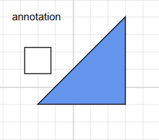
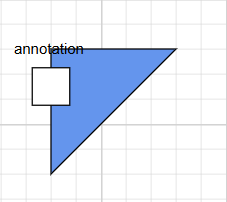
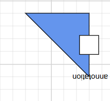
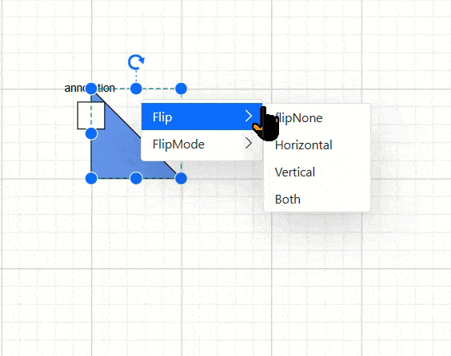
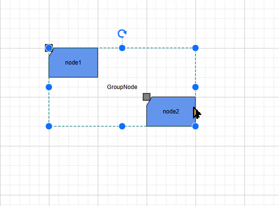

# Flip in Blazor Diagram Component

The diagram component supports flipping nodes, connectors, and groups. Flipping creates a mirror image of the original element, allowing for versatile visual representations within the diagram.

## How to Flip the Node or Group

The [Flip](https://help.syncfusion.com/cr/blazor/Syncfusion.Blazor.Diagram.NodeBase.html#Syncfusion_Blazor_Diagram_NodeBase_Flip) command mirrors the content and ports of selected objects across the horizontal axis, vertical axis, or both on the diagram page. This transformation allows for quick and easy reorientation of diagram elements.

**Note:** The `Flip` command applies to both individual nodes and node groups, including their selected child nodes.

### How to Change the Flip Direction

The [FlipDirection](https://help.syncfusion.com/cr/blazor/Syncfusion.Blazor.Diagram.FlipDirection.html) property mirrors nodes, groups, or connectors across horizontal, vertical, or both directions. This enables symmetrical or reversed representations of diagram elements, enhancing the flexibility and visual appeal of your Blazor diagrams.

| FlipDirection | Description | 
| -------- | -------- |
|[Horizontal](https://help.syncfusion.com/cr/blazor/Syncfusion.Blazor.Diagram.FlipDirection.html#Syncfusion_Blazor_Diagram_FlipDirection_Horizontal)| It is used to flip the node or connector to be mirrored across the horizontal axis.|
|[Vertical](https://help.syncfusion.com/cr/blazor/Syncfusion.Blazor.Diagram.FlipDirection.html#Syncfusion_Blazor_Diagram_FlipDirection_Vertical)| It is used to flip the node or connector to be mirrored across the vertical axis.|
|[Both](https://help.syncfusion.com/cr/blazor/Syncfusion.Blazor.Diagram.FlipDirection.html#Syncfusion_Blazor_Diagram_FlipDirection_Both)| It is used to flip the node or connector to be mirrored across the horizontal and vertical axes.|
|[None](https://help.syncfusion.com/cr/blazor/Syncfusion.Blazor.Diagram.FlipDirection.html#Syncfusion_Blazor_Diagram_FlipDirection_None)| It is used to disable all the flip behavior. |  


### How to Change the Flip Mode

The [FlipMode](https://help.syncfusion.com/cr/blazor/Syncfusion.Blazor.Diagram.DiagramFlipMode.html) property is utilized to manage the flipping behavior of diagram objects. It determines whether the object should be flipped along with its associated ports , content and content text, or if these elements should remain in their original orientation during the flip operation.

| DiagramFlipMode | Description | 
| -------- | -------- |
|[Content](https://help.syncfusion.com/cr/blazor/Syncfusion.Blazor.Diagram.DiagramFlipMode.html#Syncfusion_Blazor_Diagram_DiagramFlipMode_Content)| Flips the node along with annotations and their text.|
|[Port](https://help.syncfusion.com/cr/blazor/Syncfusion.Blazor.Diagram.DiagramFlipMode.html#Syncfusion_Blazor_Diagram_DiagramFlipMode_Port)| Enables or disables the flip for an object’s port.|
|[All](https://help.syncfusion.com/cr/blazor/Syncfusion.Blazor.Diagram.DiagramFlipMode.html#Syncfusion_Blazor_Diagram_DiagramFlipMode_All)| Enables or disables flip operations for annotations, their text, and ports|
|[Text](https://help.syncfusion.com/cr/blazor/Syncfusion.Blazor.Diagram.DiagramFlipMode.html#Syncfusion_Blazor_Diagram_DiagramFlipMode_Text)| Flips only the text of annotations, excluding the annotation elements.|
|[PortAndLabelOnly](https://help.syncfusion.com/cr/blazor/Syncfusion.Blazor.Diagram.DiagramFlipMode.html#Syncfusion_Blazor_Diagram_DiagramFlipMode_PortAndLabelOnly)| Flips the node along with ports and annotations, excluding the annotation text.|
|[PortWithLabelText](https://help.syncfusion.com/cr/blazor/Syncfusion.Blazor.Diagram.DiagramFlipMode.html#Syncfusion_Blazor_Diagram_DiagramFlipMode_PortWithLabelText)| Flips the node along with ports and annotation text, excluding the annotation elements.|
|[LabelOnly](https://help.syncfusion.com/cr/blazor/Syncfusion.Blazor.Diagram.DiagramFlipMode.html#Syncfusion_Blazor_Diagram_DiagramFlipMode_LabelOnly)| Flips the node along with annotations, excluding their text.|


**Note:** The [FlipMode](https://help.syncfusion.com/cr/blazor/Syncfusion.Blazor.Diagram.DiagramFlipMode.html) property applies only to nodes. It does not affect connectors or other diagram elements.

The following code example shows how to flip the node.

```cshtml
@using Syncfusion.Blazor.Diagram
@using Syncfusion.Blazor.DropDowns
        <SfDropDownList TItem="FlipOption" TValue="string"
                DataSource="@FlipDirections"
                Placeholder="Flip">
    <DropDownListEvents TItem="FlipOption" TValue="string"
                        ValueChange="@FlipDirectionChange" />
    <DropDownListFieldSettings Text="Name" Value="Value"></DropDownListFieldSettings>
</SfDropDownList>

  <SfDropDownList TItem="FlipOption" TValue="string"
                DataSource="@FlipModes"
                Placeholder="Flip">
    <DropDownListEvents TItem="FlipOption" TValue="string"
                        ValueChange="@FlipModeChange" />
    <DropDownListFieldSettings Text="Name" Value="Value"></DropDownListFieldSettings>
</SfDropDownList>

<SfDiagramComponent @ref="diagram" Width="1000px" Height="1000px" Nodes="@NodeCollection" Connectors="@connectors">
</SfDiagramComponent>
@code
{
    //Initialize the diagram connector collection
    DiagramObjectCollection<Connector> connectors = new DiagramObjectCollection<Connector>();
    //Reference the diagram
    public SfDiagramComponent diagram;
    //Define diagram nodes collection
    DiagramObjectCollection<Node> NodeCollection;
     public class FlipOption
 {
     public string Name { get; set; } 
     public string Value { get; set; } // Bound value
 }

 List<FlipOption> FlipDirections = new()
 {
     new FlipOption { Name = "None", Value = "None" },
     new FlipOption { Name = "Horizontal", Value = "Horizontal" },
     new FlipOption { Name = "Vertical", Value = "Vertical" },
     new FlipOption { Name = "Both", Value = "Both" }
 };

 List<FlipOption> FlipModes = new()
 {
     new FlipOption { Name = "None", Value = "None" },
     new FlipOption { Name = "Content", Value = "Content" },
     new FlipOption { Name = "Port", Value = "Port" },
     new FlipOption { Name = "Text", Value = "Text" },
     new FlipOption { Name = "PortAndLabelOnly", Value = "LabelOnly" },
     new FlipOption { Name = "PortWithLabelText", Value = "PortWithLabelText" },
     new FlipOption { Name = "LabelOnly", Value = "LabelOnly" },
     new FlipOption { Name = "All", Value = "All" }
 };
    protected override void OnInitialized()
    {
        Node node1 = new Node()
            {
                ID = "node1",
                Width = 100,
                Height = 100,
                OffsetX = 200,
                OffsetY = 100,
                Flip = FlipDirection.Horizontal,
                Annotations = new DiagramObjectCollection<ShapeAnnotation>()
            {
                new ShapeAnnotation
                {
                   ID="node1annotation",
                   Content = "Offset(0,0)",
                   Offset = new DiagramPoint() { X = 0, Y = 0 }
                }
            },
                Style = new ShapeStyle()
                {
                    Fill = "#6495ED",
                },
                Shape = new FlowShape()
                {
                    Type = NodeShapes.Flow,
                    Shape = NodeFlowShapes.Card
                },
                Ports = new DiagramObjectCollection<PointPort>()
            {
                new PointPort()
                {
                    ID="ports",
                    Style = new ShapeStyle(){ Fill = "gray" },
                    Offset = new DiagramPoint() { X = 0, Y = 0 },
                    Visibility = PortVisibility.Visible,
                }
            }
            };
        Node node2 = new Node()
            {
                ID = "node2",
                Width = 100,
                Height = 100,
                OffsetX = 400,
                OffsetY = 100,
                Flip = FlipDirection.Horizontal,
                FlipMode = DiagramFlipMode.Port,
                Style = new ShapeStyle()
                {
                    Fill = "#6495ED",
                },
                Shape = new FlowShape()
                {
                    Type = NodeShapes.Flow,
                    Shape = NodeFlowShapes.Card
                },
                Annotations = new DiagramObjectCollection<ShapeAnnotation>()
            {
                new ShapeAnnotation
                {
                    Content = "Offset(0,0)",
                    Offset = new DiagramPoint() { X = 0, Y = 0.5 }
                }
            },
                Ports = new DiagramObjectCollection<PointPort>()
            {
               new PointPort()
               {
                   Style = new ShapeStyle(){ Fill = "gray" },
                   Offset = new DiagramPoint() { X = 0, Y = 0 },
                   Visibility = PortVisibility.Visible
               }
            }
            };
        NodeCollection = new DiagramObjectCollection<Node>() { node1, node2 };
    }
 // This method applys flipDirection to the selected node's
 public void FlipDirectionChange(ChangeEventArgs<string, FlipOption> args)
 {
     diagram.StartGroupAction();

     if (diagram.SelectionSettings.Nodes.Count > 0)
     {
         for (int i = 0; i < diagram.SelectionSettings.Nodes.Count; i++)
         {
             diagram.SelectionSettings.Nodes[i].Flip = (FlipDirection)Enum.Parse(typeof(FlipDirection), args.Value.ToString());
         }
     }
     for (int i = 0; i < diagram.SelectionSettings.Connectors.Count; i++)
     {
         diagram.SelectionSettings.Connectors[i].Flip = (FlipDirection)Enum.Parse(typeof(FlipDirection), args.Value.ToString());
     }
     diagram.EndGroupAction();

 }

 //This method apply's diagramFLipMode to the selected node's
 public void FlipModeChange(ChangeEventArgs<string, FlipOption> args)
 {
     diagram.StartGroupAction();

     if (diagram.SelectionSettings.Nodes.Count > 0)
     {
         for (int i = 0; i < diagram.SelectionSettings.Nodes.Count; i++)
         {
             diagram.SelectionSettings.Nodes[i].FlipMode = (DiagramFlipMode)Enum.Parse(typeof(DiagramFlipMode), args.Value.ToString());
         }
     }

     diagram.EndGroupAction();

 }

}
```


A complete working sample can be downloaded from [GitHub](https://github.com/SyncfusionExamples/Blazor-UG-Examples/blob/master/Diagram/Server/Pages/Flip/FlipDirection)


| FlipDirection | DiagramFlipMode | Output|
| -------- | -------- | -------- |
|Horizontal|Content| |
|Horizontal|Port||
|Horizontal|Text| |
|Horizontal|Port And LabelOnly ||
|Horizontal|Port With LabelText| |
|Horizontal|LabelOnly||
|Horizontal|All||
|Horizontal|None||
|Vertical|Content| |
|Vertical|Port||
|Vertical|Text| |
|Vertical|Port And LabelOnly ||
|Vertical|Port With LabelText| |
|Vertical|LabelOnly||
|Vertical|All||
|Vertical|None||
|Both|Content| |
|Both|Port||
|Both|Text| |
|Both|Port And LabelOnly ||
|Both|Port With LabelText| |
|Both|LabelOnly||
|Both|All||
|Both|None||


## How to flip the Group Node
The flip functionality for a group node is similar to that of normal nodes. However, when flipping a group node, the flip of its child nodes is combined with the group’s flip. This combination ensures that the child nodes inherit the group’s flip while retaining their own individual flips.

 Example:

- If a child node’s flip is set to Vertical and the group node’s flip is set to Horizontal, the resulting flip for the child node will be a combination of Vertical and Horizontal (effectively a “both” flip).
- This ensures that the child nodes’ orientations adapt dynamically based on the group’s flip while maintaining their unique flip settings.

## How to Change Group Flip Mode

The [FlipMode](https://help.syncfusion.com/cr/blazor/Syncfusion.Blazor.Diagram.DiagramFlipMode.html) of a group node behaves similarly to that of normal nodes. However,when a flip mode is applied to a group node, it takes precedence over any flip mode set on its child nodes, overriding their individual settings.

For example, in the below code,  
the flipMode for the child node `Node1` is set to [Text](https://help.syncfusion.com/cr/blazor/Syncfusion.Blazor.Diagram.DiagramFlipMode.html#Syncfusion_Blazor_Diagram_DiagramFlipMode_Text).  
The flipMode for the group node is set to [Content](https://help.syncfusion.com/cr/blazor/Syncfusion.Blazor.Diagram.DiagramFlipMode.html#Syncfusion_Blazor_Diagram_DiagramFlipMode_Content).  
As a result, the effective flipMode for both the child node and the group node will be `Content`,
as the group node’s flipMode overrides the child’s.


The following code example shows how to flip the group.

```cshtml
@using Syncfusion.Blazor.Diagram
@using Syncfusion.Blazor.DropDowns
       <SfDropDownList TItem="FlipOption" TValue="string"
                DataSource="@FlipDirections"
                Placeholder="Flip">
    <DropDownListEvents TItem="FlipOption" TValue="string"
                        ValueChange="@FlipDirectionChange" />
    <DropDownListFieldSettings Text="Name" Value="Value"></DropDownListFieldSettings>
</SfDropDownList>

  <SfDropDownList TItem="FlipOption" TValue="string"
                DataSource="@FlipModes"
                Placeholder="Flip">
    <DropDownListEvents TItem="FlipOption" TValue="string"
                        ValueChange="@FlipModeChange" />
    <DropDownListFieldSettings Text="Name" Value="Value"></DropDownListFieldSettings>
</SfDropDownList>
<SfDiagramComponent @ref="diagram" Width="1000px" Height="1000px" Nodes="@NodeCollection" Connectors="@connectors">
    <SnapSettings Constraints="@SnapConstraints.None"></SnapSettings>
</SfDiagramComponent>
@code
{
    //Initialize the diagram's connector collection
    DiagramObjectCollection<Connector> connectors = new DiagramObjectCollection<Connector>();
    //Reference the diagram
    public SfDiagramComponent diagram;
    //Define diagram's nodes collection
    DiagramObjectCollection<Node> NodeCollection;
     public class FlipOption
 {
     public string Name { get; set; } 
     public string Value { get; set; } // Bound value
 }

 List<FlipOption> FlipDirections = new()
 {
     new FlipOption { Name = "None", Value = "None" },
     new FlipOption { Name = "Horizontal", Value = "Horizontal" },
     new FlipOption { Name = "Vertical", Value = "Vertical" },
     new FlipOption { Name = "Both", Value = "Both" }
 };

 List<FlipOption> FlipModes = new()
 {
     new FlipOption { Name = "None", Value = "None" },
     new FlipOption { Name = "Content", Value = "Content" },
     new FlipOption { Name = "Port", Value = "Port" },
     new FlipOption { Name = "Text", Value = "Text" },
     new FlipOption { Name = "PortAndLabelOnly", Value = "LabelOnly" },
     new FlipOption { Name = "PortWithLabelText", Value = "PortWithLabelText" },
     new FlipOption { Name = "LabelOnly", Value = "LabelOnly" },
     new FlipOption { Name = "All", Value = "All" }
 };
    protected override void OnInitialized()
    {
        Node node3 = new Node()
            {
                ID = "node3",
                Width = 100,
                Height = 60,
                OffsetX = 200,
                OffsetY = 300,
                Annotations = new DiagramObjectCollection<ShapeAnnotation>()
            {
                new ShapeAnnotation
                {
                    ID="ano3",
                    Content = "node1",
                    Offset = new DiagramPoint() { X = 0.5, Y = 0.5 }
                }
            },
                Style = new ShapeStyle()
                {
                    Fill = "#6495ED",
                },
                Shape = new FlowShape()
                {
                    Type = NodeShapes.Flow,
                    Shape = NodeFlowShapes.Card
                },
                Ports = new DiagramObjectCollection<PointPort>()
            {
               new PointPort()
               {   ID="port3",
                   Style = new ShapeStyle(){ Fill = "gray" },
                   Offset = new DiagramPoint() { X = 0, Y = 0 },
                   Width=14,Height=14,
                   Visibility = PortVisibility.Visible
               }
            },
            };
        Node node4 = new Node()
            {
                ID = "node4",
                Width = 100,
                Height = 60,
                OffsetX = 400,
                OffsetY = 400,
                Style = new ShapeStyle()
                {
                    Fill = "#6495ED",
                },
                Shape = new FlowShape()
                {
                    Type = NodeShapes.Flow,
                    Shape = NodeFlowShapes.Card
                },
                Annotations = new DiagramObjectCollection<ShapeAnnotation>()
            {
                new ShapeAnnotation
                {
                    ID="anno4",
                    Content = "node2",
                    Offset = new DiagramPoint() { X = 0.5, Y = 0.5 }
                }
            },
                Ports = new DiagramObjectCollection<PointPort>()
            {
               new PointPort()
               {   ID="port4",
                   Style = new ShapeStyle(){ Fill = "gray" },
                   Offset = new DiagramPoint() { X = 0, Y = 0 },
                   Width=14,Height=14,
                   Visibility = PortVisibility.Visible
               }
            },
            };
        NodeCollection = new DiagramObjectCollection<Node>() { node3, node4 };
        NodeGroup groupNode = new NodeGroup()
            {
                ID = "group",
                Children = new string[] { "node3", "node4" },
                Annotations = new DiagramObjectCollection<ShapeAnnotation>()
                {
                    new ShapeAnnotation
                    {
                        ID="anno4",
                        Content = "GroupNode",
                        Offset = new DiagramPoint() { X = 0.5, Y = 0.5 }
                    }
                },
                Ports = new DiagramObjectCollection<PointPort>()
            {
               new PointPort()
               {   ID="port4",
                   Style = new ShapeStyle(){ Fill = "gray" },
                   Offset = new DiagramPoint() { X = 0, Y = 0},
                    Width=14,Height=14,
                   Visibility = PortVisibility.Visible
               }
            },
            };
        NodeCollection.Add(groupNode);
    }
   // This method applys flipDirection to the selected node's
 public void FlipDirectionChange(ChangeEventArgs<string, FlipOption> args)
 {
     diagram.StartGroupAction();

     if (diagram.SelectionSettings.Nodes.Count > 0)
     {
         for (int i = 0; i < diagram.SelectionSettings.Nodes.Count; i++)
         {
             diagram.SelectionSettings.Nodes[i].Flip = (FlipDirection)Enum.Parse(typeof(FlipDirection), args.Value.ToString());
         }
     }
     for (int i = 0; i < diagram.SelectionSettings.Connectors.Count; i++)
     {
         diagram.SelectionSettings.Connectors[i].Flip = (FlipDirection)Enum.Parse(typeof(FlipDirection), args.Value.ToString());
     }
     diagram.EndGroupAction();

 }

 //This method apply's diagramFLipMode to the selected node's
 public void FlipModeChange(ChangeEventArgs<string, FlipOption> args)
 {
     diagram.StartGroupAction();

     if (diagram.SelectionSettings.Nodes.Count > 0)
     {
         for (int i = 0; i < diagram.SelectionSettings.Nodes.Count; i++)
         {
             diagram.SelectionSettings.Nodes[i].FlipMode = (DiagramFlipMode)Enum.Parse(typeof(DiagramFlipMode), args.Value.ToString());
         }
     }

     diagram.EndGroupAction();

 }
}
```


For more information about node interaction, refer to [Node Interaction](./nodes/interaction).
A complete working sample can be downloaded from [GitHub](https://github.com/SyncfusionExamples/Blazor-UG-Examples/blob/master/Diagram/Server/Pages/Flip/FlipGroup)

| FlipDirection | DiagramFlipMode | Output|
| -------- | -------- |-------- |
|Horizontal|None||
|Horizontal|All||
|Horizontal|LabelOnly||
|Horizontal|Text||
|Horizontal|Port||
|Horizontal|PortAndLabelOnly||
|Horizontal|PortWithLabelText||
|Horizontal|Content||



## How to Flip the Connector

The [Flip](https://help.syncfusion.com/cr/blazor/Syncfusion.Blazor.Diagram.NodeBase.html#Syncfusion_Blazor_Diagram_NodeBase_Flip) command mirrors selected objects across horizontal, vertical, or both directions on the diagram page. This feature allows for quick and easy creation of symmetrical designs or reversed orientations of diagram elements.

**Note:** The [FlipMode](https://help.syncfusion.com/cr/blazor/Syncfusion.Blazor.Diagram.DiagramFlipMode.html) property applies only to nodes and does not affect connectors. This limitation ensures that connection logic remains intact while allowing individual node elements to be flipped as needed.

The following code example shows how to flip the connector.

```cshtml

@using Syncfusion.Blazor.Diagram
<input type="button" value="Horizontal" @onclick="@Horizontal" />
<input type="button" value="Vertical" @onclick="@Vertical" />
<input type="button" value="Both" @onclick="@Both" /> 
<SfDiagramComponent @ref="diagram" Width="1000px" Height="1000px"  Nodes="@NodeCollection" Connectors="@connectors">
    <SnapSettings Constraints="@SnapConstraints.None"></SnapSettings>
</SfDiagramComponent>
@code
{
    DiagramObjectCollection<Connector> connectors = new DiagramObjectCollection<Connector>();
    public SfDiagramComponent diagram;
    DiagramObjectCollection<Node> NodeCollection = new DiagramObjectCollection<Node>();
    protected override void OnInitialized()
    {     
        Connector Connector = new Connector()
        {
            ID = "connector2",
            Annotations = new DiagramObjectCollection<PathAnnotation>()
            {
                new PathAnnotation 
                { 
                    Content = "Offset as 0.5",
                    Offset = 0.5 
                },
            },         
            SourcePoint = new DiagramPoint() { X = 100, Y = 100 },
            TargetPoint = new DiagramPoint() { X = 200, Y = 200 },            
            Type = ConnectorSegmentType.Straight
        };
        connectors.Add(Connector);     
    }
    public void Horizontal()
    {     
        if (diagram.SelectionSettings.Connectors.Count > 0)
        {
            for(int i = 0; i < diagram.SelectionSettings.Connectors.Count; i++)
            {
                diagram.SelectionSettings.Connectors[i].Flip = FlipDirection.Horizontal;
            }
        }       
    }
    public void Vertical()
    {
        if (diagram.SelectionSettings.Connectors.Count > 0)
        {
            for(int i = 0; i < diagram.SelectionSettings.Connectors.Count; i++)
            {
                diagram.SelectionSettings.Connectors[i].Flip = FlipDirection.Vertical;
            }
        }
    }
    public void Both()
    {     
        if (diagram.SelectionSettings.Connectors.Count > 0)
        {
            for(int i = 0; i < diagram.SelectionSettings.Connectors.Count; i++)
            {
               diagram.SelectionSettings.Connectors[i].Flip = FlipDirection.Both;
            }
        }
    }
}
```

| FlipDirection | Output|
| -------- | -------- |
|Horizontal||
|Vertical||
|Both||



For more information about node interaction, refer to [Connector Interaction](./connectors/interactions).
