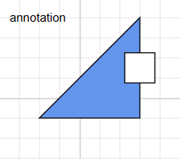
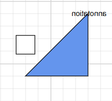
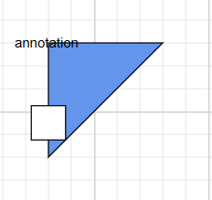
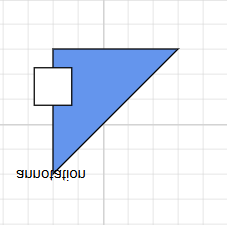
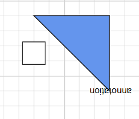

# Flip in Blazor Diagram Component

The diagram component offers functionality to flip nodes, connectors, and groups. Flipping creates a mirror image of the original element, allowing for versatile visual representations within the diagram.

## How to flip the node or group

The [Flip](https://help.syncfusion.com/cr/blazor/Syncfusion.Blazor.Diagram.NodeBase.html#Syncfusion_Blazor_Diagram_NodeBase_Flip) command is used to mirror the content and ports of selected objects across either the horizontal, vertical, or both directions on the diagram page. This transformation allows for quick and easy reorientation of diagram elements.

**Note:** The Flip command can be applied to both individual nodes and node groups, including their selected child nodes.

### How to change the flip direction

The [FlipDirection](https://help.syncfusion.com/cr/blazor/Syncfusion.Blazor.Diagram.FlipDirection.html) property is used to mirror nodes, groups, or connectors across horizontal, vertical, or both directions. This feature allows you to create symmetrical or reversed representations of diagram elements, enhancing the flexibility and visual appeal of your Blazor diagrams.

| FlipDirection | Description | 
| -------- | -------- |
|Horizontal| It is used to flip the node or connector to be mirrored across the horizontal axis.|
|Vertical| It is used to flip the node or connector to be mirrored across the vertical axis.|
|Both| It is used to flip the node or connector to be mirrored across the horizontal and vertical axes.|
|None| It is used to disable all the flip behavior. |  


### How to change the flip mode

The [FlipMode](https://help.syncfusion.com/cr/blazor/Syncfusion.Blazor.Diagram.DiagramFlipMode.html) property is utilized to manage the flipping behavior of diagram objects. It determines whether the object should be flipped along with its associated ports and content, or if these elements should remain in their original orientation during the flip operation.

| DiagramFlipMode | Description | 
| -------- | -------- |
|Content| It enables or disables the flip for an object’s content.|
|Port| It enables or disables the flip for an object’s port.|
|All| It enables or disables the flip for both the object’s content and port.|
|None| It is used to disable all the flip mode behavior.|

**Note:** The [FlipMode](https://help.syncfusion.com/cr/blazor/Syncfusion.Blazor.Diagram.DiagramFlipMode.html) property is exclusively applicable to nodes within the diagram. It does not affect connectors or any other diagram elements.

The following code example shows how to flip the node.

```cshtml
@using Syncfusion.Blazor.Diagram
@using Syncfusion.Blazor.Buttons

<SfButton Content="HorizontalPort" OnClick="@HorizontalPort" />
<SfButton Content="HorizontalContent" OnClick="@HorizontalContent" />
<SfButton Content="HorizontalAll" OnClick="@HorizontalAll" />
<SfButton Content="HorizontalNone" OnClick="@HorizontalNone" />

<SfDiagramComponent @ref="diagram" Width="1000px" Height="1000px" Nodes="@NodeCollection" Connectors="@connectors">
</SfDiagramComponent>
@code
{
    //Initialize the diagram connector collection
    DiagramObjectCollection<Connector> connectors = new DiagramObjectCollection<Connector>();
    //Reference the diagram
    public SfDiagramComponent diagram;
    //Define diagram nodes collection
    DiagramObjectCollection<Node> NodeCollection;
    protected override void OnInitialized()
    {
        Node node1 = new Node()
            {
                ID = "node1",
                Width = 100,
                Height = 100,
                OffsetX = 700,
                OffsetY = 100,
                Flip = FlipDirection.Horizontal,
                Annotations = new DiagramObjectCollection<ShapeAnnotation>()
            {
                new ShapeAnnotation
                {
                   ID="node1annotation",
                   Content = "Offset(0,0)",
                   Offset = new DiagramPoint() { X = 0, Y = 0 }
                }
            },
                Style = new ShapeStyle()
                {
                    Fill = "#6495ED",
                },
                Shape = new FlowShape()
                {
                    Type = NodeShapes.Flow,
                    Shape = NodeFlowShapes.Card
                },
                Ports = new DiagramObjectCollection<PointPort>()
            {
                new PointPort()
                {
                    ID="ports",
                    Style = new ShapeStyle(){ Fill = "gray" },
                    Offset = new DiagramPoint() { X = 0, Y = 0 },
                    Visibility = PortVisibility.Visible,
                }
            }
            };
        Node node2 = new Node()
            {
                ID = "node2",
                Width = 100,
                Height = 100,
                OffsetX = 900,
                OffsetY = 100,
                Flip = FlipDirection.Horizontal,
                FlipMode = DiagramFlipMode.Port,
                Style = new ShapeStyle()
                {
                    Fill = "#6495ED",
                },
                Shape = new FlowShape()
                {
                    Type = NodeShapes.Flow,
                    Shape = NodeFlowShapes.Card
                },
                Annotations = new DiagramObjectCollection<ShapeAnnotation>()
            {
                new ShapeAnnotation
                {
                    Content = "Offset(0,0)",
                    Offset = new DiagramPoint() { X = 0, Y = 0.5 }
                }
            },
                Ports = new DiagramObjectCollection<PointPort>()
            {
               new PointPort()
               {
                   Style = new ShapeStyle(){ Fill = "gray" },
                   Offset = new DiagramPoint() { X = 0, Y = 0 },
                   Visibility = PortVisibility.Visible
               }
            }
            };
        NodeCollection = new DiagramObjectCollection<Node>() { node1, node2 };
    }

    public void HorizontalPort()
    {
        if (diagram.SelectionSettings.Nodes.Count > 0)
        {
            for (int i = 0; i < diagram.SelectionSettings.Nodes.Count; i++)
            {
                diagram.SelectionSettings.Nodes[i].FlipMode = DiagramFlipMode.Port;
                if (diagram.SelectionSettings.Nodes[i].Flip.HasFlag(FlipDirection.Horizontal))
                {
                    diagram.SelectionSettings.Nodes[i].Flip &= ~FlipDirection.Horizontal;
                }
                else
                {
                    diagram.SelectionSettings.Nodes[i].Flip |= FlipDirection.Horizontal;
                }
            }
        }
    }
    //Method to flip the content horizontally
    public void HorizontalContent()
    {
        if (diagram.SelectionSettings.Nodes.Count > 0)
        {
            for (int i = 0; i < diagram.SelectionSettings.Nodes.Count; i++)
            {
                diagram.SelectionSettings.Nodes[i].FlipMode = DiagramFlipMode.Content;
                if (diagram.SelectionSettings.Nodes[i].Flip.HasFlag(FlipDirection.Horizontal))
                {
                    diagram.SelectionSettings.Nodes[i].Flip &= ~FlipDirection.Horizontal;
                }
                else
                {
                    diagram.SelectionSettings.Nodes[i].Flip |= FlipDirection.Horizontal;
                }
            }
        }
    }
    //Method to flip the content and port horizontally
    public void HorizontalAll()
    {
        if (diagram.SelectionSettings.Nodes.Count > 0)
        {
            for (int i = 0; i < diagram.SelectionSettings.Nodes.Count; i++)
            {
                diagram.SelectionSettings.Nodes[i].FlipMode = DiagramFlipMode.All;
                if (diagram.SelectionSettings.Nodes[i].Flip.HasFlag(FlipDirection.Horizontal))
                {
                    diagram.SelectionSettings.Nodes[i].Flip &= ~FlipDirection.Horizontal;
                }
                else
                {
                    diagram.SelectionSettings.Nodes[i].Flip |= FlipDirection.Horizontal;
                }
            }
        }
    }
    //Method to disable the flip operation
    public void HorizontalNone()
    {
        if (diagram.SelectionSettings.Nodes.Count > 0)
        {
            for (int i = 0; i < diagram.SelectionSettings.Nodes.Count; i++)
            {
                diagram.SelectionSettings.Nodes[i].FlipMode = DiagramFlipMode.None;
                if (diagram.SelectionSettings.Nodes[i].Flip.HasFlag(FlipDirection.Horizontal))
                {
                    diagram.SelectionSettings.Nodes[i].Flip &= ~FlipDirection.Horizontal;
                }
                else
                {
                    diagram.SelectionSettings.Nodes[i].Flip |= FlipDirection.Horizontal;
                }
            }
        }
    }
}
```
You can download a complete working sample from [GitHub](https://github.com/SyncfusionExamples/Blazor-Diagram-Examples/tree/master/UG-Samples/Flip/FlipDirection)

| FlipDirection | DiagramFlipMode | Output|
| -------- | -------- | -------- |
|Horizontal|Port| |
|Horizontal|Content||
|Horizontal|All||
|Horizontal|None||
|Vertical|Port||
|Vertical|Content||
|Vertical|All||
|Vertical|None||
|Both|Port||
|Both|Content||
|Both|All||
|Both|None||


The following code example shows how to flip the group.

```cshtml
@using Syncfusion.Blazor.Diagram
<input type="button" value="HorizontalPort" @onclick="@HorizontalPort" />
<input type="button" value="HorizontalContent" @onclick="@HorizontalContent" />
<input type="button" value="HorizontalAll" @onclick="@HorizontalAll" />
<input type="button" value="HorizontalNone" @onclick="@HorizontalNone" />
<SfDiagramComponent @ref="diagram" Width="1000px" Height="1000px" Nodes="@NodeCollection" Connectors="@connectors">
    <SnapSettings Constraints="@SnapConstraints.None"></SnapSettings>
</SfDiagramComponent>
@code
{
    //Initialize the diagram's connector collection
    DiagramObjectCollection<Connector> connectors = new DiagramObjectCollection<Connector>();
    //Reference the diagram
    public SfDiagramComponent diagram;
    //Define diagram's nodes collection
    DiagramObjectCollection<Node> NodeCollection;
    protected override void OnInitialized()
    {
        Node node3 = new Node()
            {
                ID = "node3",
                Width = 100,
                Height = 60,
                OffsetX = 500,
                OffsetY = 300,
                Annotations = new DiagramObjectCollection<ShapeAnnotation>()
            {
                new ShapeAnnotation
                {
                    ID="ano3",
                    Content = "node1",
                    Offset = new DiagramPoint() { X = 0.5, Y = 0.5 }
                }
            },
                Style = new ShapeStyle()
                {
                    Fill = "#6495ED",
                },
                Shape = new FlowShape()
                {
                    Type = NodeShapes.Flow,
                    Shape = NodeFlowShapes.Card
                },
                Ports = new DiagramObjectCollection<PointPort>()
            {
               new PointPort()
               {   ID="port3",
                   Style = new ShapeStyle(){ Fill = "gray" },
                   Offset = new DiagramPoint() { X = 0, Y = 0 },
                   Width=14,Height=14,
                   Visibility = PortVisibility.Visible
               }
            },
            };
        Node node4 = new Node()
            {
                ID = "node4",
                Width = 100,
                Height = 60,
                OffsetX = 700,
                OffsetY = 400,
                Style = new ShapeStyle()
                {
                    Fill = "#6495ED",
                },
                Shape = new FlowShape()
                {
                    Type = NodeShapes.Flow,
                    Shape = NodeFlowShapes.Card
                },
                Annotations = new DiagramObjectCollection<ShapeAnnotation>()
            {
                new ShapeAnnotation
                {
                    ID="anno4",
                    Content = "node2",
                    Offset = new DiagramPoint() { X = 0.5, Y = 0.5 }
                }
            },
                Ports = new DiagramObjectCollection<PointPort>()
            {
               new PointPort()
               {   ID="port4",
                   Style = new ShapeStyle(){ Fill = "gray" },
                   Offset = new DiagramPoint() { X = 0, Y = 0 },
                   Width=14,Height=14,
                   Visibility = PortVisibility.Visible
               }
            },
            };
        NodeCollection = new DiagramObjectCollection<Node>() { node3, node4 };
        NodeGroup groupNode = new NodeGroup()
            {
                ID = "group",
                Children = new string[] { "node3", "node4" },
                Annotations = new DiagramObjectCollection<ShapeAnnotation>()
                {
                    new ShapeAnnotation
                    {
                        ID="anno4",
                        Content = "GroupNode",
                        Offset = new DiagramPoint() { X = 0.5, Y = 0.5 }
                    }
                },
                Ports = new DiagramObjectCollection<PointPort>()
            {
               new PointPort()
               {   ID="port4",
                   Style = new ShapeStyle(){ Fill = "gray" },
                   Offset = new DiagramPoint() { X = 0, Y = 0},
                    Width=14,Height=14,
                   Visibility = PortVisibility.Visible
               }
            },
            };
        NodeCollection.Add(groupNode);
    }
    //Method to flip the port horizontally
    public void HorizontalPort()
    {
        if (diagram.SelectionSettings.Nodes.Count > 0)
        {
            for (int i = 0; i < diagram.SelectionSettings.Nodes.Count; i++)
            {
                diagram.SelectionSettings.Nodes[i].FlipMode = DiagramFlipMode.Port;
                if (diagram.SelectionSettings.Nodes[i].Flip.HasFlag(FlipDirection.Horizontal))
                {
                    diagram.SelectionSettings.Nodes[i].Flip &= ~FlipDirection.Horizontal;
                }
                else
                {
                    diagram.SelectionSettings.Nodes[i].Flip |= FlipDirection.Horizontal;
                }
            }
        }
    }
    //Method to flip the content horizontally
    public void HorizontalContent()
    {
        if (diagram.SelectionSettings.Nodes.Count > 0)
        {
            for (int i = 0; i < diagram.SelectionSettings.Nodes.Count; i++)
            {
                diagram.SelectionSettings.Nodes[i].FlipMode = DiagramFlipMode.Content;
                if (diagram.SelectionSettings.Nodes[i].Flip.HasFlag(FlipDirection.Horizontal))
                {
                    diagram.SelectionSettings.Nodes[i].Flip &= ~FlipDirection.Horizontal;
                }
                else
                {
                    diagram.SelectionSettings.Nodes[i].Flip |= FlipDirection.Horizontal;
                }
            }
        }
    }
    //Method to flip the content and port horizontally
    public void HorizontalAll()
    {
        if (diagram.SelectionSettings.Nodes.Count > 0)
        {
            for (int i = 0; i < diagram.SelectionSettings.Nodes.Count; i++)
            {
                diagram.SelectionSettings.Nodes[i].FlipMode = DiagramFlipMode.All;
                if (diagram.SelectionSettings.Nodes[i].Flip.HasFlag(FlipDirection.Horizontal))
                {
                    diagram.SelectionSettings.Nodes[i].Flip &= ~FlipDirection.Horizontal;
                }
                else
                {
                    diagram.SelectionSettings.Nodes[i].Flip |= FlipDirection.Horizontal;
                }
            }
        }
    }
    public void HorizontalNone()
    {
        if (diagram.SelectionSettings.Nodes.Count > 0)
        {
            for (int i = 0; i < diagram.SelectionSettings.Nodes.Count; i++)
            {
                diagram.SelectionSettings.Nodes[i].FlipMode = DiagramFlipMode.None;
                if (diagram.SelectionSettings.Nodes[i].Flip.HasFlag(FlipDirection.Horizontal))
                {
                    diagram.SelectionSettings.Nodes[i].Flip &= ~FlipDirection.Horizontal;
                }
                else
                {
                    diagram.SelectionSettings.Nodes[i].Flip |= FlipDirection.Horizontal;
                }
            }
        }
    }
}
```

| FlipDirection | DiagramFlipMode | Output|
| -------- | -------- |-------- |
|Horizontal|Port||
|Horizontal|Content||
|Horizontal|All||
|Horizontal|None||

For more information about node interaction, refer to [Node Interaction](./nodes/interaction).
You can download a complete working sample from [GitHub](https://github.com/SyncfusionExamples/Blazor-Diagram-Examples/tree/master/UG-Samples/Flip/FlipGroup)

## How to flip the connector

The [Flip](https://help.syncfusion.com/cr/blazor/Syncfusion.Blazor.Diagram.NodeBase.html#Syncfusion_Blazor_Diagram_NodeBase_Flip) command is used to mirror selected objects across horizontal, vertical, or both directions on the diagram page. This feature allows for quick and easy creation of symmetrical designs or reversed orientations of diagram elements.

**Note:** The [FlipMode](https://help.syncfusion.com/cr/blazor/Syncfusion.Blazor.Diagram.DiagramFlipMode.html) property is applicable only to Nodes and does not affect Connectors. This limitation ensures that connection logic remains intact while allowing individual node elements to be flipped as needed.

The following code example shows how to flip the connector.

```cshtml

@using Syncfusion.Blazor.Diagram
<input type="button" value="Horizontal" @onclick="@Horizontal" />
<input type="button" value="Vertical" @onclick="@Vertical" />
<input type="button" value="Both" @onclick="@Both" /> 
<SfDiagramComponent @ref="diagram" Width="1000px" Height="1000px"  Nodes="@NodeCollection" Connectors="@connectors">
    <SnapSettings Constraints="@SnapConstraints.None"></SnapSettings>
</SfDiagramComponent>
@code
{
    DiagramObjectCollection<Connector> connectors = new DiagramObjectCollection<Connector>();
    public SfDiagramComponent diagram;
    DiagramObjectCollection<Node> NodeCollection = new DiagramObjectCollection<Node>();
    protected override void OnInitialized()
    {     
        Connector Connector = new Connector()
        {
            ID = "connector2",
            Annotations = new DiagramObjectCollection<PathAnnotation>()
            {
                new PathAnnotation 
                { 
                    Content = "Offset as 0.5",
                    Offset = 0.5 
                },
            },         
            SourcePoint = new DiagramPoint() { X = 100, Y = 100 },
            TargetPoint = new DiagramPoint() { X = 200, Y = 200 },            
            Type = ConnectorSegmentType.Straight
        };
        connectors.Add(Connector);     
    }
    public void Horizontal()
    {     
        if (diagram.SelectionSettings.Connectors.Count > 0)
        {
            for(int i = 0; i < diagram.SelectionSettings.Connectors.Count; i++)
            {
                diagram.SelectionSettings.Connectors[i].Flip = FlipDirection.Horizontal;
            }
        }       
    }
    public void Vertical()
    {
        if (diagram.SelectionSettings.Connectors.Count > 0)
        {
            for(int i = 0; i < diagram.SelectionSettings.Connectors.Count; i++)
            {
                diagram.SelectionSettings.Connectors[i].Flip = FlipDirection.Vertical;
            }
        }
    }
    public void Both()
    {     
        if (diagram.SelectionSettings.Connectors.Count > 0)
        {
            for(int i = 0; i < diagram.SelectionSettings.Connectors.Count; i++)
            {
               diagram.SelectionSettings.Connectors[i].Flip = FlipDirection.Both;
            }
        }
    }
}
```

| FlipDirection | Output|
| -------- | -------- |
|Horizontal||
|Vertical||
|Both||


For more information about node interaction, refer to [Connector Interaction](./connectors/interactions).
