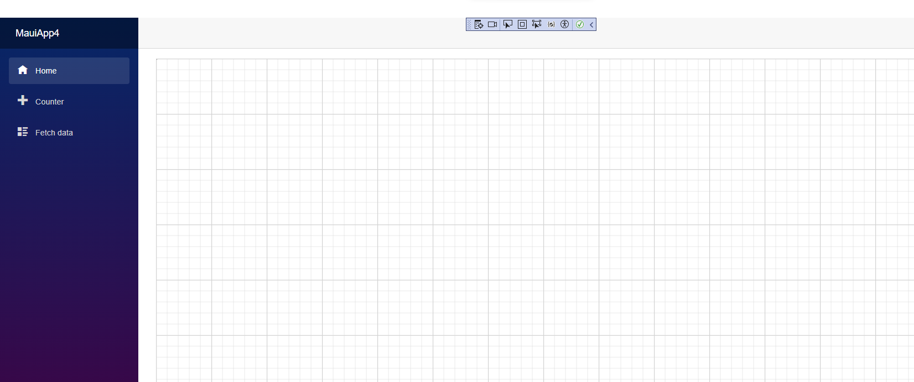
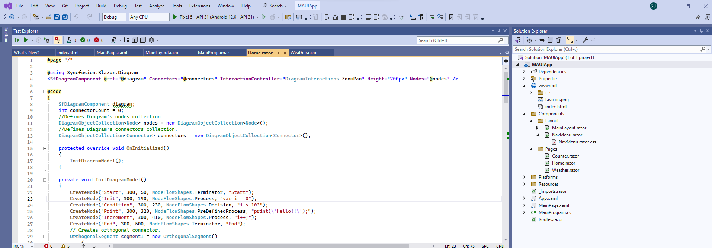
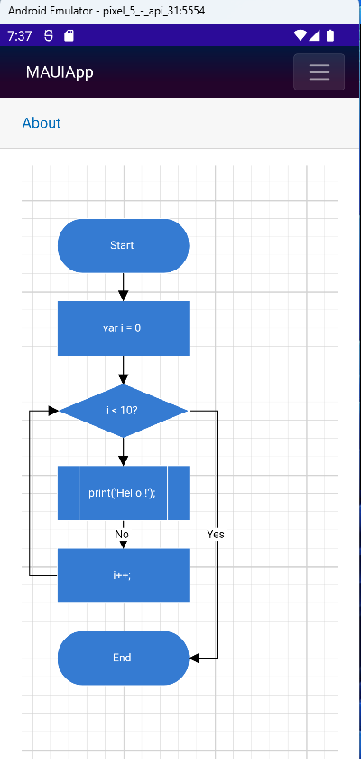

# Getting Started with the Diagram Component in the Blazor MAUI App

This guide walks through the step-by-step process of integrating the [Syncfusion<sup style="font-size:70%">&reg;</sup> Blazor Diagram](https://www.syncfusion.com/blazor-components/blazor-diagram) component in a Blazor MAUI App using both [Visual Studio](https://visualstudio.microsoft.com/vs/) and [Visual Studio Code](https://code.visualstudio.com/).

> **Ready to streamline your Syncfusion<sup style="font-size:70%">&reg;</sup> Blazor development?** <br/>Discover the full potential of Syncfusion<sup style="font-size:70%">&reg;</sup> Blazor components with Syncfusion<sup style="font-size:70%">&reg;</sup> AI Coding Assistants. Effortlessly integrate, configure, and enhance your projects with intelligent, context-aware code suggestions, streamlined setups, and real-time insights—all seamlessly integrated into your preferred AI-powered IDEs like VS Code, Cursor, Syncfusion<sup style="font-size:70%">&reg;</sup> CodeStudio and more. [Explore Syncfusion<sup style="font-size:70%">&reg;</sup> AI Coding Assistants](https://blazor.syncfusion.com/documentation/ai-coding-assistant/overview)





## Prerequisites

To use the MAUI project templates, install the Mobile development with the .NET extension for Visual Studio. For more details, refer to [here](https://learn.microsoft.com/en-us/dotnet/MAUI/get-started/installation?tabs=vswin) or the [Syncfusion® Blazor Extension](https://blazor.syncfusion.com/documentation/visual-studio-integration/template-studio).

## Create a new Blazor MAUI App in Visual Studio

Create a Blazor MAUI App using Visual Studio via [Microsoft Templates](https://learn.microsoft.com/en-us/dotnet/maui/get-started/first-app?pivots=devices-windows&view=net-maui-9.0&tabs=vswin). For detailed instructions, refer to the [Blazor MAUI App Getting Started](https://blazor.syncfusion.com/documentation/getting-started/maui-blazor-app) documentation.





## Prerequisites

To use the MAUI project templates, install the Mobile development with the .NET extension for Visual Studio Code. For more details, refer to [here](https://learn.microsoft.com/en-us/dotnet/maui/get-started/installation?view=net-maui-9.0&tabs=visual-studio-code) or the [Syncfusion® Blazor Extension](https://blazor.syncfusion.com/documentation/visual-studio-code-integration/create-project).

## Create a new Blazor MAUI App in Visual Studio Code

Create a Blazor MAUI App using Visual Studio Code via [Microsoft Templates](https://learn.microsoft.com/en-us/dotnet/maui/get-started/first-app?pivots=devices-windows&view=net-maui-9.0&tabs=visual-studio-code) or the [Syncfusion® Blazor Extension](https://blazor.syncfusion.com/documentation/visual-studio-code-integration/create-project). For detailed instructions, refer to the [Blazor MAUI App Getting Started](https://blazor.syncfusion.com/documentation/getting-started/maui-blazor-app) documentation.

Alternatively, create a MAUI application by using the following command in the integrated terminal (<kbd>Ctrl</kbd>+<kbd>`</kbd>).




dotnet new maui-blazor -o MauiBlazorApp
cd MauiBlazorApp








## Install Syncfusion<sup style="font-size:70%">&reg;</sup> Blazor packages

Install [Syncfusion.Blazor.Diagram](https://www.nuget.org/packages/Syncfusion.Blazor.Diagram) and [Syncfusion.Blazor.Themes](https://www.nuget.org/packages/Syncfusion.Blazor.Themes/) NuGet packages in your project using the NuGet Package Manager in Visual Studio (*Tools → NuGet Package Manager → Manage NuGet Packages for Solution*), or the integrated terminal in Visual Studio Code (`dotnet add package`).

Alternatively, run the following commands in the Package Manager Console to achieve the same.




Install-Package Syncfusion.Blazor.Diagram -Version {{ site.releaseversion }}
Install-Package Syncfusion.Blazor.Themes -Version {{ site.releaseversion }}




N> All Syncfusion Blazor packages are available on [nuget.org](https://www.nuget.org/packages?q=syncfusion.blazor). See the [NuGet packages](https://blazor.syncfusion.com/documentation/nuget-packages) topic for details.

## Add import namespaces

After the packages are installed, open the **~/_Imports.razor** file and import the `Syncfusion.Blazor` and `Syncfusion.Blazor.Diagram` namespaces.




@using Syncfusion.Blazor 
@using Syncfusion.Blazor.Diagram




## Register Syncfusion<sup style="font-size:70%">&reg;</sup> Blazor service

Register the Syncfusion<sup style="font-size:70%">&reg;</sup> Blazor service in the **~/MauiProgram.cs** file.




....
using Syncfusion.Blazor;

....

public static class MauiProgram
{
    public static MauiApp CreateMauiApp()
    {
        ....
        builder.Services.AddSyncfusionBlazor();
        ....
    }
}




## Add stylesheet and script resources

The theme stylesheet and script can be accessed from NuGet through [Static Web Assets](https://blazor.syncfusion.com/documentation/appearance/themes#static-web-assets). Include the stylesheet and script references in the **~/index.html** file.

```html

<link href="_content/Syncfusion.Blazor.Themes/fluent2.css" rel="stylesheet" />
<script src="_content/Syncfusion.Blazor.Core/scripts/syncfusion-blazor.min.js" type="text/javascript"></script>

```

N> Check out the [Blazor Themes](https://blazor.syncfusion.com/documentation/appearance/themes) topic to discover various methods ([Static Web Assets](https://blazor.syncfusion.com/documentation/appearance/themes#static-web-assets), [CDN](https://blazor.syncfusion.com/documentation/appearance/themes#cdn-reference), and [CRG](https://blazor.syncfusion.com/documentation/common/custom-resource-generator)) for referencing themes in your Blazor application. Also, check out the [Adding Script Reference](https://blazor.syncfusion.com/documentation/common/adding-script-references) topic to learn different approaches for adding script references in your Blazor application.

## Add Syncfusion<sup style="font-size:70%">&reg;</sup> Blazor Diagram component

Add the Syncfusion<sup style="font-size:70%">&reg;</sup> Diagram component in the **~/Pages/Home.razor** file.




@using Syncfusion.Blazor.Diagram

<SfDiagramComponent @ref="@diagram" Connectors="@connectors" Height="700px" Nodes="@nodes" />

@code
{
    SfDiagramComponent diagram;
    int connectorCount = 0;
    //Defines Diagram's nodes collection.
    DiagramObjectCollection<Node> nodes = new DiagramObjectCollection<Node>();
    //Defines Diagram's connectors collection.
    DiagramObjectCollection<Connector> connectors = new DiagramObjectCollection<Connector>();

    protected override void OnInitialized()
    {
        InitDiagramModel();
    }

    private void InitDiagramModel()
    {
        CreateNode("Start", 300, 50, NodeFlowShapes.Terminator, "Start");
        CreateNode("Init", 300, 140, NodeFlowShapes.Process, "var i = 0");
        CreateNode("Condition", 300, 230, NodeFlowShapes.Decision, "i < 10?");
        CreateNode("Print", 300, 320, NodeFlowShapes.PreDefinedProcess, "print(\'Hello!!\');");
        CreateNode("Increment", 300, 410, NodeFlowShapes.Process, "i++;");
        CreateNode("End", 300, 500, NodeFlowShapes.Terminator, "End");
        // Creates orthogonal connector.
        OrthogonalSegment segment1 = new OrthogonalSegment()
        {
            Type = ConnectorSegmentType.Orthogonal,
            Direction = Direction.Right,
            Length = 30,
        };
        OrthogonalSegment segment2 = new OrthogonalSegment()
        {
            Type = ConnectorSegmentType.Orthogonal,
            Length = 300,
            Direction = Direction.Bottom,
        };
        OrthogonalSegment segment3 = new OrthogonalSegment()
        {
            Type = ConnectorSegmentType.Orthogonal,
            Length = 30,
            Direction = Direction.Left,
        };
        OrthogonalSegment segment4 = new OrthogonalSegment()
        {
            Type = ConnectorSegmentType.Orthogonal,
            Length = 200,
            Direction = Direction.Top,
        };
        CreateConnector("Start", "Init");
        CreateConnector("Init", "Condition");
        CreateConnector("Condition", "Print");
        CreateConnector("Condition", "End", "Yes", segment1, segment2);
        CreateConnector("Print", "Increment", "No");
        CreateConnector("Increment", "Condition", null, segment3, segment4);
    }

    // Method to create connector.
    private void CreateConnector(string sourceId, string targetId, string label = default(string), OrthogonalSegment segment1 = null, OrthogonalSegment segment2 = null)
    {
        Connector diagramConnector = new Connector()
        {
            // Represents the unique id of the connector.
            ID = string.Format("connector{0}", ++connectorCount),
            SourceID = sourceId,
            TargetID = targetId,
        };
        if (label != default(string))
        {
            // Represents the annotation of the connector.
            PathAnnotation annotation = new PathAnnotation()
            {
                Content = label,
                Style = new TextStyle() { Fill = "white" }
            };
            diagramConnector.Annotations = new DiagramObjectCollection<PathAnnotation>() { annotation };
        }
        if (segment1 != null)
        {
            // Represents the segment type of the connector.
            diagramConnector.Type = ConnectorSegmentType.Orthogonal;
            diagramConnector.Segments = new DiagramObjectCollection<ConnectorSegment> { segment1, segment2 };
        }
        connectors.Add(diagramConnector);
    }

    // Method to create node.
    private void CreateNode(string id, double x, double y, NodeFlowShapes shape, string label)
    {
        Node diagramNode = new Node()
        {
            //Represents the unique id of the node.
            ID = id,
            // Defines the position of the node.
            OffsetX = x,
            OffsetY = y,
            // Defines the size of the node.
            Width = 145,
            Height = 60,
            // Defines the style of the node.
            Style = new ShapeStyle { Fill = "#357BD2", StrokeColor = "White" },
            // Defines the shape of the node.
            Shape = new FlowShape() { Type = NodeShapes.Flow, Shape = shape },
            // Defines the annotation collection of the node.
            Annotations = new DiagramObjectCollection<ShapeAnnotation>
            {
                new ShapeAnnotation
                {
                    Content = label,
                    Style = new TextStyle()
                    {
                        Color="White",
                        Fill = "transparent"
                    }
                }
            }
        };
        nodes.Add(diagramNode);
    }
}




N> [View sample in GitHub](https://github.com/SyncfusionExamples/Blazor-Getting-Started-Examples/tree/main/DiagramComponent).

## How to run the sample on windows

Run the sample in Windows Machine mode, and it will run Blazor MAUI in Windows.


When the application is successfully launched, the Diagram component will seamlessly render the specified diagram page.



## How to run the sample on Android

To run the Blazor Diagram component in a Blazor Android MAUI application using the Android emulator, follow these steps:



Refer [here](https://learn.microsoft.com/en-us/dotnet/maui/android/emulator/device-manager#android-device-manager-on-windows) to install and launch Android emulator.

N> If encounter any errors while using the Android Emulator, refer to the following link for troubleshooting guidance[Troubleshooting Android Emulator](https://learn.microsoft.com/en-us/dotnet/maui/android/emulator/troubleshooting).



## See also

* [How to Create a Diagram Builder in MAUI platform](https://support.syncfusion.com/kb/article/11346/how-to-create-diagram-builder-in-maui-platform)
