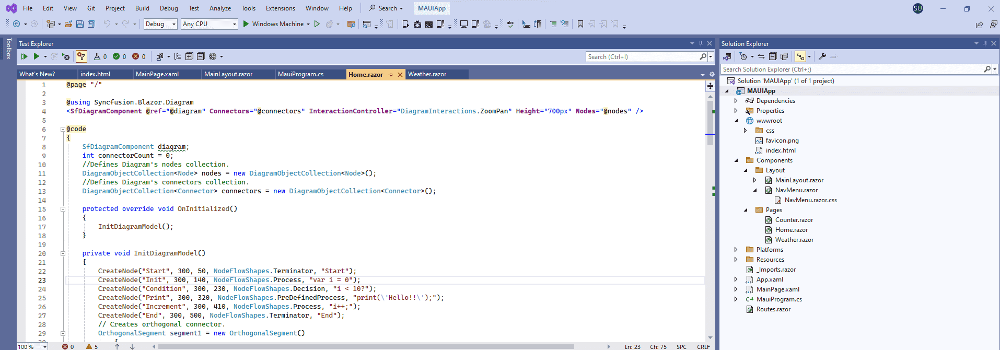

# Getting Started with Diagram Component in the Blazor MAUI app.

In this section, we'll guide you through the process of adding Syncfusion's Blazor Diagram Component to your Blazor Maui app. We'll break it down into simple steps to make it easy to follow. Additionally, you can find a fully functional example project on our [GitHub repository](https://github.com/SyncfusionExamples/Blazor-Getting-Started-Examples/tree/main/DiagramComponent/BlazorMAUIApp/DiagramSample).

## Prerequisites

To use the MAUI project templates, install the Mobile development with the .NET extension for Visual Studio. For more details, refer to [here](https://learn.microsoft.com/en-us/dotnet/MAUI/get-started/installation?tabs=vswin).

## Create a new Blazor MAUI App in Visual Studio

Create a new Blazor MAUI app and name it **DiagramComponentGettingStarted**.


## Install Diagram NuGet package in Blazor Maui App

Add the following NuGet packages into the Blazor Maui app.

* [Syncfusion.Blazor.Diagram](https://www.nuget.org/packages/Syncfusion.Blazor.Diagram) 
* [Syncfusion.Blazor.Themes](https://www.nuget.org/packages/Syncfusion.Blazor.Themes)

## Register Syncfusion Blazor Service

* In the **~/_Imports.razor** file, add the following namespaces:




@using Syncfusion.Blazor 
@using Syncfusion.Blazor.Diagram




* Register the Syncfusion Blazor Service in the **~/MauiProgram.cs** file.




using Microsoft.Extensions.Logging;
using MauiBlazorWindow.Data;
using Syncfusion.Blazor;

namespace MauiBlazorWindow;

    public static class MauiProgram
    {
        public static MauiApp CreateMauiApp()
        {
            var builder = MauiApp.CreateBuilder();
            builder
                .UseMauiApp<App>()
                .ConfigureFonts(fonts =>
                {
                    fonts.AddFont("OpenSans-Regular.ttf", "OpenSansRegular");
                });

            builder.Services.AddMauiBlazorWebView();
            builder.Services.AddSyncfusionBlazor();
#if DEBUG
            builder.Services.AddBlazorWebViewDeveloperTools();
    		builder.Logging.AddDebug();
#endif

            return builder.Build();
        }
    }




## Adding stylesheet and script

Add the following stylesheet and script to the head section of the **~/wwwroot/index.html** file.

If you are using Syncfusion.Blazor && Syncfusion.Blazor.Themes NuGet package in your application, refer to the following script.
```html
<head>
    ....
    <link href="_content/Syncfusion.Blazor.Themes/bootstrap5.css" rel="stylesheet" />
    <script src="_content/Syncfusion.Blazor/scripts/syncfusion-blazor.min.js" type="text/javascript"></script>
</head>
```
If you are using Syncfusion.Blazor.Diagram && Syncfusion.Blazor.Themes NuGet package in your application, refer to the following script.
```html
<head>
    ....
    <link href="_content/Syncfusion.Blazor.Themes/bootstrap5.css" rel="stylesheet" />
    <script src="_content/Syncfusion.Blazor.Core/scripts/syncfusion-blazor.min.js" type="text/javascript"></script>
</head>
```

## Add Diagram component

Add the Syncfusion Diagram component in the **~/Pages/Index.razor** file.




@page "/"

@using Syncfusion.Blazor.Diagram

<SfDiagramComponent @ref="@diagram" Connectors="@connectors" Height="700px" Nodes="@nodes" />

@code
{
    SfDiagramComponent diagram;
    int connectorCount = 0;
    //Defines Diagram's nodes collection.
    DiagramObjectCollection<Node> nodes = new DiagramObjectCollection<Node>();
    //Defines Diagram's connectors collection.
    DiagramObjectCollection<Connector> connectors = new DiagramObjectCollection<Connector>();

    protected override void OnInitialized()
    {
        InitDiagramModel();
    }

    private void InitDiagramModel()
    {
        CreateNode("Start", 300, 50, NodeFlowShapes.Terminator, "Start");
        CreateNode("Init", 300, 140, NodeFlowShapes.Process, "var i = 0");
        CreateNode("Condition", 300, 230, NodeFlowShapes.Decision, "i < 10?");
        CreateNode("Print", 300, 320, NodeFlowShapes.PreDefinedProcess, "print(\'Hello!!\');");
        CreateNode("Increment", 300, 410, NodeFlowShapes.Process, "i++;");
        CreateNode("End", 300, 500, NodeFlowShapes.Terminator, "End");
        // Creates orthogonal connector.
        OrthogonalSegment segment1 = new OrthogonalSegment()
        {
            Type = ConnectorSegmentType.Orthogonal,
            Direction = Direction.Right,
            Length = 30,
        };
        OrthogonalSegment segment2 = new OrthogonalSegment()
        {
            Type = ConnectorSegmentType.Orthogonal,
            Length = 300,
            Direction = Direction.Bottom,
        };
        OrthogonalSegment segment3 = new OrthogonalSegment()
        {
            Type = ConnectorSegmentType.Orthogonal,
            Length = 30,
            Direction = Direction.Left,
        };
        OrthogonalSegment segment4 = new OrthogonalSegment()
        {
            Type = ConnectorSegmentType.Orthogonal,
            Length = 200,
            Direction = Direction.Top,
        };
        CreateConnector("Start", "Init");
        CreateConnector("Init", "Condition");
        CreateConnector("Condition", "Print");
        CreateConnector("Condition", "End", "Yes", segment1, segment2);
        CreateConnector("Print", "Increment", "No");
        CreateConnector("Increment", "Condition", null, segment3, segment4);
    }

    // Method to create connector.
    private void CreateConnector(string sourceId, string targetId, string label = default(string), OrthogonalSegment segment1 = null, OrthogonalSegment segment2 = null)
    {
        Connector diagramConnector = new Connector()
        {
            // Represents the unique id of the connector.
            ID = string.Format("connector{0}", ++connectorCount),
            SourceID = sourceId,
            TargetID = targetId,
        };
        if (label != default(string))
        {
            // Represents the annotation of the connector.
            PathAnnotation annotation = new PathAnnotation()
            {
                Content = label,
                Style = new TextStyle() { Fill = "white" }
            };
            diagramConnector.Annotations = new DiagramObjectCollection<PathAnnotation>() { annotation };
        }
        if (segment1 != null)
        {
            // Represents the segment type of the connector.
            diagramConnector.Type = ConnectorSegmentType.Orthogonal;
            diagramConnector.Segments = new DiagramObjectCollection<ConnectorSegment> { segment1, segment2 };
        }
        connectors.Add(diagramConnector);
    }

    // Method to create node.
    private void CreateNode(string id, double x, double y, NodeFlowShapes shape, string label)
    {
        Node diagramNode = new Node()
        {
            //Represents the unique id of the node.
            ID = id,
            // Defines the position of the node.
            OffsetX = x,
            OffsetY = y,
            // Defines the size of the node.
            Width = 145,
            Height = 60,
            // Defines the style of the node.
            Style = new ShapeStyle { Fill = "#357BD2", StrokeColor = "White" },
            // Defines the shape of the node.
            Shape = new FlowShape() { Type = NodeShapes.Flow, Shape = shape },
            // Defines the annotation collection of the node.
            Annotations = new DiagramObjectCollection<ShapeAnnotation>
            {
                new ShapeAnnotation
                {
                    Content = label,
                    Style = new TextStyle()
                    {
                        Color="White",
                        Fill = "transparent"
                    }
                }
            }
        };
        nodes.Add(diagramNode);
    }
}




N> [View Sample in GitHub](https://github.com/SyncfusionExamples/Blazor-Getting-Started-Examples/tree/main/DiagramComponent/BlazorMAUIApp/DiagramSample).

## Run on Windows

Run the sample in Windows Machine mode, and it will run Blazor MAUI in Windows.



When the application is successfully launched, the Diagram component will seamlessly render the specified diagram page.


## Run on Android

To run the Blazor DiagramComponent in a Blazor Android MAUI application using the Android emulator, follow these steps:


Refer [here](https://learn.microsoft.com/en-us/dotnet/maui/android/emulator/device-manager#android-device-manager-on-windows) to install and launch Android emulator.

N> If you encounter any errors while using the Android Emulator, refer to the following link for troubleshooting guidance[Troubleshooting Android Emulator](https://learn.microsoft.com/en-us/dotnet/maui/android/emulator/troubleshooting).

