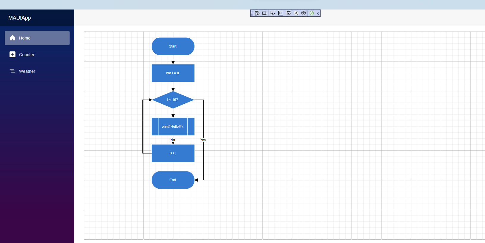

# Getting Started with the Diagram Component in the Blazor MAUI App

This guide walks through the step-by-step process of integrating the Syncfusion<sup style="font-size:70%">&reg;</sup> Blazor Diagram component into a Blazor MAUI application using either Visual Studio or Visual Studio Code.

> **Ready to streamline your Syncfusion<sup style="font-size:70%">&reg;</sup> Blazor development?** <br/>Discover the full potential of Syncfusion<sup style="font-size:70%">&reg;</sup> Blazor components with Syncfusion<sup style="font-size:70%">&reg;</sup> AI Coding Assistants. Effortlessly integrate, configure, and enhance your projects with intelligent, context-aware code suggestions, streamlined setups, and real-time insights—all seamlessly integrated into your preferred AI-powered IDEs like VS Code, Cursor, Syncfusion<sup style="font-size:70%">&reg;</sup> CodeStudio and more. [Explore Syncfusion<sup style="font-size:70%">&reg;</sup> AI Coding Assistants](https://blazor.syncfusion.com/documentation/ai-coding-assistants/overview)

Additionally, you can find a fully functional example project on our [GitHub repository](https://github.com/SyncfusionExamples/Blazor-Getting-Started-Examples/tree/main/DiagramComponent/BlazorMAUIApp/DiagramSample).





## Prerequisites

To use the MAUI project templates, install the Mobile development with the .NET extension for Visual Studio. For more details, refer to [here](https://learn.microsoft.com/en-us/dotnet/MAUI/get-started/installation?tabs=vswin) or the [Syncfusion® Blazor Extension](https://blazor.syncfusion.com/documentation/visual-studio-integration/template-studio).

## Step 1: How to Create a New Blazor MAUI App in Visual Studio

Create a Blazor MAUI App using Visual Studio via [Microsoft Templates](https://learn.microsoft.com/en-us/dotnet/maui/get-started/first-app?pivots=devices-windows&view=net-maui-9.0&tabs=vswin). For detailed instructions, refer to [this Blazor MAUI App Getting Started](https://blazor.syncfusion.com/documentation/getting-started/maui-blazor-app) documentation.

## Step 2: How to Install Diagram NuGet Package in Blazor MAUI App

To add the **Blazor Diagram**  component in the app, open the NuGet package manager in Visual Studio (Tools → NuGet Package Manager → Manage NuGet Packages for Solution), search and install [Syncfusion.Blazor.Diagram](https://www.nuget.org/packages/Syncfusion.Blazor.Diagram) and [Syncfusion.Blazor.Themes](https://www.nuget.org/packages/Syncfusion.Blazor.Themes/).




Install-Package Syncfusion.Blazor.Diagram -Version {{ site.releaseversion }}
Install-Package Syncfusion.Blazor.Themes -Version {{ site.releaseversion }}




N> Syncfusion<sup style="font-size:70%">&reg;</sup> Blazor components are available on [nuget.org](https://www.nuget.org/packages?q=syncfusion.blazor). Refer to [NuGet packages](https://blazor.syncfusion.com/documentation/nuget-packages) topic for available NuGet packages list with component details.

## Step 3: Add Import Namespaces

Open the **~/_Imports.razor** file and import the `Syncfusion.Blazor` and `Syncfusion.Blazor.Diagram` namespace.




@using Syncfusion.Blazor 
@using Syncfusion.Blazor.Diagram





## Step 4: How to Register Syncfusion<sup style="font-size:70%">&reg;</sup> Blazor Service

Register the Syncfusion<sup style="font-size:70%">&reg;</sup> Blazor service in the **~/MauiProgram.cs** file.




using Microsoft.Extensions.Logging;
using MauiBlazorWindow.Data;
using Syncfusion.Blazor;

namespace MauiBlazorWindow;

    public static class MauiProgram
    {
        public static MauiApp CreateMauiApp()
        {
            var builder = MauiApp.CreateBuilder();
            builder
                .UseMauiApp<App>()
                .ConfigureFonts(fonts =>
                {
                    fonts.AddFont("OpenSans-Regular.ttf", "OpenSansRegular");
                });

            builder.Services.AddMauiBlazorWebView();
            builder.Services.AddSyncfusionBlazor();
#if DEBUG
            builder.Services.AddBlazorWebViewDeveloperTools();
    		builder.Logging.AddDebug();
#endif

            return builder.Build();
        }
    }




## Step 5: How to Add Stylesheet and Script Resources

Add the following stylesheet and script to the head section of the **~/wwwroot/index.html** file.

If using Syncfusion.Blazor && Syncfusion.Blazor.Themes NuGet package in your application, refer to the following script.
```html
<head>
    ....
    <link href="_content/Syncfusion.Blazor.Themes/bootstrap5.css" rel="stylesheet" />
    <script src="_content/Syncfusion.Blazor/scripts/syncfusion-blazor.min.js" type="text/javascript"></script>
</head>
```
If using Syncfusion.Blazor.Diagram && Syncfusion.Blazor.Themes NuGet package in your application, refer to the following script.
```html
<head>
    ....
    <link href="_content/Syncfusion.Blazor.Themes/bootstrap5.css" rel="stylesheet" />
    <script src="_content/Syncfusion.Blazor.Core/scripts/syncfusion-blazor.min.js" type="text/javascript"></script>
</head>
```

## Step 6: How to Add the Diagram Component

Add the Syncfusion<sup style="font-size:70%">&reg;</sup> Diagram component in the **~/Pages/Index.razor** file.




@page "/"

@using Syncfusion.Blazor.Diagram

<SfDiagramComponent @ref="@diagram" Connectors="@connectors" Height="700px" Nodes="@nodes" />

@code
{
    SfDiagramComponent diagram;
    int connectorCount = 0;
    //Defines Diagram's nodes collection.
    DiagramObjectCollection<Node> nodes = new DiagramObjectCollection<Node>();
    //Defines Diagram's connectors collection.
    DiagramObjectCollection<Connector> connectors = new DiagramObjectCollection<Connector>();

    protected override void OnInitialized()
    {
        InitDiagramModel();
    }

    private void InitDiagramModel()
    {
        CreateNode("Start", 300, 50, NodeFlowShapes.Terminator, "Start");
        CreateNode("Init", 300, 140, NodeFlowShapes.Process, "var i = 0");
        CreateNode("Condition", 300, 230, NodeFlowShapes.Decision, "i < 10?");
        CreateNode("Print", 300, 320, NodeFlowShapes.PreDefinedProcess, "print(\'Hello!!\');");
        CreateNode("Increment", 300, 410, NodeFlowShapes.Process, "i++;");
        CreateNode("End", 300, 500, NodeFlowShapes.Terminator, "End");
        // Creates orthogonal connector.
        OrthogonalSegment segment1 = new OrthogonalSegment()
        {
            Type = ConnectorSegmentType.Orthogonal,
            Direction = Direction.Right,
            Length = 30,
        };
        OrthogonalSegment segment2 = new OrthogonalSegment()
        {
            Type = ConnectorSegmentType.Orthogonal,
            Length = 300,
            Direction = Direction.Bottom,
        };
        OrthogonalSegment segment3 = new OrthogonalSegment()
        {
            Type = ConnectorSegmentType.Orthogonal,
            Length = 30,
            Direction = Direction.Left,
        };
        OrthogonalSegment segment4 = new OrthogonalSegment()
        {
            Type = ConnectorSegmentType.Orthogonal,
            Length = 200,
            Direction = Direction.Top,
        };
        CreateConnector("Start", "Init");
        CreateConnector("Init", "Condition");
        CreateConnector("Condition", "Print");
        CreateConnector("Condition", "End", "Yes", segment1, segment2);
        CreateConnector("Print", "Increment", "No");
        CreateConnector("Increment", "Condition", null, segment3, segment4);
    }

    // Method to create connector.
    private void CreateConnector(string sourceId, string targetId, string label = default(string), OrthogonalSegment segment1 = null, OrthogonalSegment segment2 = null)
    {
        Connector diagramConnector = new Connector()
        {
            // Represents the unique id of the connector.
            ID = string.Format("connector{0}", ++connectorCount),
            SourceID = sourceId,
            TargetID = targetId,
        };
        if (label != default(string))
        {
            // Represents the annotation of the connector.
            PathAnnotation annotation = new PathAnnotation()
            {
                Content = label,
                Style = new TextStyle() { Fill = "white" }
            };
            diagramConnector.Annotations = new DiagramObjectCollection<PathAnnotation>() { annotation };
        }
        if (segment1 != null)
        {
            // Represents the segment type of the connector.
            diagramConnector.Type = ConnectorSegmentType.Orthogonal;
            diagramConnector.Segments = new DiagramObjectCollection<ConnectorSegment> { segment1, segment2 };
        }
        connectors.Add(diagramConnector);
    }

    // Method to create node.
    private void CreateNode(string id, double x, double y, NodeFlowShapes shape, string label)
    {
        Node diagramNode = new Node()
        {
            //Represents the unique id of the node.
            ID = id,
            // Defines the position of the node.
            OffsetX = x,
            OffsetY = y,
            // Defines the size of the node.
            Width = 145,
            Height = 60,
            // Defines the style of the node.
            Style = new ShapeStyle { Fill = "#357BD2", StrokeColor = "White" },
            // Defines the shape of the node.
            Shape = new FlowShape() { Type = NodeShapes.Flow, Shape = shape },
            // Defines the annotation collection of the node.
            Annotations = new DiagramObjectCollection<ShapeAnnotation>
            {
                new ShapeAnnotation
                {
                    Content = label,
                    Style = new TextStyle()
                    {
                        Color="White",
                        Fill = "transparent"
                    }
                }
            }
        };
        nodes.Add(diagramNode);
    }
}




N> [View Sample in GitHub](https://github.com/SyncfusionExamples/Blazor-Getting-Started-Examples/tree/main/DiagramComponent/BlazorMAUIApp/DiagramSample).

## How to Run the Sample on Windows

Run the sample in Windows Machine mode, and it will run Blazor MAUI in Windows.


When the application is successfully launched, the Diagram component will seamlessly render the specified diagram page.



## How to Run the Sample on Android

To run the Blazor DiagramComponent in a Blazor Android MAUI application using the Android emulator, follow these steps:


Refer [here](https://learn.microsoft.com/en-us/dotnet/maui/android/emulator/device-manager#android-device-manager-on-windows) to install and launch Android emulator.

N> If encounter any errors while using the Android Emulator, refer to the following link for troubleshooting guidance[Troubleshooting Android Emulator](https://learn.microsoft.com/en-us/dotnet/maui/android/emulator/troubleshooting).






## Prerequisites

To use the MAUI project templates, install the Mobile development with the .NET extension for Visual Studio Code. For more details, refer to [here](https://learn.microsoft.com/en-us/dotnet/maui/get-started/installation?view=net-maui-9.0&tabs=visual-studio-code) or the [Syncfusion® Blazor Extension](https://blazor.syncfusion.com/documentation/visual-studio-code-integration/create-project).

## Step 1: How to Create a New Blazor MAUI App Using Visual Studio Code

Create a Blazor MAUI App using Visual Studio Code via [Microsoft Templates](https://learn.microsoft.com/en-us/dotnet/maui/get-started/first-app?pivots=devices-windows&view=net-maui-9.0&tabs=visual-studio-code) or the [Syncfusion® Blazor Extension](https://blazor.syncfusion.com/documentation/visual-studio-code-integration/create-project). For detailed instructions, refer to [this Blazor MAUI App Getting Started](https://blazor.syncfusion.com/documentation/getting-started/maui-blazor-app) documentation.

## Step 2: How to Install Diagram NuGet Packages in a Blazor MAUI App

To add the **Blazor Diagram**  component in the app, open the NuGet package manager in Visual Studio (Tools → NuGet Package Manager → Manage NuGet Packages for Solution), search and install [Syncfusion.Blazor.Diagram](https://www.nuget.org/packages/Syncfusion.Blazor.Diagram) and [Syncfusion.Blazor.Themes](https://www.nuget.org/packages/Syncfusion.Blazor.Themes/).





dotnet add package Syncfusion.Blazor.Diagram -v {{ site.releaseversion }}
dotnet add package Syncfusion.Blazor.Themes -v {{ site.releaseversion }}
dotnet restore





N> Syncfusion<sup style="font-size:70%">&reg;</sup> Blazor components are available on [nuget.org](https://www.nuget.org/packages?q=syncfusion.blazor). Refer to [NuGet packages](https://blazor.syncfusion.com/documentation/nuget-packages) topic for available NuGet packages list with component details.

## Step 3: Add Import Namespaces

Open the **~/_Imports.razor** file and import the `Syncfusion.Blazor` and `Syncfusion.Blazor.Diagram` namespace.




@using Syncfusion.Blazor 
@using Syncfusion.Blazor.Diagram




## Step 4: How to Register Syncfusion<sup style="font-size:70%">&reg;</sup> Blazor Service

* Register the Syncfusion<sup style="font-size:70%">&reg;</sup> Blazor service in the **~/MauiProgram.cs** file.




using Microsoft.Extensions.Logging;
using MauiBlazorWindow.Data;
using Syncfusion.Blazor;

namespace MauiBlazorWindow;

    public static class MauiProgram
    {
        public static MauiApp CreateMauiApp()
        {
            var builder = MauiApp.CreateBuilder();
            builder
                .UseMauiApp<App>()
                .ConfigureFonts(fonts =>
                {
                    fonts.AddFont("OpenSans-Regular.ttf", "OpenSansRegular");
                });

            builder.Services.AddMauiBlazorWebView();
            builder.Services.AddSyncfusionBlazor();
#if DEBUG
            builder.Services.AddBlazorWebViewDeveloperTools();
    		builder.Logging.AddDebug();
#endif

            return builder.Build();
        }
    }




## Step 5: How to Add Stylesheet and Script Resources

Add the following stylesheet and script to the head section of the **~/wwwroot/index.html** file.

If using Syncfusion.Blazor && Syncfusion.Blazor.Themes NuGet package in your application, refer to the following script.
```html
<head>
    ....
    <link href="_content/Syncfusion.Blazor.Themes/bootstrap5.css" rel="stylesheet" />
    <script src="_content/Syncfusion.Blazor/scripts/syncfusion-blazor.min.js" type="text/javascript"></script>
</head>
```
If using `Syncfusion.Blazor.Diagram` && `Syncfusion.Blazor.Themes` NuGet package in your application, refer to the following script.
```html
<head>
    ....
    <link href="_content/Syncfusion.Blazor.Themes/bootstrap5.css" rel="stylesheet" />
    <script src="_content/Syncfusion.Blazor.Core/scripts/syncfusion-blazor.min.js" type="text/javascript"></script>
</head>
```

## Step 6: How to Add the Diagram Component

Add the Syncfusion<sup style="font-size:70%">&reg;</sup> Diagram component in the **~/Pages/Index.razor** file.




@page "/"

@using Syncfusion.Blazor.Diagram

<SfDiagramComponent @ref="@diagram" Connectors="@connectors" Height="700px" Nodes="@nodes" />

@code
{
    SfDiagramComponent diagram;
    int connectorCount = 0;
    //Defines Diagram's nodes collection.
    DiagramObjectCollection<Node> nodes = new DiagramObjectCollection<Node>();
    //Defines Diagram's connectors collection.
    DiagramObjectCollection<Connector> connectors = new DiagramObjectCollection<Connector>();

    protected override void OnInitialized()
    {
        InitDiagramModel();
    }

    private void InitDiagramModel()
    {
        CreateNode("Start", 300, 50, NodeFlowShapes.Terminator, "Start");
        CreateNode("Init", 300, 140, NodeFlowShapes.Process, "var i = 0");
        CreateNode("Condition", 300, 230, NodeFlowShapes.Decision, "i < 10?");
        CreateNode("Print", 300, 320, NodeFlowShapes.PreDefinedProcess, "print(\'Hello!!\');");
        CreateNode("Increment", 300, 410, NodeFlowShapes.Process, "i++;");
        CreateNode("End", 300, 500, NodeFlowShapes.Terminator, "End");
        // Creates orthogonal connector.
        OrthogonalSegment segment1 = new OrthogonalSegment()
        {
            Type = ConnectorSegmentType.Orthogonal,
            Direction = Direction.Right,
            Length = 30,
        };
        OrthogonalSegment segment2 = new OrthogonalSegment()
        {
            Type = ConnectorSegmentType.Orthogonal,
            Length = 300,
            Direction = Direction.Bottom,
        };
        OrthogonalSegment segment3 = new OrthogonalSegment()
        {
            Type = ConnectorSegmentType.Orthogonal,
            Length = 30,
            Direction = Direction.Left,
        };
        OrthogonalSegment segment4 = new OrthogonalSegment()
        {
            Type = ConnectorSegmentType.Orthogonal,
            Length = 200,
            Direction = Direction.Top,
        };
        CreateConnector("Start", "Init");
        CreateConnector("Init", "Condition");
        CreateConnector("Condition", "Print");
        CreateConnector("Condition", "End", "Yes", segment1, segment2);
        CreateConnector("Print", "Increment", "No");
        CreateConnector("Increment", "Condition", null, segment3, segment4);
    }

    // Method to create connector.
    private void CreateConnector(string sourceId, string targetId, string label = default(string), OrthogonalSegment segment1 = null, OrthogonalSegment segment2 = null)
    {
        Connector diagramConnector = new Connector()
        {
            // Represents the unique id of the connector.
            ID = string.Format("connector{0}", ++connectorCount),
            SourceID = sourceId,
            TargetID = targetId,
        };
        if (label != default(string))
        {
            // Represents the annotation of the connector.
            PathAnnotation annotation = new PathAnnotation()
            {
                Content = label,
                Style = new TextStyle() { Fill = "white" }
            };
            diagramConnector.Annotations = new DiagramObjectCollection<PathAnnotation>() { annotation };
        }
        if (segment1 != null)
        {
            // Represents the segment type of the connector.
            diagramConnector.Type = ConnectorSegmentType.Orthogonal;
            diagramConnector.Segments = new DiagramObjectCollection<ConnectorSegment> { segment1, segment2 };
        }
        connectors.Add(diagramConnector);
    }

    // Method to create node.
    private void CreateNode(string id, double x, double y, NodeFlowShapes shape, string label)
    {
        Node diagramNode = new Node()
        {
            //Represents the unique id of the node.
            ID = id,
            // Defines the position of the node.
            OffsetX = x,
            OffsetY = y,
            // Defines the size of the node.
            Width = 145,
            Height = 60,
            // Defines the style of the node.
            Style = new ShapeStyle { Fill = "#357BD2", StrokeColor = "White" },
            // Defines the shape of the node.
            Shape = new FlowShape() { Type = NodeShapes.Flow, Shape = shape },
            // Defines the annotation collection of the node.
            Annotations = new DiagramObjectCollection<ShapeAnnotation>
            {
                new ShapeAnnotation
                {
                    Content = label,
                    Style = new TextStyle()
                    {
                        Color="White",
                        Fill = "transparent"
                    }
                }
            }
        };
        nodes.Add(diagramNode);
    }
}






N> [View the Sample in GitHub](https://github.com/SyncfusionExamples/Blazor-Getting-Started-Examples/tree/main/DiagramComponent/BlazorMAUIApp/DiagramSample).

## How to Run the Sample on Windows

Run the sample in Windows Machine mode, and it will run Blazor MAUI in Windows.


When the application is successfully launched, the Diagram component will seamlessly render the specified diagram page.


## How to Run the Sample on Android

To run the Blazor Diagram Component in a Blazor Android MAUI application using the Android emulator, follow these steps:


Refer [here](https://learn.microsoft.com/en-us/dotnet/maui/android/emulator/device-manager#android-device-manager-on-windows) to install and launch Android emulator.

N> If you encounter any errors while using the Android Emulator, refer to the following link for troubleshooting guidance[Troubleshooting Android Emulator](https://learn.microsoft.com/en-us/dotnet/maui/android/emulator/troubleshooting).






## See also

* [How to Create a Diagram Builder in MAUI platform](https://support.syncfusion.com/kb/article/11346/how-to-create-diagram-builder-in-maui-platform)
