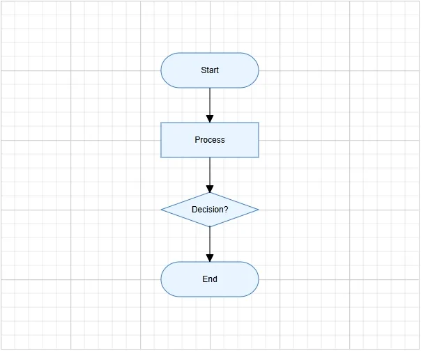

# Getting Started with Blazor Diagram Component in Blazor Web App

This section briefly explains how to include the [Blazor Diagram](https://www.syncfusion.com/blazor-components/blazor-diagram) component in your Blazor Web App using [Visual Studio](https://visualstudio.microsoft.com/vs/), [Visual Studio Code](https://code.visualstudio.com/), and the [.NET CLI](https://learn.microsoft.com/en-us/dotnet/core/tools/).

> **Ready to streamline your Blazor development?**  Discover the full potential of Blazor components with AI Coding Assistants. Effortlessly integrate, configure, and enhance your projects with intelligent, context-aware code suggestions, streamlined setups, and real-time insights—all seamlessly integrated into your preferred AI-powered IDEs like VS Code, Cursor, CodeStudio and more. [Explore AI Coding Assistants](https://blazor.syncfusion.com/documentation/ai-coding-assistant/overview)

### Create a new Blazor Web App





Create a **Blazor Web App** using Visual Studio via [Microsoft Templates](https://learn.microsoft.com/en-us/aspnet/core/blazor/tooling?view=aspnetcore-10.0&pivots=vs) or the [Blazor Extension](https://blazor.syncfusion.com/documentation/visual-studio-integration/template-studio).





Run the following command to create a new Blazor Web App.




dotnet new blazor -o BlazorWebApp --interactivity Auto




Alternatively, create a **Blazor Web App** using Visual Studio Code via [Microsoft Templates](https://learn.microsoft.com/en-us/aspnet/core/blazor/tooling?view=aspnetcore-10.0&pivots=vsc), the [Blazor Extension](https://blazor.syncfusion.com/documentation/visual-studio-code-integration/create-project), or the [C# Dev Kit](https://marketplace.visualstudio.com/items?itemName=ms-dotnettools.csdevkit) extension.





Run the following command to create a new Blazor Web App.




dotnet new blazor -o BlazorWebApp --interactivity Auto








### Install the required Blazor packages

Install the [Syncfusion.Blazor.Diagram](https://www.nuget.org/packages/Syncfusion.Blazor.Diagram) and [Syncfusion.Blazor.Themes](https://www.nuget.org/packages/Syncfusion.Blazor.Themes/) NuGet packages. All Syncfusion Blazor packages are available on [nuget.org](https://www.nuget.org/packages?q=syncfusion.blazor). See the [NuGet packages](https://blazor.syncfusion.com/documentation/nuget-packages) topic for details. If using the `WebAssembly` or `Auto` render modes in the Blazor Web App, install these packages in the `.Client` project.





1. Go to *Tools → NuGet Package Manager → Manage NuGet Packages for Solution*.
2. Search the required NuGet packages (`Syncfusion.Blazor.Diagram` and `Syncfusion.Blazor.Themes`) and install them.

Alternatively, you can install the same packages using the Package Manager Console with the following commands.




Install-Package Syncfusion.Blazor.Diagram -Version {{ site.releaseversion }}
Install-Package Syncfusion.Blazor.Themes -Version {{ site.releaseversion }}








Open the terminal and run the following commands.




dotnet add package Syncfusion.Blazor.Diagram -v {{ site.releaseversion }}
dotnet add package Syncfusion.Blazor.Themes -v {{ site.releaseversion }}








Open the command prompt and run the following commands.




dotnet add package Syncfusion.Blazor.Diagram -v {{ site.releaseversion }}
dotnet add package Syncfusion.Blazor.Themes -v {{ site.releaseversion }}








### Add import namespaces

After the packages are installed, open the **~/_Imports.razor** file and import the `Syncfusion.Blazor` and `Syncfusion.Blazor.Diagram` namespaces.




@using Syncfusion.Blazor;
@using Syncfusion.Blazor.Diagram;




### Register the Blazor service

Open the **Program.cs** file in Blazor Web App and register the Blazor service. If the **Interactive Render Mode** is set to `WebAssembly` or `Auto`, register the Blazor service in **Program.cs** files of both the server and client projects in your Blazor Web App.




....
using Syncfusion.Blazor;
....
var builder = WebApplication.CreateBuilder(args);
builder.Services.AddSyncfusionBlazor();
....




### Add stylesheet and script resources

 The theme stylesheet and script can be accessed from NuGet through [Static Web Assets](https://blazor.syncfusion.com/documentation/appearance/themes#static-web-assets). Include the [stylesheet](https://blazor.syncfusion.com/documentation/appearance/themes) and [script references](https://blazor.syncfusion.com/documentation/common/adding-script-references) in the **App.razor** file.




...
<link href="_content/Syncfusion.Blazor.Themes/fluent2.css" rel="stylesheet" />
...




N> Check out the [Blazor Themes](https://blazor.syncfusion.com/documentation/appearance/themes) topic to discover various methods ([Static Web Assets](https://blazor.syncfusion.com/documentation/appearance/themes#static-web-assets), [CDN](https://blazor.syncfusion.com/documentation/appearance/themes#cdn-reference), and [CRG](https://blazor.syncfusion.com/documentation/common/custom-resource-generator)) for referencing themes in your Blazor application. Also, check out the [Adding Script Reference](https://blazor.syncfusion.com/documentation/common/adding-script-references) topic to learn different approaches for adding script references in your Blazor application.

### Add Blazor Diagram component

Open a Razor file located in the **~/Pages/*.razor** (for example, **Home.razor**) and add the [Blazor Diagram](https://www.syncfusion.com/blazor-components/blazor-diagram) component inside the razor file.

N> If the interactivity location is set to `Per page/component` in the Web App, define a render mode at the top of the razor file. (For example, `InteractiveServer`, `InteractiveWebAssembly` or `InteractiveAuto`). If the **Interactivity** is set to `Global` with `Auto` or `WebAssembly`, the render mode is automatically configured in the `App.razor` file by default.




@rendermode InteractiveAuto
@using Syncfusion.Blazor.Diagram

<SfDiagramComponent Width="100%" Height="600px"/>




**Run the application**





Press <kbd>Ctrl</kbd>+<kbd>F5</kbd> (Windows) or <kbd>⌘</kbd>+<kbd>F5</kbd> (macOS) to launch the application. The Blazor Diagram component will render in your default web browser.





Open the terminal and navigate to the main project folder (for example, `BlazorWebApp`) and run the following command.




cd BlazorWebApp
dotnet run








Open the command prompt and navigate to the main project folder (for example, `BlazorWebApp`) and run the following command.




cd BlazorWebApp
dotnet run








## Create your first Diagram with nodes and connectors

This section explains how to create a simple flowchart by adding nodes, customizing their appearance, and connecting them using connectors.

The following example creates a flowchart with four nodes: **Start**, **Process**, **Decision**, and **End**. It also applies common node and connector settings using the `NodeCreating` and `ConnectorCreating` properties.




<SfDiagramComponent Width="100%" Height="600px" Nodes="@nodes" Connectors="@connectors" NodeCreating="@NodeCreating" ConnectorCreating="@ConnectorCreating" />

@code {
    DiagramObjectCollection<Node> nodes = new DiagramObjectCollection<Node>();
    DiagramObjectCollection<Connector> connectors = new DiagramObjectCollection<Connector>();
    protected override void OnInitialized()
    {
        nodes = new DiagramObjectCollection<Node>()
        {
            new Node()
            {
               ID = "node1", OffsetX = 300, OffsetY = 100,
               Shape = new FlowShape() { Type = NodeShapes.Flow, Shape = NodeFlowShapes.Terminator },
               Annotations = new DiagramObjectCollection<ShapeAnnotation>()
               {
                  new ShapeAnnotation(){ Content = "Start" }
               }
            },
            new Node()
            {
               ID = "node2", OffsetX = 300, OffsetY = 200,
               Shape = new FlowShape() { Type = NodeShapes.Flow, Shape = NodeFlowShapes.Process },
               Annotations = new DiagramObjectCollection<ShapeAnnotation>()
               {
                  new ShapeAnnotation(){ Content = "Process" }
               }
            },
            new Node()
            { 
               ID = "node3", OffsetX = 300, OffsetY = 300,
               Shape = new FlowShape() { Type = NodeShapes.Flow, Shape = NodeFlowShapes.Decision },
               Annotations = new DiagramObjectCollection<ShapeAnnotation>()
               {
                  new ShapeAnnotation(){ Content = "Decision?" }
               }
            },
            new Node()
            {
               ID = "node4", OffsetX = 300, OffsetY = 400,
               Shape = new FlowShape() { Type = NodeShapes.Flow, Shape = NodeFlowShapes.Terminator },
               Annotations = new DiagramObjectCollection<ShapeAnnotation>()
               {
                  new ShapeAnnotation(){ Content = "End" }
               }
            }
        };
        connectors = new DiagramObjectCollection<Connector>()
        {
            new Connector()
            {
                ID = "connector1",
                SourceID = "node1",
                TargetID = "node2",
            },
            new Connector()
            {
                ID = "connector2",
                SourceID = "node2",
                TargetID = "node3",
            },            
            new Connector()
            {
                ID = "connector2",
                SourceID = "node3",
                TargetID = "node4",
            },
        };
    }

    private void NodeCreating(IDiagramObject obj)
    {
        Node node = obj as Node;
        node.Style = new ShapeStyle() { Fill = "#E8F4FF", StrokeColor = "#357BD2" };
        node.Width = 140;
        node.Height = 50;
    }

    private void ConnectorCreating(IDiagramObject obj)
    {
        (obj as Connector).Type = ConnectorSegmentType.Orthogonal;
    }
}




In this example:

* [`OffsetX`](https://help.syncfusion.com/cr/blazor/Syncfusion.Blazor.Diagram.Node.html#Syncfusion_Blazor_Diagram_Node_OffsetX) and [`OffsetY`](https://help.syncfusion.com/cr/blazor/Syncfusion.Blazor.Diagram.Node.html#Syncfusion_Blazor_Diagram_Node_OffsetY) define the position of each node.
* [`Shape`](https://help.syncfusion.com/cr/blazor/Syncfusion.Blazor.Diagram.Node.html#Syncfusion_Blazor_Diagram_Node_Shape) defines the node shape configuration, and [`FlowShape.Shape`](https://help.syncfusion.com/cr/blazor/Syncfusion.Blazor.Diagram.NodeFlowShapes.html#fields) specifies flowchart shapes such as **Terminator**, **Process**, or **Decision**.
* [`ShapeAnnotation`](https://help.syncfusion.com/cr/blazor/Syncfusion.Blazor.Diagram.ShapeAnnotation.html) adds text inside each node using the [`Content`](https://help.syncfusion.com/cr/blazor/Syncfusion.Blazor.Diagram.Annotation.html#Syncfusion_Blazor_Diagram_Annotation_Content) property.
* [`SourceID`](https://help.syncfusion.com/cr/blazor/Syncfusion.Blazor.Diagram.Connector.html#Syncfusion_Blazor_Diagram_Connector_SourceID) and [`TargetID`](https://help.syncfusion.com/cr/blazor/Syncfusion.Blazor.Diagram.Connector.html#Syncfusion_Blazor_Diagram_Connector_TargetID) connect one node to another.
* [`NodeCreating`](https://help.syncfusion.com/cr/blazor/Syncfusion.Blazor.Diagram.SfDiagramComponent.html#Syncfusion_Blazor_Diagram_SfDiagramComponent_NodeCreating) applies common width, height, fill color, and stroke color to all nodes.
* [`ConnectorCreating`](https://help.syncfusion.com/cr/blazor/Syncfusion.Blazor.Diagram.SfDiagramComponent.html#Syncfusion_Blazor_Diagram_SfDiagramComponent_ConnectorCreating) applies common connector settings, such as orthogonal routing.

The output will appear as follows:

