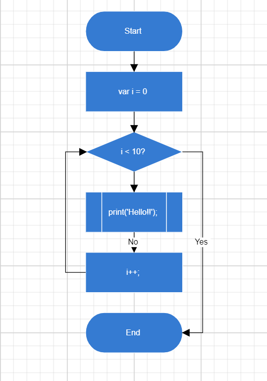

# Getting Started in Blazor Diagram Component

This section briefly explains about how to include [Blazor Diagram](https://www.syncfusion.com/blazor-components/blazor-diagram) component in your Blazor Server App and Blazor WebAssembly App using Visual Studio.

## Prerequisites

* [System requirements for Blazor components](https://blazor.syncfusion.com/documentation/system-requirements)

## Create a new Blazor App in Visual Studio

You can create **Blazor Server App** or **Blazor WebAssembly App** using Visual Studio in one of the following ways,

* [Create a Project using Microsoft Templates](https://docs.microsoft.com/en-us/aspnet/core/blazor/tooling?pivots=windows)

* [Create a Project using Syncfusion Blazor Extension](https://blazor.syncfusion.com/documentation/visual-studio-integration/vs2019-extensions/create-project)

## Install Syncfusion Blazor Diagram NuGet in the App

Syncfusion Blazor components are available in [nuget.org](https://www.nuget.org/packages?q=syncfusion.blazor). To use Syncfusion Blazor components in the application, add reference to the corresponding NuGet. Refer to [NuGet packages topic](https://blazor.syncfusion.com/documentation/nuget-packages) for available NuGet packages list with component details.

To add Blazor Diagram component in the app, open the NuGet package manager in Visual Studio (*Tools → NuGet Package Manager → Manage NuGet Packages for Solution*), search for [Syncfusion.Blazor.Diagram](https://www.nuget.org/packages/Syncfusion.Blazor.Diagram) and then install it.

## Register Syncfusion Blazor Service

Open **~/_Imports.razor** file and import the Syncfusion.Blazor namespace.




@using Syncfusion.Blazor




Now, register the Syncfusion Blazor Service in the Blazor Server App or Blazor WebAssembly App. Here, Syncfusion Blazor Service is registered by setting [IgnoreScriptIsolation](https://help.syncfusion.com/cr/blazor/Syncfusion.Blazor.GlobalOptions.html#Syncfusion_Blazor_GlobalOptions_IgnoreScriptIsolation) property as true to load the scripts externally in the [next steps](#add-script-reference).

> From 2022 Vol1 (20.1) version - The default value of `IgnoreScriptIsolation` is changed as `true`, so, you don’t have to set `IgnoreScriptIsolation` property explicitly to refer scripts externally.

### Blazor Server App

* For **.NET 6** app, open the **~/Program.cs** file and register the Syncfusion Blazor Service.

* For **.NET 5 and .NET 3.X** app, open the **~/Startup.cs** file and register the Syncfusion Blazor Service.




using Microsoft.AspNetCore.Components;
using Microsoft.AspNetCore.Components.Web;
using Syncfusion.Blazor;

var builder = WebApplication.CreateBuilder(args);

// Add services to the container.
builder.Services.AddRazorPages();
builder.Services.AddServerSideBlazor();
builder.Services.AddSyncfusionBlazor(options => { options.IgnoreScriptIsolation = true; });

var app = builder.Build();
....





using Syncfusion.Blazor;

namespace BlazorApplication
{
    public class Startup
    {
        ...
        public void ConfigureServices(IServiceCollection services)
        {
            services.AddRazorPages();
            services.AddServerSideBlazor();
            services.AddSyncfusionBlazor(options => { options.IgnoreScriptIsolation = true; });
        }
        ...
    }
}




### Blazor WebAssembly App

Open **~/Program.cs** file and register the Syncfusion Blazor Service in the client web app.




using Microsoft.AspNetCore.Components.Web;
using Microsoft.AspNetCore.Components.WebAssembly.Hosting;
using Syncfusion.Blazor;

var builder = WebAssemblyHostBuilder.CreateDefault(args);
builder.RootComponents.Add<App>("#app");
builder.RootComponents.Add<HeadOutlet>("head::after");

builder.Services.AddScoped(sp => new HttpClient { BaseAddress = new Uri(builder.HostEnvironment.BaseAddress) });

builder.Services.AddSyncfusionBlazor(options => { options.IgnoreScriptIsolation = true; });
await builder.Build().RunAsync();
....





using Syncfusion.Blazor;

namespace WebApplication1
{
    public class Program
    {
        public static async Task Main(string[] args)
        {
            ....
            builder.Services.AddSyncfusionBlazor(options => { options.IgnoreScriptIsolation = true; });
            await builder.Build().RunAsync();
        }
    }
}




## Add Style Sheet

Checkout the [Blazor Themes topic](https://blazor.syncfusion.com/documentation/appearance/themes) to learn different ways ([Static Web Assets](https://blazor.syncfusion.com/documentation/appearance/themes#static-web-assets), [CDN](https://blazor.syncfusion.com/documentation/appearance/themes#cdn-reference) and [CRG](https://blazor.syncfusion.com/documentation/common/custom-resource-generator)) to refer themes in Blazor application, and to have the expected appearance for Syncfusion Blazor components. Here, the theme is referred using [Static Web Assets](https://blazor.syncfusion.com/documentation/appearance/themes#static-web-assets). Refer to [Enable static web assets usage](https://blazor.syncfusion.com/documentation/appearance/themes#enable-static-web-assets-usage) topic to use static assets in your project.

To add theme to the app, open the NuGet package manager in Visual Studio (*Tools → NuGet Package Manager → Manage NuGet Packages for Solution*), search for [Syncfusion.Blazor.Themes](https://www.nuget.org/packages/Syncfusion.Blazor.Themes/) and then install it. Then, the theme style sheet from NuGet can be referred as follows,

### Blazor Server App

* For .NET 6 app, add the Syncfusion bootstrap5 theme in the `<head>` of the **~/Pages/_Layout.cshtml** file.

* For .NET 5 and .NET 3.X app, add the Syncfusion bootstrap5 theme in the `<head>` of the **~/Pages/_Host.cshtml** file.




<head>
    <link href="_content/Syncfusion.Blazor.Themes/bootstrap5.css" rel="stylesheet" />
</head>





<head>
    <link href="_content/Syncfusion.Blazor.Themes/bootstrap5.css" rel="stylesheet" />
</head>




### Blazor WebAssembly App

For Blazor WebAssembly App, Refer the theme style sheet from NuGet in the `<head>` of **wwwroot/index.html** file in the client web app.




<head>
    <link href="_content/Syncfusion.Blazor.Themes/bootstrap5.css" rel="stylesheet" />
</head>




## Add Script Reference

Checkout [Adding Script Reference topic](https://blazor.syncfusion.com/documentation/common/adding-script-references) to learn different ways to add script reference in Blazor Application. In this getting started walk-through, the required scripts are referred using [Static Web Assets](https://blazor.syncfusion.com/documentation/common/adding-script-references#static-web-assets) externally inside the `<head>` as follows. Refer to [Enable static web assets usage](https://blazor.syncfusion.com/documentation/common/adding-script-references#enable-static-web-assets-usage) topic to use static assets in your project.

### Blazor Server App

* For **.NET 6** app, Refer script in the `<head>` of the **~/Pages/_Layout.cshtml** file.

* For **.NET 5 and .NET 3.X** app, Refer script in the `<head>` of the **~/Pages/_Host.cshtml** file.




<head>
    ....
    <link href="_content/Syncfusion.Blazor.Themes/bootstrap5.css" rel="stylesheet" />
    
    <!--Use below script reference if you are using Syncfusion.Blazor Single NuGet-->
    <!---->
</head>





<head>
    ....
    <link href="_content/Syncfusion.Blazor.Themes/bootstrap5.css" rel="stylesheet" />
    
    <!--Use below script reference if you are using Syncfusion.Blazor Single NuGet-->
    <!---->
</head>




### Blazor WebAssembly App

For Blazor WebAssembly App, Refer script in the `<head>` of the **~/index.html** file.




<head>
    ....
    <link href="_content/Syncfusion.Blazor.Themes/bootstrap5.css" rel="stylesheet" />
    
    <!--Use below script reference if you are using Syncfusion.Blazor Single NuGet-->
    <!---->
</head>




> Syncfusion recommends to reference scripts using [Static Web Assets](https://blazor.syncfusion.com/documentation/common/adding-script-references#static-web-assets), [CDN](https://blazor.syncfusion.com/documentation/common/adding-script-references#cdn-reference) and [CRG](https://blazor.syncfusion.com/documentation/common/custom-resource-generator) by [disabling JavaScript isolation](https://blazor.syncfusion.com/documentation/common/adding-script-references#disable-javascript-isolation) for better loading performance of the Blazor application.

## Add Blazor Diagram component

* Open **~/_Imports.razor** file or any other page under the `~/Pages` folder where the component is to be added and import the **Syncfusion.Blazor.Diagram** namespace.




@using Syncfusion.Blazor
@using Syncfusion.Blazor.Diagram




* Now, add the Syncfusion Diagram component in razor file. Here, the Diagram component is added in the **~/Pages/Index.razor** file under the **~/Pages** folder.




<SfDiagramComponent Width="100%" Height="600px"/>




* Press <kbd>Ctrl</kbd>+<kbd>F5</kbd> (Windows) or <kbd>⌘</kbd>+<kbd>F5</kbd> (macOS) to run the application. Then, the Syncfusion `Blazor Diagram` component will be rendered in the default web browser.

## Adding Nodes and Connectors

Let us create and add a [Node](https://help.syncfusion.com/cr/blazor/Syncfusion.Blazor.Diagram.Node.html) with specific position, size, label, and shape. Connect two or more nodes by using a [Connector](https://help.syncfusion.com/cr/blazor/Syncfusion.Blazor.Diagram.Connector.html).




<SfDiagramComponent @ref="@diagram" Connectors="@connectors" Height="700px" Nodes="@nodes" />

@code
{
    SfDiagramComponent diagram;
    int connectorCount = 0;
    //Defines Diagram's nodes collection.
    DiagramObjectCollection<Node> nodes = new DiagramObjectCollection<Node>();
    //Defines Diagram's connectors collection.
    DiagramObjectCollection<Connector> connectors = new DiagramObjectCollection<Connector>();

    protected override void OnInitialized()
    {
        InitDiagramModel();
    }

    private void InitDiagramModel()
    {
        CreateNode("Start", 300, 50, FlowShapeType.Terminator, "Start");
        CreateNode("Init", 300, 140, FlowShapeType.Process, "var i = 0");
        CreateNode("Condition", 300, 230, FlowShapeType.Decision, "i < 10?");
        CreateNode("Print", 300, 320, FlowShapeType.PreDefinedProcess, "print(\'Hello!!\');");
        CreateNode("Increment", 300, 410, FlowShapeType.Process, "i++;");
        CreateNode("End", 300, 500, FlowShapeType.Terminator, "End");
        // Creates orthogonal connector.
        OrthogonalSegment segment1 = new OrthogonalSegment()
        {
            Type = ConnectorSegmentType.Orthogonal,
            Direction = Direction.Right,
            Length = 30,
        };
        OrthogonalSegment segment2 = new OrthogonalSegment()
        {
            Type = ConnectorSegmentType.Orthogonal,
            Length = 300,
            Direction = Direction.Bottom,
        };
        OrthogonalSegment segment3 = new OrthogonalSegment()
        {
            Type = ConnectorSegmentType.Orthogonal,
            Length = 30,
            Direction = Direction.Left,
        };
        OrthogonalSegment segment4 = new OrthogonalSegment()
        {
            Type = ConnectorSegmentType.Orthogonal,
            Length = 200,
            Direction = Direction.Top,
        };
        CreateConnector("Start", "Init");
        CreateConnector("Init", "Condition");
        CreateConnector("Condition", "Print");
        CreateConnector("Condition", "End", "Yes", segment1, segment2);
        CreateConnector("Print", "Increment", "No");
        CreateConnector("Increment", "Condition", null, segment3, segment4);
    }
    
    // Method to create connector.
    private void CreateConnector(string sourceId, string targetId, string label = default(string), OrthogonalSegment segment1 = null, OrthogonalSegment segment2 = null)
    {
        Connector diagramConnector = new Connector()
        {
            // Represents the unique id of the connector.
            ID = string.Format("connector{0}", ++connectorCount),
            SourceID = sourceId,
            TargetID = targetId,
        };
        if (label != default(string))
        {   
            // Represents the annotation of the connector.
            PathAnnotation annotation = new PathAnnotation()
            {
                Content = label,
                Style = new TextStyle() { Fill = "white" }
            };
            diagramConnector.Annotations = new DiagramObjectCollection<PathAnnotation>() { annotation };
        }
        if (segment1 != null)
        {
            // Represents the segment type of the connector.
            diagramConnector.Type = ConnectorSegmentType.Orthogonal;
            diagramConnector.Segments = new DiagramObjectCollection<ConnectorSegment> { segment1, segment2 };
        }
        connectors.Add(diagramConnector);
    }

    // Method to create node.
    private void CreateNode(string id, double x, double y, FlowShapeType shape, string label)
    {
        Node diagramNode = new Node()
        {
            //Represents the unique id of the node.
            ID = id,
            // Defines the position of the node.
            OffsetX = x,
            OffsetY = y,
            // Defines the size of the node.
            Width = 145,
            Height = 60,
            // Defines the style of the node.
            Style = new ShapeStyle { Fill = "#357BD2", StrokeColor = "White" },
            // Defines the shape of the node.
            Shape = new FlowShape() { Type = Shapes.Flow, Shape = shape },
            // Defines the annotation collection of the node.
            Annotations = new DiagramObjectCollection<ShapeAnnotation>
            {
                new ShapeAnnotation
                {
                    Content = label,
                    Style = new TextStyle()
                    {
                        Color="White",
                        Fill = "transparent"
                    }
                }
            }
        };
        nodes.Add(diagramNode);
    }
}




> [View Sample in GitHub](https://github.com/SyncfusionExamples/Blazor-Getting-Started-Examples/tree/main/DiagramComponent).

## See Also

* [Getting Started with Syncfusion Blazor for Client-Side in .NET Core CLI](https://blazor.syncfusion.com/documentation/getting-started/blazor-webassembly-dotnet-cli/)
* [Getting Started with Syncfusion Blazor for Server-Side in Visual Studio](https://blazor.syncfusion.com/documentation/getting-started/blazor-server-side-visual-studio/)
* [Getting Started with Syncfusion Blazor for Server-Side in .NET Core CLI](https://blazor.syncfusion.com/documentation/getting-started/blazor-server-side-dotnet-cli/)