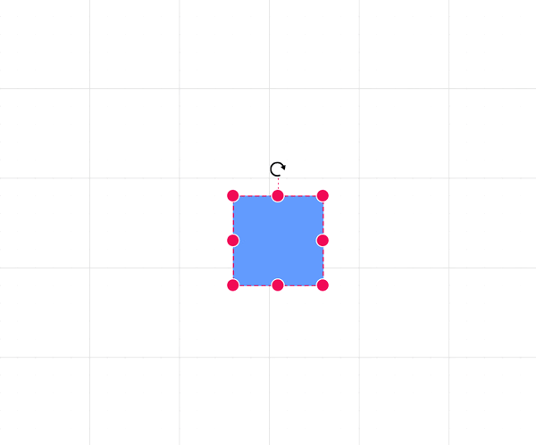

# Grid Lines in Blazor Diagram Component

Gridlines are the pattern of lines drawn behind the diagram elements. It provides a visual guidance while dragging or arranging the objects on the diagram surface. The [SnapSettings](https://help.syncfusion.com/cr/blazor/Syncfusion.Blazor.Diagram.SnapSettings.html) property is used to customize the gridlines and control the snapping behavior in the diagram.

## How to Customize Grid Lines Visibility

The [Constraints](https://help.syncfusion.com/cr/blazor/Syncfusion.Blazor.Diagram.SnapSettings.html#Syncfusion_Blazor_Diagram_SnapSettings_Constraints) property of the SnapSettings class allows you to control the visibility of the gridlines.

```cshtml
@using Syncfusion.Blazor.Diagram

<SfDiagramComponent Height="600px" Nodes="@nodes">
    @* Initialize the diagram snapping the custom interval *@
    <SnapSettings Constraints="SnapConstraints.All">
        <HorizontalGridLines SnapIntervals="@SnapInterval">
        </HorizontalGridLines>
        <VerticalGridLines SnapIntervals="@SnapInterval">
        </VerticalGridLines>
    </SnapSettings>
</SfDiagramComponent>

@code
{
    //Sets the snap interval.
    public double[] SnapInterval { get; set; } = new double[]
    {
        10
    };
    DiagramObjectCollection<Node> nodes = new DiagramObjectCollection<Node>();

    protected override void OnInitialized()
    {
        nodes = new DiagramObjectCollection<Node>();
        Node diagramNode = new Node();
        diagramNode.OffsetX = 100;
        diagramNode.OffsetY = 100;
        diagramNode.Width = 100;
        diagramNode.Height = 100;
        diagramNode.Style = new ShapeStyle() { Fill = "#6495ED", StrokeColor = "#6495ED" };
        diagramNode.ID = "node1";
        nodes.Add(diagramNode);
    }
}
```
You can download a complete working sample from [GitHub](https://github.com/SyncfusionExamples/Blazor-Diagram-Examples/tree/master/UG-Samples/Gridlines/CustomGridline)


To show only horizontal/vertical gridlines or to hide gridlines, refer to [SnapConstraints](constraints#snap-constraints).

## How to Customize Grid Lines Appearance

The appearance of the gridlines can be customized by using a set of predefined properties.

* The [HorizontalGridLines](https://help.syncfusion.com/cr/blazor/Syncfusion.Blazor.Diagram.SnapSettings.html#Syncfusion_Blazor_Diagram_SnapSettings_HorizontalGridLines) and the [VerticalGridLines](https://help.syncfusion.com/cr/blazor/Syncfusion.Blazor.Diagram.SnapSettings.html#Syncfusion_Blazor_Diagram_SnapSettings_VerticalGridLines) properties allow you to customize the appearance of the horizontal and vertical gridlines respectively.

* The horizontal gridlines [LineColor](https://help.syncfusion.com/cr/blazor/Syncfusion.Blazor.Diagram.DiagramGridLines.html#Syncfusion_Blazor_Diagram_DiagramGridLines_LineColor) and [LineDashArray](https://help.syncfusion.com/cr/blazor/Syncfusion.Blazor.Diagram.DiagramGridLines.html#Syncfusion_Blazor_Diagram_DiagramGridLines_LineDashArray) properties are used to customize the line color and line style of the horizontal gridlines.

* The vertical gridlines [LineColor](https://help.syncfusion.com/cr/blazor/Syncfusion.Blazor.Diagram.DiagramGridLines.html#Syncfusion_Blazor_Diagram_DiagramGridLines_LineColor) and [LineDashArray](https://help.syncfusion.com/cr/blazor/Syncfusion.Blazor.Diagram.DiagramGridLines.html#Syncfusion_Blazor_Diagram_DiagramGridLines_LineDashArray) properties are used to customize the line color and line style of the vertical gridlines.

The following code example illustrates how to customize the appearance of gridlines.

```cshtml
@using Syncfusion.Blazor.Diagram

<SfDiagramComponent Height="600px">
    @* Shows both horizontal and vertical gridlines *@
    <SnapSettings Constraints="SnapConstraints.ShowLines">
        @* Customizes the line color and line style to the gridlines *@
        <HorizontalGridLines LineColor="blue" LineDashArray="2,2" />
        <VerticalGridLines LineColor="blue" LineDashArray="2,2" />
    </SnapSettings>
</SfDiagramComponent>
```
You can download a complete working sample from [GitHub](https://github.com/SyncfusionExamples/Blazor-Diagram-Examples/tree/master/UG-Samples/Gridlines/Appearance)


## How to Create Dot Grid Patterns

The appearance of the grid lines can be changed into dots by using the [GridType](https://help.syncfusion.com/cr/blazor/Syncfusion.Blazor.Diagram.SnapSettings.html#Syncfusion_Blazor_Diagram_SnapSettings_GridType) as Dots. The following code illustrates how to render grid patterns as Dots.

```cshtml
@using Syncfusion.Blazor.Diagram

<SfDiagramComponent Width="1000px" Height="500px">
    @* Customizes the appearance of the gridlines *@
    <SnapSettings GridType="GridType.Dots">
        <HorizontalGridLines LineColor="Blue" @bind-LineIntervals="@HInterval" 
                             @bind-DotIntervals="@HDotInterval"></HorizontalGridLines>
        <VerticalGridLines LineColor="Blue" @bind-LineIntervals="@VInterval" 
                           @bind-DotIntervals="@VDotInterval"></VerticalGridLines>
    </SnapSettings>
</SfDiagramComponent>

@code
{
    public double[] HDotInterval { get; set; } = new double[] { 3, 20, 1, 20, 1, 20 };
    public double[] VDotInterval { get; set; } = new double[] { 3, 20, 1, 20, 1, 20, 1, 20, 1, 20 };
    public double[] HInterval { get; set; } = new double[] { 1.25, 18.75, 0.25, 19.75, 0.25, 19.75, 0.25, 19.75, 0.25, 19.75 };
    public double[] VInterval { get; set; } = new double[] { 1.25, 18.75, 0.25, 19.75, 0.25, 19.75, 0.25, 19.75, 0.25, 19.75 };
}

```
You can download a complete working sample from [GitHub](https://github.com/SyncfusionExamples/Blazor-Diagram-Examples/tree/master/UG-Samples/Gridlines/CustomizeGridline)


## How to Customize Line Intervals

Thickness and the space between gridlines can be customized by using [LinesIntervals](https://help.syncfusion.com/cr/blazor/Syncfusion.Blazor.Diagram.DiagramGridLines.html#Syncfusion_Blazor_Diagram_DiagramGridLines_LineIntervals) property of the HorizontalGridLines and VerticalGridLines. In the line intervals collections, values at the odd places are referred as the thickness of lines and values at the even places are referred as the space between gridlines.

The following code example illustrates how to customize the thickness of lines and the line intervals.

```cshtml
@using Syncfusion.Blazor.Diagram

<SfDiagramComponent Height="600px">
    @* Customize the appearance of the grid lines *@
    <SnapSettings Constraints="SnapConstraints.ShowLines">
        <HorizontalGridLines LineColor="blue" LineDashArray="2,2" LineIntervals="@LineInterval">
        </HorizontalGridLines>
        <VerticalGridLines LineColor="blue" LineDashArray="2,2" LineIntervals="@LineInterval">
        </VerticalGridLines>
    </SnapSettings>
</SfDiagramComponent>

@code
{
    //Sets the line intervals for the gridlines.
    public double[] LineInterval { get; set; } = new double[] 
    {
        1.25, 14, 0.25, 15, 0.25, 15, 0.25, 15, 0.25, 15
    };
}
```
You can download a complete working sample from [GitHub](https://github.com/SyncfusionExamples/Blazor-Diagram-Examples/tree/master/UG-Samples/Gridlines/LineInterval)


## Snapping

### How to Enable Snap to Lines

This feature allows the diagram objects to snap to the nearest intersection of gridlines while being dragged or resized. This feature enables easier alignment during layout or design.

Snapping to gridlines can be enabled/disabled with the [SnapConstraints](https://help.syncfusion.com/cr/blazor/Syncfusion.Blazor.Diagram.SnapConstraints.html). The following code example illustrates how to enable/disable the snapping to gridlines.

```cshtml
@using Syncfusion.Blazor.Diagram

<SfDiagramComponent Height="600px" Nodes="@nodes">
    <SnapSettings Constraints="@snapConstraints"></SnapSettings>
</SfDiagramComponent>

@code
{
    //Sets the snap constraints.
    public SnapConstraints snapConstraints = SnapConstraints.ShowLines | SnapConstraints.SnapToLines;
    DiagramObjectCollection<Node> nodes = new DiagramObjectCollection<Node>();

    protected override void OnInitialized()
    {
        nodes = new DiagramObjectCollection<Node>();
        Node diagramNode = new Node();
        diagramNode.OffsetX = 100;
        diagramNode.OffsetY = 100;
        diagramNode.Width = 100;
        diagramNode.Height = 100;
        diagramNode.Style = new ShapeStyle() { Fill = "#6495ED", StrokeColor = "#6495ED" };
        diagramNode.ID = "node1";
        nodes.Add(diagramNode);
    }
}
```
You can download a complete working sample from [GitHub](https://github.com/SyncfusionExamples/Blazor-Diagram-Examples/tree/master/UG-Samples/Gridlines/SnapToLines)




### How to Customize Snap Intervals

By default, the objects are snapped towards the nearest gridline. The gridline or position towards where the diagram object snaps can be customized by using the [SnapIntervals](https://help.syncfusion.com/cr/blazor/Syncfusion.Blazor.Diagram.DiagramGridLines.html#Syncfusion_Blazor_Diagram_DiagramGridLines_SnapIntervals) property of the HorizontalGridLines and VerticalGridLines.

```cshtml
@page "/CustomSnapLineInterval Sample"

@using Syncfusion.Blazor.Diagram

<SfDiagramComponent Height="600px" Nodes="@nodes">
    @* Initialize the diagram snapping the custom interval *@
    <SnapSettings Constraints="SnapConstraints.All">
        <HorizontalGridLines SnapIntervals="@SnapInterval">
        </HorizontalGridLines>
        <VerticalGridLines SnapIntervals="@SnapInterval">
        </VerticalGridLines>
    </SnapSettings>
</SfDiagramComponent>

@code
{
    //Sets the snap interval.
    public double[] SnapInterval { get; set; } = new double[]
    {
        10
    };
    DiagramObjectCollection<Node> nodes = new DiagramObjectCollection<Node>();

    protected override void OnInitialized()
    {
        nodes = new DiagramObjectCollection<Node>();
        Node diagramNode = new Node();
        diagramNode.OffsetX = 100;
        diagramNode.OffsetY = 100;
        diagramNode.Width = 100;
        diagramNode.Height = 100;
        diagramNode.Style = new ShapeStyle() { Fill = "#6495ED", StrokeColor = "#6495ED" };
        diagramNode.ID = "node1";
        nodes.Add(diagramNode);
    }
}
```
You can download a complete working sample from [GitHub](https://github.com/SyncfusionExamples/Blazor-Diagram-Examples/tree/master/UG-Samples/Gridlines/CustomizeSnapInterval)


### How to Enable Snap to Object

The snap to object provides visual cues to assist with aligning and spacing diagram elements. A node can be snapped with its neighboring objects based on certain alignments. Such alignments are visually represented as smart guides.

* The [SnapDistance](https://help.syncfusion.com/cr/blazor/Syncfusion.Blazor.Diagram.SnapSettings.html#Syncfusion_Blazor_Diagram_SnapSettings_SnapDistance) property allows you to define minimum distance between the selected object and the nearest object.

* The [SnapAngle](https://help.syncfusion.com/cr/blazor/Syncfusion.Blazor.Diagram.SnapSettings.html#Syncfusion_Blazor_Diagram_SnapSettings_SnapAngle) property allows you to define the snap angle by which the object needs to be rotated.

* The Constraints property of the SnapSettings class allows you to enable or disable certain features of the snapping, refer to [Constraints](https://help.syncfusion.com/cr/blazor/Syncfusion.Blazor.Diagram.SnapSettings.html#Syncfusion_Blazor_Diagram_SnapSettings_Constraints).

```cshtml
@using Syncfusion.Blazor.Diagram

<SfDiagramComponent Height="600px" Nodes="@nodes">
    <SnapSettings Constraints="@snapConstraints" SnapAngle="10" SnapDistance="10">
    </SnapSettings>
</SfDiagramComponent>

@code
{
    //Sets the Snap to objects constraints.
    public SnapConstraints snapConstraints = SnapConstraints.ShowLines | SnapConstraints.SnapToObject;
    DiagramObjectCollection<Node> nodes = new DiagramObjectCollection<Node>();

    protected override void OnInitialized()
    {
        nodes = new DiagramObjectCollection<Node>();
        Node diagramNode = new Node();
        diagramNode.OffsetX = 100;
        diagramNode.OffsetY = 100;
        diagramNode.Width = 100;
        diagramNode.Height = 100;
        diagramNode.Style = new ShapeStyle() { Fill = "#6495ED", StrokeColor = "#6495ED" };
        diagramNode.ID = "node1";
        nodes.Add(diagramNode);

        diagramNode = new Node();
        diagramNode.OffsetX = 300;
        diagramNode.OffsetY = 100;
        diagramNode.Width = 100;
        diagramNode.Height = 100;
        diagramNode.Style = new ShapeStyle() { Fill = "#6495ED", StrokeColor = "#6495ED" };
        diagramNode.ID = "node2";
        nodes.Add(diagramNode);
    }
}
```
You can download a complete working sample from [GitHub](https://github.com/SyncfusionExamples/Blazor-Diagram-Examples/tree/master/UG-Samples/Gridlines/SnapToObject)


### How to Customize Snap Line Style

The [SnapLineStyle](https://help.syncfusion.com/cr/blazor/Syncfusion.Blazor.Diagram.SnapSettings.html#Syncfusion_Blazor_Diagram_SnapSettings_SnapLineStyle) property of the [SnapSettings](https://help.syncfusion.com/cr/blazor/Syncfusion.Blazor.Diagram.SnapSettings.html) class allows you to adjust the appearance of snapping lines to enhance visibility or match specific aesthetic preferences. By customizing this property, you can modify the color, stroke width, stroke dash array, and opacity of the snap lines. These adjustments improve visual contrast, making it easier to align objects with precision. By default, the snap line color is set to '#07EDE1'.

The following code example illustrates how to customize the snap line style.


```cshtml
@page "/"
@using Syncfusion.Blazor.Diagram
<SfDiagramComponent Height="600px" Nodes="@nodes">
    <SnapSettings Constraints="@snapConstraints" SnapAngle="10" SnapDistance="10" SnapLineStyle="snapLineStyle">
    </SnapSettings>
</SfDiagramComponent>
@code
{
    //Sets the Snap to objects constraints.
    public SnapConstraints snapConstraints = SnapConstraints.ShowLines | SnapConstraints.SnapToObject | SnapConstraints.SnapToLines;
    DiagramObjectCollection<Node> nodes = new DiagramObjectCollection<Node>();
    ShapeStyle snapLineStyle = new ShapeStyle() { StrokeColor = "green", StrokeWidth = 3 };
    protected override void OnInitialized()
    {
        nodes = new DiagramObjectCollection<Node>();
        Node diagramNode = new Node();
        diagramNode.OffsetX = 100;
        diagramNode.OffsetY = 100;
        diagramNode.Width = 100;
        diagramNode.Height = 100;
        diagramNode.Style = new ShapeStyle() { Fill = "#6495ED", StrokeColor = "#6495ED" };
        diagramNode.ID = "node1";
        nodes.Add(diagramNode);
        diagramNode = new Node();
        diagramNode.OffsetX = 300;
        diagramNode.OffsetY = 100;
        diagramNode.Width = 100;
        diagramNode.Height = 100;
        diagramNode.Style = new ShapeStyle() { Fill = "#6495ED", StrokeColor = "#6495ED" };
        diagramNode.ID = "node2";
        nodes.Add(diagramNode);
    }
}
```
You can download a complete working sample from [GitHub](https://github.com/SyncfusionExamples/Blazor-Diagram-Examples/tree/master/UG-Samples/Gridlines/SnapLineStyle)


