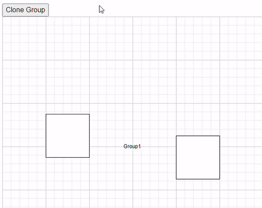
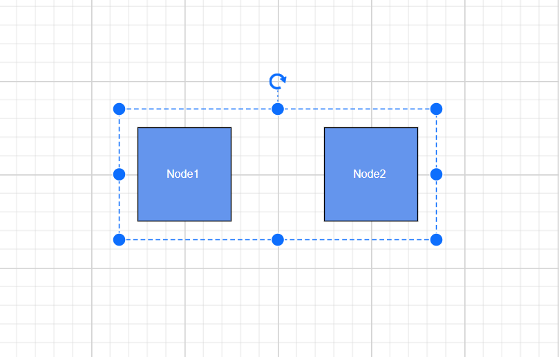

# Node Group in Blazor Diagram Component

[NodeGroup](https://help.syncfusion.com/cr/blazor/Syncfusion.Blazor.Diagram.NodeGroup.html) is used to cluster multiple nodes and connectors into a single element. It acts as a container for its children (nodes, node groups, and connectors). Every change made to the node group also affects the children. Child elements can be edited individually.

## Create Node Group

## How to Add a Node Group During Diagram Initialization

A node group can be added to the diagram model through the [Nodes](https://help.syncfusion.com/cr/blazor/Syncfusion.Blazor.Diagram.Node.html) collection. To define an object as a node group, add the child objects to the [Children](https://help.syncfusion.com/cr/blazor/Syncfusion.Blazor.Diagram.NodeGroup.html#Syncfusion_Blazor_Diagram_NodeGroup_Children) collection of the node group. The following code illustrates how to create a node group.

* While creating a node group, its child nodes need to be declared before the node group declaration.

* Add a node to the existing node group child by using the [Group](https://help.syncfusion.com/cr/blazor/Syncfusion.Blazor.Diagram.SfDiagramComponent.html#Syncfusion_Blazor_Diagram_SfDiagramComponent_Group) method.

* The nodegroup’s [Ungroup](https://help.syncfusion.com/cr/blazor/Syncfusion.Blazor.Diagram.SfDiagramComponent.html#Syncfusion_Blazor_Diagram_SfDiagramComponent_Ungroup) method is used to define whether the node group can be ungrouped or not.

* A node group can be added as a child of another node group.

To create a group using Nodes and Connectors in the Blazor Diagram, refer to the below video link,



```cshtml
@using Syncfusion.Blazor.Diagram

@* Initialize the diagram with NodeCollection *@
<SfDiagramComponent Height="500px" @ref="diagram" Nodes="@nodes">
    <SnapSettings>
        <HorizontalGridLines LineColor="white" LineDashArray="2,2"></HorizontalGridLines>
        <VerticalGridLines LineColor="white" LineDashArray="2,2"></VerticalGridLines>
    </SnapSettings>
</SfDiagramComponent>

@code
{
    SfDiagramComponent diagram;
    DiagramObjectCollection<Node> nodes = new DiagramObjectCollection<Node>();

    protected override void OnInitialized()
    {
        Node node1 = createNode("node1", 100, 100, "Node1");
        Node node2 = createNode("node2", 300, 100, "Node2");
        Node node3 = createNode("node3", 200, 250, "Node3");
        NodeGroup groupNode = new NodeGroup();
        // Grouping node 1 and node 2 into a single nodegroup.
        groupNode.Children = new string[] { "node1", "node2" };
        nodes.Add(node1);
        nodes.Add(node2);
        nodes.Add(node3);
        nodes.Add(groupNode);
    }

    public Node createNode(string id, double offsetX, double offsetY, string content)
    {
        Node node = new Node()
        {
            ID = id,
            OffsetX = offsetX,
            OffsetY = offsetY,
            Height = 100,
            Width = 100,
            Style = new ShapeStyle() { Fill = "#6495ED" }
        };
        ShapeAnnotation annotation = new ShapeAnnotation
        {
            ID = "annotation1",
            Content = content,
            Style = new TextStyle()
            {
                Color = "white",
                Fill = "transparent",
                StrokeColor = "None"
            },
        };
        node.Annotations = new DiagramObjectCollection<ShapeAnnotation>()
        {
            annotation
        };
        return node;
    }

    protected override async Task OnAfterRenderAsync(bool firstRender)
    {
        if (firstRender)
        {
            await Task.Delay(500);
            diagram.SelectAll();
            // Adding the third node into the existing nodegroup.
            diagram.Group();
        }
    }
}
```
You can download a complete working sample from [GitHub](https://github.com/SyncfusionExamples/Blazor-Diagram-Examples/tree/master/UG-Samples/Group/CreateGroup)


The following code illustrates how to ungroup at runtime.

```cshtml
@using Syncfusion.Blazor.Diagram

@* Initialize the diagram with nodes *@
<SfDiagramComponent Height="500px" @ref="diagram" Nodes="@nodes" />

@code
{
    SfDiagramComponent diagram;
    DiagramObjectCollection<Node> nodes = new DiagramObjectCollection<Node>();
    protected override void OnInitialized()
    {
        Node node1 = createNode("node1", 100, 100, "Node1");
        Node node2 = createNode("node2", 300, 100, "Node2");
        NodeGroup groupNode = new NodeGroup();
        // Grouping node 1 and node 2 into a single nodegroup.
        groupNode.Children = new string[] { "node1", "node2" };
        nodes.Add(node1);
        nodes.Add(node2);
        nodes.Add(groupNode);
    }

    public Node createNode(string id, double offsetX, double offsetY, string content)
    {
        Node node = new Node()
        {
            ID = id,
            OffsetX = offsetX,
            OffsetY = offsetY,
            Height = 100,
            Width = 100,
            Style = new ShapeStyle() { Fill = "#6495ED" }
        };
        ShapeAnnotation annotation = new ShapeAnnotation
        {
            ID = "annotation1",
            Content = content,
            Style = new TextStyle()
            {
                Color = "white",
                Fill = "transparent",
                StrokeColor = "None"
            },
        };
        node.Annotations = new DiagramObjectCollection<ShapeAnnotation>()
        {
            annotation
        };
        return node;
    }

    protected override async Task OnAfterRenderAsync(bool firstRender)
    {
        if (firstRender)
        {
            await Task.Delay(500);
            diagram.SelectAll();
            // Ungroup the selected group into nodes.
            diagram.Ungroup();
        }
    }
}
```
You can download a complete working sample from [GitHub](https://github.com/SyncfusionExamples/Blazor-Diagram-Examples/tree/master/UG-Samples/Group/UnGroup)


>**Note:** NodeGroup's Id should not start with numbers or special characters and should not contain special characters such as underscore(_) or space.

### How to Clone a Group of Nodes at Runtime
[Clone](https://help.syncfusion.com/cr/blazor/Syncfusion.Blazor.Diagram.Node.html#Syncfusion_Blazor_Diagram_Node_Clone) is a virtual method of the node that is used to create a copy of a diagram object. After cloning, you need to set the ID for the cloned nodes. The following code demonstrates how to clone a group of nodes during runtime.
```cshtml
@using Syncfusion.Blazor.Diagram
@using System.Collections.ObjectModel
@inject IJSRuntime js
@using Syncfusion.Blazor.Buttons


<SfButton Content="CloneGroup" OnClick="@CloneGroup" />
<SfDiagramComponent @ref="diagram" Width="50%" Height="500px" @bind-Nodes="NodeCollection"></SfDiagramComponent>

@functions
{

    SfDiagramComponent diagram;
    public DiagramObjectCollection<Node> NodeCollection = new DiagramObjectCollection<Node>();
    protected override void OnInitialized()
    {
        Node node1 = new Node()
            {
                OffsetX = 100,
                OffsetY = 150,
                Height = 100,
                Width = 100,
                ID = "node1",

            };
        NodeCollection.Add(node1);
        Node node2 = new Node()
            {
                OffsetX = 400,
                OffsetY = 200,
                Height = 100,
                Width = 100,
                ID = "node2",
               
            };
        NodeCollection.Add(node2);
        NodeGroup group1 = new NodeGroup()
            {
                ID = "group1",
                Children = new string[] { "node1", "node2" },
                OffsetX = 300,
                OffsetY = 300,
                Annotations = new DiagramObjectCollection<ShapeAnnotation>()
                        {
                            new ShapeAnnotation()
                            {
                            Content = "Group1"
                            }
                        },
            };
        NodeCollection.Add(group1);
    }
    public async Task CloneGroup()
    {
        Node node2 = NodeCollection[0].Clone() as Node;
        node2.ID = RandomId();
        Node node3 = NodeCollection[1].Clone() as Node;
        node3.ID = RandomId();
        Node node4 = NodeCollection[2].Clone() as Node;
        node4.ID = RandomId();
        string[] array = { node2.ID, node3.ID };
        (node4 as NodeGroup).Children = array;
        node4.OffsetX += 25;
        node4.OffsetY += 25;
        await diagram.AddDiagramElementsAsync(new DiagramObjectCollection<NodeBase>() { node2, node3, node4 });
    }

    internal string RandomId()
    {
        Random random = new Random();
        const string chars = "ABCDEFGHIJKLMNOPQRSTUVWXTZabcdefghiklmnopqrstuvwxyz";
#pragma warning disable CA5394 // Do not use insecure randomness
        return new string(Enumerable.Repeat(chars, 5)
          .Select(s => s[random.Next(s.Length)]).ToArray());
#pragma warning restore CA5394 // Do not use insecure randomness
    }

}
```
You can download a complete working sample from [GitHub](https://github.com/SyncfusionExamples/Blazor-Diagram-Examples/tree/master/UG-Samples/Group/CloneNodeGroup)



### How to Add Padding to a Node Group

The [Padding](https://help.syncfusion.com/cr/blazor/Syncfusion.Blazor.Diagram.NodeGroup.html#Syncfusion_Blazor_Diagram_NodeGroup_Padding) property of a group node defines the spacing between the group node’s edges and its children.

The following code illustrates how to add Padding to the node group.

```cshtml
@using Syncfusion.Blazor.Diagram

@* Initialize the diagram with NodeCollection *@
<SfDiagramComponent Height="500px" Nodes="@nodes" />

@code
{
    DiagramObjectCollection<Node> nodes = new DiagramObjectCollection<Node>();
    NodeGroup groupNode = new NodeGroup();

    protected override void OnInitialized()
    {
        Node node1 = createNode("node1", 100, 100, "Node1");
        Node node2 = createNode("node2", 300, 100, "Node2");
        // Grouping node one and node two into a single node-group.
        groupNode.Children = new string[] { "node1", "node2" };
        groupNode.Padding = new DiagramThickness() { Left=20, Right= 20, Top=20, Bottom=20 };
        nodes.Add(node1);
        nodes.Add(node2);
        nodes.Add(groupNode);
    }

    public Node createNode(string id, double offsetX, double offsetY, string content)
    {
        Node node = new Node()
        {
            ID = id,
            OffsetX = offsetX,
            OffsetY = offsetY,
            Height = 100,
            Width = 100,
            Style = new ShapeStyle() { Fill = "#6495ED" }
        };
        ShapeAnnotation annotation = new ShapeAnnotation()
        {
            ID = "annotation1",
            Content = content,
            Style = new TextStyle()
            {
                Color = "white",
                Fill = "transparent",
                StrokeColor = "None"
            },
        };
        node.Annotations = new DiagramObjectCollection<ShapeAnnotation>()
        {
            annotation
        };
        return node;
    }
}
```
You can download a complete working sample from [GitHub](https://github.com/SyncfusionExamples/Blazor-Diagram-Examples/tree/master/UG-Samples/Group/CreateGroup)



## How to Add a Node Group at Runtime

A node group can be added at runtime by using Nodes collection of diagram.

The following code illustrates how a node group is added at runtime.

```cshtml
@using Syncfusion.Blazor.Diagram
@using Syncfusion.Blazor.Buttons


<SfButton Content="AddGroup" OnClick="@AddGroup" />
@* Initialize the diagram with NodeCollection *@
<SfDiagramComponent Height="500px" Nodes="@nodes" />

@code
{
    DiagramObjectCollection<Node> nodes = new DiagramObjectCollection<Node>();
    NodeGroup groupNode = new NodeGroup();

    protected override void OnInitialized()
    {
        Node node1 = createNode("node1", 100, 100, "Node1");
        Node node2 = createNode("node2", 300, 100, "Node2");
        // Grouping node 1 and node 2 into a single node-group.
        groupNode.Children = new string[] { "node1", "node2" };
        nodes.Add(node1);
        nodes.Add(node2);
    }

    public Node createNode(string id, double offsetX, double offsetY, string content)
    {
        Node node = new Node()
        {
            ID = id,
            OffsetX = offsetX,
            OffsetY = offsetY,
            Height = 100,
            Width = 100,
            Style = new ShapeStyle() { Fill = "#6495ED" }
        };
        ShapeAnnotation annotation = new ShapeAnnotation()
        {
            ID = "annotation1",
            Content = content,
            Style = new TextStyle()
            {
                Color = "white",
                Fill = "transparent",
                StrokeColor = "None"
            },
        };
        node.Annotations = new DiagramObjectCollection<ShapeAnnotation>()
        {
            annotation
        };
        return node;
    }

    private void AddGroup()
    {
        nodes.Add(groupNode);
    }
}
```
You can download a complete working sample from [GitHub](https://github.com/SyncfusionExamples/Blazor-Diagram-Examples/tree/master/UG-Samples/Group/AddGroupAtRunTime)
* Also, you can add the child to the node group through the [AddChildAsync](https://help.syncfusion.com/cr/blazor/Syncfusion.Blazor.Diagram.SfDiagramComponent.html#Syncfusion_Blazor_Diagram_SfDiagramComponent_AddChildAsync_Syncfusion_Blazor_Diagram_NodeGroup_Syncfusion_Blazor_Diagram_NodeBase_) method. The following code illustrates how to add child to the existing node group through the AddChildAsync method.

```cshtml
@using Syncfusion.Blazor.Diagram
@using Syncfusion.Blazor.Buttons


<SfButton Content="AddChildToGroup" OnClick="@AddChildToGroup" />
@* Initialize the diagram with nodes *@
<SfDiagramComponent @ref="@diagram" Height="500px" Nodes="@nodes"/>

@code
{
    SfDiagramComponent diagram;
    DiagramObjectCollection<Node> nodes = new DiagramObjectCollection<Node>();
    NodeGroup groupNode = new NodeGroup();

    protected override void OnInitialized()
    {
        Node node1 = createNode("node1", 100, 100, "Node1");
        Node node2 = createNode("node2", 300, 100, "Node2");
        // Grouping node 1 and node 2 into a single node-group.
        groupNode.Children = new string[] { "node1", "node2" };
        nodes.Add(node1);
        nodes.Add(node2);
        nodes.Add(groupNode);
    }

    public Node createNode(string id, double offsetX, double offsetY, string content)
    {
        Node node = new Node()
        {
            ID = id,
            OffsetX = offsetX,
            OffsetY = offsetY,
            Height = 100,
            Width = 100,
            Style = new ShapeStyle() { Fill = "#6495ED" }
        };
        ShapeAnnotation annotation = new ShapeAnnotation()
        {
            ID = "annotation1",
            Content = content,
            Style = new TextStyle() 
            { 
                Color = "white", 
                Fill = "transparent", 
                StrokeColor = "None" 
            },
        };
        node.Annotations = new DiagramObjectCollection<ShapeAnnotation>()
        {
            annotation
        };
        return node;
    }

    private async void AddChildToGroup()
    {
        NodeGroup group = diagram.SelectionSettings.Nodes[0] as NodeGroup;
        Node node = new Node()
        {
            ID = "node" + nodes.Count.ToString(),
            OffsetX = 250,
            OffsetY = 250,
            Width = 50,
            Height = 50,
            Style = new ShapeStyle() { Fill = "#6495ED" },
            Annotations = new DiagramObjectCollection<ShapeAnnotation>()
            {
                new ShapeAnnotation()
                {
                    Content = "Node" + nodes.Count.ToString(),
                    Style = new TextStyle() 
                    { 
                        Color = "white", 
                        Fill = "transparent", 
                        StrokeColor = "None" 
                    },
                }
            }
        };
        await diagram.AddChildAsync(group as NodeGroup, node);
    }
}
```
You can download a complete working sample from [GitHub](https://github.com/SyncfusionExamples/Blazor-Diagram-Examples/tree/master/UG-Samples/Group/AddChildMethod)

## How to Update Node Group Position at Runtime

You can change the position of the node group similar to node. For more information about node positioning, refer to [Positioning](https://blazor.syncfusion.com/documentation/diagram/nodes/positioning).

```cshtml
@using Syncfusion.Blazor.Diagram
@using Syncfusion.Blazor.Buttons


<SfButton Content="UpdatePosition" OnClick="@UpdatePosition" />
@* Initialize the diagram with NodeCollection *@
<SfDiagramComponent Height="500px" Nodes="@nodes" />

@code
{
    DiagramObjectCollection<Node> nodes = new DiagramObjectCollection<Node>();
    NodeGroup groupNode = new NodeGroup();

    protected override void OnInitialized()
    {
        nodes = new DiagramObjectCollection<Node>();
        Node node1 = createNode("node1", 100, 100, "Node1");
        Node node2 = createNode("node2", 300, 100, "Node2");
        // Grouping node 1 and node 2 into a single NodeGroup.
        groupNode.Children = new string[] { "node1", "node2" };
        nodes.Add(node1);
        nodes.Add(node2);
        nodes.Add(groupNode);
    }

    public Node createNode(string id, double offsetX, double offsetY, string content)
    {
        Node node = new Node()
        {
            ID = id,
            OffsetX = offsetX,
            OffsetY = offsetY,
            Height = 100,
            Width = 100,
            Style = new ShapeStyle() { Fill = "#6495ED" }
        };
        ShapeAnnotation annotation = new ShapeAnnotation
        {
            ID = "annotation1",
            Content = content,
            Style = new TextStyle()
            {
                Color = "white",
                Fill = "transparent",
                StrokeColor = "None"
            },
        };
        node.Annotations = new DiagramObjectCollection<ShapeAnnotation>()
        {
            annotation
        };
        return node;
    }

    private void UpdatePosition()
    {
        nodes[2].OffsetX = 500;
        nodes[2].OffsetY = 200;
    }
}
```
You can download a complete working sample from [GitHub](https://github.com/SyncfusionExamples/Blazor-Diagram-Examples/tree/master/UG-Samples/Group/UpdatePositionForGroup)

## How to Customize Node Group Appearance

You can change the appearance of the node group similar to node. For more information about node appearance, refer to [Appearance](https://blazor.syncfusion.com/documentation/diagram/nodes/customization).

## How to Interact with Node Group at Runtime

You can edit the node group and its children at runtime. You can interact with the node group similar to node interactions like resize, rotate, and drag. For more information about node interaction, refer to [Interaction](https://blazor.syncfusion.com/documentation/diagram/nodes/interaction).

### How to Select Node Group

When a child element of any node group is clicked, its contained node group is selected instead of the child element. With consecutive clicks on the selected element, selection is changed from top to bottom in the hierarchy of parent nodegroup to its children.

## How to Flip Node Group

The [Flip](https://help.syncfusion.com/cr/blazor/Syncfusion.Blazor.Diagram.NodeBase.html#Syncfusion_Blazor_Diagram_NodeBase_Flip) is performed to give the mirrored image of the original element.

For more information about group node flip, refer to [Group Flip](./flip#how-to-flip-the-node-or-group).

## See Also

* [How to enable/disable the behavior of the node](./constraints)

* [How to Select a Group Child Element Without Selecting the Parent Group Node in Syncfusion Blazor Diagram Component](https://support.syncfusion.com/kb/article/18996/how-to-select-a-group-child-element-without-selecting-the-parent-group-node-in-syncfusion-blazor-diagram-component)

* [How to Select Only the GroupNode Without Selecting Child Nodes in Syncfusion Blazor Diagram](https://support.syncfusion.com/kb/article/16302/how-to-select-only-the-groupnode-without-selecting-child-nodes-in-syncfusion-blazor-diagram)

* [How to Drag a Node Programmatically Without User Interaction in Syncfusion Blazor Diagram](https://support.syncfusion.com/kb/article/20172/how-to-drag-a-node-programmatically-without-user-interaction-in-syncfusion-blazor-diagram)
