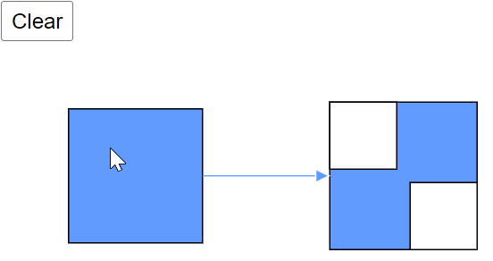
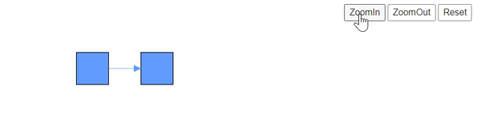

# How to Use Diagram Methods and Properties for Common Scenarios

The diagram's core functionalities are implemented through a comprehensive set of methods and properties, enabling robust manipulation and interaction with diagram elements.

## How to Add Nodes Using the Add Method

Create a node in a Blazor diagram, define a Node object and add it to the diagram's nodes collection using the `Add` method. It's crucial to call the `Add` method within the `OnInitialized` lifecycle method. This approach ensures that each diagram element is properly measured and rendered individually before the entire diagram is displayed. Attempting to use the `Add` method outside of `OnInitialized` is not recommended, as it may lead to unexpected behavior or rendering issues in the diagram. The following code example shows how to add a node to the diagram.

```cshtml
@using Syncfusion.Blazor.Diagram

<SfDiagramComponent Height="600px" Nodes="@nodes" />

@code
{
    private DiagramObjectCollection<Node> nodes;

    protected override void OnInitialized()
    {
        nodes = new DiagramObjectCollection<Node>();
        // A node is created and stored in the nodes collection.
        Node node = new Node()
        {
            ID = "node1",
            // Position of the node.
            OffsetX = 250,
            OffsetY = 250,
            // Size of the node.
            Width = 100,
            Height = 100,
            Style = new ShapeStyle() 
            { 
                Fill = "#6495ED", 
                StrokeColor = "white" 
            }
        };
        // Add node.
        nodes.Add(node);
    }
}
```


A complete working sample can be downloaded from [GitHub](https://github.com/SyncfusionExamples/Blazor-Diagram-Examples/tree/master/UG-Samples/Methods/AddMethod)

## How to Add Nodes Using the AddDiagramElementsAsync Method

The [AddDiagramElementsAsync](https://help.syncfusion.com/cr/blazor/Syncfusion.Blazor.Diagram.SfDiagramComponent.html#Syncfusion_Blazor_Diagram_SfDiagramComponent_AddDiagramElementsAsync_Syncfusion_Blazor_Diagram_DiagramObjectCollection_Syncfusion_Blazor_Diagram_NodeBase__) method offers advantages over the Add() method. It measures the passed elements before re-rendering the entire diagram component at once. When using the Add() method to add multiple nodes and connectors simultaneously, connectors may render before nodes, potentially leading to misplacement due to the method's synchronous nature. To avoid this issue and ensure proper positioning, use the asynchronous AddDiagramElementsAsync() method.

* The AddDiagramElementsAsync() method is the recommended approach for adding multiple items to the diagram. It provides superior performance compared to the Add() method, especially when dealing with a collection of elements.

```cshtml
@using Syncfusion.Blazor.Diagram
@using Syncfusion.Blazor.Buttons

<SfButton Content="AddDiagramElementMethod" OnClick="@AddDiagramElementMethod" />

<SfDiagramComponent @ref="Diagram" Width="1000px" Height="500px" />

@code
{
    //Reference the diagram
    private SfDiagramComponent Diagram;

    public async void AddDiagramElementMethod()
    {
        Node node1 = new Node()
        {
            OffsetX = 100,
            OffsetY = 100,
            Height = 50,
            Ports = new DiagramObjectCollection<PointPort>()
            {
                new PointPort()
                {
                    ID="port1",
                    Visibility = PortVisibility.Visible,
                    Offset = new DiagramPoint() { X = 1, Y = 0.5},
                    Height = 10, Width = 10,
                    Style = new ShapeStyle(){Fill = "yellow", StrokeColor = "yellow"}
                }
            },
            Width = 100,
            ID = "node1",
            Style = new ShapeStyle() { Fill = "#6495ED", StrokeColor = "#6495ED" },
            Shape = new BasicShape() { Type = NodeShapes.Basic, Shape = NodeBasicShapes.Rectangle }
        };

        Node node2 = new Node()
        {
            OffsetX = 300,
            OffsetY = 300,
            Height = 50,
            Width = 100,
            ID = "node2",
            Ports = new DiagramObjectCollection<PointPort>()
            {
                new PointPort()
                {
                    ID="port2",
                    Visibility = PortVisibility.Visible,
                    Offset = new DiagramPoint() { X = 0, Y = 0.5},
                    Height = 10, Width = 10,
                    Style = new ShapeStyle(){Fill = "yellow", StrokeColor = "yellow"}
                }
            },
            Style = new ShapeStyle() { Fill = "#6495ED", StrokeColor = "#6495ED" },
            Shape = new BasicShape() { Type = NodeShapes.Basic, Shape = NodeBasicShapes.Rectangle }
        };

        Connector Connector = new Connector()
        {
            ID = "connector1",
            //Source node id of the connector.
            SourceID = "node1",
            //source node port id.
            SourcePortID = "port1",
            //Target node id of the connector.
            TargetID = "node2",
            //Target node port id.
            TargetPortID = "port2",
            TargetDecorator = new DecoratorSettings()
            {
                Style = new ShapeStyle()
                {
                    Fill = "#6495ED",
                    StrokeColor = "#6495ED",
                }
            },
            Style = new ShapeStyle()
            {
                Fill = "#6495ED",
                StrokeColor = "#6495ED",
            },
            // Type of the connector
            Type = ConnectorSegmentType.Straight,
        };
        DiagramObjectCollection<NodeBase> NodeCollection = new DiagramObjectCollection<NodeBase>();
        NodeCollection.Add(node1);
        NodeCollection.Add(node2);
        NodeCollection.Add(Connector);
        await Diagram.AddDiagramElementsAsync(NodeCollection);
    }
}
```


A complete working sample can be downloaded from [GitHub](https://github.com/SyncfusionExamples/Blazor-Diagram-Examples/tree/master/UG-Samples/Methods/AddDiagramElements)

## How to Clear Nodes and Connectors from the Diagram

The [Clear](https://help.syncfusion.com/cr/blazor/Syncfusion.Blazor.Diagram.SfDiagramComponent.html#Syncfusion_Blazor_Diagram_SfDiagramComponent_Clear) method removes all elements from the diagram, including nodes, connectors, and groups. Use it to reset the canvas to a blank state before loading or creating a new set of elements.

```cshtml
@using Syncfusion.Blazor.Diagram
@using Syncfusion.Blazor.Buttons

<SfButton Content="Clear" OnClick="@Clear" />
<SfDiagramComponent @ref="diagram" Width="500px" Height="500px" @bind-Nodes="@Nodes" @bind-Connectors="@Connectors" />

@code
{
    //Reference the diagram
    private SfDiagramComponent diagram;
    //Initialize the diagram's nodes collection
    private DiagramObjectCollection<Node> Nodes = new DiagramObjectCollection<Node>();
    //Initialize the diagram's connectors collection
    private DiagramObjectCollection<Connector> Connectors = new DiagramObjectCollection<Connector>();

    protected override void OnInitialized()
    {
        Nodes.Add(new Node()
        {
            ID = "node1",
            OffsetX = 100,
            OffsetY = 100,
            Width = 100,
            Height = 100,
            Style = new ShapeStyle() { Fill = "#6495ED", StrokeColor = "black" }
        });
        Nodes.Add(new Node()
        {
            ID = "node2",
            OffsetX = 270,
            OffsetY = 70,
            Width = 50,
            Height = 50,
        });
        Nodes.Add(new Node()
        {
            ID = "node3",
            OffsetX = 330,
            OffsetY = 130,
            Width = 50,
            Height = 50,
        });
        Nodes.Add(new NodeGroup()
        {
            ID = "group",
            Children = new string[] { "node2", "node3" },
            Style = new ShapeStyle() { Fill = "#6495ED", StrokeColor = "black" }
        });
        Connectors.Add(new Connector()
        {
            SourceID = "node1",
            TargetID = "group",
            Style = new ShapeStyle() { StrokeColor = "#6495ED" },
            TargetDecorator = new DecoratorSettings() { Style = new ShapeStyle() { Fill = "#6495ED", StrokeColor = "black" } }
        });
    }

    private void Clear()
    {
        diagram.Clear();
    }
}
```


A complete working sample can be downloaded from [GitHub](https://github.com/SyncfusionExamples/Blazor-Diagram-Examples/tree/master/UG-Samples/Methods/Clear)



## How to Delete Diagram Elements

The [Delete](https://help.syncfusion.com/cr/blazor/Syncfusion.Blazor.Diagram.SfDiagramComponent.html#Syncfusion_Blazor_Diagram_SfDiagramComponent_Delete_Syncfusion_Blazor_Diagram_DiagramObjectCollection_Syncfusion_Blazor_Diagram_NodeBase__) method removes diagram elements such as nodes, connectors, and groups. When invoked without parameters or with a null parameter, it automatically deletes all selected elements. Alternatively, pass a collection of specific diagram elements to be removed. This versatile method provides flexibility in managing your diagram's content. The following code example demonstrates how to effectively use the Delete method to remove elements from your diagram.

```cshtml
@using Syncfusion.Blazor.Diagram
@using Syncfusion.Blazor.Buttons

<SfButton Content="Delete" OnClick="@Delete" />
<SfButton Content="DeletewithArgument" OnClick="@DeletewithArgument" />

<SfDiagramComponent @ref="diagram" Width="500px" Height="500px" @bind-Nodes="@Nodes" @bind-Connectors="@Connectors">
    <SnapSettings Constraints="@SnapConstraints.None"></SnapSettings>
</SfDiagramComponent>

@code
{
    //Reference the diagram
    private SfDiagramComponent diagram;
    //Initialize the diagram's nodes collection
    private DiagramObjectCollection<Node> Nodes = new DiagramObjectCollection<Node>();
    //Initialize the diagram's connectors collection
    private DiagramObjectCollection<Connector> Connectors = new DiagramObjectCollection<Connector>();
    //Initialize the diagram's nodebase collection
    private DiagramObjectCollection<NodeBase> DiagramElements = new DiagramObjectCollection<NodeBase>();
    
    protected override void OnInitialized()
    {
        Node node1 = new Node()
        {
            ID = "node1",
            OffsetX = 200,
            OffsetY = 100,
            Height = 50,
            Width = 100,
            Style = new ShapeStyle()
            {
                Fill = "#6495ED",
                StrokeColor = "white"
            }
        };
        Nodes.Add(node1);
        Node node2 = new Node()
        {
            ID = "node2",
            OffsetX = 200,
            OffsetY = 200,
            Height = 50,
            Width = 100,
            Style = new ShapeStyle()
            {
                Fill = "#6495ED",
                StrokeColor = "white"
            }
        };
        Nodes.Add(node2);
        Node node3 = new Node()
        {
            ID = "node3",
            OffsetX = 200,
            OffsetY = 300,
            Height = 50,
            Width = 100,
            Style = new ShapeStyle()
            {
                Fill = "#6495ED",
                StrokeColor = "white"
            }
        };
        Nodes.Add(node3);

        Connector connector1 = new Connector()
        {
            ID = "connector1",
            SourceID = "node1",
            TargetID = "node2",
            Type = ConnectorSegmentType.Straight,
        };
        Connectors.Add(connector1);
        Connector connector2 = new Connector()
        {
            ID = "connector2",
            SourceID = "node2",
            TargetID = "node3",
            Type = ConnectorSegmentType.Straight,
        };
        Connectors.Add(connector2);
        NodeGroup groupNode = new NodeGroup();
        groupNode.Children = new string[] { "node2", "node3" };
        Nodes.Add(groupNode);
    }

    //Deletes DiagramElements with null parameter
    private void Delete()
    {
        diagram.Delete();
    }

    //Deletes DiagramElements with parameter
    private void DeletewithArgument()
    {
        DiagramElements.Add(diagram.Nodes[0]);
        DiagramElements.Add(diagram.Nodes[1]);
        diagram.Delete(DiagramElements);
    }
}
```


A complete working sample can be downloaded from [GitHub](https://github.com/SyncfusionExamples/Blazor-Diagram-Examples/tree/master/UG-Samples/Methods/Delete)

## How to Reset Diagram Zoom Level
The [ResetZoom](https://help.syncfusion.com/cr/blazor/Syncfusion.Blazor.Diagram.SfDiagramComponent.html#Syncfusion_Blazor_Diagram_SfDiagramComponent_ResetZoom) method restores the current zoom level of the diagram page to its default value of 100%. This method is particularly useful when the diagram is in a zoomed-in or zoomed-out state, allowing users to quickly return to the standard view. The following code example demonstrates how to implement the ResetZoom method to restore the diagram's default zoom level.

```cshtml
@using Syncfusion.Blazor.Diagram
@using Syncfusion.Blazor.Buttons

<style>
    #diagram-space {
        float: left;
    }

    #properties {
        float: right;
    }
</style>

<div id="properties">
    <SfButton Content="ZoomIn" OnClick="@ZoomIn" />
    <SfButton Content="ZoomOut" OnClick="@ZoomOut" />
    <SfButton Content="Reset" OnClick="@ResetZoom" />
</div>

<div id="diagram-space">
    <SfDiagramComponent @ref="diagram" Width="600px" Height="600px" Nodes="nodes" Connectors="connectors">
        <SnapSettings Constraints="@SnapConstraints.None"></SnapSettings>
    </SfDiagramComponent>
</div>

@code
{
    //Reference the diagram
    private SfDiagramComponent diagram;
    //Initialize the diagram's nodes collection
    private DiagramObjectCollection<Node> nodes = new DiagramObjectCollection<Node>();
    //Initialize the diagram's connectors collection
    private DiagramObjectCollection<Connector> connectors = new DiagramObjectCollection<Connector>();

    protected override void OnInitialized()
    {
        Node node = new Node()
        {
            ID = "node1",
            Width = 50,
            Height = 50,
            OffsetX = 350,
            OffsetY = 100,
            Style = new ShapeStyle() { Fill = "#6495ED", StrokeColor = "black" }
        };
        Node node2 = new Node()
        {
            ID = "node2",
            Width = 50,
            Height = 50,
            OffsetX = 450,
            OffsetY = 100,
            Style = new ShapeStyle() { Fill = "#6495ED", StrokeColor = "black" }
        };
        Connector Connector = new Connector()
        {
            ID = "connector1",
            SourceID = "node1",
            TargetDecorator = new DecoratorSettings()
            {
                Style = new ShapeStyle()
                {
                    Fill = "#6495ED",
                    StrokeColor = "#6495ED",
                }
            },
            TargetID = "node2",
            Style = new ShapeStyle()
            {
                Fill = "#6495ED",
                StrokeColor = "#6495ED",
            },
            Type = ConnectorSegmentType.Straight,
        };
        connectors.Add(Connector);
        nodes.Add(node);
        nodes.Add(node2);
    }

    private void ZoomIn()
    {
        diagram.Zoom(1.2, new DiagramPoint { X = 100, Y = 100 });
    }

    private void ZoomOut()
    {
        diagram.Zoom(1 / 1.2, new DiagramPoint { X = 100, Y = 100 });
    }

    private void ResetZoom()
    {
        diagram.ResetZoom();
    }
}
```


A complete working sample can be downloaded from [GitHub](https://github.com/SyncfusionExamples/Blazor-Diagram-Examples/tree/master/UG-Samples/Methods/ResetZoom)



## How to Clear Selected Items
The [ClearSelection](https://help.syncfusion.com/cr/blazor/Syncfusion.Blazor.Diagram.SfDiagramComponent.html#Syncfusion_Blazor_Diagram_SfDiagramComponent_ClearSelection) method deselects all currently selected nodes and connectors in the diagram. This method provides a quick way to reset the selection state of the diagram, allowing for a clean slate before performing new operations or updates.

```cshtml
@using Syncfusion.Blazor.Diagram
@using Syncfusion.Blazor.Buttons

<style>
    #diagram-space {
        float: left;
    }

    #properties {
        float: right;
    }
</style>

<div id="properties">
    <SfButton Content="ClearSelection" OnClick="@ClearSelection" />
</div>

<div id="diagram-space">
    <SfDiagramComponent @ref="diagram" Width="600px" Height="600px" Nodes="nodes" Connectors="connectors">
        <SnapSettings Constraints="@SnapConstraints.None"></SnapSettings>
    </SfDiagramComponent>
</div>

@code
{
    //Reference the diagram
    private SfDiagramComponent diagram;
    //Initialize the diagram's nodes collection
    private DiagramObjectCollection<Node> nodes = new DiagramObjectCollection<Node>();
    //Initialize the diagram's connectors collection
    private DiagramObjectCollection<Connector> connectors = new DiagramObjectCollection<Connector>();

    protected override void OnInitialized()
    {
        Node node = new Node()
        {
            ID = "node1",
            Width = 50,
            Height = 50,
            OffsetX = 350,
            OffsetY = 100,
            Style = new ShapeStyle() { Fill = "#6495ED", StrokeColor = "black" }
        };
        Node node2 = new Node()
        {
            ID = "node2",
            Width = 50,
            Height = 50,
            OffsetX = 450,
            OffsetY = 100,
            Style = new ShapeStyle() { Fill = "#6495ED", StrokeColor = "black" }
        };
        Connector Connector = new Connector()
        {
            ID = "connector1",
            SourceID = "node1",
            TargetDecorator = new DecoratorSettings()
            {
                Style = new ShapeStyle()
                {
                    Fill = "#6495ED",
                    StrokeColor = "#6495ED",
                }
            },
            TargetID = "node2",
            Style = new ShapeStyle()
            {
                Fill = "#6495ED",
                StrokeColor = "#6495ED",
            },
            Type = ConnectorSegmentType.Straight,
        };
        connectors.Add(Connector);
        nodes.Add(node);
        nodes.Add(node2);
    }

    //Method to clear the selected nodes/connectors.
    private void ClearSelection()
    {
        diagram.ClearSelection();
    }
}
```


A complete working sample can be downloaded from [GitHub](https://github.com/SyncfusionExamples/Blazor-Diagram-Examples/tree/master/UG-Samples/Methods/ClearSelection)

## How to Get Object in the Diagram
The [GetObject](https://help.syncfusion.com/cr/blazor/Syncfusion.Blazor.Diagram.SfDiagramComponent.html#Syncfusion_Blazor_Diagram_SfDiagramComponent_GetObject_System_String_) method in SfDiagramComponent accepts an ID as a parameter and returns an IDiagramObject. Retrieve a specific connector or node by passing its unique identifier to this method. This powerful functionality allows for easy access and manipulation of diagram elements within your Blazor application.

```cshtml
@using Syncfusion.Blazor.Diagram
@using Syncfusion.Blazor.Buttons

<style>
    #diagram-space {
        float: left;
    }

    #properties {
        float: right;
    }
</style>

<div id="properties">
    <SfButton Content="GetObjectMethod" OnClick="@GetObjectMethod" />
</div>

<div id="diagram-space">
    <SfDiagramComponent @ref="diagram" Width="600px" Height="600px" Nodes="nodes" Connectors="connectors">
        <SnapSettings Constraints="@SnapConstraints.None"></SnapSettings>
    </SfDiagramComponent>
</div>

@code
{
    //Reference the diagram
    private SfDiagramComponent diagram;
    //Initialize the diagram's nodes collection
    private DiagramObjectCollection<Node> nodes = new DiagramObjectCollection<Node>();
    //Initialize the diagram's connectors collection
    private DiagramObjectCollection<Connector> connectors = new DiagramObjectCollection<Connector>();

    protected override void OnInitialized()
    {
        Node node = new Node()
        {
            ID = "node1",
            Width = 50,
            Height = 50,
            OffsetX = 350,
            OffsetY = 100,
            Style = new ShapeStyle() { Fill = "#6495ED", StrokeColor = "black" }
        };
        Node node2 = new Node()
        {
            ID = "node2",
            Width = 50,
            Height = 50,
            OffsetX = 450,
            OffsetY = 100,
            Style = new ShapeStyle() { Fill = "#6495ED", StrokeColor = "black" }
        };
        Connector Connector = new Connector()
        {
            ID = "connector1",
            SourceID = "node1",
            TargetDecorator = new DecoratorSettings()
            {
                Style = new ShapeStyle()
                {
                    Fill = "#6495ED",
                    StrokeColor = "#6495ED",
                }
            },
            TargetID = "node2",
            Style = new ShapeStyle()
            {
                Fill = "#6495ED",
                StrokeColor = "#6495ED",
            },
            Type = ConnectorSegmentType.Straight,
        };
        connectors.Add(Connector);
        nodes.Add(node);
        nodes.Add(node2);

    }

    //Method to get object
    private void GetObjectMethod()
    {
        Node node = diagram.GetObject("node1") as Node;
        diagram.Select(new System.Collections.ObjectModel.ObservableCollection<IDiagramObject> (){node});
    }
}
```


A complete working sample can be downloaded from [GitHub](https://github.com/SyncfusionExamples/Blazor-Diagram-Examples/tree/master/UG-Samples/Methods/GetObjectMethod)

## How to Get Page Bounds of the Diagram
The [GetPageBounds](https://help.syncfusion.com/cr/blazor/Syncfusion.Blazor.Diagram.SfDiagramComponent.html#Syncfusion_Blazor_Diagram_SfDiagramComponent_GetPageBounds_System_Nullable_System_Double__System_Nullable_System_Double__) method is used to retrieve the boundaries of the diagram page. This method allows to obtain essential page dimensions such as width, height, and other relevant values, enabling precise control over the diagram's layout and positioning.

```cshtml
@using Syncfusion.Blazor.Diagram
@using Syncfusion.Blazor.Buttons

<style>
    #diagram-space {
        float: left;
    }

    #properties {
        float: right;
    }
</style>

<div id="properties">
    <SfButton Content="GetPageBounds" OnClick="@GetPageBounds" />
</div>

<div id="diagram-space">
    <SfDiagramComponent @ref="diagram" Width="600px" Height="600px" Nodes="nodes" Connectors="connectors">
        <SnapSettings Constraints="@SnapConstraints.None"></SnapSettings>
    </SfDiagramComponent>
</div>

@code
{
    //Reference the diagram
    private SfDiagramComponent diagram;
    //Initialize the diagram's nodes collection
    private DiagramObjectCollection<Node> nodes = new DiagramObjectCollection<Node>();
    //Initialize the diagram's connectors collection
    private DiagramObjectCollection<Connector> connectors = new DiagramObjectCollection<Connector>();

    protected override void OnInitialized()
    {
        Node node = new Node()
        {
            ID = "node1",
            Width = 50,
            Height = 50,
            OffsetX = 350,
            OffsetY = 100,
            Style = new ShapeStyle() { Fill = "#6495ED", StrokeColor = "black" }
        };
        Node node2 = new Node()
        {
            ID = "node2",
            Width = 50,
            Height = 50,
            OffsetX = 450,
            OffsetY = 100,
            Style = new ShapeStyle() { Fill = "#6495ED", StrokeColor = "black" }
        };
        Connector Connector = new Connector()
        {
            ID = "connector1",
            SourceID = "node1",
            TargetDecorator = new DecoratorSettings()
            {
                Style = new ShapeStyle()
                {
                    Fill = "#6495ED",
                    StrokeColor = "#6495ED",
                }
            },
            TargetID = "node2",
            Style = new ShapeStyle()
            {
                Fill = "#6495ED",
                StrokeColor = "#6495ED",
            },
            Type = ConnectorSegmentType.Straight,
        };
        connectors.Add(Connector);
        nodes.Add(node);
        nodes.Add(node2);
    }

    //Method to get pagebounds value
    private void GetPageBounds()
    {
        DiagramRect diagramRect = diagram.GetPageBounds();
    }
}
```


A complete working sample can be downloaded from [GitHub](https://github.com/SyncfusionExamples/Blazor-Diagram-Examples/tree/master/UG-Samples/Methods/GetPageBounds)

## How to Select All Objects in the Diagram
  The [SelectAll](https://help.syncfusion.com/cr/blazor/Syncfusion.Blazor.Diagram.SfDiagramComponent.html#Syncfusion_Blazor_Diagram_SfDiagramComponent_SelectAll) method selects all objects (like nodes, connectors, and groups) in the diagram simultaneously. This feature is particularly useful for performing bulk operations or applying changes to multiple elements at once.

```cshtml
@using Syncfusion.Blazor.Diagram
@using Syncfusion.Blazor.Buttons

<style>
    #diagram-space {
        float: left;
    }

    #properties {
        float: right;
    }
</style>

<div id="properties">
    <SfButton Content="SelectAllMethod" OnClick="@SelectAllMethod" />
</div>

<div id="diagram-space">
    <SfDiagramComponent @ref="diagram" Width="600px" Height="600px" Nodes="nodes" Connectors="connectors">
        <SnapSettings Constraints="@SnapConstraints.None"></SnapSettings>
    </SfDiagramComponent>
</div>

@code
{
    //Reference the diagram
    private SfDiagramComponent diagram;
    //Initialize the diagram's nodes collection
    private DiagramObjectCollection<Node> nodes = new DiagramObjectCollection<Node>();
    //Initialize the diagram's connectors collection
    private DiagramObjectCollection<Connector> connectors = new DiagramObjectCollection<Connector>();

    protected override void OnInitialized()
    {
        Node node = new Node()
        {
            ID = "node1",
            Width = 50,
            Height = 50,
            OffsetX = 350,
            OffsetY = 100,
            Style = new ShapeStyle() { Fill = "#6495ED", StrokeColor = "black" }
        };
        Node node2 = new Node()
        {
            ID = "node2",
            Width = 50,
            Height = 50,
            OffsetX = 450,
            OffsetY = 100,
            Style = new ShapeStyle() { Fill = "#6495ED", StrokeColor = "black" }
        };
        Connector Connector = new Connector()
        {
            ID = "connector1",
            SourceID = "node1",
            TargetDecorator = new DecoratorSettings()
            {
                Style = new ShapeStyle()
                {
                    Fill = "#6495ED",
                    StrokeColor = "#6495ED",
                }
            },
            TargetID = "node2",
            Style = new ShapeStyle()
            {
                Fill = "#6495ED",
                StrokeColor = "#6495ED",
            },
            Type = ConnectorSegmentType.Straight,
        };
        connectors.Add(Connector);
        nodes.Add(node);
        nodes.Add(node2);
    }

    //Method to select all objects in the diagram
    private void SelectAllMethod()
    {
        diagram.SelectAll();
    }
}
```


A complete working sample can be downloaded from [GitHub](https://github.com/SyncfusionExamples/Blazor-Diagram-Examples/tree/master/UG-Samples/Methods/SelectAllMethod)

## How to Scale Selected Objects
The [Scale](https://help.syncfusion.com/cr/blazor/Syncfusion.Blazor.Diagram.SfDiagramComponent.html#Syncfusion_Blazor_Diagram_SfDiagramComponent_Scale_Syncfusion_Blazor_Diagram_IDiagramObject_System_Double_System_Double_Syncfusion_Blazor_Diagram_DiagramPoint_) method resizes a diagram objects proportionally by applying a specified scaling factor. This enables precise control over the size of elements within your diagram.

```cshtml
@using Syncfusion.Blazor.Diagram
@using Syncfusion.Blazor.Buttons

<style>
    #diagram-space {
        float: left;
    }

    #properties {
        float: right;
    }
</style>

<div id="properties">
    <SfButton Content="ScaleMethod" OnClick="@ScaleMethod" />
</div>

<div id="diagram-space">
    <SfDiagramComponent @ref="diagram" Width="600px" Height="600px" Nodes="nodes" Connectors="connectors">
        <SnapSettings Constraints="@SnapConstraints.None"></SnapSettings>
    </SfDiagramComponent>
</div>

@code
{
    //Reference the diagram
    private SfDiagramComponent diagram;
    //Initialize the diagram's nodes collection
    private DiagramObjectCollection<Node> nodes = new DiagramObjectCollection<Node>();
    //Initialize the diagram's connectors collection
    private DiagramObjectCollection<Connector> connectors = new DiagramObjectCollection<Connector>();

    protected override void OnInitialized()
    {
        Node node = new Node()
        {
            ID = "node1",
            Width = 50,
            Height = 50,
            OffsetX = 350,
            OffsetY = 100,
            Style = new ShapeStyle() { Fill = "#6495ED", StrokeColor = "black" }
        };
        Node node2 = new Node()
        {
            ID = "node2",
            Width = 50,
            Height = 50,
            OffsetX = 450,
            OffsetY = 100,
            Style = new ShapeStyle() { Fill = "#6495ED", StrokeColor = "black" }
        };
        Connector Connector = new Connector()
        {
            ID = "connector1",
            SourceID = "node1",
            TargetDecorator = new DecoratorSettings()
            {
                Style = new ShapeStyle()
                {
                    Fill = "#6495ED",
                    StrokeColor = "#6495ED",
                }
            },
            TargetID = "node2",
            Style = new ShapeStyle()
            {
                Fill = "#6495ED",
                StrokeColor = "#6495ED",
            },
            Type = ConnectorSegmentType.Straight,
        };
        connectors.Add(Connector);
        nodes.Add(node);
        nodes.Add(node2);
    }

    //Method to scale the selected objects in the diagram
    private void ScaleMethod()
    {
        diagram.Scale(diagram.SelectionSettings.Nodes[0], 10, 10, new DiagramPoint(0.5, 0.5));
    }
}
```


A complete working sample can be downloaded from [GitHub](https://github.com/SyncfusionExamples/Blazor-Diagram-Examples/tree/master/UG-Samples/Methods/ScaleMethod)

## How to Get and Customize Cursor Style
The [GetCustomCursor](https://help.syncfusion.com/cr/blazor/Syncfusion.Blazor.Diagram.SfDiagramComponent.html#Syncfusion_Blazor_Diagram_SfDiagramComponent_GetCustomCursor) method create and customize own cursor. Define the cursor style according to your specific requirements, enhancing user interaction with the diagram component.

```cshtml
@using Syncfusion.Blazor.Diagram

<SfDiagramComponent @ref="diagram" Width="600px" Height="600px" Nodes="nodes" Connectors="connectors" GetCustomCursor="@cursor">
    <SnapSettings Constraints="@SnapConstraints.None"></SnapSettings>
</SfDiagramComponent>

@code
{
    private SfDiagramComponent diagram;
    private DiagramObjectCollection<Node> nodes = new DiagramObjectCollection<Node>();
    private DiagramObjectCollection<Connector> connectors = new DiagramObjectCollection<Connector>();

    protected override void OnInitialized()
    {
        Node node = new Node()
        {
            ID = "node1",
            Width = 50,
            Height = 50,
            OffsetX = 350,
            OffsetY = 100,
            Style = new ShapeStyle() { Fill = "#6495ED", StrokeColor = "black" }
        };
        Node node2 = new Node()
        {
            ID = "node2",
            Width = 50,
            Height = 50,
            OffsetX = 450,
            OffsetY = 100,
            Style = new ShapeStyle() { Fill = "#6495ED", StrokeColor = "black" }
        };
        Connector Connector = new Connector()
        {
            ID = "connector1",
            SourceID = "node1",
            TargetDecorator = new DecoratorSettings()
            {
                Style = new ShapeStyle()
                {
                    Fill = "#6495ED",
                    StrokeColor = "#6495ED",
                }
            },
            TargetID = "node2",
            Style = new ShapeStyle()
            {
                Fill = "#6495ED",
                StrokeColor = "#6495ED",
            },
            Type = ConnectorSegmentType.Straight,
        };
        connectors.Add(Connector);
        nodes.Add(node);
        nodes.Add(node2);
    }

    private string cursor(DiagramElementAction action, bool active, string handle)
    {
        string cursors = null;
        if (action == DiagramElementAction.Select)
        {
            cursors = "crosshair";
        }
        return cursors;
    }
}
 ```
 

A complete working sample can be downloaded from [GitHub](https://github.com/SyncfusionExamples/Blazor-Diagram-Examples/tree/master/UG-Samples/Methods/GetCustomCursor)

## How to Use BeginUpdate and EndUpdateAsync
The [BeginUpdate](https://help.syncfusion.com/cr/blazor/Syncfusion.Blazor.Diagram.SfDiagramComponent.html#Syncfusion_Blazor_Diagram_SfDiagramComponent_BeginUpdate) method temporarily suspends visual updates to the diagram until the [EndUpdateAsync](https://help.syncfusion.com/cr/blazor/Syncfusion.Blazor.Diagram.SfDiagramComponent.html#Syncfusion_Blazor_Diagram_SfDiagramComponent_EndUpdateAsync) method is called. This allows for multiple changes to be made efficiently without triggering unnecessary redraws. When EndUpdateAsync() is invoked, it releases the lock imposed by BeginUpdate(Boolean), resulting in an immediate visual refresh that reflects all accumulated changes to the diagram.

```cshtml
@using Syncfusion.Blazor.Diagram
@using Syncfusion.Blazor.Buttons

<SfButton Content="PropertyUpdate" OnClick="@PropertyUpdate" />

<SfDiagramComponent @ref="diagram" Width="600px" Height="600px" Nodes="nodes" Connectors="connectors">
    <SnapSettings Constraints="@SnapConstraints.None"></SnapSettings>
</SfDiagramComponent>

@code
{
    //Reference the diagram
    private SfDiagramComponent diagram;
    //Initialize the diagram's nodes collection
    private DiagramObjectCollection<Node> nodes = new DiagramObjectCollection<Node>();
    //Initialize the diagram's connectors collection
    private DiagramObjectCollection<Connector> connectors = new DiagramObjectCollection<Connector>();

    protected override void OnInitialized()
    {
        Node node = new Node()
        {
            ID = "node1",
            Width = 50,
            Height = 50,
            OffsetX = 350,
            OffsetY = 100,
            Style = new ShapeStyle() { Fill = "#6495ED", StrokeColor = "black" }
        };
        Node node2 = new Node()
        {
            ID = "node2",
            Width = 50,
            Height = 50,
            OffsetX = 450,
            OffsetY = 100,
            Style = new ShapeStyle() { Fill = "#6495ED", StrokeColor = "black" }
        };
        Connector Connector = new Connector()
        {
            ID = "connector1",
            SourceID = "node1",
            TargetDecorator = new DecoratorSettings()
            {
                Style = new ShapeStyle()
                {
                    Fill = "#6495ED",
                    StrokeColor = "#6495ED",
                }
            },
            TargetID = "node2",
            Style = new ShapeStyle()
            {
                Fill = "#6495ED",
                StrokeColor = "#6495ED",
            },
            Type = ConnectorSegmentType.Straight,
        };
        connectors.Add(Connector);
        nodes.Add(node);
        nodes.Add(node2);
    }

    private void PropertyUpdate()
    {
        diagram.BeginUpdate();
        diagram.Nodes[0].Height = 150;
        diagram.Nodes[0].Width = 150;
        diagram.EndUpdateAsync();
    }
}
```


A complete working sample can be downloaded from [GitHub](https://github.com/SyncfusionExamples/Blazor-Diagram-Examples/tree/master/UG-Samples/Methods/BeginAndEndUpdate)

## How to Unselect Diagram Elements
The [UnSelect](https://help.syncfusion.com/cr/blazor/Syncfusion.Blazor.Diagram.SfDiagramComponent.html#Syncfusion_Blazor_Diagram_SfDiagramComponent_UnSelect_Syncfusion_Blazor_Diagram_IDiagramObject_) method deselects a specific previously selected object. This functionality allows for precise control over selection state of diagram elements.

```cshtml
@using Syncfusion.Blazor.Diagram
@using Syncfusion.Blazor.Buttons

<style>
    #diagram-space {
        float: left;
    }

    #properties {
        float: right;
    }
</style>

<div id="properties">
    <SfButton Content="UnSelectMethod" OnClick="@UnSelectMethod" />
</div>

<div id="diagram-space">
    <SfDiagramComponent @ref="diagram" Width="600px" Height="600px" Nodes="nodes" Connectors="connectors">
        <SnapSettings Constraints="@SnapConstraints.None"></SnapSettings>
    </SfDiagramComponent>
</div>

@code
{
    //Reference the diagram
    private SfDiagramComponent diagram;
    //Initialize the diagram's nodes collection
    private DiagramObjectCollection<Node> nodes = new DiagramObjectCollection<Node>();
    //Initialize the diagram's connectors collection
    private DiagramObjectCollection<Connector> connectors = new DiagramObjectCollection<Connector>();

    protected override void OnInitialized()
    {
        Node node = new Node()
        {
            ID = "node1",
            Width = 50,
            Height = 50,
            OffsetX = 350,
            OffsetY = 100,
            Style = new ShapeStyle() { Fill = "#6495ED", StrokeColor = "black" }
        };
        Node node2 = new Node()
        {
            ID = "node2",
            Width = 50,
            Height = 50,
            OffsetX = 450,
            OffsetY = 100,
            Style = new ShapeStyle() { Fill = "#6495ED", StrokeColor = "black" }
        };
        Connector Connector = new Connector()
        {
            ID = "connector1",
            SourceID = "node1",
            TargetDecorator = new DecoratorSettings()
            {
                Style = new ShapeStyle()
                {
                    Fill = "#6495ED",
                    StrokeColor = "#6495ED",
                }
            },
            TargetID = "node2",
            Style = new ShapeStyle()
            {
                Fill = "#6495ED",
                StrokeColor = "#6495ED",
            },
            Type = ConnectorSegmentType.Straight,
        };
        connectors.Add(Connector);
        nodes.Add(node);
        nodes.Add(node2);
    }

    //Method to unselect the selected objects
    private void UnSelectMethod()
    {
        diagram.UnSelect(diagram.SelectionSettings.Nodes[0] as IDiagramObject);
    }
}
```


A complete working sample can be downloaded from [GitHub](https://github.com/SyncfusionExamples/Blazor-Diagram-Examples/tree/master/UG-Samples/Methods/UnSelectMethod)

## How to Clone the Diagram

The [Clone](https://help.syncfusion.com/cr/blazor/Syncfusion.Blazor.Diagram.SfDiagramComponent.html#Syncfusion_Blazor_Diagram_SfDiagramComponent_Clone) method creates an exact copy of the diagram, including all its nodes, connectors, and properties. This is useful for duplicating diagrams or creating backup versions.

```cshtml
@using Syncfusion.Blazor.Diagram
@using Syncfusion.Blazor.Buttons

<style>
    #diagram-space {
        float: left;
    }

    #properties {
        float: right;
    }
</style>

<div id="properties">
    <SfButton Content="CloneMethod" OnClick="@CloneMethod" />
</div>

<div id="diagram-space">
    <SfDiagramComponent @ref="diagram" Width="600px" Height="600px" Nodes="nodes" Connectors="connectors">
        <SnapSettings Constraints="@SnapConstraints.None"></SnapSettings>
    </SfDiagramComponent>
</div>

@code
{
    //Reference the diagram
    private SfDiagramComponent diagram;
    //Initialize the diagram's nodes collection
    private DiagramObjectCollection<Node> nodes = new DiagramObjectCollection<Node>();
    //Initialize the diagram's connectors collection
    private DiagramObjectCollection<Connector> connectors = new DiagramObjectCollection<Connector>();

    protected override void OnInitialized()
    {
        Node node = new Node()
        {
            ID = "node1",
            Width = 50,
            Height = 50,
            OffsetX = 350,
            OffsetY = 100,
            Style = new ShapeStyle() { Fill = "#6495ED", StrokeColor = "black" }
        };
        Node node2 = new Node()
        {
            ID = "node2",
            Width = 50,
            Height = 50,
            OffsetX = 450,
            OffsetY = 100,
            Style = new ShapeStyle() { Fill = "#6495ED", StrokeColor = "black" }
        };
        Connector Connector = new Connector()
        {
            ID = "connector1",
            SourceID = "node1",
            TargetDecorator = new DecoratorSettings()
            {
                Style = new ShapeStyle()
                {
                    Fill = "#6495ED",
                    StrokeColor = "#6495ED",
                }
            },
            TargetID = "node2",
            Style = new ShapeStyle()
            {
                Fill = "#6495ED",
                StrokeColor = "#6495ED",
            },
            Type = ConnectorSegmentType.Straight,
        };
        connectors.Add(Connector);
        nodes.Add(node);
        nodes.Add(node2);
    }

    //Method to clone the diagram
    private void CloneMethod()
    {
        diagram.Clone();
    }
}
```


A complete working sample can be downloaded from [GitHub](https://github.com/SyncfusionExamples/Blazor-Diagram-Examples/tree/master/UG-Samples/Methods/CloneMethod)

## How to Get Custom Tool
The [GetCustomTool](https://help.syncfusion.com/cr/blazor/Syncfusion.Blazor.Diagram.SfDiagramComponent.html#Syncfusion_Blazor_Diagram_SfDiagramComponent_GetCustomTool) method enables users to create and implement custom tools, extending the functionality of the diagram component. This powerful feature allows for tailored interactions and specialized behaviors within the diagram.

```cshtml
@using Syncfusion.Blazor.Diagram
@using System.Collections.ObjectModel

<SfDiagramComponent @ref="@Diagram" Width="1200px" Height="600px" Nodes="@nodes" GetCustomTool="@tools" GetCustomCursor="@cursor" Connectors="@connectors" SelectionSettings="@SelectedModel" />

@code
{
    //Reference the diagram
    private SfDiagramComponent Diagram;
    //Intialize diagram's nodes collection
    private DiagramObjectCollection<Node> nodes = new DiagramObjectCollection<Node>();
    private NodeGroup groupNode = new NodeGroup();
    //Intialize diagram's connectors collection
    private DiagramObjectCollection<Connector> connectors = new DiagramObjectCollection<Connector>();
    //Initialize diagram's selectionsettings.
    private DiagramSelectionSettings SelectedModel = new DiagramSelectionSettings();
    //Initialize the diagram's userhandle.
    private DiagramObjectCollection<UserHandle> UserHandles = new DiagramObjectCollection<UserHandle>();
    
    private string cursor(DiagramElementAction action, bool active, string handle)
    {
        string cursors = null;
        if (handle == "changeCursor")
        {
            cursors = "crosshair";
        }
        return cursors;
    }

    private InteractionControllerBase tools(DiagramElementAction action, string id)
    {
        InteractionControllerBase tool = null;
        if (id == "clone")
        {
            tool = new CloneTool(Diagram);
        }
        else if (id == "nodeDelete")
        {
            tool = new AddDeleteTool(Diagram);
        }
        return tool;
    }

    public class AddDeleteTool : DragController
    {
        private SfDiagramComponent sfDiagram;

        public AddDeleteTool(SfDiagramComponent Diagram) : base(Diagram)
        {
            sfDiagram = Diagram;
        }

        public override void OnMouseUp(DiagramMouseEventArgs args)
        {
            bool GroupAction = false;
            sfDiagram.BeginUpdate();
            if (sfDiagram.SelectionSettings.Nodes.Count > 1 || sfDiagram.SelectionSettings.Connectors.Count > 1 ||
                ((sfDiagram.SelectionSettings.Nodes.Count + sfDiagram.SelectionSettings.Connectors.Count) > 1))
            {
                GroupAction = true;
            }
            if (GroupAction)
            {
                sfDiagram.StartGroupAction();
            }
            if (sfDiagram.SelectionSettings.Nodes.Count != 0)
            {
                for (var i = sfDiagram.SelectionSettings.Nodes.Count - 1; i >= 0; i--)
                {
                    Node deleteNode = sfDiagram.SelectionSettings.Nodes[i];
                    sfDiagram.Nodes.Remove(deleteNode);
                }
            }
            if (sfDiagram.SelectionSettings.Connectors.Count != 0)
            {
                for (var i = sfDiagram.SelectionSettings.Connectors.Count - 1; i >= 0; i--)
                {
                    Connector deleteConnector = sfDiagram.SelectionSettings.Connectors[i];
                    sfDiagram.Connectors.Remove(deleteConnector);
                }
            }
            if (GroupAction)
            {
                sfDiagram.EndGroupAction();
            }
            _ = sfDiagram.EndUpdateAsync();
            base.OnMouseUp(args);
            this.InAction = true;
        }
    }

    public class CloneTool : DragController
    {
        private SfDiagramComponent sfDiagram;

        public CloneTool(SfDiagramComponent Diagram) : base(Diagram)
        {
            sfDiagram = Diagram;
        }

        public override void OnMouseDown(DiagramMouseEventArgs args)
        {
            NodeBase newObject;
            if (sfDiagram.SelectionSettings.Nodes.Count > 0)
            {
                newObject = (sfDiagram.SelectionSettings.Nodes[0]).Clone() as Node;
            }
            else
            {
                newObject = (sfDiagram.SelectionSettings.Connectors[0]).Clone() as Connector;
            }
            newObject.ID += sfDiagram.Nodes.Count.ToString();
            sfDiagram.Copy();
            sfDiagram.Paste();
            ObservableCollection<IDiagramObject> obj = new ObservableCollection<IDiagramObject>() { sfDiagram.Nodes[sfDiagram.Nodes.Count - 1] as IDiagramObject };
            sfDiagram.Select(obj);
            base.OnMouseDown(args);
            this.InAction = true;
        }
    }

    protected override void OnInitialized()
    {
        UserHandle cloneHandle = new UserHandle()
        {
            Name = "clone",
            PathData = "M60.3,18H27.5c-3,0-5.5,2.4-5.5,5.5v38.2h5.5V23.5h32.7V18z M68.5,28.9h-30c-3,0-5.5,2.4-5.5,5.5v38.2c0,3,2.4,5.5,5.5,5.5h30c3,0,5.5-2.4,5.5-5.5V34.4C73.9,31.4,71.5,28.9,68.5,28.9z M68.5,72.5h-30V34.4h30V72.5z",
            Offset = 0,
            Visible = true,
            Side = Direction.Top,
            Margin = new DiagramThickness { Top = 0, Bottom = 0, Left = 0, Right = 0 },
            Size = 30,
            PathColor = "yellow",
            BorderColor = "red",
            BackgroundColor = "green",
            BorderWidth = 3,
        };
        UserHandle nodeDelete = new UserHandle()
        {
            Name = "nodeDelete",
            PathData = "M 33.986328 15 A 1.0001 1.0001 0 0 0 33 16 L 33 71.613281 A 1.0001 1.0001 0 0 0 34.568359 72.435547 L 47.451172 63.53125 L 56.355469 85.328125 A 1.0001 1.0001 0 0 0 57.667969 85.871094 L 66.191406 82.298828 A 1.0001 1.0001 0 0 0 66.730469 80.998047 L 57.814453 59.171875 L 73.195312 56.115234 A 1.0001 1.0001 0 0 0 73.708984 54.429688 L 34.708984 15.294922 A 1.0001 1.0001 0 0 0 33.986328 15 z M 35 18.419922 L 70.972656 54.517578 L 56.234375 57.447266 A 1.0001 1.0001 0 0 0 55.503906 58.806641 L 64.503906 80.835938 L 57.826172 83.636719 L 48.832031 61.623047 A 1.0001 1.0001 0 0 0 47.337891 61.177734 L 35 69.707031 L 35 18.419922 z M 37.494141 23.970703 A 0.50005 0.50005 0 0 0 37 24.470703 L 37 58.5 A 0.50005 0.50005 0 1 0 38 58.5 L 38 25.679688 L 51.123047 38.849609 A 0.50005 0.50005 0 1 0 51.832031 38.144531 L 37.853516 24.117188 A 0.50005 0.50005 0 0 0 37.494141 23.970703 z M 53.496094 40.021484 A 0.50005 0.50005 0 0 0 53.146484 40.878906 L 64.898438 52.671875 L 61.359375 53.373047 A 0.50005 0.50005 0 1 0 61.552734 54.353516 L 66.007812 53.470703 A 0.50005 0.50005 0 0 0 66.263672 52.626953 L 53.853516 40.173828 A 0.50005 0.50005 0 0 0 53.496094 40.021484 z M 58.521484 53.941406 A 0.50005 0.50005 0 0 0 58.4375 53.951172 L 51.482422 55.330078 A 0.50005 0.50005 0 0 0 51.117188 56.009766 L 51.794922 57.666016 A 0.50016022 0.50016022 0 1 0 52.720703 57.287109 L 52.273438 56.193359 L 58.632812 54.931641 A 0.50005 0.50005 0 0 0 58.521484 53.941406 z M 53.089844 59.017578 A 0.50005 0.50005 0 0 0 52.630859 59.714844 L 53.037109 60.708984 A 0.50005 0.50005 0 1 0 53.962891 60.332031 L 53.556641 59.335938 A 0.50005 0.50005 0 0 0 53.089844 59.017578 z M 54.300781 61.984375 A 0.50005 0.50005 0 0 0 53.841797 62.679688 L 60.787109 79.679688 A 0.50016068 0.50016068 0 0 0 61.712891 79.300781 L 54.767578 62.302734 A 0.50005 0.50005 0 0 0 54.300781 61.984375 z",
            Offset = 1,
            Visible = true,
            Side = Direction.Left,
            Margin = new DiagramThickness { Top = 0, Bottom = 0, Left = 0, Right = 0 },
            Size = 30,
            PathColor = "yellow",
            BorderColor = "red",
            BackgroundColor = "green",
            BorderWidth = 3,
        };
        UserHandle changeCursor = new UserHandle()
        {
            Name = "changeCursor",
            Offset = 0.5,
            ImageUrl = "https://www.w3schools.com/images/w3schools_green.jpg",
            Visible = true,
            Side = Direction.Bottom,
            Margin = new DiagramThickness { Top = 0, Bottom = 0, Left = 0, Right = 0 },
            Size = 30,
            PathColor = "yellow",
            BorderColor = "red",
            BackgroundColor = "green",
            BorderWidth = 3,
        };
        UserHandles = new DiagramObjectCollection<UserHandle>()
        {
            cloneHandle,nodeDelete,changeCursor
        };
        SelectedModel.UserHandles = UserHandles;
        nodes = new DiagramObjectCollection<Node>();
        Node DiagramNode = new Node()
        {
            ID = "node1",
            OffsetX = 100,
            OffsetY = 100,
            Width = 100,
            Height = 100,
            Style = new ShapeStyle() { Fill = "#6495ED", StrokeColor = "black" },
            Annotations = new DiagramObjectCollection<ShapeAnnotation>() { new ShapeAnnotation { Content = "Node" } }
        };
        connectors = new DiagramObjectCollection<Connector>();
        Connector Connector1 = new Connector()
        {
            ID = "connector1",
            SourcePoint = new DiagramPoint() { X = 250, Y = 250 },
            TargetPoint = new DiagramPoint() { X = 350, Y = 350 },
            Annotations = new DiagramObjectCollection<PathAnnotation>()
            {
                new PathAnnotation()
                {
                    ID = "connector1",
                    Offset = 0,
                    Visibility = true,
                    Style = new TextStyle(){ Color ="red", FontSize =12, TextAlign = TextAlign.Right,
                    },
                }
            },
            Type = ConnectorSegmentType.Bezier
        };
        nodes.Add(DiagramNode);
        connectors.Add(Connector1);
    }
}
 ```
 

 A complete working sample can be downloaded from [GitHub](https://github.com/SyncfusionExamples/Blazor-Diagram-Examples/tree/master/UG-Samples/Methods/GetCustomTool)


## How to Zoom and Pan Diagrams

[Zoom](https://help.syncfusion.com/cr/blazor/Syncfusion.Blazor.Diagram.SfDiagramComponent.html#Syncfusion_Blazor_Diagram_SfDiagramComponent_Zoom_System_Double_Syncfusion_Blazor_Diagram_DiagramPoint_) functionality allows users to magnify or reduce the diagram's view. It enables zooming in to examine details or zooming out for a broader perspective. The [Pan](https://help.syncfusion.com/cr/blazor/Syncfusion.Blazor.Diagram.SfDiagramComponent.html#Syncfusion_Blazor_Diagram_SfDiagramComponent_Pan_System_Double_System_Double_Syncfusion_Blazor_Diagram_DiagramPoint_) feature facilitates navigation within the diagram by shifting the view horizontally and vertically, providing easy access to different areas of the diagram.

```cshtml
@using Syncfusion.Blazor.Diagram
@using Syncfusion.Blazor.Buttons

<style>
    #diagram-space {
        float: left;
    }

    #properties {
        float: right;
    }
</style>

<div id="diagram-space">
    <SfDiagramComponent @ref="diagram" Width="600px" Height="600px" Nodes="nodes" Connectors="connectors">
        <SnapSettings Constraints="@SnapConstraints.None"></SnapSettings>
    </SfDiagramComponent>
</div>

<div id="properties">
    <SfButton Content="Zoom" OnClick="@Zoom" />
    <SfButton Content="Pan" OnClick="@Pan" />
</div>

@code
{
    //Reference the diagram
    private SfDiagramComponent diagram;
    //Initialize the diagram's nodes collection
    private DiagramObjectCollection<Node> nodes = new DiagramObjectCollection<Node>();
    //Initialize the diagram's connectors collection
    private DiagramObjectCollection<Connector> connectors = new DiagramObjectCollection<Connector>();

    protected override void OnInitialized()
    {
        Node node = new Node()
        {
            ID = "node1",
            Width = 50,
            Height = 50,
            OffsetX = 350,
            OffsetY = 100,
            Style = new ShapeStyle() { Fill = "#6495ED", StrokeColor = "black" }
        };
        Node node2 = new Node()
        {
            ID = "node2",
            Width = 50,
            Height = 50,
            OffsetX = 450,
            OffsetY = 100,
            Style = new ShapeStyle() { Fill = "#6495ED", StrokeColor = "black" }
        };
        Connector Connector = new Connector()
        {
            ID = "connector1",
            SourceID = "node1",
            TargetDecorator = new DecoratorSettings()
            {
                Style = new ShapeStyle()
                {
                    Fill = "#6495ED",
                    StrokeColor = "#6495ED",
                }
            },
            TargetID = "node2",
            Style = new ShapeStyle()
            {
                Fill = "#6495ED",
                StrokeColor = "#6495ED",
            },
            Type = ConnectorSegmentType.Straight,
        };
        connectors.Add(Connector);
        nodes.Add(node);
        nodes.Add(node2);

    }

    //Method to zoom the diagram
    private void Zoom()
    {
        diagram.Zoom(1.2, new DiagramPoint { X = 100, Y = 100 });
    }

    //Method to pan the diagram
    private void Pan()
    {
        diagram.Pan(100, 200, new DiagramPoint { X = 100, Y = 100 });
    }
}
```


A complete working sample can be downloaded from [GitHub](https://github.com/SyncfusionExamples/Blazor-Diagram-Examples/tree/master/UG-Samples/Methods/ZoomAndPan)

## How to Refresh the Data Source
The [RefreshDataSourceAsync](https://help.syncfusion.com/cr/blazor/Syncfusion.Blazor.Diagram.SfDiagramComponent.html#Syncfusion_Blazor_Diagram_SfDiagramComponent_RefreshDataSourceAsync) method dynamically updates the diagram layout to reflect any changes made to the underlying data source. This ensures that the visual representation remains synchronized with the most current data.

```cshtml
@using Syncfusion.Blazor.Diagram
@using Syncfusion.Blazor.Buttons

<SfDiagramComponent @ref="Diagram" Height="600px" NodeCreating="@OnNodeCreating" ConnectorCreating="@OnConnectorCreating">
    <DataSourceSettings ID="Id" ParentID="ParentId" DataSource="@DataSource"></DataSourceSettings>
    <Layout Type="LayoutType.MindMap">
        <LayoutMargin Top="20" Left="20"></LayoutMargin>
    </Layout>
</SfDiagramComponent>
<SfButton Content="RefreshDataSource" OnClick="@RefreshDataSource" />

@code
{
    //Reference the diagram
    private SfDiagramComponent Diagram;

    //Creates nodes with some default values.
    private void OnNodeCreating(IDiagramObject obj)
    {
        Node node = obj as Node;
        node.Height = 25;
        node.Width = 25;
        node.BackgroundColor = "#6BA5D7";
        node.Style = new ShapeStyle() { Fill = "#6495ED", StrokeWidth = 1, StrokeColor = "white" };
        node.Shape = new BasicShape() { Type = NodeShapes.Basic }; ;
    }

    //Creates connectors with some default values.
    private void OnConnectorCreating(IDiagramObject connector)
    {
        Connector connectors = connector as Connector;
        connectors.Type = ConnectorSegmentType.Bezier;
        connectors.Style = new ShapeStyle() { StrokeColor = "#6495ED", StrokeWidth = 2 };
        connectors.TargetDecorator = new DecoratorSettings
        {
            Shape = DecoratorShape.None,
        };
    }

    public class MindMapDetails
    {
        public string Id { get; set; }
        public string Label { get; set; }
        public string ParentId { get; set; }
        public string Branch { get; set; }
        public string Fill { get; set; }
    }

    public object DataSource = new List<object>()
    {
        new MindMapDetails() { Id= "1",Label="Creativity", ParentId ="", Branch = "Root"},
        new MindMapDetails() { Id= "2",  Label="Brainstorming", ParentId ="1", Branch = "Right" },
        new MindMapDetails() { Id= "3",  Label="Complementing", ParentId ="1", Branch = "Left" },
        new MindMapDetails() { Id= "4",  Label="Sessions", ParentId ="2", Branch = "subRight" },
        new MindMapDetails() { Id= "5",  Label="Complementing", ParentId ="2", Branch = "subRight" },
        new MindMapDetails() { Id= "6", Label= "Local", ParentId ="3", Branch = "subRight"  },
        new MindMapDetails() { Id= "7", Label= "Remote", ParentId ="3", Branch = "subRight"  },
        new MindMapDetails() { Id= "8", Label= "Individual", ParentId ="3", Branch = "subRight" },
        new MindMapDetails() { Id= "9", Label= "Teams", ParentId ="3", Branch = "subRight" },
        new MindMapDetails() { Id= "10", Label= "Ideas", ParentId ="5", Branch = "subRight" },
        new MindMapDetails() { Id= "11", Label= "Engagement", ParentId ="5", Branch = "subRight" },
    };

    private async Task RefreshDataSource()
    {
        DataSource = new List<object>()
        {
            new MindMapDetails() { Id= "1",Label="Creativity", ParentId ="", Branch = "Root"},
            new MindMapDetails() { Id= "2",  Label="Brainstorming", ParentId ="1", Branch = "Right" },
            new MindMapDetails() { Id= "3",  Label="Complementing", ParentId ="1", Branch = "Left" },
            new MindMapDetails() { Id= "4",  Label="Sessions", ParentId ="2", Branch = "subRight" },
            new MindMapDetails() { Id= "5",  Label="Complementing", ParentId ="2", Branch = "subRight" },
        };
        await Diagram.RefreshDataSourceAsync();
    }
}
```


A complete working sample can be downloaded from [GitHub](https://github.com/SyncfusionExamples/Blazor-Diagram-Examples/tree/master/UG-Samples/Methods/RefereshDataSource)

## How to Get the Parent of Object

* The [GetParent](https://help.syncfusion.com/cr/blazor/Syncfusion.Blazor.Diagram.DiagramObject.html#Syncfusion_Blazor_Diagram_DiagramObject_GetParent) method is used to retrieve the parent object of a specific diagram element when invoked. This method is particularly useful for navigating the hierarchy of objects within the diagram structure.

The following code illustrates how to set background color for node.

```cshtml
@using Syncfusion.Blazor.Diagram
@using System.Collections.ObjectModel

<input type="button" value="GetParent" @onclick="@GetParent">
<SfDiagramComponent Height="600px" @ref="@diagram" Nodes="@nodes" />

@code
{
    private SfDiagramComponent diagram;
    private DiagramObjectCollection<Node> nodes;

    protected override void OnInitialized()
    {
        nodes = new DiagramObjectCollection<Node>();
        // A node is created and stored in nodes array.
        Node node = new Node()
        {
            ID = "node",
            // Position of the node.
            OffsetX = 250,
            OffsetY = 250,
            // Size of the node.
            Width = 100,
            Height = 100,
            BackgroundColor = "red",
            Style = new ShapeStyle()
            {
                Fill = "#6495ED",
                StrokeColor = "white"
            },
            // Pivot of the node.
            Pivot = new DiagramPoint() { X = 0, Y = 0 }
        };
        nodes.Add(node);
    }

    private void GetParent()
    {
        IDiagramObject parent = diagram.Nodes[0].GetParent();
    }
}
```


A complete working sample can be downloaded from [GitHub](https://github.com/SyncfusionExamples/Blazor-Diagram-Examples/tree/master/UG-Samples/Methods/GetParent)

## How to Enable the Chunk Message

In the Blazor Diagram component, calculating the bounds of paths, text, images, and SVG data from the server to the JavaScript side using JsInterop calls is crucial. However, when processing large data sets (exceeding 32KB for a single incoming hub message) in a single JS call, connection disconnect issues may arise. To mitigate this problem, we have introduced the [EnableChunkMessages](https://help.syncfusion.com/cr/blazor/Syncfusion.Blazor.Diagram.SfDiagramComponent.html#Syncfusion_Blazor_Diagram_SfDiagramComponent_EnableChunkMessages) property in the Diagram component.

This property enables large data to be transmitted in smaller chunks, effectively preventing connection disconnection issues. Chunk messages allow for the measurement of paths, images, text, and SVG data without exceeding the maximum size limit for a single incoming hub message (MaximumReceiveMessageSize of 32KB). This approach ensures seamless data processing and improved performance, especially when dealing with complex diagrams or large-scale visualizations.

By default, the [EnableChunkMessages](https://help.syncfusion.com/cr/blazor/Syncfusion.Blazor.Diagram.SfDiagramComponent.html#Syncfusion_Blazor_Diagram_SfDiagramComponent_EnableChunkMessages) property is set to `false`. Developers can easily enable this feature when working with substantial data sets to enhance the stability and reliability of their Blazor Diagram implementations.

Here is an example demonstrating how to use the [EnableChunkMessages](https://help.syncfusion.com/cr/blazor/Syncfusion.Blazor.Diagram.SfDiagramComponent.html#Syncfusion_Blazor_Diagram_SfDiagramComponent_EnableChunkMessages) property:

```cshtml
@using Syncfusion.Blazor.Diagram

<SfDiagramComponent Height="600px" Nodes="@nodes" EnableChunkMessages="true" />

@code
{
    //Initialize the Nodes Collection.
    private DiagramObjectCollection<Node> nodes = new DiagramObjectCollection<Node>();

    protected override void OnInitialized()
    {
        int offsetX = 100; int offsetY = 100; double count = 1;
        for (int i = 1; i <= 200; i++)
        {
            Node node = new Node()
            {
                ID = "node" + i,
                OffsetX = count * offsetX,
                OffsetY = offsetY,
                Width = 100,
                Height = 100,
                Annotations = new DiagramObjectCollection<ShapeAnnotation>() {
                    new ShapeAnnotation() { Content = "Annotation for the Node" + i.ToString() }
                }
            };
            count += 1.5;
            if (i % 5 == 0)
            {
                count = 1;
                offsetX = 100;
                offsetY = offsetY + 200;
            }
            nodes.Add(node);
        }
    }
}
```


A complete working sample can be downloaded from [GitHub](https://github.com/SyncfusionExamples/Blazor-Diagram-Examples/tree/master/UG-Samples/Methods/ChunkMessage)
