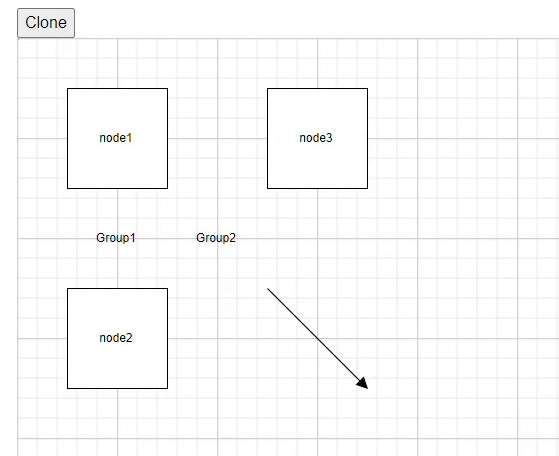

# Interaction in Blazor Diagram Component

## Selection

[DiagramSelectionSettings](https://help.syncfusion.com/cr/blazor/Syncfusion.Blazor.Diagram.DiagramSelectionSettings.html) provides a visual representation of selected elements. It behaves like a container and allows to update the size, position, and rotation angle of the selected elements through interaction and by using program. Single or multiple elements can be selected at a time.

## Single selection

An element can be selected by clicking that element. During single click, all previously selected items are cleared. The following image shows how the selected elements are visually represented.


* While selecting the diagram elements, the following events can be used to do your customization.
* When selecting/unselecting the diagram elements, the following events get triggered and do customization on those events.

| Events | EventArgs | Description |
|----------------|--------------|--------------|
| [SelectionChanging](https://help.syncfusion.com/cr/blazor/Syncfusion.Blazor.Diagram.SfDiagramComponent.html#Syncfusion_Blazor_Diagram_SfDiagramComponent_SelectionChanging) | [SelectionChangingEventArgs](https://help.syncfusion.com/cr/blazor/Syncfusion.Blazor.Diagram.SelectionChangingEventArgs.html) | Notify when clicking to select the elements in the diagram. |
| [SelectionChanged](https://help.syncfusion.com/cr/blazor/Syncfusion.Blazor.Diagram.SfDiagramComponent.html#Syncfusion_Blazor_Diagram_SfDiagramComponent_SelectionChanged) | [SelectionChangedEventArgs](https://help.syncfusion.com/cr/blazor/Syncfusion.Blazor.Diagram.SelectionChangedEventArgs.html) | Notify after clicking to select the elements in the diagram. |

```csharp
@using Syncfusion.Blazor.Diagram

<SfDiagramComponent Height="600px" Nodes="@NodeCollection" 
    SelectionChanging="OnSelectionChanging" 
    SelectionChanged="OnSelectionChanged">
</SfDiagramComponent>
@code
{
    public DiagramObjectCollection<Node> NodeCollection = new DiagramObjectCollection<Node>();
    protected override void OnInitialized()
    {
        Node node = new Node()
        {
            OffsetX = 100,
            OffsetY = 200,
            Height = 100,
            Width = 100,
            ID = "node",
        };
        NodeCollection.Add(node);
    }    
    //To notify selection changing event, before selecting the nodes/connectors in the diagram.
    private void OnSelectionChanging(SelectionChangingEventArgs args)
    {
        //Sets true to cancel the element's selection.
        args.Cancel = true;
    }
    //To notify selection changed event, after selecting the nodes/connectors in the diagram.
    private void OnSelectionChanged(SelectionChangedEventArgs args)
    {
        //Action to be performed.
    }
}
```
You can download a complete working sample from [GitHub](https://github.com/SyncfusionExamples/Blazor-Diagram-Examples/tree/master/UG-Samples/Interaction/DiagramSelectionEvent)

## Selecting a group

When a child element of any group is clicked, its contained group is selected instead of the child element. With consecutive clicks on the selected element, the selection is changed from top to bottom in the hierarchy of the parent group to its children.

## Multiple selection

Multiple elements can be selected with the following ways:

* Ctrl+Click

During a single click, any existing item in the selection list is cleared, and only the recently clicked item remains in the selection list. To avoid clearing the previously selected item, Ctrl key must be on hold when clicking.

* Selection rectangle/rubber band selection

Clicking and dragging the diagram area allows to create a rectangular region. The elements that are covered under the rectangular region are selected at the end.


## Select/Unselect elements using program

The [Select](https://help.syncfusion.com/cr/blazor/Syncfusion.Blazor.Diagram.SfDiagramComponent.html#Syncfusion_Blazor_Diagram_SfDiagramComponent_Select_System_Collections_ObjectModel_ObservableCollection_Syncfusion_Blazor_Diagram_IDiagramObject__System_Nullable_System_Boolean__) and [ClearSelection](https://help.syncfusion.com/cr/blazor/Syncfusion.Blazor.Diagram.SfDiagramComponent.html#Syncfusion_Blazor_Diagram_SfDiagramComponent_ClearSelection) methods help to select or clear the selection of the elements at runtime.

Get the currently selected items from the [Nodes](https://help.syncfusion.com/cr/blazor/Syncfusion.Blazor.Diagram.SfDiagramComponent.html#Syncfusion_Blazor_Diagram_SfDiagramComponent_Nodes) and [Connectors](https://help.syncfusion.com/cr/blazor/Syncfusion.Blazor.Diagram.SfDiagramComponent.html#Syncfusion_Blazor_Diagram_SfDiagramComponent_Connectors) collection of the [SelectionSettings](https://help.syncfusion.com/cr/blazor/Syncfusion.Blazor.Diagram.SfDiagramComponent.html#Syncfusion_Blazor_Diagram_SfDiagramComponent_SelectionSettings) property of the diagram model.

## Select entire elements in diagram programmatically

The [SelectAll](https://help.syncfusion.com/cr/blazor/Syncfusion.Blazor.Diagram.SfDiagramComponent.html#Syncfusion_Blazor_Diagram_SfDiagramComponent_SelectAll) method is used to select all the elements such as nodes/connectors in the diagram. Refer to the following link which shows how to use SelectAll method on the diagram.
### How to clone the selected nodes and connector at runtime
Clone is a virtual method of the node that is used to create a copy of a diagram object. After cloning, it is necessary to set a unique ID for the cloned nodes and connectors. The following code demonstrates how to clone selected nodes during runtime.
```cshtml
@using Syncfusion.Blazor.Diagram
@using System.Collections.ObjectModel
@inject IJSRuntime js
@using Syncfusion.Blazor.Buttons


<SfButton Content="Clone" OnClick="@Clone" />
<SfDiagramComponent @ref="diagram" Width="50%" Height="800px" @bind-Connectors="@Connectors" @bind-Nodes="NodeCollection"></SfDiagramComponent>
@functions
{
    public string ID = "diagram";
    SfDiagramComponent diagram;
    public string Height { get; set; } = "700px";
    public DiagramObjectCollection<Node> NodeCollection = new DiagramObjectCollection<Node>();
    public DiagramObjectCollection<Connector> Connectors = new DiagramObjectCollection<Connector>();
    protected override void OnInitialized()
    {
        Node node1 = new Node()
            {
                ID = "node1",
                OffsetX = 100,
                OffsetY = 100,
                Height = 100,
                Width = 100,
                Annotations = new DiagramObjectCollection<ShapeAnnotation>()
                    {
                        new ShapeAnnotation()
                        {
                            Content = "node1"
                        },
                    },
            };
        NodeCollection.Add(node1);
        Node node2 = new Node()
            {
                ID = "node2",
                OffsetX = 100,
                OffsetY = 300,
                Height = 100,
                Width = 100,
                Annotations = new DiagramObjectCollection<ShapeAnnotation>()
                    {
                        new ShapeAnnotation()
                        {
                            Content = "node2"
                        },
                    },
            };
        NodeCollection.Add(node2);
        NodeGroup group1 = new NodeGroup()
            {
                ID = "group1",
                Children = new string[] { "node1", "node2" },
                Annotations = new DiagramObjectCollection<ShapeAnnotation>()
                        {
                            new ShapeAnnotation()
                            {
                            Content = "Group1"
                            }
                        },
            };
        NodeCollection.Add(group1);
        Node node3 = new Node()
            {
                ID = "node3",
                OffsetX = 300,
                OffsetY = 100,
                Height = 100,
                Width = 100,
                Annotations = new DiagramObjectCollection<ShapeAnnotation>()
                    {
                        new ShapeAnnotation()
                        {
                            Content = "node3"
                        },
                    },
            };
        NodeCollection.Add(node3);
        Connector connector = new Connector()
            {
                ID = "connector1",
                SourcePoint = new DiagramPoint() { X = 250, Y = 250 },
                TargetPoint = new DiagramPoint() { X = 350, Y = 350 },
            };
        Connectors.Add(connector);
        NodeGroup group2 = new NodeGroup()
            {
                ID = "group2",
                Children = new string[] { "node3", "connector1", "group1" },
                Annotations = new DiagramObjectCollection<ShapeAnnotation>()
                        {
                            new ShapeAnnotation()
                            {
                            Content = "Group2"
                            }
                        },
            };
        NodeCollection.Add(group2);
    }
    public void Clone()
    {
        diagram.StartGroupAction();
        if (diagram.SelectionSettings.Nodes.Count > 0)
        {
            NodeBase NodeObj = diagram.SelectionSettings.Nodes[0] as NodeBase;
            if (NodeObj is NodeGroup gNode)
            {
                CloneGroup(gNode, false);
            }
            else if (NodeObj is Node node)
            {
                CloneNode(node, false);
            }
        }
        if (diagram.SelectionSettings.Connectors.Count > 0)
        {
            NodeBase ConnectorObj = diagram.SelectionSettings.Connectors[0] as NodeBase;
            if (ConnectorObj is Connector connectorObj)
            {
                CloneConnector(connectorObj, false);
            }
        }
        diagram.ClearSelection();
        diagram.EndGroupAction();
    }
    public string CloneGroup(NodeGroup gNode, bool isChild)
    {
        NodeGroup groupNode = gNode.Clone() as NodeGroup;
        groupNode.ID = RandomId();
        List<string> child = new List<string>();
        foreach (string childID in groupNode.Children)
        {
            for (int i = 0; i < diagram.Nodes.Count; i++)
            {
                if (childID == diagram.Nodes[i].ID && diagram.Nodes[i] is NodeGroup nodeGroup)
                {
                    child.Add(CloneGroup(nodeGroup, true));
                }
                else if (childID == diagram.Nodes[i].ID)
                {
                    child.Add(CloneNode(diagram.Nodes[i], true));
                }
            }
            for (int i = 0; i < diagram.Connectors.Count; i++)
            {
                if (childID == diagram.Connectors[i].ID)
                {
                    child.Add(CloneConnector(diagram.Connectors[i], true));
                }
            }
        }
        groupNode.Children = child.ToArray();
        if (!isChild)
        {
            groupNode.OffsetX += 25;
            groupNode.OffsetY += 25;
        }
        diagram.AddDiagramElementsAsync(new DiagramObjectCollection<NodeBase>() { groupNode });
        return groupNode.ID;
    }
    public string CloneNode(Node node, bool isChild)
    {
        diagram.StartGroupAction();
        Node nodeChild = node.Clone() as Node;
        nodeChild.ID = RandomId();
        if (!isChild)
        {
            nodeChild.OffsetX += 25;
            nodeChild.OffsetY += 25;
        }
        diagram.AddDiagramElementsAsync(new DiagramObjectCollection<NodeBase>() { nodeChild });
        diagram.EndGroupAction();
        return nodeChild.ID;
    }
    public string CloneConnector(Connector connector, bool isChild)
    {
        diagram.StartGroupAction();
        Connector connectorChild = connector.Clone() as Connector;
        connectorChild.ID = RandomId();
        if (!isChild)
        {
            connectorChild.SourcePoint = new DiagramPoint() { X = connectorChild.SourcePoint.X + 25, Y = connectorChild.SourcePoint.Y + 25 };
            connectorChild.TargetPoint = new DiagramPoint() { X = connectorChild.TargetPoint.X + 25, Y = connectorChild.TargetPoint.Y + 25 };
        }
        diagram.AddDiagramElementsAsync(new DiagramObjectCollection<NodeBase>() { connectorChild });
        diagram.EndGroupAction();
        return connectorChild.ID;
    }

    internal string RandomId()
    {
        Random random = new Random();
        const string chars = "ABCDEFGHIJKLMNOPQRSTUVWXTZabcdefghiklmnopqrstuvwxyz";
#pragma warning disable CA5394 // Do not use insecure randomness
        return new string(Enumerable.Repeat(chars, 5)
          .Select(s => s[random.Next(s.Length)]).ToArray());
#pragma warning restore CA5394 // Do not use insecure randomness
    }
}
```
You can download a complete working sample from [GitHub](https://github.com/SyncfusionExamples/Blazor-Diagram-Examples/tree/master/UG-Samples/Interaction/CloneSelectedItems)

## Drag

* An object can be dragged by clicking and dragging it. When multiple elements are selected, dragging any one of the selected elements moves every selected element.
* When you drag the elements in the diagram, the following events are triggered and do customization on those events.

| Events | EventArgs | Description |
|----------------|--------------|--------------|
| [PositionChanging](https://help.syncfusion.com/cr/blazor/Syncfusion.Blazor.Diagram.SfDiagramComponent.html#Syncfusion_Blazor_Diagram_SfDiagramComponent_PositionChanging) | [PositionChangingEventArgs](https://help.syncfusion.com/cr/blazor/Syncfusion.Blazor.Diagram.PositionChangingEventArgs.html) | Notify while dragging the elements in the diagram. |
| [PositionChanged](https://help.syncfusion.com/cr/blazor/Syncfusion.Blazor.Diagram.SfDiagramComponent.html#Syncfusion_Blazor_Diagram_SfDiagramComponent_PositionChanged) | [PositionChangedEventArgs](https://help.syncfusion.com/cr/blazor/Syncfusion.Blazor.Diagram.PositionChangedEventArgs.html) | Notify when the element's position has changed in the diagram. |

```csharp
@using Syncfusion.Blazor.Diagram

<SfDiagramComponent Height="600px" Nodes="@NodeCollection" 
    PositionChanging="OnPositionChanging" 
    PositionChanged="OnPositionChanged">
</SfDiagramComponent>
@code 
{
    public DiagramObjectCollection<Node> NodeCollection = new DiagramObjectCollection<Node>();
    protected override void OnInitialized()
    {
        Node node = new Node()
        {
            OffsetX = 100,
            OffsetY = 200,
            Height = 100,
            Width = 100,
            ID = "node",
        };
        NodeCollection.Add(node);
    }    
    //Event to notify while dragging the elements in the diagram.
    private void OnPositionChanging(PositionChangingEventArgs args)
    {
        //sets true to cancel the element's dragging
        args.Cancel = true;
    }
    //Event to notify once element's position has changed in the diagram.
    private void OnPositionChanged(PositionChangedEventArgs args)
    {
        //Action to be performed.
    }
}
```
You can download a complete working sample from [GitHub](https://github.com/SyncfusionExamples/Blazor-Diagram-Examples/tree/master/UG-Samples/Interaction/DiagramPositionEvent)
For more information about dragging, refer [Node Drag](./nodes/interaction#how-to-drag-the-node)

## Resize

* The selector is surrounded by eight thumbs. When dragging these thumbs, selected items can be resized.
* When one corner of the selector is dragged, the opposite corner remains in a static position.
* When a node is resized, the following events get triggered.

| Events | EventArgs | Description |
|----------------|--------------|--------------|
| [SizeChanging](https://help.syncfusion.com/cr/blazor/Syncfusion.Blazor.Diagram.SfDiagramComponent.html#Syncfusion_Blazor_Diagram_SfDiagramComponent_SizeChanging) | [SizeChangingEventArgs](https://help.syncfusion.com/cr/blazor/Syncfusion.Blazor.Diagram.SizeChangingEventArgs.html) | Notify while resizing the elements in the diagram. |
| [SizeChanged](https://help.syncfusion.com/cr/blazor/Syncfusion.Blazor.Diagram.SfDiagramComponent.html#Syncfusion_Blazor_Diagram_SfDiagramComponent_SizeChanged) | [SizeChangedEventArgs](https://help.syncfusion.com/cr/blazor/Syncfusion.Blazor.Diagram.SizeChangedEventArgs.html) | Notify when the element's size has changed in the diagram. |

```csharp
@using Syncfusion.Blazor.Diagram

<SfDiagramComponent Height="600px" Nodes="@NodeCollection" 
    SizeChanging="OnSizeChanging" 
    SizeChanged="OnSizeChanged">
</SfDiagramComponent>

@code 
{
    public DiagramObjectCollection<Node> NodeCollection = new DiagramObjectCollection<Node>();
    protected override void OnInitialized()
    {
        Node node = new Node()
        {
            OffsetX = 100,
            OffsetY = 200,
            Height = 100,
            Width = 100,
            ID = "node",
        };
        NodeCollection.Add(node);
    }    
    //Event to notify while resizing the elements in the diagram.
    private void OnSizeChanging(SizeChangingEventArgs args)
    {
        //sets true to cancel the element's resizing
        args.Cancel = true;
    }
    //Event to notify once element's size has changed in the diagram.
    private void OnSizeChanged(SizeChangedEventArgs args)
    {
        //Action to be performed.
    }
}
```
You can download a complete working sample from [GitHub](https://github.com/SyncfusionExamples/Blazor-Diagram-Examples/tree/master/UG-Samples/Interaction/DiagramSizeEvent)

For more information about resizing, refer [Node Resize](./nodes/interaction#how-to-resize-the-node)

N> While dragging and resizing, the objects are snapped towards the nearest objects to make better alignments. For better alignments, refer to [Snapping](./grid-lines#snapping).

## Rotate

* A rotate handler is placed above the selector. Clicking and dragging the handler in a circular direction lead to rotate the node.
* The node is rotated with reference to the static pivot point.
* A pivot thumb (thumb at the middle of the node) appears while rotating the node to represent the static point.
* When a node is rotated, the following events get triggered.

| Events | EventArgs | Description |
|----------------|--------------|--------------|
| [RotationChanging](https://help.syncfusion.com/cr/blazor/Syncfusion.Blazor.Diagram.SfDiagramComponent.html#Syncfusion_Blazor_Diagram_SfDiagramComponent_RotationChanging) | [RotationChangingEventArgs](https://help.syncfusion.com/cr/blazor/Syncfusion.Blazor.Diagram.RotationChangingEventArgs.html) | Notify while rotating the elements in the diagram. |
| [RotationChanged](https://help.syncfusion.com/cr/blazor/Syncfusion.Blazor.Diagram.SfDiagramComponent.html#Syncfusion_Blazor_Diagram_SfDiagramComponent_RotationChanged) | [RotationChangedEventArgs](https://help.syncfusion.com/cr/blazor/Syncfusion.Blazor.Diagram.RotationChangedEventArgs.html) | Notify when the element's rotate angle has changed in the diagram. |

```csharp
@using Syncfusion.Blazor.Diagram

<SfDiagramComponent Height="600px" Nodes="@NodeCollection" 
    RotationChanging="OnRotationChanging" 
    RotationChanged="OnRotationChanged">
</SfDiagramComponent>

@code 
{
    public DiagramObjectCollection<Node> NodeCollection = new DiagramObjectCollection<Node>();
    protected override void OnInitialized()
    {
        Node node = new Node()
        {
            OffsetX = 100,
            OffsetY = 200,
            Height = 100,
            Width = 100,
            ID = "node",
        };
        NodeCollection.Add(node);
    }    
    //Event to notify while rotating the elements in the diagram.
    private void OnRotationChanging(RotationChangingEventArgs args)
    {
        //sets true to cancel the element's rotation
        args.Cancel = true;
    }
    //Event to notify once element's rotate angle has changed in the diagram.
    private void OnRotationChanged(RotationChangedEventArgs args)
    {
        //Action to be performed.
    }
}
```
You can download a complete working sample from [GitHub](https://github.com/SyncfusionExamples/Blazor-Diagram-Examples/tree/master/UG-Samples/Interaction/DiagramRotateEvent)

For more information about resizing, refer [Node Rotate](./nodes/interaction#how-to-rotate-the-node)

## Connection editing

* Each segment of a selected connector is editable with some specific handles/thumbs.

## End point handles

Source and target points of the selected connectors are represented by two handles. Clicking and dragging those handles help you to adjust the source and target points.

For more information, refer [End Point Dragging](./connectors/interactions#end-point-dragging)

* If you drag the connector end points, then the following events can be used to do your customization.
* When you connect connector with ports/node or disconnect from it, the following events are triggered.

| Events | EventArgs | Description |
|----------------|--------------|--------------|
| [ConnectionChanging](https://help.syncfusion.com/cr/blazor/Syncfusion.Blazor.Diagram.SfDiagramComponent.html#Syncfusion_Blazor_Diagram_SfDiagramComponent_ConnectionChanging) | [ConnectionChangingEventArgs](https://help.syncfusion.com/cr/blazor/Syncfusion.Blazor.Diagram.ConnectionChangingEventArgs.html) | Notify while creating the connection between the nodes in the diagram. |
| [ConnectionChanged](https://help.syncfusion.com/cr/blazor/Syncfusion.Blazor.Diagram.SfDiagramComponent.html#Syncfusion_Blazor_Diagram_SfDiagramComponent_ConnectionChanged) | [ConnectionChangedEventArgs](https://help.syncfusion.com/cr/blazor/Syncfusion.Blazor.Diagram.ConnectionChangedEventArgs.html) | Notify once the connection has been created between the nodes in the diagram. |

```csharp
@using Syncfusion.Blazor.Diagram

<SfDiagramComponent Height="600px" Nodes="@NodeCollection" Connectors="@Connectors"
    ConnectionChanging="OnConnectionChanging" 
    ConnectionChanged="OnConnectionChanged">
</SfDiagramComponent>

@code 
{
    public DiagramObjectCollection<Node> NodeCollection = new DiagramObjectCollection<Node>();
    public DiagramObjectCollection<Connector> Connectors = new DiagramObjectCollection<Connector>();
    protected override void OnInitialized()
    {
        Node node1 = new Node()
        {
            OffsetX = 100,
            OffsetY = 200,
            Height = 100,
            Width = 100,
            ID = "node1",
        };
        NodeCollection.Add(node1);

        Node node2 = new Node()
        {
            OffsetX = 300,
            OffsetY = 200,
            Height = 100,
            Width = 100,
            ID = "node2",
        };
        NodeCollection.Add(node2);

        Connector Connector = new Connector()
        {
            ID = "connector1",
            //Source node id of the connector.
            SourceID = "node1",
            TargetDecorator = new DecoratorSettings()
            {
                Style = new ShapeStyle()
                {
                    Fill = "#6495ED",
                    StrokeColor = "#6495ED",
                }
            },
            //Target node id of the connector.
            TargetID = "node2",
            Style = new ShapeStyle()
            {
                Fill = "#6495ED",
                StrokeColor = "#6495ED",
            },
            // Type of the connector.
            Type = ConnectorSegmentType.Straight,
        };
        Connectors.Add(Connector);
    }    
    //Event to notify while creating the connection between the nodes in the diagram.
    private void OnConnectionChanging(ConnectionChangingEventArgs args)
    {
        //Sets true to cancel the element's resizing.
        args.Cancel = true;
    }
    //Event to notify once created the connection between the nodes in the diagram.
    private void OnConnectionChanged(ConnectionChangedEventArgs args)
    {
        //Action to be performed.
    }
}
```
You can download a complete working sample from [GitHub](https://github.com/SyncfusionExamples/Blazor-Diagram-Examples/tree/master/UG-Samples/Interaction/DiagramConnectionEvent)

## Straight segment editing

* End point of each straight segment is represented by a thumb that enables to edit the segment.
* Any number of new segments can be inserted into a straight line by clicking, when Shift and Ctrl keys are pressed (Ctrl+Shift+Click).
* Straight segments can be removed by clicking the segment end point, when Ctrl and Shift keys are pressed (Ctrl+Shift+Click).

For more information about straight segment editing, refer [Straight Segment Editing](./connectors/segments/straight#straight-segment-editing)

## Orthogonal segment editing

* Orthogonal thumbs allow you to adjust the length of adjacent segments by clicking and dragging them.
* When necessary, some segments are added or removed automatically, when dragging the segment. This is to maintain proper routing of orthogonality between segments.
* When editing the segment collection of a connector, the following event gets triggered.

| Events | EventArgs | Description |
|----------------|--------------|--------------|
| [SegmentCollectionChange](https://help.syncfusion.com/cr/blazor/Syncfusion.Blazor.Diagram.SfDiagramComponent.html#Syncfusion_Blazor_Diagram_SfDiagramComponent_SegmentCollectionChange) | [SegmentCollectionChangeEventArgs](https://help.syncfusion.com/cr/blazor/Syncfusion.Blazor.Diagram.SegmentCollectionChangeEventArgs.html) | Notify when the connector's segment collection has modified in the diagram. |

```csharp
@using Syncfusion.Blazor.Diagram

<SfDiagramComponent Width="1000px" Height="500px" Connectors="@Connectors" SegmentCollectionChange="OnSegmentChange">
</SfDiagramComponent>
@code{
    //Defines diagram's connector collection.
    DiagramObjectCollection<Connector> Connectors = new DiagramObjectCollection<Connector>();
    protected override void OnInitialized()
    {

        Connector connector = new Connector()
        {
            ID = "connector1",
            SourcePoint = new DiagramPoint()
            {
                X = 100,
                Y = 100
            },
            // Enable DragSegmentThumb constraints to segment editing.
            Constraints = ConnectorConstraints.Default | ConnectorConstraints.DragSegmentThumb,
            Style = new ShapeStyle() { StrokeColor = "#6f409f", StrokeWidth = 1 },
            TargetPoint = new DiagramPoint() { X = 300, Y = 300 },
             //Specify the segments type as Orthogonal.
            Type = ConnectorSegmentType.Orthogonal,
             //Create a new segment with length and direction.
            Segments = new DiagramObjectCollection<ConnectorSegment>()
            {
                new OrthogonalSegment 
                {
                    Length = 100,
                    Type = ConnectorSegmentType.Orthogonal,
                    Direction = Direction.Right, 
                },
                new OrthogonalSegment 
                {
                    Length = 100,
                    Type = ConnectorSegmentType.Orthogonal,
                    Direction = Direction.Bottom, 
                } 
            },
            TargetDecorator = new DecoratorSettings()
            {
                Shape = DecoratorShape.Arrow,
                Style = new ShapeStyle()
                {
                    Fill = "#6f409f",
                    StrokeColor = "#6f409f",
                    StrokeWidth = 1
                }
            }

        };
        Connectors.Add(connector);
    }
    //Event to notify while modifying the segment collection for the connector.
    private void OnSegmentChange(SegmentCollectionChangeEventArgs args)
    {
        //Action to be performed.
    }
}
```
You can download a complete working sample from [GitHub](https://github.com/SyncfusionExamples/Blazor-Diagram-Examples/tree/master/UG-Samples/Interaction/SegmentEditing)

For more information about orthogonal segment editing, refer [Orthogonal Segment Editing](./connectors/segments/orthogonal#orthogonal-segment-editing).

## User handles

* User handles are used to add some frequently used commands around the selector. To create user handles, define and add them to the [UserHandles](https://help.syncfusion.com/cr/blazor/Syncfusion.Blazor.Diagram.DiagramSelectionSettings.html#Syncfusion_Blazor_Diagram_DiagramSelectionSettings_UserHandles) collection of the [SelectionSettings](https://help.syncfusion.com/cr/blazor/Syncfusion.Blazor.Diagram.SfDiagramComponent.html#Syncfusion_Blazor_Diagram_SfDiagramComponent_SelectionSettings) property.
* The [Name](https://help.syncfusion.com/cr/blazor/Syncfusion.Blazor.Diagram.UserHandle.html#Syncfusion_Blazor_Diagram_UserHandle_Name) property of user handle is used to define the name of the user handle and it is further used to find the user handle at runtime and do any customization.

## How to align the user handle based on the node boundary

User handles can be aligned relative to the node boundaries. It has [Margin](https://help.syncfusion.com/cr/blazor/Syncfusion.Blazor.Diagram.UserHandle.html#Syncfusion_Blazor_Diagram_UserHandle_Margin), [Offset](https://help.syncfusion.com/cr/blazor/Syncfusion.Blazor.Diagram.UserHandle.html#Syncfusion_Blazor_Diagram_UserHandle_Offset), [Side](https://help.syncfusion.com/cr/blazor/Syncfusion.Blazor.Diagram.UserHandle.html#Syncfusion_Blazor_Diagram_UserHandle_Side), [HorizontalAlignment](https://help.syncfusion.com/cr/blazor/Syncfusion.Blazor.Diagram.UserHandle.html#Syncfusion_Blazor_Diagram_UserHandle_HorizontalAlignment), and [VerticalAlignment](https://help.syncfusion.com/cr/blazor/Syncfusion.Blazor.Diagram.UserHandle.html#Syncfusion_Blazor_Diagram_UserHandle_VerticalAlignment) settings. It is quite tricky when all four alignments are used together, but gives more control over alignment.

##  How to position the user handle

The [Offset](https://help.syncfusion.com/cr/blazor/Syncfusion.Blazor.Diagram.UserHandle.html#Syncfusion_Blazor_Diagram_UserHandle_Offset) property of a [UserHandle](https://help.syncfusion.com/cr/blazor/Syncfusion.Blazor.Diagram.UserHandle.html) is used to align the user handle based on fractions. 0 represents top/left corner, 1 represents bottom/right corner, and 0.5 represents half of width/height.

## How to align the user handle based on the connector boundary

The [Side](https://help.syncfusion.com/cr/blazor/Syncfusion.Blazor.Diagram.UserHandle.html#Syncfusion_Blazor_Diagram_UserHandle_Side) property of a [UserHandle](https://help.syncfusion.com/cr/blazor/Syncfusion.Blazor.Diagram.UserHandle.html) is used to align the user handle by using the [Top](https://help.syncfusion.com/cr/blazor/Syncfusion.Blazor.Diagram.Direction.html#Syncfusion_Blazor_Diagram_Direction_Top), [Bottom](https://help.syncfusion.com/cr/blazor/Syncfusion.Blazor.Diagram.Direction.html#Syncfusion_Blazor_Diagram_Direction_Bottom), [Left](https://help.syncfusion.com/cr/blazor/Syncfusion.Blazor.Diagram.Direction.html#Syncfusion_Blazor_Diagram_Direction_Left), and [Right](https://help.syncfusion.com/cr/blazor/Syncfusion.Blazor.Diagram.Direction.html#Syncfusion_Blazor_Diagram_Direction_Right) options.

## Add Horizontal and vertical alignments to the user handle

The [HorizontalAlignment](https://help.syncfusion.com/cr/blazor/Syncfusion.Blazor.Diagram.UserHandle.html#Syncfusion_Blazor_Diagram_UserHandle_HorizontalAlignment) property of a [UserHandle](https://help.syncfusion.com/cr/blazor/Syncfusion.Blazor.Diagram.UserHandle.html) is used to set how the user handle is horizontally aligned at the position based on the [Offset](https://help.syncfusion.com/cr/blazor/Syncfusion.Blazor.Diagram.UserHandle.html#Syncfusion_Blazor_Diagram_UserHandle_Offset). The [VerticalAlignment](https://help.syncfusion.com/cr/blazor/Syncfusion.Blazor.Diagram.UserHandle.html#Syncfusion_Blazor_Diagram_UserHandle_VerticalAlignment) property is used to set how user handle is vertically aligned at the position.

## Add Margin to the user handle

Margin is an absolute value used to add some blank space on any one of its four sides. The [UserHandle](https://help.syncfusion.com/cr/blazor/Syncfusion.Blazor.Diagram.UserHandle.html) can be displaced with the [Margin](https://help.syncfusion.com/cr/blazor/Syncfusion.Blazor.Diagram.UserHandle.html#Syncfusion_Blazor_Diagram_UserHandle_Margin) property.

## Notification for the mouse button clicked

The diagram component notifies the mouse button clicked. For example, whenever the right mouse button is clicked, the clicked button is notified as right. The mouse click is notified with,

| Notification | Description |
|----------------|--------------|
| Left | When the left mouse button is clicked, left is notified  |
| Middle | When the mouse wheel is clicked, middle is notified |
| Right | When the right mouse button is clicked, right is notified |

```csharp
@using Syncfusion.Blazor.Diagram

<SfDiagramComponent Height="600px" Nodes="@nodes" Click='@OnClick' />

@code
{
    public DiagramObjectCollection<Node> nodes;

    protected override void OnInitialized()
    {
        nodes = new DiagramObjectCollection<Node>();
        // A node is created and stored in nodes array.
        Node node = new Node()
        {
            // Position of the node.
            OffsetX = 250,
            OffsetY = 250,
            // Size of the node.
            Width = 100,
            Height = 100,
            // Add node.
            Style = new ShapeStyle() { Fill = "#6BA5D7", StrokeDashArray = "5,5", StrokeColor = "red", StrokeWidth = 2 },
        };
        nodes.Add(node);
    }

    private void OnClick(ClickEventArgs args)
    {
        Console.WriteLine("Button", args.Button);
    }
}
```
You can download a complete working sample from [GitHub](https://github.com/SyncfusionExamples/Blazor-Diagram-Examples/tree/master/UG-Samples/Interaction/MouseClick)

## Appearance of the user handle

The appearance of the user handle can be customized by using the [Size](https://help.syncfusion.com/cr/blazor/Syncfusion.Blazor.Diagram.UserHandle.html#Syncfusion_Blazor_Diagram_UserHandle_Size), [BorderColor](https://help.syncfusion.com/cr/blazor/Syncfusion.Blazor.Diagram.UserHandle.html#Syncfusion_Blazor_Diagram_UserHandle_BorderColor), [BackgroundColor](https://help.syncfusion.com/cr/blazor/Syncfusion.Blazor.Diagram.UserHandle.html#Syncfusion_Blazor_Diagram_UserHandle_BackgroundColor), [Visible](https://help.syncfusion.com/cr/blazor/Syncfusion.Blazor.Diagram.UserHandle.html#Syncfusion_Blazor_Diagram_UserHandle_Visible), [PathData](https://help.syncfusion.com/cr/blazor/Syncfusion.Blazor.Diagram.UserHandle.html#Syncfusion_Blazor_Diagram_UserHandle_PathData), and [PathColor](https://help.syncfusion.com/cr/blazor/Syncfusion.Blazor.Diagram.UserHandle.html#Syncfusion_Blazor_Diagram_UserHandle_PathColor) properties of the [UserHandle](https://help.syncfusion.com/cr/blazor/Syncfusion.Blazor.Diagram.UserHandle.html).

## Zoom pan the diagram

* When a large diagram is loaded, only certain portion of the diagram is visible. The remaining portions are clipped.       Clipped portions can be explored by scrolling the scrollbars or panning the diagram.
* The diagram can be zoomed in or out by using Ctrl + mouse wheel.


## Keyboard shortcuts

Diagram provides support to interact with elements with key gestures. By default, some in-built commands are bound with a relevant set of key combinations.

The following table illustrates those commands with the associated key values.

| Shortcut Key | Command | Description|
|--------------|---------|------------|
| Ctrl + A | [SelectAll](https://help.syncfusion.com/cr/blazor/Syncfusion.Blazor.Diagram.SfDiagramComponent.html#Syncfusion_Blazor_Diagram_SfDiagramComponent_SelectAll) | Select all nodes/connectors in the diagram.|
| Ctrl + Plus | [ZoomIn](https://help.syncfusion.com/cr/blazor/Syncfusion.Blazor.Diagram.SfDiagramComponent.html#Syncfusion_Blazor_Diagram_SfDiagramComponent_Zoom_System_Double_Syncfusion_Blazor_Diagram_DiagramPoint_) | Zoom in the diagram.|
| Ctrl + Minus | [ZoomOut](https://help.syncfusion.com/cr/blazor/Syncfusion.Blazor.Diagram.SfDiagramComponent.html#Syncfusion_Blazor_Diagram_SfDiagramComponent_Zoom_System_Double_Syncfusion_Blazor_Diagram_DiagramPoint_) | Zoom out the diagram.|
| Ctrl + C | [Copy](https://help.syncfusion.com/cr/blazor/Syncfusion.Blazor.Diagram.SfDiagramComponent.html#Syncfusion_Blazor_Diagram_SfDiagramComponent_Copy) | Copy the diagram selected elements.|
| Ctrl + V | [Paste](https://help.syncfusion.com/cr/blazor/Syncfusion.Blazor.Diagram.SfDiagramComponent.html#Syncfusion_Blazor_Diagram_SfDiagramComponent_Paste) | Pastes the copied elements.|
| Ctrl + X | [Cut](https://help.syncfusion.com/cr/blazor/Syncfusion.Blazor.Diagram.SfDiagramComponent.html#Syncfusion_Blazor_Diagram_SfDiagramComponent_Cut) | Cuts the selected elements.|
| Ctrl + Z | [Undo](https://help.syncfusion.com/cr/blazor/Syncfusion.Blazor.Diagram.SfDiagramComponent.html#Syncfusion_Blazor_Diagram_SfDiagramComponent_Undo) | Reverses the last editing action performed on the diagram.|
| Ctrl + Y | [Redo](https://help.syncfusion.com/cr/blazor/Syncfusion.Blazor.Diagram.SfDiagramComponent.html#Syncfusion_Blazor_Diagram_SfDiagramComponent_Redo) | Restores the last editing action when no other actions have occurred since the last undo on the diagram.|
| Delete | Delete | Deletes the selected elements.|
| Ctrl/Shift + Click on object |  | Multiple selection (Selector binds all selected nodes/connectors).|
| Up Arrow | [Nudge(Direction.Up)](https://help.syncfusion.com/cr/blazor/Syncfusion.Blazor.Diagram.SfDiagramComponent.html#Syncfusion_Blazor_Diagram_SfDiagramComponent_Nudge_Syncfusion_Blazor_Diagram_Direction_System_Nullable_System_Int32__) | `NudgeUp`: Moves the selected elements towards up by one pixel.|
| Down Arrow | [Nudge(Direction.Down)](https://help.syncfusion.com/cr/blazor/Syncfusion.Blazor.Diagram.SfDiagramComponent.html#Syncfusion_Blazor_Diagram_SfDiagramComponent_Nudge_Syncfusion_Blazor_Diagram_Direction_System_Nullable_System_Int32__) | `NudgeDown`: Moves the selected elements towards down by one pixel.|
| Left Arrow | [Nudge(Direction.Left)](https://help.syncfusion.com/cr/blazor/Syncfusion.Blazor.Diagram.SfDiagramComponent.html#Syncfusion_Blazor_Diagram_SfDiagramComponent_Nudge_Syncfusion_Blazor_Diagram_Direction_System_Nullable_System_Int32__) | `NudgeLeft`: Moves the selected elements towards left by one pixel.|
| Right Arrow | [Nudge(Direction.Right)](https://help.syncfusion.com/cr/blazor/Syncfusion.Blazor.Diagram.SfDiagramComponent.html#Syncfusion_Blazor_Diagram_SfDiagramComponent_Nudge_Syncfusion_Blazor_Diagram_Direction_System_Nullable_System_Int32__) | `NudgeRight`: Moves the selected elements towards right by one pixel.|
| Ctrl + MouseWheel | [Zoom](https://help.syncfusion.com/cr/blazor/Syncfusion.Blazor.Diagram.SfDiagramComponent.html#Syncfusion_Blazor_Diagram_SfDiagramComponent_Zoom_System_Double_Syncfusion_Blazor_Diagram_DiagramPoint_) | Zoom (Zoom in/Zoom out the diagram).|
| F2 | [StartTextEdit](https://help.syncfusion.com/cr/blazor/Syncfusion.Blazor.Diagram.SfDiagramComponent.html#Syncfusion_Blazor_Diagram_SfDiagramComponent_StartTextEdit_Syncfusion_Blazor_Diagram_IDiagramObject_System_String_) | Starts to edit the label of selected element.|
| Esc |  | Sets the label mode as view and stops editing.|

## See Also

* [How to control the diagram history](./undo-redo)