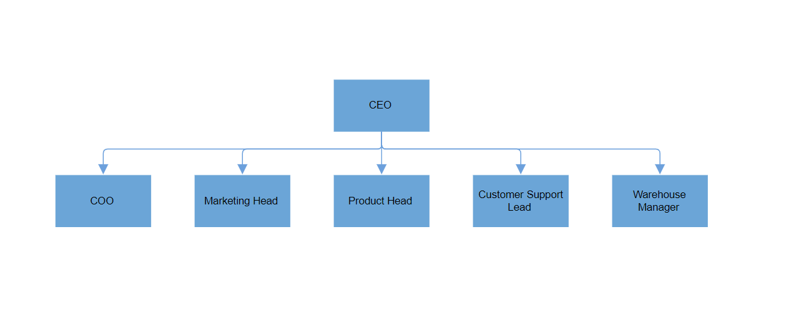
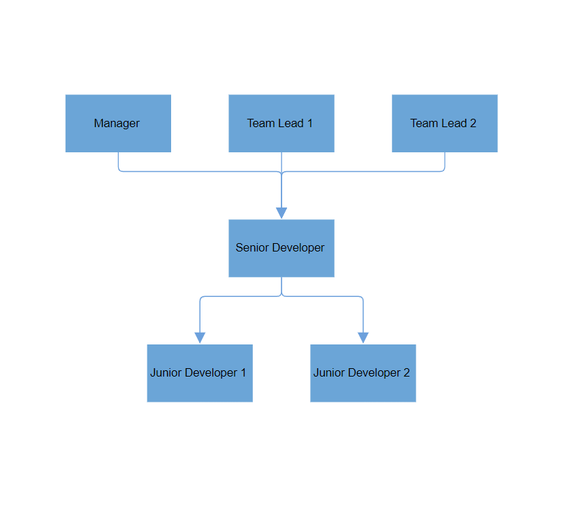
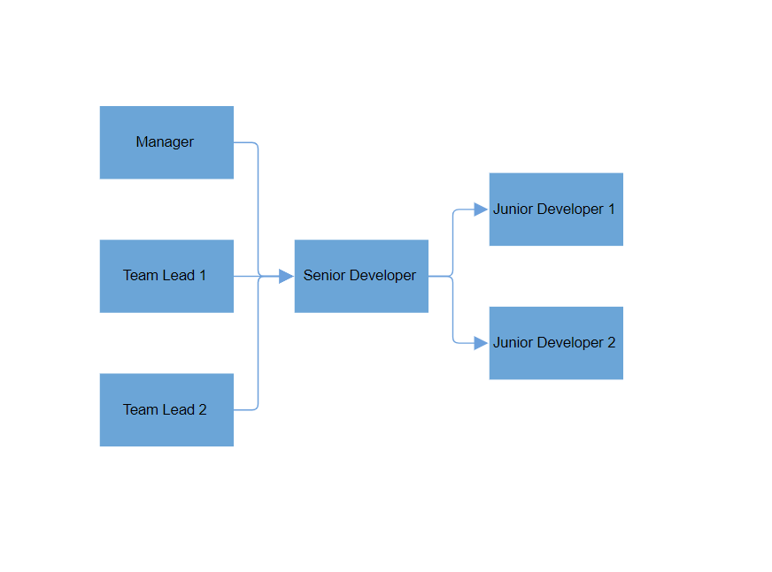
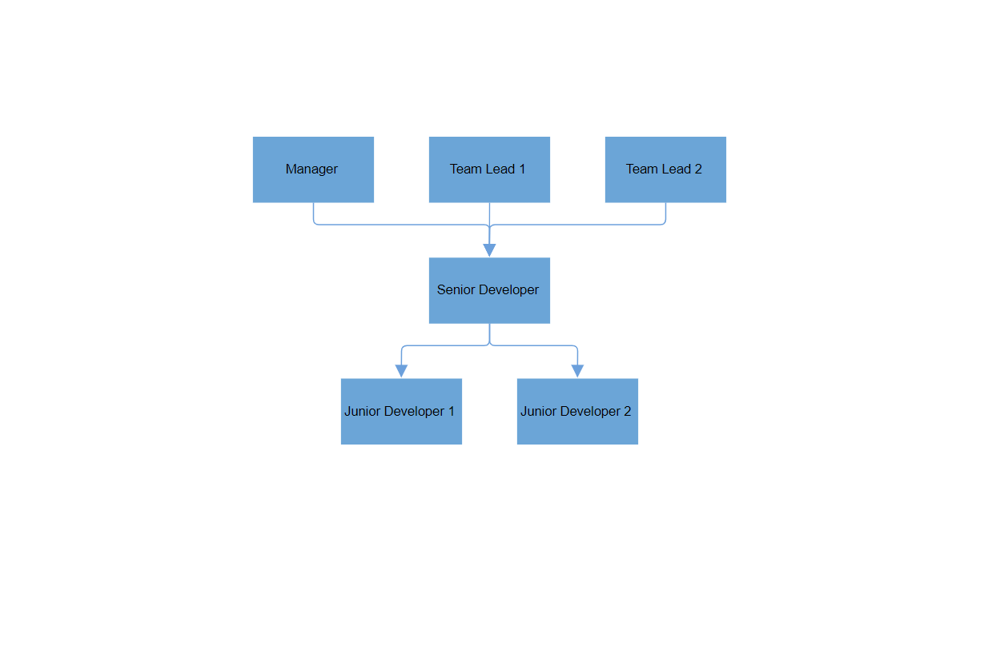
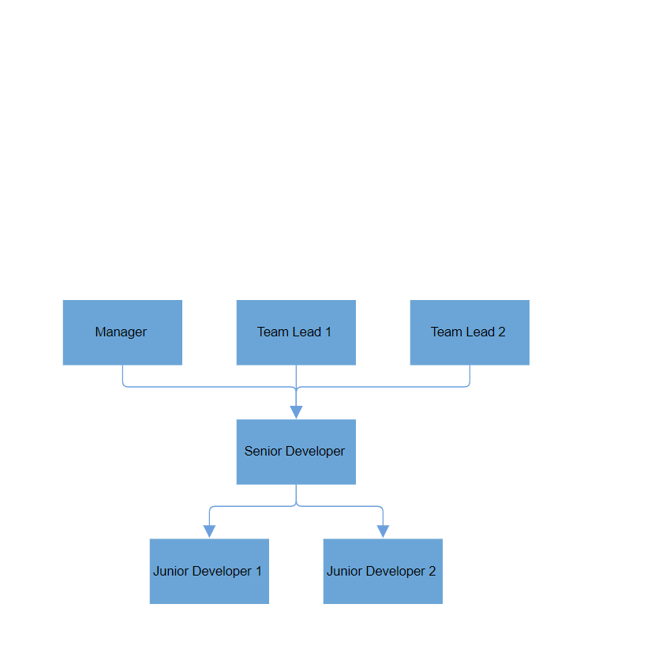
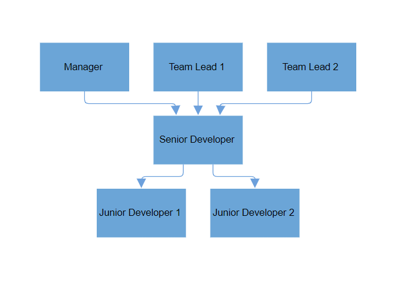

# Automatic Layout in Blazor Diagram Component

The Diagram component includes a set of built-in automatic layout algorithms designed to arrange nodes within the diagram area automatically based on predefined layout logic. This feature, referred to as [Layout](https://help.syncfusion.com/cr/blazor/Syncfusion.Blazor.Diagram.Layout.html), simplifies the organization of nodes and their connections, providing a clear and visually appealing structure for diagrams. Diagram supports the following built-in automatic layout algorithms:

* Organizational layout
* Flowchart layout
* MindMap tree layout
* Radial tree layout
* Hierarchical tree layout
* Complex Hierarchical tree layout

## Defining layout

To implement an automatic layout in a diagram, you can configure the layout settings within the SfDiagramComponent. The layout [Type](https://help.syncfusion.com/cr/blazor/Syncfusion.Blazor.Diagram.Layout.html#Syncfusion_Blazor_Diagram_Layout_Type), spacing, and other properties can be defined to control how nodes and connectors are arranged in the diagram.

The following code illustrates how to configure an automatic layout:

```csharp
@using Syncfusion.Blazor.Diagram

<SfDiagramComponent Height="600px" Nodes="@nodes" Connectors="@connectors" NodeCreating="@OnNodeCreating" ConnectorCreating="@OnConnectorCreating">
    <Layout Type="LayoutType.HierarchicalTree" @bind-HorizontalSpacing="@HorizontalSpacing" @bind-VerticalSpacing="@VerticalSpacing">
    </Layout>
    <SnapSettings>
        <HorizontalGridLines LineColor="white">
        </HorizontalGridLines>
        <VerticalGridLines LineColor="white">
        </VerticalGridLines>
    </SnapSettings>
</SfDiagramComponent>

@code
{
    //Defines diagram's connector collection.
    DiagramObjectCollection<Connector> connectors = new DiagramObjectCollection<Connector>();
    //Defines diagram's node collection.
    DiagramObjectCollection<Node> nodes = new DiagramObjectCollection<Node>();
    LayoutType type = LayoutType.ComplexHierarchicalTree;
    int HorizontalSpacing = 50;
    int VerticalSpacing = 50;

    private void OnNodeCreating(IDiagramObject obj)
    {
        Node node = obj as Node;
        node.Height = 60;
        node.Width = 110;
        node.Style = new ShapeStyle() { Fill = "#6BA5D7", StrokeWidth = 2, StrokeColor = "none" };
    }

    private void OnConnectorCreating(IDiagramObject connector)
    {
        (connector as Connector).Type = ConnectorSegmentType.Orthogonal;
        (connector as Connector).CornerRadius = 5;
        (connector as Connector).TargetDecorator = new DecoratorSettings() { Style = new ShapeStyle() { Fill = "#6CA0DC", StrokeColor = "#6CA0DC" } };
        (connector as Connector).Style = new ShapeStyle() { StrokeColor = "#6CA0DC" };
    }

    protected override void OnInitialized()
    {
        nodes = new DiagramObjectCollection<Node>()
        {
            new Node() { ID="node1", Annotations = new DiagramObjectCollection<ShapeAnnotation>() { new ShapeAnnotation{Content="CEO"} } },
            new Node() { ID="node2", Annotations = new DiagramObjectCollection<ShapeAnnotation>() { new ShapeAnnotation{Content="COO"} } },
            new Node() { ID="node3", Annotations = new DiagramObjectCollection<ShapeAnnotation>() { new ShapeAnnotation{Content="Marketing Head"} } },
            new Node() { ID="node4", Annotations = new DiagramObjectCollection<ShapeAnnotation>() { new ShapeAnnotation{Content="Product Head"} } },
            new Node() { ID="node5", Annotations = new DiagramObjectCollection<ShapeAnnotation>() { new ShapeAnnotation{Content="Customer Support Lead"} } },
            new Node() { ID="node6", Annotations = new DiagramObjectCollection<ShapeAnnotation>() { new ShapeAnnotation{Content="Warehouse Manager"} } },
        };
        connectors = new DiagramObjectCollection<Connector>()
        {
            new Connector() { ID="connector1", SourceID="node1", TargetID="node2" },
            new Connector() { ID="connector2", SourceID="node1", TargetID="node3" },
            new Connector() { ID="connector3", SourceID="node1", TargetID="node4" },
            new Connector() { ID="connector4", SourceID="node1", TargetID="node5" },
            new Connector() { ID="connector5", SourceID="node1", TargetID="node6" }
        };
    }
}
```
You can download a complete working sample from [GitHub](https://github.com/SyncfusionExamples/Blazor-Diagram-Examples/tree/master/UG-Samples/Layout/BasicLayout)



## How to Update Layout

The DoLayoutAsync function is used to re-arrange the nodes in the diagram area whenever any of the following occur:

* Add
* Remove
* Move
* Resize
* Spacing
* Orientation
* Layout Type
* Alignment

This function refreshes the layout dynamically to reflect these updates. By invoking DoLayoutAsync, you can ensure that the diagram remains visually consistent and properly aligned after any changes are made to its structure or properties. It provides an efficient way to update the diagram layout in response to user interactions or programmatic changes, ensuring smooth transitions and an organized appearance.

The function can be called on-demand, making it flexible for use in scenarios where automatic layout updates are required only at specific times, such as after multiple changes or interactions.

## How to Configure Spacing in Layouts

The [HorizontalSpacing](https://help.syncfusion.com/cr/blazor/Syncfusion.Blazor.Diagram.Layout.html#Syncfusion_Blazor_Diagram_Layout_HorizontalSpacing) and [VerticalSpacing](https://help.syncfusion.com/cr/blazor/Syncfusion.Blazor.Diagram.Layout.html#Syncfusion_Blazor_Diagram_Layout_VerticalSpacing) properties of layouts are used to customize the space between successive nodes in the diagram, both horizontally and vertically. These properties help control the overall layout and visual organization of nodes, ensuring clear and consistent spacing across the diagram.

* [HorizontalSpacing](https://help.syncfusion.com/cr/blazor/Syncfusion.Blazor.Diagram.Layout.html#Syncfusion_Blazor_Diagram_Layout_HorizontalSpacing): Determines the space between nodes along the horizontal axis. This property is especially useful when configuring layouts like flowcharts, organizational charts, or radial layouts.

* [VerticalSpacing](https://help.syncfusion.com/cr/blazor/Syncfusion.Blazor.Diagram.Layout.html#Syncfusion_Blazor_Diagram_Layout_VerticalSpacing): Controls the space between nodes along the vertical axis. It ensures a balanced distribution of nodes in layouts such as hierarchical trees or mind maps.

The default value for Horizontal Spacing is 30, and the default value for Vertical Spacing is also 30. You can modify these values to adjust the diagram’s appearance according to your specific requirements.

```csharp
<SfDiagramComponent @ref="diagram" Width="900px" Height="800px">
    <Layout Type="LayoutType.ComplexHierarchicalTree" @bind-HorizontalSpacing="@HorizontalSpacing" @bind-VerticalSpacing="@VerticalSpacing"/>
</SfDiagramComponent>

@code
{
    // Initializing the Horizontal and Vertical value.
    int HorizontalSpacing = 60;
    int VerticalSpacing = 70;

    // Update the spacing.
    public void UpdateSpacing()
    {
        Diagram.BeginUpdate();
        HorizontalSpacing += 10;
        VerticalSpacing += 10;
        Diagram.EndUpdateAsync();
    }
}
```



## How to Configure Layout Orientation

[Orientation](https://help.syncfusion.com/cr/blazor/Syncfusion.Blazor.Diagram.Layout.html#Syncfusion_Blazor_Diagram_Layout_Orientation) is used to arrange the layout based on the direction. It determines how the nodes are aligned in the diagram. The default value for orientation is [TopToBottom](https://help.syncfusion.com/cr/blazor/Syncfusion.Blazor.Diagram.LayoutOrientation.html#Syncfusion_Blazor_Diagram_LayoutOrientation_TopToBottom), which arranges the nodes vertically with the root placed at the top.

| Orientation Type | Description |
|-------- | -------- |
| [TopToBottom](https://help.syncfusion.com/cr/blazor/Syncfusion.Blazor.Diagram.LayoutOrientation.html#Syncfusion_Blazor_Diagram_LayoutOrientation_TopToBottom) | Aligns the layout from top to bottom. The root node is placed at the top of the diagram. |
| [BottomToTop](https://help.syncfusion.com/cr/blazor/Syncfusion.Blazor.Diagram.LayoutOrientation.html#Syncfusion_Blazor_Diagram_LayoutOrientation_BottomToTop) | Aligns the layout from bottom to top. The root node is placed at the bottom of the diagram. |
| [LeftToRight](https://help.syncfusion.com/cr/blazor/Syncfusion.Blazor.Diagram.LayoutOrientation.html#Syncfusion_Blazor_Diagram_LayoutOrientation_LeftToRight) | Aligns the layout from left to right. The root node is placed on the left side of the diagram. |
| [RightToLeft](https://help.syncfusion.com/cr/blazor/Syncfusion.Blazor.Diagram.LayoutOrientation.html#Syncfusion_Blazor_Diagram_LayoutOrientation_RightToLeft) | Aligns the layout from right to left. The root node is placed on the right side of the diagram. |

```csharp
<SfDiagramComponent @ref="diagram" Width="900px" Height="800px">
    <Layout Type="LayoutType.ComplexHierarchicalTree" @bind-Orientation="@orientation"/>
</SfDiagramComponent>

@code
{
    // Initializing the orientation value.
    LayoutOrientation orientation = LayoutOrientation.LeftToRight;
}
```



>**Note:** [Orientation](https://help.syncfusion.com/cr/blazor/Syncfusion.Blazor.Diagram.Layout.html#Syncfusion_Blazor_Diagram_Layout_Orientation) is not applicable to [RadialTree](https://help.syncfusion.com/cr/blazor/Syncfusion.Blazor.Diagram.LayoutType.html#Syncfusion_Blazor_Diagram_LayoutType_RadialTree) layout. For [Flowchart](https://help.syncfusion.com/cr/blazor/Syncfusion.Blazor.Diagram.LayoutType.html#Syncfusion_Blazor_Diagram_LayoutType_Flowchart) layout, only [TopToBottom](https://help.syncfusion.com/cr/blazor/Syncfusion.Blazor.Diagram.LayoutOrientation.html#Syncfusion_Blazor_Diagram_LayoutOrientation_TopToBottom) and [LeftToRight](https://help.syncfusion.com/cr/blazor/Syncfusion.Blazor.Diagram.LayoutOrientation.html#Syncfusion_Blazor_Diagram_LayoutOrientation_LeftToRight) orientations are supported.

## How to Configure Layout Alignments

[HorizontalAlignment](https://help.syncfusion.com/cr/blazor/Syncfusion.Blazor.Diagram.Layout.html#Syncfusion_Blazor_Diagram_Layout_HorizontalAlignment) and [VerticalAlignment](https://help.syncfusion.com/cr/blazor/Syncfusion.Blazor.Diagram.Layout.html#Syncfusion_Blazor_Diagram_Layout_VerticalAlignment) properties control how the layout is positioned or stretched along the horizontal and vertical axes, respectively. These settings determine the positioning of the diagram elements (nodes and connectors) within the available space.

The [HorizontalAlignment](https://help.syncfusion.com/cr/blazor/Syncfusion.Blazor.Diagram.Layout.html#Syncfusion_Blazor_Diagram_Layout_HorizontalAlignment) property defines how the layout is aligned horizontally within its container. The default value is Auto, meaning the layout will be aligned automatically based on its content.

The possible values for HorizontalAlignment are:

| Horizontal Alignment | Description |
|-------- | -------- |
| [Stretch](https://help.syncfusion.com/cr/blazor/Syncfusion.Blazor.Diagram.HorizontalAlignment.html#Syncfusion_Blazor_Diagram_HorizontalAlignment_Stretch) | Stretches the diagram element horizontally to its immediate parent, filling the available space. |
| [Left](https://help.syncfusion.com/cr/blazor/Syncfusion.Blazor.Diagram.HorizontalAlignment.html#Syncfusion_Blazor_Diagram_HorizontalAlignment_Left) | Aligns the diagram element to the left side of its immediate parent. |
| [Right](https://help.syncfusion.com/cr/blazor/Syncfusion.Blazor.Diagram.HorizontalAlignment.html#Syncfusion_Blazor_Diagram_HorizontalAlignment_Right) | Aligns the diagram element to the right side of its immediate parent. |
| [Center](https://help.syncfusion.com/cr/blazor/Syncfusion.Blazor.Diagram.HorizontalAlignment.html#Syncfusion_Blazor_Diagram_HorizontalAlignment_Center) | Aligns the diagram element horizontally to the center of its immediate parent. |
| [Auto](https://help.syncfusion.com/cr/blazor/Syncfusion.Blazor.Diagram.HorizontalAlignment.html#Syncfusion_Blazor_Diagram_HorizontalAlignment_Auto) | Aligns the diagram element based on its immediate parent’s horizontal alignment property (default behavior). |

```csharp
<SfDiagramComponent @ref="diagram" Width="900px" Height="800px">
    <Layout Type="LayoutType.ComplexHierarchicalTree" @bind-HorizontalSpacing="@HorizontalSpacing" @bind-VerticalSpacing="@VerticalSpacing" @bind-HorizontalAlignment="@horizontalAlignment"></Layout>
</SfDiagramComponent>

@code
{
    int HorizontalSpacing = 40;
    int VerticalSpacing = 40;
    // Initializing the HorizontalAlignment value.
    HorizontalAlignment horizontalAlignment = HorizontalAlignment.Center;
}
```


The [VerticalAlignment](https://help.syncfusion.com/cr/blazor/Syncfusion.Blazor.Diagram.Layout.html#Syncfusion_Blazor_Diagram_Layout_VerticalAlignment) property defines how the layout is aligned vertically within the container. The default value is Auto, which means the layout adjusts based on its content.

The possible values for VerticalAlignment are:

| Vertical Alignment | Description |
|-------- | -------- |
| [Stretch](https://help.syncfusion.com/cr/blazor/Syncfusion.Blazor.Diagram.VerticalAlignment.html#Syncfusion_Blazor_Diagram_VerticalAlignment_Stretch) | Stretches the diagram element vertically to its immediate parent, filling the available space. |
| [Top](https://help.syncfusion.com/cr/blazor/Syncfusion.Blazor.Diagram.VerticalAlignment.html#Syncfusion_Blazor_Diagram_VerticalAlignment_Top) | Aligns the diagram element to the top side of its immediate parent. |
| [Bottom](https://help.syncfusion.com/cr/blazor/Syncfusion.Blazor.Diagram.VerticalAlignment.html#Syncfusion_Blazor_Diagram_VerticalAlignment_Bottom) | Aligns the diagram element to the bottom side of its immediate parent. |
| [Center](https://help.syncfusion.com/cr/blazor/Syncfusion.Blazor.Diagram.VerticalAlignment.html#Syncfusion_Blazor_Diagram_VerticalAlignment_Center) | Aligns the diagram element vertically to the center of its immediate parent. |
| [Auto](https://help.syncfusion.com/cr/blazor/Syncfusion.Blazor.Diagram.VerticalAlignment.html#Syncfusion_Blazor_Diagram_VerticalAlignment_Auto) | Aligns the diagram element based on its immediate parent’s vertical alignment property (default behavior). |

```csharp
<SfDiagramComponent @ref="diagram" Width="900px" Height="800px">
    <Layout Type="LayoutType.ComplexHierarchicalTree" @bind-HorizontalSpacing="@HorizontalSpacing" @bind-VerticalSpacing="@VerticalSpacing" @bind-VerticalAlignment="@verticalAlignment"></Layout>
</SfDiagramComponent>

@code
{
    int HorizontalSpacing = 40;
    int VerticalSpacing = 40;
    // Initializing the VerticalAlignment value.
    VerticalAlignment verticalAlignment = VerticalAlignment.Bottom;
}
```


## How to Configure Layout Margins

The [LayoutMargin](https://help.syncfusion.com/cr/blazor/Syncfusion.Blazor.Diagram.Layout.html#Syncfusion_Blazor_Diagram_Layout_Margin) property defines the space between the viewport and the layout, creating a space around the diagram. The default margin is left: 50, top: 50, right: 0, bottom: 0.

You can customize the margin for each side (top, right, bottom, left) using the LayoutMargin object:
```csharp
<SfDiagramComponent Height="600px">
    <Layout Type="LayoutType.OrganizationalChart">
        <LayoutMargin Top="@top" Bottom="@bottom" Right="@right" Left="@left"></LayoutMargin>
    </Layout>
</SfDiagramComponent>

@code
{
    // Initializing the Margin.
    int left = 60;
    int top = 50;
    int bottom = 50;
    int right = 60;
}
```

## How to Handle Connector Segment Overlap in Layout

The [SamePoint](https://help.syncfusion.com/cr/blazor/Syncfusion.Blazor.Diagram.Layout.html#Syncfusion_Blazor_Diagram_Layout_SamePoint) property controls whether connectors in the layout should be arranged without overlapping other connectors. By setting this property to true, the diagram ensures that connectors are spaced out properly to avoid any overlap, making the layout more readable and visually clear.

* true: Connectors will be arranged to avoid overlapping with other connectors (default value).
* false: Connectors can overlap with each other.

Here’s an example of how to use this property:
```csharp
<SfDiagramComponent @ref="diagram" Width="900px" Height="800px">
    <Layout Type="LayoutType.ComplexHierarchicalTree" SamePoint="false"></Layout>
</SfDiagramComponent>
```


## See also

* [How to create a node](../nodes/nodes)

* [How to create a connector](../connectors/connectors)

* [How to generate the organization chart](./organizational-chart)

* [How to generate the hierarchical layout](./hierarchical-layout)

* [How to Create a Family Tree Structure in Blazor Diagram](https://support.syncfusion.com/kb/article/16300/how-to-create-a-family-tree-structure-in-blazor-diagram)

* [Create and Render the Organization Chart Diagram by Using SQL Database](https://support.syncfusion.com/kb/article/12329/create-and-render-the-organization-chart-diagram-by-using-sql-database)

* [How to Create the Org Chart Blazor Diagram by Using MDF Database](https://support.syncfusion.com/kb/article/12128/how-to-create-the-org-chart-blazor-diagram-by-using-mdf-database)

* [Why Is It Important to Set the ParentID to Empty for at Least One Node When Creating a Layout in Syncfusion Blazor Diagram?](https://support.syncfusion.com/kb/article/18708/why-is-it-important-to-set-the-parentid-to-empty-for-at-least-one-node-when-creating-a-layout-in-syncfusion-blazor-diagram)

* [How to Change the Parent Child Relationship in Layout at Runtime](https://support.syncfusion.com/kb/article/11632/how-to-change-the-parent-child-relationship-in-layout-at-runtime)

* [How to Customize Connector Styles in a Hierarchical Layout in Blazor Diagram](https://support.syncfusion.com/kb/article/16310/how-to-customize-connector-styles-in-a-hierarchical-layout-in-blazor-diagram)

* [How to Disable Node Interaction While Maintaining Layout Updates in Syncfusion Blazor Diagram](https://support.syncfusion.com/kb/article/20189/how-to-disable-node-interaction-while-maintaining-layout-updates-in-syncfusion-blazor-diagram)

* [How to Embed Diagrams Inside Panels of a Dashboard Layout in Blazor](https://support.syncfusion.com/kb/article/18993/how-to-embed-diagrams-inside-panels-of-a-dashboard-layout-in-blazor)

* [How to Drag and Drop Node in a Layout in Blazor Diagram](https://support.syncfusion.com/kb/article/16301/how-to-drag-and-drop-node-in-a-layout-in-blazor-diagram)

* [How to Generate a Hierarchical Layout with Annotation at Runtime](https://support.syncfusion.com/kb/article/17884/how-to-generate-a-hierarchical-layout-with-annotation-at-runtime)

* [How to Create an Organizational Chart Using Blazor Diagram](https://support.syncfusion.com/kb/article/16312/how-to-create-an-organizational-chart-using-blazor-diagram)

* [How to Integrate Syncfusion SfDiagramComponent into a SfTab in a Blazor Application](https://support.syncfusion.com/kb/article/17224/how-to-integrate-syncfusion-sfdiagramcomponent-into-a-sftab-in-a-blazor-application)