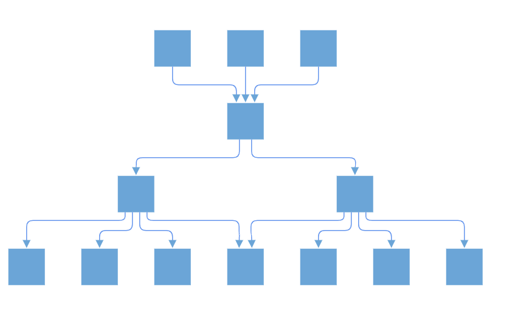
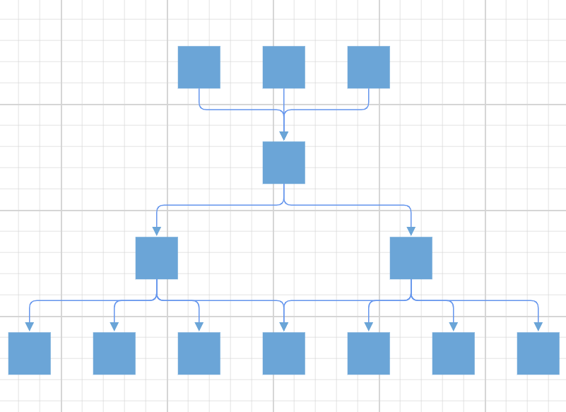

# Complex Hierarchical Layout in Blazor Diagram Component

Complex hierarchical tree layout arranges nodes in a tree-like structure, where the child node can have more than one parent. This layout is an extended version of the hierarchical tree layout. To create a complex hierarchical tree, the [Type](https://help.syncfusion.com/cr/blazor/Syncfusion.Blazor.Diagram.Layout.html#Syncfusion_Blazor_Diagram_Layout_Type) property of layout should be set as [ComplexHierarchicalTree](https://help.syncfusion.com/cr/blazor/Syncfusion.Blazor.Diagram.LayoutType.html#Syncfusion_Blazor_Diagram_LayoutType_ComplexHierarchicalTree).

```csharp
@using Syncfusion.Blazor.Diagram

<SfDiagramComponent Height="600px" Nodes="@nodes" Connectors="@connectors" NodeCreating="@OnNodeCreating" ConnectorCreating="@OnConnectorCreating">
    <Layout Type="LayoutType.ComplexHierarchicalTree" @bind-HorizontalSpacing="@HorizontalSpacing" @bind-VerticalSpacing="@VerticalSpacing">
    </Layout>
    <SnapSettings>
        <HorizontalGridLines LineColor="white" LineDashArray="2,2">
        </HorizontalGridLines>
        <VerticalGridLines LineColor="white" LineDashArray="2,2">
        </VerticalGridLines>
    </SnapSettings>
</SfDiagramComponent>

@code 
{
    int left = 40;
    int top = 50;
    //Initialize the diagram's nodes collection
    DiagramObjectCollection<Node> nodes = new DiagramObjectCollection<Node>();
    //Initialize the diagram's connectors collection
    DiagramObjectCollection<Connector> connectors = new DiagramObjectCollection<Connector>();
    int HorizontalSpacing = 40;
    int VerticalSpacing = 40;

    private void OnNodeCreating(IDiagramObject obj)
    {
        Node node = obj as Node;
        node.Height = 40;
        node.Width = 100;
        //Initializing the default node's shape style.
        node.Style = new ShapeStyle() { Fill = "darkcyan", StrokeWidth = 3, StrokeColor = "Black" };
        node.Annotations = new DiagramObjectCollection<ShapeAnnotation>()
        {
            new ShapeAnnotation 
            { 
                Content = node.Annotations[0].Content,
                Style = new TextStyle() { Color = "white", Bold = true }, 
            }
        };
    }

    private void OnConnectorCreating(IDiagramObject connector)
    {
        (connector as Connector).Type = ConnectorSegmentType.Orthogonal;
    }

    protected override void OnInitialized()
    {
        //Initializing node and connectors.
        nodes = new DiagramObjectCollection<Node>()
        {
            new Node() { ID="node1", Annotations = new DiagramObjectCollection<ShapeAnnotation>() { new ShapeAnnotation{Content="node1"} } },
            new Node() { ID="node2", Annotations = new DiagramObjectCollection<ShapeAnnotation>() { new ShapeAnnotation{Content="node2"} } },
            new Node() { ID="node3", Annotations = new DiagramObjectCollection<ShapeAnnotation>() { new ShapeAnnotation{Content="node3"} } },
            new Node() { ID="node4", Annotations = new DiagramObjectCollection<ShapeAnnotation>() { new ShapeAnnotation{Content="node4"} } },
            new Node() { ID="node5", Annotations = new DiagramObjectCollection<ShapeAnnotation>() { new ShapeAnnotation{Content="node5"} } },
        };
        connectors = new DiagramObjectCollection<Connector>()
        {
            new Connector() { ID="connector1", SourceID="node1", TargetID="node4" },
            new Connector() { ID="connector2", SourceID="node2", TargetID="node4" },
            new Connector() { ID="connector3", SourceID="node3", TargetID="node4" },
            new Connector() { ID="connector4", SourceID="node4", TargetID="node5" },
        };
    }
}

```
You can download a complete working sample from [GitHub](https://github.com/SyncfusionExamples/Blazor-Diagram-Examples/tree/master/UG-Samples/Layout/ComplexHierarchicalTree)


### How to enable/disable line distribution

Line distribution is used to arrange the connectors without overlapping in automatic layout. In some cases, the automatic layout connectors connecting to the nodes will be overlapped with one another. So user can decide whether the segment of each connector from a single parent node should be a same point or a different point. The [SamePoint](https://help.syncfusion.com/cr/blazor/Syncfusion.Blazor.Diagram.Layout.html#Syncfusion_Blazor_Diagram_Layout_SamePoint) property of layout is used to enable or disable the line distribution in layout. By default the value is true.

The following code example illustrates how to create a complex hierarchical tree with line distribution.

```csharp

@using Syncfusion.Blazor.Diagram

<SfDiagramComponent Height="600px" NodeCreating="@OnNodeCreating" ConnectorCreating="@OnConnectorCreating">
    <DataSourceSettings ID="Id" ParentID="ReportingPerson" DataSource="@DataSource"></DataSourceSettings>
    <Layout Type="LayoutType.ComplexHierarchicalTree" SamePoint="false" @bind-HorizontalSpacing="@HorizontalSpacing" @bind-VerticalSpacing="@VerticalSpacing">
    </Layout>
</SfDiagramComponent>

@code
{
    //Initializing layout.
    int HorizontalSpacing = 40;
    int VerticalSpacing = 50;

    //Creates node with some default values.
    private void OnNodeCreating(IDiagramObject obj)
    {
        Node node = obj as Node;
        node.Height = 40;
        node.Width = 40;
        node.Style = new ShapeStyle() { Fill = "#6BA5D7", StrokeWidth = 2, StrokeColor = "none" };
    }

    //Creates connectors with some default values.
    private void OnConnectorCreating(IDiagramObject connector)
    {
         (connector as Connector).Type = ConnectorSegmentType.Orthogonal;
        (connector as Connector).CornerRadius = 7;
        (connector as Connector).Style.StrokeWidth = 1;
        (connector as Connector).TargetDecorator.Height = 7;
        (connector as Connector).TargetDecorator.Width = 7;
        (connector as Connector).Style.Fill = "#6495ED";
        (connector as Connector).Style.StrokeColor = "#6495ED";
        (connector as Connector).TargetDecorator.Style.Fill = "#6BA5D7";
        (connector as Connector).TargetDecorator.Style.StrokeColor = "#6BA5D7";
    }

    public class ComplexHierarchical
    {
        public string Id { get; set; }
        public List<string>ReportingPerson { get; set; }
    }
    public object DataSource = new List<object>()
    {
        new ComplexHierarchical() { Id= "node11" },
        new ComplexHierarchical() { Id= "node12", ReportingPerson= new List<string>(){"node114" }},
        new ComplexHierarchical() { Id= "node13", ReportingPerson=new List<string>() {"node12" }},
        new ComplexHierarchical() { Id= "node14", ReportingPerson=new List<string>() {"node12"}},
        new ComplexHierarchical() { Id= "node15", ReportingPerson=new List<string>() {"node12" }},
        new ComplexHierarchical() { Id= "node116", ReportingPerson=new List<string>() {"node22","node12" }},     
        new ComplexHierarchical() { Id= "node21"},
        new ComplexHierarchical() { Id= "node22", ReportingPerson=new List<string>() {"node114" }},
        new ComplexHierarchical() { Id= "node23", ReportingPerson=new List<string>() {"node22" }},
        new ComplexHierarchical() { Id= "node24", ReportingPerson=new List<string>() {"node22"}},
        new ComplexHierarchical() { Id= "node25", ReportingPerson=new List<string>() {"node22"} },    
        new ComplexHierarchical() { Id= "node31"},
        new ComplexHierarchical() { Id= "node114", ReportingPerson=new List<string>() {"node11","node21","node31" }}
    };
}

```
You can download a complete working sample from [GitHub](https://github.com/SyncfusionExamples/Blazor-Diagram-Examples/tree/master/UG-Samples/Layout/LineDistribution)



>**Note:** In the DataSourceSettings, both the ID and ParentID properties are of type string. The given DataSource should have a parent-child relationship. Additionally, one of the ParentID values should be updated to be empty in order to establish a children-parent relationship at the source level. It is necessary for at least one node to have an empty ParentID.

### How to enable/disable linear arrangement

Linear arrangement  is used to arrange the child nodes in linear manner in the layout, that is the parent node is placed in the center, corresponding to its children. When line distribution is enabled, the linear arrangement is also activated by default. The [LinearArrangement](https://help.syncfusion.com/cr/blazor/Syncfusion.Blazor.Diagram.Layout.html#Syncfusion_Blazor_Diagram_Layout_LinearArrangement) property of layout is used to enable or disable the linear arrangement in the layout. By default, the value is false.
The following code illustrates how to arrange the nodes in non linear manner.
```csharp
 <SfDiagramComponent Height="600px" NodeCreating="@OnNodeCreating" ConnectorCreating="@OnConnectorCreating">
    <DataSourceSettings ID="Id" ParentID="ReportingPerson" DataSource="@DataSource"></DataSourceSettings>
    <Layout Type="LayoutType.ComplexHierarchicalTree" LinearArrangement="false" @bind-HorizontalSpacing="@HorizontalSpacing" @bind-VerticalSpacing="@VerticalSpacing">
    </Layout>
</SfDiagramComponent>

@code
{
    //Initializing layout.
    int HorizontalSpacing = 40;
    int VerticalSpacing = 50;

    //Creates node with some default values.
    private void OnNodeCreating(IDiagramObject obj)
    {
        Node node = obj as Node;
        node.Height = 40;
        node.Width = 40;
        node.Style = new ShapeStyle() { Fill = "#6BA5D7", StrokeWidth = 2, StrokeColor = "none" };
    }

    //Creates connectors with some default values.
    private void OnConnectorCreating(IDiagramObject connector)
    {
         (connector as Connector).Type = ConnectorSegmentType.Orthogonal;
        (connector as Connector).CornerRadius = 7;
        (connector as Connector).Style.StrokeWidth = 1;
        (connector as Connector).TargetDecorator.Height = 7;
        (connector as Connector).TargetDecorator.Width = 7;
        (connector as Connector).Style.Fill = "#6495ED";
        (connector as Connector).Style.StrokeColor = "#6495ED";
        (connector as Connector).TargetDecorator.Style.Fill = "#6BA5D7";
        (connector as Connector).TargetDecorator.Style.StrokeColor = "#6BA5D7";
    }

    public class ComplexHierarchical
    {
        public string Id { get; set; }
        public List<string>ReportingPerson { get; set; }
    }
    public object DataSource = new List<object>()
    {
        new ComplexHierarchical() { Id= "node11" },
        new ComplexHierarchical() { Id= "node12", ReportingPerson= new List<string>(){"node114" }},
        new ComplexHierarchical() { Id= "node13", ReportingPerson=new List<string>() {"node12" }},
        new ComplexHierarchical() { Id= "node14", ReportingPerson=new List<string>() {"node12"}},
        new ComplexHierarchical() { Id= "node15", ReportingPerson=new List<string>() {"node12" }},
        new ComplexHierarchical() { Id= "node116", ReportingPerson=new List<string>() {"node22","node12" }},       
        new ComplexHierarchical() { Id= "node21"},
        new ComplexHierarchical() { Id= "node22", ReportingPerson=new List<string>() {"node114" }},
        new ComplexHierarchical() { Id= "node23", ReportingPerson=new List<string>() {"node22" }},
        new ComplexHierarchical() { Id= "node24", ReportingPerson=new List<string>() {"node22"}},
        new ComplexHierarchical() { Id= "node25", ReportingPerson=new List<string>() {"node22"} },      
        new ComplexHierarchical() { Id= "node31"},
        new ComplexHierarchical() { Id= "node114", ReportingPerson=new List<string>() {"node11","node21","node31" }}
    };
}
```
You can download a complete working sample from [GitHub](https://github.com/SyncfusionExamples/Blazor-Diagram-Examples/tree/master/UG-Samples/Layout/LinearArrangementNonLinear)


The following code illustrates how to arrange the nodes in  linear manner.

```csharp
 <SfDiagramComponent Height="600px" NodeCreating="@OnNodeCreating" ConnectorCreating="@OnConnectorCreating">
    <DataSourceSettings ID="Id" ParentID="ReportingPerson" DataSource="@DataSource"></DataSourceSettings>
    <Layout Type="LayoutType.ComplexHierarchicalTree" LinearArrangement="true" @bind-HorizontalSpacing="@HorizontalSpacing" @bind-VerticalSpacing="@VerticalSpacing">
    </Layout>
</SfDiagramComponent>

@code
{
    //Initializing layout.
    int HorizontalSpacing = 40;
    int VerticalSpacing = 50;

    //Creates node with some default values.
    private void OnNodeCreating(IDiagramObject obj)
    {
        Node node = obj as Node;
        node.Height = 40;
        node.Width = 40;
        node.Style = new ShapeStyle() { Fill = "#6BA5D7", StrokeWidth = 2, StrokeColor = "none" };
    }

    //Creates connectors with some default values.
    private void OnConnectorCreating(IDiagramObject connector)
    {
         (connector as Connector).Type = ConnectorSegmentType.Orthogonal;
        (connector as Connector).CornerRadius = 7;
        (connector as Connector).Style.StrokeWidth = 1;
        (connector as Connector).TargetDecorator.Height = 7;
        (connector as Connector).TargetDecorator.Width = 7;
        (connector as Connector).Style.Fill = "#6495ED";
        (connector as Connector).Style.StrokeColor = "#6495ED";
        (connector as Connector).TargetDecorator.Style.Fill = "#6BA5D7";
        (connector as Connector).TargetDecorator.Style.StrokeColor = "#6BA5D7";
    }

    public class ComplexHierarchical
    {
        public string Id { get; set; }
        public List<string>ReportingPerson { get; set; }
    }
    public object DataSource = new List<object>()
    {
        new ComplexHierarchical() { Id= "node11" },
        new ComplexHierarchical() { Id= "node12", ReportingPerson= new List<string>(){"node114" }},
        new ComplexHierarchical() { Id= "node13", ReportingPerson=new List<string>() {"node12" }},
        new ComplexHierarchical() { Id= "node14", ReportingPerson=new List<string>() {"node12"}},
        new ComplexHierarchical() { Id= "node15", ReportingPerson=new List<string>() {"node12" }},
        new ComplexHierarchical() { Id= "node116", ReportingPerson=new List<string>() {"node22","node12" }},   
        new ComplexHierarchical() { Id= "node21"},
        new ComplexHierarchical() { Id= "node22", ReportingPerson=new List<string>() {"node114" }},
        new ComplexHierarchical() { Id= "node23", ReportingPerson=new List<string>() {"node22" }},
        new ComplexHierarchical() { Id= "node24", ReportingPerson=new List<string>() {"node22"}},
        new ComplexHierarchical() { Id= "node25", ReportingPerson=new List<string>() {"node22"} },       
        new ComplexHierarchical() { Id= "node31"},
        new ComplexHierarchical() { Id= "node114", ReportingPerson=new List<string>() {"node11","node21","node31" }}
    };
}
```
You can download a complete working sample from [GitHub](https://github.com/SyncfusionExamples/Blazor-Diagram-Examples/tree/master/UG-Samples/Layout/LinearArrangementLinear)

