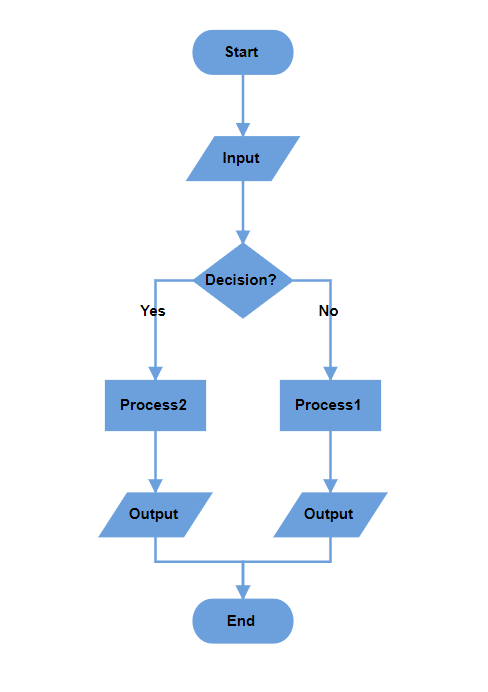
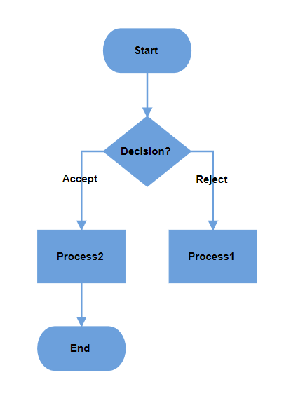

# Flowchart Layout in Blazor Diagram Component

The flowchart layout provides a visual representation of processes, workflows, systems, or algorithms. It uses standard symbols to depict different actions, with arrows connecting these symbols to indicate the flow or direction of the process. Flowcharts help communicate step-by-step sequences, making complex processes easier to understand and communicate.

## How to Use Common Flowchart Symbols

Different flowchart symbols have different meanings that are used to represent various states in flowchart. The following table describes the most common flowchart symbols that are used in creating flowchart.

|Symbol|Shape name|Description|
|---|---|---|
||[Terminator](https://help.syncfusion.com/cr/blazor/Syncfusion.Blazor.Diagram.NodeFlowShapes.html#Syncfusion_Blazor_Diagram_NodeFlowShapes_Terminator)|Indicates the beginning and ending of the process.|
||[Data](https://help.syncfusion.com/cr/blazor/Syncfusion.Blazor.Diagram.NodeFlowShapes.html#Syncfusion_Blazor_Diagram_NodeFlowShapes_Data)|Indicates data input or output for a process.|
||[Process](https://help.syncfusion.com/cr/blazor/Syncfusion.Blazor.Diagram.NodeFlowShapes.html#Syncfusion_Blazor_Diagram_NodeFlowShapes_Process)|Represents an operation or set of operations and data manipulations.|
||[Decision](https://help.syncfusion.com/cr/blazor/Syncfusion.Blazor.Diagram.NodeFlowShapes.html#Syncfusion_Blazor_Diagram_NodeFlowShapes_Decision)|Shows a branching point where the decision is made to choose one of the two paths|
||[Document](https://help.syncfusion.com/cr/blazor/Syncfusion.Blazor.Diagram.NodeFlowShapes.html#Syncfusion_Blazor_Diagram_NodeFlowShapes_Document)|Represents a single document or report in the process.|
||[PreDefinedProcess](https://help.syncfusion.com/cr/blazor/Syncfusion.Blazor.Diagram.NodeFlowShapes.html#Syncfusion_Blazor_Diagram_NodeFlowShapes_PreDefinedProcess)|Represents a sequence of actions that combine to perform a specific task that is defined elsewhere.|
||[DirectData](https://help.syncfusion.com/cr/blazor/Syncfusion.Blazor.Diagram.NodeFlowShapes.html#Syncfusion_Blazor_Diagram_NodeFlowShapes_DirectData)|Represents a collection of information that allows searching, sorting, and filtering.|
||[StoredData](https://help.syncfusion.com/cr/blazor/Syncfusion.Blazor.Diagram.NodeFlowShapes.html#Syncfusion_Blazor_Diagram_NodeFlowShapes_StoredData)|Represents a step where data get stored within a process.|
||[ManualInput](https://help.syncfusion.com/cr/blazor/Syncfusion.Blazor.Diagram.NodeFlowShapes.html#Syncfusion_Blazor_Diagram_NodeFlowShapes_ManualInput)|Represents the manual input of data into a field or step in a process.|
||[ManualOperation](https://help.syncfusion.com/cr/blazor/Syncfusion.Blazor.Diagram.NodeFlowShapes.html#Syncfusion_Blazor_Diagram_NodeFlowShapes_ManualOperation)|Represents an operation in a process that must be done manually, not automatically.|
||[Preparation](https://help.syncfusion.com/cr/blazor/Syncfusion.Blazor.Diagram.NodeFlowShapes.html#Syncfusion_Blazor_Diagram_NodeFlowShapes_Preparation)|Represents a setup or initialization process to another step in the process.|
||[OffPageReference](https://help.syncfusion.com/cr/blazor/Syncfusion.Blazor.Diagram.NodeFlowShapes.html#Syncfusion_Blazor_Diagram_NodeFlowShapes_OffPageReference)|Represents a labeled connector used to link two flowcharts on different pages.|
||[MultiDocument](https://help.syncfusion.com/cr/blazor/Syncfusion.Blazor.Diagram.NodeFlowShapes.html#Syncfusion_Blazor_Diagram_NodeFlowShapes_MultiDocument)|Represents multiple documents or reports in the process.|
|||Represents a direction of flow from one step to another. It will get created automatically based on the relationship between the parent and child.|

```csharp
@using Syncfusion.Blazor.Diagram

<SfDiagramComponent @ref="Diagram" Width="100%" Height="900px" ConnectorCreating="@OnConnectorCreating" NodeCreating="@OnNodeCreating" DataLoaded="@OnDataLoaded">
    <DataSourceSettings ID="Id" ParentID="ParentId" DataSource="DataSource"> </DataSourceSettings>
    <Layout Type="LayoutType.Flowchart" HorizontalSpacing="50" Orientation="LayoutOrientation.TopToBottom" VerticalSpacing="50" FlowchartLayoutSettings="@flowchartSettings">
    </Layout>
</SfDiagramComponent>

@code
{
    //Initialize diagram component.
    SfDiagramComponent Diagram;
    //Initialize flowchart layout settings.
    FlowchartLayoutSettings flowchartSettings = new FlowchartLayoutSettings()
    {
        YesBranchDirection = BranchDirection.LeftInFlow,
        NoBranchDirection = BranchDirection.RightInFlow
    };

    private void OnDataLoaded(object obj)
    {
        for (int i = 0; i < Diagram.Connectors.Count; i++)
        {
            Connector connector = Diagram.Connectors[i];
            Node node = Diagram.GetObject(connector.TargetID) as Node;
            Node srcNode = Diagram.GetObject(connector.SourceID) as Node;
            if (node.Data != null && node.Data is ItemInfo itemInfo)
            {
                if (itemInfo.Label != null && itemInfo.Label.Count > 0)
                {
                    if (itemInfo.ParentId.IndexOf((srcNode.Data as ItemInfo).Id) != -1)
                    {
                        var parentIndex = itemInfo.ParentId.IndexOf((srcNode.Data as ItemInfo).Id);
                        if (itemInfo.Label.Count > parentIndex)
                        {
                            connector.Annotations = new DiagramObjectCollection<PathAnnotation>()
                            {
                                new PathAnnotation() { Content = itemInfo.Label[parentIndex], Style = new TextStyle(){ Bold = true} }
                            };
                        }
                    }
                }
            }
        }
    }
    //Creates connectors with some default values.
    private void OnConnectorCreating(IDiagramObject obj)
    {
        if (obj is Connector connector)
        {
            connector.Type = ConnectorSegmentType.Orthogonal;
        }
    }
    //Creates nodes with some default values.
    private void OnNodeCreating(IDiagramObject obj)
    {
        Node node = obj as Node;
        if (node.Data != null && node.Data is ItemInfo)
        {
            ItemInfo employeeDetails = node.Data as ItemInfo;
            node.Width = employeeDetails._Width;
            node.Height = employeeDetails._Height;
            if (employeeDetails._Shape == "StartOrEnd")
            {
                node.Shape = new FlowShape() { Shape = NodeFlowShapes.Terminator };
            }
            else
                node.Shape = new FlowShape() { Shape = (NodeFlowShapes)Enum.Parse(typeof(NodeFlowShapes), employeeDetails._Shape.ToString()) };
            node.Style.Fill = employeeDetails._Color;
            node.Style.StrokeColor = employeeDetails._Color;
            node.Annotations = new DiagramObjectCollection<ShapeAnnotation>()
            {
                new ShapeAnnotation(){ Content = employeeDetails.Name, Style = new TextStyle(){ Color = "white", Bold = true} }
            };
        }
    }
    //Initialize data source collection.
    public List<ItemInfo> DataSource = new List<ItemInfo>(){
        new ItemInfo()
        {
            Id = "1",
            Name = "Start",
            _Shape = "StartOrEnd",
            _Width = 80,
            _Height = 35,
            _Color = "#6CA0DC"
        },
        new ItemInfo()
        {
            Id = "2",
            Name = "Input",
            ParentId = new List<string> { "1" },
            _Shape = "Data",
            _Width = 90,
            _Height = 35,
            _Color = "#6CA0DC"
        },
        new ItemInfo()
        {
            Id = "3",
            Name = "Decision?",
            ParentId = new List<string> { "2" },
            _Shape = "Decision",
            _Width = 80,
            _Height = 60,
            _Color = "#6CA0DC"
        },
        new ItemInfo()
        {
            Id = "4",
            Label = new List<string> { "No" },
            Name = "Process1",
            ParentId = new List<string> { "3" },
            _Shape = "Process",
            _Width = 80,
            _Height = 40,
            _Color = "#6CA0DC"
        },
        new ItemInfo()
        {
            Id = "5",
            Label = new List<string> { "Yes" },
            Name = "Process2",
            ParentId = new List<string>() { "3" },
            _Shape = "Process",
            _Width = 80,
            _Height = 40,
            _Color = "#6CA0DC"
        },
        new ItemInfo()
        {
            Id = "6",
            Name = "Output",
            ParentId = new List<string> { "5" },
            _Shape = "Data",
            _Width = 90,
            _Height = 35,
            _Color = "#6CA0DC"
        },
        new ItemInfo()
        {
            Id = "7",
            Name = "Output",
            ParentId = new List<string> { "4" },
            _Shape = "Data",
            _Width = 90,
            _Height = 35,
            _Color = "#6CA0DC"
        },
        new ItemInfo()
        {
            Id = "8",
                Name = "End",
                ParentId = new List<string> { "6","7" },
                _Shape = "Terminator",
                _Width = 80,
                _Height = 35,
                _Color = "#6CA0DC"
        },
    };
    public class ItemInfo
    {
        public string Name { get; set; }
        public string Id { get; set; }
        public List<string> Label { get; set; }
        public List<string> ParentId { get; set; }
        public string _Shape { get; set; }
        public double _Width { get; set; }
        public double _Height { get; set; }
        public string _Color { get; set; }
    }
}
```


>**Note:** When rendering a flowchart layout using a data source, connector labels must be applied manually in the [DataLoaded](https://help.syncfusion.com/cr/blazor/Syncfusion.Blazor.Diagram.SfDiagramComponent.html#Syncfusion_Blazor_Diagram_SfDiagramComponent_DataLoaded) event.



A complete working sample can be downloaded from [GitHub](https://github.com/SyncfusionExamples/Blazor-Diagram-Examples/tree/master/UG-Samples/Layout/FlowchartLayout/FlowchartLayout).

## How to Customize Flowchart Layout Orientation

The sequence of a node's direction can be customized by flowchart's orientation, either vertically from top to bottom or horizontally from left to right. The [Orientation](https://help.syncfusion.com/cr/blazor/Syncfusion.Blazor.Diagram.Layout.html#Syncfusion_Blazor_Diagram_Layout_Orientation) property of the layout class allows you to define the flow direction for the flowchart as either [TopToBottom](https://help.syncfusion.com/cr/blazor/Syncfusion.Blazor.Diagram.LayoutOrientation.html#Syncfusion_Blazor_Diagram_LayoutOrientation_TopToBottom) or [LeftToRight](https://help.syncfusion.com/cr/blazor/Syncfusion.Blazor.Diagram.LayoutOrientation.html#Syncfusion_Blazor_Diagram_LayoutOrientation_LeftToRight).

### How to Arrange Layout Using TopToBottom Orientation

This orientation arranges elements vertically from top to bottom. It is commonly used to represent sequential progression in a process.

```csharp
@using Syncfusion.Blazor.Diagram

<SfDiagramComponent @ref="Diagram"Height="500px">
    <Layout Type="LayoutType.Flowchart" Orientation="LayoutOrientation.TopToBottom">
    </Layout>
</SfDiagramComponent>
```


### How to Arrange Layout Using LeftToRight Orientation

This orientation arranges elements horizontally from left to right. It is used to represent processes or workflows that move sequentially across the page, emphasizing a linear progression of steps or actions.

```csharp
@using Syncfusion.Blazor.Diagram

<SfDiagramComponent @ref="Diagram"Height="500px">
    <Layout Type="LayoutType.Flowchart" Orientation="LayoutOrientation.LeftToRight">
    </Layout>
</SfDiagramComponent>
```


## How to Customize Decision Output Directions

The decision symbol represents a question or condition that leads to different paths based on a binary outcome (Yes/No, True/False). Customize the output direction of these paths using the [YesBranchDirection](https://help.syncfusion.com/cr/blazor/Syncfusion.Blazor.Diagram.FlowchartLayoutSettings.html#Syncfusion_Blazor_Diagram_FlowchartLayoutSettings_YesBranchDirection) and [NoBranchDirection](https://help.syncfusion.com/cr/blazor/Syncfusion.Blazor.Diagram.FlowchartLayoutSettings.html#Syncfusion_Blazor_Diagram_FlowchartLayoutSettings_NoBranchDirection) properties of the [FlowchartLayoutSettings](https://help.syncfusion.com/cr/blazor/Syncfusion.Blazor.Diagram.FlowchartLayoutSettings.html).

[Left In Flow](https://help.syncfusion.com/cr/blazor/Syncfusion.Blazor.Diagram.BranchDirection.html#Syncfusion_Blazor_Diagram_BranchDirection_LeftInFlow) - Places the branch to the left of the decision symbol.

[Right In Flow](https://help.syncfusion.com/cr/blazor/Syncfusion.Blazor.Diagram.BranchDirection.html#Syncfusion_Blazor_Diagram_BranchDirection_RightInFlow) - Places the branch to the right of the decision symbol.

[Same As Flow](https://help.syncfusion.com/cr/blazor/Syncfusion.Blazor.Diagram.BranchDirection.html#Syncfusion_Blazor_Diagram_BranchDirection_SameAsFlow) - Aligns the branch in the same direction as the flow of the decision symbol.

The following table will explain the pictorial representation of the behavior:

|YesBranchDirection| NoBranchDirection | TopToBottom | LeftToRight |
|---|---|---|---|
| Left In Flow |Right In Flow|||
| Right In Flow |Left In Flow || |
| Same As Flow |Right In Flow || |
| Right In Flow | Same As Flow || |
|Same As Flow |Same As Flow|||

>**Note:** If both branch directions are the same, the **Yes** branch is prioritized.

You can download a complete working sample from [GitHub](https://github.com/SyncfusionExamples/Blazor-Diagram-Examples/tree/master/UG-Samples/Layout/FlowchartLayout/FlowchartLayoutSettings).

### How to Define Custom Yes and No Branch Values

The decision symbol produces two branches: **Yes** and **No**. If the output branch connector text value matches the values in the [YesBranchValues](https://help.syncfusion.com/cr/blazor/Syncfusion.Blazor.Diagram.FlowchartLayoutSettings.html#Syncfusion_Blazor_Diagram_FlowchartLayoutSettings_YesBranchValues) property of [FlowchartLayoutSettings](https://help.syncfusion.com/cr/blazor/Syncfusion.Blazor.Diagram.FlowchartLayoutSettings.html), it is considered the **Yes** branch. Similarly, if the connector text value matches the values in the [NoBranchValues](https://help.syncfusion.com/cr/blazor/Syncfusion.Blazor.Diagram.FlowchartLayoutSettings.html#Syncfusion_Blazor_Diagram_FlowchartLayoutSettings_NoBranchValues) property, it will be considered as the **No** branch. By default, [YesBranchValues](https://help.syncfusion.com/cr/blazor/Syncfusion.Blazor.Diagram.FlowchartLayoutSettings.html#Syncfusion_Blazor_Diagram_FlowchartLayoutSettings_YesBranchValues) property contains **Yes** and **True** string values and the [NoBranchValues](https://help.syncfusion.com/cr/blazor/Syncfusion.Blazor.Diagram.FlowchartLayoutSettings.html#Syncfusion_Blazor_Diagram_FlowchartLayoutSettings_NoBranchValues) property contains **No** and **False** string values.  

Any text value can be given as a connector text to describe the flow. Also, any string value can be given in the [YesBranchValues](https://help.syncfusion.com/cr/blazor/Syncfusion.Blazor.Diagram.FlowchartLayoutSettings.html#Syncfusion_Blazor_Diagram_FlowchartLayoutSettings_YesBranchValues) and [NoBranchValues](https://help.syncfusion.com/cr/blazor/Syncfusion.Blazor.Diagram.FlowchartLayoutSettings.html#Syncfusion_Blazor_Diagram_FlowchartLayoutSettings_NoBranchValues). To decide the flow based on if or else, the connector text should match the values in the [YesBranchValues](https://help.syncfusion.com/cr/blazor/Syncfusion.Blazor.Diagram.FlowchartLayoutSettings.html#Syncfusion_Blazor_Diagram_FlowchartLayoutSettings_YesBranchValues) and [NoBranchValues](https://help.syncfusion.com/cr/blazor/Syncfusion.Blazor.Diagram.FlowchartLayoutSettings.html#Syncfusion_Blazor_Diagram_FlowchartLayoutSettings_NoBranchValues).

```csharp
@using Syncfusion.Blazor.Diagram

<SfDiagramComponent @ref="Diagram" Width="100%" Height="900px" ConnectorCreating="@OnConnectorCreating" NodeCreating="@OnNodeCreating" DataLoaded="@OnDataLoaded">
    <DataSourceSettings ID="Id" ParentID="ParentId" DataSource="DataSource"> </DataSourceSettings>
    <Layout Type="LayoutType.Flowchart" HorizontalSpacing="50" Orientation="LayoutOrientation.TopToBottom" VerticalSpacing="50" FlowchartLayoutSettings="@flowchartSettings">
    </Layout>
</SfDiagramComponent>

@code
{
    //Initialize diagram component.
    SfDiagramComponent Diagram;
    //Initialize flowchart layout settings.
    FlowchartLayoutSettings flowchartSettings = new FlowchartLayoutSettings()
    {
        YesBranchValues = new List<string> { "Accept", "Yes" },
        NoBranchValues = new List<string> { "Reject", "No" },
    };

    private void OnDataLoaded(object obj)
    {
        for (int i = 0; i < Diagram.Connectors.Count; i++)
        {
            Connector connector = Diagram.Connectors[i];
            Node node = Diagram.GetObject(connector.TargetID) as Node;
            Node srcNode = Diagram.GetObject(connector.SourceID) as Node;
            if (node.Data != null && node.Data is ItemInfo itemInfo)
            {
                if (itemInfo.Label != null && itemInfo.Label.Count > 0)
                {
                    if (itemInfo.ParentId.IndexOf((srcNode.Data as ItemInfo).Id) != -1)
                    {
                        var parentIndex = itemInfo.ParentId.IndexOf((srcNode.Data as ItemInfo).Id);
                        if (itemInfo.Label.Count > parentIndex)
                        {
                            connector.Annotations = new DiagramObjectCollection<PathAnnotation>()
                            {
                                new PathAnnotation() { Content = itemInfo.Label[parentIndex], Style = new TextStyle(){ Bold = true} }
                            };
                        }
                    }
                }
            }
        }
    }
    //Creates connectors with some default values.
    private void OnConnectorCreating(IDiagramObject obj)
    {
        if (obj is Connector connector)
        {
            connector.Type = ConnectorSegmentType.Orthogonal;
        }
    }
    //Creates nodes with some default values.
    private void OnNodeCreating(IDiagramObject obj)
    {
        Node node = obj as Node;
        if (node.Data != null && node.Data is ItemInfo)
        {
            ItemInfo employeeDetails = node.Data as ItemInfo;
            node.Width = employeeDetails._Width;
            node.Height = employeeDetails._Height;
            if (employeeDetails._Shape == "StartOrEnd")
            {
                node.Shape = new FlowShape() { Shape = NodeFlowShapes.Terminator };
            }
            else
                node.Shape = new FlowShape() { Shape = (NodeFlowShapes)Enum.Parse(typeof(NodeFlowShapes), employeeDetails._Shape.ToString()) };
            node.Style.Fill = employeeDetails._Color;
            node.Style.StrokeColor = employeeDetails._Color;
            node.Annotations = new DiagramObjectCollection<ShapeAnnotation>()
            {
                new ShapeAnnotation(){ Content = employeeDetails.Name, Style = new TextStyle(){ Color = "white", Bold = true} }
            };
        }
    }
    //Initialize data source collection.
    public List<ItemInfo> DataSource = new List<ItemInfo>(){
        new ItemInfo()
        {
            Id = "1",
            Name = "Start",
            _Shape = "StartOrEnd",
            _Width = 100,
            _Height = 50,
            _Color = "#6CA0DC"
        },
        new ItemInfo()
        {
            Id = "2",
            Name = "Decision?",
            ParentId = new List<string> { "1" },
            _Shape = "Decision",
            _Width = 100,
            _Height = 80,
            _Color = "#6CA0DC"
        },
        new ItemInfo()
        {
            Id = "3",
            Label = new List<string> { "Reject" },
            Name = "Process1",
            ParentId = new List<string> { "2" },
            _Shape = "Process",
            _Width = 100,
            _Height = 60,
            _Color = "#6CA0DC"
        },
        new ItemInfo()
        {
            Id = "4",
            Label = new List<string> { "Accept" },
            Name = "Process2",
            ParentId = new List<string>() { "2" },
            _Shape = "Process",
            _Width = 100,
            _Height = 60,
            _Color = "#6CA0DC"
        },
        new ItemInfo()
        {
            Id = "5",
            Name = "End",
            ParentId = new List<string> { "4"},
            _Shape = "Terminator",
            _Width = 100,
            _Height = 50,
            _Color = "#6CA0DC"
        },
    };
    public class ItemInfo
    {
        public string Name { get; set; }
        public string Id { get; set; }
        public List<string> Label { get; set; }
        public List<string> ParentId { get; set; }
        public string _Shape { get; set; }
        public double _Width { get; set; }
        public double _Height { get; set; }
        public string _Color { get; set; }
    }
}
```


A complete working sample can be downloaded from [GitHub](https://github.com/SyncfusionExamples/Blazor-Diagram-Examples/tree/master/UG-Samples/Layout/FlowchartLayout/CustomYesOrNoBranch).



## How to Update Spacing Between Nodes 

Control the spacing between node using the [HorizontalSpacing](https://help.syncfusion.com/cr/blazor/Syncfusion.Blazor.Diagram.Layout.html#Syncfusion_Blazor_Diagram_Layout_HorizontalSpacing) and [VerticalSpacing](https://help.syncfusion.com/cr/blazor/Syncfusion.Blazor.Diagram.Layout.html#Syncfusion_Blazor_Diagram_Layout_VerticalSpacing) in the layout. These properties adjust the distance between nodes horizontally and vertically, giving you precise control over the appearance and organization of your diagram.