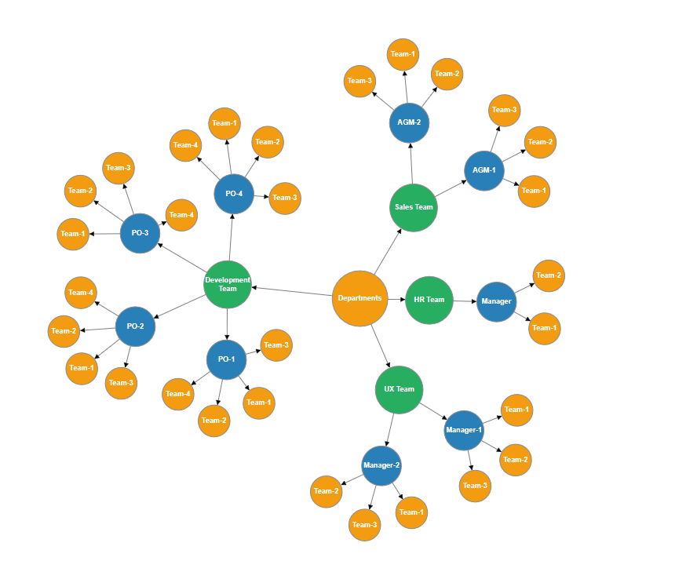
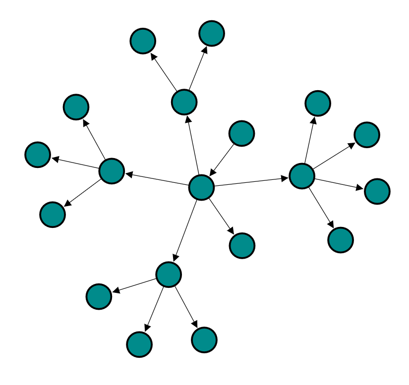

# Force Directed Tree Layout in Blazor Diagram Component

A Force-Directed Tree Layout is a graph visualization technique that arranges nodes based on simulated physical forces. Each node repels others like particles, while connectors act as springs pulling connected nodes together. This balance of repulsive and attractive forces creates a visually clear and well-organized layout. The final layout is achieved when the system reaches a state of equilibrium, where all forces are balanced.

To use this layout, set the layout [Type](https://help.syncfusion.com/cr/blazor/Syncfusion.Blazor.Diagram.Layout.html#Syncfusion_Blazor_Diagram_Layout_Type) to [ForceDirectedTree](https://help.syncfusion.com/cr/blazor/Syncfusion.Blazor.Diagram.LayoutType.html#Syncfusion_Blazor_Diagram_LayoutType_ForceDirectedTree) and configure the ForceDirectedTreeLayoutSettings.

The following example illustrates how the nodes are positioned by a force directed tree layout.

```csharp
@using Syncfusion.Blazor.Diagram

<SfDiagramComponent @ref="diagram" ID="diagram" Height="700px" @bind-Nodes="@Nodes" @bind-Connectors="@Connectors">
    <Layout Type="LayoutType.ForceDirectedTree" @bind-LayoutSettings="@LayoutSettings"></Layout>
    <SnapSettings Constraints="SnapConstraints.None"></SnapSettings>
</SfDiagramComponent>

@code {
    public SfDiagramComponent diagram;
    public DiagramObjectCollection<Node> Nodes = new();
    public DiagramObjectCollection<Connector> Connectors = new();
    ForceDirectedTreeLayoutSettings LayoutSettings = new ForceDirectedTreeLayoutSettings
    {
        RepulsionStrength = 8000,
        AttractionStrength = 0.7,
        MaximumIteration = 500,
        ConnectorLength = 150
    };

    protected override void OnInitialized()
    {
        InitializeCollection();
    }

    public void InitializeCollection()
    {
        string[] departments = { "Engineering", "Sales", "Marketing", "Operations" };
        string[] teams = { "Core", "Mobile", "Web", "Data" };
        Node parent = CreateNode("ceo", "CEO", "#2c3e50");
        Nodes.Add(parent);
        for (int i = 0; i < 4; i++)
        {
            string deptName = departments[i];
            Node child1 = CreateNode($"vp-{deptName.ToLower()}", $"VP of {deptName}", "#3498db");
            Nodes.Add(child1);
            for (int j = 0; j < 4; j++)
            {
                string teamName = teams[j];
                Node child2 = CreateNode($"dir-{deptName.ToLower()}-{teamName.ToLower()}", $"{teamName} Director", "#90caf9");
                Nodes.Add(child2);
                for (int k = 0; k < 1; k++)
                {
                    Node child3 = CreateNode($"lead-{deptName.ToLower()}-{teamName.ToLower()}", $"{teamName} Lead", "#e3f2fd");
                    Nodes.Add(child3);
                    Connectors.Add(CreateConnector(child2.ID, child3.ID));
                }
                Connectors.Add(CreateConnector(child1.ID, child2.ID));
            }
            Connectors.Add(CreateConnector(parent.ID, child1.ID));
        }
    }

    private Node CreateNode(string id, string label, string fillColor) => new Node
    {
        ID = id,
        Width = 60,
        Height = 60,
        Shape = new BasicShape() { Shape = NodeBasicShapes.Ellipse },
        Annotations = new DiagramObjectCollection<ShapeAnnotation>() { new ShapeAnnotation{ Content = label } },
        Style = new ShapeStyle() { Fill = fillColor }
    };

    private Connector CreateConnector(string sourceId, string targetId) => new Connector
    {
        ID = $"{sourceId}-{targetId}",
        SourceID = sourceId,
        TargetID = targetId,
        TargetDecorator = new DecoratorSettings { Shape = DecoratorShape.None }
    };
}
```
You can download a complete working sample from [GitHub](https://github.com/SyncfusionExamples/Blazor-Diagram-Examples/tree/master/UG-Samples/Layout/ForceDirectedTreeLayout)



You can create a Force Directed Tree layout with DataSource. The following code demonstrates how to render a Force Directed Tree layout using DataSource.

```csharp
@using Syncfusion.Blazor.Diagram

<SfDiagramComponent Height="600px" NodeCreating="@OnNodeCreating">
    <DataSourceSettings ID="Id" ParentID="Manager" DataSource="DataSource"> </DataSourceSettings>
    <Layout Type="LayoutType.ForceDirectedTree" @bind-LayoutSettings="@forceDirectedSettings">
    </Layout>
    <SnapSettings Constraints="@SnapConstraints.None"></SnapSettings>
</SfDiagramComponent>

@code
{
    ForceDirectedTreeLayoutSettings forceDirectedSettings = new ForceDirectedTreeLayoutSettings()
    {
        ConnectorLength = 100,
        AttractionStrength = 0.7,
        RepulsionStrength = 6000,
        MaximumIteration = 350
    };

    private void OnNodeCreating(IDiagramObject obj)
    {
        Node node = obj as Node;
        node.Height = 40;
        node.Width = 40;
        node.Shape = new BasicShape()
        {
            Type = NodeShapes.Basic,
            Shape = NodeBasicShapes.Ellipse,
        };
        node.Style = new ShapeStyle() { Fill = "darkcyan", StrokeWidth = 3, StrokeColor = "Black" };
    }

    public class ForceDirectedDetails
    {
        public string Id { get; set; }
        public string Role { get; set; }
        public string Manager { get; set; }
    }

    public List<ForceDirectedDetails> DataSource = new List<ForceDirectedDetails>()
    {
        new ForceDirectedDetails()   { Id= "parent", Role= "Board" },
        new ForceDirectedDetails()   { Id= "1", Role= "General Manager", Manager= "parent" },
        new ForceDirectedDetails()   { Id= "2", Role= "Human Resource Manager", Manager= "1" },
        new ForceDirectedDetails()   { Id= "3", Role= "Trainers", Manager= "2" },
        new ForceDirectedDetails()   { Id= "4", Role= "Recruiting Team", Manager= "2" },
        new ForceDirectedDetails()   { Id= "5", Role= "Finance Asst. Manager", Manager= "2" },
        new ForceDirectedDetails()   { Id= "6", Role= "Design Manager", Manager= "1" },
        new ForceDirectedDetails()   { Id= "7", Role= "Design Supervisor", Manager= "6" },
        new ForceDirectedDetails()   { Id= "8", Role= "Development Supervisor", Manager= "6" },
        new ForceDirectedDetails()   { Id= "9", Role= "Drafting Supervisor", Manager= "6" },
        new ForceDirectedDetails()   { Id= "10", Role= "Operation Manager", Manager= "1" },
        new ForceDirectedDetails()   { Id= "11", Role= "Statistic Department", Manager= "10" },
        new ForceDirectedDetails()   { Id= "12", Role= "Logistic Department", Manager= "10" },
        new ForceDirectedDetails()   { Id= "16", Role= "Marketing Manager", Manager= "1" },
        new ForceDirectedDetails()   { Id= "17", Role= "Oversea sales Manager", Manager= "16" },
        new ForceDirectedDetails()   { Id= "18", Role= "Petroleum Manager", Manager= "16" },
        new ForceDirectedDetails()   { Id= "20", Role= "Service Dept. Manager", Manager= "16" },
        new ForceDirectedDetails()   { Id= "21", Role= "Quality Department", Manager= "16" }
    };
}
```
You can download a complete working sample from [GitHub](https://github.com/SyncfusionExamples/Blazor-Diagram-Examples/tree/master/UG-Samples/Layout/ForceDirectedTreeDataSource)



## How to Customize Layout Properties

The ForceDirectedTreeLayoutSettings class gives you control over the physics-based simulation that arranges your nodes. By modifying properties such as node repulsion, connector attraction, and the number of simulation iterations, you can prevent node overlap, improve readability, and create a visually balanced and organized graph that best represents your data.

### How to Update Connector Length

The ConnectorLength property defines the ideal length for the connectors. The algorithm will attempt to position connected nodes so that the distance between them is close to this value. Adjusting this property can help control the overall density and spread of the diagram.

The following code demonstrates how to set a custom connector length.
```
@using Syncfusion.Blazor.Diagram

@code {
    ForceDirectedTreeLayoutSettings LayoutSettings = new ForceDirectedTreeLayoutSettings
    {
        // Sets the ideal length of the connectors to 200
        ConnectorLength = 200 
    };
}
```

### How to Update Maximum Iteration

The MaximumIteration property specifies the number of times the layout algorithm should run. The layout is generated by iteratively applying forces and adjusting node positions. A higher number of iterations can result in a more stable and aesthetically pleasing layout but will require more processing time. This value serves as a limit to ensure the layout process completes.

The following code demonstrates how to set a custom maximum iteration.
```
@using Syncfusion.Blazor.Diagram

@code {
    ForceDirectedTreeLayoutSettings LayoutSettings = new ForceDirectedTreeLayoutSettings
    {
        // Allows the simulation to run for up to 500 steps
        MaximumIteration = 500 
    };
}
```
### How to Update Repulsion Strength

The RepulsionStrength property controls how strongly nodes push each other away. Every node in the diagram exerts a repulsive force on every other node to prevent them from overlapping. Increasing this value will result in more space between nodes, which can help in visualizing dense graphs.

The following example increases the repulsion strength to spread out nodes further.
```
@using Syncfusion.Blazor.Diagram

@code {
    ForceDirectedTreeLayoutSettings LayoutSettings = new ForceDirectedTreeLayoutSettings
    {
        // Increases the force that pushes nodes apart
        RepulsionStrength = 10000 
    };
}
```
### How to Update Attraction Strength

The AttractionStrength property determines the intensity of the force that pulls connected nodes together. Connectors act like springs, and this property controls the stiffness of those springs. A higher value will create a stronger pull between connected nodes, causing them to cluster more tightly. This force works in balance with RepulsionStrength.

The following example sets a higher attraction strength to pull connected nodes closer.

```
@using Syncfusion.Blazor.Diagram

@code {
    ForceDirectedTreeLayoutSettings LayoutSettings = new ForceDirectedTreeLayoutSettings
    {
        // Increases the spring-like force along connectors
        AttractionStrength = 0.9 
    };
}
```

## See also

* [How to create a node](../nodes/nodes)

* [How to create a connector](../connectors/connectors)

* [How to generate the organization chart](./organizational-chart)

* [How to generate the hierarchical layout](./hierarchical-layout)