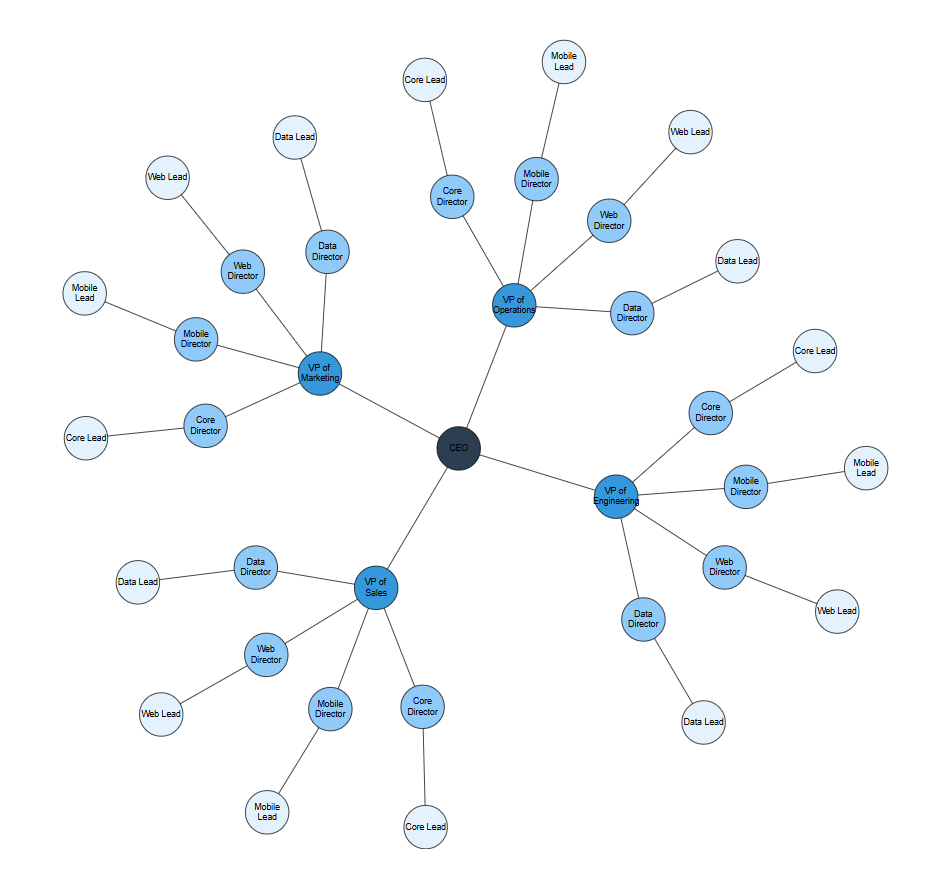

# Force-Directed Tree Layout in Blazor Diagram Component

The Force-Directed Tree Layout is a graph visualization technique that arranges nodes using simulated physical forces. This layout is ideal for visualizing complex relationships such as social networks, organizational structures, dependency graphs, and knowledge maps. 

In this layout:

- Each node repels other nodes, similar to charged particles.
- Connectors act like springs, pulling connected nodes closer together.
- The interplay of repulsive and attractive forces produces a clear, well-organized structure.

To enable this layout, set the layout Type to **ForceDirectedTree** and configure the [ForceDirectedTreeLayoutSettings](https://help.syncfusion.com/cr/blazor/Syncfusion.Blazor.Diagram.Layout.html#Syncfusion_Blazor_Diagram_Layout_FlowchartLayoutSettings).

The following example demonstrates how nodes are automatically positioned using the force‑directed tree layout.

```csharp
@using Syncfusion.Blazor.Diagram

<SfDiagramComponent @ref="diagram" ID="diagram" Height="700px" @bind-Nodes="@Nodes" @bind-Connectors="@Connectors">
    <Layout Type="LayoutType.ForceDirectedTree" @bind-LayoutSettings="@LayoutSettings"></Layout>
    <SnapSettings Constraints="SnapConstraints.None"></SnapSettings>
</SfDiagramComponent>

@code {
    private SfDiagramComponent diagram;
    private DiagramObjectCollection<Node> Nodes = new();
    private DiagramObjectCollection<Connector> Connectors = new();
    private ForceDirectedTreeLayoutSettings LayoutSettings = new ForceDirectedTreeLayoutSettings
    {
        RepulsionStrength = 8000,
        AttractionStrength = 0.7,
        MaximumIteration = 500,
        ConnectorLength = 150
    };

    protected override void OnInitialized()
    {
        InitializeCollection();
    }

    private void InitializeCollection()
    {
        string[] departments = { "Engineering", "Sales", "Marketing", "Operations" };
        string[] teams = { "Core", "Mobile", "Web", "Data" };
        // Root node (CEO)
        Node ceo = CreateNode("ceo", "CEO", "#2c3e50");
        Nodes.Add(ceo);

        foreach (string dept in departments)
        {
            // VP node
            Node vp = CreateNode($"vp-{dept.ToLower()}", $"VP of {dept}", "#3498db");
            Nodes.Add(vp);
            Connectors.Add(CreateConnector(ceo.ID, vp.ID));

            foreach (string team in teams)
            {
                // Director node
                Node director = CreateNode(
                    $"dir-{dept.ToLower()}-{team.ToLower()}",
                    $"{team} Director",
                    "#90caf9"
                );
                Nodes.Add(director);
                Connectors.Add(CreateConnector(vp.ID, director.ID));

                // Lead node
                Node lead = CreateNode(
                    $"lead-{dept.ToLower()}-{team.ToLower()}",
                    $"{team} Lead",
                    "#e3f2fd"
                );
                Nodes.Add(lead);
                Connectors.Add(CreateConnector(director.ID, lead.ID));
            }
        }
    }

    private Node CreateNode(string id, string label, string fillColor) => new Node
    {
        ID = id,
        Width = 60,
        Height = 60,
        Shape = new BasicShape() { Shape = NodeBasicShapes.Ellipse },
        Annotations = new DiagramObjectCollection<ShapeAnnotation>() { new ShapeAnnotation{ Content = label } },
        Style = new ShapeStyle() { Fill = fillColor }
    };

    private Connector CreateConnector(string sourceId, string targetId) => new Connector
    {
        ID = $"{sourceId}-{targetId}",
        SourceID = sourceId,
        TargetID = targetId,
        TargetDecorator = new DecoratorSettings { Shape = DecoratorShape.None }
    };
}
```
A complete working sample can be downloaded from [GitHub](https://github.com/SyncfusionExamples/Blazor-Diagram-Examples/tree/master/UG-Samples/Layout/ForceDirectedTreeLayout)



A Force-Directed Tree layout can be created with [DataSource](https://help.syncfusion.com/cr/blazor/Syncfusion.Blazor.Diagram.DataSourceSettings.html#Syncfusion_Blazor_Diagram_DataSourceSettings_DataSource). The following code demonstrates how to render a Force-Directed Tree layout using DataSource.

```csharp
@using Syncfusion.Blazor.Diagram

<SfDiagramComponent Height="600px" NodeCreating="@OnNodeCreating">
    <DataSourceSettings ID="Id" ParentID="Manager" DataSource="DataSource"></DataSourceSettings>
    <Layout Type="LayoutType.ForceDirectedTree" @bind-LayoutSettings="@forceDirectedSettings"></Layout>
    <SnapSettings Constraints="@SnapConstraints.None"></SnapSettings>
</SfDiagramComponent>

@code
{
    private ForceDirectedTreeLayoutSettings forceDirectedSettings = new ForceDirectedTreeLayoutSettings()
    {
        ConnectorLength = 100,
        AttractionStrength = 0.7,
        RepulsionStrength = 6000,
        MaximumIteration = 350
    };

    private void OnNodeCreating(IDiagramObject obj)
    {
        Node node = obj as Node;
        node.Height = 40;
        node.Width = 40;
        node.Shape = new BasicShape()
        {
            Type = NodeShapes.Basic,
            Shape = NodeBasicShapes.Ellipse,
        };
        node.Style = new ShapeStyle() { Fill = "darkcyan", StrokeWidth = 3, StrokeColor = "Black" };
    }

    private class ForceDirectedDetails
    {
        public string Id { get; set; }
        public string Role { get; set; }
        public string Manager { get; set; }
    }

    private List<ForceDirectedDetails> DataSource = new List<ForceDirectedDetails>()
    {
        new ForceDirectedDetails() { Id = "parent", Role = "Board" },
        new ForceDirectedDetails() { Id = "1", Role = "General Manager", Manager = "parent" },
        new ForceDirectedDetails() { Id = "2", Role = "Human Resource Manager", Manager = "1" },
        new ForceDirectedDetails() { Id = "3", Role = "Trainers", Manager = "2" },
        new ForceDirectedDetails() { Id = "4", Role = "Recruiting Team", Manager = "2" },
        new ForceDirectedDetails() { Id = "5", Role = "Finance Asst. Manager", Manager = "2" },
        new ForceDirectedDetails() { Id = "6", Role = "Design Manager", Manager = "1" },
        new ForceDirectedDetails() { Id = "7", Role = "Design Supervisor", Manager = "6" },
        new ForceDirectedDetails() { Id = "8", Role = "Development Supervisor", Manager = "6" },
        new ForceDirectedDetails() { Id = "9", Role = "Drafting Supervisor", Manager = "6" },
        new ForceDirectedDetails() { Id = "10", Role = "Operation Manager", Manager = "1" },
        new ForceDirectedDetails() { Id = "11", Role = "Statistic Department", Manager = "10" },
        new ForceDirectedDetails() { Id = "12", Role = "Logistic Department", Manager = "10" },
        new ForceDirectedDetails() { Id = "16", Role = "Marketing Manager", Manager = "1" },
        new ForceDirectedDetails() { Id = "17", Role = "Oversea sales Manager", Manager = "16" },
        new ForceDirectedDetails() { Id = "18", Role = "Petroleum Manager", Manager = "16" },
        new ForceDirectedDetails() { Id = "20", Role = "Service Dept. Manager", Manager = "16" },
        new ForceDirectedDetails() { Id = "21", Role = "Quality Department", Manager = "16" }
    };
}
```
A complete working sample can be downloaded from [GitHub](https://github.com/SyncfusionExamples/Blazor-Diagram-Examples/tree/master/UG-Samples/Layout/ForceDirectedTreeDataSource)


## How to Customize Layout Properties

The `ForceDirectedTreeLayoutSettings` class provides fine‑grained control over the physics‑based simulation that arranges nodes in a Force‑Directed Tree layout. By adjusting properties such as node repulsion, connector attraction, and the number of simulation iterations, the following can be achieved:

- Prevent nodes from overlapping
- Enhance diagram readability
- Achieve a visually balanced and well‑organized graph

These settings allow tailoring the layout to best represent data, ensuring both clarity and aesthetic appeal.

### How to Update Connector Length

The [ConnectorLength](https://help.syncfusion.com/cr/blazor/Syncfusion.Blazor.Diagram.ForceDirectedTreeLayoutSettings.html#Syncfusion_Blazor_Diagram_ForceDirectedTreeLayoutSettings_ConnectorLength) property defines the ideal distance between connected nodes. The layout algorithm attempts to position nodes so that their separation is close to this value. Adjusting `ConnectorLength` helps control the overall density and spread of the diagram.

The following code demonstrates how to set a custom connector length.
```
@using Syncfusion.Blazor.Diagram

@code {
    private ForceDirectedTreeLayoutSettings LayoutSettings = new ForceDirectedTreeLayoutSettings
    {
        // Sets the ideal length of the connectors to 200
        ConnectorLength = 200 
    };
}
```
>**Note:** The minimum value for `ConnectorLength` is 30.

### How to Update Maximum Iteration

The [MaximumIteration](https://help.syncfusion.com/cr/blazor/Syncfusion.Blazor.Diagram.ForceDirectedTreeLayoutSettings.html#Syncfusion_Blazor_Diagram_ForceDirectedTreeLayoutSettings_MaximumIteration) property specifies the number of times the layout algorithm should run. The layout is generated by iteratively applying forces and adjusting node positions. A higher number of iterations can result in a more stable and aesthetically pleasing layout but will require more processing time. This value serves as a limit to ensure the layout process completes.

The following code demonstrates how to set a custom maximum iteration.
```
@using Syncfusion.Blazor.Diagram

@code {
    private ForceDirectedTreeLayoutSettings LayoutSettings = new ForceDirectedTreeLayoutSettings
    {
        // Allows the simulation to run for up to 500 steps
        MaximumIteration = 500 
    };
}
```
>**Note:** The minimum value for `MaximumIteration` is 100. Higher iteration values will increase the processing time required for the algorithm to complete.

### How to Update Repulsion Strength

The [RepulsionStrength](https://help.syncfusion.com/cr/blazor/Syncfusion.Blazor.Diagram.ForceDirectedTreeLayoutSettings.html#Syncfusion_Blazor_Diagram_ForceDirectedTreeLayoutSettings_RepulsionStrength) property controls how strongly nodes push each other away. Every node in the diagram exerts a repulsive force on every other node to prevent them from overlapping. Increasing this value will result in more space between nodes, which can help in visualizing dense graphs.

The following example increases the repulsion strength to spread out nodes further.
```
@using Syncfusion.Blazor.Diagram

@code {
    private ForceDirectedTreeLayoutSettings LayoutSettings = new ForceDirectedTreeLayoutSettings
    {
        // Increases the force that pushes nodes apart
        RepulsionStrength = 10000 
    };
}
```

>**Note:** The minimum value for `RepulsionStrength` is 3000. Higher values will cause the diagram to expand further, creating more space between nodes.

### How to Update Attraction Strength

The [AttractionStrength](https://help.syncfusion.com/cr/blazor/Syncfusion.Blazor.Diagram.ForceDirectedTreeLayoutSettings.html#Syncfusion_Blazor_Diagram_ForceDirectedTreeLayoutSettings_AttractionStrength) property determines the intensity of the force that pulls connected nodes together. Connectors act like springs, and this property controls the stiffness of those springs. A higher value will create a stronger pull between connected nodes, causing them to cluster more tightly. This force works in balance with `RepulsionStrength`.

The following example sets a higher attraction strength to pull connected nodes closer.

```
@using Syncfusion.Blazor.Diagram

@code {
    private ForceDirectedTreeLayoutSettings LayoutSettings = new ForceDirectedTreeLayoutSettings
    {
        // Increases the spring-like force along connectors
        AttractionStrength = 0.9 
    };
}
```
>**Note:**The minimum value for `AttractionStrength` is 0 and the maximum value is 1. Higher values will cause connected nodes to cluster more tightly together.

## See also

* [How to create a node](../nodes/nodes)

* [How to create a connector](../connectors/connectors)

* [How to generate the organization chart](./organizational-chart)

* [How to generate the hierarchical layout](./hierarchical-layout)